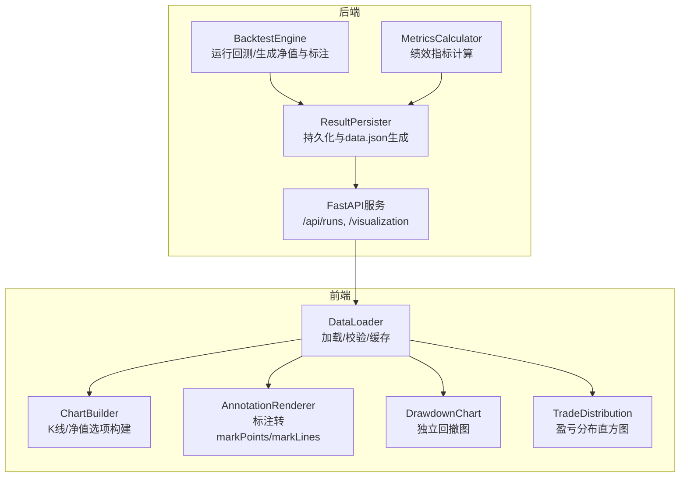
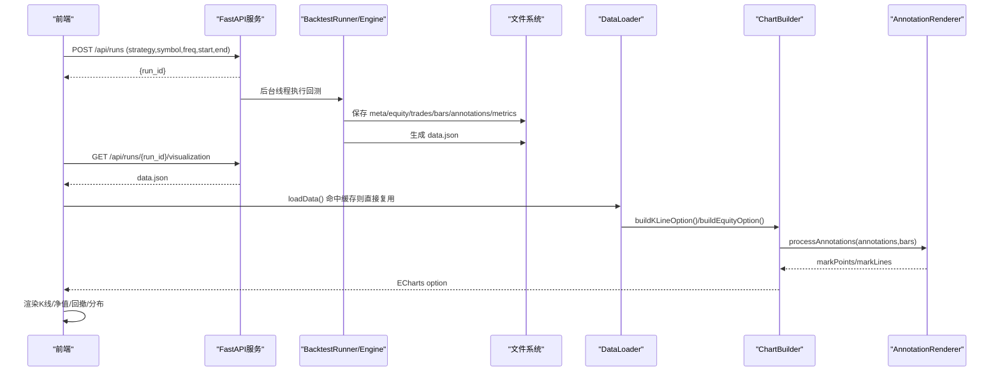
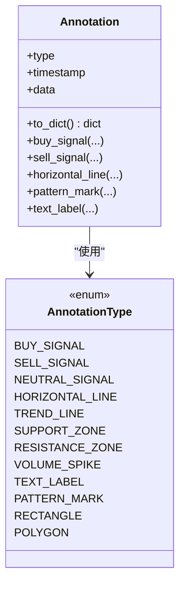
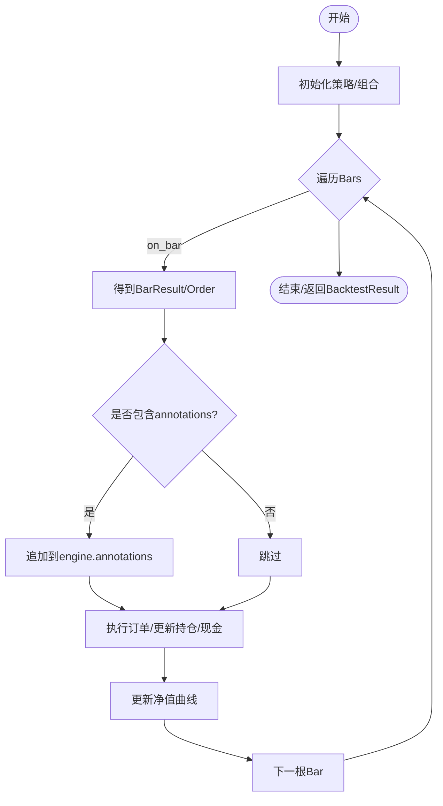
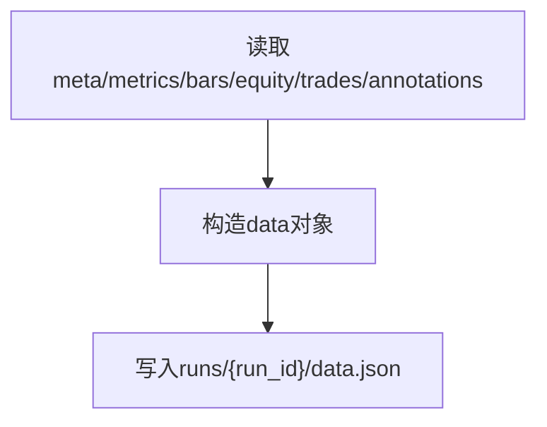
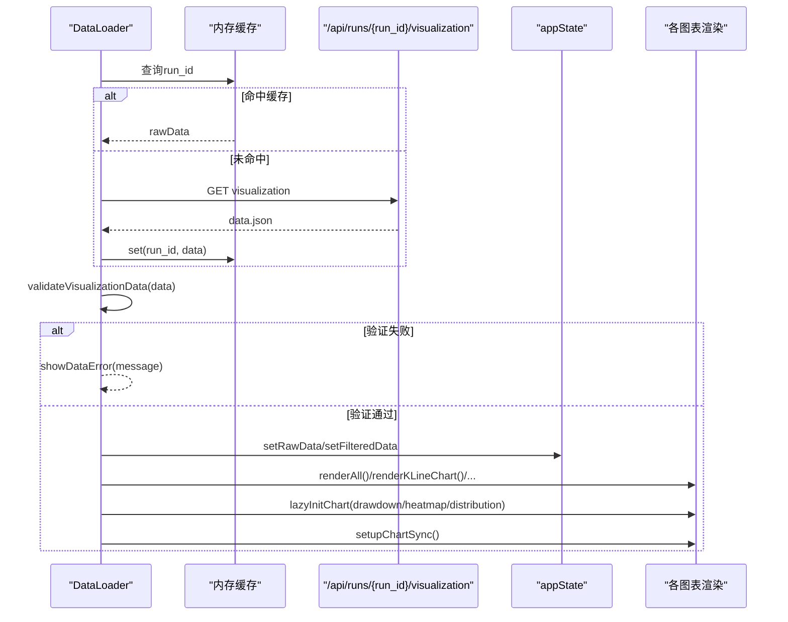
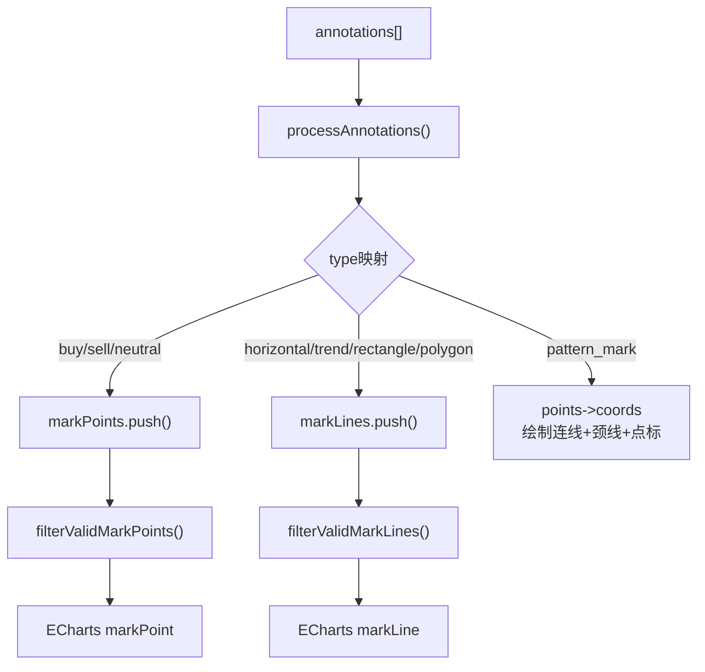
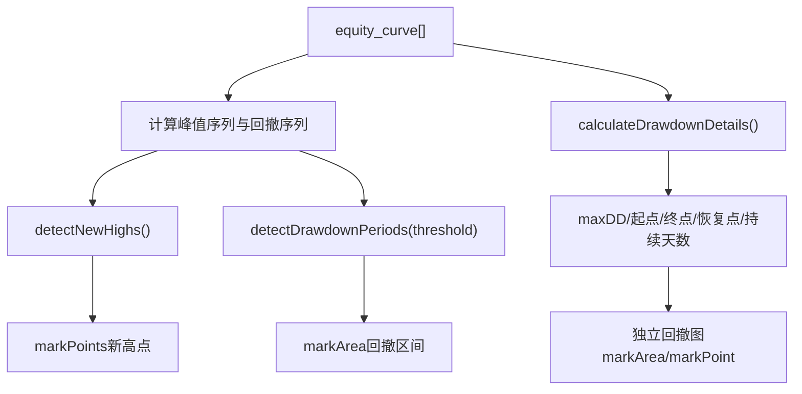
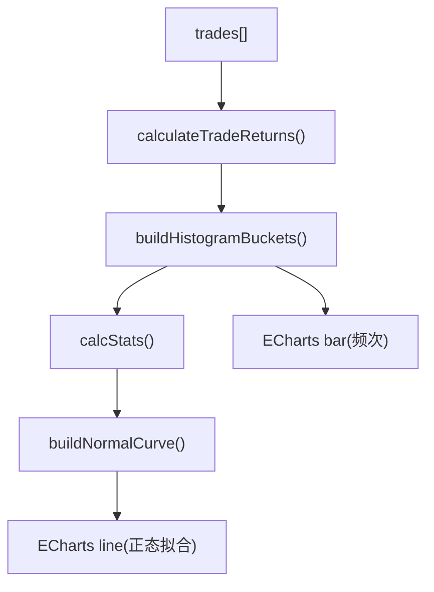
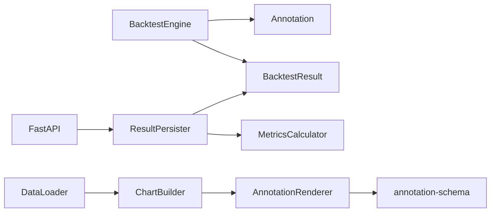

# 可视化数据转换

<cite>
**本文引用的文件**   
- [annotation.py](file://src/caisen/core/annotation.py)
- [engine.py](file://src/caisen/core/engine.py)
- [calculator.py](file://src/caisen/result/calculator.py)
- [persistence.py](file://src/caisen/result/persistence.py)
- [types.py](file://src/caisen/result/types.py)
- [main.py](file://src/caisen/web/main.py)
- [chart-builder.js](file://src/caisen/frontend/src/js/chart-builder.js)
- [data-loader.js](file://src/caisen/frontend/src/js/data-loader.js)
- [annotation-renderer.js](file://src/caisen/frontend/src/js/annotation-renderer.js)
- [chart-config.js](file://src/caisen/frontend/src/js/chart-config.js)
- [drawdown-chart.js](file://src/caisen/frontend/src/js/drawdown-chart.js)
- [trade-distribution.js](file://src/caisen/frontend/src/js/trade-distribution.js)
- [0005-visualization-annotations.md](file://docs/adr/0005-visualization-annotations.md)
</cite>

## 目录
1. [引言](#引言)
2. [项目结构](#项目结构)
3. [核心组件](#核心组件)
4. [架构总览](#架构总览)
5. [详细组件分析](#详细组件分析)
6. [依赖关系分析](#依赖关系分析)
7. [性能与大数据优化](#性能与大数据优化)
8. [缓存与增量更新](#缓存与增量更新)
9. [多维度数据分析接口](#多维度数据分析接口)
10. [自定义图表组件适配指南](#自定义图表组件适配指南)
11. [故障排查](#故障排查)
12. [结论](#结论)

## 引言
本技术文档围绕 Caisen 可视化数据转换系统，系统性阐述如何将原始回测结果转换为前端图表所需的数据格式，覆盖权益曲线、交易分布、回撤分析等可视化数据的生成；说明标注（Annotations）的生成与处理机制，支持形态识别结果的可视化标记；解释多维度数据分析接口，包括策略对比与参数敏感性分析；并给出可视化数据的缓存策略、增量更新机制以及自定义图表组件的数据适配规范。文末提供具体数据转换示例与前端集成模式，帮助快速实现交互式分析报告。

## 项目结构
后端负责回测执行、指标计算、结果持久化与可视化数据拼装；前端基于 ECharts 渲染 K 线、净值、回撤、交易分布等图表，并通过 Web API 获取 data.json 或本地 data.json 进行展示。

**图示来源** 
- [engine.py:19-91](file://src/caisen/core/engine.py#L19-L91)
- [calculator.py:34-79](file://src/caisen/result/calculator.py#L34-L79)
- [persistence.py:59-133](file://src/caisen/result/persistence.py#L59-L133)
- [main.py:194-201](file://src/caisen/web/main.py#L194-L201)
- [data-loader.js:175-245](file://src/caisen/frontend/src/js/data-loader.js#L175-L245)
- [chart-builder.js:116-171](file://src/caisen/frontend/src/js/chart-builder.js#L116-L171)
- [annotation-renderer.js:15-36](file://src/caisen/frontend/src/js/annotation-renderer.js#L15-L36)
- [drawdown-chart.js:91-150](file://src/caisen/frontend/src/js/drawdown-chart.js#L91-L150)
- [trade-distribution.js:107-146](file://src/caisen/frontend/src/js/trade-distribution.js#L107-L146)

**章节来源**
- [engine.py:19-91](file://src/caisen/core/engine.py#L19-L91)
- [persistence.py:59-133](file://src/caisen/result/persistence.py#L59-L133)
- [main.py:194-201](file://src/caisen/web/main.py#L194-L201)
- [data-loader.js:175-245](file://src/caisen/frontend/src/js/data-loader.js#L175-L245)

## 核心组件
- 回测引擎：驱动策略逐根 Bar 运行，记录交易、净值曲线与标注。
- 指标计算器：从净值曲线与交易序列计算年化收益、最大回撤、夏普比率、胜率等。
- 结果持久化：将 bars、trades、equity_curve、annotations、metrics 写入 runs/{run_id}，并生成 data.json 供前端消费。
- Web 服务：暴露 /api/runs、/api/runs/{run_id}/visualization 等端点，返回列表与可视化数据。
- 前端数据加载器：按 run_id 拉取 data.json，做基础校验，维护内存缓存，触发各图表渲染。
- 图表构建器：根据过滤后的数据构建 ECharts 配置，含 K 线、成交量、均线、标注、交易标记。
- 标注渲染器：将 Annotation 转为 markPoints/markLines，支持买卖信号、水平线、趋势线、形态连线等。
- 回撤与分布图：独立回撤区域图与交易盈亏分布直方图（含正态拟合）。

**章节来源**
- [engine.py:33-91](file://src/caisen/core/engine.py#L33-L91)
- [calculator.py:45-79](file://src/caisen/result/calculator.py#L45-L79)
- [persistence.py:135-201](file://src/caisen/result/persistence.py#L135-L201)
- [main.py:134-201](file://src/caisen/web/main.py#L134-L201)
- [data-loader.js:175-245](file://src/caisen/frontend/src/js/data-loader.js#L175-L245)
- [chart-builder.js:116-171](file://src/caisen/frontend/src/js/chart-builder.js#L116-L171)
- [annotation-renderer.js:15-36](file://src/caisen/frontend/src/js/annotation-renderer.js#L15-L36)
- [drawdown-chart.js:91-150](file://src/caisen/frontend/src/js/drawdown-chart.js#L91-L150)
- [trade-distribution.js:107-146](file://src/caisen/frontend/src/js/trade-distribution.js#L107-L146)

## 架构总览
以下时序图展示了从“触发回测”到“前端渲染”的完整链路，包括后台异步执行、结果持久化、data.json 生成与前端加载渲染。

**图示来源** 
- [main.py:107-132](file://src/caisen/web/main.py#L107-L132)
- [main.py:194-201](file://src/caisen/web/main.py#L194-L201)
- [persistence.py:59-133](file://src/caisen/result/persistence.py#L59-L133)
- [persistence.py:135-201](file://src/caisen/result/persistence.py#L135-L201)
- [data-loader.js:175-245](file://src/caisen/frontend/src/js/data-loader.js#L175-L245)
- [chart-builder.js:116-171](file://src/caisen/frontend/src/js/chart-builder.js#L116-L171)
- [annotation-renderer.js:15-36](file://src/caisen/frontend/src/js/annotation-renderer.js#L15-L36)

## 详细组件分析

### 标注数据模型与类型契约
- 后端定义 AnnotationType 枚举与 Annotation 数据类，统一语义化标注类型（买入/卖出/中性信号、水平线、趋势线、支撑/阻力区间、形态标记、文本标签、矩形、多边形等），并提供 to_dict 序列化方法。
- 前端通过 annotation-schema.js 声明 ANNOTATION_TYPES 与 ANNOTATION_CONFIG，保持前后端类型一致。

**图示来源** 
- [annotation.py:13-139](file://src/caisen/core/annotation.py#L13-L139)
- [annotation-schema.js:8-102](file://src/caisen/frontend/src/js/annotation-schema.js#L8-L102)

**章节来源**
- [annotation.py:13-139](file://src/caisen/core/annotation.py#L13-L139)
- [annotation-schema.js:8-102](file://src/caisen/frontend/src/js/annotation-schema.js#L8-L102)

### 回测引擎与标注注入
- BacktestEngine 在每根 Bar 调用策略 on_bar，兼容 BarResult 与旧版 Order 返回；若为 BarResult，则将 bar_result.annotations 追加至 engine.annotations。
- 最终封装 BacktestResult，包含 bars、trades、equity_curve、annotations、initial_capital、final_equity。

**图示来源** 
- [engine.py:33-91](file://src/caisen/core/engine.py#L33-L91)
- [types.py:9-32](file://src/caisen/result/types.py#L9-L32)

**章节来源**
- [engine.py:33-91](file://src/caisen/core/engine.py#L33-L91)
- [types.py:9-32](file://src/caisen/result/types.py#L9-L32)

### 指标计算与可视化数据拼装
- MetricsCalculator 从 equity_curve 与 trades 计算年化收益、最大回撤、夏普比率、胜率、盈亏比、平均盈利/亏损等。
- ResultPersister.save_visualization 读取 meta/metrics/bars/equity/trades/annotations，组装为 data.json，字段包括 meta、metrics、bars、equity_curve、trades、annotations。

**图示来源** 
- [calculator.py:45-79](file://src/caisen/result/calculator.py#L45-L79)
- [persistence.py:135-201](file://src/caisen/result/persistence.py#L135-L201)

**章节来源**
- [calculator.py:45-79](file://src/caisen/result/calculator.py#L45-L79)
- [persistence.py:135-201](file://src/caisen/result/persistence.py#L135-L201)

### 前端数据加载与校验
- DataLoader 优先从内存缓存读取，否则通过 /api/runs/{run_id}/visualization 或本地 data.json 获取数据；对 bars 必填字段进行校验，失败时显示友好错误提示。
- 成功加载后设置 appState.rawData 与 filteredData，并触发 K 线、净值、交易表、形态图例、日期筛选、延迟渲染回撤/热力/分布图，最后建立跨图表联动。

**图示来源** 
- [data-loader.js:175-245](file://src/caisen/frontend/src/js/data-loader.js#L175-L245)
- [data-loader.js:119-170](file://src/caisen/frontend/src/js/data-loader.js#L119-L170)

**章节来源**
- [data-loader.js:175-245](file://src/caisen/frontend/src/js/data-loader.js#L175-L245)
- [data-loader.js:119-170](file://src/caisen/frontend/src/js/data-loader.js#L119-L170)

### 标注渲染流程（形态识别可视化）
- chart-builder 调用 processAnnotations 将 annotations 转为 markPoints/markLines；annotation-renderer 根据 type 分发到具体渲染函数，如 pattern_mark 会绘制形态关键点连线与颈线（头肩形等）。
- 同时合并交易标记（processTrades），并对极大数据集限制 markPoints 数量以提升性能。

**图示来源** 
- [chart-builder.js:136-141](file://src/caisen/frontend/src/js/chart-builder.js#L136-L141)
- [annotation-renderer.js:15-36](file://src/caisen/frontend/src/js/annotation-renderer.js#L15-L36)
- [annotation-renderer.js:214-285](file://src/caisen/frontend/src/js/annotation-renderer.js#L214-L285)

**章节来源**
- [chart-builder.js:136-141](file://src/caisen/frontend/src/js/chart-builder.js#L136-L141)
- [annotation-renderer.js:214-285](file://src/caisen/frontend/src/js/annotation-renderer.js#L214-L285)

### 回撤分析与独立回撤图
- 净值图内置回撤序列与新高点标记，并检测深度超过阈值的回撤区间以 markArea 高亮。
- 独立回撤图 calculateDrawdownDetails 计算最大回撤底部、恢复点与持续天数，并以 markArea/markPoint 标注关键位置。

**图示来源** 
- [chart-builder.js:45-102](file://src/caisen/frontend/src/js/chart-builder.js#L45-L102)
- [chart-builder.js:368-429](file://src/caisen/frontend/src/js/chart-builder.js#L368-L429)
- [drawdown-chart.js:12-72](file://src/caisen/frontend/src/js/drawdown-chart.js#L12-L72)
- [drawdown-chart.js:91-150](file://src/caisen/frontend/src/js/drawdown-chart.js#L91-L150)

**章节来源**
- [chart-builder.js:45-102](file://src/caisen/frontend/src/js/chart-builder.js#L45-L102)
- [drawdown-chart.js:12-72](file://src/caisen/frontend/src/js/drawdown-chart.js#L12-L72)

### 交易分布与正态拟合
- 将配对交易的收益率统计为直方图桶，计算均值/中位数/标准差，并在每个桶中点叠加正态拟合期望计数，便于直观评估策略收益分布特征。

**图示来源** 
- [trade-distribution.js:11-34](file://src/caisen/frontend/src/js/trade-distribution.js#L11-L34)
- [trade-distribution.js:39-71](file://src/caisen/frontend/src/js/trade-distribution.js#L39-L71)
- [trade-distribution.js:76-102](file://src/caisen/frontend/src/js/trade-distribution.js#L76-L102)
- [trade-distribution.js:107-146](file://src/caisen/frontend/src/js/trade-distribution.js#L107-L146)

**章节来源**
- [trade-distribution.js:11-34](file://src/caisen/frontend/src/js/trade-distribution.js#L11-L34)
- [trade-distribution.js:107-146](file://src/caisen/frontend/src/js/trade-distribution.js#L107-L146)

## 依赖关系分析
- 后端：BacktestEngine 依赖 Strategy、Portfolio、Position、Order、Trade、Annotation；ResultPersister 依赖 MetricsCalculator；Web 层依赖 ResultPersister 与策略注册表。
- 前端：DataLoader 依赖 appState、各渲染模块；ChartBuilder 依赖 AnnotationRenderer、Utils；AnnotationRenderer 依赖 annotation-schema 与工具函数。

**图示来源** 
- [engine.py:19-91](file://src/caisen/core/engine.py#L19-L91)
- [calculator.py:34-79](file://src/caisen/result/calculator.py#L34-L79)
- [persistence.py:59-133](file://src/caisen/result/persistence.py#L59-L133)
- [main.py:194-201](file://src/caisen/web/main.py#L194-L201)
- [data-loader.js:175-245](file://src/caisen/frontend/src/js/data-loader.js#L175-L245)
- [chart-builder.js:116-171](file://src/caisen/frontend/src/js/chart-builder.js#L116-L171)
- [annotation-renderer.js:15-36](file://src/caisen/frontend/src/js/annotation-renderer.js#L15-L36)
- [annotation-schema.js:8-102](file://src/caisen/frontend/src/js/annotation-schema.js#L8-L102)

**章节来源**
- [engine.py:19-91](file://src/caisen/core/engine.py#L19-L91)
- [persistence.py:59-133](file://src/caisen/result/persistence.py#L59-L133)
- [main.py:194-201](file://src/caisen/web/main.py#L194-L201)
- [data-loader.js:175-245](file://src/caisen/frontend/src/js/data-loader.js#L175-L245)

## 性能与大数据优化
- 大数采样与渲染优化：
  - K 线与 MA 系列在数据量 >5000 时启用 large/largeThreshold 与 sampling:'lttb'，显著降低渲染压力。
  - 极大数据（>10000）时限制 markPoints 数量（如前 100 个新高点），避免过多标注导致卡顿。
- 交互缩放：
  - 内置 dataZoom（inside/slider），支持时间轴局部放大，减少首屏渲染数据量。
- 惰性渲染：
  - 非首屏图表（回撤、热力、分布）采用 lazyInitChart 懒加载，提升首屏速度。

**章节来源**
- [chart-builder.js:143-171](file://src/caisen/frontend/src/js/chart-builder.js#L143-L171)
- [chart-builder.js:303-335](file://src/caisen/frontend/src/js/chart-builder.js#L303-L335)
- [chart-builder.js:368-429](file://src/caisen/frontend/src/js/chart-builder.js#L368-L429)
- [data-loader.js:233-240](file://src/caisen/frontend/src/js/data-loader.js#L233-L240)

## 缓存与增量更新
- 前端内存缓存：DataLoader 使用 Map 缓存 run_id -> data.json，避免重复请求。
- 服务端缓存：data.json 由 ResultPersister.save_visualization 一次性生成，后续 GET /api/runs/{run_id}/visualization 直接读取 JSON，IO 开销低。
- 增量更新建议（扩展）：
  - 可在后端增加 /api/runs/{run_id}/delta?since=timestamp 接口，仅返回新增 bars/trades/annotations，前端按需合并并增量刷新图表。
  - 结合 WebSocket 进度推送（已实现 /ws/runs/{run_id}/progress），在回测进行中逐步推进 UI 状态，完成后切换至 data.json 全量视图。

**章节来源**
- [data-loader.js:175-245](file://src/caisen/frontend/src/js/data-loader.js#L175-L245)
- [persistence.py:135-201](file://src/caisen/result/persistence.py#L135-L201)
- [main.py:247-303](file://src/caisen/web/main.py#L247-L303)

## 多维度数据分析接口
- 策略对比：
  - /api/runs 返回所有有效 run 的元信息与 metrics，前端可横向比较不同策略的年化收益、最大回撤、夏普比率、胜率等。
- 参数敏感性分析：
  - 通过批量回测脚本生成多组参数下的 runs，利用 /api/runs 聚合 metrics，前端以表格/折线/散点等形式呈现参数-指标响应面。
- 可视化数据访问：
  - /api/runs/{run_id}/visualization 返回 data.json，包含 bars、equity_curve、trades、annotations、metrics，满足多维分析需求。

**章节来源**
- [main.py:134-183](file://src/caisen/web/main.py#L134-L183)
- [main.py:194-201](file://src/caisen/web/main.py#L194-L201)

## 自定义图表组件适配指南
- 数据格式约定（data.json）：
  - meta: strategy_name、symbol、start、end、freq
  - metrics: 绩效指标字典
  - bars: [{timestamp, open, high, low, close, volume}]
  - equity_curve: [{timestamp, equity, cash, positions}]
  - trades: [{timestamp, symbol, side, quantity, price, commission, ...}]
  - annotations: [{type, timestamp, data}]
- 接口规范：
  - 前端通过 DataLoader.loadData 获取 data.json，validateVisualizationData 校验 bars 必填字段（timestamp/open/high/low/close）。
  - 自定义图表应订阅 appState.getFilteredData()，在数据变化时重新构建 ECharts option 并 setOption。
- 标注适配：
  - 遵循 annotation-schema.js 的 ANNOTATION_TYPES 与 ANNOTATION_CONFIG，确保 type 值与后端 AnnotationType 保持一致。
  - 如需新增标注类型，需同步更新后端 AnnotationType 与前端的 schema/renderer。

**章节来源**
- [persistence.py:135-201](file://src/caisen/result/persistence.py#L135-L201)
- [data-loader.js:119-170](file://src/caisen/frontend/src/js/data-loader.js#L119-L170)
- [annotation-schema.js:8-102](file://src/caisen/frontend/src/js/annotation-schema.js#L8-L102)
- [annotation.py:13-139](file://src/caisen/core/annotation.py#L13-L139)

## 故障排查
- 数据不可用：
  - DataLoader.validateVisualizationData 检查 bars 是否为空或缺少必填字段；失败时隐藏图表区并显示友好提示。
- 标注渲染异常：
  - annotation-renderer 对未知 type 输出警告；对渲染异常捕获并打印错误日志，不影响其他标注。
- 路径安全：
  - Web 层 _safe_resolve 防止路径遍历攻击，非法路径返回 400。
- 进度与超时：
  - WebSocket 进度推送最长等待 5 分钟，超时返回错误消息。

**章节来源**
- [data-loader.js:119-170](file://src/caisen/frontend/src/js/data-loader.js#L119-L170)
- [annotation-renderer.js:15-36](file://src/caisen/frontend/src/js/annotation-renderer.js#L15-L36)
- [main.py:28-39](file://src/caisen/web/main.py#L28-L39)
- [main.py:247-303](file://src/caisen/web/main.py#L247-L303)

## 结论
Caisen 可视化数据转换系统以后端标准化数据产出（data.json）为核心，配合前端模块化渲染与标注体系，实现了从回测到交互式报告的高效闭环。通过大数采样、惰性渲染与内存缓存，系统在大数据量下仍保持良好性能；标注体系与前后端类型契约确保了形态识别等复杂分析的可视化一致性。面向未来，可扩展增量更新接口与更多维度分析图表，进一步提升策略研究与复盘效率。