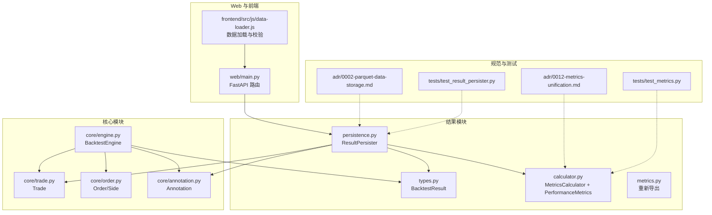
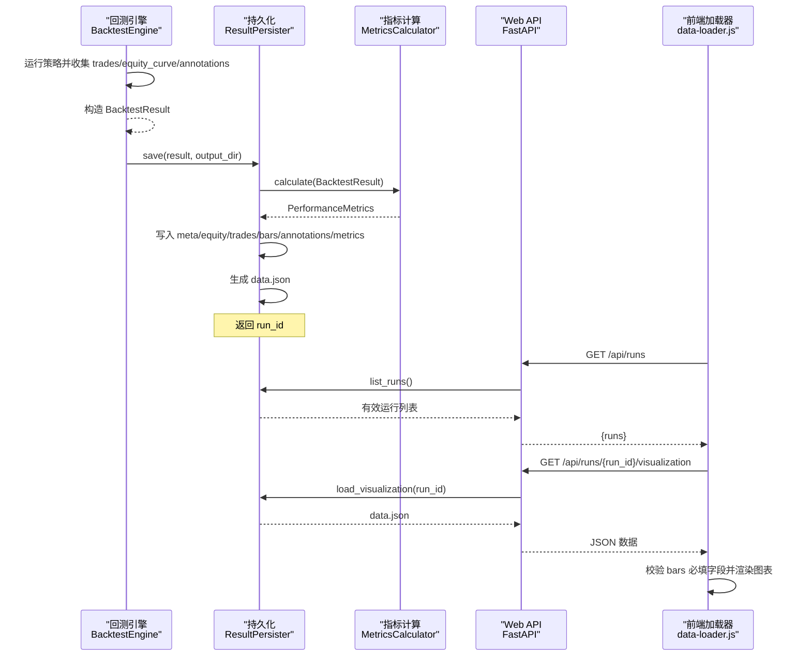
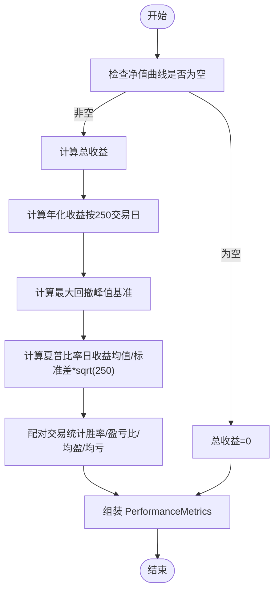
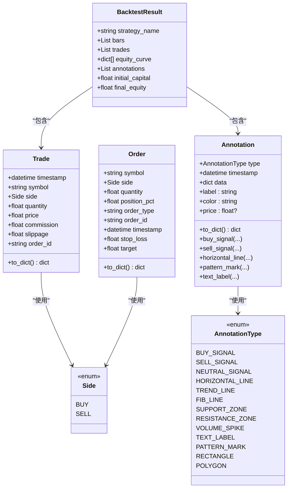
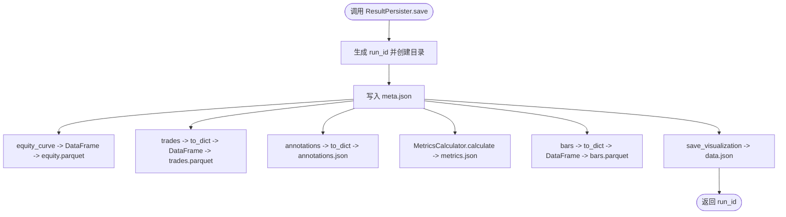
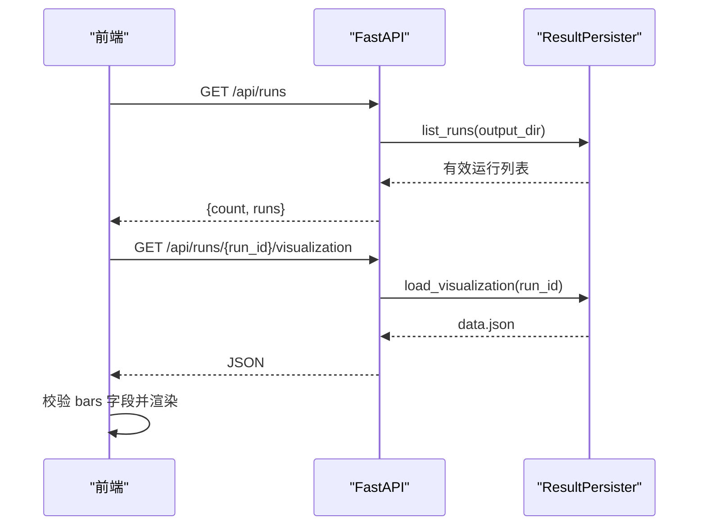
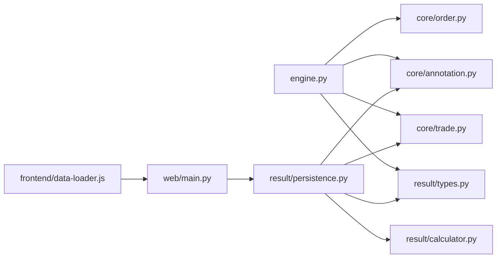

# 结果分析与持久化

<cite>
**本文引用的文件**   
- [src/caisen/result/types.py](file://src/caisen/result/types.py)
- [src/caisen/result/calculator.py](file://src/caisen/result/calculator.py)
- [src/caisen/result/metrics.py](file://src/caisen/result/metrics.py)
- [src/caisen/result/persistence.py](file://src/caisen/result/persistence.py)
- [src/caisen/core/engine.py](file://src/caisen/core/engine.py)
- [src/caisen/core/trade.py](file://src/caisen/core/trade.py)
- [src/caisen/core/order.py](file://src/caisen/core/order.py)
- [src/caisen/core/annotation.py](file://src/caisen/core/annotation.py)
- [src/caisen/web/main.py](file://src/caisen/web/main.py)
- [src/caisen/frontend/src/js/data-loader.js](file://src/caisen/frontend/src/js/data-loader.js)
- [docs/adr/0002-parquet-data-storage.md](file://docs/adr/0002-parquet-data-storage.md)
- [docs/adr/0012-metrics-unification.md](file://docs/adr/0012-metrics-unification.md)
- [tests/test_metrics.py](file://tests/test_metrics.py)
- [tests/test_result_persister.py](file://tests/test_result_persister.py)
</cite>

## 目录
1. [引言](#引言)
2. [项目结构](#项目结构)
3. [核心组件](#核心组件)
4. [架构总览](#架构总览)
5. [详细组件分析](#详细组件分析)
6. [依赖关系分析](#依赖关系分析)
7. [性能与优化](#性能与优化)
8. [故障排查指南](#故障排查指南)
9. [结论](#结论)
10. [附录](#附录)

## 引言
本技术文档聚焦 Caisen 的结果分析与持久化系统，围绕绩效指标计算引擎、结果数据结构设计、Parquet 持久化机制、查询与分析接口、可视化数据生成以及自定义指标扩展进行系统化说明。目标是帮助读者快速理解从回测执行到结果落盘、再到前端可视化的完整链路，并提供可操作的扩展与维护建议。

## 项目结构
结果分析与持久化相关代码主要位于 result 子包，并与 core（交易、订单、注解）、web（API 服务）和 frontend（前端加载器）紧密协作。

图表来源
- [src/caisen/result/types.py:1-32](file://src/caisen/result/types.py#L1-L32)
- [src/caisen/result/calculator.py:1-169](file://src/caisen/result/calculator.py#L1-L169)
- [src/caisen/result/persistence.py:1-277](file://src/caisen/result/persistence.py#L1-L277)
- [src/caisen/core/engine.py:1-210](file://src/caisen/core/engine.py#L1-L210)
- [src/caisen/core/trade.py:1-30](file://src/caisen/core/trade.py#L1-L30)
- [src/caisen/core/order.py:1-44](file://src/caisen/core/order.py#L1-L44)
- [src/caisen/core/annotation.py:1-139](file://src/caisen/core/annotation.py#L1-L139)
- [src/caisen/web/main.py:1-319](file://src/caisen/web/main.py#L1-L319)
- [src/caisen/frontend/src/js/data-loader.js:1-286](file://src/caisen/frontend/src/js/data-loader.js#L1-L286)
- [docs/adr/0002-parquet-data-storage.md:1-13](file://docs/adr/0002-parquet-data-storage.md#L1-L13)
- [docs/adr/0012-metrics-unification.md:1-60](file://docs/adr/0012-metrics-unification.md#L1-L60)
- [tests/test_metrics.py:1-170](file://tests/test_metrics.py#L1-L170)
- [tests/test_result_persister.py:1-326](file://tests/test_result_persister.py#L1-L326)

章节来源
- [src/caisen/result/types.py:1-32](file://src/caisen/result/types.py#L1-L32)
- [src/caisen/result/calculator.py:1-169](file://src/caisen/result/calculator.py#L1-L169)
- [src/caisen/result/persistence.py:1-277](file://src/caisen/result/persistence.py#L1-L277)
- [src/caisen/core/engine.py:1-210](file://src/caisen/core/engine.py#L1-L210)
- [src/caisen/core/trade.py:1-30](file://src/caisen/core/trade.py#L1-L30)
- [src/caisen/core/order.py:1-44](file://src/caisen/core/order.py#L1-L44)
- [src/caisen/core/annotation.py:1-139](file://src/caisen/core/annotation.py#L1-L139)
- [src/caisen/web/main.py:1-319](file://src/caisen/web/main.py#L1-L319)
- [src/caisen/frontend/src/js/data-loader.js:1-286](file://src/caisen/frontend/src/js/data-loader.js#L1-L286)
- [docs/adr/0002-parquet-data-storage.md:1-13](file://docs/adr/0002-parquet-data-storage.md#L1-L13)
- [docs/adr/0012-metrics-unification.md:1-60](file://docs/adr/0012-metrics-unification.md#L1-L60)
- [tests/test_metrics.py:1-170](file://tests/test_metrics.py#L1-L170)
- [tests/test_result_persister.py:1-326](file://tests/test_result_persister.py#L1-L326)

## 核心组件
- 结果类型：BacktestResult 作为一次回测的纯数据容器，包含策略名、K线、交易记录、净值曲线、标注、初始与最终净值等字段。
- 指标计算：MetricsCalculator 为唯一计算入口，输出 PerformanceMetrics（年化收益、最大回撤、夏普比率、胜率、盈亏比、平均盈利/亏损、总收益率、总交易数）。
- 持久化：ResultPersister 负责将结果写入 runs 目录，生成 meta.json、equity.parquet、trades.parquet、bars.parquet、annotations.json、metrics.json 以及 data.json。
- 引擎集成：BacktestEngine 在运行结束后构造 BacktestResult，供持久化层使用。
- Web 与前端：FastAPI 提供列出运行、获取详情与可视化数据的接口；前端 data-loader.js 负责拉取并校验 data.json，驱动图表渲染。

章节来源
- [src/caisen/result/types.py:1-32](file://src/caisen/result/types.py#L1-L32)
- [src/caisen/result/calculator.py:1-169](file://src/caisen/result/calculator.py#L1-L169)
- [src/caisen/result/persistence.py:1-277](file://src/caisen/result/persistence.py#L1-L277)
- [src/caisen/core/engine.py:1-210](file://src/caisen/core/engine.py#L1-L210)
- [src/caisen/web/main.py:1-319](file://src/caisen/web/main.py#L1-L319)
- [src/caisen/frontend/src/js/data-loader.js:1-286](file://src/caisen/frontend/src/js/data-loader.js#L1-L286)

## 架构总览
下图展示了从回测执行到结果持久化、再到 Web 查询与前端可视化的端到端流程。

图表来源
- [src/caisen/core/engine.py:1-210](file://src/caisen/core/engine.py#L1-L210)
- [src/caisen/result/persistence.py:1-277](file://src/caisen/result/persistence.py#L1-L277)
- [src/caisen/result/calculator.py:1-169](file://src/caisen/result/calculator.py#L1-L169)
- [src/caisen/web/main.py:1-319](file://src/caisen/web/main.py#L1-L319)
- [src/caisen/frontend/src/js/data-loader.js:1-286](file://src/caisen/frontend/src/js/data-loader.js#L1-L286)

## 详细组件分析

### 绩效指标计算引擎
- 统一入口：MetricsCalculator.calculate 接收 BacktestResult，依次计算总收益、年化收益、最大回撤、夏普比率与交易统计，汇总为 PerformanceMetrics。
- 关键指标算法要点：
  - 总收益率：基于初始与最终净值计算。
  - 年化收益率：按交易日长度折算（每年约 250 个交易日），采用复利公式。
  - 最大回撤：以净值序列的峰值为基准，计算最大负偏离。
  - 夏普比率：日收益率均值除以标准差，再乘以 sqrt(250) 进行年化，无风险利率设为 0。
  - 交易统计：对有序交易按买卖配对计算盈亏，得到胜率、盈亏比、平均盈利/亏损与总交易数。
- 边界处理：空净值曲线、零初始资金、不足两条净值、无交易或仅有单边交易等情况均有安全默认值。

图表来源
- [src/caisen/result/calculator.py:1-169](file://src/caisen/result/calculator.py#L1-L169)

章节来源
- [src/caisen/result/calculator.py:1-169](file://src/caisen/result/calculator.py#L1-L169)
- [docs/adr/0012-metrics-unification.md:1-60](file://docs/adr/0012-metrics-unification.md#L1-L60)
- [tests/test_metrics.py:1-170](file://tests/test_metrics.py#L1-L170)

### 结果数据结构设计
- BacktestResult：纯数据容器，包含策略名、K线、交易、净值曲线、标注、初始与最终净值。
- Trade：单笔成交记录，含时间戳、标的、方向、数量、价格、手续费、滑点、订单号等，并提供 to_dict 用于序列化。
- Order/Side：订单模型与方向枚举，支持按数量或仓位比例下单。
- Annotation：可视化标注，定义多种类型（信号、线条、区域、文本、图形），提供便捷工厂方法与 to_dict 序列化。

图表来源
- [src/caisen/result/types.py:1-32](file://src/caisen/result/types.py#L1-L32)
- [src/caisen/core/trade.py:1-30](file://src/caisen/core/trade.py#L1-L30)
- [src/caisen/core/order.py:1-44](file://src/caisen/core/order.py#L1-L44)
- [src/caisen/core/annotation.py:1-139](file://src/caisen/core/annotation.py#L1-L139)

章节来源
- [src/caisen/result/types.py:1-32](file://src/caisen/result/types.py#L1-L32)
- [src/caisen/core/trade.py:1-30](file://src/caisen/core/trade.py#L1-L30)
- [src/caisen/core/order.py:1-44](file://src/caisen/core/order.py#L1-L44)
- [src/caisen/core/annotation.py:1-139](file://src/caisen/core/annotation.py#L1-L139)

### Parquet 格式的结果持久化机制
- 存储产物：每个 run 目录包含 meta.json、equity.parquet、trades.parquet、bars.parquet、annotations.json、metrics.json 以及 data.json。
- 元数据：meta.json 包含 run_id、策略名、标的、频率、起止时间、bar_count、初始/最终净值、总收益、总交易数、创建时间等。
- 净值与 K 线：使用 pandas DataFrame 写入 parquet，object 列会先转为字符串以保证可序列化。
- 交易与标注：交易记录通过 Trade.to_dict 转字典后写入 parquet；标注以 JSON 保存。
- 指标：由 MetricsCalculator 计算后以 metrics.json 保存。
- 前端综合文件：save_visualization 聚合上述数据生成 data.json，便于前端一次性加载。
- 版本兼容：load/load_visualization 对缺失文件做容错处理，仅加载存在的数据项。

图表来源
- [src/caisen/result/persistence.py:1-277](file://src/caisen/result/persistence.py#L1-L277)
- [docs/adr/0002-parquet-data-storage.md:1-13](file://docs/adr/0002-parquet-data-storage.md#L1-L13)

章节来源
- [src/caisen/result/persistence.py:1-277](file://src/caisen/result/persistence.py#L1-L277)
- [docs/adr/0002-parquet-data-storage.md:1-13](file://docs/adr/0002-parquet-data-storage.md#L1-L13)
- [tests/test_result_persister.py:1-326](file://tests/test_result_persister.py#L1-L326)

### 结果查询与分析接口
- 后端 API：
  - GET /api/runs：列出所有有效运行（要求 meta.json 存在且 bar_count > 0，同时需有 data.json 或 bars.parquet）。
  - GET /api/runs/{run_id}：加载运行详情（meta + 可选 equity/trades/annotations/metrics/bars）。
  - GET /api/runs/{run_id}/visualization：返回 data.json（前端可视化专用）。
  - GET /api/runs/{run_id}/data.json：直接下载 data.json 文件。
- 路径安全：使用 _safe_resolve 防止路径遍历攻击。
- 前端加载：
  - data-loader.js 优先通过 /api/runs/{run_id}/visualization 拉取数据，否则回退到本地 data.json。
  - 内置 validateVisualizationData 校验 bars 必填字段（timestamp/open/high/low/close），不合法则显示友好错误提示。
  - 支持日期筛选，过滤 bars/equity_curve/trades/annotations 的时间范围并重绘图表。

图表来源
- [src/caisen/web/main.py:1-319](file://src/caisen/web/main.py#L1-L319)
- [src/caisen/result/persistence.py:1-277](file://src/caisen/result/persistence.py#L1-L277)
- [src/caisen/frontend/src/js/data-loader.js:1-286](file://src/caisen/frontend/src/js/data-loader.js#L1-L286)

章节来源
- [src/caisen/web/main.py:1-319](file://src/caisen/web/main.py#L1-L319)
- [src/caisen/frontend/src/js/data-loader.js:1-286](file://src/caisen/frontend/src/js/data-loader.js#L1-L286)

### 可视化数据生成
- 生成时机：ResultPersister.save 完成后自动调用 save_visualization 生成 data.json。
- 数据来源：读取 meta.json、metrics.json、bars.parquet、equity.parquet、trades.parquet、annotations.json，合并为前端可直接消费的扁平结构。
- 前端消费：data-loader.js 解析 data.json，构建应用状态，触发各图表渲染与联动同步。

章节来源
- [src/caisen/result/persistence.py:1-277](file://src/caisen/result/persistence.py#L1-L277)
- [src/caisen/frontend/src/js/data-loader.js:1-286](file://src/caisen/frontend/src/js/data-loader.js#L1-L286)

### 自定义指标开发指南
- 新增指标步骤：
  1) 在 MetricsCalculator 中实现新的私有计算方法，并在 calculate 中组合输出至 PerformanceMetrics。
  2) 若需要新字段，扩展 PerformanceMetrics 数据类。
  3) 更新 ResultPersister.save 中的指标写入逻辑（当前已统一通过 calculator.calculate）。
  4) 补充单元测试覆盖边界条件与典型场景。
- 计算优化建议：
  - 尽量使用向量化操作（如 pandas/numpy）减少循环开销。
  - 对重复计算的中间结果进行缓存（例如净值序列、日收益率序列）。
  - 避免在高频路径中进行 I/O 或复杂对象转换。
- 缓存策略：
  - 在单次 calculate 内部缓存中间变量（如 returns、peak、drawdown）。
  - 对于跨 run 的指标对比，可在上层（如 Web 层）缓存 metrics.json 的解析结果。

章节来源
- [src/caisen/result/calculator.py:1-169](file://src/caisen/result/calculator.py#L1-L169)
- [src/caisen/result/persistence.py:1-277](file://src/caisen/result/persistence.py#L1-L277)
- [tests/test_metrics.py:1-170](file://tests/test_metrics.py#L1-L170)

### 结果数据质量验证与完整性检查
- 后端侧：
  - list_runs 仅返回满足条件的运行：meta.json 存在、data.json 或 bars.parquet 存在、bar_count > 0。
  - 读取 JSON/Parquet 时捕获异常并跳过无效条目，保证接口稳定性。
- 前端侧：
  - validateVisualizationData 校验 bars 必填字段，缺失则显示“数据不可用”提示并隐藏图表区域。
  - 加载失败时展示错误信息并提供返回列表的快捷入口。

章节来源
- [src/caisen/web/main.py:1-319](file://src/caisen/web/main.py#L1-L319)
- [src/caisen/frontend/src/js/data-loader.js:1-286](file://src/caisen/frontend/src/js/data-loader.js#L1-L286)

## 依赖关系分析
- 模块耦合：
  - persistence 依赖 calculator 与 types，并通过 trade/annotation 的 to_dict 完成序列化。
  - web 依赖 persistence 提供查询能力，前端依赖 web 提供的 REST 接口。
  - engine 产出 BacktestResult，是结果链路的起点。
- 外部依赖：
  - pandas/numpy 用于数值计算与 Parquet 读写。
  - FastAPI 提供 HTTP/WebSocket 服务。
- 潜在循环依赖规避：
  - engine 延迟导入 BacktestResult，避免与 result.types 形成循环。

图表来源
- [src/caisen/core/engine.py:1-210](file://src/caisen/core/engine.py#L1-L210)
- [src/caisen/result/types.py:1-32](file://src/caisen/result/types.py#L1-L32)
- [src/caisen/result/persistence.py:1-277](file://src/caisen/result/persistence.py#L1-L277)
- [src/caisen/result/calculator.py:1-169](file://src/caisen/result/calculator.py#L1-L169)
- [src/caisen/core/trade.py:1-30](file://src/caisen/core/trade.py#L1-L30)
- [src/caisen/core/order.py:1-44](file://src/caisen/core/order.py#L1-L44)
- [src/caisen/core/annotation.py:1-139](file://src/caisen/core/annotation.py#L1-L139)
- [src/caisen/web/main.py:1-319](file://src/caisen/web/main.py#L1-L319)
- [src/caisen/frontend/src/js/data-loader.js:1-286](file://src/caisen/frontend/src/js/data-loader.js#L1-L286)

章节来源
- [src/caisen/core/engine.py:1-210](file://src/caisen/core/engine.py#L1-L210)
- [src/caisen/result/persistence.py:1-277](file://src/caisen/result/persistence.py#L1-L277)
- [src/caisen/web/main.py:1-319](file://src/caisen/web/main.py#L1-L319)
- [src/caisen/frontend/src/js/data-loader.js:1-286](file://src/caisen/frontend/src/js/data-loader.js#L1-L286)

## 性能与优化
- 计算性能：
  - 使用 pandas/numpy 向量化计算净值序列与日收益率，降低 Python 循环开销。
  - 对夏普比率等涉及标准差的计算，注意空序列与零方差分支保护。
- 存储性能：
  - Parquet 列式存储适合时序数据，压缩率高、查询快；按 run 分区便于检索。
  - 大表（如 bars）建议按需加载，前端 lazy 初始化非首屏图表。
- I/O 优化：
  - save_visualization 聚合多文件为单一 data.json，减少前端请求次数。
  - 前端增加内存缓存 Map，避免重复拉取同一 run 的数据。

[本节为通用指导，无需特定文件引用]

## 故障排查指南
- 常见错误与定位：
  - 前端显示“数据不可用”：检查 bars 是否包含 timestamp/open/high/low/close；确认 data.json 是否存在。
  - list_runs 返回空：确认 meta.json 存在且 bar_count > 0，同时存在 data.json 或 bars.parquet。
  - 指标异常（如夏普比率为 0）：检查净值曲线长度与标准差是否为 0。
- 日志与调试：
  - Web 层对后台回测异常进行记录；前端通过 DEBUG_CONFIG 打印加载与校验信息。
- 恢复措施：
  - 删除损坏的 run 目录，重新运行回测。
  - 单独调用 save_visualization 重建 data.json。

章节来源
- [src/caisen/web/main.py:1-319](file://src/caisen/web/main.py#L1-L319)
- [src/caisen/frontend/src/js/data-loader.js:1-286](file://src/caisen/frontend/src/js/data-loader.js#L1-L286)
- [src/caisen/result/persistence.py:1-277](file://src/caisen/result/persistence.py#L1-L277)

## 结论
Caisen 的结果分析与持久化系统以清晰的职责划分与统一的计算入口为核心，结合 Parquet 高效存储与前后端协同的可视化方案，形成了从回测到报告的一体化链路。通过严格的输入校验与健壮的错误处理，系统在易用性与可靠性之间取得良好平衡。后续可按指南扩展自定义指标，并结合缓存与向量化进一步优化性能。

[本节为总结性内容，无需特定文件引用]

## 附录
- 术语
  - Run：一次策略回测的执行实例，对应一个独立目录。
  - 净值曲线：按时间顺序记录的账户权益序列。
  - 标注：策略输出的语义化标记，用于前端可视化增强。
- 参考规范
  - ADR-0002：历史数据以 Parquet 格式存储，按日期/品种分区。
  - ADR-0012：Metrics 计算统一，消除重复逻辑，确立单一真相源。

章节来源
- [docs/adr/0002-parquet-data-storage.md:1-13](file://docs/adr/0002-parquet-data-storage.md#L1-L13)
- [docs/adr/0012-metrics-unification.md:1-60](file://docs/adr/0012-metrics-unification.md#L1-L60)