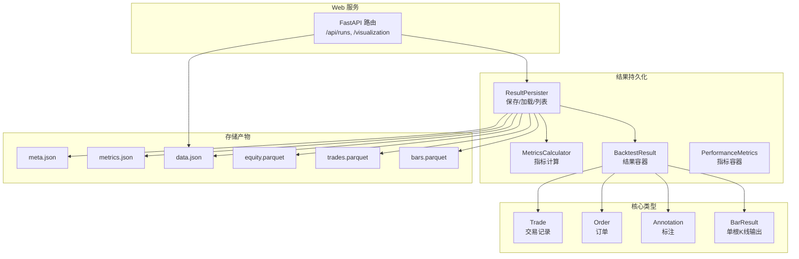
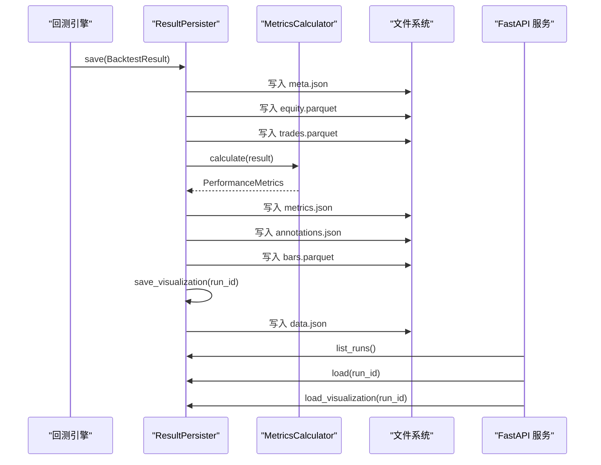
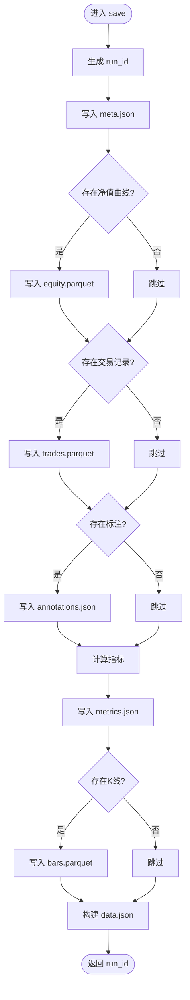
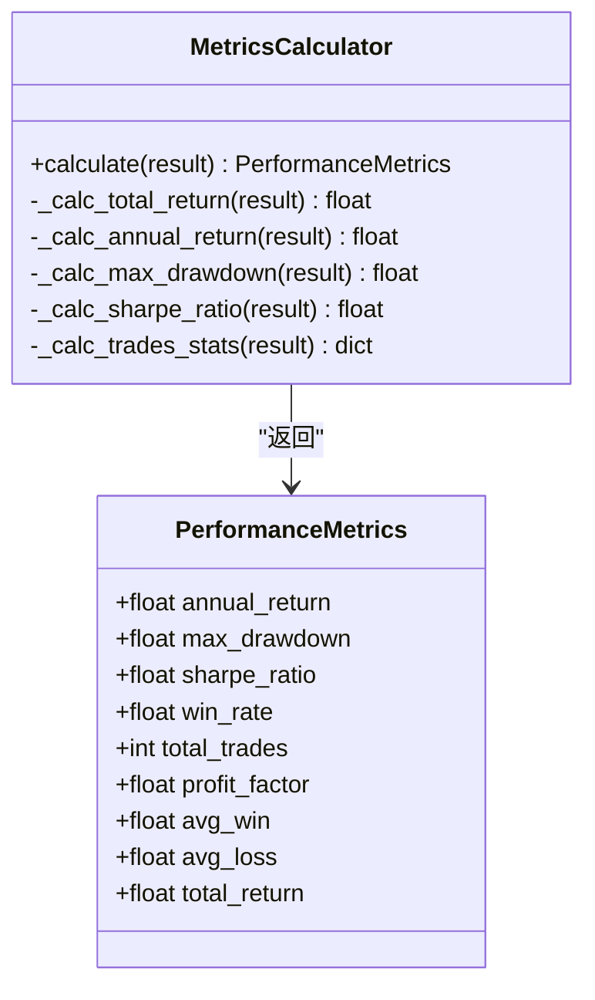
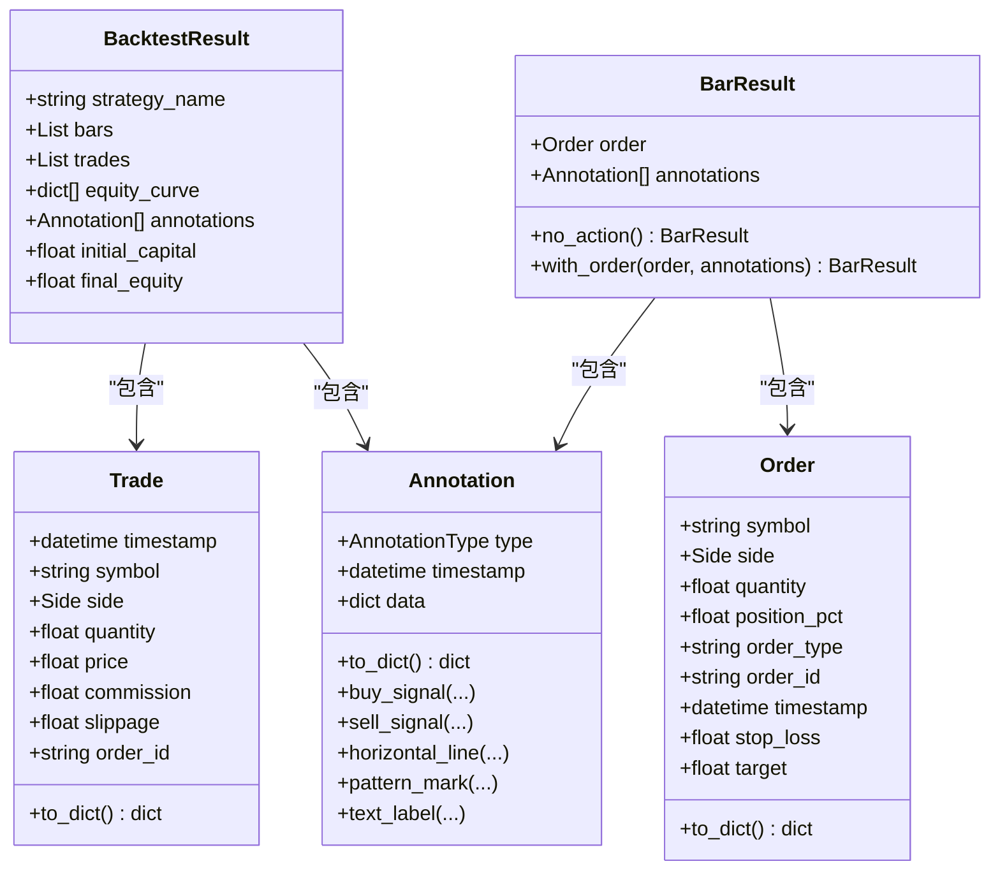
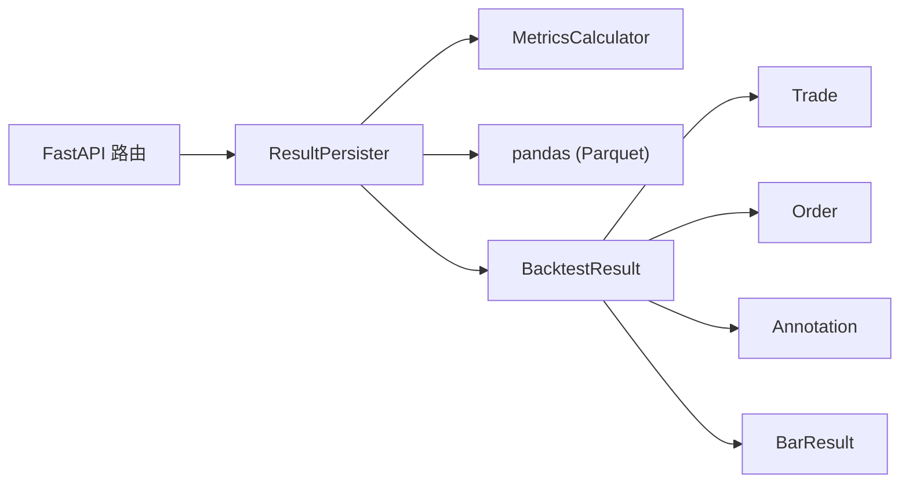
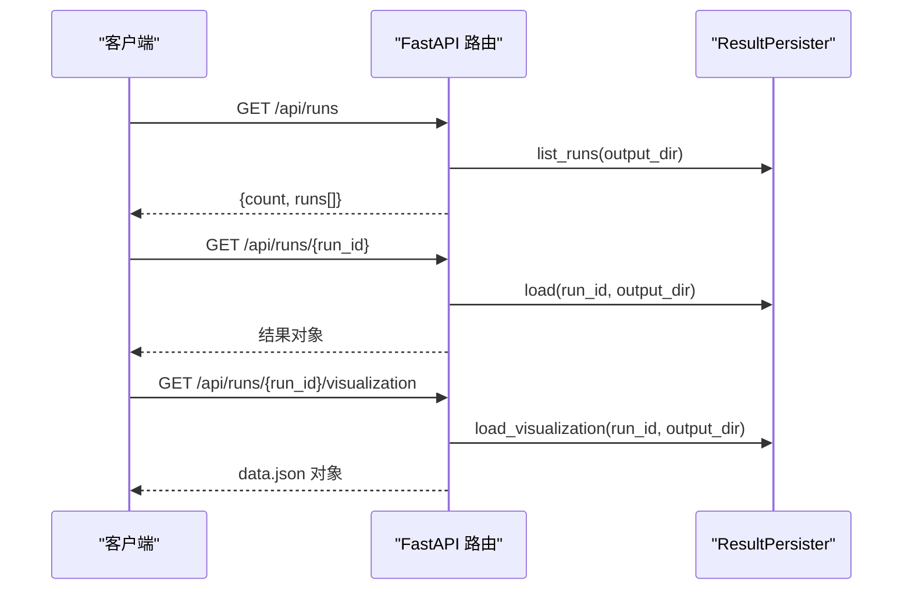

# 结果持久化存储

<cite>
**本文引用的文件**
- [persistence.py](file://src/caisen/result/persistence.py)
- [calculator.py](file://src/caisen/result/calculator.py)
- [types.py](file://src/caisen/result/types.py)
- [metrics.py](file://src/caisen/result/metrics.py)
- [trade.py](file://src/caisen/core/trade.py)
- [order.py](file://src/caisen/core/order.py)
- [annotation.py](file://src/caisen/core/annotation.py)
- [bar_result.py](file://src/caisen/core/bar_result.py)
- [0002-parquet-data-storage.md](file://docs/adr/0002-parquet-data-storage.md)
- [main.py](file://src/caisen/web/main.py)
- [meta.json](file://runs/CaiSenStrategy_20260522_1/meta.json)
- [metrics.json](file://runs/CaiSenStrategy_20260522_1/metrics.json)
- [data.json](file://runs/CaiSenStrategy_20260522_1/data.json)
</cite>

## 目录
1. [简介](#简介)
2. [项目结构](#项目结构)
3. [核心组件](#核心组件)
4. [架构总览](#架构总览)
5. [详细组件分析](#详细组件分析)
6. [依赖关系分析](#依赖关系分析)
7. [性能与压缩策略](#性能与压缩策略)
8. [查询接口设计](#查询接口设计)
9. [完整性验证与质量检查](#完整性验证与质量检查)
10. [数据迁移与版本兼容](#数据迁移与版本兼容)
11. [结论](#结论)
12. [附录：文件结构与访问模式示例](#附录文件结构与访问模式示例)

## 简介
本技术文档围绕 Caisen 的回测结果持久化系统，系统性阐述基于 Parquet 的结果存储机制、核心数据类型定义与映射、结果文件组织结构（meta.json、metrics.json、data.json 等）、结果查询接口设计、完整性验证与质量检查机制，以及数据迁移与向后兼容策略。目标是帮助读者快速理解并高效使用回测结果的读写与分析能力。

## 项目结构
结果持久化相关代码集中在 result 模块，Web 服务提供结果查询与可视化数据获取接口；core 模块提供交易、订单、标注等基础类型；ADR 文档说明历史数据采用 Parquet 的决策背景。

图示来源
- [persistence.py:59-202](file://src/caisen/result/persistence.py#L59-L202)
- [calculator.py:17-79](file://src/caisen/result/calculator.py#L17-L79)
- [types.py:9-32](file://src/caisen/result/types.py#L9-L32)
- [main.py:134-214](file://src/caisen/web/main.py#L134-L214)

章节来源
- [persistence.py:1-274](file://src/caisen/result/persistence.py#L1-L274)
- [calculator.py:1-185](file://src/caisen/result/calculator.py#L1-L185)
- [types.py:1-32](file://src/caisen/result/types.py#L1-L32)
- [metrics.py:1-10](file://src/caisen/result/metrics.py#L1-L10)
- [trade.py:1-30](file://src/caisen/core/trade.py#L1-L30)
- [order.py:1-44](file://src/caisen/core/order.py#L1-L44)
- [annotation.py:1-139](file://src/caisen/core/annotation.py#L1-L139)
- [bar_result.py:1-41](file://src/caisen/core/bar_result.py#L1-L41)
- [0002-parquet-data-storage.md:1-13](file://docs/adr/0002-parquet-data-storage.md#L1-L13)
- [main.py:1-319](file://src/caisen/web/main.py#L1-L319)

## 核心组件
- ResultPersister：负责生成 run_id、写入 meta/metrics/data.json 及 equity/trades/bars 的 Parquet 文件，并提供加载与列表能力。
- MetricsCalculator：统一入口，计算年化收益、最大回撤、夏普比率、胜率、盈亏比等指标，返回 PerformanceMetrics。
- BacktestResult：一次回测的结构化结果容器，包含 bars、trades、equity_curve、annotations、初始与最终净值等。
- PerformanceMetrics：指标数据容器，字段包括年化收益、最大回撤、夏普比率、胜率、总交易数、盈亏比、平均盈利/亏损、总收益率。
- Trade/Order/Annotation/BarResult：交易、订单、标注与单根 K 线处理结果的基础类型，支撑结果序列化与可视化。

章节来源
- [persistence.py:59-202](file://src/caisen/result/persistence.py#L59-L202)
- [calculator.py:17-79](file://src/caisen/result/calculator.py#L17-L79)
- [types.py:9-32](file://src/caisen/result/types.py#L9-L32)
- [calculator.py:17-32](file://src/caisen/result/calculator.py#L17-L32)
- [trade.py:8-30](file://src/caisen/core/trade.py#L8-L30)
- [order.py:10-44](file://src/caisen/core/order.py#L10-L44)
- [annotation.py:13-139](file://src/caisen/core/annotation.py#L13-L139)
- [bar_result.py:21-41](file://src/caisen/core/bar_result.py#L21-L41)

## 架构总览
结果持久化流程从引擎产出 BacktestResult 开始，由 ResultPersister 完成多格式落盘与前端 data.json 聚合，Web 层暴露查询与可视化数据接口。

图示来源
- [persistence.py:63-202](file://src/caisen/result/persistence.py#L63-L202)
- [calculator.py:45-79](file://src/caisen/result/calculator.py#L45-L79)
- [main.py:134-214](file://src/caisen/web/main.py#L134-L214)

## 详细组件分析

### 结果持久化器 ResultPersister
- 功能要点
  - 生成唯一 run_id（策略名_日期_序号），避免同日同名覆盖。
  - 保存元数据 meta.json（含标的、频率、时间范围、资金、交易统计等）。
  - 将净值曲线、交易记录、K 线数据以 Parquet 列式存储，提升 OLAP 场景读取效率。
  - 保存可视化标注 annotations.json。
  - 调用 MetricsCalculator 计算指标并写入 metrics.json。
  - 生成 data.json 聚合所有必要数据供前端直接消费。
  - 提供 load/load_visualization/list_runs 等便捷方法。
- 关键实现路径
  - 保存主流程：[persistence.py:63-133](file://src/caisen/result/persistence.py#L63-L133)
  - 可视化聚合：[persistence.py:136-202](file://src/caisen/result/persistence.py#L136-L202)
  - 加载与列表：[persistence.py:204-274](file://src/caisen/result/persistence.py#L204-L274)

图示来源
- [persistence.py:63-202](file://src/caisen/result/persistence.py#L63-L202)

章节来源
- [persistence.py:17-40](file://src/caisen/result/persistence.py#L17-L40)
- [persistence.py:59-202](file://src/caisen/result/persistence.py#L59-L202)
- [persistence.py:204-274](file://src/caisen/result/persistence.py#L204-L274)

### 绩效指标计算器 MetricsCalculator
- 功能要点
  - 总收益率：基于初始与最终净值计算。
  - 年化收益率：按交易日长度折算（假设每年 250 个交易日）。
  - 最大回撤：基于净值序列峰值与谷值差值。
  - 夏普比率：基于日收益率均值与标准差，年化系数 sqrt(250)。
  - 交易统计：支持多空配对，计算胜率、盈亏比、平均盈利/亏损、总交易数。
- 关键实现路径
  - 指标容器定义：[calculator.py:17-32](file://src/caisen/result/calculator.py#L17-L32)
  - 计算入口与组合：[calculator.py:45-79](file://src/caisen/result/calculator.py#L45-L79)
  - 各子指标计算：[calculator.py:81-185](file://src/caisen/result/calculator.py#L81-L185)

图示来源
- [calculator.py:17-79](file://src/caisen/result/calculator.py#L17-L79)

章节来源
- [calculator.py:17-185](file://src/caisen/result/calculator.py#L17-L185)

### 核心数据类型与关系映射
- BacktestResult：回测结果容器，包含 bars、trades、equity_curve、annotations、initial_capital、final_equity 等。
- Trade：成交记录，包含时间戳、标的、方向、数量、价格、手续费、滑点、订单号等。
- Order：订单，包含标的、方向、数量或仓位比例、订单类型、时间戳、止盈止损等。
- Annotation：可视化标注，包含类型、时间戳、数据字典，支持多种标注类型与便捷构造方法。
- BarResult：单根 K 线处理结果，封装订单与新增标注。

图示来源
- [types.py:9-32](file://src/caisen/result/types.py#L9-L32)
- [trade.py:8-30](file://src/caisen/core/trade.py#L8-L30)
- [order.py:10-44](file://src/caisen/core/order.py#L10-L44)
- [annotation.py:13-139](file://src/caisen/core/annotation.py#L13-L139)
- [bar_result.py:21-41](file://src/caisen/core/bar_result.py#L21-L41)

章节来源
- [types.py:9-32](file://src/caisen/result/types.py#L9-L32)
- [trade.py:8-30](file://src/caisen/core/trade.py#L8-L30)
- [order.py:10-44](file://src/caisen/core/order.py#L10-L44)
- [annotation.py:13-139](file://src/caisen/core/annotation.py#L13-L139)
- [bar_result.py:21-41](file://src/caisen/core/bar_result.py#L21-L41)

## 依赖关系分析
- ResultPersister 依赖：
  - pandas（Parquet 读写）
  - MetricsCalculator（指标计算）
  - BacktestResult（输入数据结构）
- Web 服务依赖：
  - FastAPI（HTTP/WebSocket 路由）
  - ResultPersister（结果查询与可视化数据）
- 核心类型依赖：
  - Trade/Order/Annotation/BarResult 为结果持久化的基础单元，被 BacktestResult 聚合。

图示来源
- [persistence.py:59-202](file://src/caisen/result/persistence.py#L59-L202)
- [calculator.py:45-79](file://src/caisen/result/calculator.py#L45-L79)
- [main.py:134-214](file://src/caisen/web/main.py#L134-L214)

章节来源
- [persistence.py:59-202](file://src/caisen/result/persistence.py#L59-L202)
- [calculator.py:45-79](file://src/caisen/result/calculator.py#L45-L79)
- [main.py:134-214](file://src/caisen/web/main.py#L134-L214)

## 性能与压缩策略
- 选择 Parquet 的原因
  - 列式存储具备高压缩率与高效查询特性，适合时序数据的 OLAP 场景。
  - ADR 明确历史数据以 Parquet 存储并按日期/品种分区，符合时序访问模式。
- 当前实现细节
  - 净值曲线、交易记录、K 线数据均以 Parquet 形式落盘，便于后续分析与可视化。
  - 在写入前对 object 类型列进行字符串转换，确保可序列化与兼容性。
- 建议优化
  - 根据数据规模选择合适的压缩算法（如 snappy、gzip、zstd），平衡压缩率与读写速度。
  - 对高频大表（如 bars.parquet）考虑分区键（symbol、freq、date）以提升过滤性能。
  - 针对前端 data.json 的大体积负载，可采用分页或按需加载策略。

章节来源
- [0002-parquet-data-storage.md:1-13](file://docs/adr/0002-parquet-data-storage.md#L1-L13)
- [persistence.py:97-129](file://src/caisen/result/persistence.py#L97-L129)

## 查询接口设计
- 列出回测结果
  - GET /api/runs：仅返回数据有效的 run，要求存在 meta.json 且 data.json 或 bars.parquet 至少其一，且 bar_count 不为 0。
- 获取详情
  - GET /api/runs/{run_id}：返回完整结果（meta、equity、trades、annotations、metrics、bars）。
- 获取可视化数据
  - GET /api/runs/{run_id}/visualization：返回 data.json 聚合内容。
  - GET /api/runs/{run_id}/data.json：直接下载 data.json 文件。
- 安全校验
  - 通过 _safe_resolve 防止路径遍历攻击，限制访问范围在 output_dir 内。

图示来源
- [main.py:134-214](file://src/caisen/web/main.py#L134-L214)
- [persistence.py:204-258](file://src/caisen/result/persistence.py#L204-L258)

章节来源
- [main.py:134-214](file://src/caisen/web/main.py#L134-L214)
- [persistence.py:204-258](file://src/caisen/result/persistence.py#L204-L258)

## 完整性验证与质量检查
- 有效性判定
  - 必须存在 meta.json。
  - 必须存在 data.json 或 bars.parquet 至少其一。
  - meta.json 中 bar_count 若显式为 0，视为无效结果。
- 健壮性处理
  - 读取 JSON/Parquet 时捕获异常并降级为空集合，避免中断。
  - 路径解析使用白名单校验，防止越权访问。
- 建议增强
  - 增加 checksum 或 schema 校验，确保 Parquet 列一致性与完整性。
  - 对缺失字段进行默认值填充与告警。

章节来源
- [main.py:134-183](file://src/caisen/web/main.py#L134-L183)
- [main.py:28-39](file://src/caisen/web/main.py#L28-L39)
- [persistence.py:204-258](file://src/caisen/result/persistence.py#L204-L258)

## 数据迁移与版本兼容
- 向后兼容策略
  - 新增字段优先采用可选字段与默认值，旧版读取应忽略未知字段。
  - 对数值型字段进行空值与类型保护，避免解析失败。
- 迁移建议
  - 当变更 Parquet schema 时，保留旧版本文件并逐步升级消费者。
  - 在 data.json 中维护 version 字段，前端与服务端据此做兼容分支。
- 当前实践
  - 在写入前对 object 列进行字符串转换，降低复杂类型导致的序列化问题。
  - 指标计算对边界条件（零收益、零方差、无交易）进行保护。

章节来源
- [persistence.py:97-129](file://src/caisen/result/persistence.py#L97-L129)
- [calculator.py:81-185](file://src/caisen/result/calculator.py#L81-L185)

## 结论
Caisen 的结果持久化系统以 Parquet 为核心存储介质，结合 JSON 元数据与聚合文件，兼顾高性能与易用性。ResultPersister 与 MetricsCalculator 职责清晰，Web 层提供简洁的查询与可视化接口。通过严格的完整性校验与安全控制，系统在可靠性与安全性方面具备良好基础。未来可在压缩策略、分区设计与 schema 演进方面进一步优化，以满足更大规模与更复杂的分析需求。

## 附录：文件结构与访问模式示例
- 典型运行目录结构
  - runs/{run_id}/meta.json：元数据（策略名、标的、频率、时间范围、资金、交易统计、创建时间等）
  - runs/{run_id}/metrics.json：绩效指标（年化收益、最大回撤、夏普比率、胜率、盈亏比等）
  - runs/{run_id}/data.json：前端可视化聚合文件（meta、metrics、bars、equity_curve、trades、annotations）
  - runs/{run_id}/equity.parquet：净值曲线
  - runs/{run_id}/trades.parquet：交易记录
  - runs/{run_id}/bars.parquet：K 线数据
  - runs/{run_id}/annotations.json：可视化标注
- 访问模式
  - 后端：通过 ResultPersister.list_runs/load/load_visualization 进行结果检索与聚合。
  - 前端：通过 /api/runs/{run_id}/visualization 或 /api/runs/{run_id}/data.json 获取可视化数据。
- 示例文件参考
  - meta.json：[runs/CaiSenStrategy_20260522_1/meta.json](file://runs/CaiSenStrategy_20260522_1/meta.json)
  - metrics.json：[runs/CaiSenStrategy_20260522_1/metrics.json](file://runs/CaiSenStrategy_20260522_1/metrics.json)
  - data.json：[runs/CaiSenStrategy_20260522_1/data.json](file://runs/CaiSenStrategy_20260522_1/data.json)

章节来源
- [persistence.py:136-202](file://src/caisen/result/persistence.py#L136-L202)
- [main.py:194-214](file://src/caisen/web/main.py#L194-L214)
- [meta.json:1-14](file://runs/CaiSenStrategy_20260522_1/meta.json#L1-L14)
- [metrics.json:1-11](file://runs/CaiSenStrategy_20260522_1/metrics.json#L1-L11)
- [data.json:1-200](file://runs/CaiSenStrategy_20260522_1/data.json#L1-L200)