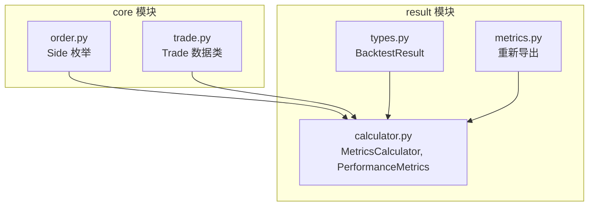
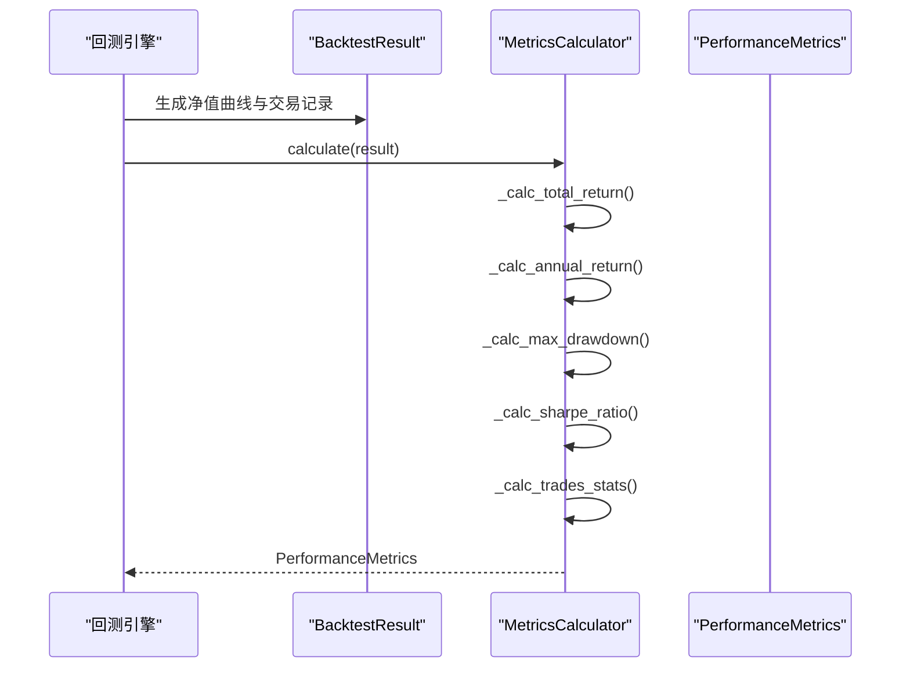
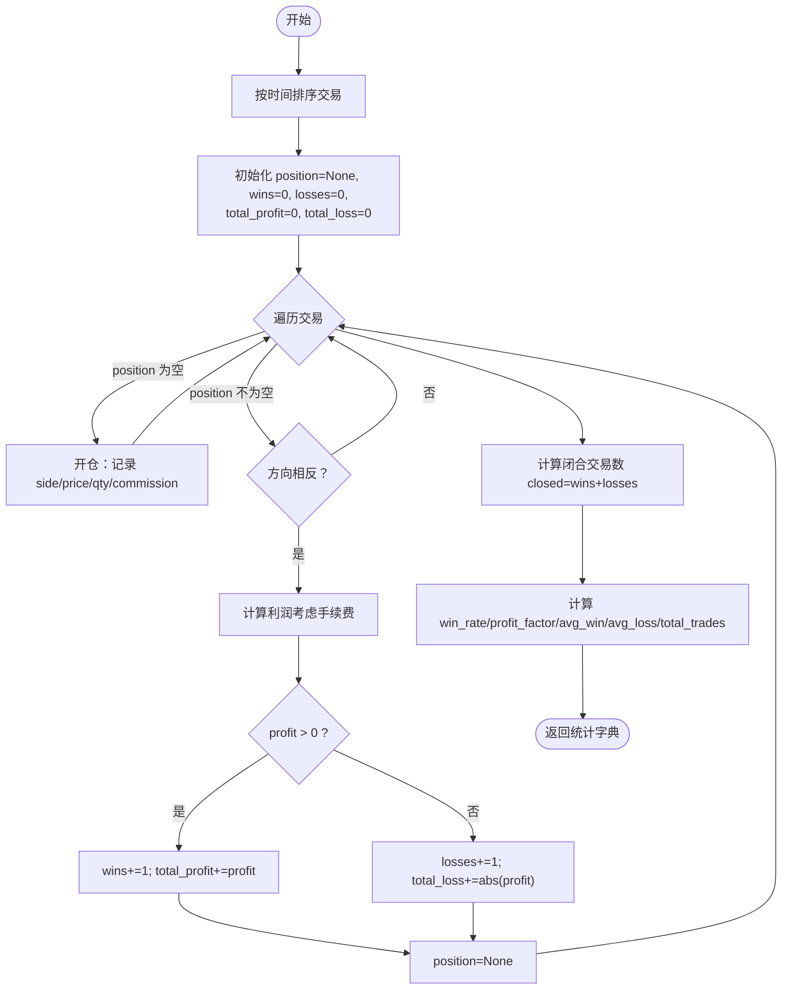
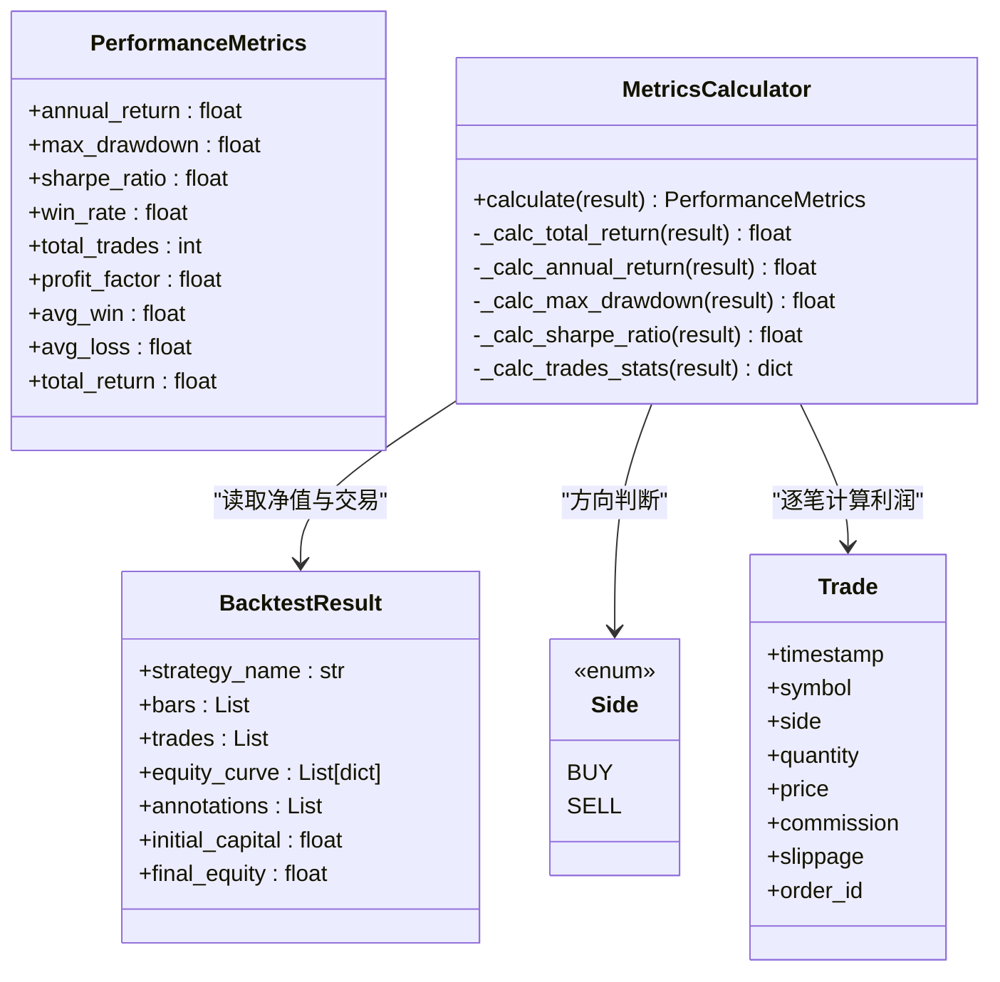

# 绩效指标计算

<cite>
**本文引用的文件**   
- [calculator.py](file://src/caisen/result/calculator.py)
- [metrics.py](file://src/caisen/result/metrics.py)
- [types.py](file://src/caisen/result/types.py)
- [order.py](file://src/caisen/core/order.py)
- [trade.py](file://src/caisen/core/trade.py)
- [test_metrics.py](file://tests/test_metrics.py)
- [test_backtest_result.py](file://tests/test_backtest_result.py)
- [0012-metrics-unification.md](file://docs/adr/0012-metrics-unification.md)
</cite>

## 目录
1. [简介](#简介)
2. [项目结构](#项目结构)
3. [核心组件](#核心组件)
4. [架构总览](#架构总览)
5. [详细组件分析](#详细组件分析)
6. [依赖关系分析](#依赖关系分析)
7. [性能与优化建议](#性能与优化建议)
8. [故障排查指南](#故障排查指南)
9. [结论](#结论)
10. [附录：自定义指标开发指南](#附录自定义指标开发指南)

## 简介
本技术文档聚焦于 Caisen 绩效指标计算系统，围绕 MetricsCalculator 类的核心算法实现展开，系统性阐述年化收益率、最大回撤、夏普比率、胜率、盈亏比等关键指标的数学公式与计算方法；详细说明 PerformanceMetrics 数据容器的字段定义与业务含义；解释交易统计逻辑（配对交易的识别、盈利亏损分类、平均盈利亏损计算）；覆盖边界条件处理（无交易、零收益、除零保护等）；并提供扩展与定制指标的计算指南与示例模式。

## 项目结构
绩效指标计算相关代码位于 result 子包中，采用“纯数据容器 + 单一计算器”的清晰分层：
- types.py：定义回测结果数据结构 BacktestResult（纯数据容器）。
- calculator.py：定义 MetricsCalculator 与 PerformanceMetrics（计算入口与结果容器）。
- metrics.py：对外重新导出 PerformanceMetrics 与 MetricsCalculator，便于上层导入。

图表来源
- [calculator.py:1-185](file://src/caisen/result/calculator.py#L1-L185)
- [types.py:1-32](file://src/caisen/result/types.py#L1-L32)
- [order.py:1-44](file://src/caisen/core/order.py#L1-L44)
- [trade.py:1-30](file://src/caisen/core/trade.py#L1-L30)
- [metrics.py:1-10](file://src/caisen/result/metrics.py#L1-L10)

章节来源
- [calculator.py:1-185](file://src/caisen/result/calculator.py#L1-L185)
- [types.py:1-32](file://src/caisen/result/types.py#L1-L32)
- [metrics.py:1-10](file://src/caisen/result/metrics.py#L1-L10)

## 核心组件
- MetricsCalculator：唯一的指标计算入口，负责从 BacktestResult 中提取净值曲线与交易记录，计算并返回 PerformanceMetrics。
- PerformanceMetrics：不可变的数据容器，包含年化收益率、最大回撤、夏普比率、胜率、总交易数、盈亏比、平均盈利、平均亏损、总收益率等字段。
- BacktestResult：回测输出数据容器，包含策略名、K线、交易记录、净值曲线、标注、初始资金与最终净值。

章节来源
- [calculator.py:17-79](file://src/caisen/result/calculator.py#L17-L79)
- [types.py:9-32](file://src/caisen/result/types.py#L9-L32)

## 架构总览
整体流程为：回测引擎生成 BacktestResult → MetricsCalculator.calculate 统一计算 → 输出 PerformanceMetrics → 持久化或展示。

图表来源
- [calculator.py:45-79](file://src/caisen/result/calculator.py#L45-L79)
- [types.py:9-32](file://src/caisen/result/types.py#L9-L32)

## 详细组件分析

### MetricsCalculator 核心算法与边界条件

#### 总收益率 total_return
- 公式：(final_equity - initial_capital) / initial_capital
- 边界：initial_capital == 0 时返回 0.0

章节来源
- [calculator.py:81-85](file://src/caisen/result/calculator.py#L81-L85)

#### 年化收益率 annual_return
- 假设每年 250 个交易日
- 公式：(1 + total_return)^(1/years) - 1，其中 years = days / 250
- 边界：equity_curve 为空或 initial_capital == 0 或 years <= 0 时返回 0.0

章节来源
- [calculator.py:87-99](file://src/caisen/result/calculator.py#L87-L99)

#### 最大回撤 max_drawdown
- 基于净值序列的峰值到谷值的最大相对跌幅
- 实现：对 equity 序列求 cummax，再计算 (equity - peak)/peak，取最小值
- 边界：equity_curve 为空时返回 0.0

章节来源
- [calculator.py:101-109](file://src/caisen/result/calculator.py#L101-L109)

#### 夏普比率 sharpe_ratio
- 假设无风险利率为 0，按日频计算后年化处理
- 步骤：由净值序列计算日收益率，去除空值；若样本长度不足或标准差为 0，返回 0.0；否则用 sqrt(250) * mean/std 年化
- 边界：equity_curve 长度 < 2 或 std == 0 时返回 0.0

章节来源
- [calculator.py:111-122](file://src/caisen/result/calculator.py#L111-L122)

#### 交易统计 trades_stats（胜率、盈亏比、平均盈利/亏损、总交易数）
- 输入：按时间排序的交易列表
- 配对规则：支持多头（BUY→SELL）与空头（SELL→BUY）配对平仓
- 利润计算：
  - 多头：profit = (sell_price - buy_price) * qty - commission_buy - commission_sell
  - 空头：profit = (buy_price - sell_price) * qty - commission_buy - commission_sell
- 分类：profit > 0 记为盈利，否则记为亏损；累计总盈利与总亏损绝对值
- 指标：
  - win_rate = wins / closed_pairs（closed_pairs > 0）
  - profit_factor = total_profit / total_loss（total_loss > 0）
  - avg_win = total_profit / wins（wins > 0）
  - avg_loss = total_loss / losses（losses > 0）
  - total_trades = 所有成交笔数（含未平仓）
- 边界：无交易时返回默认字典（各项为 0）

图表来源
- [calculator.py:124-185](file://src/caisen/result/calculator.py#L124-L185)
- [order.py:10-14](file://src/caisen/core/order.py#L10-L14)
- [trade.py:8-19](file://src/caisen/core/trade.py#L8-L19)

章节来源
- [calculator.py:124-185](file://src/caisen/result/calculator.py#L124-L185)
- [order.py:10-14](file://src/caisen/core/order.py#L10-L14)
- [trade.py:8-19](file://src/caisen/core/trade.py#L8-L19)

### PerformanceMetrics 数据容器
- 字段与业务含义
  - annual_return：年化收益率，反映复利增长水平
  - max_drawdown：最大回撤，衡量历史最大相对损失
  - sharpe_ratio：夏普比率，单位波动下的超额收益（无风险利率为 0）
  - win_rate：胜率，闭合交易中盈利交易占比
  - total_trades：总交易数，包含未平仓的成交笔数
  - profit_factor：盈亏比，总盈利与总亏损绝对值之比
  - avg_win：平均盈利，仅针对盈利交易
  - avg_loss：平均亏损，仅针对亏损交易
  - total_return：总收益率，区间内净收益比例

章节来源
- [calculator.py:17-31](file://src/caisen/result/calculator.py#L17-L31)

### 与外部类型的关系
- BacktestResult：提供净值曲线与交易记录，供 MetricsCalculator 读取
- Side：用于判断多空方向以正确配对与计算利润
- Trade：单笔成交记录，包含价格、数量、手续费、滑点等

章节来源
- [types.py:9-32](file://src/caisen/result/types.py#L9-L32)
- [order.py:10-14](file://src/caisen/core/order.py#L10-L14)
- [trade.py:8-19](file://src/caisen/core/trade.py#L8-L19)

## 依赖关系分析
- 直接依赖
  - MetricsCalculator 依赖 BacktestResult 的结构（净值曲线与交易列表）
  - 使用 pandas/numpy 进行向量化计算（净值序列、收益率、标准差）
  - 使用 core.order.Side 与 core.trade.Trade 进行配对与利润计算
- 间接依赖
  - metrics.py 仅做重新导出，不引入额外耦合
- 循环依赖
  - 通过 TYPE_CHECKING 避免运行时循环导入

图表来源
- [calculator.py:17-185](file://src/caisen/result/calculator.py#L17-L185)
- [types.py:9-32](file://src/caisen/result/types.py#L9-L32)
- [order.py:10-14](file://src/caisen/core/order.py#L10-L14)
- [trade.py:8-19](file://src/caisen/core/trade.py#L8-L19)

章节来源
- [calculator.py:17-185](file://src/caisen/result/calculator.py#L17-L185)
- [types.py:9-32](file://src/caisen/result/types.py#L9-L32)
- [order.py:10-14](file://src/caisen/core/order.py#L10-L14)
- [trade.py:8-19](file://src/caisen/core/trade.py#L8-L19)

## 性能与优化建议
- 向量化优先：净值序列与收益率计算已使用 pandas/numpy，保持向量化路径可显著提升大数据集性能。
- 交易统计复杂度：当前为 O(n) 单次扫描，适合大多数场景；若需高频增量更新，可维护滑动窗口统计量。
- 内存占用：避免在循环中创建大量中间对象；尽量复用 Series 与数组。
- 数值稳定性：当收益率标准差接近 0 时，夏普比率应返回 0.0，避免除零异常。
- 可扩展性：将各指标计算拆分为独立方法，便于并行或缓存（例如多标的批量回测）。

[本节为通用指导，不涉及具体文件分析]

## 故障排查指南
- 无交易情况
  - 现象：win_rate、profit_factor、avg_win、avg_loss 均为 0.0；total_trades 可能为 0
  - 原因：_calc_trades_stats 在无交易时返回默认字典
  - 参考测试用例：无交易场景断言
- 零收益或无波动
  - 现象：sharpe_ratio 为 0.0
  - 原因：收益率标准差为 0 或样本不足
  - 参考测试用例：净值恒定时夏普比率断言
- 最大回撤为 0
  - 现象：净值单调上升或曲线为空
  - 原因：峰值始终等于或小于当前值，或无数据
  - 参考测试用例：单调上涨与空曲线断言
- 初始资金为 0
  - 现象：total_return 与 annual_return 为 0.0
  - 原因：除零保护
  - 参考实现：_calc_total_return 与 _calc_annual_return 的边界分支

章节来源
- [calculator.py:81-122](file://src/caisen/result/calculator.py#L81-L122)
- [test_backtest_result.py:26-84](file://tests/test_backtest_result.py#L26-L84)
- [test_backtest_result.py:87-126](file://tests/test_backtest_result.py#L87-L126)
- [test_backtest_result.py:129-176](file://tests/test_backtest_result.py#L129-L176)
- [test_backtest_result.py:179-197](file://tests/test_backtest_result.py#L179-L197)
- [test_metrics.py:36-45](file://tests/test_metrics.py#L36-L45)

## 结论
MetricsCalculator 作为唯一计算入口，实现了稳健且清晰的绩效指标计算体系。其算法覆盖了收益、风险与交易质量三大维度，并通过完善的边界条件处理确保在极端情况下仍具备良好鲁棒性。配合 BacktestResult 与 PerformanceMetrics 的纯数据设计，系统具备良好的可测试性与可扩展性。

[本节为总结性内容，不涉及具体文件分析]

## 附录：自定义指标开发指南

### 新增指标的标准流程
- 在 MetricsCalculator 中添加私有计算方法，如 _calc_new_metric(result) -> float
- 在 calculate 中调用该方法，并将结果写入 PerformanceMetrics
- 在 PerformanceMetrics 中新增对应字段（保持只读数据容器语义）
- 补充单元测试，覆盖正常与边界场景

章节来源
- [calculator.py:45-79](file://src/caisen/result/calculator.py#L45-L79)
- [calculator.py:17-31](file://src/caisen/result/calculator.py#L17-L31)

### 计算优化技巧
- 利用 pandas/numpy 向量化计算，减少 Python 层循环
- 对重复计算的中间结果进行缓存（例如日收益率序列）
- 对大规模回测，考虑分块计算与增量更新

章节来源
- [calculator.py:101-122](file://src/caisen/result/calculator.py#L101-L122)

### 性能注意事项
- 避免在交易统计中频繁创建临时对象
- 注意浮点精度与除零保护
- 合理设置年化因子（当前固定为 250），如需适配不同市场可在配置中注入

章节来源
- [calculator.py:87-99](file://src/caisen/result/calculator.py#L87-L99)

### 使用模式与示例路径
- 基本用法：实例化 MetricsCalculator，传入 BacktestResult，获取 PerformanceMetrics
- 集成位置：结果持久化与优化器均通过 MetricsCalculator 统一计算
- 参考 ADR 决策说明与测试用例

章节来源
- [0012-metrics-unification.md:1-60](file://docs/adr/0012-metrics-unification.md#L1-L60)
- [test_backtest_result.py:200-233](file://tests/test_backtest_result.py#L200-L233)
- [test_metrics.py:33-79](file://tests/test_metrics.py#L33-L79)