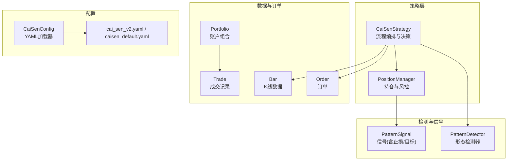
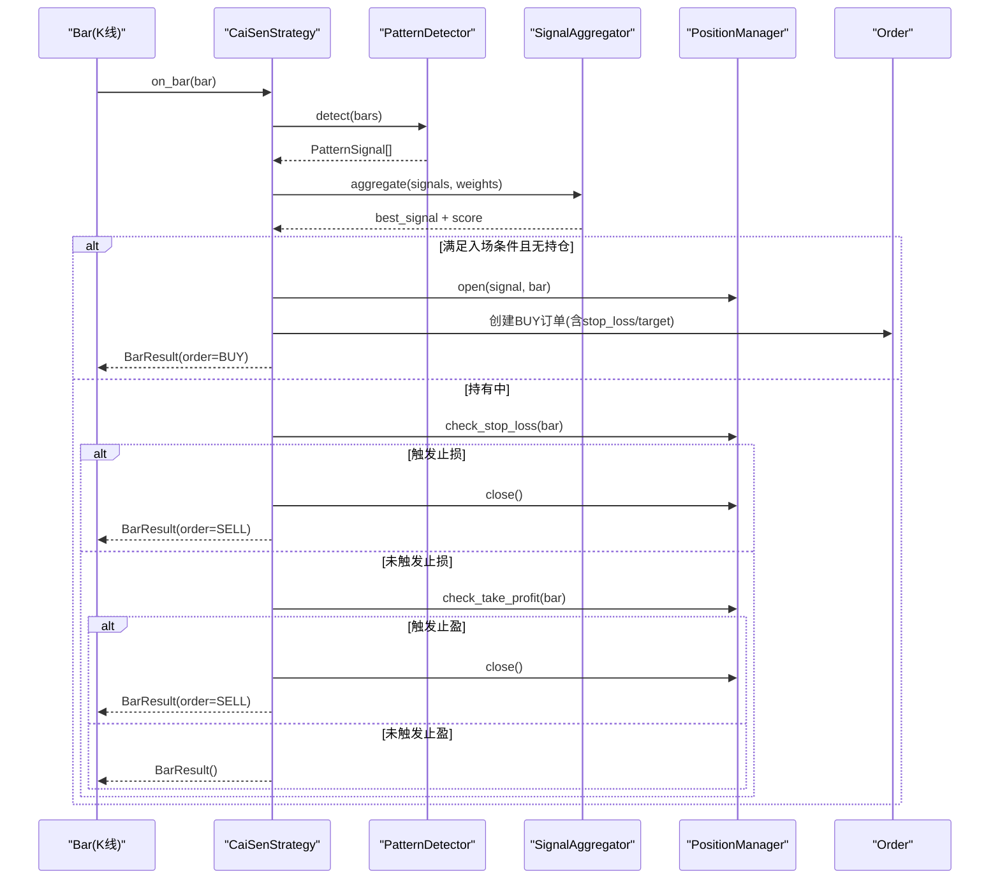
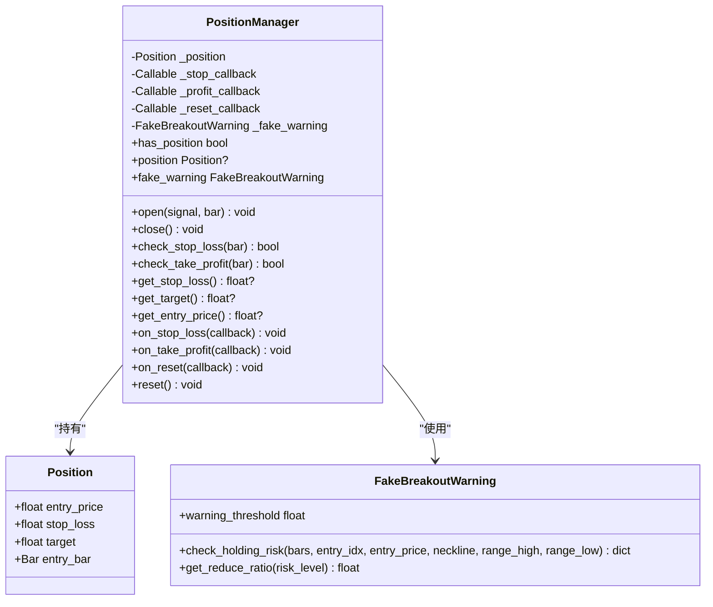
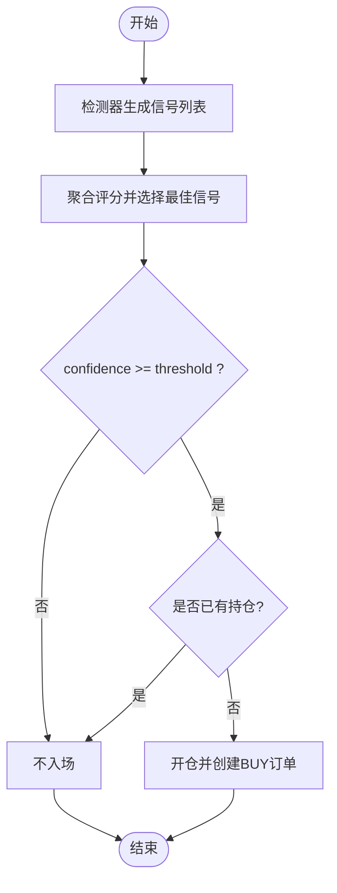
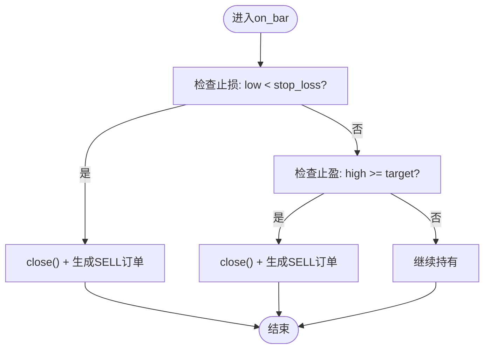
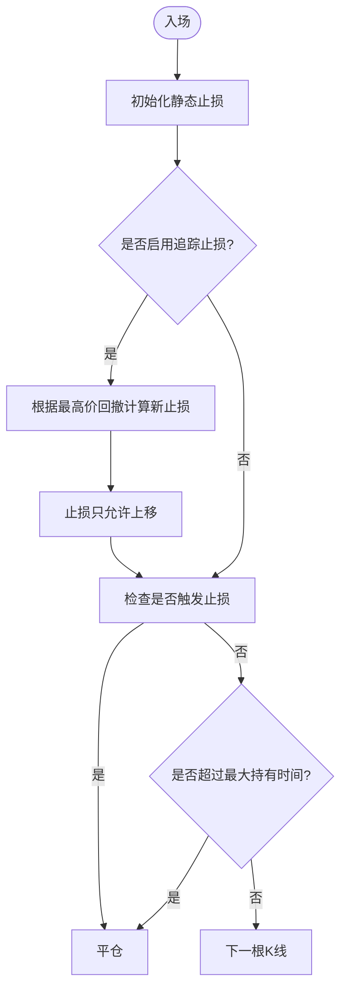
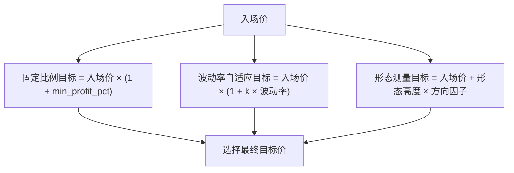
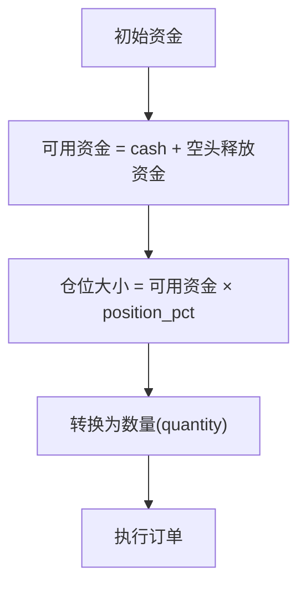
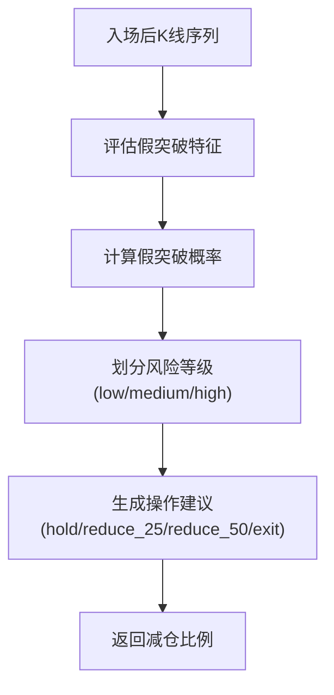
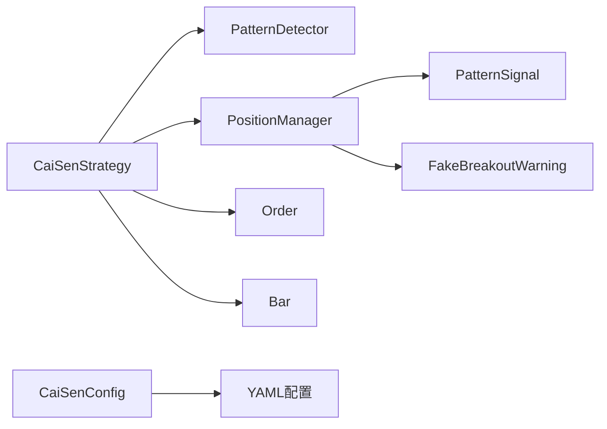

# 仓位管理系统

<cite>
**本文引用的文件**   
- [position_manager.py](file://src/caisen/strategy/algorithm/caisen_components/position_manager.py)
- [cai_sen.py](file://src/caisen/strategy/algorithm/cai_sen.py)
- [caisen_config.py](file://src/caisen/strategy/algorithm/caisen_config.py)
- [cai_sen_v2.yaml](file://configs/strategies/cai_sen_v2.yaml)
- [caisen_default.yaml](file://configs/strategies/caisen_default.yaml)
- [portfolio.py](file://src/caisen/core/portfolio.py)
- [position.py](file://src/caisen/core/position.py)
- [order.py](file://src/caisen/core/order.py)
- [trade.py](file://src/caisen/core/trade.py)
- [bar.py](file://src/caisen/core/bar.py)
- [base.py](file://src/caisen/strategy/base.py)
- [detector.py](file://src/caisen/strategy/algorithm/detector.py)
- [fake_breakout.py](file://src/caisen/strategy/algorithm/patterns/fake_breakout.py)
</cite>

## 目录
1. [简介](#简介)
2. [项目结构](#项目结构)
3. [核心组件](#核心组件)
4. [架构总览](#架构总览)
5. [详细组件分析](#详细组件分析)
6. [依赖关系分析](#依赖关系分析)
7. [性能与扩展性](#性能与扩展性)
8. [故障排查指南](#故障排查指南)
9. [结论](#结论)
10. [附录：参数调优与可视化监控](#附录参数调优与可视化监控)

## 简介
本技术文档聚焦蔡森策略的仓位管理系统，围绕 PositionManager 的风险控制机制展开，系统阐述止损止盈策略、仓位大小计算与资金管理规则；详细说明入场条件验证、持仓状态跟踪与出场触发逻辑；并给出动态止损调整算法（追踪止损、移动止损、时间止损）的实现思路与落地建议。同时解释盈利目标设定机制（固定比例目标、波动率自适应目标、形态测量目标），并提供风险控制参数调优指南以及仓位管理的可视化监控与绩效分析报告方法。

## 项目结构
仓位管理相关代码主要分布在以下模块：
- 策略层：CaiSenStrategy 负责流程编排与决策，调用信号聚合器与仓位管理器
- 仓位管理层：PositionManager 管理单标的持仓生命周期与风控判断
- 数据与订单层：Bar、Order、Trade、Portfolio 等基础数据结构
- 配置层：YAML 配置文件与 CaiSenConfig 加载器

图表来源
- [cai_sen.py:178-221](file://src/caisen/strategy/algorithm/cai_sen.py#L178-L221)
- [position_manager.py:24-170](file://src/caisen/strategy/algorithm/caisen_components/position_manager.py#L24-L170)
- [order.py:16-44](file://src/caisen/core/order.py#L16-L44)
- [bar.py:8-31](file://src/caisen/core/bar.py#L8-L31)
- [portfolio.py:7-46](file://src/caisen/core/portfolio.py#L7-L46)
- [caisen_config.py:11-145](file://src/caisen/strategy/algorithm/caisen_config.py#L11-L145)
- [cai_sen_v2.yaml:1-145](file://configs/strategies/cai_sen_v2.yaml#L1-L145)
- [caisen_default.yaml:1-50](file://configs/strategies/caisen_default.yaml#L1-L50)

章节来源
- [cai_sen.py:178-221](file://src/caisen/strategy/algorithm/cai_sen.py#L178-L221)
- [position_manager.py:24-170](file://src/caisen/strategy/algorithm/caisen_components/position_manager.py#L24-L170)
- [caisen_config.py:11-145](file://src/caisen/strategy/algorithm/caisen_config.py#L11-L145)
- [cai_sen_v2.yaml:1-145](file://configs/strategies/cai_sen_v2.yaml#L1-L145)
- [caisen_default.yaml:1-50](file://configs/strategies/caisen_default.yaml#L1-L50)

## 核心组件
- PositionManager：维护当前持仓信息（入场价、止损价、目标价、入场K线），提供开仓、平仓、止损检查、止盈检查、回调注册等方法，并内置假突破预警能力。
- CaiSenStrategy：每根K线驱动检测器生成信号，经聚合评分后依据阈值决定是否开仓；在持有期间执行止损/止盈检查，并生成对应订单。
- Order/Trade/Portfolio：订单、成交与账户组合的数据模型，用于回测引擎执行与绩效统计。
- CaiSenConfig/YAML：集中管理风控与仓位参数，如止损系数、最小盈利目标、移动止损开关与回撤比例等。

章节来源
- [position_manager.py:24-170](file://src/caisen/strategy/algorithm/caisen_components/position_manager.py#L24-L170)
- [cai_sen.py:178-221](file://src/caisen/strategy/algorithm/cai_sen.py#L178-L221)
- [order.py:16-44](file://src/caisen/core/order.py#L16-L44)
- [trade.py:8-30](file://src/caisen/core/trade.py#L8-L30)
- [portfolio.py:7-46](file://src/caisen/core/portfolio.py#L7-L46)
- [caisen_config.py:11-145](file://src/caisen/strategy/algorithm/caisen_config.py#L11-L145)
- [cai_sen_v2.yaml:33-48](file://configs/strategies/cai_sen_v2.yaml#L33-L48)
- [caisen_default.yaml:16-25](file://configs/strategies/caisen_default.yaml#L16-L25)

## 架构总览
下图展示从K线输入到订单输出的关键流程，以及仓位管理与风控的交互点。

图表来源
- [cai_sen.py:178-221](file://src/caisen/strategy/algorithm/cai_sen.py#L178-L221)
- [position_manager.py:89-147](file://src/caisen/strategy/algorithm/caisen_components/position_manager.py#L89-L147)
- [order.py:16-44](file://src/caisen/core/order.py#L16-L44)

## 详细组件分析

### PositionManager 风险分析与控制
- 持仓数据结构：包含入场价、止损价、目标价、入场K线，便于后续风控与可视化标注。
- 开仓：接收来自信号的最佳信号，设置止损与目标，并记录入场K线。
- 止损检查：当最低价跌破止损价时触发止损回调并返回True，由上层生成卖出订单。
- 止盈检查：当最高价达到或超过目标价时触发止盈回调并返回True，由上层生成卖出订单。
- 回调机制：支持注册止损、止盈与重置回调，便于外部记录日志、更新UI或触发风控告警。
- 假突破预警：通过 FakeBreakoutWarning 评估入场后的风险等级与建议减仓比例，辅助动态风控。

图表来源
- [position_manager.py:15-170](file://src/caisen/strategy/algorithm/caisen_components/position_manager.py#L15-L170)
- [position_manager.py:172-285](file://src/caisen/strategy/algorithm/caisen_components/position_manager.py#L172-L285)

章节来源
- [position_manager.py:24-170](file://src/caisen/strategy/algorithm/caisen_components/position_manager.py#L24-L170)
- [position_manager.py:172-285](file://src/caisen/strategy/algorithm/caisen_components/position_manager.py#L172-L285)

### 入场条件验证与信号生成
- 信号来源：各形态检测器输出 PatternSignal，包含 pattern、confidence、points、stop_loss、target 等字段。
- 评分聚合：SignalAggregator 根据权重对信号进行加权评分，选出最佳信号。
- 入场阈值：当最佳信号的 confidence 大于等于策略阈值，且当前无持仓时，执行开仓。
- 订单构造：Order 携带 symbol、side、quantity、stop_loss、target 等字段，供回测引擎执行。

图表来源
- [cai_sen.py:178-221](file://src/caisen/strategy/algorithm/cai_sen.py#L178-L221)
- [order.py:16-44](file://src/caisen/core/order.py#L16-L44)
- [detector.py](file://src/caisen/strategy/algorithm/detector.py)

章节来源
- [cai_sen.py:178-221](file://src/caisen/strategy/algorithm/cai_sen.py#L178-L221)
- [order.py:16-44](file://src/caisen/core/order.py#L16-L44)

### 出场触发逻辑（止损/止盈）
- 止损触发：当 bar.low < position.stop_loss 时，触发止损回调并关闭持仓，生成卖出订单。
- 止盈触发：当 bar.high >= position.target 时，触发止盈回调并关闭持仓，生成卖出订单。
- 重置回调：平仓后触发 reset 回调，可用于清理状态或记录交易结果。

图表来源
- [position_manager.py:109-147](file://src/caisen/strategy/algorithm/caisen_components/position_manager.py#L109-L147)
- [cai_sen.py:211-219](file://src/caisen/strategy/algorithm/cai_sen.py#L211-L219)

章节来源
- [position_manager.py:109-147](file://src/caisen/strategy/algorithm/caisen_components/position_manager.py#L109-L147)
- [cai_sen.py:211-219](file://src/caisen/strategy/algorithm/cai_sen.py#L211-L219)

### 动态止损调整算法（实现方法与落地建议）
当前 PositionManager 的基础版本仅支持静态止损与止盈。为支持动态止损，可在现有接口上扩展：
- 追踪止损（Trailing Stop）：基于历史最高价（多头）或最低价的回撤百分比动态上移止损。建议在 PositionManager 新增 update_trailing_stop(bar) 方法，并在 on_bar 中调用。
- 移动止损（Step Trailing）：按固定步长或价格区间移动止损，例如每上涨一定幅度将止损上移至新的水平位。
- 时间止损（Time-based Stop）：若持仓超过最大持有天数仍未达到目标，则强制平仓。可引入 entry_time 与 max_hold_bars 参数，在 on_bar 中检查持有时长。

[此图为概念流程图，不直接映射具体源码文件]

章节来源
- [position_manager.py:24-170](file://src/caisen/strategy/algorithm/caisen_components/position_manager.py#L24-L170)
- [cai_sen.py:178-221](file://src/caisen/strategy/algorithm/cai_sen.py#L178-L221)

### 盈利目标设定机制
- 固定比例目标：以入场价为基准，按固定百分比设定目标价（例如 min_profit_pct）。
- 波动率自适应目标：结合近期波动率（如 ATR 或标准差）按比例放大或缩小目标价，以适应不同品种与周期。
- 形态测量目标：基于形态颈线高度或整理区间宽度，按形态测量法计算目标价（例如 W底颈线高度投影）。

[此图为概念流程图，不直接映射具体源码文件]

章节来源
- [cai_sen_v2.yaml:33-48](file://configs/strategies/cai_sen_v2.yaml#L33-L48)
- [caisen_default.yaml:20-25](file://configs/strategies/caisen_default.yaml#L20-L25)

### 仓位大小计算与资金管理规则
- 仓位比例：配置文件提供 first_position_pct 与 second_position_pct，分别表示试仓与加仓的比例。
- 可用资金：Portfolio.get_available_cash 考虑现金与空头释放的资金，作为下单约束。
- 成本价值与净值：Portfolio.cost_value 与 get_equity_with_prices 用于估算组合价值与净值曲线。

图表来源
- [portfolio.py:33-39](file://src/caisen/core/portfolio.py#L33-L39)
- [caisen_default.yaml:16-18](file://configs/strategies/caisen_default.yaml#L16-L18)

章节来源
- [portfolio.py:7-46](file://src/caisen/core/portfolio.py#L7-L46)
- [caisen_default.yaml:16-18](file://configs/strategies/caisen_default.yaml#L16-L18)

### 假突破预警与减仓建议
- 风险评估：FakeBreakoutWarning.check_holding_risk 基于入场后的K线序列评估假突破特征，输出风险等级与减仓建议。
- 减仓比例：根据风险等级返回建议减仓比例（低/中/高风险对应不同比例），可与动态止损配合使用。

图表来源
- [position_manager.py:189-285](file://src/caisen/strategy/algorithm/caisen_components/position_manager.py#L189-L285)
- [fake_breakout.py](file://src/caisen/strategy/algorithm/patterns/fake_breakout.py)

章节来源
- [position_manager.py:189-285](file://src/caisen/strategy/algorithm/caisen_components/position_manager.py#L189-L285)

## 依赖关系分析
- 策略层依赖检测器与仓位管理器，订单与K线数据作为输入输出。
- 仓位管理器依赖信号中的止损与目标，以及可选的假突破预警器。
- 配置层通过 YAML 与 CaiSenConfig 提供风控与仓位参数。

图表来源
- [cai_sen.py:178-221](file://src/caisen/strategy/algorithm/cai_sen.py#L178-L221)
- [position_manager.py:24-170](file://src/caisen/strategy/algorithm/caisen_components/position_manager.py#L24-L170)
- [caisen_config.py:11-145](file://src/caisen/strategy/algorithm/caisen_config.py#L11-L145)
- [cai_sen_v2.yaml:1-145](file://configs/strategies/cai_sen_v2.yaml#L1-L145)

章节来源
- [cai_sen.py:178-221](file://src/caisen/strategy/algorithm/cai_sen.py#L178-L221)
- [position_manager.py:24-170](file://src/caisen/strategy/algorithm/caisen_components/position_manager.py#L24-L170)
- [caisen_config.py:11-145](file://src/caisen/strategy/algorithm/caisen_config.py#L11-L145)
- [cai_sen_v2.yaml:1-145](file://configs/strategies/cai_sen_v2.yaml#L1-L145)

## 性能与扩展性
- 计算复杂度：每根K线需遍历所有检测器，时间复杂度 O(N_detectors)。可通过减少启用的形态或并行化检测提升性能。
- 内存占用：bars 列表持续增长，建议定期裁剪或使用滑动窗口以减少内存占用。
- 扩展性：PositionManager 的回调机制便于接入外部风控与监控系统；动态止损扩展可按需增加方法而不破坏现有接口。

[本节为通用指导，无需特定文件引用]

## 故障排查指南
- 止损未触发：确认 PositionManager.check_stop_loss 的比较逻辑与止损价设置是否正确，检查 bar.low 与 stop_loss 的关系。
- 止盈未触发：确认 bar.high 与 position.target 的比较逻辑，确保目标价设置合理。
- 假突破预警误报：调整 warning_threshold 与 FakeBreakoutFeatures 的参数，观察触发特征集合。
- 订单未生成：检查 CaiSenStrategy.on_bar 的决策分支，确认入场阈值与持仓状态。

章节来源
- [position_manager.py:109-147](file://src/caisen/strategy/algorithm/caisen_components/position_manager.py#L109-L147)
- [cai_sen.py:198-221](file://src/caisen/strategy/algorithm/cai_sen.py#L198-L221)

## 结论
PositionManager 提供了简洁而有效的持仓与风控基础能力，结合 CaiSenStrategy 的流程编排与信号聚合，实现了从入场到出场的完整闭环。通过扩展动态止损与时间止损，可进一步提升风险控制精度与收益稳定性。配合合理的仓位大小与资金管理规则，能够在不同市场环境下保持稳健表现。

[本节为总结性内容，无需特定文件引用]

## 附录：参数调优与可视化监控

### 风险控制参数调优指南
- 止损系数（stop_loss_factor）：根据品种波动性与形态质量调整，通常设置在 0.93~0.96 之间，过大易被震荡洗盘，过小易频繁止损。
- 最小盈利目标（min_profit_pct）：建议不低于 3%，以保证盈亏比合理；可结合波动率自适应目标进行动态调整。
- 移动止损（trailing_stop_enabled/trailing_stop_pct）：在趋势行情中启用，回撤比例建议 5% 左右，避免过早离场。
- 最大持仓时间：根据策略风格与品种特性设定，短周期策略建议较短持有时间，中长线可适当放宽。

章节来源
- [cai_sen_v2.yaml:33-48](file://configs/strategies/cai_sen_v2.yaml#L33-L48)
- [caisen_default.yaml:20-25](file://configs/strategies/caisen_default.yaml#L20-L25)
- [caisen_config.py:30-38](file://src/caisen/strategy/algorithm/caisen_config.py#L30-L38)

### 可视化监控与绩效分析报告
- 可视化标注：CaiSenStrategy._make_pattern_annotation 输出形态标注（pattern、points、confidence、stop_loss、target），便于在前端图表中显示入场点、止损线与目标线。
- 净值曲线：使用 Portfolio.get_equity_with_prices 计算实时净值，绘制权益曲线与回撤图。
- 交易明细：记录 Trade 的 timestamp、symbol、side、quantity、price、commission、slippage，用于统计胜率、盈亏比与最大回撤。
- 前端面板：结合前端 chart-renderer 与 backtest-panel，展示 K线图、标注、订单与成交记录，支持筛选与对比。

章节来源
- [cai_sen.py:223-236](file://src/caisen/strategy/algorithm/cai_sen.py#L223-L236)
- [portfolio.py:25-31](file://src/caisen/core/portfolio.py#L25-L31)
- [trade.py:8-30](file://src/caisen/core/trade.py#L8-L30)