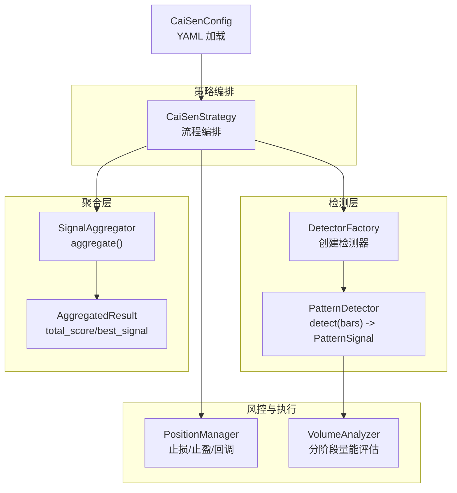
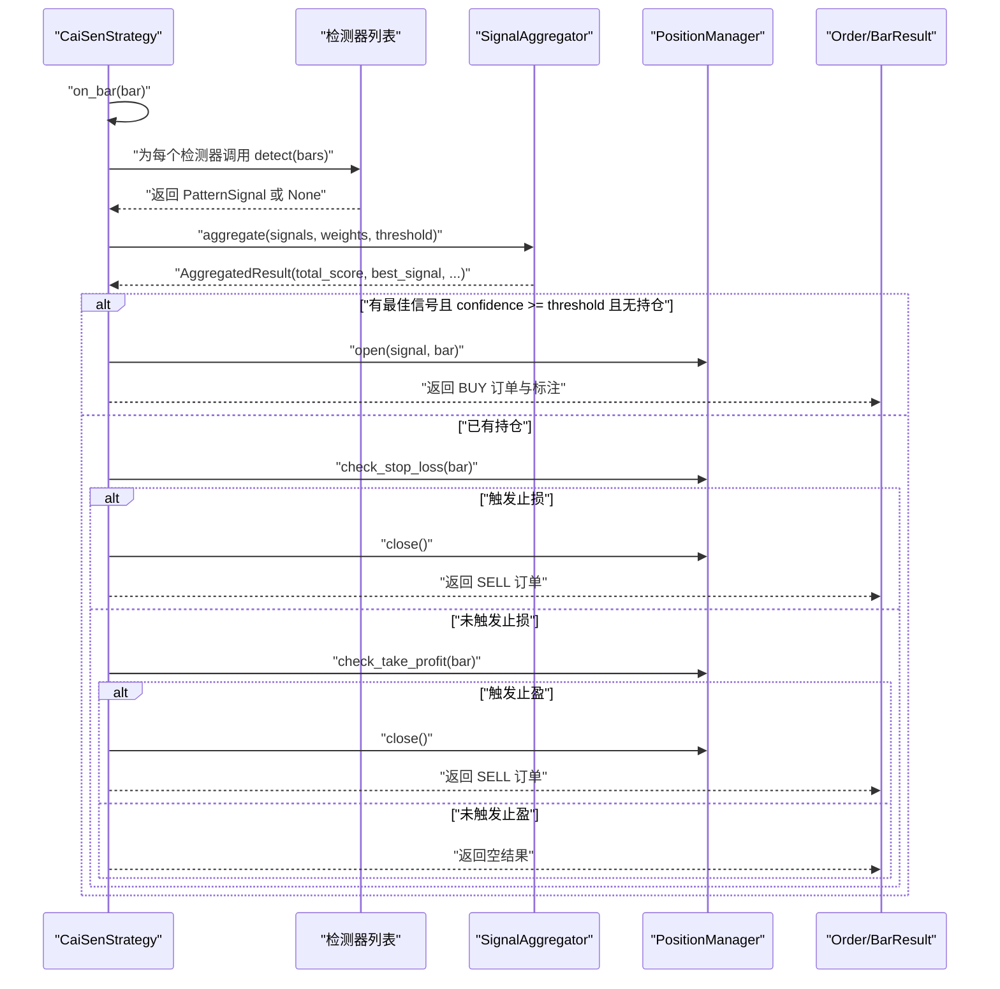
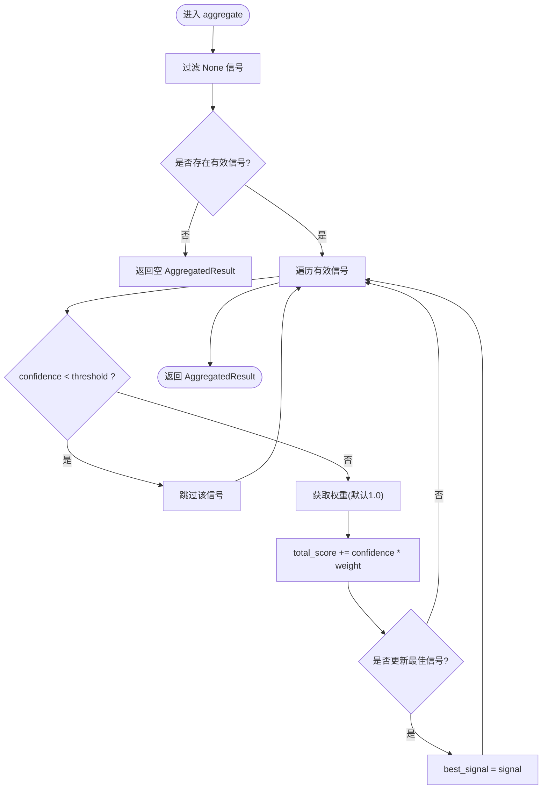
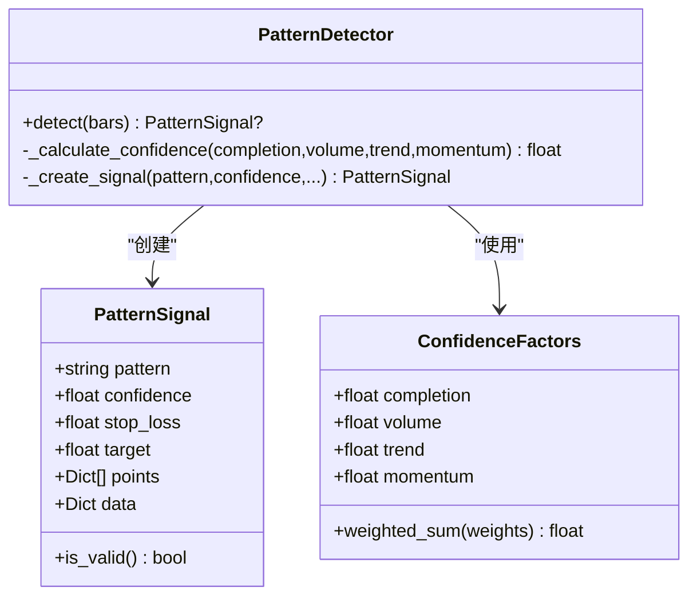
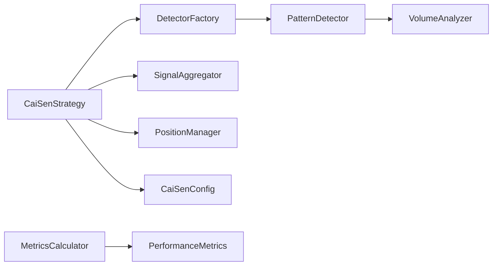

# 信号聚合系统

<cite>
**本文引用的文件**   
- [aggregator.py](file://src/caisen/strategy/algorithm/caisen_components/aggregator.py)
- [detector.py](file://src/caisen/strategy/algorithm/detector.py)
- [caisen_config.py](file://src/caisen/strategy/algorithm/caisen_config.py)
- [factory.py](file://src/caisen/strategy/algorithm/caisen_components/factory.py)
- [position_manager.py](file://src/caisen/strategy/algorithm/caisen_components/position_manager.py)
- [volume_analyzer.py](file://src/caisen/strategy/algorithm/caisen_components/volume_analyzer.py)
- [cai_sen.py](file://src/caisen/strategy/algorithm/cai_sen.py)
- [calculator.py](file://src/caisen/result/calculator.py)
</cite>

## 目录
1. [简介](#简介)
2. [项目结构](#项目结构)
3. [核心组件](#核心组件)
4. [架构总览](#架构总览)
5. [详细组件分析](#详细组件分析)
6. [依赖关系分析](#依赖关系分析)
7. [性能与复杂度](#性能与复杂度)
8. [故障排查指南](#故障排查指南)
9. [结论](#结论)
10. [附录](#附录)

## 简介
本技术文档聚焦蔡森策略的信号聚合系统，围绕 SignalAggregator 的工作原理展开，涵盖多检测器信号的加权聚合算法、置信度计算与最佳信号选择机制、权重分配策略（含动态权重与自适应更新思路）、信号冲突解决（多头 vs 空头优先级与强度比较）、综合评分与阈值判定逻辑、信号质量评估指标与性能监控方法，以及信号过滤规则、噪声处理与异常值处理的实现细节。

## 项目结构
信号聚合系统位于策略算法层，采用“检测器工厂 + 信号聚合器 + 仓位管理”的组件化设计：
- 检测器负责形态识别并输出 PatternSignal（包含 confidence、stop_loss、target 等）
- 聚合器对多个检测器的信号进行加权求和与最佳信号选择
- 仓位管理器负责开平仓与风控检查
- 量能分析器提供分阶段量能评估，辅助置信度因子
- 配置加载器统一读取 YAML 中的开关与权重

图表来源
- [cai_sen.py:178-221](file://src/caisen/strategy/algorithm/cai_sen.py#L178-L221)
- [factory.py:81-111](file://src/caisen/strategy/algorithm/caisen_components/factory.py#L81-L111)
- [detector.py:80-123](file://src/caisen/strategy/algorithm/detector.py#L80-L123)
- [aggregator.py:42-110](file://src/caisen/strategy/algorithm/caisen_components/aggregator.py#L42-L110)
- [position_manager.py:24-170](file://src/caisen/strategy/algorithm/caisen_components/position_manager.py#L24-L170)
- [volume_analyzer.py:15-126](file://src/caisen/strategy/algorithm/caisen_components/volume_analyzer.py#L15-L126)
- [caisen_config.py:70-114](file://src/caisen/strategy/algorithm/caisen_config.py#L70-L114)

章节来源
- [cai_sen.py:178-221](file://src/caisen/strategy/algorithm/cai_sen.py#L178-L221)
- [factory.py:81-111](file://src/caisen/strategy/algorithm/caisen_components/factory.py#L81-L111)
- [detector.py:80-123](file://src/caisen/strategy/algorithm/detector.py#L80-L123)
- [aggregator.py:42-110](file://src/caisen/strategy/algorithm/caisen_components/aggregator.py#L42-L110)
- [position_manager.py:24-170](file://src/caisen/strategy/algorithm/caisen_components/position_manager.py#L24-L170)
- [volume_analyzer.py:15-126](file://src/caisen/strategy/algorithm/caisen_components/volume_analyzer.py#L15-L126)
- [caisen_config.py:70-114](file://src/caisen/strategy/algorithm/caisen_config.py#L70-L114)

## 核心组件
- 信号聚合器（SignalAggregator）
  - 输入：检测器返回的 PatternSignal 列表（可能含 None）、各形态权重字典、最小置信度阈值
  - 输出：AggregatedResult（包含 total_score、best_signal、signals、signal_count）
  - 关键逻辑：过滤无效信号、按形态权重加权累加评分、选择最高置信度的最佳信号
- 检测器基类（PatternDetector）
  - 纯函数接口 detect(bars) -> Optional[PatternSignal]
  - 内置置信度计算工具 _calculate_confidence，基于 Completion/Volume/Trend/Momentum 四因子加权
- 仓位管理器（PositionManager）
  - 管理持仓状态、止损/止盈触发、回调通知、假突破预警
- 量能分析器（VolumeAnalyzer）
  - 分阶段量能评估（形成期缩量、突破放量、确认期递增/回踩），量化等级与背离检测
- 配置加载器（CaiSenConfig）
  - 从 YAML 加载参数、形态开关与形态权重映射

章节来源
- [aggregator.py:16-110](file://src/caisen/strategy/algorithm/caisen_components/aggregator.py#L16-L110)
- [detector.py:18-78](file://src/caisen/strategy/algorithm/detector.py#L18-L78)
- [detector.py:125-150](file://src/caisen/strategy/algorithm/detector.py#L125-L150)
- [position_manager.py:24-170](file://src/caisen/strategy/algorithm/caisen_components/position_manager.py#L24-L170)
- [volume_analyzer.py:15-126](file://src/caisen/strategy/algorithm/caisen_components/volume_analyzer.py#L15-L126)
- [caisen_config.py:11-68](file://src/caisen/strategy/algorithm/caisen_config.py#L11-L68)

## 架构总览
下图展示 CaiSenStrategy 在每根 K 线的处理流程：检测器并行检测、聚合器加权评分、决策层依据阈值与仓位状态生成订单或风控动作。

图表来源
- [cai_sen.py:178-221](file://src/caisen/strategy/algorithm/cai_sen.py#L178-L221)
- [aggregator.py:59-110](file://src/caisen/strategy/algorithm/caisen_components/aggregator.py#L59-L110)
- [position_manager.py:89-170](file://src/caisen/strategy/algorithm/caisen_components/position_manager.py#L89-L170)

## 详细组件分析

### 信号聚合器（SignalAggregator）工作原理
- 过滤与有效性判断
  - 过滤 None 信号；可选地跳过低于阈值的信号（confidence < threshold）
- 加权评分
  - 对每个有效信号，取 weights.get(signal.pattern, 1.0) 作为权重，累加 signal.confidence * weight
- 最佳信号选择
  - 选择 confidence 最高的信号作为 best_signal
- 便捷方法
  - aggregate_with_detection：先调用 detectors.detect(bars)，再聚合

图表来源
- [aggregator.py:59-110](file://src/caisen/strategy/algorithm/caisen_components/aggregator.py#L59-L110)

章节来源
- [aggregator.py:59-110](file://src/caisen/strategy/algorithm/caisen_components/aggregator.py#L59-L110)

### 置信度计算与信号数据结构
- PatternSignal
  - 字段：pattern、confidence、stop_loss、target、points、data
  - is_valid：confidence > 0 且 stop_loss > 0
- ConfidenceFactors
  - 四因子：completion、volume、trend、momentum
  - weighted_sum：默认权重 completion=0.4、volume=0.3、trend=0.2、momentum=0.1，可自定义
- 检测器基类辅助
  - _calculate_confidence：将四因子封装为 ConfidenceFactors 并做边界裁剪到 [0,1]
  - _create_signal：构造 PatternSignal

图表来源
- [detector.py:18-78](file://src/caisen/strategy/algorithm/detector.py#L18-L78)
- [detector.py:125-150](file://src/caisen/strategy/algorithm/detector.py#L125-L150)
- [detector.py:151-180](file://src/caisen/strategy/algorithm/detector.py#L151-L180)

章节来源
- [detector.py:18-78](file://src/caisen/strategy/algorithm/detector.py#L18-L78)
- [detector.py:125-150](file://src/caisen/strategy/algorithm/detector.py#L125-L150)
- [detector.py:151-180](file://src/caisen/strategy/algorithm/detector.py#L151-L180)

### 权重分配策略与动态调整
- 静态权重
  - 通过 weights 字典传入，键为形态名称（如 w_bottom、m_top），值为权重系数；未在字典中出现的形态默认权重为 1.0
- 动态权重调整（建议方案）
  - 基于近期表现滚动更新：统计最近 N 个时间窗内各形态的胜率、盈亏比、夏普贡献等，按目标函数（如最大化夏普或收益回撤比）重新归一化为权重
  - 平滑过渡：使用指数移动平均（EMA）或软更新避免权重剧烈波动
- 自适应权重更新（建议方案）
  - 结合 Walk-Forward 验证与在线监控：当某形态在样本外窗口表现显著退化时，降低其权重；反之提升
  - 约束条件：权重非负、总和固定（如 1.0），防止极端值

章节来源
- [aggregator.py:95-100](file://src/caisen/strategy/algorithm/caisen_components/aggregator.py#L95-L100)
- [cai_sen.py:125-126](file://src/caisen/strategy/algorithm/cai_sen.py#L125-L126)

### 信号冲突解决机制（多头 vs 空头）
- 当前实现
  - 最佳信号选择仅依据 confidence 最大值，不区分方向（多头/空头）
  - 策略层 on_bar 仅产生 BUY 订单（做多），空头信号不会直接触发卖出
- 建议增强
  - 引入方向偏好与冲突消解：若同时出现多头与空头信号，优先选择与趋势共振的方向；或在同向信号中选择强度更高者
  - 强度比较：除 confidence 外，可融合量价配合（VolumeAnalyzer 得分）、形态完成度、动量因子等复合强度

章节来源
- [aggregator.py:101-103](file://src/caisen/strategy/algorithm/caisen_components/aggregator.py#L101-L103)
- [cai_sen.py:199-209](file://src/caisen/strategy/algorithm/cai_sen.py#L199-L209)

### 综合评分与阈值判定
- 综合评分 total_score
  - 定义：对所有通过阈值的有效信号，按形态权重加权求和 total_score = Σ(confidence_i × weight_i)
- 阈值判定
  - 入场条件：best_signal.confidence >= strategy.threshold 且无持仓
  - 注意：当前策略使用 best_signal.confidence 而非 total_score 作为入场阈值

章节来源
- [aggregator.py:86-100](file://src/caisen/strategy/algorithm/caisen_components/aggregator.py#L86-L100)
- [cai_sen.py:199-209](file://src/caisen/strategy/algorithm/cai_sen.py#L199-L209)

### 信号质量评估指标与性能监控
- 信号质量维度
  - 形态完成度、量能配合、趋势共振、动量因子（由 ConfidenceFactors 提供）
  - 量能等级（weak/normal/strong）与阶段通过率（VolumeAnalyzer.staged_volume_check）
- 绩效指标（用于监控与优化）
  - 年化收益、最大回撤、夏普比率、胜率、盈亏比、平均盈利/亏损、总交易数
  - 计算入口：MetricsCalculator.calculate(result)

章节来源
- [detector.py:46-78](file://src/caisen/strategy/algorithm/detector.py#L46-L78)
- [volume_analyzer.py:127-156](file://src/caisen/strategy/algorithm/caisen_components/volume_analyzer.py#L127-L156)
- [calculator.py:34-79](file://src/caisen/result/calculator.py#L34-L79)

### 信号过滤规则、噪声处理与异常值处理
- 过滤规则
  - 过滤 None 信号；可选过滤低于阈值的信号（confidence < threshold）
- 噪声处理
  - 量能阶段评估对异常低量或高量进行分级与打分，避免单一放量/缩量误判
  - 趋势判断使用最近 period 根 K 线对比，减少短期噪声影响
- 异常值处理
  - 基础均量为 0 时，量能比值退化为 1.0，避免除零错误
  - 数据不足时（bars 长度不够），量能等级与阶段评估返回保守值

章节来源
- [aggregator.py:75-93](file://src/caisen/strategy/algorithm/caisen_components/aggregator.py#L75-L93)
- [volume_analyzer.py:34-53](file://src/caisen/strategy/algorithm/caisen_components/volume_analyzer.py#L34-L53)
- [volume_analyzer.py:98-103](file://src/caisen/strategy/algorithm/caisen_components/volume_analyzer.py#L98-L103)
- [detector.py:194-207](file://src/caisen/strategy/algorithm/detector.py#L194-L207)

## 依赖关系分析
- 组件耦合
  - CaiSenStrategy 依赖 DetectorFactory、SignalAggregator、PositionManager
  - PatternDetector 依赖 VolumeAnalyzer 进行量能评估
  - CaiSenConfig 提供 YAML 配置解析与默认权重映射
- 外部依赖
  - 绩效指标计算依赖 pandas/numpy（MetricsCalculator）

图表来源
- [cai_sen.py:178-221](file://src/caisen/strategy/algorithm/cai_sen.py#L178-L221)
- [factory.py:81-111](file://src/caisen/strategy/algorithm/caisen_components/factory.py#L81-L111)
- [detector.py:97-110](file://src/caisen/strategy/algorithm/detector.py#L97-L110)
- [calculator.py:34-79](file://src/caisen/result/calculator.py#L34-L79)

章节来源
- [cai_sen.py:178-221](file://src/caisen/strategy/algorithm/cai_sen.py#L178-L221)
- [factory.py:81-111](file://src/caisen/strategy/algorithm/caisen_components/factory.py#L81-L111)
- [detector.py:97-110](file://src/caisen/strategy/algorithm/detector.py#L97-L110)
- [calculator.py:34-79](file://src/caisen/result/calculator.py#L34-L79)

## 性能与复杂度
- 时间复杂度
  - 单根 K 线：检测器数量 N，聚合器线性扫描 M 个信号，总体 O(N + M)
  - 量能评估：阶段评估与基础均量计算为 O(K)（K 为阶段长度）
- 空间复杂度
  - bars 列表累积增长，内存占用随时间线性增加；可在策略层定期清理历史 bars
- 优化建议
  - 批量检测：对检测器进行并行化（线程/进程池）
  - 增量计算：基础均量与阶段统计可维护滑动窗口缓存
  - 阈值早停：当 best_signal 已满足阈值且无需继续比较时可提前退出

章节来源
- [aggregator.py:86-110](file://src/caisen/strategy/algorithm/caisen_components/aggregator.py#L86-L110)
- [volume_analyzer.py:55-126](file://src/caisen/strategy/algorithm/caisen_components/volume_analyzer.py#L55-L126)

## 故障排查指南
- 常见问题
  - 无信号：检查 threshold 是否过高、weights 是否为空、检测器是否启用
  - 重复买入：确认 PositionManager.has_position 状态与策略层入场条件
  - 止损/止盈未触发：核对 stop_loss/target 设置与 Bar 的高低价覆盖
- 定位步骤
  - 打印 AggregatedResult.total_score 与 best_signal.confidence，确认阈值判定
  - 查看 VolumeAnalyzer 的阶段得分与等级，确认量能配合是否合理
  - 使用 MetricsCalculator 计算绩效指标，评估整体表现

章节来源
- [cai_sen.py:199-221](file://src/caisen/strategy/algorithm/cai_sen.py#L199-L221)
- [position_manager.py:109-147](file://src/caisen/strategy/algorithm/caisen_components/position_manager.py#L109-L147)
- [calculator.py:45-79](file://src/caisen/result/calculator.py#L45-L79)

## 结论
SignalAggregator 以简洁高效的加权求和与最佳信号选择为核心，配合 PatternDetector 的多维置信度因子与 VolumeAnalyzer 的分阶段量能评估，形成了稳健的信号聚合体系。当前实现偏向做多场景，未来可在冲突消解、动态权重与自适应更新方面进一步增强，以提升在不同市场环境下的鲁棒性与收益风险比。

## 附录
- 配置示例与默认权重映射参考
  - 形态权重与开关可通过 YAML 配置，策略初始化时合并为 weights 字典
- 相关实现路径
  - 策略主流程：[cai_sen.py:178-221](file://src/caisen/strategy/algorithm/cai_sen.py#L178-L221)
  - 聚合器核心：[aggregator.py:59-110](file://src/caisen/strategy/algorithm/caisen_components/aggregator.py#L59-L110)
  - 检测器基类与置信度：[detector.py:80-150](file://src/caisen/strategy/algorithm/detector.py#L80-L150)
  - 量能分析器：[volume_analyzer.py:15-126](file://src/caisen/strategy/algorithm/caisen_components/volume_analyzer.py#L15-L126)
  - 仓位管理：[position_manager.py:24-170](file://src/caisen/strategy/algorithm/caisen_components/position_manager.py#L24-L170)
  - 配置加载：[caisen_config.py:70-114](file://src/caisen/strategy/algorithm/caisen_config.py#L70-L114)
  - 绩效指标：[calculator.py:34-79](file://src/caisen/result/calculator.py#L34-L79)