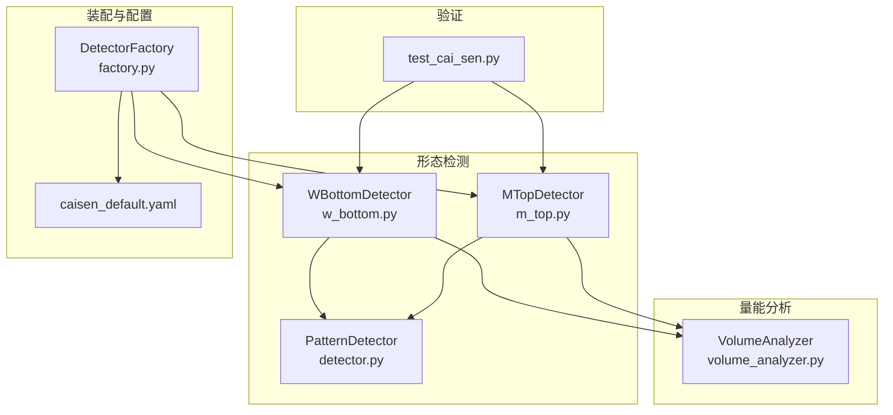
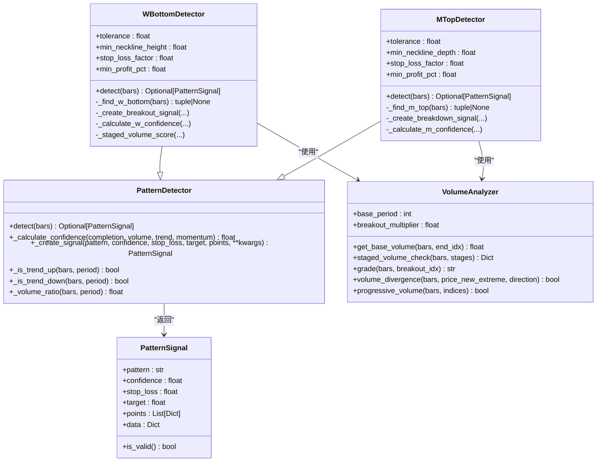
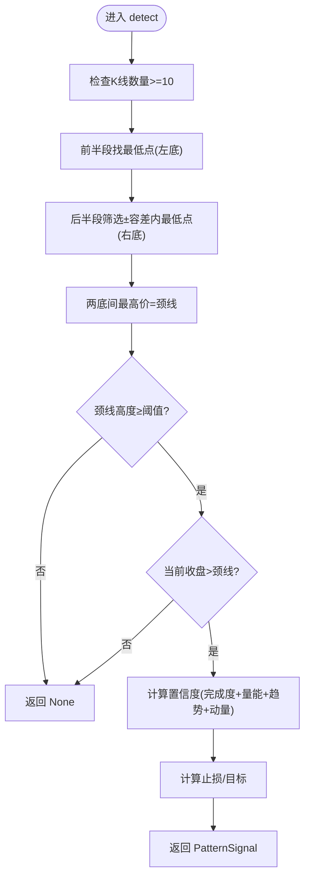
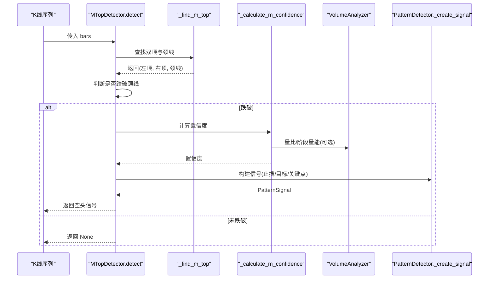
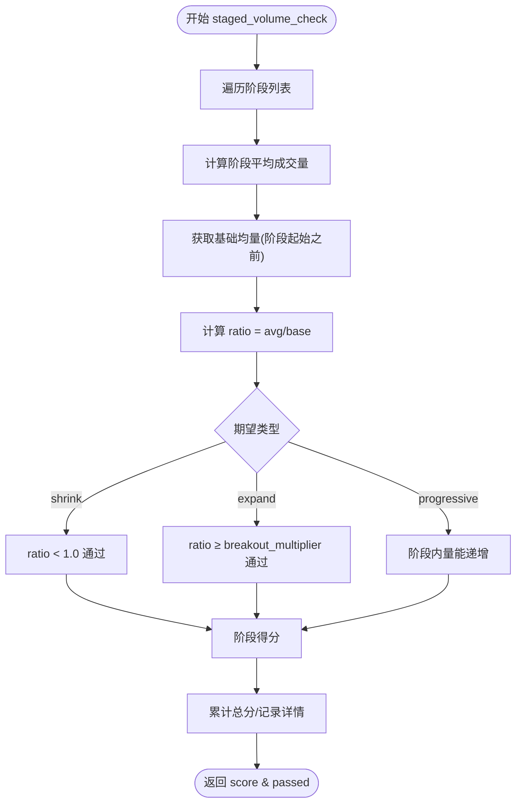
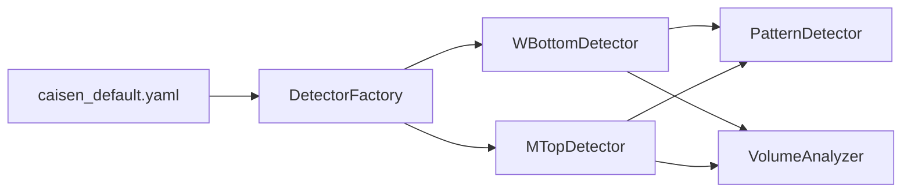

# W底/M头形态检测器

<cite>
**本文引用的文件**   
- [w_bottom.py](file://src/caisen/strategy/algorithm/patterns/w_bottom.py)
- [m_top.py](file://src/caisen/strategy/algorithm/patterns/m_top.py)
- [detector.py](file://src/caisen/strategy/algorithm/detector.py)
- [volume_analyzer.py](file://src/caisen/strategy/algorithm/caisen_components/volume_analyzer.py)
- [factory.py](file://src/caisen/strategy/algorithm/caisen_components/factory.py)
- [caisen_default.yaml](file://configs/strategies/caisen_default.yaml)
- [test_cai_sen.py](file://tests/test_cai_sen.py)
</cite>

## 目录
1. [简介](#简介)
2. [项目结构](#项目结构)
3. [核心组件](#核心组件)
4. [架构总览](#架构总览)
5. [详细组件分析](#详细组件分析)
6. [依赖关系分析](#依赖关系分析)
7. [性能与复杂度](#性能与复杂度)
8. [参数调优指南](#参数调优指南)
9. [误报过滤机制](#误报过滤机制)
10. [实战示例与可视化要点](#实战示例与可视化要点)
11. [故障排查](#故障排查)
12. [结论](#结论)

## 简介
本技术文档聚焦于W底（双底）与M头（双顶）形态检测器的算法实现、置信度模型、量能三阶段确认、趋势共振因子以及参数调优与误报过滤。系统采用纯函数式接口，检测器仅负责“看”，不做交易决策；信号通过统一基类与聚合器进行加权与阈值过滤，便于回测与实盘集成。

## 项目结构
与W底/M头相关的核心代码位于策略算法层：
- 形态检测器：W底与M头分别实现为独立检测器类
- 检测器基类：提供统一的信号结构、置信度计算、趋势与量比工具方法
- 量能分析器：按蔡森理论进行分阶段量能评估
- 工厂与配置：根据配置动态创建检测器并注入参数
- 测试用例：覆盖基本形态识别流程与边界条件

图表来源
- [w_bottom.py:1-285](file://src/caisen/strategy/algorithm/patterns/w_bottom.py#L1-L285)
- [m_top.py:1-227](file://src/caisen/strategy/algorithm/patterns/m_top.py#L1-L227)
- [detector.py:1-244](file://src/caisen/strategy/algorithm/detector.py#L1-L244)
- [volume_analyzer.py:1-287](file://src/caisen/strategy/algorithm/caisen_components/volume_analyzer.py#L1-L287)
- [factory.py:152-237](file://src/caisen/strategy/algorithm/caisen_components/factory.py#L152-L237)
- [caisen_default.yaml:1-50](file://configs/strategies/caisen_default.yaml#L1-L50)
- [test_cai_sen.py:63-119](file://tests/test_cai_sen.py#L63-L119)

章节来源
- [w_bottom.py:1-285](file://src/caisen/strategy/algorithm/patterns/w_bottom.py#L1-L285)
- [m_top.py:1-227](file://src/caisen/strategy/algorithm/patterns/m_top.py#L1-L227)
- [detector.py:1-244](file://src/caisen/strategy/algorithm/detector.py#L1-L244)
- [volume_analyzer.py:1-287](file://src/caisen/strategy/algorithm/caisen_components/volume_analyzer.py#L1-L287)
- [factory.py:152-237](file://src/caisen/strategy/algorithm/caisen_components/factory.py#L152-L237)
- [caisen_default.yaml:1-50](file://configs/strategies/caisen_default.yaml#L1-L50)
- [test_cai_sen.py:63-119](file://tests/test_cai_sen.py#L63-L119)

## 核心组件
- PatternDetector（基类）
  - 定义统一信号结构 PatternSignal 与置信度因子 ConfidenceFactors
  - 提供通用方法：趋势判断、量比计算、置信度加权求和、信号构造
- WBottomDetector（W底检测器）
  - 寻找两个相近低点（±容差），定位颈线（两低点间高点），突破颈线确认
  - 置信度包含完成度、三阶段量能、趋势共振、动量
- MTopDetector（M头检测器）
  - 寻找两个相近高点（±容差），定位颈线（两高点间低点），跌破颈线确认
  - 置信度包含完成度、量比、趋势共振、动量
- VolumeAnalyzer（量能分析器）
  - 支持分阶段量能检查（形成期缩量、突破期放量、确认期持续或回踩缩量）
  - 提供基础均量、阶段评分、等级划分、量价背离等工具

章节来源
- [detector.py:18-78](file://src/caisen/strategy/algorithm/detector.py#L18-L78)
- [detector.py:125-149](file://src/caisen/strategy/algorithm/detector.py#L125-L149)
- [w_bottom.py:11-48](file://src/caisen/strategy/algorithm/patterns/w_bottom.py#L11-L48)
- [m_top.py:11-47](file://src/caisen/strategy/algorithm/patterns/m_top.py#L11-L47)
- [volume_analyzer.py:15-126](file://src/caisen/strategy/algorithm/caisen_components/volume_analyzer.py#L15-L126)

## 架构总览
W底/M头检测器遵循纯函数接口：输入K线序列，输出信号或无信号。检测器内部调用量能分析器与趋势工具，最终由基类汇总置信度并生成标准化信号。

图表来源
- [detector.py:80-180](file://src/caisen/strategy/algorithm/detector.py#L80-L180)
- [w_bottom.py:11-285](file://src/caisen/strategy/algorithm/patterns/w_bottom.py#L11-L285)
- [m_top.py:11-227](file://src/caisen/strategy/algorithm/patterns/m_top.py#L11-L227)
- [volume_analyzer.py:15-287](file://src/caisen/strategy/algorithm/caisen_components/volume_analyzer.py#L15-L287)

## 详细组件分析

### W底检测器（双底）
- 形态识别流程
  - 窗口：最近10根K线
  - 第一步：在前半段（前5根）找最低点作为左底
  - 第二步：在后半段（后5根）筛选与左底价格差异在±容差内的候选低点，取最低者作为右底
  - 第三步：在两底之间的高点中取最高值作为颈线
  - 第四步：若当前收盘价高于颈线，则视为突破确认
- 置信度模型
  - 完成度：左右底价差相对容差的归一化，越对称得分越高
  - 量能：三阶段评分（形成期缩量、突破期放量、确认期持续或回踩缩量）
  - 趋势：上升趋势赋予更高权重
  - 动量：突破幅度越大，动量因子越高
- 止损与目标
  - 振幅 = 颈线 - min(左底, 右底)
  - 目标 = max(颈线 + 振幅, 当前价 × (1 + 最小盈利百分比))
  - 止损 = min(左底, 右底) × 止损系数

图表来源
- [w_bottom.py:49-80](file://src/caisen/strategy/algorithm/patterns/w_bottom.py#L49-L80)
- [w_bottom.py:82-133](file://src/caisen/strategy/algorithm/patterns/w_bottom.py#L82-L133)
- [w_bottom.py:135-189](file://src/caisen/strategy/algorithm/patterns/w_bottom.py#L135-L189)
- [w_bottom.py:191-241](file://src/caisen/strategy/algorithm/patterns/w_bottom.py#L191-L241)
- [w_bottom.py:243-284](file://src/caisen/strategy/algorithm/patterns/w_bottom.py#L243-L284)

章节来源
- [w_bottom.py:49-80](file://src/caisen/strategy/algorithm/patterns/w_bottom.py#L49-L80)
- [w_bottom.py:82-133](file://src/caisen/strategy/algorithm/patterns/w_bottom.py#L82-L133)
- [w_bottom.py:135-189](file://src/caisen/strategy/algorithm/patterns/w_bottom.py#L135-L189)
- [w_bottom.py:191-241](file://src/caisen/strategy/algorithm/patterns/w_bottom.py#L191-L241)
- [w_bottom.py:243-284](file://src/caisen/strategy/algorithm/patterns/w_bottom.py#L243-L284)

### M头检测器（双顶）
- 形态识别流程
  - 窗口：最近10根K线
  - 第一步：在前半段（前5根）找最高点作为左顶
  - 第二步：在后半段（后5根）筛选与左顶价格差异在±容差内的候选高点，取最高者作为右顶
  - 第三步：在两顶之间的低点中取最低值作为颈线
  - 第四步：若当前收盘价低于颈线，则视为跌破确认
- 置信度模型
  - 完成度：左右顶价差相对容差的归一化
  - 量能：简单量比（近期均量/历史均量）映射到0~1
  - 趋势：下降趋势增强信号可信度
  - 动量：跌破力度影响置信度
- 止损与目标
  - 振幅 = max(左顶, 右顶) - 颈线
  - 目标 = 颈线 - 振幅
  - 止损 = max(左顶, 右顶) × 止损系数

图表来源
- [m_top.py:49-78](file://src/caisen/strategy/algorithm/patterns/m_top.py#L49-L78)
- [m_top.py:80-126](file://src/caisen/strategy/algorithm/patterns/m_top.py#L80-L126)
- [m_top.py:128-177](file://src/caisen/strategy/algorithm/patterns/m_top.py#L128-L177)
- [m_top.py:179-226](file://src/caisen/strategy/algorithm/patterns/m_top.py#L179-L226)
- [detector.py:151-180](file://src/caisen/strategy/algorithm/detector.py#L151-L180)

章节来源
- [m_top.py:49-78](file://src/caisen/strategy/algorithm/patterns/m_top.py#L49-L78)
- [m_top.py:80-126](file://src/caisen/strategy/algorithm/patterns/m_top.py#L80-L126)
- [m_top.py:128-177](file://src/caisen/strategy/algorithm/patterns/m_top.py#L128-L177)
- [m_top.py:179-226](file://src/caisen/strategy/algorithm/patterns/m_top.py#L179-L226)
- [detector.py:151-180](file://src/caisen/strategy/algorithm/detector.py#L151-L180)

### 量能分析器（三阶段确认）
- 阶段定义
  - 形成期：两底之间（或两顶之间）→ 应缩量
  - 突破期：从第二低点到突破K线 → 应放量（≥倍数阈值）
  - 确认期：突破后持续放量或回踩缩量
- 评分逻辑
  - 各阶段平均成交量与基础均量比值，结合预期类型计算阶段得分
  - 整体得分为阶段得分均值，限制在0~1
- 辅助能力
  - 等级划分：weak/normal/strong
  - 量价背离检测：价格创新高但量能未跟上（顶背离），或价格创新低但量能未放大（底背离）
  - 递增量能：关键点位量能逐步增大

图表来源
- [volume_analyzer.py:55-126](file://src/caisen/strategy/algorithm/caisen_components/volume_analyzer.py#L55-L126)
- [volume_analyzer.py:225-287](file://src/caisen/strategy/algorithm/caisen_components/volume_analyzer.py#L225-L287)

章节来源
- [volume_analyzer.py:55-126](file://src/caisen/strategy/algorithm/caisen_components/volume_analyzer.py#L55-L126)
- [volume_analyzer.py:225-287](file://src/caisen/strategy/algorithm/caisen_components/volume_analyzer.py#L225-L287)

### 置信度计算模型
- 因子构成
  - 完成度 completion：形态几何对称性（左右高低点价差相对容差）
  - 量能 volume：三阶段评分或量比映射
  - 趋势 trend：趋势方向共振（W底偏多、M头偏空）
  - 动量 momentum：突破/跌破力度
- 加权求和
  - 默认权重：completion 0.4、volume 0.3、trend 0.2、momentum 0.1
  - 结果截断至[0,1]

章节来源
- [detector.py:46-78](file://src/caisen/strategy/algorithm/detector.py#L46-L78)
- [detector.py:125-149](file://src/caisen/strategy/algorithm/detector.py#L125-L149)
- [w_bottom.py:191-241](file://src/caisen/strategy/algorithm/patterns/w_bottom.py#L191-L241)
- [m_top.py:179-226](file://src/caisen/strategy/algorithm/patterns/m_top.py#L179-L226)

## 依赖关系分析
- 检测器依赖
  - WBottomDetector/MTopDetector 继承自 PatternDetector
  - 两者均依赖 VolumeAnalyzer 进行量能评估
- 装配与配置
  - DetectorFactory 根据形态名称与配置字典创建检测器实例，注入 tolerance、stop_loss_factor、min_profit_pct 等参数
- 配置文件
  - caisen_default.yaml 提供策略级参数与形态开关、权重等

图表来源
- [factory.py:152-237](file://src/caisen/strategy/algorithm/caisen_components/factory.py#L152-L237)
- [caisen_default.yaml:1-50](file://configs/strategies/caisen_default.yaml#L1-L50)

章节来源
- [factory.py:152-237](file://src/caisen/strategy/algorithm/caisen_components/factory.py#L152-L237)
- [caisen_default.yaml:1-50](file://configs/strategies/caisen_default.yaml#L1-L50)

## 性能与复杂度
- 时间复杂度
  - 每个检测器对最近固定窗口（如10根）进行线性扫描，O(n) 其中 n≈10
  - 量能分析器对阶段区间进行平均与比较，总体仍为常数级窗口操作
- 空间复杂度
  - 主要存储少量中间变量与阶段信息，O(1)
- 可并行性
  - 纯函数接口使多个检测器可并行执行，提升吞吐

[本节为通用性能讨论，不直接分析具体文件]

## 参数调优指南
- tolerance（容差）
  - 作用：控制左右底/顶的价格接近程度
  - 影响：过小导致漏检，过大引入噪声
  - 建议：从0.03~0.08范围网格搜索，结合胜率与回撤评估
- min_neckline_height / min_neckline_depth（颈线高度/深度）
  - 作用：确保形态具备足够的波动空间，避免扁平震荡误判
  - 影响：过低易产生假突破，过高可能错过弱形态
  - 建议：0.015~0.04，结合品种波动率调整
- stop_loss_factor（止损系数）
  - W底：止损 = 最低点 × factor（通常<1）
  - M头：止损 = 最高点 × factor（通常>1）
  - 影响：过紧易被洗出，过松风险暴露大
  - 建议：W底 0.90~0.96，M头 1.01~1.04
- min_profit_pct（最小盈利目标）
  - 影响：决定目标价下限，与止损共同决定盈亏比
  - 建议：0.02~0.06，结合形态振幅与胜率优化
- 量能相关
  - base_period：基础均量周期，影响量比稳定性
  - breakout_multiplier：突破放量阈值，影响量能评分严格度
  - 建议：base_period 15~30，breakout_multiplier 1.2~2.0

章节来源
- [w_bottom.py:28-47](file://src/caisen/strategy/algorithm/patterns/w_bottom.py#L28-L47)
- [m_top.py:28-47](file://src/caisen/strategy/algorithm/patterns/m_top.py#L28-L47)
- [factory.py:156-167](file://src/caisen/strategy/algorithm/caisen_components/factory.py#L156-L167)
- [caisen_default.yaml:20-24](file://configs/strategies/caisen_default.yaml#L20-L24)

## 误报过滤机制
- 形态几何约束
  - 颈线高度/深度阈值过滤扁平形态
  - 左右底/顶容差限制，避免过度放宽
- 量能确认
  - 三阶段量能评分要求形成期缩量、突破期放量
  - 量比阈值与等级划分辅助过滤弱信号
- 趋势共振
  - W底仅在上升趋势中提高置信度
  - M头仅在下降趋势中提高置信度
- 动量门槛
  - 突破/跌破力度需达到一定比例，避免微弱穿越
- 全局阈值
  - 聚合器可对信号设置最小置信度阈值，进一步过滤低质量信号

章节来源
- [w_bottom.py:121-126](file://src/caisen/strategy/algorithm/patterns/w_bottom.py#L121-L126)
- [m_top.py:121-124](file://src/caisen/strategy/algorithm/patterns/m_top.py#L121-L124)
- [w_bottom.py:225-241](file://src/caisen/strategy/algorithm/patterns/w_bottom.py#L225-L241)
- [m_top.py:209-226](file://src/caisen/strategy/algorithm/patterns/m_top.py#L209-L226)
- [detector.py:194-222](file://src/caisen/strategy/algorithm/detector.py#L194-L222)

## 实战示例与可视化要点
- 示例数据构造
  - 测试用例展示了W底与M头的典型K线序列，包括回调、颈线位置与突破/跌破确认
- 可视化标注
  - 信号中包含关键点列表（左底/右底、颈线突破/跌破），可用于图表绘制
- 回测集成
  - 策略层可基于信号触发买入/卖出订单，并结合止损与目标管理仓位

章节来源
- [test_cai_sen.py:63-119](file://tests/test_cai_sen.py#L63-L119)
- [w_bottom.py:174-189](file://src/caisen/strategy/algorithm/patterns/w_bottom.py#L174-L189)
- [m_top.py:161-177](file://src/caisen/strategy/algorithm/patterns/m_top.py#L161-L177)

## 故障排查
- 常见问题
  - 未检测到形态：检查K线数量是否满足最小窗口；确认容差与颈线阈值是否过于严格
  - 频繁假突破：提高量能阈值与动量门槛；收紧容差或提高颈线高度/深度
  - 信号过少：适当放宽容差或降低颈线阈值；检查趋势判断周期是否过长
- 调试建议
  - 打印阶段量能详情（stage details）以定位量能问题
  - 观察置信度各因子贡献，识别薄弱环节（完成度/量能/趋势/动量）

章节来源
- [volume_analyzer.py:112-125](file://src/caisen/strategy/algorithm/caisen_components/volume_analyzer.py#L112-L125)
- [detector.py:194-222](file://src/caisen/strategy/algorithm/detector.py#L194-L222)

## 结论
W底/M头检测器通过严格的几何约束、三阶段量能确认、趋势共振与动量门槛，构建了稳健的双底/双顶识别体系。其纯函数接口与模块化设计便于参数调优与扩展，配合量化回测与可视化，可有效提升形态交易的胜率与风险控制水平。