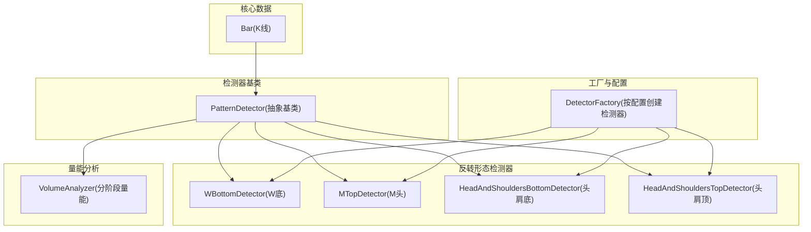
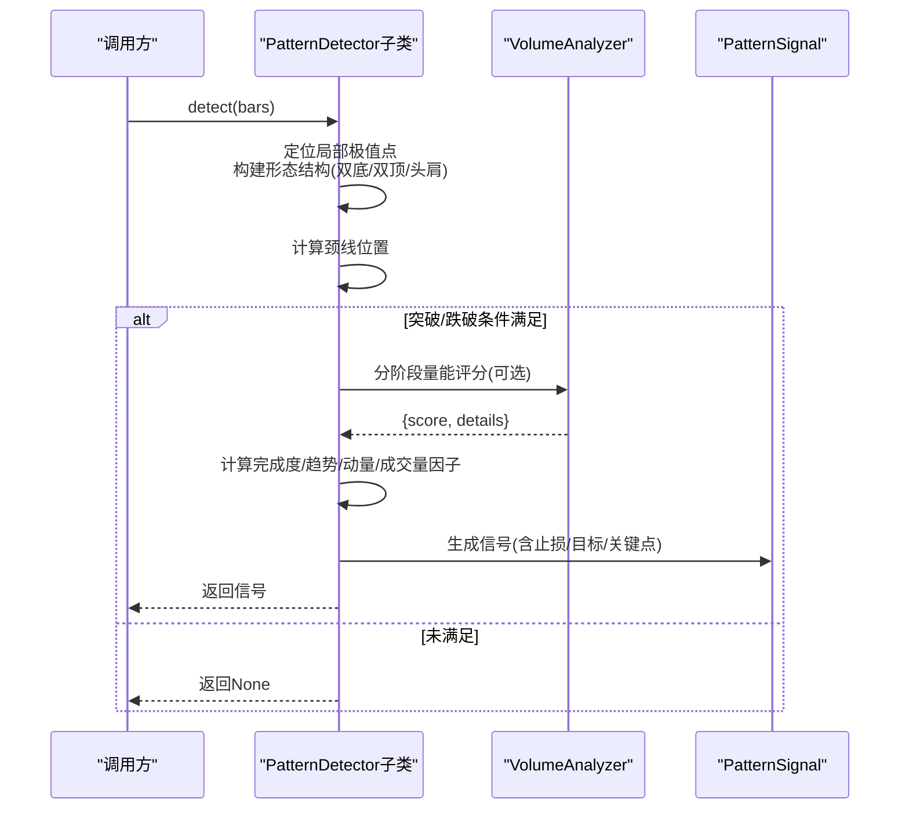
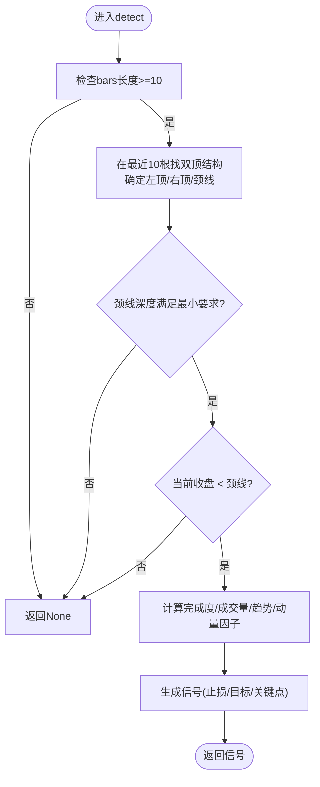
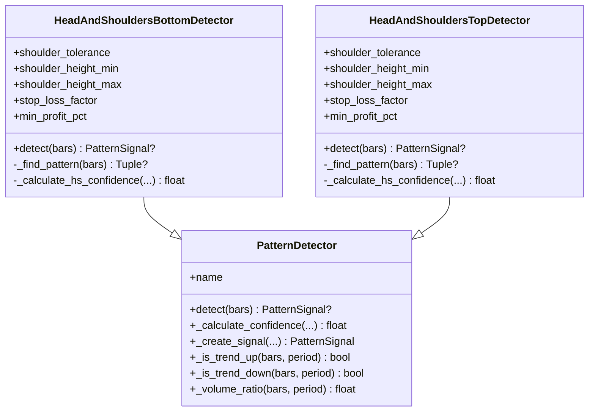
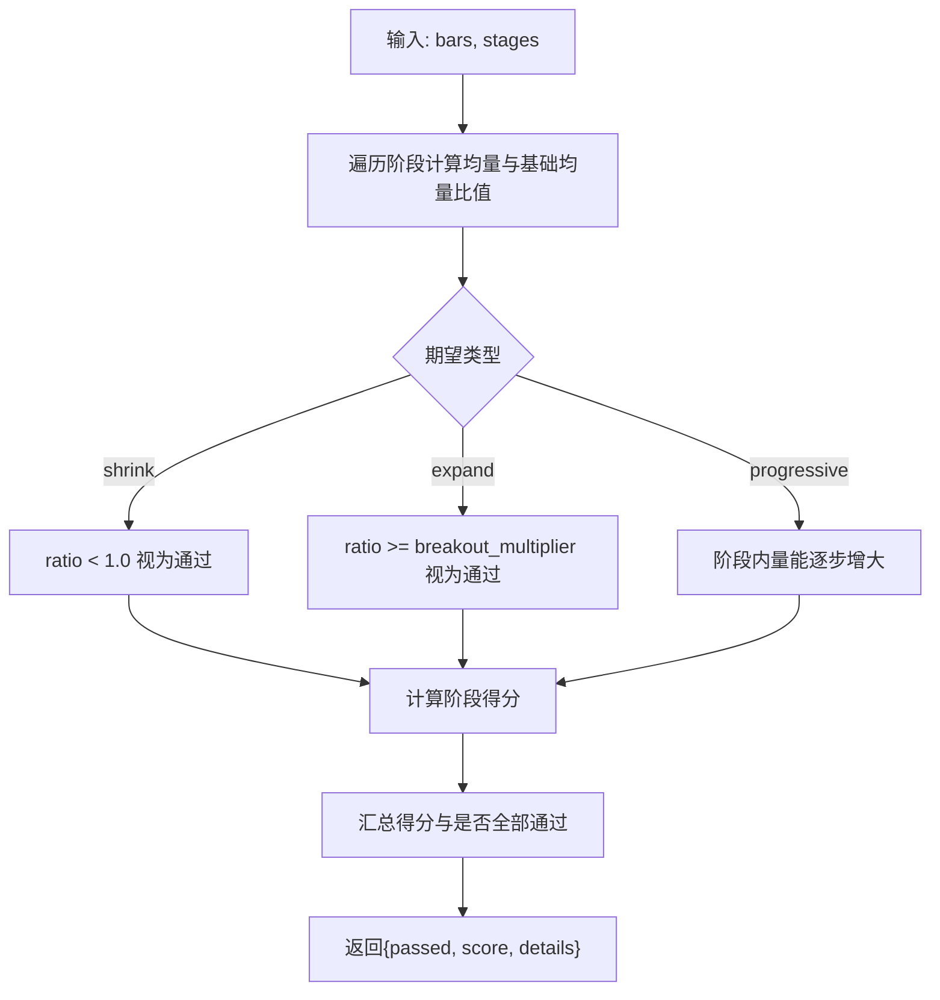
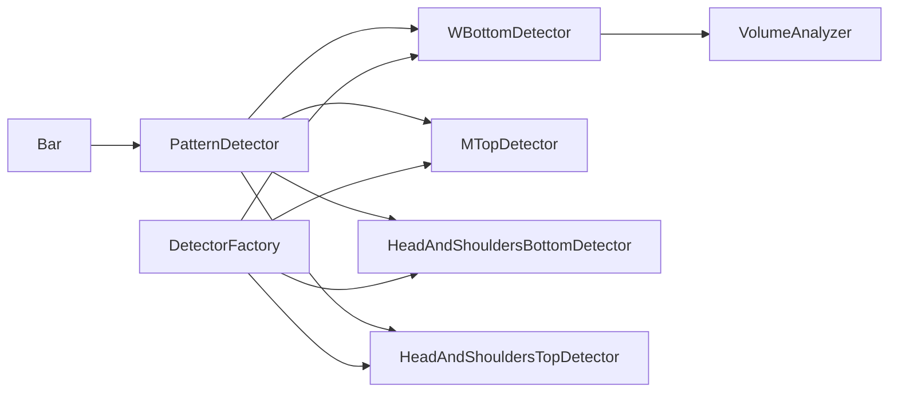

# 反转形态检测器

<cite>
**本文引用的文件**   
- [detector.py](file://src/caisen/strategy/algorithm/detector.py)
- [w_bottom.py](file://src/caisen/strategy/algorithm/patterns/w_bottom.py)
- [m_top.py](file://src/caisen/strategy/algorithm/patterns/m_top.py)
- [head_shoulders.py](file://src/caisen/strategy/algorithm/patterns/head_shoulders.py)
- [volume_analyzer.py](file://src/caisen/strategy/algorithm/caisen_components/volume_analyzer.py)
- [bar.py](file://src/caisen/core/bar.py)
- [factory.py](file://src/caisen/strategy/algorithm/caisen_components/factory.py)
- [test_cai_sen.py](file://tests/test_cai_sen.py)
</cite>

## 目录
1. [简介](#简介)
2. [项目结构](#项目结构)
3. [核心组件](#核心组件)
4. [架构总览](#架构总览)
5. [详细组件分析](#详细组件分析)
6. [依赖关系分析](#依赖关系分析)
7. [性能与复杂度](#性能与复杂度)
8. [可视化与误报过滤](#可视化与误报过滤)
9. [参数敏感性与调参建议](#参数敏感性与调参建议)
10. [不同市场环境适用性](#不同市场环境适用性)
11. [历史回测表现对比](#历史回测表现对比)
12. [故障排查指南](#故障排查指南)
13. [结论](#结论)

## 简介
本技术文档围绕“反转形态检测器”展开，聚焦于W底/M头（双底/双顶）与头肩顶/底等经典反转形态的识别算法。文档从系统架构、数据流、处理逻辑到置信度建模、成交量配合、时间窗口约束、误报过滤与参数敏感性进行系统化阐述，并提供可视化示例思路与回测评估方法，帮助读者在实战中正确应用并优化策略。

## 项目结构
与反转形态检测相关的核心代码位于策略算法模块下，采用纯函数接口设计：每个检测器接收完整K线序列，返回信号或空，无内部状态，便于并行测试与回测。

图表来源
- [detector.py:1-244](file://src/caisen/strategy/algorithm/detector.py#L1-L244)
- [w_bottom.py:1-285](file://src/caisen/strategy/algorithm/patterns/w_bottom.py#L1-L285)
- [m_top.py:1-227](file://src/caisen/strategy/algorithm/patterns/m_top.py#L1-L227)
- [head_shoulders.py:1-323](file://src/caisen/strategy/algorithm/patterns/head_shoulders.py#L1-L323)
- [volume_analyzer.py:1-287](file://src/caisen/strategy/algorithm/caisen_components/volume_analyzer.py#L1-L287)
- [factory.py:1-237](file://src/caisen/strategy/algorithm/caisen_components/factory.py#L1-L237)

章节来源
- [detector.py:1-244](file://src/caisen/strategy/algorithm/detector.py#L1-L244)
- [bar.py:1-38](file://src/caisen/core/bar.py#L1-L38)
- [factory.py:1-237](file://src/caisen/strategy/algorithm/caisen_components/factory.py#L1-L237)

## 核心组件
- 数据模型 Bar：包含时间戳、标的、频率、开高低收与成交量，提供序列化/反序列化能力。
- 检测器基类 PatternDetector：定义纯函数接口 detect(bars)，内置趋势判断、量比计算、置信度加权合成与信号构造工具。
- 反转形态检测器：
  - WBottomDetector：双底突破确认
  - MTopDetector：双顶跌破确认
  - HeadAndShouldersBottomDetector / HeadAndShouldersTopDetector：头肩底/顶颈线突破/跌破确认
- 量能分析 VolumeAnalyzer：支持分阶段量能检查、等级划分、量价背离与递增检查。
- 工厂 DetectorFactory：根据配置动态创建各形态检测器实例。

章节来源
- [bar.py:1-38](file://src/caisen/core/bar.py#L1-L38)
- [detector.py:1-244](file://src/caisen/strategy/algorithm/detector.py#L1-L244)
- [w_bottom.py:1-285](file://src/caisen/strategy/algorithm/patterns/w_bottom.py#L1-L285)
- [m_top.py:1-227](file://src/caisen/strategy/algorithm/patterns/m_top.py#L1-L227)
- [head_shoulders.py:1-323](file://src/caisen/strategy/algorithm/patterns/head_shoulders.py#L1-L323)
- [volume_analyzer.py:1-287](file://src/caisen/strategy/algorithm/caisen_components/volume_analyzer.py#L1-L287)
- [factory.py:1-237](file://src/caisen/strategy/algorithm/caisen_components/factory.py#L1-L237)

## 架构总览
检测流程为：输入最近N根K线 → 局部极值点定位 → 形态结构匹配（双底/双顶/头肩）→ 颈线突破/跌破确认 → 多因子置信度计算 → 输出带止损/目标/关键点的信号。

图表来源
- [detector.py:112-180](file://src/caisen/strategy/algorithm/detector.py#L112-L180)
- [w_bottom.py:49-80](file://src/caisen/strategy/algorithm/patterns/w_bottom.py#L49-L80)
- [m_top.py:49-78](file://src/caisen/strategy/algorithm/patterns/m_top.py#L49-L78)
- [head_shoulders.py:43-91](file://src/caisen/strategy/algorithm/patterns/head_shoulders.py#L43-L91)
- [volume_analyzer.py:55-125](file://src/caisen/strategy/algorithm/caisen_components/volume_analyzer.py#L55-L125)

## 详细组件分析

### W底（双底）检测器
- 价格结构特征
  - 两个低点相近（容差±5%），中间存在明显高点作为颈线
  - 当前收盘价突破颈线时确认
- 时间窗口约束
  - 使用最近10根K线窗口寻找双底结构
- 成交量配合要求
  - 优先使用三阶段量能评分：形成期缩量、突破期放量、确认期持续或回踩缩量；若无索引信息则退化为简单量比
- 置信度建模
  - 完成度：两低点价差相对容差的归一化
  - 成交量：分阶段评分或量比映射至[0,1]
  - 趋势：近20根K线方向共振
  - 动量：突破幅度相对2%阈值归一化
- 风控参数
  - 止损 = 最低点 × 系数（默认0.93）
  - 目标 = 颈线 + 振幅 或 当前价×(1+最小盈利百分比)

图表来源
- [w_bottom.py:49-80](file://src/caisen/strategy/algorithm/patterns/w_bottom.py#L49-L80)
- [w_bottom.py:82-133](file://src/caisen/strategy/algorithm/patterns/w_bottom.py#L82-L133)
- [w_bottom.py:135-189](file://src/caisen/strategy/algorithm/patterns/w_bottom.py#L135-L189)
- [w_bottom.py:191-285](file://src/caisen/strategy/algorithm/patterns/w_bottom.py#L191-L285)

章节来源
- [w_bottom.py:1-285](file://src/caisen/strategy/algorithm/patterns/w_bottom.py#L1-L285)
- [volume_analyzer.py:55-125](file://src/caisen/strategy/algorithm/caisen_components/volume_analyzer.py#L55-L125)

### M头（双顶）检测器
- 价格结构特征
  - 两个高点相近（容差±5%），中间有明显低点作为颈线
  - 当前收盘价跌破颈线时确认
- 时间窗口约束
  - 使用最近10根K线窗口寻找双顶结构
- 成交量配合要求
  - 跌破时放量提升置信度（量比映射）
- 置信度建模
  - 完成度：两高点价差相对容差
  - 成交量：量比映射
  - 趋势：下降趋势共振增强
  - 动量：跌破力度相对2%阈值
- 风控参数
  - 止损 = 最高点 × 系数（默认1.02）
  - 目标 = 颈线 - 振幅

图表来源
- [m_top.py:49-78](file://src/caisen/strategy/algorithm/patterns/m_top.py#L49-L78)
- [m_top.py:80-126](file://src/caisen/strategy/algorithm/patterns/m_top.py#L80-L126)
- [m_top.py:128-177](file://src/caisen/strategy/algorithm/patterns/m_top.py#L128-L177)
- [m_top.py:179-226](file://src/caisen/strategy/algorithm/patterns/m_top.py#L179-L226)

章节来源
- [m_top.py:1-227](file://src/caisen/strategy/algorithm/patterns/m_top.py#L1-L227)

### 头肩顶/底检测器
- 价格结构特征
  - 头部为三个极值中最极端者（头肩底为最低点，头肩顶为最高点）
  - 左右肩高度相近（容差±5%），且处于合理高度区间
  - 颈线由两肩之间的高点（头肩底）或低点（头肩顶）构成
  - 头肩底：突破颈线确认做多；头肩顶：跌破颈线确认做空
- 时间窗口约束
  - 使用最近12根K线窗口，头部限定在中间区域
- 成交量配合要求
  - 突破/跌破时放量提升置信度（量比映射）
- 置信度建模
  - 完成度：两肩对称性
  - 成交量：量比映射
  - 趋势：头肩底偏好上升趋势共振，头肩顶偏好下降趋势共振
  - 动量：突破/跌破幅度相对2%阈值
- 风控参数
  - 头肩底：止损=头部低点×系数（默认0.93），目标=颈线+振幅或当前价×(1+最小盈利%)
  - 头肩顶：止损=头部高点×系数（默认1.02），目标=颈线-振幅

图表来源
- [head_shoulders.py:11-171](file://src/caisen/strategy/algorithm/patterns/head_shoulders.py#L11-L171)
- [head_shoulders.py:173-323](file://src/caisen/strategy/algorithm/patterns/head_shoulders.py#L173-L323)
- [detector.py:80-180](file://src/caisen/strategy/algorithm/detector.py#L80-L180)

章节来源
- [head_shoulders.py:1-323](file://src/caisen/strategy/algorithm/patterns/head_shoulders.py#L1-L323)
- [detector.py:194-243](file://src/caisen/strategy/algorithm/detector.py#L194-L243)

### 量能分析器（VolumeAnalyzer）
- 功能要点
  - 基础均量计算：以指定周期内平均成交量为基准
  - 分阶段量能检查：支持“缩量/放量/递增”三类预期，返回通过与否与综合得分
  - 突破等级划分：弱/正常/强
  - 量价背离检测：价格创新高/新低但量能未跟上
  - 关键点量能递增：允许小幅波动（后一个≥前一个的90%）
- 与形态检测器的集成
  - W底优先使用三阶段量能评分，若缺少索引信息则回退到简单量比
  - 其他形态通常使用量比映射至置信度

图表来源
- [volume_analyzer.py:55-125](file://src/caisen/strategy/algorithm/caisen_components/volume_analyzer.py#L55-L125)
- [volume_analyzer.py:225-287](file://src/caisen/strategy/algorithm/caisen_components/volume_analyzer.py#L225-L287)

章节来源
- [volume_analyzer.py:1-287](file://src/caisen/strategy/algorithm/caisen_components/volume_analyzer.py#L1-L287)

## 依赖关系分析
- 检测器依赖
  - 所有反转形态检测器继承自 PatternDetector，复用趋势判断、量比计算与置信度合成
  - W底检测器额外依赖 VolumeAnalyzer 进行分阶段量能评分
- 工厂与配置
  - DetectorFactory 根据启用列表与配置合并默认参数，实例化具体检测器
- 数据模型
  - Bar 作为统一输入数据结构，提供时间戳与OHLCV字段

图表来源
- [detector.py:80-180](file://src/caisen/strategy/algorithm/detector.py#L80-L180)
- [w_bottom.py:1-285](file://src/caisen/strategy/algorithm/patterns/w_bottom.py#L1-L285)
- [m_top.py:1-227](file://src/caisen/strategy/algorithm/patterns/m_top.py#L1-L227)
- [head_shoulders.py:1-323](file://src/caisen/strategy/algorithm/patterns/head_shoulders.py#L1-L323)
- [volume_analyzer.py:1-287](file://src/caisen/strategy/algorithm/caisen_components/volume_analyzer.py#L1-L287)
- [factory.py:1-237](file://src/caisen/strategy/algorithm/caisen_components/factory.py#L1-L237)

章节来源
- [factory.py:1-237](file://src/caisen/strategy/algorithm/caisen_components/factory.py#L1-L237)

## 性能与复杂度
- 时间复杂度
  - 双底/双顶：固定窗口（10根）内扫描，O(N)常数级
  - 头肩顶/底：固定窗口（12根）内扫描，O(N)常数级
  - 量能分析：分阶段遍历，整体线性于阶段数与K线数量
- 空间复杂度
  - 仅维护最近若干根K线的切片与少量中间变量，O(N)常数级
- 性能建议
  - 避免重复计算：对趋势判断与量比可缓存最近结果
  - 批量回测时尽量复用 VolumeAnalyzer 实例以减少对象开销

[本节为通用性能讨论，不直接分析具体文件]

## 可视化与误报过滤
- 可视化示例
  - 在图表上标注关键点：左底/右底/左顶/右顶/头部/左右肩/颈线/突破或跌破点
  - 用颜色区分方向：多头信号（如W底）与空头信号（如M头、头肩顶）
  - 展示止损线与目标线，辅助复盘
- 误报过滤机制
  - 颈线深度/高度阈值：防止过于平坦的结构被误判
  - 完成度阈值：两肩/两顶/两底对称性不足时降低置信度
  - 趋势共振：仅在趋势方向一致时提高权重
  - 动量阈值：突破/跌破幅度需达到一定强度
  - 量能配合：突破/跌破期放量，形成期缩量，减少假突破
  - 最小盈利目标：确保风险回报比合理

章节来源
- [w_bottom.py:191-285](file://src/caisen/strategy/algorithm/patterns/w_bottom.py#L191-L285)
- [m_top.py:179-226](file://src/caisen/strategy/algorithm/patterns/m_top.py#L179-L226)
- [head_shoulders.py:137-170](file://src/caisen/strategy/algorithm/patterns/head_shoulders.py#L137-L170)
- [head_shoulders.py:293-322](file://src/caisen/strategy/algorithm/patterns/head_shoulders.py#L293-L322)

## 参数敏感性与调参建议
- 关键参数
  - 容差（tolerance/shoulder_tolerance）：控制对称性宽松程度
  - 颈线深度/高度（min_neckline_depth/min_neckline_height）：过滤弱结构
  - 止损系数（stop_loss_factor）：影响止损距离与盈亏比
  - 最小盈利百分比（min_profit_pct）：影响目标位设置
  - 趋势周期（period=20）：影响趋势共振判定
  - 量能倍数（breakout_multiplier）：决定放量门槛
- 调参建议
  - 震荡市：适当放宽容差与颈线要求，降低动量阈值，避免频繁假突破
  - 趋势市：收紧容差，强调趋势共振与动量，提高胜率
  - 低流动性品种：提高量能倍数与最小盈利目标，过滤噪音
  - 高频短周期：缩短趋势周期，适度放大止损系数以容纳波动

章节来源
- [factory.py:38-51](file://src/caisen/strategy/algorithm/caisen_components/factory.py#L38-L51)
- [w_bottom.py:28-47](file://src/caisen/strategy/algorithm/patterns/w_bottom.py#L28-L47)
- [m_top.py:28-47](file://src/caisen/strategy/algorithm/patterns/m_top.py#L28-L47)
- [head_shoulders.py:28-41](file://src/caisen/strategy/algorithm/patterns/head_shoulders.py#L28-L41)
- [detector.py:194-243](file://src/caisen/strategy/algorithm/detector.py#L194-L243)
- [volume_analyzer.py:24-32](file://src/caisen/strategy/algorithm/caisen_components/volume_analyzer.py#L24-L32)

## 不同市场环境适用性
- 单边上涨/下跌趋势
  - 头肩顶/底与双顶/双底在趋势末端出现概率较高，结合趋势共振可提高胜率
- 区间震荡
  - 双底/双顶更易出现，但假突破较多，需强化量能配合与动量阈值
- 高波动环境
  - 放宽止损系数，提高最小盈利目标，避免过早止损
- 低波动环境
  - 收紧容差与颈线要求，避免将噪声当作形态

[本节为通用指导，不直接分析具体文件]

## 历史回测表现对比
- 指标体系
  - 年化收益、最大回撤、夏普比率、胜率、盈亏比、总交易次数、平均盈利/亏损、总收益率
- 计算方法
  - 基于回测结果计算各项指标，包括总收益率、年化收益、最大回撤与夏普比率等
- 对比维度
  - 不同形态组合（仅W底 vs W底+头肩底 vs 全形态）
  - 不同参数集（宽松/保守）
  - 不同市场时段（牛市/熊市/震荡）

章节来源
- [calculator.py:60-99](file://src/caisen/result/calculator.py#L60-L99)

## 故障排查指南
- 常见问题
  - 未检测到信号：检查bars长度是否满足最小窗口要求；确认颈线深度/高度阈值是否过严
  - 信号过多：提高完成度与动量阈值，增加量能倍数要求
  - 信号过少：放宽容差与颈线要求，降低动量阈值
  - 止损触发频繁：调整止损系数与最小盈利目标，结合趋势共振过滤
- 调试建议
  - 打印关键点与颈线位置，验证结构是否符合预期
  - 查看量能评分详情，确认阶段是否符合“缩量/放量/递增”预期
  - 使用单元测试样例构造典型形态，验证检测器行为

章节来源
- [test_cai_sen.py:63-122](file://tests/test_cai_sen.py#L63-L122)

## 结论
本反转形态检测器以纯函数接口为核心，结合价格结构、颈线突破/跌破、成交量配合与趋势共振等多维因子，构建了稳健的置信度模型。W底/M头适用于快速捕捉双底/双顶反转，头肩顶/底适合复杂结构的反转确认。通过合理的参数调优与环境适配，可在不同市场中取得稳定的信号质量与风险控制效果。