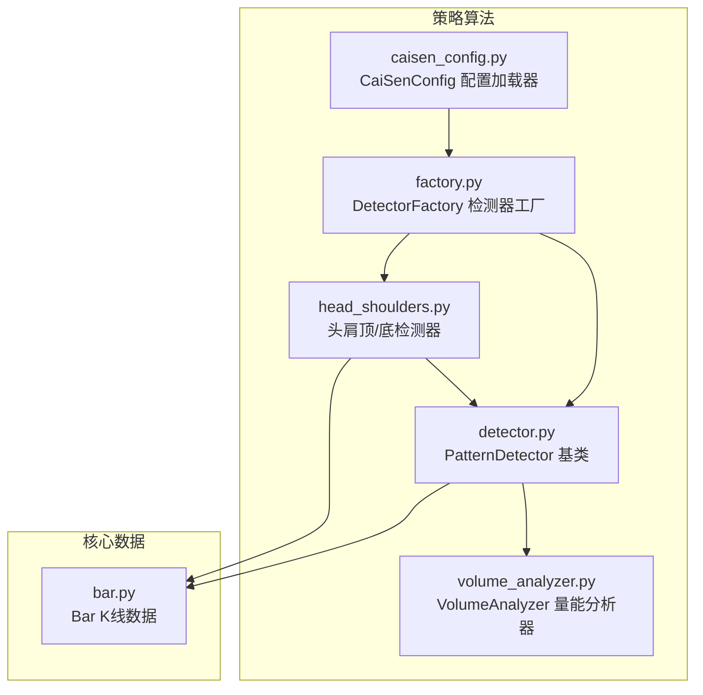
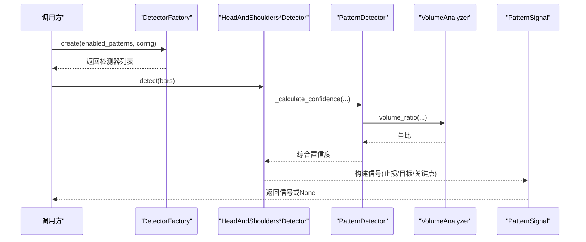
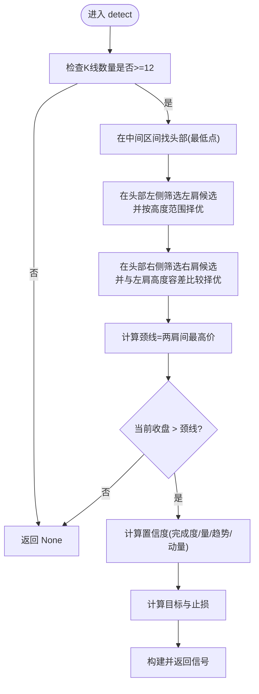
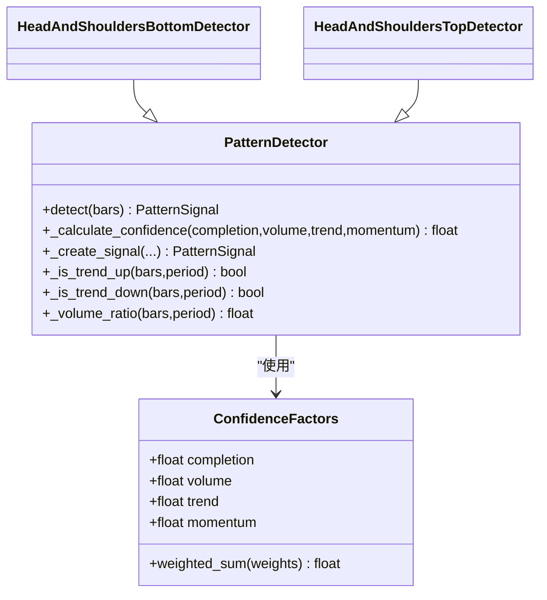
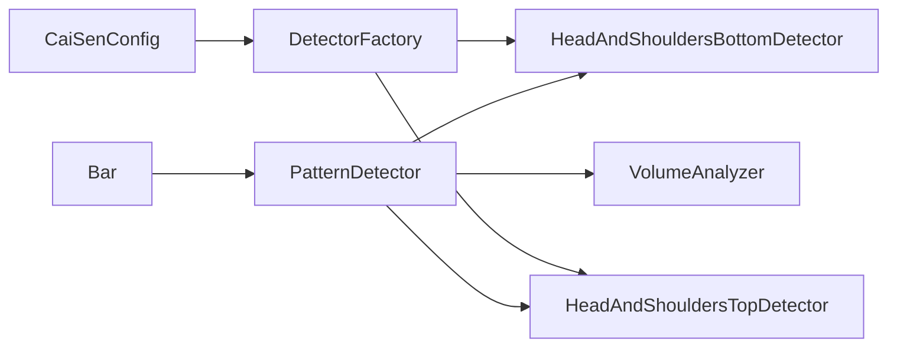

# 头肩顶/底形态检测器

<cite>
**本文引用的文件**   
- [head_shoulders.py](file://src/caisen/strategy/algorithm/patterns/head_shoulders.py)
- [detector.py](file://src/caisen/strategy/algorithm/detector.py)
- [volume_analyzer.py](file://src/caisen/strategy/algorithm/caisen_components/volume_analyzer.py)
- [factory.py](file://src/caisen/strategy/algorithm/caisen_components/factory.py)
- [caisen_config.py](file://src/caisen/strategy/algorithm/caisen_config.py)
- [bar.py](file://src/caisen/core/bar.py)
</cite>

## 目录
1. [简介](#简介)
2. [项目结构](#项目结构)
3. [核心组件](#核心组件)
4. [架构总览](#架构总览)
5. [详细组件分析](#详细组件分析)
6. [依赖关系分析](#依赖关系分析)
7. [性能与复杂度](#性能与复杂度)
8. [参数配置指南](#参数配置指南)
9. [适用环境与回测建议](#适用环境与回测建议)
10. [故障排查与常见问题](#故障排查与常见问题)
11. [结论](#结论)

## 简介
本技术文档围绕“头肩顶/底”形态检测器，系统阐述其算法实现、数学建模、置信度评估体系、参数配置与环境适配策略。该检测器基于纯函数接口设计，具备无状态、可重复调用、便于并行测试与回测的特性；通过严格的局部极值筛选、肩部高度比例验证、时间跨度对称性检查与颈线斜率分析，结合成交量分布模式与突破力度，形成一套稳健的形态识别与信号生成流程。

## 项目结构
与头肩形态检测相关的代码主要位于策略算法模块中，包含：
- 形态检测器基类与信号定义
- 头肩顶/底检测器实现
- 量能分析器（分阶段量能评估）
- 检测器工厂（按名称创建具体检测器实例）
- 策略配置加载器（开关与权重等）
- K线数据结构

图示来源
- [head_shoulders.py:1-323](file://src/caisen/strategy/algorithm/patterns/head_shoulders.py#L1-L323)
- [detector.py:1-244](file://src/caisen/strategy/algorithm/detector.py#L1-L244)
- [volume_analyzer.py:1-287](file://src/caisen/strategy/algorithm/caisen_components/volume_analyzer.py#L1-L287)
- [factory.py:1-237](file://src/caisen/strategy/algorithm/caisen_components/factory.py#L1-L237)
- [caisen_config.py:1-145](file://src/caisen/strategy/algorithm/caisen_config.py#L1-L145)
- [bar.py:1-38](file://src/caisen/core/bar.py#L1-L38)

章节来源
- [head_shoulders.py:1-323](file://src/caisen/strategy/algorithm/patterns/head_shoulders.py#L1-L323)
- [detector.py:1-244](file://src/caisen/strategy/algorithm/detector.py#L1-L244)
- [volume_analyzer.py:1-287](file://src/caisen/strategy/algorithm/caisen_components/volume_analyzer.py#L1-L287)
- [factory.py:1-237](file://src/caisen/strategy/algorithm/caisen_components/factory.py#L1-L237)
- [caisen_config.py:1-145](file://src/caisen/strategy/algorithm/caisen_config.py#L1-L145)
- [bar.py:1-38](file://src/caisen/core/bar.py#L1-L38)

## 核心组件
- PatternDetector 基类：提供纯函数式 detect(bars) 接口、置信度加权计算、趋势判断、量比计算与信号构造工具方法。
- HeadAndShouldersBottomDetector / HeadAndShouldersTopDetector：分别实现头肩底与头肩顶的形态发现、确认条件、目标价与止损价计算、置信度评分。
- VolumeAnalyzer：分阶段量能评估（形成期缩量、突破放量、确认期持续），并提供量价背离检测与递增量能校验。
- DetectorFactory：根据形态名称与配置创建具体检测器实例，支持默认参数合并与覆盖。
- CaiSenConfig：从 YAML 加载策略配置，包括形态开关、权重与风控参数。
- Bar：K线数据载体，含时间戳、OHLCV 字段。

章节来源
- [detector.py:80-244](file://src/caisen/strategy/algorithm/detector.py#L80-L244)
- [head_shoulders.py:11-323](file://src/caisen/strategy/algorithm/patterns/head_shoulders.py#L11-L323)
- [volume_analyzer.py:15-287](file://src/caisen/strategy/algorithm/caisen_components/volume_analyzer.py#L15-L287)
- [factory.py:54-237](file://src/caisen/strategy/algorithm/caisen_components/factory.py#L54-L237)
- [caisen_config.py:11-145](file://src/caisen/strategy/algorithm/caisen_config.py#L11-L145)
- [bar.py:8-38](file://src/caisen/core/bar.py#L8-L38)

## 架构总览
头肩形态检测器的整体工作流如下：
- 输入：最近 N 根 K 线（至少满足最小窗口要求）
- 步骤：
  - 在限定区间内寻找头部（中间区域最高/最低点）
  - 在头部左侧与右侧分别筛选左肩与右肩候选，并依据高度容差与相对幅度约束择优
  - 计算颈线（顶部为两肩之间最低价，底部为两肩之间最高价）
  - 以当前收盘价对颈线的突破/跌破作为确认信号
  - 计算置信度（完成度、成交量、趋势共振、动量）
  - 输出标准化信号（含止损、目标、关键点坐标）

图示来源
- [factory.py:81-111](file://src/caisen/strategy/algorithm/caisen_components/factory.py#L81-L111)
- [head_shoulders.py:43-91](file://src/caisen/strategy/algorithm/patterns/head_shoulders.py#L43-L91)
- [head_shoulders.py:199-247](file://src/caisen/strategy/algorithm/patterns/head_shoulders.py#L199-L247)
- [detector.py:125-180](file://src/caisen/strategy/algorithm/detector.py#L125-L180)
- [detector.py:224-243](file://src/caisen/strategy/algorithm/detector.py#L224-L243)

## 详细组件分析

### 头肩底检测器（HeadAndShouldersBottomDetector）
- 形态形成条件
  - 头部为三低点中最低点
  - 左肩与右肩高度相近（容差控制）
  - 价格向上突破颈线后确认
- 关键逻辑
  - 在近期窗口内定位头部（中间区域最低点）
  - 左肩候选需满足相对头部的高度范围约束，取最接近头部的次低高点
  - 右肩候选需满足与左肩高度的相对容差，取最接近头部的次低高点
  - 颈线为左右肩之间的最高价（即支撑位）
  - 当收盘价高于颈线时触发多头信号
- 目标与止损
  - 振幅 = 颈线 - 头部低点
  - 目标 = max(颈线 + 振幅, 当前收盘 × (1 + 最小盈利百分比))
  - 止损 = 头部低点 × 止损系数
- 置信度评估
  - 完成度：两肩高度差异越小，完成度越高
  - 成交量：近期均量相对历史均量的放大倍数映射到 0~1
  - 趋势：近周期收盘价对比判定是否处于上升趋势
  - 动量：突破幅度映射到 0~1
  - 最终采用加权求和得到综合置信度

图示来源
- [head_shoulders.py:43-91](file://src/caisen/strategy/algorithm/patterns/head_shoulders.py#L43-L91)
- [head_shoulders.py:93-136](file://src/caisen/strategy/algorithm/patterns/head_shoulders.py#L93-L136)
- [head_shoulders.py:137-171](file://src/caisen/strategy/algorithm/patterns/head_shoulders.py#L137-L171)

章节来源
- [head_shoulders.py:11-91](file://src/caisen/strategy/algorithm/patterns/head_shoulders.py#L11-L91)
- [head_shoulders.py:93-171](file://src/caisen/strategy/algorithm/patterns/head_shoulders.py#L93-L171)

### 头肩顶检测器（HeadAndShouldersTopDetector）
- 形态形成条件
  - 头部为三高点中最高的
  - 左肩与右肩高度相近（容差控制）
  - 价格向下跌破颈线后确认
- 关键逻辑
  - 在近期窗口内定位头部（中间区域最高点）
  - 左肩候选需满足相对头部的高度范围约束，取最接近头部的次高低点
  - 右肩候选需满足与左肩高度的相对容差，取最接近头部的次高低点
  - 颈线为左右肩之间的最低价（即阻力位）
  - 当收盘价低于颈线时触发空头信号
- 目标与止损
  - 振幅 = 头部高点 - 颈线
  - 目标 = 颈线 - 振幅
  - 止损 = 头部高点 × 止损系数
- 置信度评估
  - 完成度：两肩高度差异越小，完成度越高
  - 成交量：近期均量相对历史均量的放大倍数映射到 0~1
  - 趋势：近周期收盘价对比判定是否处于下降趋势
  - 动量：跌破幅度映射到 0~1
  - 最终采用加权求和得到综合置信度

图示来源
- [head_shoulders.py:199-247](file://src/caisen/strategy/algorithm/patterns/head_shoulders.py#L199-L247)
- [head_shoulders.py:249-291](file://src/caisen/strategy/algorithm/patterns/head_shoulders.py#L249-L291)
- [head_shoulders.py:293-322](file://src/caisen/strategy/algorithm/patterns/head_shoulders.py#L293-L322)

章节来源
- [head_shoulders.py:173-247](file://src/caisen/strategy/algorithm/patterns/head_shoulders.py#L173-L247)
- [head_shoulders.py:249-322](file://src/caisen/strategy/algorithm/patterns/head_shoulders.py#L249-L322)

### 置信度评估体系（ConfidenceFactors）
- 因子维度
  - 完成度 completion：形态结构的对称性与完整性
  - 成交量 volume：突破/跌破时的量能放大程度
  - 趋势 trend：与形态方向一致的趋势共振
  - 动量 momentum：突破/跌破的力度
- 加权求和
  - 默认权重：completion 0.4、volume 0.3、trend 0.2、momentum 0.1
  - 结果裁剪至 [0, 1]

图示来源
- [detector.py:45-78](file://src/caisen/strategy/algorithm/detector.py#L45-L78)
- [detector.py:125-180](file://src/caisen/strategy/algorithm/detector.py#L125-L180)
- [head_shoulders.py:137-171](file://src/caisen/strategy/algorithm/patterns/head_shoulders.py#L137-L171)
- [head_shoulders.py:293-322](file://src/caisen/strategy/algorithm/patterns/head_shoulders.py#L293-L322)

章节来源
- [detector.py:45-78](file://src/caisen/strategy/algorithm/detector.py#L45-L78)
- [detector.py:125-180](file://src/caisen/strategy/algorithm/detector.py#L125-L180)

### 量能分析器（VolumeAnalyzer）
- 分阶段量能评估
  - 形成期：期望缩量（ratio < 1.0）
  - 突破/跌破期：期望放量（ratio >= breakout_multiplier）
  - 确认期：持续放量或缩量回踩
- 等级划分
  - weak：突破量 < 1.2倍均量
  - normal：1.2倍 <= 突破量 < 2.0倍均量
  - strong：突破量 >= 2.0倍均量
- 量价背离检测
  - 顶背离：价格创新高但成交量未创新高
  - 底背离：价格创新低但成交量未创新低（恐慌减弱）
- 递增量能检查
  - 多个关键点的量能逐步增大（允许小幅波动）

章节来源
- [volume_analyzer.py:15-287](file://src/caisen/strategy/algorithm/caisen_components/volume_analyzer.py#L15-L287)

### 检测器工厂与配置
- 检测器工厂
  - 根据 enabled_patterns 与 detector_config 创建具体检测器实例
  - 对 head_and_shoulders_bottom/top 使用 shoulder_tolerance、stop_loss_factor、min_profit_pct 等参数
- 配置加载器
  - 支持从 YAML 加载形态开关与权重
  - 提供 to_dict 序列化能力

章节来源
- [factory.py:54-237](file://src/caisen/strategy/algorithm/caisen_components/factory.py#L54-L237)
- [caisen_config.py:11-145](file://src/caisen/strategy/algorithm/caisen_config.py#L11-L145)

## 依赖关系分析
- 直接依赖
  - HeadAndShoulders*Detector 依赖 PatternDetector 提供的通用方法与 VolumeAnalyzer
  - PatternDetector 依赖 Bar 数据结构
  - DetectorFactory 依赖各检测器类与默认配置
  - CaiSenConfig 负责外部配置注入
- 耦合与内聚
  - 检测器与基类解耦良好，遵循单一职责原则
  - 量能分析器独立封装，便于复用与扩展
- 潜在循环依赖
  - 未发现循环导入；类型提示使用 TYPE_CHECKING 避免运行时依赖

图示来源
- [bar.py:8-38](file://src/caisen/core/bar.py#L8-L38)
- [detector.py:80-244](file://src/caisen/strategy/algorithm/detector.py#L80-L244)
- [head_shoulders.py:11-323](file://src/caisen/strategy/algorithm/patterns/head_shoulders.py#L11-L323)
- [volume_analyzer.py:15-287](file://src/caisen/strategy/algorithm/caisen_components/volume_analyzer.py#L15-L287)
- [factory.py:54-237](file://src/caisen/strategy/algorithm/caisen_components/factory.py#L54-L237)
- [caisen_config.py:11-145](file://src/caisen/strategy/algorithm/caisen_config.py#L11-L145)

章节来源
- [bar.py:8-38](file://src/caisen/core/bar.py#L8-L38)
- [detector.py:80-244](file://src/caisen/strategy/algorithm/detector.py#L80-L244)
- [head_shoulders.py:11-323](file://src/caisen/strategy/algorithm/patterns/head_shoulders.py#L11-L323)
- [volume_analyzer.py:15-287](file://src/caisen/strategy/algorithm/caisen_components/volume_analyzer.py#L15-L287)
- [factory.py:54-237](file://src/caisen/strategy/algorithm/caisen_components/factory.py#L54-L237)
- [caisen_config.py:11-145](file://src/caisen/strategy/algorithm/caisen_config.py#L11-L145)

## 性能与复杂度
- 时间复杂度
  - 头部查找：O(k)，k 为中间窗口长度（固定较小）
  - 左/右肩筛选：O(m)、O(n)，m/n 为左右候选集合大小
  - 颈线计算：O(p)，p 为两肩之间K线数
  - 总体近似 O(N)，N 为传入 bars 长度（实际仅处理尾部窗口）
- 空间复杂度
  - 常量级额外空间（切片与临时列表开销较小）
- 优化建议
  - 若需实时增量更新，可维护滑动窗口统计（如最近均量、高低点索引）以减少重复计算
  - 对颈线斜率进行线性回归估计，可在 O(p) 内完成并用于辅助过滤

[本节为通用性能讨论，不直接分析具体文件]

## 参数配置指南
- 头肩形态核心参数
  - shoulder_tolerance：两肩高度容差（默认 0.05）
  - shoulder_height_min/max：肩部相对头部的高度范围（默认 0.02/0.10）
  - stop_loss_factor：止损系数（底部 0.93，顶部 1.02）
  - min_profit_pct：最小盈利目标（默认 0.03）
- 量能相关参数
  - base_period：基础均量计算周期（默认 20）
  - breakout_multiplier：突破放量倍数阈值（默认 1.5）
- 配置来源
  - 工厂默认配置：DEFAULT_DETECTOR_CONFIG 中的 head_and_shoulders 项
  - 策略配置：CaiSenConfig 的形态开关与权重
  - YAML 覆盖：patterns 与 params 节点

章节来源
- [head_shoulders.py:28-41](file://src/caisen/strategy/algorithm/patterns/head_shoulders.py#L28-L41)
- [head_shoulders.py:184-197](file://src/caisen/strategy/algorithm/patterns/head_shoulders.py#L184-L197)
- [factory.py:38-51](file://src/caisen/strategy/algorithm/caisen_components/factory.py#L38-L51)
- [factory.py:167-173](file://src/caisen/strategy/algorithm/caisen_components/factory.py#L167-L173)
- [caisen_config.py:43-68](file://src/caisen/strategy/algorithm/caisen_config.py#L43-L68)

## 适用环境与回测建议
- 适用环境
  - 震荡转趋势初期：头肩形态常出现在趋势反转前夜，配合量能放大可提高胜率
  - 中长周期（日线及以上）：形态稳定性更高，假突破较少
- 回测建议
  - 设置合理的最小盈利目标与止损系数，避免过度交易
  - 结合趋势过滤器（如短期均线方向）提升信号质量
  - 对颈线斜率进行二次过滤（平缓优于陡峭）可降低假信号
- 常见陷阱规避
  - 窄幅震荡中的“伪头肩”：提高 shoulder_tolerance 与 min_profit_pct
  - 突破无量：降低成交量权重或提高 breakout_multiplier
  - 极端行情下的快速破位：缩短观察窗口或放宽时间跨度对称性

[本节为通用指导，不直接分析具体文件]

## 故障排查与常见问题
- 问题：未检测到任何信号
  - 检查 bars 长度是否满足最小窗口（>=12）
  - 调整 shoulder_tolerance 与 shoulder_height_min/max 以适应不同品种波动
- 问题：频繁假突破
  - 提高 breakout_multiplier 与 min_profit_pct
  - 引入趋势过滤器（上升/下降趋势确认）
- 问题：置信度偏低
  - 检查成交量是否放大（volume_ratio）
  - 检查形态完成度（两肩对称性）与动量（突破幅度）

章节来源
- [head_shoulders.py:43-54](file://src/caisen/strategy/algorithm/patterns/head_shoulders.py#L43-L54)
- [head_shoulders.py:199-210](file://src/caisen/strategy/algorithm/patterns/head_shoulders.py#L199-L210)
- [detector.py:224-243](file://src/caisen/strategy/algorithm/detector.py#L224-L243)

## 结论
头肩顶/底检测器通过严格的局部极值筛选、肩部高度比例验证、颈线计算与突破确认，并结合多维度置信度评估，形成了一套稳健且可配置的形态识别方案。配合量能分析与趋势过滤，可有效提升信号质量与实战胜率。建议在多周期、多品种环境下进行回测与参数优化，并根据市场特征动态调整容差与量能阈值。