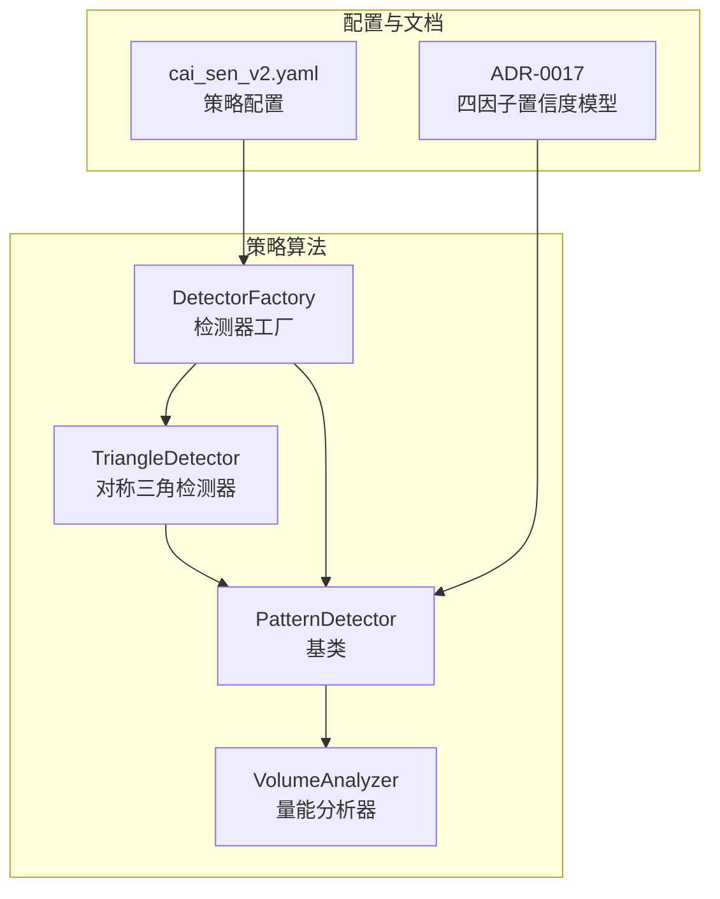
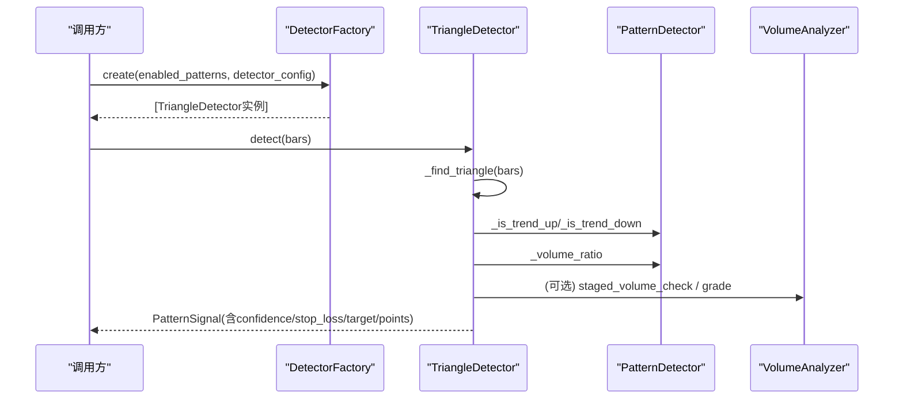
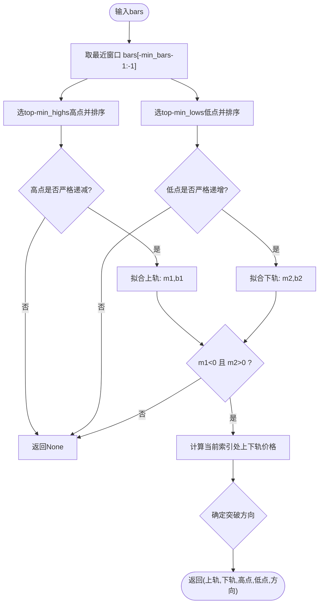
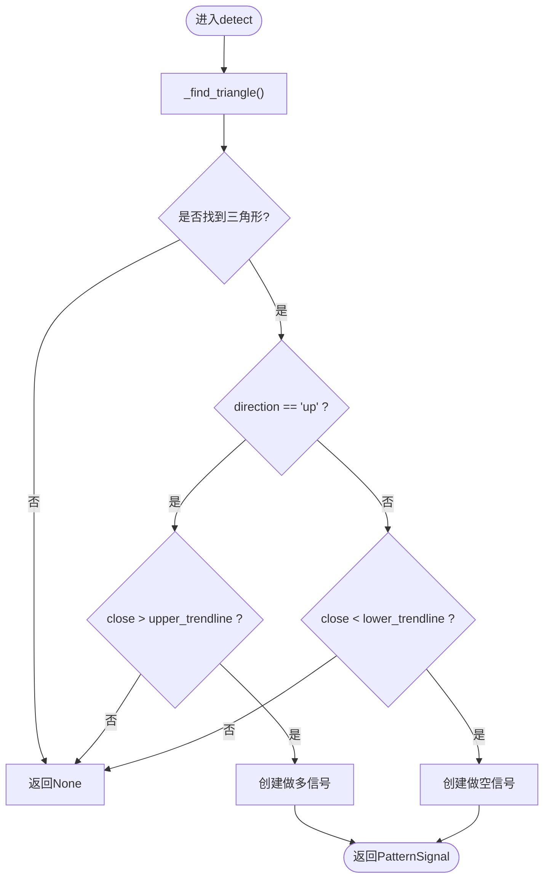
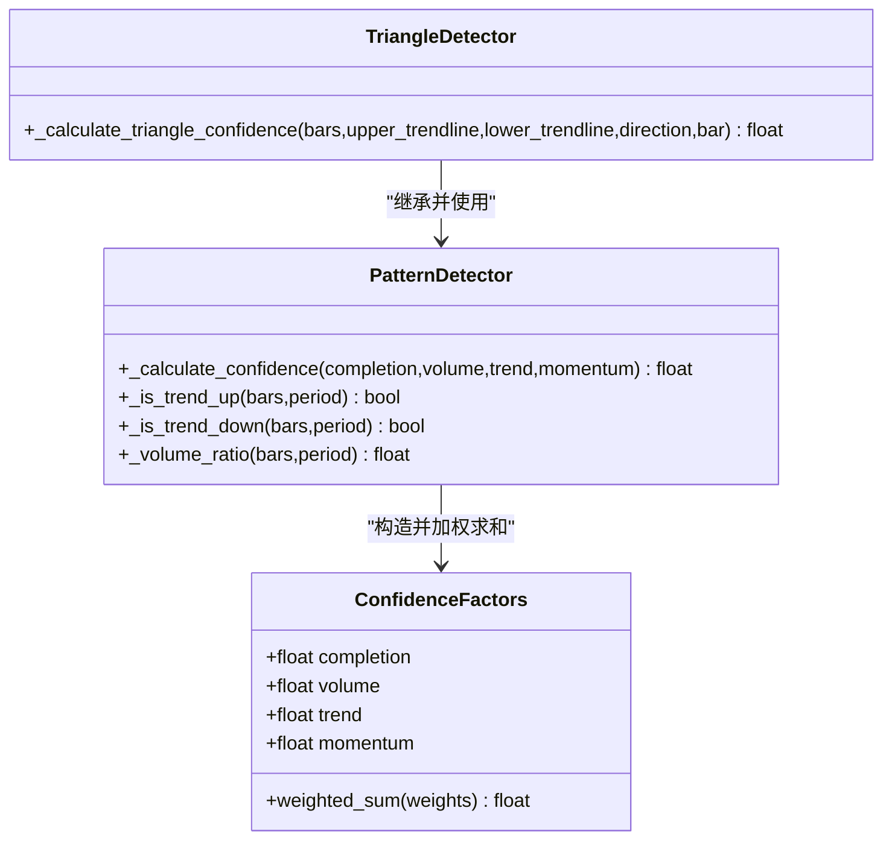
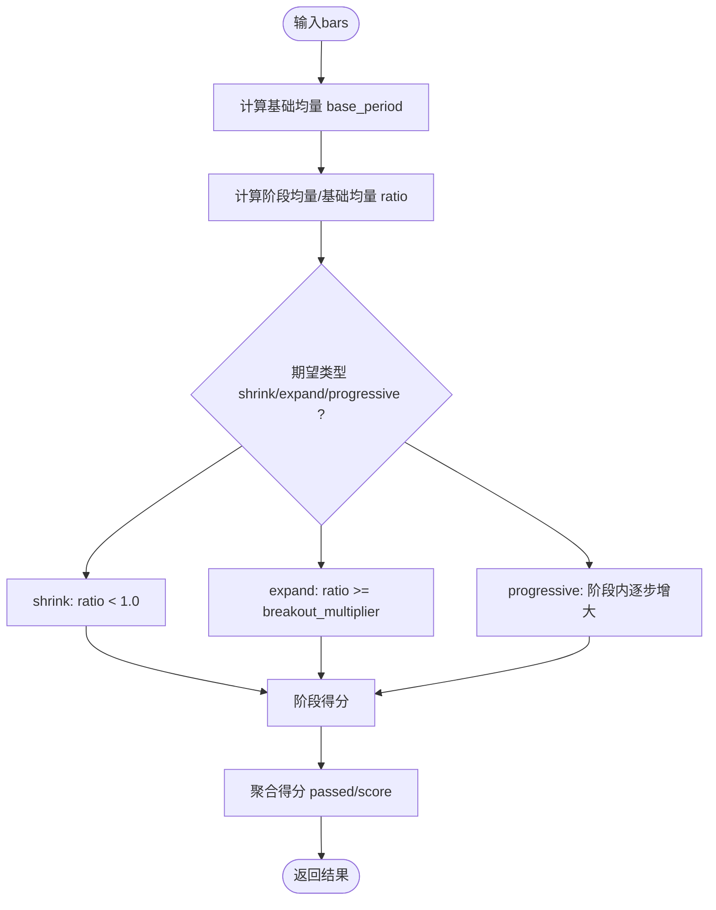
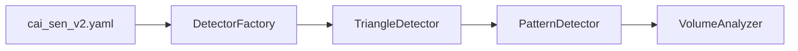

# 三角形态检测器

<cite>
**本文引用的文件列表**
- [triangle.py](file://src/caisen/strategy/algorithm/patterns/triangle.py)
- [detector.py](file://src/caisen/strategy/algorithm/detector.py)
- [volume_analyzer.py](file://src/caisen/strategy/algorithm/caisen_components/volume_analyzer.py)
- [factory.py](file://src/caisen/strategy/algorithm/caisen_components/factory.py)
- [0017-confidence-factors-model.md](file://docs/adr/0017-confidence-factors-model.md)
- [cai_sen_v2.yaml](file://configs/strategies/cai_sen_v2.yaml)
</cite>

## 目录
1. [简介](#简介)
2. [项目结构](#项目结构)
3. [核心组件](#核心组件)
4. [架构总览](#架构总览)
5. [详细组件分析](#详细组件分析)
6. [依赖关系分析](#依赖关系分析)
7. [性能与复杂度](#性能与复杂度)
8. [参数调优指南](#参数调优指南)
9. [实战应用示例](#实战应用示例)
10. [故障排查](#故障排查)
11. [结论](#结论)

## 简介
本技术文档围绕“对称三角形”形态检测器，系统阐述其几何识别算法、趋势线与收敛验证、突破方向判断逻辑、置信度计算模型（完成度、成交量比率、趋势方向、突破动量四因子加权），并提供参数调优策略与实战案例。该实现遵循纯函数接口设计，便于回测与并行测试。

## 项目结构
三角形态检测器位于策略算法模块的“形态检测器”子系统中，采用基类抽象 + 具体检测器实现的层次化组织：
- 基类 PatternDetector：提供通用工具方法（趋势判断、成交量比率、置信度加权等）
- 具体检测器 TriangleDetector：实现对称三角形的几何识别与信号生成
- 量能分析器 VolumeAnalyzer：提供分阶段量能评估与等级划分
- 工厂 DetectorFactory：按配置创建并注入检测器实例
- 配置 cai_sen_v2.yaml：定义权重、阈值、检测器专用参数
- ADR 文档 0017：记录四因子置信度模型的设计决策

图表来源
- [triangle.py:1-239](file://src/caisen/strategy/algorithm/patterns/triangle.py#L1-L239)
- [detector.py:1-244](file://src/caisen/strategy/algorithm/detector.py#L1-L244)
- [volume_analyzer.py:1-287](file://src/caisen/strategy/algorithm/caisen_components/volume_analyzer.py#L1-L287)
- [factory.py:1-237](file://src/caisen/strategy/algorithm/caisen_components/factory.py#L1-L237)
- [cai_sen_v2.yaml:1-145](file://configs/strategies/cai_sen_v2.yaml#L1-L145)
- [0017-confidence-factors-model.md:1-48](file://docs/adr/0017-confidence-factors-model.md#L1-L48)

章节来源
- [triangle.py:1-239](file://src/caisen/strategy/algorithm/patterns/triangle.py#L1-L239)
- [detector.py:1-244](file://src/caisen/strategy/algorithm/detector.py#L1-L244)
- [volume_analyzer.py:1-287](file://src/caisen/strategy/algorithm/caisen_components/volume_analyzer.py#L1-L287)
- [factory.py:1-237](file://src/caisen/strategy/algorithm/caisen_components/factory.py#L1-L237)
- [cai_sen_v2.yaml:1-145](file://configs/strategies/cai_sen_v2.yaml#L1-L145)
- [0017-confidence-factors-model.md:1-48](file://docs/adr/0017-confidence-factors-model.md#L1-L48)

## 核心组件
- TriangleDetector：负责对称三角形的识别、趋势线计算、收敛验证、突破判定与信号生成
- PatternDetector：提供通用能力（趋势判断、成交量比率、置信度加权、信号封装）
- VolumeAnalyzer：提供分阶段量能检查、等级划分与背离检测
- DetectorFactory：根据配置动态创建检测器实例，合并默认与用户配置
- 配置文件与ADR：定义权重、阈值与置信度模型设计依据

章节来源
- [triangle.py:1-239](file://src/caisen/strategy/algorithm/patterns/triangle.py#L1-L239)
- [detector.py:1-244](file://src/caisen/strategy/algorithm/detector.py#L1-L244)
- [volume_analyzer.py:1-287](file://src/caisen/strategy/algorithm/caisen_components/volume_analyzer.py#L1-L287)
- [factory.py:1-237](file://src/caisen/strategy/algorithm/caisen_components/factory.py#L1-L237)
- [cai_sen_v2.yaml:1-145](file://configs/strategies/cai_sen_v2.yaml#L1-L145)
- [0017-confidence-factors-model.md:1-48](file://docs/adr/0017-confidence-factors-model.md#L1-L48)

## 架构总览
三角形态检测器的调用流程从工厂创建检测器开始，随后对K线序列进行扫描，检测器内部执行几何识别、趋势线计算、收敛验证与突破确认，最终输出包含置信度与风控参数的信号对象。

图表来源
- [factory.py:1-237](file://src/caisen/strategy/algorithm/caisen_components/factory.py#L1-L237)
- [triangle.py:1-239](file://src/caisen/strategy/algorithm/patterns/triangle.py#L1-L239)
- [detector.py:1-244](file://src/caisen/strategy/algorithm/detector.py#L1-L244)
- [volume_analyzer.py:1-287](file://src/caisen/strategy/algorithm/caisen_components/volume_analyzer.py#L1-L287)

## 详细组件分析

### 几何识别与趋势线建模
对称三角形要求：
- 至少 min_highs 个高点呈严格递减
- 至少 min_lows 个低点呈严格递增
- 两趋势线斜率相反且收敛（上轨斜率为负，下轨斜率为正）

数学建模要点：
- 选取最近窗口 bars[-min_bars-1:-1] 作为候选区间
- 从高/低值中分别选出 top-k 点并按时间排序
- 使用首尾两点拟合直线 y = m·x + b，得到上轨与下轨
- 当前索引处计算趋势线价格，用于突破判定

图表来源
- [triangle.py:74-143](file://src/caisen/strategy/algorithm/patterns/triangle.py#L74-L143)

章节来源
- [triangle.py:74-143](file://src/caisen/strategy/algorithm/patterns/triangle.py#L74-L143)

### 突破方向与确认条件
- 向上突破：当方向为“up”且当前收盘价高于上轨时，触发做多信号
- 向下跌破：当方向为“down”且当前收盘价低于下轨时，触发做空信号
- 止损与目标价：
  - 做多：止损以下轨乘以止损系数；目标价为入场价加振幅（上轨-下轨）
  - 做空：止损以上轨乘以安全系数；目标价为入场价减振幅

图表来源
- [triangle.py:39-72](file://src/caisen/strategy/algorithm/patterns/triangle.py#L39-L72)
- [triangle.py:145-193](file://src/caisen/strategy/algorithm/patterns/triangle.py#L145-L193)

章节来源
- [triangle.py:39-72](file://src/caisen/strategy/algorithm/patterns/triangle.py#L39-L72)
- [triangle.py:145-193](file://src/caisen/strategy/algorithm/patterns/triangle.py#L145-L193)

### 置信度计算模型（四因子加权）
置信度由四个维度加权求和：
- 完成度 completion：基于上下轨振幅相对平均价格的紧凑程度，越紧凑越高
- 成交量 volume：近期均量与历史均量的比值映射到[0,1]
- 趋势 trend：与突破方向一致的趋势强度（上涨或下跌）
- 动量 momentum：突破幅度相对于阈值的归一化

默认权重（可在配置中调整）：
- completion: 0.4
- volume: 0.3
- trend: 0.2
- momentum: 0.1

图表来源
- [detector.py:45-78](file://src/caisen/strategy/algorithm/detector.py#L45-L78)
- [detector.py:125-149](file://src/caisen/strategy/algorithm/detector.py#L125-L149)
- [triangle.py:195-238](file://src/caisen/strategy/algorithm/patterns/triangle.py#L195-L238)

章节来源
- [detector.py:45-78](file://src/caisen/strategy/algorithm/detector.py#L45-L78)
- [detector.py:125-149](file://src/caisen/strategy/algorithm/detector.py#L125-L149)
- [triangle.py:195-238](file://src/caisen/strategy/algorithm/patterns/triangle.py#L195-L238)
- [0017-confidence-factors-model.md:1-48](file://docs/adr/0017-confidence-factors-model.md#L1-L48)

### 成交量比率与分阶段量能评估
- 基础成交量比率：比较最近N根K线的均量与历史均量，得到放量倍数
- 分阶段量能检查：支持形成期缩量、突破期放量、确认期持续放量或缩量回踩等多阶段校验
- 等级划分：weak/normal/strong，依据突破量与基准量的倍数关系

图表来源
- [volume_analyzer.py:55-125](file://src/caisen/strategy/algorithm/caisen_components/volume_analyzer.py#L55-L125)
- [volume_analyzer.py:127-156](file://src/caisen/strategy/algorithm/caisen_components/volume_analyzer.py#L127-L156)
- [detector.py:224-243](file://src/caisen/strategy/algorithm/detector.py#L224-L243)

章节来源
- [volume_analyzer.py:55-125](file://src/caisen/strategy/algorithm/caisen_components/volume_analyzer.py#L55-L125)
- [volume_analyzer.py:127-156](file://src/caisen/strategy/algorithm/caisen_components/volume_analyzer.py#L127-L156)
- [detector.py:224-243](file://src/caisen/strategy/algorithm/detector.py#L224-L243)

## 依赖关系分析
- TriangleDetector 继承自 PatternDetector，复用趋势判断、成交量比率与置信度加权方法
- VolumeAnalyzer 通过构造函数注入到 PatternDetector，供各检测器使用
- DetectorFactory 根据配置创建 TriangleDetector 实例，并合并默认与用户参数
- 配置 cai_sen_v2.yaml 定义了 triangle 的检测器参数、权重与阈值

图表来源
- [triangle.py:1-239](file://src/caisen/strategy/algorithm/patterns/triangle.py#L1-L239)
- [detector.py:1-244](file://src/caisen/strategy/algorithm/detector.py#L1-L244)
- [volume_analyzer.py:1-287](file://src/caisen/strategy/algorithm/caisen_components/volume_analyzer.py#L1-L287)
- [factory.py:1-237](file://src/caisen/strategy/algorithm/caisen_components/factory.py#L1-L237)
- [cai_sen_v2.yaml:1-145](file://configs/strategies/cai_sen_v2.yaml#L1-L145)

章节来源
- [triangle.py:1-239](file://src/caisen/strategy/algorithm/patterns/triangle.py#L1-L239)
- [detector.py:1-244](file://src/caisen/strategy/algorithm/detector.py#L1-L244)
- [volume_analyzer.py:1-287](file://src/caisen/strategy/algorithm/caisen_components/volume_analyzer.py#L1-L287)
- [factory.py:1-237](file://src/caisen/strategy/algorithm/caisen_components/factory.py#L1-L237)
- [cai_sen_v2.yaml:1-145](file://configs/strategies/cai_sen_v2.yaml#L1-L145)

## 性能与复杂度
- 时间复杂度：
  - 选择高/低点：O(n log n)（排序）
  - 趋势线拟合：常数时间
  - 趋势判断与成交量比率：O(k)，k为周期长度
  - 总体近似 O(n log n + k)
- 空间复杂度：
  - 存储高/低点集合与中间结果，近似 O(min_highs + min_lows)
- 优化建议：
  - 若数据规模较大，可考虑滑动窗口维护有序堆以加速Top-K选择
  - 将趋势判断与成交量比率缓存，避免重复计算

章节来源
- [triangle.py:74-143](file://src/caisen/strategy/algorithm/patterns/triangle.py#L74-L143)
- [detector.py:194-243](file://src/caisen/strategy/algorithm/detector.py#L194-L243)

## 参数调优指南
以下为关键参数及其设置策略：
- min_bars：最小K线数量，确保有足够样本识别形态。建议初始值≥11，并根据品种波动性与时间框架调整
- min_highs/min_lows：高低点数量，决定形态稳定性。建议≥3，过高会降低灵敏度，过低会增加误报
- stop_loss_factor：止损系数，控制风险敞口。做多常用0.93（约7%空间），做空可用1.02（约2%空间）
- min_profit_pct：最小盈利目标百分比，过滤低盈亏比信号
- confidence_factors.weights：四因子权重，可按市场状态微调，但需回测验证
- volume_threshold：成交量阈值，配合放量确认，常见1.5倍

参考配置位置：
- 检测器参数：configs/strategies/cai_sen_v2.yaml 中的 detectors.triangle
- 权重与阈值：configs/strategies/cai_sen_v2.yaml 中的 weights 与 confidence_factors

章节来源
- [cai_sen_v2.yaml:88-93](file://configs/strategies/cai_sen_v2.yaml#L88-L93)
- [cai_sen_v2.yaml:134-145](file://configs/strategies/cai_sen_v2.yaml#L134-L145)
- [factory.py:174-181](file://src/caisen/strategy/algorithm/caisen_components/factory.py#L174-L181)

## 实战应用示例
以下为典型使用路径与代码片段路径，便于快速定位实现细节：
- 创建检测器实例（工厂模式）
  - 参考：[factory.py:174-181](file://src/caisen/strategy/algorithm/caisen_components/factory.py#L174-L181)
- 调用检测器进行识别与信号生成
  - 参考：[triangle.py:39-72](file://src/caisen/strategy/algorithm/patterns/triangle.py#L39-L72)
- 查看置信度计算与四因子加权
  - 参考：[triangle.py:195-238](file://src/caisen/strategy/algorithm/patterns/triangle.py#L195-L238)
  - 参考：[detector.py:125-149](file://src/caisen/strategy/algorithm/detector.py#L125-L149)
- 查看成交量比率与分阶段量能评估
  - 参考：[detector.py:224-243](file://src/caisen/strategy/algorithm/detector.py#L224-L243)
  - 参考：[volume_analyzer.py:55-125](file://src/caisen/strategy/algorithm/caisen_components/volume_analyzer.py#L55-L125)

章节来源
- [factory.py:174-181](file://src/caisen/strategy/algorithm/caisen_components/factory.py#L174-L181)
- [triangle.py:39-72](file://src/caisen/strategy/algorithm/patterns/triangle.py#L39-L72)
- [triangle.py:195-238](file://src/caisen/strategy/algorithm/patterns/triangle.py#L195-L238)
- [detector.py:125-149](file://src/caisen/strategy/algorithm/detector.py#L125-L149)
- [detector.py:224-243](file://src/caisen/strategy/algorithm/detector.py#L224-L243)
- [volume_analyzer.py:55-125](file://src/caisen/strategy/algorithm/caisen_components/volume_analyzer.py#L55-L125)

## 故障排查
常见问题与定位建议：
- 未检测到三角形
  - 检查 bars 长度是否满足 min_bars
  - 确认高点是否严格递减、低点是否严格递增
  - 验证趋势线斜率是否收敛（上轨负、下轨正）
- 频繁假突破
  - 提高成交量阈值或启用分阶段量能检查
  - 调整置信度权重，提升 volume/trend 权重
- 止损过紧导致过早出场
  - 调整 stop_loss_factor，适当放宽止损空间
- 目标价不合理
  - 检查振幅计算与方向逻辑，确保目标价与止损位符合交易直觉

章节来源
- [triangle.py:74-143](file://src/caisen/strategy/algorithm/patterns/triangle.py#L74-L143)
- [triangle.py:145-193](file://src/caisen/strategy/algorithm/patterns/triangle.py#L145-L193)
- [detector.py:224-243](file://src/caisen/strategy/algorithm/detector.py#L224-L243)

## 结论
对称三角形检测器通过严格的几何约束与趋势线收敛验证，结合四因子置信度模型，能够在多市场环境下稳健地识别整理形态并给出带风控参数的信号。通过合理的参数调优与量能确认，可有效降低假突破风险，提升交易胜率与盈亏比。