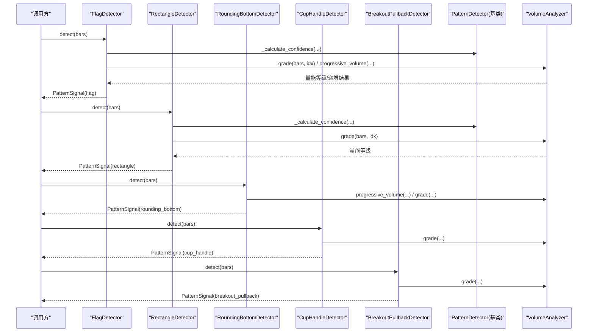
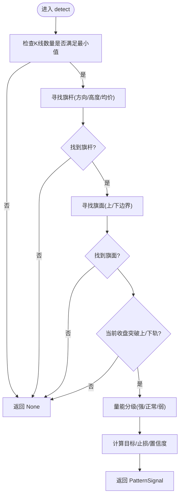
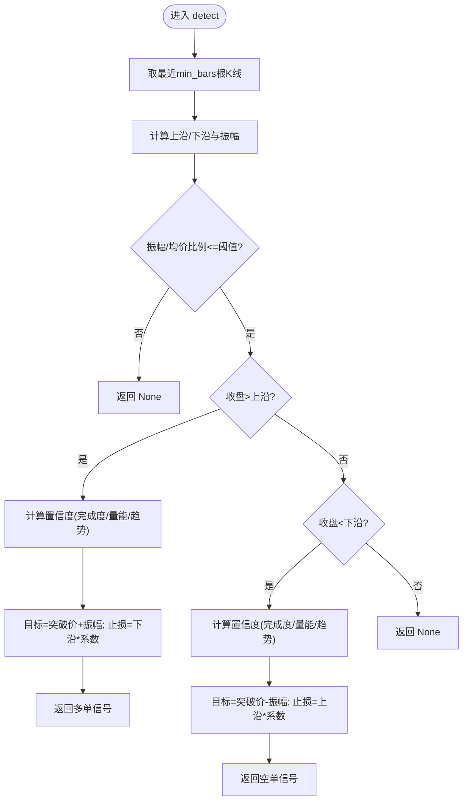
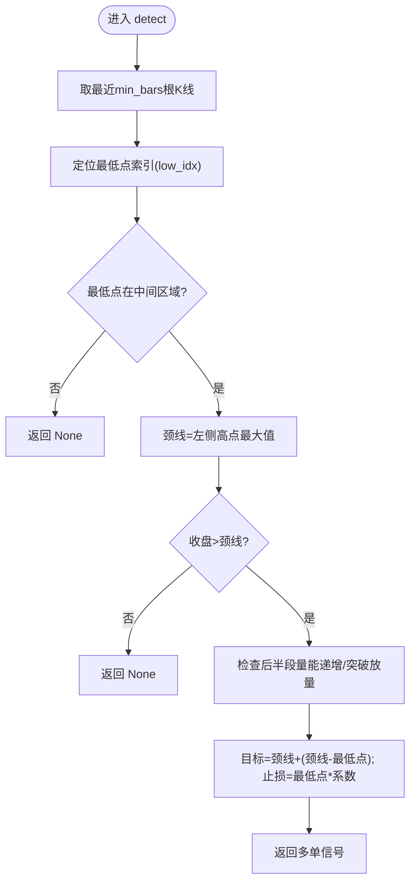
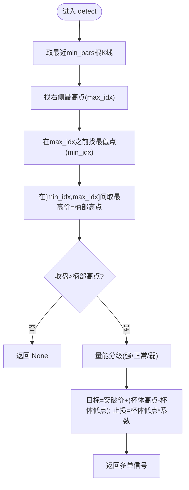
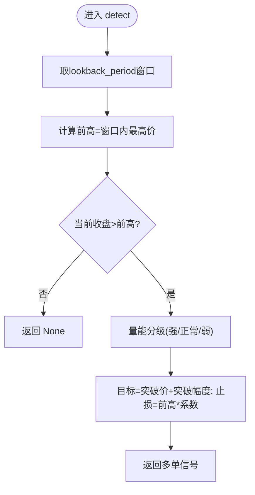
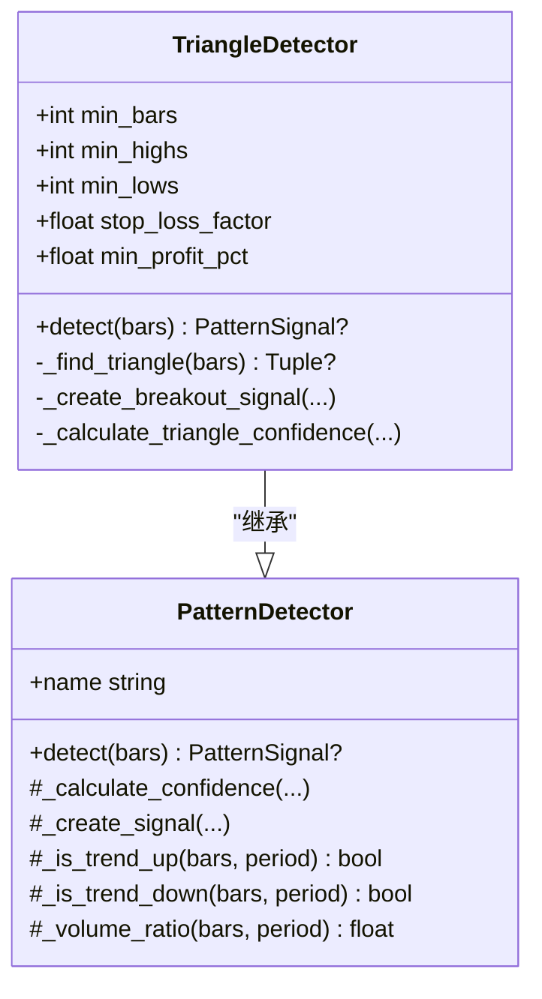
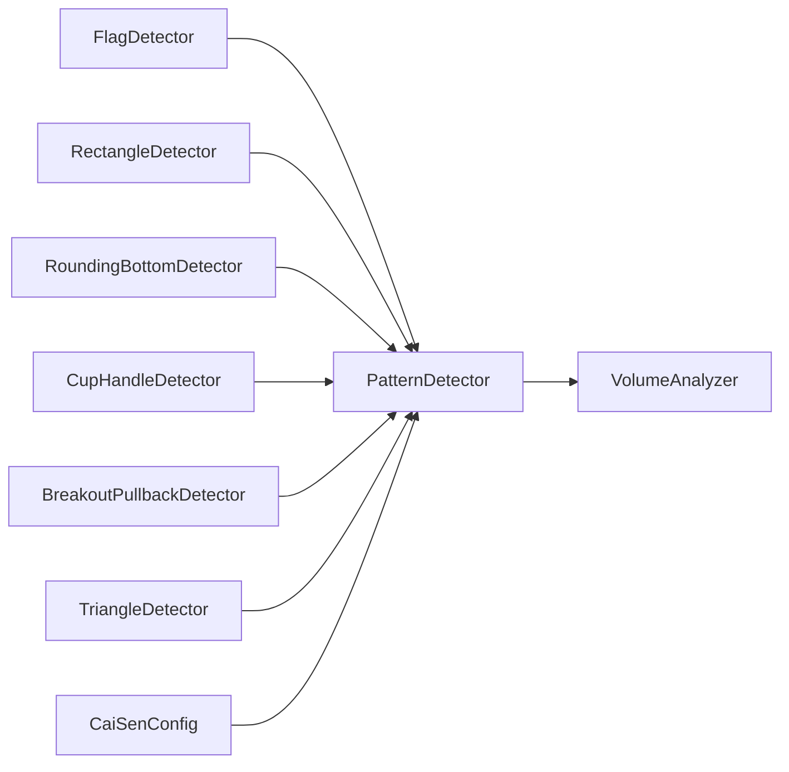

# 其他延续形态检测器

<cite>
**本文引用的文件**   
- [other.py](file://src/caisen/strategy/algorithm/patterns/other.py)
- [triangle.py](file://src/caisen/strategy/algorithm/patterns/triangle.py)
- [detector.py](file://src/caisen/strategy/algorithm/detector.py)
- [volume_analyzer.py](file://src/caisen/strategy/algorithm/caisen_components/volume_analyzer.py)
- [caisen_config.py](file://src/caisen/strategy/algorithm/caisen_config.py)
- [caisen_default.yaml](file://configs/strategies/caisen_default.yaml)
- [caisen_high_winrate.yaml](file://configs/strategies/caisen_high_winrate.yaml)
</cite>

## 目录
1. [简介](#简介)
2. [项目结构](#项目结构)
3. [核心组件](#核心组件)
4. [架构总览](#架构总览)
5. [详细组件分析](#详细组件分析)
6. [依赖关系分析](#依赖关系分析)
7. [性能与优化建议](#性能与优化建议)
8. [故障排查指南](#故障排查指南)
9. [结论](#结论)
10. [附录：参数配置参考](#附录参数配置参考)

## 简介
本技术文档面向“其他延续形态检测器”，聚焦以下四类常见延续形态的识别与交易信号生成：旗形整理、矩形整理、圆弧底、杯柄形态，并附带过前高（突破回踩）作为补充。文档深入阐述：
- 旗形整理的价格通道识别算法：快速上涨后的回调整理、平行通道边界绘制与突破方向预测；
- 矩形整理的支撑阻力位动态调整机制：多次测试的强度评估与突破确认条件；
- 圆弧底的曲线拟合思路与底部区域确定方法：二次函数拟合精度与颈线判定；
- 杯柄形态的复合结构识别：杯体圆弧检测与手柄回调确认；
- 各形态的参数配置选项与性能优化建议。

## 项目结构
与“其他延续形态”相关的核心代码位于策略算法模块中，采用纯函数接口风格，便于回测与并行测试。关键文件与职责如下：
- patterns/other.py：实现旗形、矩形、圆弧底、杯柄、过前高等检测器；
- patterns/triangle.py：对称三角形检测器（辅助理解趋势线与收敛逻辑）；
- algorithm/detector.py：检测器基类与通用工具（置信度计算、趋势判断、量比等）；
- caisen_components/volume_analyzer.py：分阶段量能分析器（放量/缩量/递增评估）；
- caisen_config.py：策略配置加载与开关/权重管理；
- configs/strategies/*.yaml：默认与高胜率配置示例。

```mermaid
graph TB
subgraph "形态检测"
A["FlagDetector<br/>旗形"] --> D["PatternDetector<br/>基类"]
B["RectangleDetector<br/>矩形"] --> D
C["RoundingBottomDetector<br/>圆弧底"] --> D
E["CupHandleDetector<br/>杯柄"] --> D
F["BreakoutPullbackDetector<br/>过前高"] --> D
G["TriangleDetector<br/>三角"] --> D
end
D --> H["VolumeAnalyzer<br/>量能分析器"]
I["CaiSenConfig<br/>配置加载"] --> D
J["YAML配置<br/>默认/高胜率"] --> I
```

图表来源
- [other.py:11-576](file://src/caisen/strategy/algorithm/patterns/other.py#L11-L576)
- [triangle.py:11-239](file://src/caisen/strategy/algorithm/patterns/triangle.py#L11-L239)
- [detector.py:80-244](file://src/caisen/strategy/algorithm/detector.py#L80-L244)
- [volume_analyzer.py:15-287](file://src/caisen/strategy/algorithm/caisen_components/volume_analyzer.py#L15-L287)
- [caisen_config.py:11-145](file://src/caisen/strategy/algorithm/caisen_config.py#L11-L145)
- [caisen_default.yaml:1-50](file://configs/strategies/caisen_default.yaml#L1-L50)
- [caisen_high_winrate.yaml:1-23](file://configs/strategies/caisen_high_winrate.yaml#L1-L23)

章节来源
- [other.py:11-576](file://src/caisen/strategy/algorithm/patterns/other.py#L11-L576)
- [triangle.py:11-239](file://src/caisen/strategy/algorithm/patterns/triangle.py#L11-L239)
- [detector.py:80-244](file://src/caisen/strategy/algorithm/detector.py#L80-L244)
- [volume_analyzer.py:15-287](file://src/caisen/strategy/algorithm/caisen_components/volume_analyzer.py#L15-L287)
- [caisen_config.py:11-145](file://src/caisen/strategy/algorithm/caisen_config.py#L11-L145)
- [caisen_default.yaml:1-50](file://configs/strategies/caisen_default.yaml#L1-L50)
- [caisen_high_winrate.yaml:1-23](file://configs/strategies/caisen_high_winrate.yaml#L1-L23)

## 核心组件
- 检测器基类 PatternDetector
  - 提供统一接口 detect(bars) -> Optional[PatternSignal]；
  - 内置置信度加权计算 _calculate_confidence；
  - 提供趋势判断 _is_trend_up/_is_trend_down、量比 _volume_ratio 等工具；
  - 自动注入 VolumeAnalyzer，用于分级与阶段性量能评估。
- 量能分析器 VolumeAnalyzer
  - 基础均量计算 get_base_volume；
  - 分阶段检查 staged_volume_check（支持 shrink/expand/progressive）；
  - 突破等级 grade（weak/normal/strong）；
  - 量价背离 volume_divergence；
  - 关键点递增 progressive_volume。
- 配置系统 CaiSenConfig
  - 从 YAML 加载 params/patterns/pattern_weights；
  - 提供形态开关与权重字典，供上层策略聚合评分。

章节来源
- [detector.py:80-244](file://src/caisen/strategy/algorithm/detector.py#L80-L244)
- [volume_analyzer.py:15-287](file://src/caisen/strategy/algorithm/caisen_components/volume_analyzer.py#L15-L287)
- [caisen_config.py:11-145](file://src/caisen/strategy/algorithm/caisen_config.py#L11-L145)

## 架构总览
下图展示了“其他延续形态检测器”的整体调用链：检测器接收 K 线序列，内部使用量能分析器进行放量/缩量评估，结合形态完成度、趋势共振与动量因子计算综合置信度，最终输出包含止损、目标价与可视化点位的信号。

图表来源
- [other.py:11-576](file://src/caisen/strategy/algorithm/patterns/other.py#L11-L576)
- [detector.py:125-180](file://src/caisen/strategy/algorithm/detector.py#L125-L180)
- [volume_analyzer.py:127-224](file://src/caisen/strategy/algorithm/caisen_components/volume_analyzer.py#L127-L224)

## 详细组件分析

### 旗形整理检测器 FlagDetector
- 形态特征
  - 快速上涨/下跌后出现短暂整理区间（旗面），随后沿原趋势方向突破。
- 关键步骤
  - 寻找旗杆：在窗口内识别显著波动幅度与方向；
  - 寻找旗面：在最近若干根K线内提取上下边界，要求振幅相对平均价较小；
  - 突破判定：当前收盘价突破上轨（多头）或下轨（空头）即触发信号；
  - 量能确认：通过 VolumeAnalyzer.grade 对突破K线进行放量分级，影响置信度；
  - 目标与止损：以旗杆高度为基准设定目标，并以另一侧边界设置止损。
- 复杂度与边界
  - 时间复杂度 O(n)，空间复杂度 O(1)（仅维护最近窗口）；
  - 对极端行情与窄幅震荡敏感，需配合最小K线数与振幅阈值过滤。
- 可视化
  - 信号 points 为空列表（可后续扩展记录通道端点）。

图表来源
- [other.py:32-74](file://src/caisen/strategy/algorithm/patterns/other.py#L32-L74)
- [other.py:76-138](file://src/caisen/strategy/algorithm/patterns/other.py#L76-L138)
- [other.py:140-179](file://src/caisen/strategy/algorithm/patterns/other.py#L140-L179)
- [volume_analyzer.py:127-156](file://src/caisen/strategy/algorithm/caisen_components/volume_analyzer.py#L127-L156)

章节来源
- [other.py:11-179](file://src/caisen/strategy/algorithm/patterns/other.py#L11-L179)
- [volume_analyzer.py:127-156](file://src/caisen/strategy/algorithm/caisen_components/volume_analyzer.py#L127-L156)

### 矩形整理检测器 RectangleDetector
- 形态特征
  - 价格在水平区间内反复测试上下沿，形成支撑与阻力；
  - 向上突破上沿做多，向下跌破下沿做空。
- 支撑阻力动态调整与强度评估
  - 动态调整：每次检测到新的最高价/最低价时更新上沿/下沿；
  - 强度评估：基于多次测试次数、振幅占比、趋势共振与量能等级综合打分；
  - 突破确认：收盘价明确突破边界且量能达到一定级别（grade=normal/strong）提升置信度。
- 目标与止损
  - 目标价通常取突破价加减区间振幅；
  - 止损设于另一侧边界附近，按 stop_loss_factor 微调。
- 复杂度与边界
  - 时间复杂度 O(n)，空间复杂度 O(1)；
  - 对假突破敏感，可通过最小K线数与最大振幅阈值降低误报。

图表来源
- [other.py:182-291](file://src/caisen/strategy/algorithm/patterns/other.py#L182-L291)
- [detector.py:194-222](file://src/caisen/strategy/algorithm/detector.py#L194-L222)
- [volume_analyzer.py:127-156](file://src/caisen/strategy/algorithm/caisen_components/volume_analyzer.py#L127-L156)

章节来源
- [other.py:182-291](file://src/caisen/strategy/algorithm/patterns/other.py#L182-L291)
- [detector.py:194-222](file://src/caisen/strategy/algorithm/detector.py#L194-L222)
- [volume_analyzer.py:127-156](file://src/caisen/strategy/algorithm/caisen_components/volume_analyzer.py#L127-L156)

### 圆弧底检测器 RoundingBottomDetector
- 形态特征
  - 缓慢筑底形成近似圆弧的低点，随后向上突破颈线。
- 曲线拟合与底部区域确定
  - 简化实现：在窗口内定位最低点并要求其处于中间区域；
  - 颈线：左侧高点最大值；
  - 进阶建议：可采用二次函数 y=ax^2+bx+c 对低点序列进行最小二乘拟合，利用拟合残差评估圆滑度与精度；当拟合优度高于阈值且最低点位于拟合曲线谷底附近时，认定底部区域成立。
- 量能确认
  - 后半段量能应逐步递增（progressive_volume），同时突破K线放量（grade=strong）提升置信度。
- 目标与止损
  - 目标价=颈线+（颈线-最低点）；
  - 止损=最低点×stop_loss_factor。

图表来源
- [other.py:293-401](file://src/caisen/strategy/algorithm/patterns/other.py#L293-L401)
- [volume_analyzer.py:197-224](file://src/caisen/strategy/algorithm/caisen_components/volume_analyzer.py#L197-L224)

章节来源
- [other.py:293-401](file://src/caisen/strategy/algorithm/patterns/other.py#L293-L401)
- [volume_analyzer.py:197-224](file://src/caisen/strategy/algorithm/caisen_components/volume_analyzer.py#L197-L224)

### 杯柄形态检测器 CupHandleDetector
- 形态特征
  - 杯体：圆弧形下跌后回升；
  - 柄部：在杯体右侧出现短暂回调；
  - 突破：价格突破柄部高点后做多。
- 复合结构识别
  - 简化实现：在窗口内找最高点（应在右侧），再在其之前找最低点，最后取两者之间的最高价为柄部高点；
  - 进阶建议：对杯体部分进行二次函数拟合，评估曲率与对称性；柄部回调深度与时长需满足阈值。
- 量能确认
  - 突破K线放量（grade=strong/normal）提升置信度。
- 目标与止损
  - 目标=突破价+（杯体高点-杯体低点）；
  - 止损=杯体低点×stop_loss_factor。

图表来源
- [other.py:403-507](file://src/caisen/strategy/algorithm/patterns/other.py#L403-L507)
- [volume_analyzer.py:127-156](file://src/caisen/strategy/algorithm/caisen_components/volume_analyzer.py#L127-L156)

章节来源
- [other.py:403-507](file://src/caisen/strategy/algorithm/patterns/other.py#L403-L507)
- [volume_analyzer.py:127-156](file://src/caisen/strategy/algorithm/caisen_components/volume_analyzer.py#L127-L156)

### 过前高检测器 BreakoutPullbackDetector
- 形态特征
  - 价格突破前期高点后回踩，再次上涨时做多。
- 关键步骤
  - 在 lookback_period 窗口内寻找前高；
  - 当前收盘突破前高即触发信号；
  - 量能确认：突破K线放量提升置信度；
  - 目标与止损：以突破幅度为基准设定目标，以前高附近设止损。
- 复杂度与边界
  - 时间复杂度 O(n)，空间复杂度 O(1)；
  - 对频繁假突破敏感，可结合趋势与量能进一步过滤。

图表来源
- [other.py:509-576](file://src/caisen/strategy/algorithm/patterns/other.py#L509-L576)
- [volume_analyzer.py:127-156](file://src/caisen/strategy/algorithm/caisen_components/volume_analyzer.py#L127-L156)

章节来源
- [other.py:509-576](file://src/caisen/strategy/algorithm/patterns/other.py#L509-L576)
- [volume_analyzer.py:127-156](file://src/caisen/strategy/algorithm/caisen_components/volume_analyzer.py#L127-L156)

### 对称三角形检测器 TriangleDetector（参考）
- 形态特征
  - 高点下降、低点上升，两趋势线收敛；
  - 向上突破上沿做多，向下跌破下沿做空。
- 关键步骤
  - 选取至少 min_highs/min_lows 个极值点，验证递减/递增；
  - 计算上下趋势线斜率，要求收敛（一负一正）；
  - 突破方向由趋势线斜率决定；
  - 置信度考虑完成度（收敛紧密）、量能、趋势与动量。
- 可视化
  - 信号 points 包含上下轨的关键点，便于绘图标注。

图表来源
- [triangle.py:11-239](file://src/caisen/strategy/algorithm/patterns/triangle.py#L11-L239)
- [detector.py:80-244](file://src/caisen/strategy/algorithm/detector.py#L80-L244)

章节来源
- [triangle.py:11-239](file://src/caisen/strategy/algorithm/patterns/triangle.py#L11-L239)
- [detector.py:80-244](file://src/caisen/strategy/algorithm/detector.py#L80-L244)

## 依赖关系分析
- 耦合与内聚
  - 各形态检测器均继承自 PatternDetector，复用置信度计算与趋势/量比工具，内聚良好；
  - 通过组合方式引入 VolumeAnalyzer，避免紧耦合。
- 外部依赖
  - Bar 数据模型（类型提示引用）；
  - YAML 配置文件驱动开关与权重。
- 潜在循环依赖
  - 无直接循环导入；检测器不反向依赖配置模块，配置仅在上层注入。

图表来源
- [detector.py:80-244](file://src/caisen/strategy/algorithm/detector.py#L80-L244)
- [volume_analyzer.py:15-287](file://src/caisen/strategy/algorithm/caisen_components/volume_analyzer.py#L15-L287)
- [caisen_config.py:11-145](file://src/caisen/strategy/algorithm/caisen_config.py#L11-L145)
- [other.py:11-576](file://src/caisen/strategy/algorithm/patterns/other.py#L11-L576)
- [triangle.py:11-239](file://src/caisen/strategy/algorithm/patterns/triangle.py#L11-L239)

章节来源
- [detector.py:80-244](file://src/caisen/strategy/algorithm/detector.py#L80-L244)
- [volume_analyzer.py:15-287](file://src/caisen/strategy/algorithm/caisen_components/volume_analyzer.py#L15-L287)
- [caisen_config.py:11-145](file://src/caisen/strategy/algorithm/caisen_config.py#L11-L145)
- [other.py:11-576](file://src/caisen/strategy/algorithm/patterns/other.py#L11-L576)
- [triangle.py:11-239](file://src/caisen/strategy/algorithm/patterns/triangle.py#L11-L239)

## 性能与优化建议
- 时间复杂度
  - 所有检测器均为 O(n) 滑动窗口扫描，适合高频回测；
  - 建议在批量回测中对 bars 切片进行缓存，减少重复计算。
- 内存占用
  - 仅维护最近窗口，内存开销低；
  - 若需更复杂拟合（如圆弧底二次函数），建议增量最小二乘或分段拟合以降低开销。
- 量化加速
  - 将极值查找、均值计算向量化（NumPy/Pandas）；
  - 对 VolumeAnalyzer 的基础均量与分级进行预计算与缓存。
- 参数自适应
  - 根据波动率动态调整 min_bars/max_amplitude；
  - 结合ATR或历史波动率自适应止损系数 stop_loss_factor。
- 并发与并行
  - 检测器为纯函数接口，天然支持并行化；
  - 在多标的场景下，按标的并行运行检测器以提升吞吐。

## 故障排查指南
- 常见问题
  - 信号缺失：检查 bars 长度是否满足最小窗口；确认形态开关已启用；
  - 假突破过多：提高量能阈值（breakout_multiplier）、增大最小K线数或收紧振幅阈值；
  - 圆弧底误判：确保最低点位于中间区域，必要时引入二次拟合优度阈值；
  - 杯柄形态不稳定：严格限定柄部回调深度与时长，增加量能确认。
- 调试要点
  - 打印 ConfidenceFactors 的各维度得分（completion/volume/trend/momentum）定位问题；
  - 观察 VolumeAnalyzer.grade 与 progressive_volume 的结果，确认量能是否符合预期；
  - 对比不同配置的 pattern_weights，评估形态质量评分变化。

章节来源
- [detector.py:125-180](file://src/caisen/strategy/algorithm/detector.py#L125-L180)
- [volume_analyzer.py:127-224](file://src/caisen/strategy/algorithm/caisen_components/volume_analyzer.py#L127-L224)
- [caisen_config.py:55-68](file://src/caisen/strategy/algorithm/caisen_config.py#L55-L68)

## 结论
“其他延续形态检测器”以统一的纯函数接口与轻量化的量能分析为核心，实现了旗形、矩形、圆弧底、杯柄与过前高等常见延续形态的高效识别。通过完成度、量能、趋势与动量的多维置信度融合，能够在保证较低计算成本的同时提供稳健的信号质量。未来可在曲线拟合、自适应参数与并发执行方面进一步优化，以提升实战表现与可扩展性。

## 附录：参数配置参考
- 默认配置（caisen_default.yaml）
  - 平台检测参数：platform_min_bars、platform_max_amplitude、platform_volume_decline；
  - 破底翻参数：breakdown_max_pct、breakdown_max_bars、pullback_max_bars、volume_confirm；
  - 风险控制：stop_loss_factor、min_profit_pct、trailing_stop_pct、trailing_stop_enabled；
  - 形态开关：W_BOTTOM、M_TOP、HEAD_AND_SHOULDERS_BOTTOM、HEAD_AND_SHOULDERS_TOP、TRIANGLE、FLAG、RECTANGLE、ROUNDING_BOTTOM、CUP_HANDLE、BREAKOUT_PULLBACK；
  - 形态权重：pattern_weights 字典。
- 高胜率配置（caisen_high_winrate.yaml）
  - 侧重风控与只做多模式：stop_loss_factor、min_profit_pct、trailing_stop_pct、long_only_mode、max_loss_pct；
  - 精简形态开关，保留高胜率形态。

章节来源
- [caisen_default.yaml:1-50](file://configs/strategies/caisen_default.yaml#L1-L50)
- [caisen_high_winrate.yaml:1-23](file://configs/strategies/caisen_high_winrate.yaml#L1-L23)
- [caisen_config.py:70-114](file://src/caisen/strategy/algorithm/caisen_config.py#L70-L114)