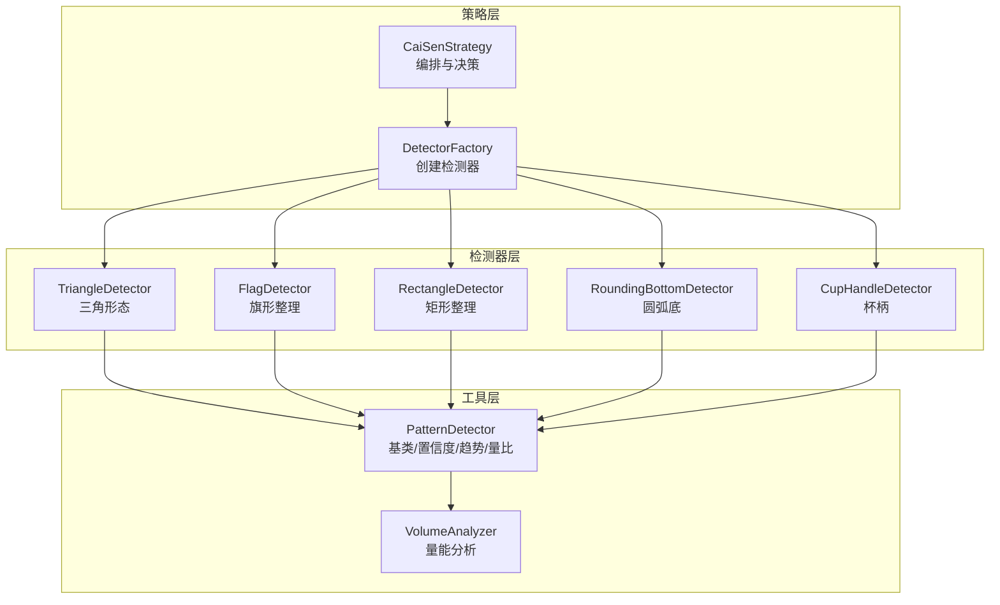
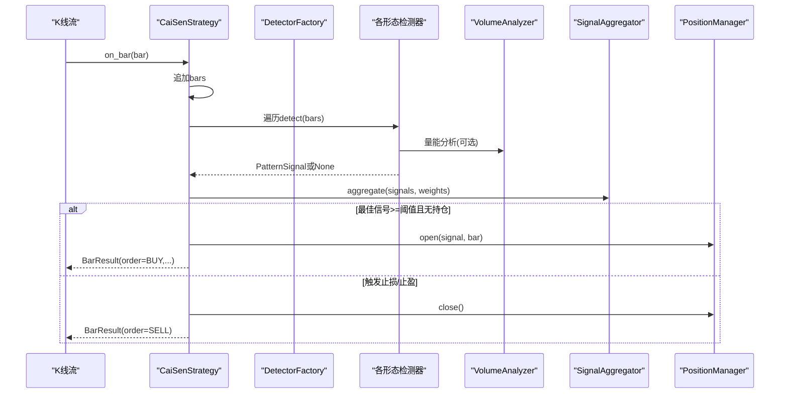
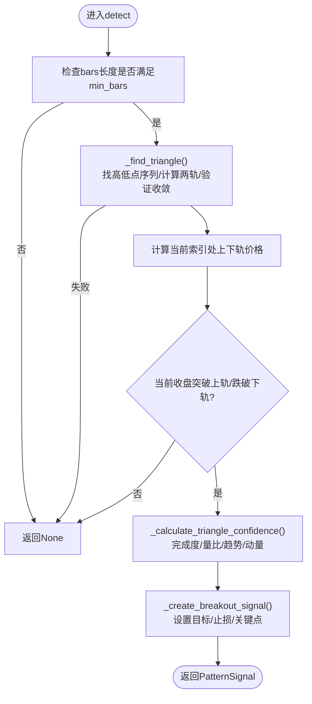
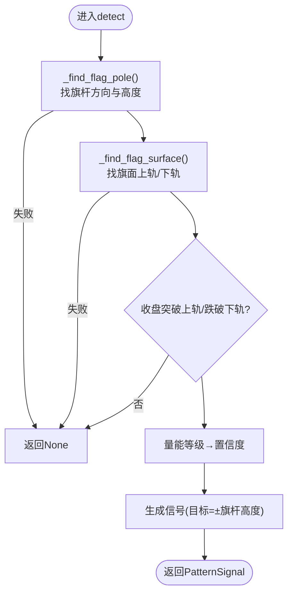
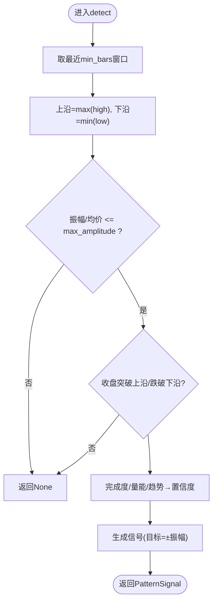
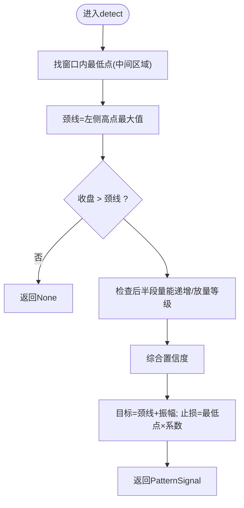
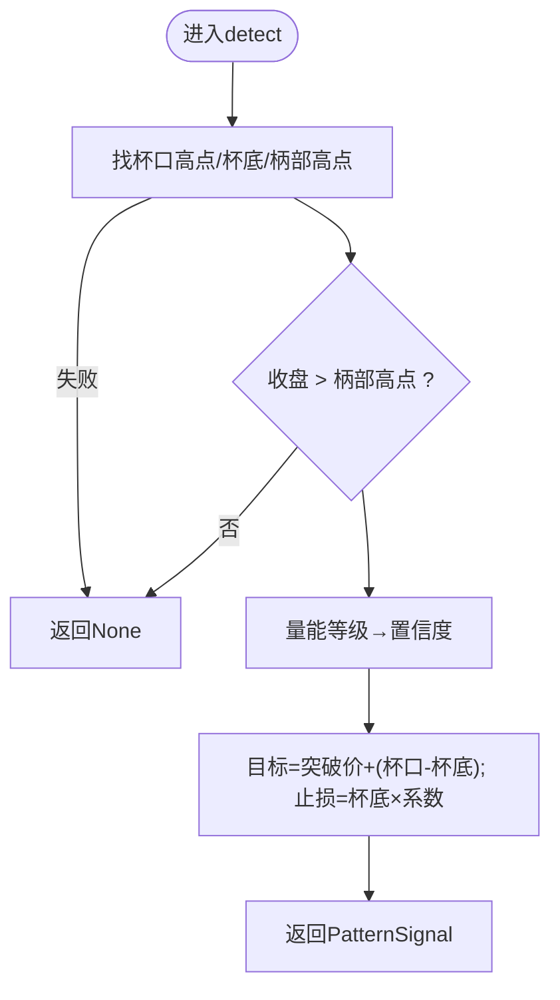
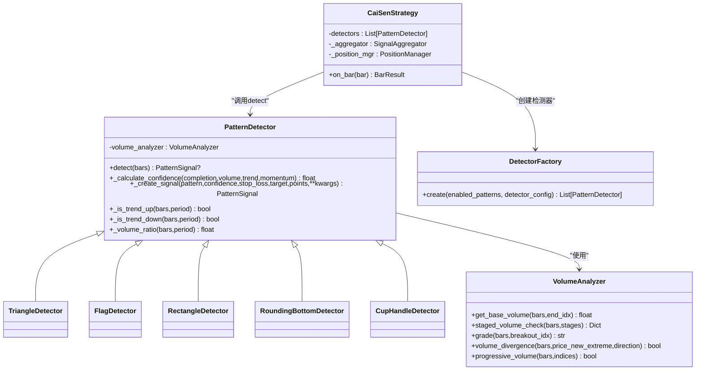

# 延续形态检测器

<cite>
**本文引用的文件**   
- [triangle.py](file://src/caisen/strategy/algorithm/patterns/triangle.py)
- [other.py](file://src/caisen/strategy/algorithm/patterns/other.py)
- [detector.py](file://src/caisen/strategy/algorithm/detector.py)
- [volume_analyzer.py](file://src/caisen/strategy/algorithm/caisen_components/volume_analyzer.py)
- [factory.py](file://src/caisen/strategy/algorithm/caisen_components/factory.py)
- [cai_sen.py](file://src/caisen/strategy/algorithm/cai_sen.py)
- [caisen_config.py](file://src/caisen/strategy/algorithm/caisen_config.py)
- [__init__.py](file://src/caisen/strategy/algorithm/patterns/__init__.py)
- [cai_sen_v2.yaml](file://configs/strategies/cai_sen_v2.yaml)
</cite>

## 目录
1. [简介](#简介)
2. [项目结构](#项目结构)
3. [核心组件](#核心组件)
4. [架构总览](#架构总览)
5. [详细组件分析](#详细组件分析)
6. [依赖关系分析](#依赖关系分析)
7. [性能与复杂度](#性能与复杂度)
8. [参数调优策略](#参数调优策略)
9. [实战应用指南](#实战应用指南)
10. [故障排查](#故障排查)
11. [结论](#结论)

## 简介
本技术文档围绕“延续形态检测器”的实现与使用，系统阐述三角形态（上升三角形、下降三角形、对称三角形）的几何识别算法，旗形整理与矩形整理的价格通道识别方法，圆弧底曲线拟合思路与杯柄复合结构识别流程；并给出时间周期特征、成交量萎缩规律、突破后目标价位计算、参数调优策略与实战要点。文档以代码级实现为依据，提供可视化图示与可操作建议，帮助读者快速理解与落地应用。

## 项目结构
延续形态检测器位于策略算法模块中，采用“纯函数接口 + 组件化”的设计：
- 基类与信号定义：PatternDetector、PatternSignal、ConfidenceFactors
- 形态检测器：TriangleDetector、FlagDetector、RectangleDetector、RoundingBottomDetector、CupHandleDetector 等
- 量能分析器：VolumeAnalyzer（分阶段量能评估、放量等级、量价背离、递增检查）
- 工厂与策略编排：DetectorFactory、CaiSenStrategy（组合多检测器、评分聚合、风控执行）
- 配置加载：YAML 配置驱动开关、权重、阈值与检测器参数

图表来源
- [cai_sen.py:36-245](file://src/caisen/strategy/algorithm/cai_sen.py#L36-L245)
- [factory.py:54-237](file://src/caisen/strategy/algorithm/caisen_components/factory.py#L54-L237)
- [triangle.py:11-239](file://src/caisen/strategy/algorithm/patterns/triangle.py#L11-L239)
- [other.py:11-576](file://src/caisen/strategy/algorithm/patterns/other.py#L11-L576)
- [detector.py:80-244](file://src/caisen/strategy/algorithm/detector.py#L80-L244)
- [volume_analyzer.py:15-287](file://src/caisen/strategy/algorithm/caisen_components/volume_analyzer.py#L15-L287)

章节来源
- [cai_sen.py:36-245](file://src/caisen/strategy/algorithm/cai_sen.py#L36-L245)
- [factory.py:54-237](file://src/caisen/strategy/algorithm/caisen_components/factory.py#L54-L237)
- [detector.py:80-244](file://src/caisen/strategy/algorithm/detector.py#L80-L244)
- [volume_analyzer.py:15-287](file://src/caisen/strategy/algorithm/caisen_components/volume_analyzer.py#L15-L287)
- [triangle.py:11-239](file://src/caisen/strategy/algorithm/patterns/triangle.py#L11-L239)
- [other.py:11-576](file://src/caisen/strategy/algorithm/patterns/other.py#L11-L576)

## 核心组件
- PatternDetector 抽象基类
  - 提供 detect(bars) 纯函数接口、置信度加权计算、趋势判断、量比计算、信号构造等通用能力
  - 内置 VolumeAnalyzer 实例，支持按形态阶段进行量能评估
- PatternSignal 数据模型
  - 包含 pattern、confidence、stop_loss、target、points、data 等字段，is_valid 校验
- ConfidenceFactors 因子模型
  - completion、volume、trend、momentum 四维因子，默认权重可配置
- VolumeAnalyzer 量能分析器
  - 基础均量、分阶段量能检查、放量等级、量价背离、递增检查
- DetectorFactory 检测器工厂
  - 根据 enabled_patterns 与 detectors 配置动态创建具体检测器实例
- CaiSenStrategy 策略编排
  - 每根K线调用 on_bar：收集 bars → 并行检测 → 聚合评分 → 下单/止损/止盈

章节来源
- [detector.py:18-244](file://src/caisen/strategy/algorithm/detector.py#L18-L244)
- [volume_analyzer.py:15-287](file://src/caisen/strategy/algorithm/caisen_components/volume_analyzer.py#L15-L287)
- [factory.py:54-237](file://src/caisen/strategy/algorithm/caisen_components/factory.py#L54-L237)
- [cai_sen.py:174-245](file://src/caisen/strategy/algorithm/cai_sen.py#L174-L245)

## 架构总览
延续形态检测器在策略层通过 DetectorFactory 按需创建检测器，各检测器基于 PatternDetector 基类实现纯函数式 detect(bars)，返回 PatternSignal。CaiSenStrategy 负责将多个检测器的输出进行评分聚合与交易决策。

图表来源
- [cai_sen.py:178-221](file://src/caisen/strategy/algorithm/cai_sen.py#L178-L221)
- [factory.py:81-111](file://src/caisen/strategy/algorithm/caisen_components/factory.py#L81-L111)
- [detector.py:112-180](file://src/caisen/strategy/algorithm/detector.py#L112-L180)
- [volume_analyzer.py:127-156](file://src/caisen/strategy/algorithm/caisen_components/volume_analyzer.py#L127-L156)

## 详细组件分析

### 三角形态检测器（TriangleDetector）
- 几何识别要点
  - 高点序列递减、低点序列递增，形成收敛的两条直线（上轨斜率负、下轨斜率正）
  - 当前收盘价突破上轨为多头信号，跌破下轨为空头信号
- 边界线与收敛程度
  - 上轨/下轨由最近若干高/低点线性拟合得到，收敛程度用振幅与均价比值衡量
- 突破方向预测
  - 结合完成度、成交量放大倍数、趋势共振、动量强度加权计算置信度
- 目标与止损
  - 目标 = 突破价 ± 振幅；止损 = 另一侧轨道价乘以系数

图表来源
- [triangle.py:39-73](file://src/caisen/strategy/algorithm/patterns/triangle.py#L39-L73)
- [triangle.py:74-143](file://src/caisen/strategy/algorithm/patterns/triangle.py#L74-L143)
- [triangle.py:195-239](file://src/caisen/strategy/algorithm/patterns/triangle.py#L195-L239)
- [triangle.py:145-193](file://src/caisen/strategy/algorithm/patterns/triangle.py#L145-L193)

章节来源
- [triangle.py:11-239](file://src/caisen/strategy/algorithm/patterns/triangle.py#L11-L239)
- [detector.py:125-180](file://src/caisen/strategy/algorithm/detector.py#L125-L180)

### 旗形整理检测器（FlagDetector）
- 价格通道识别
  - 先定位“旗杆”（近期显著涨跌），再在最近区间内寻找“旗面”（窄幅整理）
  - 上轨/下轨取整理区间的高/低，要求旗面宽度小于旗杆高度的一定比例
- 支撑阻力位动态调整
  - 随最新K线更新，上轨/下轨为最近整理区间的极值
- 波动率收缩检测
  - 通过旗面振幅相对均价的比例过滤非旗形
- 突破确认条件
  - 收盘价突破上轨（多头）或跌破下轨（空头），并结合量能等级提升置信度
- 目标与止损
  - 目标 = 突破价 ± 旗杆高度；止损 = 另一侧轨道价乘以系数

图表来源
- [other.py:32-74](file://src/caisen/strategy/algorithm/patterns/other.py#L32-L74)
- [other.py:76-138](file://src/caisen/strategy/algorithm/patterns/other.py#L76-L138)
- [other.py:140-179](file://src/caisen/strategy/algorithm/patterns/other.py#L140-L179)

章节来源
- [other.py:11-179](file://src/caisen/strategy/algorithm/patterns/other.py#L11-L179)

### 矩形整理检测器（RectangleDetector）
- 价格通道识别
  - 在 min_bars 窗口内取最高价与最低价作为水平通道上/下沿
- 支撑阻力位动态调整
  - 随窗口滑动，上/下沿动态更新
- 波动率收缩检测
  - 通道振幅相对均价需小于 max_amplitude
- 突破确认条件
  - 收盘价突破上沿或跌破下沿，结合量能等级与趋势方向加权置信度
- 目标与止损
  - 目标 = 突破价 ± 通道振幅；止损 = 另一侧轨道价乘以系数

图表来源
- [other.py:203-260](file://src/caisen/strategy/algorithm/patterns/other.py#L203-L260)
- [other.py:262-290](file://src/caisen/strategy/algorithm/patterns/other.py#L262-L290)

章节来源
- [other.py:182-290](file://src/caisen/strategy/algorithm/patterns/other.py#L182-L290)

### 圆弧底检测器（RoundingBottomDetector）
- 曲线拟合思路
  - 在窗口内寻找最低点（应在中间区域），左侧高点最大值作为颈线
  - 若当前收盘突破颈线，视为形态完成
- 成交量规律
  - 后半段量能逐步递增更佳；突破时放量等级强则置信度高
- 目标与止损
  - 目标 = 颈线 + (颈线 - 圆弧最低点)；止损 = 圆弧最低点 × 系数

图表来源
- [other.py:312-370](file://src/caisen/strategy/algorithm/patterns/other.py#L312-L370)
- [other.py:372-400](file://src/caisen/strategy/algorithm/patterns/other.py#L372-L400)

章节来源
- [other.py:293-400](file://src/caisen/strategy/algorithm/patterns/other.py#L293-L400)

### 杯柄形态检测器（CupHandleDetector）
- 复合结构识别
  - 杯身：圆弧形上涨；柄部：短暂回调
  - 简化实现：在窗口内找右侧高点（杯口）、其前最低点（杯底）、两者之间的局部高点（柄部高点）
- 突破确认条件
  - 收盘突破柄部高点，结合量能等级提升置信度
- 目标与止损
  - 目标 = 突破价 + (杯口 - 杯底)；止损 = 杯底 × 系数

图表来源
- [other.py:423-470](file://src/caisen/strategy/algorithm/patterns/other.py#L423-L470)
- [other.py:472-506](file://src/caisen/strategy/algorithm/patterns/other.py#L472-L506)

章节来源
- [other.py:403-506](file://src/caisen/strategy/algorithm/patterns/other.py#L403-L506)

### 过前高检测器（BreakoutPullbackDetector）
- 逻辑简述
  - 在 lookback_period 窗口内找历史高点，当前收盘突破该高点即触发
  - 结合量能等级提升置信度
- 目标与止损
  - 目标 = 突破价 + (突破价 - 前高)；止损 = 前高 × 系数

章节来源
- [other.py:509-576](file://src/caisen/strategy/algorithm/patterns/other.py#L509-L576)

### 量能分析器（VolumeAnalyzer）
- 关键能力
  - get_base_volume：基础均量
  - staged_volume_check：分阶段量能检查（缩量/放量/递增）
  - grade：突破时量能等级（弱/正常/强）
  - volume_divergence：量价背离检测
  - progressive_volume：关键点量能递增检查
- 对形态的影响
  - 三角/矩形/旗形/圆弧底/杯柄等均利用 grade 或 staged_volume_check 提升置信度或作为确认条件

章节来源
- [volume_analyzer.py:15-287](file://src/caisen/strategy/algorithm/caisen_components/volume_analyzer.py#L15-L287)

## 依赖关系分析
- 检测器与基类
  - 所有形态检测器继承自 PatternDetector，复用置信度计算、趋势判断、量比计算与信号构造
- 量能分析器耦合
  - 多数检测器通过 self.volume_analyzer.grade(...) 或 staged_volume_check(...) 获取量能信息
- 工厂与策略
  - DetectorFactory 根据 enabled_patterns 与 detectors 配置创建检测器实例
  - CaiSenStrategy 在 on_bar 中统一调度检测、聚合与风控

图表来源
- [detector.py:80-244](file://src/caisen/strategy/algorithm/detector.py#L80-L244)
- [volume_analyzer.py:15-287](file://src/caisen/strategy/algorithm/caisen_components/volume_analyzer.py#L15-L287)
- [factory.py:54-237](file://src/caisen/strategy/algorithm/caisen_components/factory.py#L54-L237)
- [cai_sen.py:36-245](file://src/caisen/strategy/algorithm/cai_sen.py#L36-L245)

章节来源
- [detector.py:80-244](file://src/caisen/strategy/algorithm/detector.py#L80-L244)
- [factory.py:54-237](file://src/caisen/strategy/algorithm/caisen_components/factory.py#L54-L237)
- [cai_sen.py:36-245](file://src/caisen/strategy/algorithm/cai_sen.py#L36-L245)

## 性能与复杂度
- 时间复杂度
  - 三角/矩形/旗形/圆弧底/杯柄均在固定窗口内扫描，主要操作为极值查找与简单线性拟合，整体 O(n)（n 为窗口大小）
  - 量能分析器在窗口内求均值与比较，亦为 O(n)
- 空间复杂度
  - 仅维护最近若干K线与少量中间变量，O(n)
- 优化建议
  - 合理设置 min_bars/max_bars 控制窗口大小
  - 避免频繁全量重算，优先增量更新窗口统计量（如滚动均值）

[本节为通用指导，不直接分析具体文件]

## 参数调优策略
- 全局策略参数（YAML）
  - strategy.threshold：综合评分阈值，控制入场门槛
  - weights.*：各形态权重，影响最终评分
  - risk.stop_loss_factor / risk.min_profit_pct：止损与最小盈利目标
  - confidence_factors.weights：completion/volume/trend/momentum 权重
  - confidence_factors.volume_threshold：放量倍数阈值
- 检测器专用参数（YAML detectors.*）
  - triangle：min_bars/min_highs/min_lows
  - flag：min_bars/max_bars
  - rectangle：min_bars/max_amplitude
  - rounding_bottom：min_bars
  - cup_handle：min_bars
  - breakout_pullback：lookback_period
  - breakdown_pullback / fake_breakout：平台期与回调期相关参数
- 调优步骤建议
  - 先启用必要形态，设置保守阈值与较大止损空间
  - 基于回测结果逐步提高 threshold 与降低权重噪声形态
  - 针对特定品种/周期微调 min_bars 与 max_amplitude
  - 观察量能等级分布，适当调整 volume_threshold 与放量倍数

章节来源
- [cai_sen_v2.yaml:1-145](file://configs/strategies/cai_sen_v2.yaml#L1-L145)
- [factory.py:38-51](file://src/caisen/strategy/algorithm/caisen_components/factory.py#L38-L51)
- [caisen_config.py:11-145](file://src/caisen/strategy/algorithm/caisen_config.py#L11-L145)

## 实战应用指南
- 适用周期与时间特征
  - 三角/矩形/旗形：短中期整理常见，窗口参数需匹配目标周期
  - 圆弧底/杯柄：筑底过程较长，需足够 min_bars 捕捉完整结构
- 成交量萎缩规律
  - 形成期应缩量（shrink），突破期应放量（expand），确认期可继续放量或缩量回踩
  - 使用 staged_volume_check 与 progressive_volume 量化这些规律
- 突破后的目标价位计算
  - 三角：目标 = 突破价 ± 振幅（上轨-下轨）
  - 旗形：目标 = 突破价 ± 旗杆高度
  - 矩形：目标 = 突破价 ± 通道振幅
  - 圆弧底：目标 = 颈线 + (颈线 - 圆弧最低点)
  - 杯柄：目标 = 突破价 + (杯口 - 杯底)
- 止损设置
  - 三角/矩形/旗形：另一侧轨道价乘以系数
  - 圆弧底/杯柄：底部低点乘以系数
- 实战建议
  - 结合趋势共振（_is_trend_up/_is_trend_down）与量能等级，提高胜率
  - 在震荡市降低权重与阈值，在趋势市适度放宽
  - 关注假突破（FakeBreakoutDetector）与破底翻（BreakdownPullbackDetector）辅助过滤

章节来源
- [triangle.py:145-193](file://src/caisen/strategy/algorithm/patterns/triangle.py#L145-L193)
- [other.py:140-179](file://src/caisen/strategy/algorithm/patterns/other.py#L140-L179)
- [other.py:262-290](file://src/caisen/strategy/algorithm/patterns/other.py#L262-L290)
- [other.py:312-370](file://src/caisen/strategy/algorithm/patterns/other.py#L312-L370)
- [other.py:423-470](file://src/caisen/strategy/algorithm/patterns/other.py#L423-L470)
- [volume_analyzer.py:55-125](file://src/caisen/strategy/algorithm/caisen_components/volume_analyzer.py#L55-L125)

## 故障排查
- 常见问题
  - 未检测到形态：检查 bars 长度是否满足 min_bars；确认窗口内是否存在足够高/低点
  - 假突破频繁：提高 threshold、增加量能等级要求、收紧 max_amplitude
  - 信号延迟：缩短 min_bars 或调整 lookback_period
- 调试建议
  - 打印 PatternSignal.points 与 data 字段，核对关键点与轨道价
  - 查看 VolumeAnalyzer.staged_volume_check 的 details，确认各阶段是否通过
  - 对比 _is_trend_up/_is_trend_down 的结果，确保趋势因子合理

章节来源
- [detector.py:151-180](file://src/caisen/strategy/algorithm/detector.py#L151-L180)
- [volume_analyzer.py:55-125](file://src/caisen/strategy/algorithm/caisen_components/volume_analyzer.py#L55-L125)

## 结论
延续形态检测器以纯函数接口与组件化设计为核心，三角、旗形、矩形、圆弧底与杯柄等形态在统一的置信度框架下实现，辅以分阶段量能评估与趋势共振，形成稳健的突破识别体系。通过 YAML 配置灵活调参，可在不同周期与品种上获得良好的实战效果。建议在实盘中结合风险管理与仓位控制，持续迭代参数与权重，以提升长期稳定性与收益风险比。