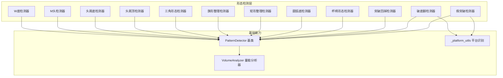
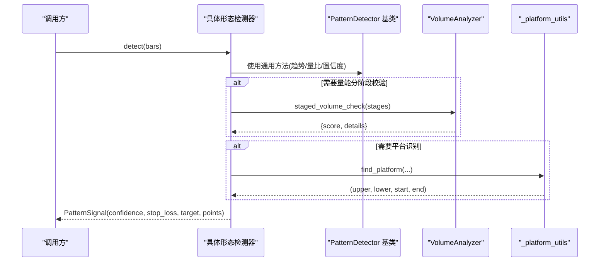
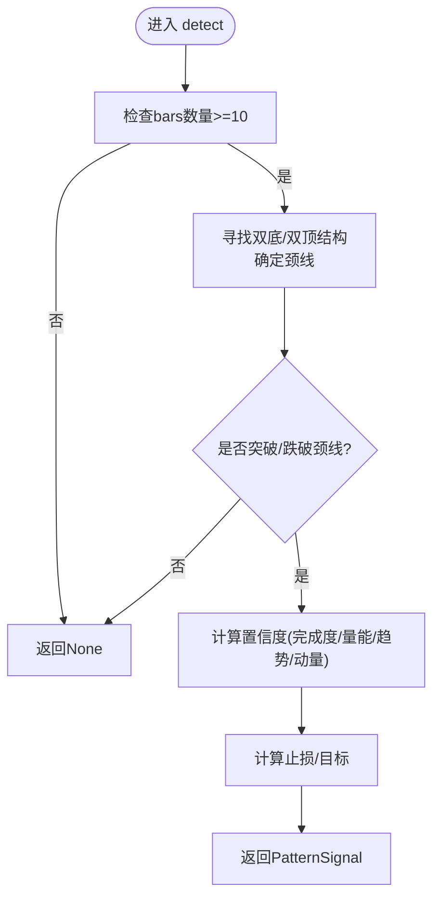
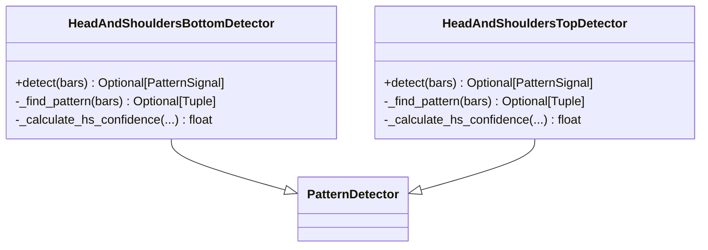
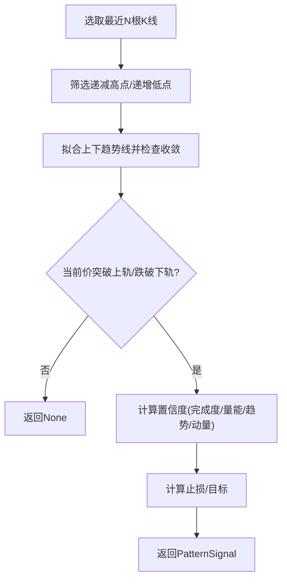
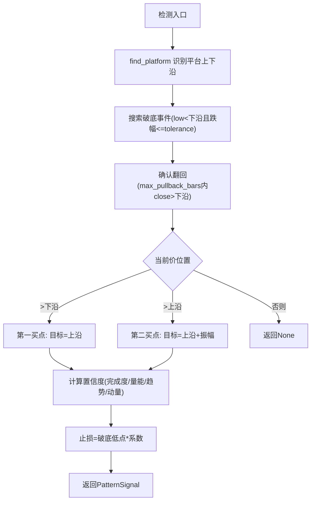
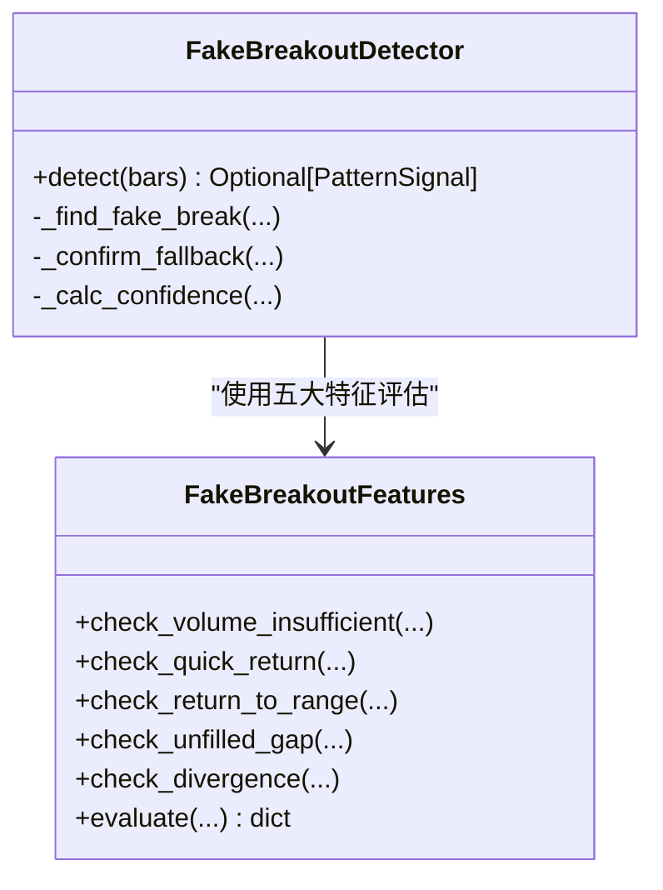
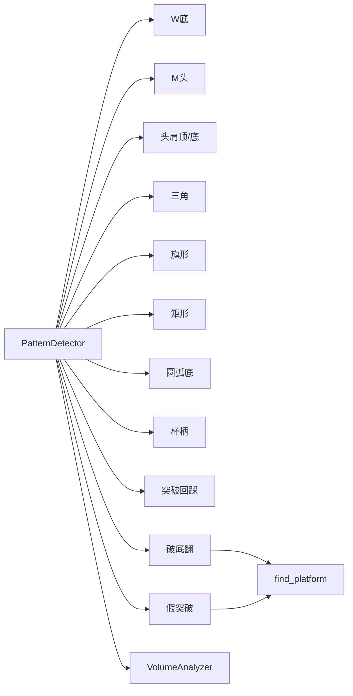

# 形态检测器

<cite>
**本文引用的文件**   
- [detector.py](file://src/caisen/strategy/algorithm/detector.py)
- [w_bottom.py](file://src/caisen/strategy/algorithm/patterns/w_bottom.py)
- [m_top.py](file://src/caisen/strategy/algorithm/patterns/m_top.py)
- [head_shoulders.py](file://src/caisen/strategy/algorithm/patterns/head_shoulders.py)
- [triangle.py](file://src/caisen/strategy/algorithm/patterns/triangle.py)
- [other.py](file://src/caisen/strategy/algorithm/patterns/other.py)
- [breakdown_pullback.py](file://src/caisen/strategy/algorithm/patterns/breakdown_pullback.py)
- [fake_breakout.py](file://src/caisen/strategy/algorithm/patterns/fake_breakout.py)
- [_platform_utils.py](file://src/caisen/strategy/algorithm/patterns/_platform_utils.py)
- [volume_analyzer.py](file://src/caisen/strategy/algorithm/caisen_components/volume_analyzer.py)
- [factory.py](file://src/caisen/strategy/algorithm/caisen_components/factory.py)
- [caisen_default.yaml](file://configs/strategies/caisen_default.yaml)
- [test_breakdown_pullback.py](file://tests/test_breakdown_pullback.py)
</cite>

## 目录
1. [简介](#简介)
2. [项目结构](#项目结构)
3. [核心组件](#核心组件)
4. [架构总览](#架构总览)
5. [详细组件分析](#详细组件分析)
6. [依赖关系分析](#依赖关系分析)
7. [性能与复杂度](#性能与复杂度)
8. [可视化与误报处理](#可视化与误报处理)
9. [参数调优指南](#参数调优指南)
10. [适用环境与回测建议](#适用环境与回测建议)
11. [故障排查](#故障排查)
12. [结论](#结论)

## 简介
本技术文档围绕蔡森策略中的12种经典技术形态检测器，系统阐述其识别算法、数学原理、价格与成交量确认条件、时间窗口约束以及置信度计算方法。同时说明 PatternDetector 基类的设计模式与自定义检测器的开发方法，并提供可视化示例、误报处理机制与参数调优指南，帮助读者在不同市场环境下选择合适形态并优化回测表现。

## 项目结构
形态检测器位于 strategy/algorithm/patterns 目录下，采用“纯函数接口”的无状态设计：每个检测器接收完整 K 线列表，返回信号或 None。平台识别工具与量能分析器作为共享能力被多个检测器复用。

图表来源
- [detector.py:80-244](file://src/caisen/strategy/algorithm/detector.py#L80-L244)
- [w_bottom.py:11-285](file://src/caisen/strategy/algorithm/patterns/w_bottom.py#L11-L285)
- [m_top.py:11-227](file://src/caisen/strategy/algorithm/patterns/m_top.py#L11-L227)
- [head_shoulders.py:11-323](file://src/caisen/strategy/algorithm/patterns/head_shoulders.py#L11-L323)
- [triangle.py:11-239](file://src/caisen/strategy/algorithm/patterns/triangle.py#L11-L239)
- [other.py:11-576](file://src/caisen/strategy/algorithm/patterns/other.py#L11-L576)
- [breakdown_pullback.py:17-259](file://src/caisen/strategy/algorithm/patterns/breakdown_pullback.py#L17-L259)
- [fake_breakout.py:299-511](file://src/caisen/strategy/algorithm/patterns/fake_breakout.py#L299-L511)
- [_platform_utils.py:12-74](file://src/caisen/strategy/algorithm/patterns/_platform_utils.py#L12-L74)
- [volume_analyzer.py:15-287](file://src/caisen/strategy/algorithm/caisen_components/volume_analyzer.py#L15-L287)

章节来源
- [detector.py:80-244](file://src/caisen/strategy/algorithm/detector.py#L80-L244)
- [volume_analyzer.py:15-287](file://src/caisen/strategy/algorithm/caisen_components/volume_analyzer.py#L15-L287)
- [_platform_utils.py:12-74](file://src/caisen/strategy/algorithm/patterns/_platform_utils.py#L12-L74)

## 核心组件
- PatternDetector 基类：提供统一的 detect(bars) 纯函数接口、置信度计算、趋势判断、量比计算与信号创建等通用能力。
- ConfidenceFactors 与 PatternSignal：分别封装四因子加权置信度与信号数据结构（含止损、目标价、关键点等）。
- VolumeAnalyzer：按阶段评估量能（缩量/放量/递增），支持分级与背离检测。
- _platform_utils.find_platform：在回看窗口内寻找振幅受限且长度足够的整理平台区间。

关键职责与交互
- 各形态检测器继承 PatternDetector，实现 detect()；内部通过 volume_analyzer 进行分阶段量能校验，必要时调用 find_platform 定位平台上下沿。
- 所有检测器均输出 PatternSignal，包含 confidence、stop_loss、target、points 等字段，便于统一后续交易逻辑与可视化渲染。

章节来源
- [detector.py:18-180](file://src/caisen/strategy/algorithm/detector.py#L18-L180)
- [detector.py:125-244](file://src/caisen/strategy/algorithm/detector.py#L125-L244)
- [volume_analyzer.py:55-126](file://src/caisen/strategy/algorithm/caisen_components/volume_analyzer.py#L55-L126)
- [_platform_utils.py:12-74](file://src/caisen/strategy/algorithm/patterns/_platform_utils.py#L12-L74)

## 架构总览
下图展示从输入 K 线到输出信号的端到端流程，以及各模块间的依赖关系。

图表来源
- [detector.py:112-180](file://src/caisen/strategy/algorithm/detector.py#L112-L180)
- [volume_analyzer.py:55-126](file://src/caisen/strategy/algorithm/caisen_components/volume_analyzer.py#L55-L126)
- [_platform_utils.py:12-74](file://src/caisen/strategy/algorithm/patterns/_platform_utils.py#L12-L74)

## 详细组件分析

### W底/M头（双底/双顶）
- 价格特征
  - W底：两个相近低点（±容差），中间存在明显颈线高点；当前收盘价突破颈线时确认。
  - M头：两个相近高点（±容差），中间存在明显颈线低点；当前收盘价跌破颈线时确认。
- 成交量确认
  - W底：三阶段量能（形成期缩量、突破期放量≥阈值、确认期持续或回踩缩量）。
  - M头：跌破时放量增强信号。
- 时间窗口约束
  - 至少10根K线用于扫描最近区域。
- 置信度计算
  - 完成度：两底/两顶越对称越高。
  - 成交量：基于 staged_volume_check 或简单量比映射至[0,1]。
  - 趋势：与方向共振（W底偏多、M头偏空）加分。
  - 动量：突破/跌破力度归一化。
- 止损与目标
  - W底：止损=最低点×系数；目标=颈线+振幅或最小盈利百分比取大值。
  - M头：止损=最高点×系数；目标=颈线-振幅。

图表来源
- [w_bottom.py:49-189](file://src/caisen/strategy/algorithm/patterns/w_bottom.py#L49-L189)
- [m_top.py:49-177](file://src/caisen/strategy/algorithm/patterns/m_top.py#L49-L177)

章节来源
- [w_bottom.py:28-285](file://src/caisen/strategy/algorithm/patterns/w_bottom.py#L28-L285)
- [m_top.py:28-227](file://src/caisen/strategy/algorithm/patterns/m_top.py#L28-L227)

### 头肩顶/底
- 价格特征
  - 头肩底：左肩、头部（最低）、右肩依次出现，颈线为肩部之间的高点；突破颈线确认。
  - 头肩顶：左肩、头部（最高）、右肩依次出现，颈线为肩部之间的低点；跌破颈线确认。
- 成交量确认
  - 突破/跌破时放量提升置信度。
- 时间窗口约束
  - 至少12根K线以覆盖三段结构与颈线。
- 置信度计算
  - 完成度：两肩高度对称性。
  - 成交量：量比映射。
  - 趋势：与方向共振。
  - 动量：突破/跌破幅度归一化。
- 止损与目标
  - 头肩底：止损=头部低点×系数；目标=颈线+振幅或最小盈利百分比取大值。
  - 头肩顶：止损=头部高点×系数；目标=颈线-振幅。

图表来源
- [head_shoulders.py:11-171](file://src/caisen/strategy/algorithm/patterns/head_shoulders.py#L11-L171)
- [head_shoulders.py:173-323](file://src/caisen/strategy/algorithm/patterns/head_shoulders.py#L173-L323)
- [detector.py:80-180](file://src/caisen/strategy/algorithm/detector.py#L80-L180)

章节来源
- [head_shoulders.py:28-171](file://src/caisen/strategy/algorithm/patterns/head_shoulders.py#L28-L171)
- [head_shoulders.py:184-323](file://src/caisen/strategy/algorithm/patterns/head_shoulders.py#L184-L323)

### 三角形态（对称三角形）
- 价格特征
  - 至少3个递减高点与3个递增低点，两条趋势线收敛。
  - 向上突破上轨做多；向下跌破下轨做空。
- 成交量确认
  - 突破时放量提升置信度。
- 时间窗口约束
  - 默认至少11根K线。
- 置信度计算
  - 完成度：振幅相对均价越小越好。
  - 成交量：量比映射。
  - 趋势：与突破方向共振。
  - 动量：突破幅度归一化。
- 止损与目标
  - 多头：止损=下轨×系数；目标=当前价+振幅。
  - 空头：止损=上轨×1.02；目标=当前价-振幅。

图表来源
- [triangle.py:39-239](file://src/caisen/strategy/algorithm/patterns/triangle.py#L39-L239)

章节来源
- [triangle.py:24-239](file://src/caisen/strategy/algorithm/patterns/triangle.py#L24-L239)

### 旗形整理
- 价格特征
  - 先有显著旗杆（波动≥均价5%），随后窄幅整理（振幅≤2%均价）。
  - 上升旗形向上突破买入；下降旗形向下跌破卖出。
- 成交量确认
  - 突破时放量等级强则置信度高。
- 时间窗口约束
  - 旗杆窗口与整理窗口合计满足最小K线数。
- 置信度计算
  - 基于量能等级（弱/正常/强）直接映射置信度。
- 止损与目标
  - 多头：止损=下轨×系数；目标=当前价+旗杆高度。
  - 空头：止损=上轨×1.02；目标=当前价-旗杆高度。

章节来源
- [other.py:11-180](file://src/caisen/strategy/algorithm/patterns/other.py#L11-L180)

### 矩形整理
- 价格特征
  - 价格在水平区间内波动，振幅受限。
  - 向上突破上沿做多；向下跌破下沿做空。
- 成交量确认
  - 突破时放量等级强则置信度高。
- 时间窗口约束
  - 至少 min_bars 根K线。
- 置信度计算
  - 完成度：振幅占比越小越好；结合量能等级与趋势共振。
- 止损与目标
  - 多头：止损=下沿×系数；目标=当前价+振幅。
  - 空头：止损=上沿×1.02；目标=当前价-振幅。

章节来源
- [other.py:182-291](file://src/caisen/strategy/algorithm/patterns/other.py#L182-L291)

### 圆弧底
- 价格特征
  - 缓慢筑底形成圆弧低点，随后向上突破颈线（左侧高点）。
- 成交量确认
  - 后半段量能逐步递增且突破当日量能较强更佳。
- 时间窗口约束
  - 至少15根K线。
- 置信度计算
  - 基于 progressive_volume 与量能等级综合评分。
- 止损与目标
  - 止损=圆弧低点×系数；目标=颈线+振幅。

章节来源
- [other.py:293-401](file://src/caisen/strategy/algorithm/patterns/other.py#L293-L401)

### 杯柄形态
- 价格特征
  - 杯身圆弧形上涨，柄部短暂回调；突破柄部高点买入。
- 成交量确认
  - 突破当日量能等级强则置信度高。
- 时间窗口约束
  - 至少20根K线。
- 置信度计算
  - 基于量能等级映射。
- 止损与目标
  - 止损=杯底×系数；目标=当前价+杯高-杯底。

章节来源
- [other.py:403-507](file://src/caisen/strategy/algorithm/patterns/other.py#L403-L507)

### 突破回踩（过前高）
- 价格特征
  - 价格突破历史高点后再次上涨（简化实现为当前价突破前高）。
- 成交量确认
  - 突破当日量能等级强则置信度高。
- 时间窗口约束
  - 回看周期 lookback_period 根K线。
- 置信度计算
  - 基于量能等级映射。
- 止损与目标
  - 止损=前高×系数；目标=当前价+突破幅度。

章节来源
- [other.py:509-576](file://src/caisen/strategy/algorithm/patterns/other.py#L509-L576)

### 破底翻（Breakdown Pullback）
- 价格特征
  - 整理平台下沿被短暂跌破（深度受容忍度限制），随后快速站回平台内部，形成底部反转。
  - 第一买点：站回颈线（平台下沿）；第二买点：突破平台上沿。
- 成交量确认
  - 拉回阶段应缩量（卖压枯竭），突破阶段应放量。
- 时间窗口约束
  - 平台最少K线数、破底后最大拉回K线数、回看窗口等。
- 置信度计算
  - 完成度：破底深度越浅、翻回越快越好；第二买点额外加成。
  - 量能：分阶段评分（拉回缩量、突破放量）。
  - 趋势：前期下跌趋势共振更强。
  - 动量：翻回力度归一化。
- 止损与目标
  - 止损=破底低点×系数；目标依买点类型设定（站上沿或平台上沿）。

图表来源
- [breakdown_pullback.py:47-128](file://src/caisen/strategy/algorithm/patterns/breakdown_pullback.py#L47-L128)
- [_platform_utils.py:12-74](file://src/caisen/strategy/algorithm/patterns/_platform_utils.py#L12-L74)

章节来源
- [breakdown_pullback.py:26-259](file://src/caisen/strategy/algorithm/patterns/breakdown_pullback.py#L26-L259)

### 假突破（Fake Breakout）
- 价格特征
  - 整理平台上沿被短暂突破（幅度受容忍度限制），随后跌回平台内部，代表顶部陷阱。
  - 信号方向为空头：跌回平台内为基本看空；跌破平台下沿为更强看空。
- 五大特征评估
  - 突破量能不足、快速回返颈线、回到形态内部、跳空缺口无法弥补、量价背离。
- 时间窗口约束
  - 平台最少K线数、假突破后最大跌回K线数、回看窗口等。
- 置信度计算
  - 四因子（完成度/量能/趋势/动量）基础上叠加五大特征加权概率加成。
- 止损与目标
  - 止损=假突破最高点×系数；目标依信号强度设定（跌回平台内或跌破下沿）。

图表来源
- [fake_breakout.py:18-297](file://src/caisen/strategy/algorithm/patterns/fake_breakout.py#L18-L297)
- [fake_breakout.py:299-511](file://src/caisen/strategy/algorithm/patterns/fake_breakout.py#L299-L511)

章节来源
- [fake_breakout.py:309-511](file://src/caisen/strategy/algorithm/patterns/fake_breakout.py#L309-L511)

## 依赖关系分析
- 检测器与基类
  - 所有检测器继承 PatternDetector，复用趋势判断、量比计算、置信度加权与信号构造。
- 量能分析器
  - 多数检测器通过 staged_volume_check 或 grade 进行量能确认；部分使用 progressive_volume 与 volume_divergence。
- 平台识别
  - 破底翻与假突破共用 find_platform 工具函数，确保平台上下沿一致性与稳定性。
- 工厂与配置
  - 通过 DetectorFactory 根据配置动态实例化检测器，支持开关与参数注入。

图表来源
- [detector.py:80-244](file://src/caisen/strategy/algorithm/detector.py#L80-L244)
- [volume_analyzer.py:15-287](file://src/caisen/strategy/algorithm/caisen_components/volume_analyzer.py#L15-L287)
- [_platform_utils.py:12-74](file://src/caisen/strategy/algorithm/patterns/_platform_utils.py#L12-L74)
- [factory.py:178-237](file://src/caisen/strategy/algorithm/caisen_components/factory.py#L178-L237)

章节来源
- [factory.py:178-237](file://src/caisen/strategy/algorithm/caisen_components/factory.py#L178-L237)

## 性能与复杂度
- 时间复杂度
  - 大多数检测器在固定窗口内线性扫描（O(N)），三角形态涉及排序与趋势线拟合（O(N log N) 或近似 O(N)）。
  - 平台识别使用滑动窗口双重循环，最坏 O(W^2)，但通常 W 较小（如30）。
- 空间复杂度
  - 主要存储近期K线与中间结果，O(N)。
- 优化建议
  - 对平台识别可引入单调队列或增量更新以降低二次复杂度。
  - 对量能计算可缓存 base_period 均值，避免重复求和。

[本节为通用性能讨论，不直接分析具体文件]

## 可视化与误报处理
- 可视化
  - 各检测器在 PatternSignal.points 中输出关键点（如左右底、颈线、平台上下沿、假突破高点等），便于前端渲染标注。
- 误报处理机制
  - 量能确认：通过 staged_volume_check 与 grade 过滤无量突破。
  - 时间窗口约束：设置最小K线数与最大回看窗口，避免噪声触发。
  - 容忍度控制：破底翻与假突破使用 breakdown_tolerance / fake_tolerance 限制突破深度，防止将真突破/真跌破误判为陷阱。
  - 趋势共振：仅在趋势方向一致的条件下提高置信度，降低逆势信号。
  - 五大特征评估（假突破）：量化特征加权，给出推荐（genuine/suspicious/likely_fake）辅助决策。

章节来源
- [detector.py:125-180](file://src/caisen/strategy/algorithm/detector.py#L125-L180)
- [volume_analyzer.py:55-126](file://src/caisen/strategy/algorithm/caisen_components/volume_analyzer.py#L55-L126)
- [breakdown_pullback.py:177-216](file://src/caisen/strategy/algorithm/patterns/breakdown_pullback.py#L177-L216)
- [fake_breakout.py:225-297](file://src/caisen/strategy/algorithm/patterns/fake_breakout.py#L225-L297)

## 参数调优指南
- 平台相关
  - platform_min_bars：平台最少K线数，过小易误报，过大错过机会。
  - platform_max_amplitude：平台最大振幅，影响平台稳定性判定。
- 破底翻/假突破
  - breakdown_max_pct / fake_tolerance：控制破底/假突破的深度容忍度。
  - pullback_max_bars / max_fallback_bars：控制翻回/跌回的时间窗口。
- 量能确认
  - volume_confirm：是否启用量能确认。
  - platform_volume_decline：平台形成期是否要求量能退潮。
- 风险控制
  - stop_loss_factor：止损系数（多头<1，空头>1）。
  - min_profit_pct：最小盈利目标百分比。
  - trailing_stop_pct / trailing_stop_enabled：移动止损参数。
- 形态权重
  - pattern_weights：不同形态的质量权重，用于组合评分与优先级排序。

章节来源
- [caisen_default.yaml:1-50](file://configs/strategies/caisen_default.yaml#L1-L50)

## 适用环境与回测建议
- 趋势市
  - 旗形、矩形、三角形态在趋势延续环境中表现较好。
  - 头肩顶/底在趋势末端反转场景中有效。
- 震荡市
  - 矩形整理、圆弧底在横盘筑底/筑顶阶段更可靠。
  - 假突破在震荡区间的诱多/诱空陷阱中高频出现。
- 回测建议
  - 使用工厂与配置驱动批量回测，调整平台与量能参数，观察胜率与盈亏比变化。
  - 对不同形态设置差异化权重，结合最小盈利目标与止损系数进行风控优化。
  - 关注测试用例覆盖的关键场景（如破底翻的第一/第二买点、假突破的跌回确认）。

章节来源
- [test_breakdown_pullback.py:33-131](file://tests/test_breakdown_pullback.py#L33-L131)

## 故障排查
- 常见问题
  - bars数量不足：检测器直接返回 None，需扩大数据窗口。
  - 平台识别失败：max_amplitude 过小或 min_platform_bars 过大导致找不到平台。
  - 量能不足：grade 返回 weak，置信度偏低，考虑放宽量能阈值或延长回看周期。
  - 假突破未确认：max_fallback_bars 过小导致未能及时确认跌回。
- 调试要点
  - 打印 PatternSignal.points 与 data 字段，核对关键点与平台边界。
  - 检查 staged_volume_check 的 details，确认各阶段是否通过。
  - 对比 trend_up/trend_down 判断结果，确认趋势共振是否正确。

章节来源
- [detector.py:182-244](file://src/caisen/strategy/algorithm/detector.py#L182-L244)
- [volume_analyzer.py:127-157](file://src/caisen/strategy/algorithm/caisen_components/volume_analyzer.py#L127-L157)
- [breakdown_pullback.py:130-176](file://src/caisen/strategy/algorithm/patterns/breakdown_pullback.py#L130-L176)
- [fake_breakout.py:426-471](file://src/caisen/strategy/algorithm/patterns/fake_breakout.py#L426-L471)

## 结论
本方案通过统一的 PatternDetector 基类与共享的量能/平台工具，实现了12种经典形态的可扩展检测框架。各形态在价格结构、量能确认、时间窗口与置信度计算方面具备清晰的数学与工程实现，配合工厂与配置文件可实现灵活组合与参数优化。建议在趋势与震荡不同环境中选择合适的形态，并结合五大约束（量能、趋势、容忍度、时间窗口、权重）进行稳健的回测与实盘部署。