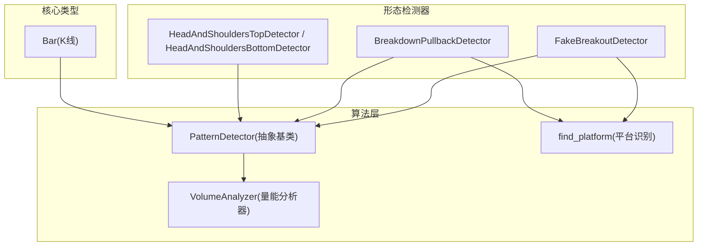
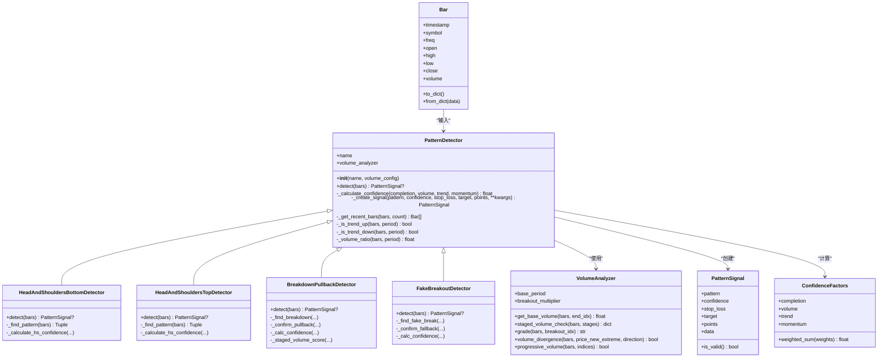
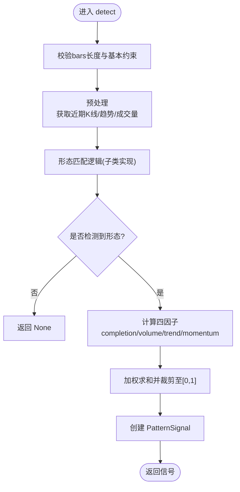
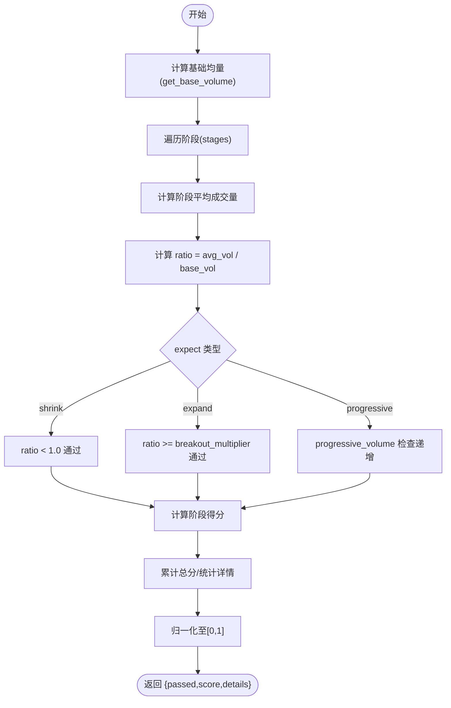
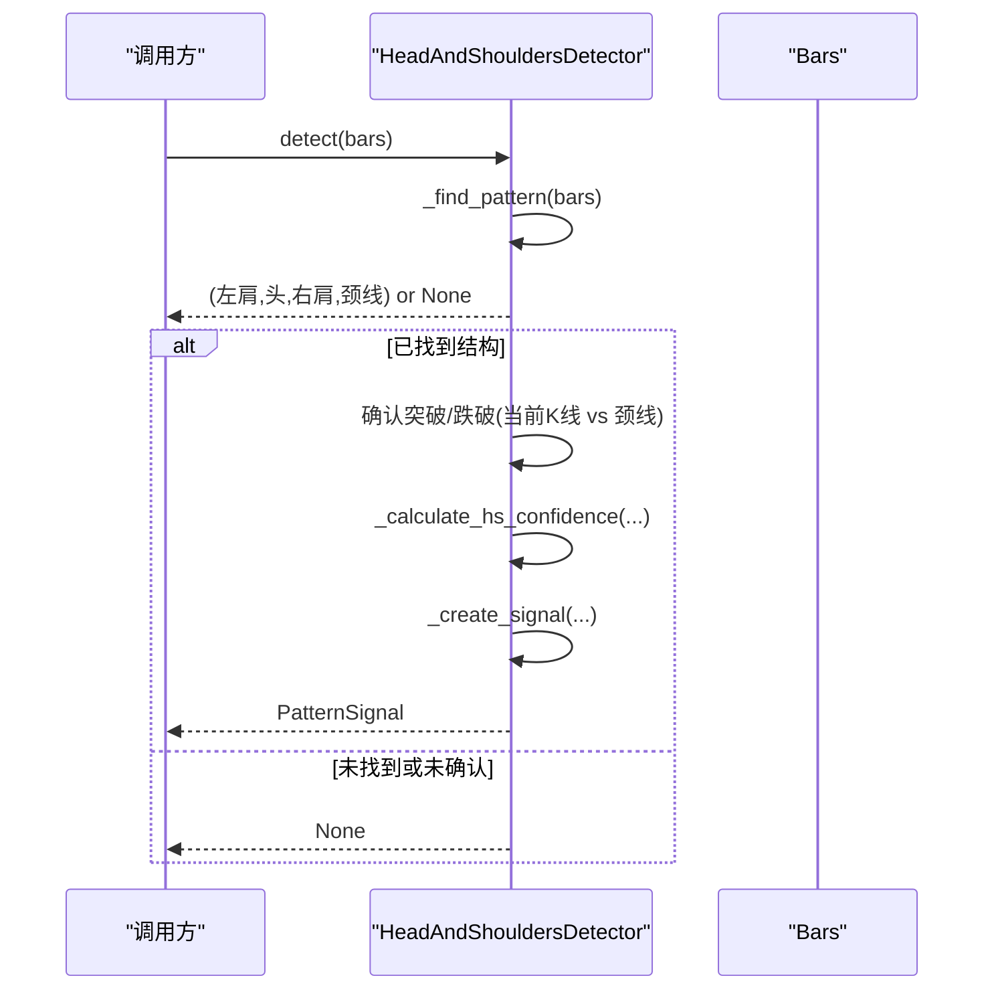
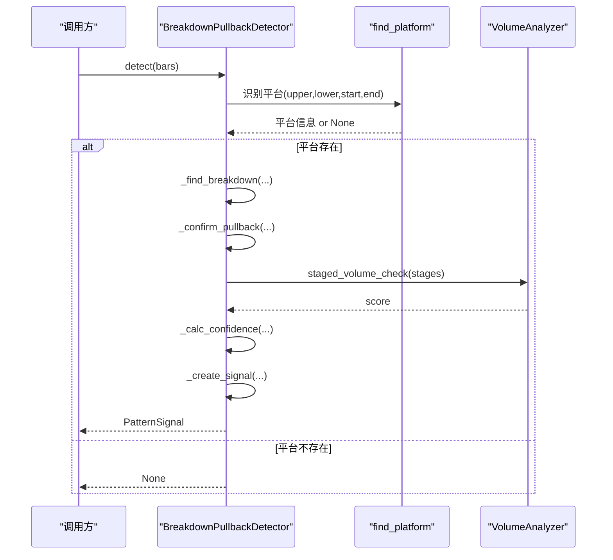
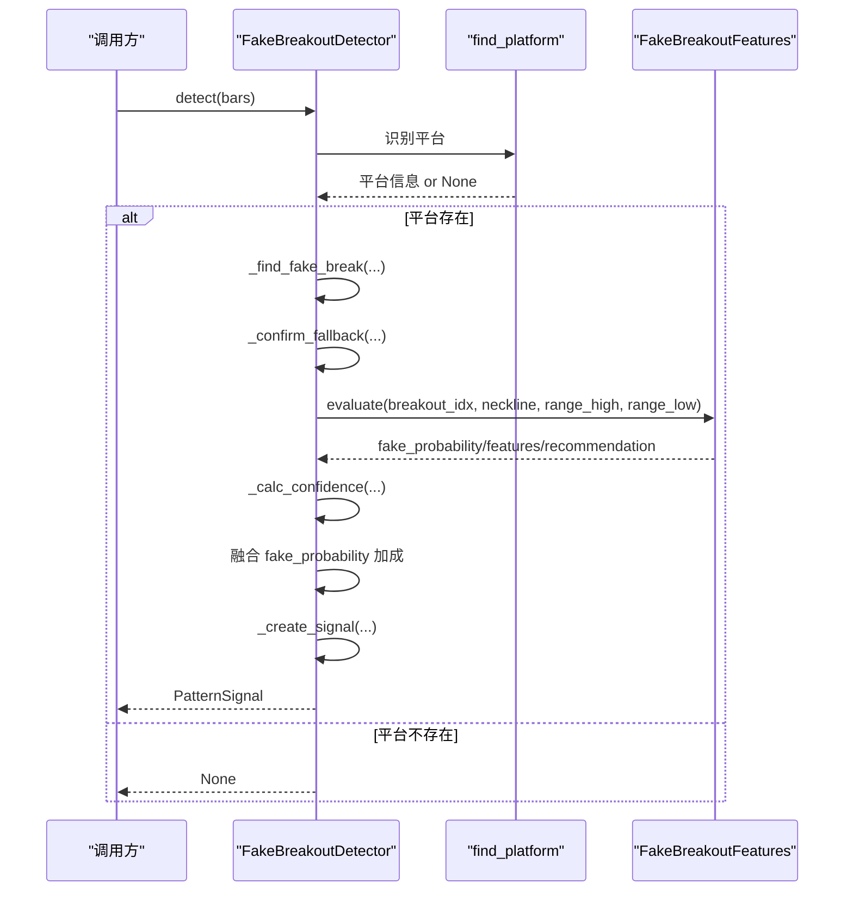
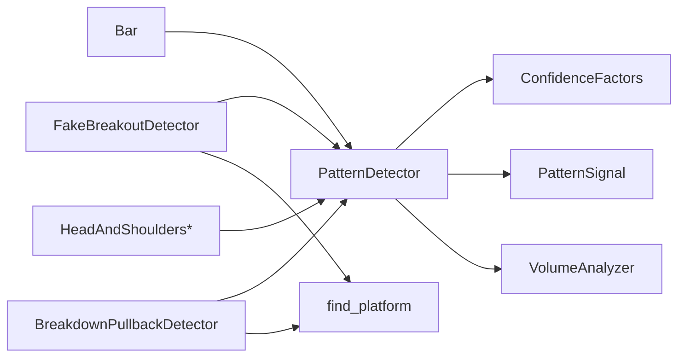

# 检测器基类设计

<cite>
**本文引用的文件**   
- [detector.py](file://src/caisen/strategy/algorithm/detector.py)
- [volume_analyzer.py](file://src/caisen/strategy/algorithm/caisen_components/volume_analyzer.py)
- [head_shoulders.py](file://src/caisen/strategy/algorithm/patterns/head_shoulders.py)
- [breakdown_pullback.py](file://src/caisen/strategy/algorithm/patterns/breakdown_pullback.py)
- [fake_breakout.py](file://src/caisen/strategy/algorithm/patterns/fake_breakout.py)
- [_platform_utils.py](file://src/caisen/strategy/algorithm/patterns/_platform_utils.py)
- [bar.py](file://src/caisen/core/bar.py)
- [test_breakdown_pullback.py](file://tests/test_breakdown_pullback.py)
- [test_fake_breakout.py](file://tests/test_fake_breakout.py)
</cite>

## 目录
1. [简介](#简介)
2. [项目结构](#项目结构)
3. [核心组件](#核心组件)
4. [架构总览](#架构总览)
5. [详细组件分析](#详细组件分析)
6. [依赖关系分析](#依赖关系分析)
7. [性能考量](#性能考量)
8. [故障排查指南](#故障排查指南)
9. [结论](#结论)
10. [附录：开发自定义检测器的完整流程](#附录开发自定义检测器的完整流程)

## 简介
本技术文档围绕形态检测器抽象基类 PatternDetector 的设计模式与架构原理展开，系统阐述其纯函数接口、生命周期管理、参数验证机制、结果数据结构、置信度计算模型以及数据预处理方法。同时，结合多个具体形态检测器实现（头肩顶/底、破底翻、假突破），给出从继承基类到完整实现的开发路径与最佳实践，帮助读者快速构建可测试、可扩展的自定义形态检测器。

## 项目结构
本项目采用“算法层 + 策略层”的分层组织方式，形态检测相关代码集中在 strategy.algorithm 子包下：
- 抽象基类与通用工具位于 detector.py
- 量能分析器位于 caisen_components/volume_analyzer.py
- 具体形态检测器位于 patterns 子目录
- K线数据类型定义在 core.bar
- 单元测试覆盖关键检测器行为

图表来源
- [detector.py:80-244](file://src/caisen/strategy/algorithm/detector.py#L80-L244)
- [volume_analyzer.py:15-287](file://src/caisen/strategy/algorithm/caisen_components/volume_analyzer.py#L15-L287)
- [_platform_utils.py:12-74](file://src/caisen/strategy/algorithm/patterns/_platform_utils.py#L12-L74)
- [head_shoulders.py:11-323](file://src/caisen/strategy/algorithm/patterns/head_shoulders.py#L11-L323)
- [breakdown_pullback.py:17-259](file://src/caisen/strategy/algorithm/patterns/breakdown_pullback.py#L17-L259)
- [fake_breakout.py:299-511](file://src/caisen/strategy/algorithm/patterns/fake_breakout.py#L299-L511)
- [bar.py:8-38](file://src/caisen/core/bar.py#L8-L38)

章节来源
- [detector.py:80-244](file://src/caisen/strategy/algorithm/detector.py#L80-L244)
- [volume_analyzer.py:15-287](file://src/caisen/strategy/algorithm/caisen_components/volume_analyzer.py#L15-L287)
- [_platform_utils.py:12-74](file://src/caisen/strategy/algorithm/patterns/_platform_utils.py#L12-L74)
- [head_shoulders.py:11-323](file://src/caisen/strategy/algorithm/patterns/head_shoulders.py#L11-L323)
- [breakdown_pullback.py:17-259](file://src/caisen/strategy/algorithm/patterns/breakdown_pullback.py#L17-L259)
- [fake_breakout.py:299-511](file://src/caisen/strategy/algorithm/patterns/fake_breakout.py#L299-L511)
- [bar.py:8-38](file://src/caisen/core/bar.py#L8-L38)

## 核心组件
- 抽象基类 PatternDetector
  - 纯函数接口：detect(bars) 接收完整 K 线列表，返回信号或 None；无内部状态，便于并行与回测。
  - 初始化：支持 name 与 volume_config（传递给 VolumeAnalyzer）。
  - 公共辅助：_calculate_confidence、_create_signal、_get_recent_bars、_is_trend_up/down、_volume_ratio。
  - 抽象方法：detect 必须由子类实现。

- 结果数据结构
  - PatternSignal：包含 pattern、confidence、stop_loss、target、points、data；提供 is_valid 属性用于有效性判断。
  - ConfidenceFactors：四因子 completion、volume、trend、momentum，并提供 weighted_sum 加权求和。

- 量能分析器 VolumeAnalyzer
  - 分阶段量能评估：staged_volume_check 支持 shrink/expand/progressive 三种预期。
  - 基础均量计算：get_base_volume。
  - 等级评估：grade（weak/normal/strong）。
  - 背离检测：volume_divergence。
  - 递增检查：progressive_volume。

- 平台识别工具 find_platform
  - 滑动窗口扫描，寻找振幅小且长度足够的整理区间，返回上沿、下沿及起止索引。

- K线数据类型 Bar
  - 标准 OHLCV 字段，提供 to_dict/from_dict 序列化能力。

章节来源
- [detector.py:18-180](file://src/caisen/strategy/algorithm/detector.py#L18-L180)
- [detector.py:125-244](file://src/caisen/strategy/algorithm/detector.py#L125-L244)
- [volume_analyzer.py:15-287](file://src/caisen/strategy/algorithm/caisen_components/volume_analyzer.py#L15-L287)
- [_platform_utils.py:12-74](file://src/caisen/strategy/algorithm/patterns/_platform_utils.py#L12-L74)
- [bar.py:8-38](file://src/caisen/core/bar.py#L8-L38)

## 架构总览
PatternDetector 作为统一入口，屏蔽了量能分析与趋势判断等通用逻辑，具体形态检测器只需聚焦于形态识别与置信度因子构造。

图表来源
- [detector.py:80-244](file://src/caisen/strategy/algorithm/detector.py#L80-L244)
- [volume_analyzer.py:15-287](file://src/caisen/strategy/algorithm/caisen_components/volume_analyzer.py#L15-L287)
- [head_shoulders.py:11-323](file://src/caisen/strategy/algorithm/patterns/head_shoulders.py#L11-L323)
- [breakdown_pullback.py:17-259](file://src/caisen/strategy/algorithm/patterns/breakdown_pullback.py#L17-L259)
- [fake_breakout.py:299-511](file://src/caisen/strategy/algorithm/patterns/fake_breakout.py#L299-L511)
- [bar.py:8-38](file://src/caisen/core/bar.py#L8-L38)

## 详细组件分析

### 抽象基类 PatternDetector 设计要点
- 纯函数接口
  - detect 仅依赖输入 bars，不维护内部状态，保证可重复调用与并行执行。
- 初始化与配置
  - 通过 volume_config 注入 VolumeAnalyzer 的参数（如 base_period、breakout_multiplier）。
- 置信度计算模型
  - _calculate_confidence 将 completion、volume、trend、momentum 四因子按权重加权求和并裁剪至 [0,1]。
- 结果封装
  - _create_signal 统一生成 PatternSignal，包含止损、目标价、关键点与扩展数据。
- 数据预处理与特征提取
  - _get_recent_bars、_is_trend_up/down、_volume_ratio 提供常用预处理与指标。

图表来源
- [detector.py:112-180](file://src/caisen/strategy/algorithm/detector.py#L112-L180)
- [detector.py:125-244](file://src/caisen/strategy/algorithm/detector.py#L125-L244)

章节来源
- [detector.py:80-244](file://src/caisen/strategy/algorithm/detector.py#L80-L244)

### 量能分析器 VolumeAnalyzer
- 分阶段量能评估
  - staged_volume_check 接受 stages 列表，对每个阶段计算平均成交量与相对基础均量的比值，并按 expect 类型判定通过与否与得分。
- 基础均量
  - get_base_volume 以 end_idx 之前 base_period 根K线的平均成交量为基准。
- 等级评估与背离
  - grade 根据突破当根成交量与基础均量比值划分 weak/normal/strong。
  - volume_divergence 比较前后半段最大成交量，检测量价背离。
- 递增检查
  - progressive_volume 检查关键点成交量是否逐步增大（允许小幅波动）。

图表来源
- [volume_analyzer.py:34-126](file://src/caisen/strategy/algorithm/caisen_components/volume_analyzer.py#L34-L126)
- [volume_analyzer.py:197-224](file://src/caisen/strategy/algorithm/caisen_components/volume_analyzer.py#L197-L224)
- [volume_analyzer.py:225-287](file://src/caisen/strategy/algorithm/caisen_components/volume_analyzer.py#L225-L287)

章节来源
- [volume_analyzer.py:15-287](file://src/caisen/strategy/algorithm/caisen_components/volume_analyzer.py#L15-L287)

### 头肩顶/底检测器
- 形态识别
  - 在近期窗口内定位头部与左右肩，依据容差与高度范围筛选候选点，计算颈线。
- 确认条件
  - 头肩底：当前收盘价高于颈线；头肩顶：当前收盘价低于颈线。
- 置信度因子
  - completion：两肩对称性；volume：近期放量程度；trend：与趋势共振；momentum：突破/跌破力度。
- 风控参数
  - 止损基于头部的低/高点乘以系数；目标价基于振幅或最小盈利百分比。

图表来源
- [head_shoulders.py:43-170](file://src/caisen/strategy/algorithm/patterns/head_shoulders.py#L43-L170)
- [head_shoulders.py:199-322](file://src/caisen/strategy/algorithm/patterns/head_shoulders.py#L199-L322)
- [detector.py:151-180](file://src/caisen/strategy/algorithm/detector.py#L151-L180)

章节来源
- [head_shoulders.py:11-323](file://src/caisen/strategy/algorithm/patterns/head_shoulders.py#L11-L323)
- [detector.py:125-180](file://src/caisen/strategy/algorithm/detector.py#L125-L180)

### 破底翻检测器
- 平台识别
  - 使用 find_platform 在回看窗口内寻找整理平台（上沿/下沿与起止索引）。
- 事件序列
  - 破底：平台结束后出现 low 跌破下沿但跌幅不超过 tolerance。
  - 翻回：破底后若干根K线内 close 回到下沿之上。
- 买点分类
  - 第一买点：站回颈线；第二买点：突破平台上沿。
- 置信度与量能
  - completion：破底深度越浅越好，第二买点加分；volume：分阶段量能评分（拉回缩量、突破放量）；trend：前期下跌趋势共振；momentum：翻回力度。
  - 使用 VolumeAnalyzer.staged_volume_check 进行阶段量化。

图表来源
- [breakdown_pullback.py:47-128](file://src/caisen/strategy/algorithm/patterns/breakdown_pullback.py#L47-L128)
- [breakdown_pullback.py:177-259](file://src/caisen/strategy/algorithm/patterns/breakdown_pullback.py#L177-L259)
- [_platform_utils.py:12-74](file://src/caisen/strategy/algorithm/patterns/_platform_utils.py#L12-L74)
- [volume_analyzer.py:55-126](file://src/caisen/strategy/algorithm/caisen_components/volume_analyzer.py#L55-L126)

章节来源
- [breakdown_pullback.py:17-259](file://src/caisen/strategy/algorithm/patterns/breakdown_pullback.py#L17-L259)
- [_platform_utils.py:12-74](file://src/caisen/strategy/algorithm/patterns/_platform_utils.py#L12-L74)
- [volume_analyzer.py:55-126](file://src/caisen/strategy/algorithm/caisen_components/volume_analyzer.py#L55-L126)

### 假突破检测器
- 平台识别与事件序列
  - 使用 find_platform 识别平台；假突破：high 突破上沿但幅度不超过 tolerance；跌回：后续若干根K线内 close 回到上沿之下。
- 五大特征评估
  - FakeBreakoutFeatures 综合评估：量能不足、快速回返、回到区间、跳空缺口未填补、量价背离，输出 fake_probability 与建议。
- 置信度融合
  - 基础四因子置信度与 fake_probability 加权加成，提升整体可信度。

图表来源
- [fake_breakout.py:331-424](file://src/caisen/strategy/algorithm/patterns/fake_breakout.py#L331-L424)
- [fake_breakout.py:225-296](file://src/caisen/strategy/algorithm/patterns/fake_breakout.py#L225-L296)
- [_platform_utils.py:12-74](file://src/caisen/strategy/algorithm/patterns/_platform_utils.py#L12-L74)

章节来源
- [fake_breakout.py:299-511](file://src/caisen/strategy/algorithm/patterns/fake_breakout.py#L299-L511)
- [fake_breakout.py:18-296](file://src/caisen/strategy/algorithm/patterns/fake_breakout.py#L18-L296)
- [_platform_utils.py:12-74](file://src/caisen/strategy/algorithm/patterns/_platform_utils.py#L12-L74)

## 依赖关系分析
- 直接依赖
  - 所有具体检测器均依赖 PatternDetector 提供的通用方法与 VolumeAnalyzer。
  - 平台型检测器依赖 _platform_utils.find_platform。
- 间接依赖
  - 通过 Bar 类型完成数据输入与序列化。
- 耦合与内聚
  - 基类高内聚（通用逻辑集中），子类低耦合（专注形态识别），符合单一职责原则。
- 外部集成点
  - VolumeAnalyzer 与 find_platform 作为独立模块，便于替换与优化。

图表来源
- [detector.py:80-244](file://src/caisen/strategy/algorithm/detector.py#L80-L244)
- [volume_analyzer.py:15-287](file://src/caisen/strategy/algorithm/caisen_components/volume_analyzer.py#L15-L287)
- [_platform_utils.py:12-74](file://src/caisen/strategy/algorithm/patterns/_platform_utils.py#L12-L74)
- [head_shoulders.py:11-323](file://src/caisen/strategy/algorithm/patterns/head_shoulders.py#L11-L323)
- [breakdown_pullback.py:17-259](file://src/caisen/strategy/algorithm/patterns/breakdown_pullback.py#L17-L259)
- [fake_breakout.py:299-511](file://src/caisen/strategy/algorithm/patterns/fake_breakout.py#L299-L511)
- [bar.py:8-38](file://src/caisen/core/bar.py#L8-L38)

章节来源
- [detector.py:80-244](file://src/caisen/strategy/algorithm/detector.py#L80-L244)
- [volume_analyzer.py:15-287](file://src/caisen/strategy/algorithm/caisen_components/volume_analyzer.py#L15-L287)
- [_platform_utils.py:12-74](file://src/caisen/strategy/algorithm/patterns/_platform_utils.py#L12-L74)
- [head_shoulders.py:11-323](file://src/caisen/strategy/algorithm/patterns/head_shoulders.py#L11-L323)
- [breakdown_pullback.py:17-259](file://src/caisen/strategy/algorithm/patterns/breakdown_pullback.py#L17-L259)
- [fake_breakout.py:299-511](file://src/caisen/strategy/algorithm/patterns/fake_breakout.py#L299-L511)
- [bar.py:8-38](file://src/caisen/core/bar.py#L8-L38)

## 性能考量
- 时间复杂度
  - 平台识别 find_platform 使用双层循环扫描，最坏 O(n^2)，可通过限制窗口与提前终止优化。
  - 量能分阶段评估 staged_volume_check 线性遍历阶段集合，O(k)。
  - 各检测器 detect 主要受限于窗口大小与局部搜索，通常 O(n) 或 O(w)（w 为窗口）。
- 空间复杂度
  - 主要为切片与中间变量，建议复用缓冲区避免频繁分配。
- 优化建议
  - 对 find_platform 引入双指针或单调队列优化。
  - 对 VolumeAnalyzer 预计算滚动均值与极值，减少重复计算。
  - 在批量回测中缓存 Bars 的派生指标（如均线、动量），降低重复开销。

## 故障排查指南
- 常见错误与定位
  - 输入 bars 过短：多数检测器会直接返回 None，需确保满足 min_bars 要求。
  - 平台识别失败：调整 lookback_period、max_amplitude、min_platform_bars 参数。
  - 量能异常：检查历史成交量是否为 0，必要时调整 base_period 与 breakout_multiplier。
  - 置信度边界：确认四因子均在 [0,1]，避免极端值导致加权结果越界。
- 测试用例参考
  - 破底翻：测试不足K线、无平台、深跌破、第一/二买点、置信度范围、止损与目标价计算。
  - 假突破：测试不足K线、无平台、真突破过滤、浅刺回落、跌破下沿强度、方向为 short。

章节来源
- [test_breakdown_pullback.py:33-131](file://tests/test_breakdown_pullback.py#L33-L131)
- [test_fake_breakout.py:33-114](file://tests/test_fake_breakout.py#L33-L114)

## 结论
PatternDetector 通过纯函数接口与统一的置信度模型，为形态检测提供了稳定、可测试、可扩展的基础设施。配合 VolumeAnalyzer 与平台识别工具，具体形态检测器能够专注于形态识别与因子构造，形成清晰的分层与职责边界。遵循本文的开发流程与调优建议，可高效构建高质量的自定义形态检测器。

## 附录：开发自定义检测器的完整流程
- 步骤概览
  1. 继承 PatternDetector，实现 detect(bars) 方法。
  2. 在 __init__ 中设置 name 与可选 volume_config。
  3. 在 detect 中完成数据预处理（使用基类辅助方法）、形态匹配、置信度因子计算与信号创建。
  4. 如需平台识别，组合使用 find_platform。
  5. 如需分阶段量能评估，使用 VolumeAnalyzer.staged_volume_check。
  6. 编写单元测试，覆盖边界条件与典型场景。

- 必需实现的方法
  - detect(bars): 返回 PatternSignal 或 None。

- 可选的优化方法
  - 重写 _calculate_confidence 以定制权重或非线性映射。
  - 新增私有方法封装复杂形态匹配逻辑，提高可读性与可测试性。
  - 使用 VolumeAnalyzer.grade 或 volume_divergence 增强量能维度。

- 性能调优技巧
  - 限制 bars 窗口大小，避免全量扫描。
  - 缓存常用指标（如均线、高低点窗口极值）。
  - 对 find_platform 与 staged_volume_check 进行参数调优，平衡灵敏度与稳定性。

- 示例路径（不含代码内容）
  - 基类与信号结构：[detector.py:18-180](file://src/caisen/strategy/algorithm/detector.py#L18-L180)
  - 头肩底实现参考：[head_shoulders.py:11-170](file://src/caisen/strategy/algorithm/patterns/head_shoulders.py#L11-L170)
  - 破底翻实现参考：[breakdown_pullback.py:17-128](file://src/caisen/strategy/algorithm/patterns/breakdown_pullback.py#L17-L128)
  - 假突破实现参考：[fake_breakout.py:299-424](file://src/caisen/strategy/algorithm/patterns/fake_breakout.py#L299-L424)
  - 平台识别工具：[_platform_utils.py:12-74](file://src/caisen/strategy/algorithm/patterns/_platform_utils.py#L12-L74)
  - 量能分析器：[volume_analyzer.py:15-126](file://src/caisen/strategy/algorithm/caisen_components/volume_analyzer.py#L15-L126)
  - K线数据类型：[bar.py:8-38](file://src/caisen/core/bar.py#L8-L38)