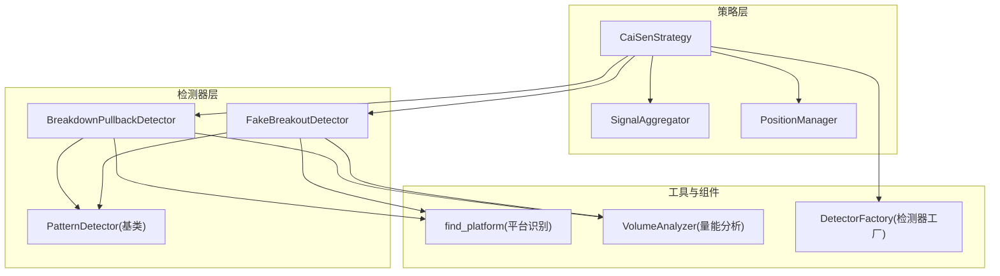
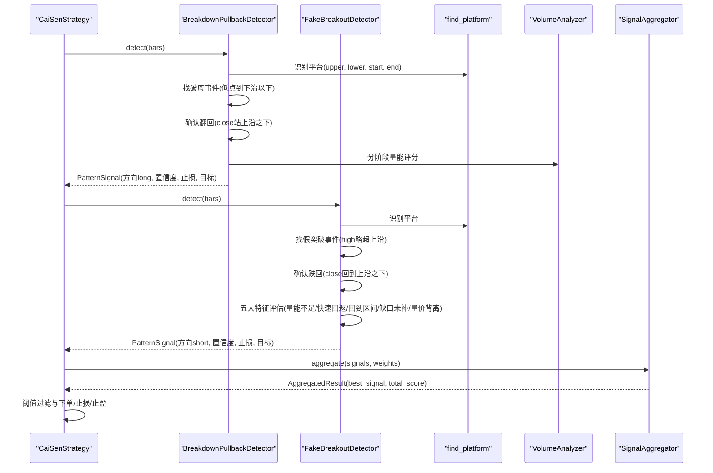
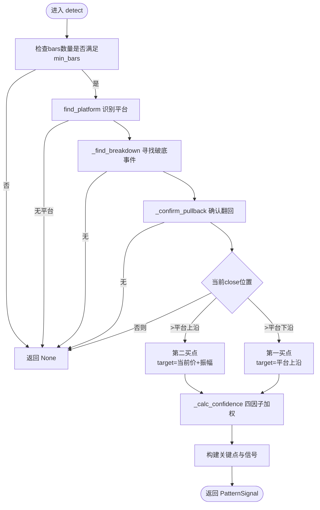
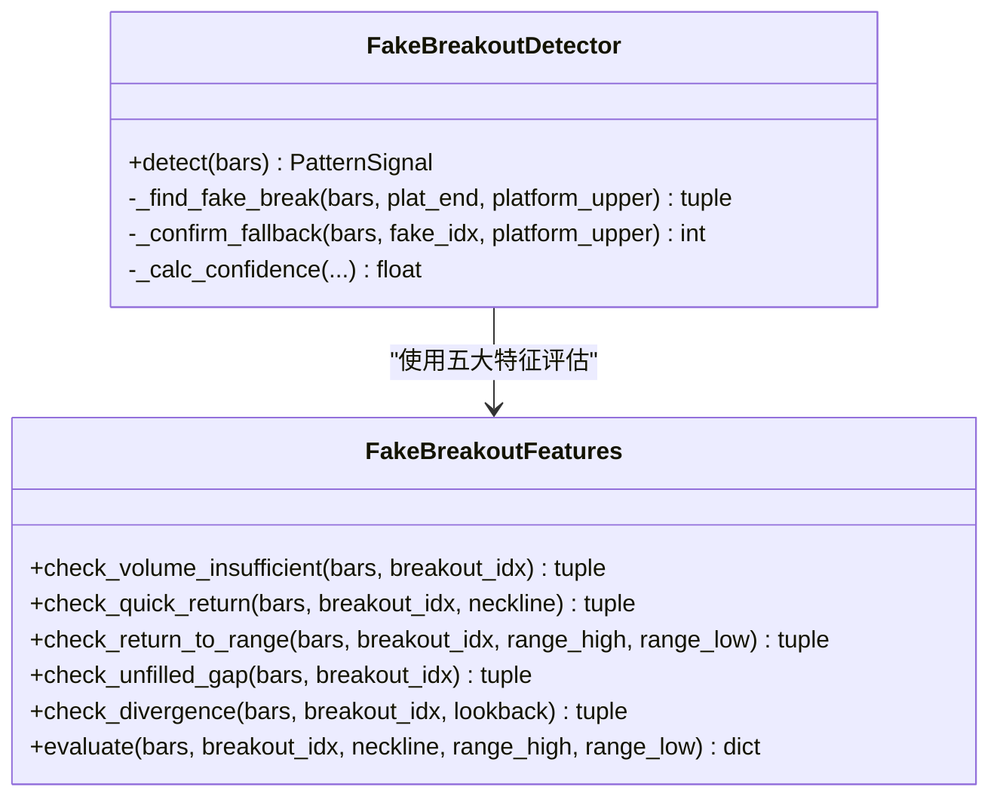
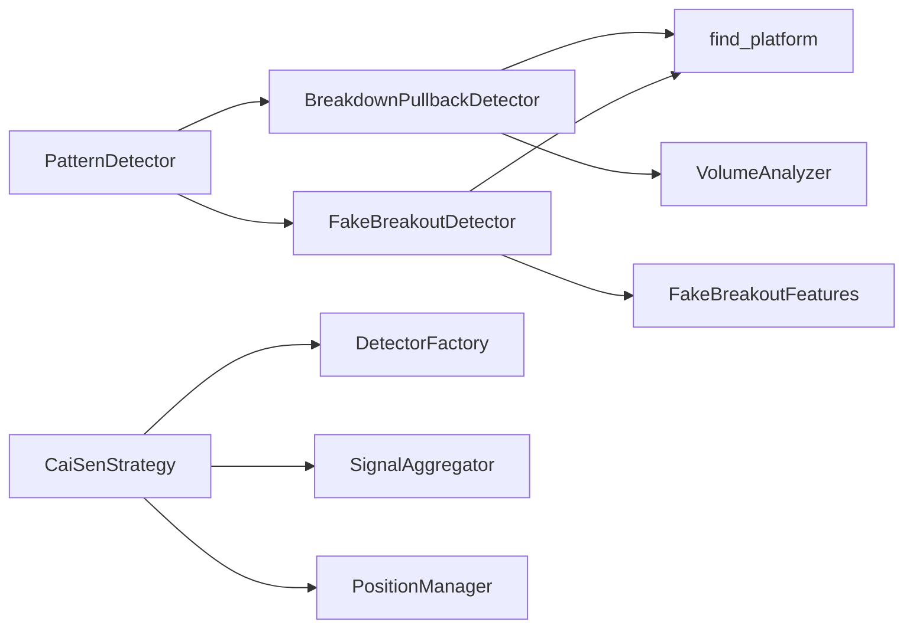

# 突破形态检测器

<cite>
**本文引用的文件列表**
- [breakdown_pullback.py](file://src/caisen/strategy/algorithm/patterns/breakdown_pullback.py)
- [fake_breakout.py](file://src/caisen/strategy/algorithm/patterns/fake_breakout.py)
- [detector.py](file://src/caisen/strategy/algorithm/detector.py)
- [_platform_utils.py](file://src/caisen/strategy/algorithm/patterns/_platform_utils.py)
- [volume_analyzer.py](file://src/caisen/strategy/algorithm/caisen_components/volume_analyzer.py)
- [caisen.py](file://src/caisen/strategy/algorithm/cai_sen.py)
- [factory.py](file://src/caisen/strategy/algorithm/caisen_components/factory.py)
- [aggregator.py](file://src/caisen/strategy/algorithm/caisen_components/aggregator.py)
- [cai_sen_v2.yaml](file://configs/strategies/cai_sen_v2.yaml)
- [test_breakdown_pullback.py](file://tests/test_breakdown_pullback.py)
- [test_fake_breakout.py](file://tests/test_fake_breakout.py)
</cite>

## 目录
1. [引言](#引言)
2. [项目结构](#项目结构)
3. [核心组件](#核心组件)
4. [架构总览](#架构总览)
5. [详细组件分析](#详细组件分析)
6. [依赖关系分析](#依赖关系分析)
7. [性能与复杂度](#性能与复杂度)
8. [实战策略与风控](#实战策略与风控)
9. [故障排查指南](#故障排查指南)
10. [结论](#结论)

## 引言
本技术文档围绕“突破形态检测器”展开，聚焦两类关键形态：
- 破底翻（Breakdown Pullback）：价格跌破整理平台下沿后快速站回，形成底部反转信号。
- 假突破（Fake Breakout）：价格短暂突破平台上沿后迅速跌回，形成顶部陷阱信号。

文档将深入解释：
- 关键价位突破确认、回踩深度测量与二次入场时机判断
- 假突破五大特征评估：量能不足、快速回返颈线、回到形态内部、跳空缺口未补、量价背离
- 置信度计算与成交量分阶段验证
- 统计特征与绩效指标的计算思路
- 多时间框架确认的扩展方法（大周期趋势过滤与小周期精确入场）
- 实战交易策略与风险管理建议

## 项目结构
本项目采用“策略编排 + 纯函数检测器 + 组件化能力”的分层设计：
- 策略编排：CaiSenStrategy 负责流程控制、信号聚合与仓位管理
- 检测器基类：PatternDetector 提供统一的 detect(bars) 接口与通用工具（趋势、成交量、置信度加权）
- 形态检测器：BreakdownPullbackDetector、FakeBreakoutDetector 等实现具体形态识别
- 平台识别工具：find_platform 用于识别整理区间
- 量能分析器：VolumeAnalyzer 支持分阶段量能评估与背离检测
- 工厂与聚合：DetectorFactory 创建检测器，SignalAggregator 聚合评分

图表来源
- [caisen.py:178-221](file://src/caisen/strategy/algorithm/cai_sen.py#L178-L221)
- [detector.py:80-180](file://src/caisen/strategy/algorithm/detector.py#L80-L180)
- [breakdown_pullback.py:17-128](file://src/caisen/strategy/algorithm/patterns/breakdown_pullback.py#L17-L128)
- [fake_breakout.py:299-424](file://src/caisen/strategy/algorithm/patterns/fake_breakout.py#L299-L424)
- [_platform_utils.py:12-74](file://src/caisen/strategy/algorithm/patterns/_platform_utils.py#L12-L74)
- [volume_analyzer.py:15-125](file://src/caisen/strategy/algorithm/caisen_components/volume_analyzer.py#L15-L125)
- [factory.py:54-111](file://src/caisen/strategy/algorithm/caisen_components/factory.py#L54-L111)

章节来源
- [caisen.py:1-245](file://src/caisen/strategy/algorithm/cai_sen.py#L1-L245)
- [detector.py:1-244](file://src/caisen/strategy/algorithm/detector.py#L1-L244)
- [breakdown_pullback.py:1-259](file://src/caisen/strategy/algorithm/patterns/breakdown_pullback.py#L1-L259)
- [fake_breakout.py:1-511](file://src/caisen/strategy/algorithm/patterns/fake_breakout.py#L1-L511)
- [_platform_utils.py:1-74](file://src/caisen/strategy/algorithm/patterns/_platform_utils.py#L1-L74)
- [volume_analyzer.py:1-287](file://src/caisen/strategy/algorithm/caisen_components/volume_analyzer.py#L1-L287)
- [factory.py:1-237](file://src/caisen/strategy/algorithm/caisen_components/factory.py#L1-L237)
- [aggregator.py:1-177](file://src/caisen/strategy/algorithm/caisen_components/aggregator.py#L1-L177)
- [cai_sen_v2.yaml:1-145](file://configs/strategies/cai_sen_v2.yaml#L1-L145)

## 核心组件
- PatternDetector（基类）
  - 提供统一 detect(bars) 接口，返回 PatternSignal
  - 内置置信度加权计算、趋势判断、成交量放大倍数计算
- BreakdownPullbackDetector（破底翻）
  - 平台识别 → 破底事件 → 翻回确认 → 买点类型判定 → 置信度与目标止损计算
- FakeBreakoutDetector（假突破）
  - 平台识别 → 假突破事件 → 跌回确认 → 五大特征评估 → 置信度加成与目标止损计算
- VolumeAnalyzer（量能分析）
  - 分阶段量能检查（缩量/放量/递增）、量级分级、量价背离检测
- find_platform（平台识别）
  - 滑动窗口寻找振幅最小且长度足够的整理区间
- CaiSenStrategy（策略编排）
  - 每根K线调用检测器 → 聚合评分 → 决策入场/止损/止盈
- DetectorFactory / SignalAggregator
  - 根据配置创建检测器；对信号进行权重聚合并选择最佳信号

章节来源
- [detector.py:80-180](file://src/caisen/strategy/algorithm/detector.py#L80-L180)
- [breakdown_pullback.py:17-128](file://src/caisen/strategy/algorithm/patterns/breakdown_pullback.py#L17-L128)
- [fake_breakout.py:299-424](file://src/caisen/strategy/algorithm/patterns/fake_breakout.py#L299-L424)
- [volume_analyzer.py:15-125](file://src/caisen/strategy/algorithm/caisen_components/volume_analyzer.py#L15-L125)
- [_platform_utils.py:12-74](file://src/caisen/strategy/algorithm/patterns/_platform_utils.py#L12-L74)
- [caisen.py:178-221](file://src/caisen/strategy/algorithm/cai_sen.py#L178-L221)
- [factory.py:54-111](file://src/caisen/strategy/algorithm/caisen_components/factory.py#L54-L111)
- [aggregator.py:42-110](file://src/caisen/strategy/algorithm/caisen_components/aggregator.py#L42-L110)

## 架构总览
下图展示从策略到检测器的完整调用链与数据流：

图表来源
- [caisen.py:178-221](file://src/caisen/strategy/algorithm/cai_sen.py#L178-L221)
- [breakdown_pullback.py:47-128](file://src/caisen/strategy/algorithm/patterns/breakdown_pullback.py#L47-L128)
- [fake_breakout.py:331-424](file://src/caisen/strategy/algorithm/patterns/fake_breakout.py#L331-L424)
- [_platform_utils.py:12-74](file://src/caisen/strategy/algorithm/patterns/_platform_utils.py#L12-L74)
- [volume_analyzer.py:55-125](file://src/caisen/strategy/algorithm/caisen_components/volume_analyzer.py#L55-L125)
- [aggregator.py:59-110](file://src/caisen/strategy/algorithm/caisen_components/aggregator.py#L59-L110)

## 详细组件分析

### 破底翻检测器（BreakdownPullbackDetector）
- 识别逻辑
  - 平台识别：在回看窗口内寻找振幅较小且长度足够的整理区间
  - 破底事件：low 跌破 platform_lower，但跌幅不超过 tolerance（避免真破位）
  - 翻回确认：在限定K线数内 close 回到 platform_lower 之上
  - 买点类型：
    - 第一买点：close > platform_lower（站回颈线）
    - 第二买点：close > platform_upper（突破平台上沿），置信度更高
  - 止损与目标：
    - 止损 = breakdown_low × stop_loss_factor
    - 目标 = 当前价 + (platform_upper - platform_lower)（第二买点）或 target = platform_upper（第一买点）
- 置信度四因子
  - completion：破底越浅、翻回越快完成度越高；第二买点额外加分
  - volume：分阶段量能评分（拉回阶段应缩量，突破阶段应放量）
  - trend：前期下跌趋势共振更强
  - momentum：翻回力度（相对平台下沿的涨幅）
- 分阶段量能评分
  - 拉回阶段：expect=shrink（缩量）
  - 突破阶段：expect=expand（放量≥1.5倍均量）
  - 通过 VolumeAnalyzer.staged_volume_check 得到 score

图表来源
- [breakdown_pullback.py:47-128](file://src/caisen/strategy/algorithm/patterns/breakdown_pullback.py#L47-L128)
- [breakdown_pullback.py:130-176](file://src/caisen/strategy/algorithm/patterns/breakdown_pullback.py#L130-L176)
- [breakdown_pullback.py:177-259](file://src/caisen/strategy/algorithm/patterns/breakdown_pullback.py#L177-L259)
- [_platform_utils.py:12-74](file://src/caisen/strategy/algorithm/patterns/_platform_utils.py#L12-L74)
- [volume_analyzer.py:55-125](file://src/caisen/strategy/algorithm/caisen_components/volume_analyzer.py#L55-L125)

章节来源
- [breakdown_pullback.py:17-128](file://src/caisen/strategy/algorithm/patterns/breakdown_pullback.py#L17-L128)
- [breakdown_pullback.py:130-176](file://src/caisen/strategy/algorithm/patterns/breakdown_pullback.py#L130-L176)
- [breakdown_pullback.py:177-259](file://src/caisen/strategy/algorithm/patterns/breakdown_pullback.py#L177-L259)
- [_platform_utils.py:12-74](file://src/caisen/strategy/algorithm/patterns/_platform_utils.py#L12-L74)
- [volume_analyzer.py:55-125](file://src/caisen/strategy/algorithm/caisen_components/volume_analyzer.py#L55-L125)
- [test_breakdown_pullback.py:33-131](file://tests/test_breakdown_pullback.py#L33-L131)

### 假突破检测器（FakeBreakoutDetector）
- 识别逻辑
  - 平台识别：同破底翻
  - 假突破事件：high 略超 platform_upper，但突破幅度不超过 fake_tolerance（太深视为真突破）
  - 跌回确认：在限定K线数内 close 回到 platform_upper 之下
  - 信号强度：
    - 跌破平台下沿：signal_strength=2（更强看空）
    - 仅跌回平台内：signal_strength=1
  - 止损与目标：
    - 止损 = fake_high × stop_loss_factor
    - 目标 = 当前价 - (platform_upper - platform_lower)（跌破下沿）或 target = platform_lower（跌回平台内）
- 五大特征评估（FakeBreakoutFeatures）
  - 量能不足：突破量 < threshold×均量 → 触发概率高
  - 快速回返颈线：突破后return_bars内回到颈线附近
  - 回到形态内部：close重新进入[range_low, range_high]
  - 跳空缺口无法弥补：向上跳空但未有效填补
  - 量价背离：价格接近前高但成交量未创新高
  - 综合评估输出 fake_probability 与 recommendation（genuine/suspicious/likely_fake）
- 置信度加成
  - 基础四因子（completion/volume/trend/momentum）
  - 叠加 fake_probability 作为加成项，提升最终置信度

图表来源
- [fake_breakout.py:18-296](file://src/caisen/strategy/algorithm/patterns/fake_breakout.py#L18-L296)
- [fake_breakout.py:299-511](file://src/caisen/strategy/algorithm/patterns/fake_breakout.py#L299-L511)

章节来源
- [fake_breakout.py:299-424](file://src/caisen/strategy/algorithm/patterns/fake_breakout.py#L299-L424)
- [fake_breakout.py:426-511](file://src/caisen/strategy/algorithm/patterns/fake_breakout.py#L426-L511)
- [fake_breakout.py:18-296](file://src/caisen/strategy/algorithm/patterns/fake_breakout.py#L18-L296)
- [test_fake_breakout.py:33-114](file://tests/test_fake_breakout.py#L33-L114)

### 平台识别工具（find_platform）
- 算法要点
  - 在 lookback_period 窗口内滑动扫描
  - 计算区间振幅（(high-low)/均价），要求 ≤ max_amplitude
  - 区间长度 ≥ min_platform_bars
  - 评分 = length × (1 - amplitude/max_amplitude)，取最高分区间
- 输出
  - (upper, lower, start_idx, end_idx) 绝对索引

章节来源
- [_platform_utils.py:12-74](file://src/caisen/strategy/algorithm/patterns/_platform_utils.py#L12-L74)

### 量能分析器（VolumeAnalyzer）
- 分阶段量能检查
  - expect='shrink'：阶段均量低于基础均量
  - expect='expand'：阶段均量达到 breakout_multiplier 倍基础均量
  - expect='progressive'：阶段内成交量逐步增大
- 量级分级
  - weak/normal/strong 基于突破量与基础均量的比值
- 量价背离
  - 前后半段比较最大成交量，价格新高但量能未跟上则判定背离

章节来源
- [volume_analyzer.py:55-125](file://src/caisen/strategy/algorithm/caisen_components/volume_analyzer.py#L55-L125)
- [volume_analyzer.py:127-196](file://src/caisen/strategy/algorithm/caisen_components/volume_analyzer.py#L127-L196)

### 策略编排（CaiSenStrategy）
- 每根K线流程
  - 更新 bars
  - 并行调用各检测器 detect(bars)
  - 聚合评分（SignalAggregator）
  - 若 best_signal.confidence ≥ threshold 且无持仓 → 开仓（Order含stop_loss/target）
  - 止损/止盈检查并平仓
- 可视化标注
  - 将信号的关键点与标签写入 Annotation，供前端渲染

章节来源
- [caisen.py:178-221](file://src/caisen/strategy/algorithm/cai_sen.py#L178-L221)
- [caisen.py:223-236](file://src/caisen/strategy/algorithm/cai_sen.py#L223-L236)

## 依赖关系分析
- 检测器依赖
  - BreakdownPullbackDetector、FakeBreakoutDetector 均继承自 PatternDetector
  - 两者共享 find_platform 平台识别逻辑
  - BreakdownPullbackDetector 使用 VolumeAnalyzer 进行分阶段量能评分
  - FakeBreakoutDetector 使用 FakeBreakoutFeatures 进行五大特征评估
- 策略依赖
  - CaiSenStrategy 依赖 DetectorFactory 创建检测器实例
  - 使用 SignalAggregator 聚合信号并选择最佳信号
  - 使用 PositionManager 管理持仓与风控（止损/止盈）

图表来源
- [detector.py:80-180](file://src/caisen/strategy/algorithm/detector.py#L80-L180)
- [breakdown_pullback.py:17-128](file://src/caisen/strategy/algorithm/patterns/breakdown_pullback.py#L17-L128)
- [fake_breakout.py:299-424](file://src/caisen/strategy/algorithm/patterns/fake_breakout.py#L299-L424)
- [_platform_utils.py:12-74](file://src/caisen/strategy/algorithm/patterns/_platform_utils.py#L12-L74)
- [volume_analyzer.py:15-125](file://src/caisen/strategy/algorithm/caisen_components/volume_analyzer.py#L15-L125)
- [caisen.py:178-221](file://src/caisen/strategy/algorithm/cai_sen.py#L178-L221)
- [factory.py:54-111](file://src/caisen/strategy/algorithm/caisen_components/factory.py#L54-L111)
- [aggregator.py:42-110](file://src/caisen/strategy/algorithm/caisen_components/aggregator.py#L42-L110)

章节来源
- [detector.py:80-180](file://src/caisen/strategy/algorithm/detector.py#L80-L180)
- [breakdown_pullback.py:17-128](file://src/caisen/strategy/algorithm/patterns/breakdown_pullback.py#L17-L128)
- [fake_breakout.py:299-424](file://src/caisen/strategy/algorithm/patterns/fake_breakout.py#L299-L424)
- [caisen.py:178-221](file://src/caisen/strategy/algorithm/cai_sen.py#L178-L221)
- [factory.py:54-111](file://src/caisen/strategy/algorithm/caisen_components/factory.py#L54-L111)
- [aggregator.py:42-110](file://src/caisen/strategy/algorithm/caisen_components/aggregator.py#L42-L110)

## 性能与复杂度
- 平台识别 find_platform
  - 时间复杂度 O(W^2)，W 为窗口长度（lookback_period），因双层循环扫描所有子区间
  - 空间复杂度 O(1)（除输入外）
- 检测器 detect
  - 线性扫描平台结束后到当前K线的破底/假突破事件，O(N)
  - 翻回/跌回确认在有限窗口内扫描，常数时间
  - 置信度计算涉及少量历史统计（趋势、成交量），总体 O(N)
- 量能分析
  - staged_volume_check 遍历阶段集合，每个阶段计算平均量与比值，O(S×L)（S为阶段数，L为阶段长度）
  - 量级分级与背离检测均为线性或常数时间
- 策略编排
  - 每根K线调用多个检测器，整体 O(M×N)（M为检测器数量）
  - 聚合评分 O(M)

优化建议
- 平台识别可引入更高效的滑动窗口维护（如单调队列）降低至 O(W)
- 对频繁调用的检测器可缓存最近平台的 upper/lower 与起止索引，减少重复计算
- 批量处理 bars 时利用向量化操作（pandas/numpy）加速统计

章节来源
- [_platform_utils.py:12-74](file://src/caisen/strategy/algorithm/patterns/_platform_utils.py#L12-L74)
- [breakdown_pullback.py:130-176](file://src/caisen/strategy/algorithm/patterns/breakdown_pullback.py#L130-L176)
- [fake_breakout.py:426-470](file://src/caisen/strategy/algorithm/patterns/fake_breakout.py#L426-L470)
- [volume_analyzer.py:55-125](file://src/caisen/strategy/algorithm/caisen_components/volume_analyzer.py#L55-L125)

## 实战策略与风控
- 入场规则
  - 破底翻：
    - 第一买点：翻回确认后 close > platform_lower
    - 第二买点：进一步 close > platform_upper（置信度更高）
  - 假突破：
    - 跌回确认后 close < platform_upper
    - 跌破下沿时信号强度更高（signal_strength=2）
- 止损与目标
  - 破底翻：止损 = breakdown_low × stop_loss_factor；目标按买点类型设定
  - 假突破：止损 = fake_high × stop_loss_factor；目标按信号强度设定
- 置信度阈值
  - 策略层设置 threshold（默认 0.6），仅当 best_signal.confidence ≥ threshold 才开仓
- 成交量确认
  - 破底翻：拉回阶段缩量、突破阶段放量（≥1.5倍均量）
  - 假突破：结合五大特征，尤其是量能不足与快速回返
- 风险收益比
  - 以目标价与止损价的距离衡量潜在盈亏比
  - 结合 confidence 与 signal_strength 筛选高质量信号
- 多时间框架确认（扩展建议）
  - 大周期趋势过滤：使用更长周期（如日线）的趋势方向（例如均线或高低点序列）过滤小周期信号
  - 小周期精确入场：在小时或分钟级别等待翻回/跌回确认，提高入场精度
  - 注意：当前代码库未直接实现多时间框架逻辑，可在 CaiSenStrategy 中扩展跨周期 bars 的传入与过滤

章节来源
- [breakdown_pullback.py:87-128](file://src/caisen/strategy/algorithm/patterns/breakdown_pullback.py#L87-L128)
- [fake_breakout.py:369-424](file://src/caisen/strategy/algorithm/patterns/fake_breakout.py#L369-L424)
- [caisen.py:198-221](file://src/caisen/strategy/algorithm/cai_sen.py#L198-L221)
- [cai_sen_v2.yaml:134-145](file://configs/strategies/cai_sen_v2.yaml#L134-L145)

## 故障排查指南
- 常见异常与边界条件
  - 数据不足：bars 数量小于 min_bars 时直接返回 None
  - 无平台：find_platform 返回 None 导致检测失败
  - 突破过深：破底/假突破幅度超过 tolerance 被视为真突破/真破位，不产生信号
  - 翻回/跌回未确认：在限定K线数内未出现确认条件
- 调试建议
  - 打印平台上下沿与起止索引，确认平台识别是否正确
  - 检查 break/fake 事件的 low/high 与 tolerance 的关系
  - 查看分阶段量能评分 details，确认期望与实际比值
  - 对于假突破，查看五大特征触发情况与 fake_probability
- 测试用例参考
  - 破底翻：无信号（数据不足/无平台/未翻回/破底过深）、第一买点、第二买点、置信度范围、止损与目标计算
  - 假突破：无信号（数据不足/无平台/真突破）、浅刺破回落、跌破下沿更强信号、方向为 short

章节来源
- [test_breakdown_pullback.py:33-131](file://tests/test_breakdown_pullback.py#L33-L131)
- [test_fake_breakout.py:33-114](file://tests/test_fake_breakout.py#L33-L114)

## 结论
本系统通过清晰的职责分离与纯函数接口，实现了稳健的突破形态检测：
- 破底翻与假突破的检测逻辑严谨，包含平台识别、关键价位确认与回踩深度测量
- 置信度计算融合形态完成度、成交量、趋势与动量，假突破还叠加五大特征评估
- 策略编排层提供阈值过滤与仓位管理，便于实战应用
- 未来可扩展多时间框架确认与更多统计特征（成功率、平均盈利幅度、风险收益比）以提升策略鲁棒性