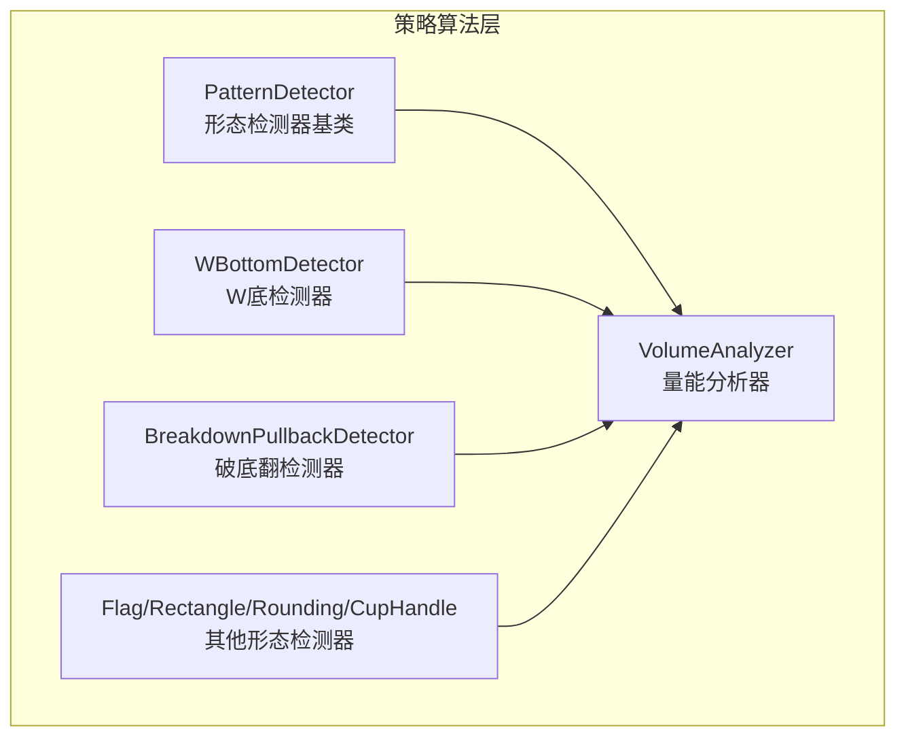
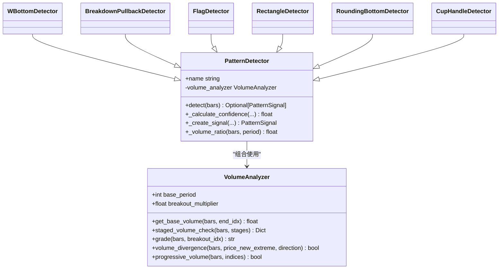
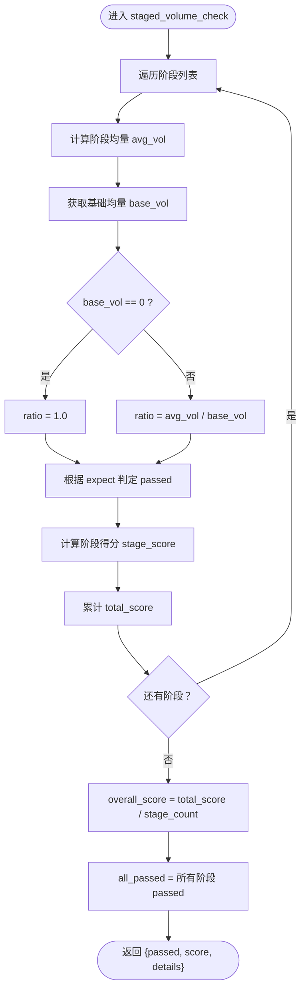
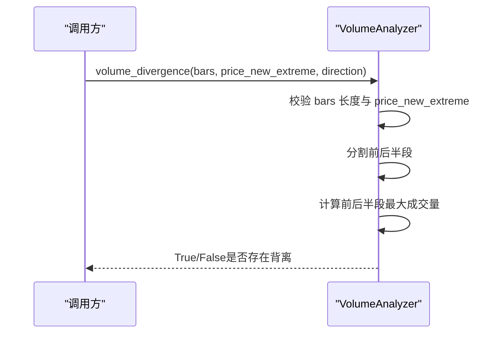
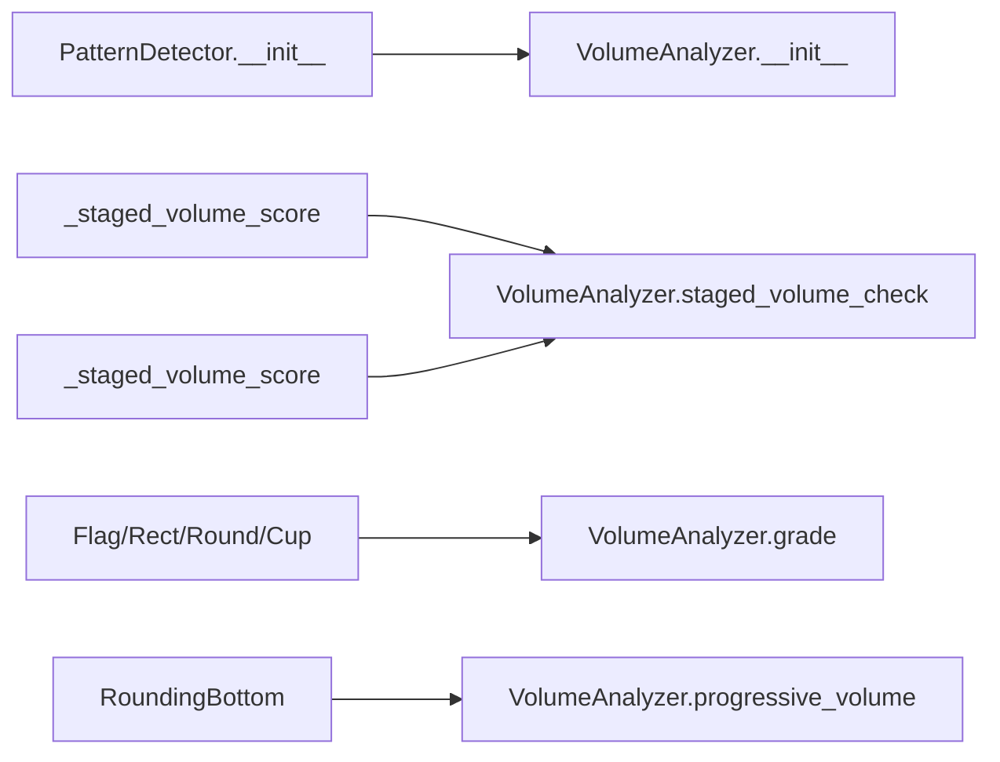

# 成交量分析

<cite>
**本文引用的文件**   
- [volume_analyzer.py](file://src/caisen/strategy/algorithm/caisen_components/volume_analyzer.py)
- [detector.py](file://src/caisen/strategy/algorithm/detector.py)
- [breakdown_pullback.py](file://src/caisen/strategy/algorithm/patterns/breakdown_pullback.py)
- [w_bottom.py](file://src/caisen/strategy/algorithm/patterns/w_bottom.py)
- [other.py](file://src/caisen/strategy/algorithm/patterns/other.py)
- [test_volume_analyzer.py](file://tests/test_volume_analyzer.py)
</cite>

## 目录
1. [简介](#简介)
2. [项目结构](#项目结构)
3. [核心组件](#核心组件)
4. [架构总览](#架构总览)
5. [详细组件分析](#详细组件分析)
6. [依赖关系分析](#依赖关系分析)
7. [性能与复杂度](#性能与复杂度)
8. [可视化与交易信号增强](#可视化与交易信号增强)
9. [数据质量检查与预处理](#数据质量检查与预处理)
10. [故障排查指南](#故障排查指南)
11. [结论](#结论)

## 简介
本技术文档聚焦蔡森策略中的成交量分析组件 VolumeAnalyzer，系统阐述其“量价关系分析、成交量趋势识别、异常成交量检测”的机制，并说明不同形态对成交量的要求：突破放量确认、回调缩量确认、反转的量价背离判断。同时覆盖指标标准化处理与跨品种可比性实现、过滤规则（最低成交量阈值、比率计算、异常值处理）、可视化方法与成交量驱动的交易信号增强策略，以及数据质量检查与预处理方法。

## 项目结构
成交量分析相关代码位于策略算法层，VolumeAnalyzer 作为独立组件被各形态检测器组合使用，形成“形态识别 + 量能确认”的双通道决策框架。

图表来源
- [volume_analyzer.py:15-33](file://src/caisen/strategy/algorithm/caisen_components/volume_analyzer.py#L15-L33)
- [detector.py:97-110](file://src/caisen/strategy/algorithm/detector.py#L97-L110)
- [w_bottom.py:243-284](file://src/caisen/strategy/algorithm/patterns/w_bottom.py#L243-L284)
- [breakdown_pullback.py:218-258](file://src/caisen/strategy/algorithm/patterns/breakdown_pullback.py#L218-L258)
- [other.py:155-179](file://src/caisen/strategy/algorithm/patterns/other.py#L155-L179)

章节来源
- [volume_analyzer.py:15-33](file://src/caisen/strategy/algorithm/caisen_components/volume_analyzer.py#L15-L33)
- [detector.py:97-110](file://src/caisen/strategy/algorithm/detector.py#L97-L110)

## 核心组件
VolumeAnalyzer 提供以下关键能力：
- 基础均量计算：以固定周期窗口计算基准成交量，用于比率化比较
- 分阶段量能评估：按形态阶段配置期望（缩量/放量/递增），输出通过性与评分
- 突破量能分级：将突破K线成交量相对基准进行弱/正常/强三级分类
- 量价背离检测：在价格创新高/新低时，对比前后半段最大成交量是否跟随
- 递增量能检查：对关键点序列进行近似递增判定（允许小幅波动）

章节来源
- [volume_analyzer.py:34-53](file://src/caisen/strategy/algorithm/caisen_components/volume_analyzer.py#L34-L53)
- [volume_analyzer.py:55-125](file://src/caisen/strategy/algorithm/caisen_components/volume_analyzer.py#L55-L125)
- [volume_analyzer.py:127-156](file://src/caisen/strategy/algorithm/caisen_components/volume_analyzer.py#L127-L156)
- [volume_analyzer.py:158-195](file://src/caisen/strategy/algorithm/caisen_components/volume_analyzer.py#L158-L195)
- [volume_analyzer.py:197-223](file://src/caisen/strategy/algorithm/caisen_components/volume_analyzer.py#L197-L223)

## 架构总览
VolumeAnalyzer 由形态检测器注入使用，检测器负责形态识别与置信度合成，量能模块负责量化“量价配合”的强度与一致性。

图表来源
- [volume_analyzer.py:15-33](file://src/caisen/strategy/algorithm/caisen_components/volume_analyzer.py#L15-L33)
- [detector.py:97-110](file://src/caisen/strategy/algorithm/detector.py#L97-L110)
- [w_bottom.py:243-284](file://src/caisen/strategy/algorithm/patterns/w_bottom.py#L243-L284)
- [breakdown_pullback.py:218-258](file://src/caisen/strategy/algorithm/patterns/breakdown_pullback.py#L218-L258)
- [other.py:155-179](file://src/caisen/strategy/algorithm/patterns/other.py#L155-L179)

## 详细组件分析

### 基础均量与比率化（标准化与跨品种可比性）
- 基础均量：取 end_idx 之前 base_period 根K线的平均成交量；若窗口不足则按可用数据计算，极端情况下返回 0.0
- 比率化：阶段均量 / 基础均量得到 ratio，用于统一不同品种、不同时间段的绝对成交量差异，实现跨品种可比性
- 零基准保护：当基础量为 0 时，ratio 回退为 1.0，避免除零异常

章节来源
- [volume_analyzer.py:34-53](file://src/caisen/strategy/algorithm/caisen_components/volume_analyzer.py#L34-L53)
- [volume_analyzer.py:98-103](file://src/caisen/strategy/algorithm/caisen_components/volume_analyzer.py#L98-L103)

### 分阶段量能评估（形态阶段与量能期望）
- 阶段配置：每个阶段包含名称、起止索引与期望类型（shrink/expand/progressive）
- 期望判定：
  - shrink：阶段均量低于基础均量（ratio < 1.0）
  - expand：阶段均量达到或超过 breakout_multiplier 倍基础均量
  - progressive：阶段内成交量近似递增（后一个不低于前一个的 90%，且末值大于首值）
- 评分机制：为每阶段打分（0~1），最终 score 为阶段得分均值，passed 为所有阶段均通过

图表来源
- [volume_analyzer.py:55-125](file://src/caisen/strategy/algorithm/caisen_components/volume_analyzer.py#L55-L125)
- [volume_analyzer.py:225-251](file://src/caisen/strategy/algorithm/caisen_components/volume_analyzer.py#L225-L251)
- [volume_analyzer.py:253-286](file://src/caisen/strategy/algorithm/caisen_components/volume_analyzer.py#L253-L286)

章节来源
- [volume_analyzer.py:55-125](file://src/caisen/strategy/algorithm/caisen_components/volume_analyzer.py#L55-L125)
- [volume_analyzer.py:225-251](file://src/caisen/strategy/algorithm/caisen_components/volume_analyzer.py#L225-L251)
- [volume_analyzer.py:253-286](file://src/caisen/strategy/algorithm/caisen_components/volume_analyzer.py#L253-L286)

### 突破量能分级（weak/normal/strong）
- 依据突破K线成交量相对基础均量的倍数划分等级：
  - weak：< 1.2 倍
  - normal：1.2 ~ 2.0 倍
  - strong：≥ 2.0 倍
- 边界与异常：无效索引返回 weak；基础量为 0 返回 normal

章节来源
- [volume_analyzer.py:127-156](file://src/caisen/strategy/algorithm/caisen_components/volume_analyzer.py#L127-L156)

### 量价背离检测（顶背离/底背离）
- 条件：需要一定长度历史（至少 10 根），且价格创出新高/新低
- 逻辑：将序列分为前半段与后半段，比较两段的最大成交量；若后半段最大量小于前半段，则判定背离
- 方向：
  - up：价格创新高但量能未跟上 → 顶背离
  - down：价格创新低但量能未跟上（恐慌减弱）→ 底背离

图表来源
- [volume_analyzer.py:158-195](file://src/caisen/strategy/algorithm/caisen_components/volume_analyzer.py#L158-L195)

章节来源
- [volume_analyzer.py:158-195](file://src/caisen/strategy/algorithm/caisen_components/volume_analyzer.py#L158-L195)

### 递增量能检查（progressive_volume）
- 输入：一组按时间顺序的关键K线索引
- 规则：相邻两点的成交量满足 v[i] ≥ v[i-1] × 0.9，且末点大于首点
- 用途：用于圆弧底等形态的完成期量能逐步放大验证

章节来源
- [volume_analyzer.py:197-223](file://src/caisen/strategy/algorithm/caisen_components/volume_analyzer.py#L197-L223)

### 形态检测器中的量能集成
- W底检测器：三阶段量能评分（形成期缩量、突破期放量、确认期），若无索引信息回退到简单量比
- 破底翻检测器：拉回阶段缩量、突破阶段放量，结合完成度、趋势、动量合成置信度
- 旗形/矩形/圆弧底/杯柄/过前高等：常用 grade 快速分级，并结合 progressive_volume 做完成期验证

章节来源
- [w_bottom.py:243-284](file://src/caisen/strategy/algorithm/patterns/w_bottom.py#L243-L284)
- [breakdown_pullback.py:218-258](file://src/caisen/strategy/algorithm/patterns/breakdown_pullback.py#L218-L258)
- [other.py:155-179](file://src/caisen/strategy/algorithm/patterns/other.py#L155-L179)
- [other.py:276-290](file://src/caisen/strategy/algorithm/patterns/other.py#L276-290)
- [other.py:343-368](file://src/caisen/strategy/algorithm/patterns/other.py#L343-368)
- [other.py:445-468](file://src/caisen/strategy/algorithm/patterns/other.py#L445-468)

## 依赖关系分析
- 注入方式：PatternDetector 构造时创建 VolumeAnalyzer 实例，支持通过 volume_config 传入 base_period 与 breakout_multiplier
- 使用方式：
  - 分阶段评估：staged_volume_check
  - 快速分级：grade
  - 背离检测：volume_divergence
  - 递增检查：progressive_volume

图表来源
- [detector.py:97-110](file://src/caisen/strategy/algorithm/detector.py#L97-L110)
- [w_bottom.py:243-284](file://src/caisen/strategy/algorithm/patterns/w_bottom.py#L243-L284)
- [breakdown_pullback.py:218-258](file://src/caisen/strategy/algorithm/patterns/breakdown_pullback.py#L218-L258)
- [other.py:155-179](file://src/caisen/strategy/algorithm/patterns/other.py#L155-L179)
- [other.py:343-368](file://src/caisen/strategy/algorithm/patterns/other.py#L343-368)

章节来源
- [detector.py:97-110](file://src/caisen/strategy/algorithm/detector.py#L97-L110)

## 性能与复杂度
- get_base_volume：O(base_period)，滑动窗口求和
- staged_volume_check：O(S × L)，S 为阶段数，L 为阶段内K线数量；内部还涉及 progressive_volume 的线性扫描
- grade：O(base_period)
- volume_divergence：O(N)，N 为 bars 长度
- progressive_volume：O(K)，K 为 indices 长度

优化建议
- 对频繁调用的 get_base_volume 可引入滚动累加缓存（需保证 bars 不可变或增量更新）
- 对 progressive_volume 的阈值 0.9 可根据品种波动特性动态调整
- 背离检测的最小长度阈值可按品种流动性自适应

章节来源
- [volume_analyzer.py:34-53](file://src/caisen/strategy/algorithm/caisen_components/volume_analyzer.py#L34-L53)
- [volume_analyzer.py:55-125](file://src/caisen/strategy/algorithm/caisen_components/volume_analyzer.py#L55-L125)
- [volume_analyzer.py:127-156](file://src/caisen/strategy/algorithm/caisen_components/volume_analyzer.py#L127-L156)
- [volume_analyzer.py:158-195](file://src/caisen/strategy/algorithm/caisen_components/volume_analyzer.py#L158-L195)
- [volume_analyzer.py:197-223](file://src/caisen/strategy/algorithm/caisen_components/volume_analyzer.py#L197-L223)

## 可视化与交易信号增强

### 可视化方法
- 阶段标注：在图表上绘制形成期、突破期、确认期的区间，叠加阶段均量与基础均量曲线，便于观察 ratio 变化
- 量能分级：用颜色标记突破K线的强弱（弱/正常/强），辅助快速筛选高胜率信号
- 背离提示：在价格新高/新低位置标注背离检测结果，提醒潜在反转风险
- 递增量能：在圆弧底等形态的完成期，展示关键点的成交量折线，直观呈现递增趋势

### 交易信号增强策略
- 突破形态：仅当 grade 为 normal 或 strong 时提升置信度；若为 weak 则降低权重或过滤
- 回调形态：在拉回阶段要求 shrink，否则降低完成度评分
- 反转形态：出现背离时下调置信度，或在风控层面收紧止损/仓位
- 多因子合成：将 volume 因子纳入 ConfidenceFactors 加权求和，确保量能一致性与形态完成度共同决定最终信号强度

章节来源
- [w_bottom.py:243-284](file://src/caisen/strategy/algorithm/patterns/w_bottom.py#L243-L284)
- [breakdown_pullback.py:218-258](file://src/caisen/strategy/algorithm/patterns/breakdown_pullback.py#L218-L258)
- [other.py:155-179](file://src/caisen/strategy/algorithm/patterns/other.py#L155-L179)
- [other.py:276-290](file://src/caisen/strategy/algorithm/patterns/other.py#L276-290)
- [other.py:343-368](file://src/caisen/strategy/algorithm/patterns/other.py#L343-368)
- [other.py:445-468](file://src/caisen/strategy/algorithm/patterns/other.py#L445-468)

## 数据质量检查与预处理

### 最低成交量阈值
- 建议在接入层设置最小成交量阈值，过滤流动性极差的标的或异常时段，避免 ratio 失真
- 可在检测器入口增加 bars 长度与成交量有效性校验，不满足条件直接返回 None

### 成交量比率计算
- 采用 VolumeAnalyzer 的比率化方案（阶段均量 / 基础均量），天然具备跨品种可比性
- 对于新上市或数据稀疏的品种，适当增大 base_period 或使用更稳健的统计量（如中位数）替代均值

### 异常成交量处理
- 剔除极端异常值：可采用分位数截尾（例如去除上下 1% 的极端值）后再计算均值
- 缺失值填充：对少量缺失的成交量可使用前值填充或插值，避免断链影响阶段计算
- 零量保护：当基础量为 0 时，ratio 回退为 1.0，防止除零错误

章节来源
- [volume_analyzer.py:34-53](file://src/caisen/strategy/algorithm/caisen_components/volume_analyzer.py#L34-L53)
- [volume_analyzer.py:98-103](file://src/caisen/strategy/algorithm/caisen_components/volume_analyzer.py#L98-L103)

## 故障排查指南
- 现象：staged_volume_check 返回 passed=False 且 score=0
  - 可能原因：bars 为空或 stages 为空；阶段区间越界导致 segment 为空
  - 定位：检查 bars 长度与 stages 的 start_idx/end_idx 范围
- 现象：grade 总是返回 weak
  - 可能原因：基础量为 0 或突破量过小；索引越界
  - 定位：确认 breakout_idx 有效，检查 base_period 与历史数据充足性
- 现象：volume_divergence 始终返回 False
  - 可能原因：bars 长度不足 10 或 price_new_extreme 为 False
  - 定位：确保输入序列足够长，且正确传入价格极值标志
- 现象：progressive_volume 返回 False
  - 可能原因：indices 少于 2 个或存在越界索引；不满足 90% 容差递增
  - 定位：校验 indices 合法性与数值单调性

章节来源
- [test_volume_analyzer.py:81-168](file://tests/test_volume_analyzer.py#L81-L168)
- [test_volume_analyzer.py:170-236](file://tests/test_volume_analyzer.py#L170-L236)
- [test_volume_analyzer.py:238-286](file://tests/test_volume_analyzer.py#L238-L286)
- [test_volume_analyzer.py:288-344](file://tests/test_volume_analyzer.py#L288-L344)

## 结论
VolumeAnalyzer 以比率化为核心，将不同形态阶段的量能需求抽象为 shrink/expand/progressive 三类期望，并通过统一的评分与通过性判定，使量能成为形态置信度的重要维度。配合形态检测器的四因子合成模型，可实现“形态 + 量能 + 趋势 + 动量”的多维共振，提高信号质量与稳定性。通过合理的阈值与异常处理，该组件在不同品种与不同时间段下具备良好的可比性与鲁棒性。