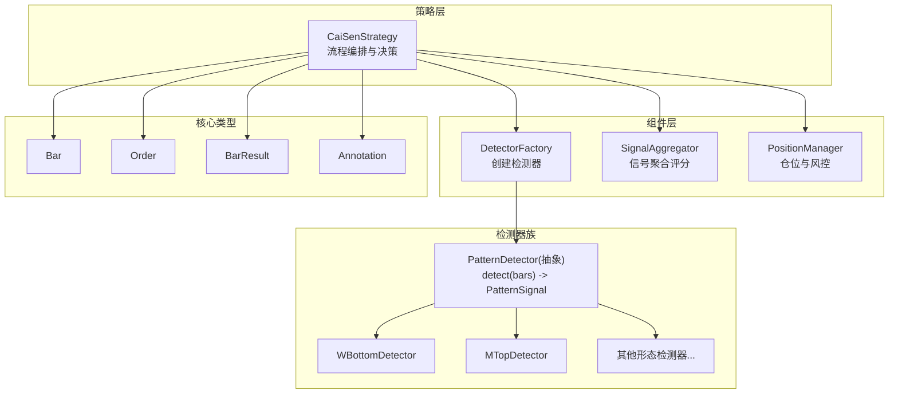
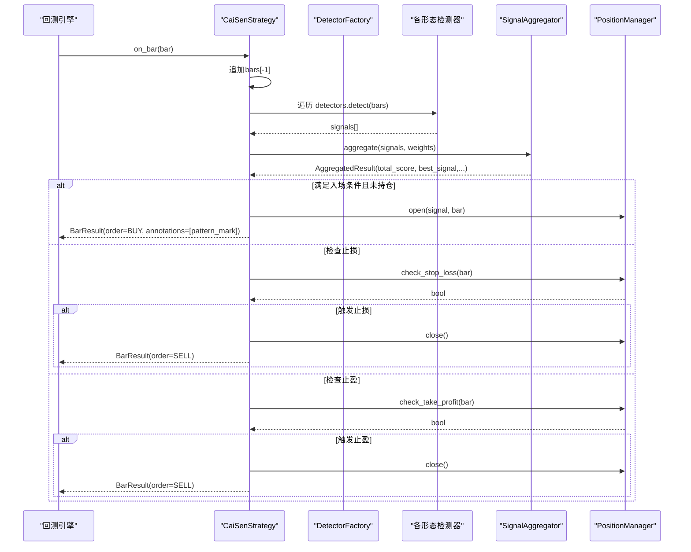
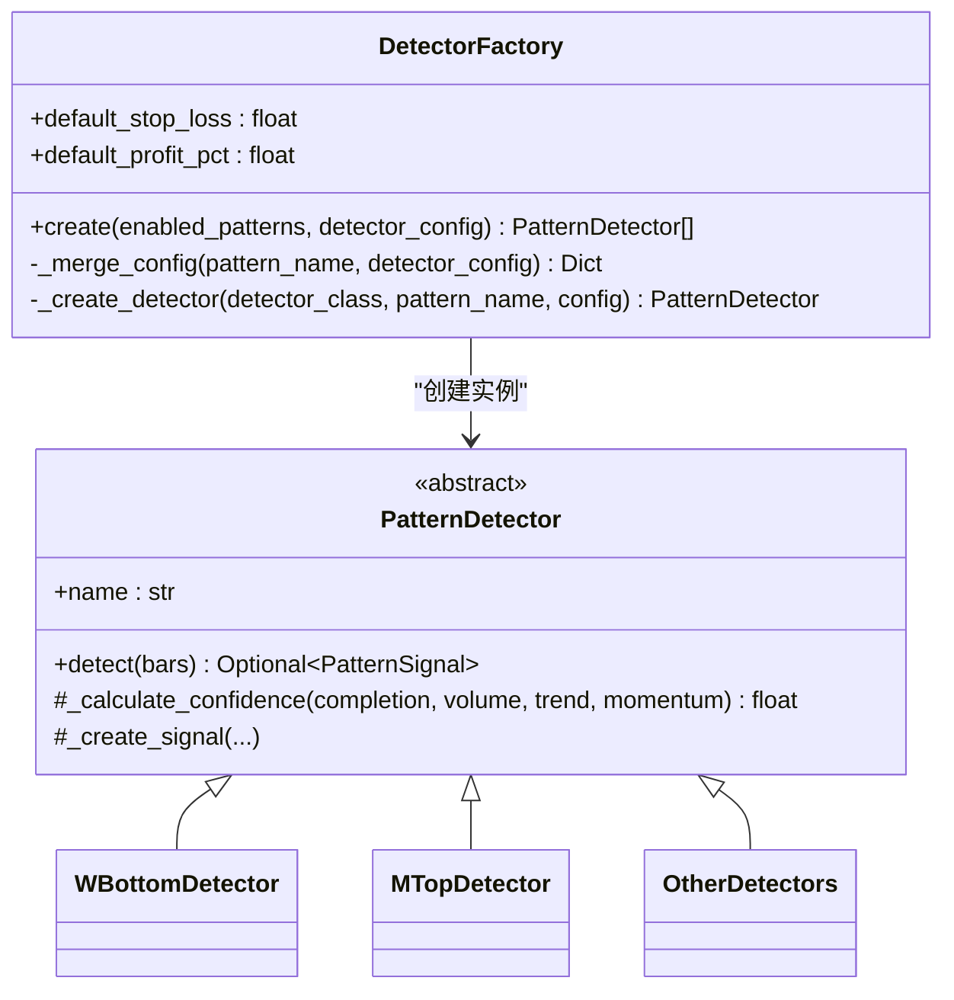
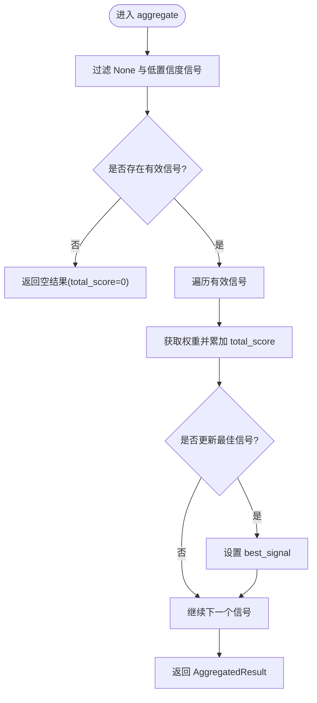
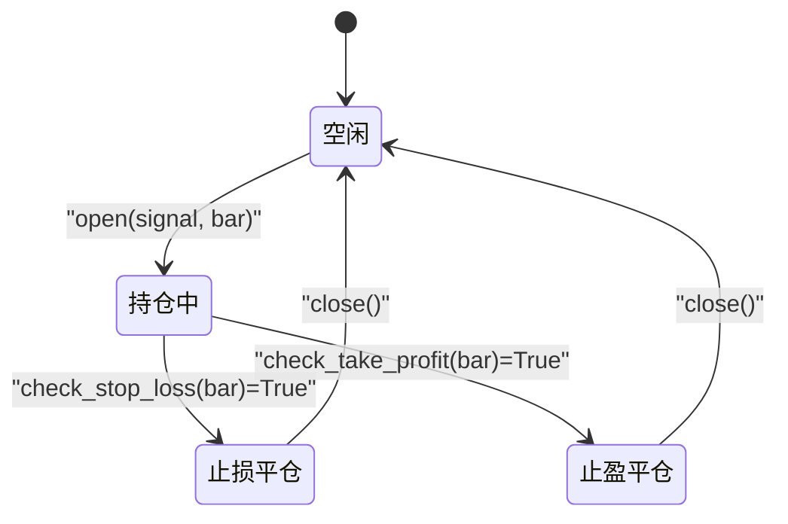
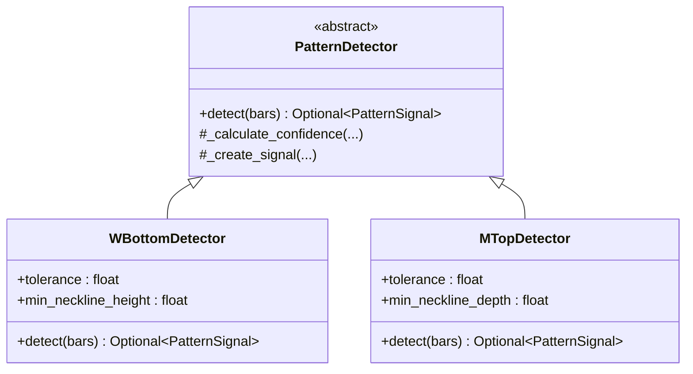
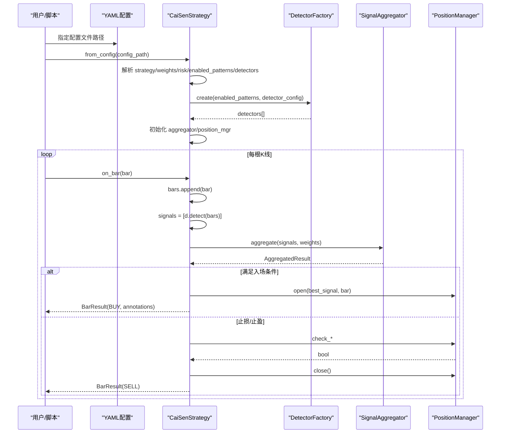
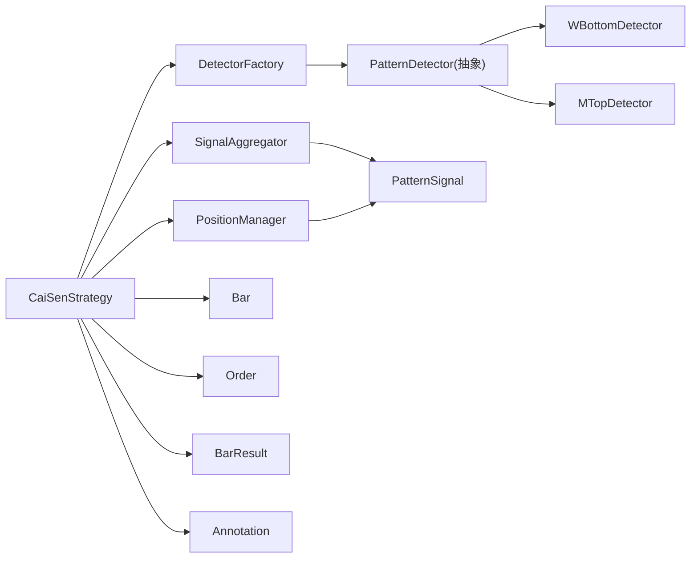

# 策略架构设计

<cite>
**本文引用的文件**   
- [src/caisen/strategy/algorithm/cai_sen.py](file://src/caisen/strategy/algorithm/cai_sen.py)
- [src/caisen/strategy/algorithm/caisen_components/factory.py](file://src/caisen/strategy/algorithm/caisen_components/factory.py)
- [src/caisen/strategy/algorithm/caisen_components/aggregator.py](file://src/caisen/strategy/algorithm/caisen_components/aggregator.py)
- [src/caisen/strategy/algorithm/caisen_components/position_manager.py](file://src/caisen/strategy/algorithm/caisen_components/position_manager.py)
- [src/caisen/strategy/algorithm/detector.py](file://src/caisen/strategy/algorithm/detector.py)
- [src/caisen/strategy/base.py](file://src/caisen/strategy/base.py)
- [src/caisen/core/bar.py](file://src/caisen/core/bar.py)
- [src/caisen/core/order.py](file://src/caisen/core/order.py)
- [src/caisen/core/bar_result.py](file://src/caisen/core/bar_result.py)
- [src/caisen/core/annotation.py](file://src/caisen/core/annotation.py)
- [configs/strategies/cai_sen_v2.yaml](file://configs/strategies/cai_sen_v2.yaml)
- [examples/cai_sen_backtest.py](file://examples/cai_sen_backtest.py)
</cite>

## 目录
1. [引言](#引言)
2. [项目结构](#项目结构)
3. [核心组件](#核心组件)
4. [架构总览](#架构总览)
5. [详细组件分析](#详细组件分析)
6. [依赖关系分析](#依赖关系分析)
7. [性能考量](#性能考量)
8. [故障排查指南](#故障排查指南)
9. [结论](#结论)
10. [附录](#附录)

## 引言
本技术文档围绕蔡森策略 V2 的组件化架构展开，重点阐述 DetectorFactory、SignalAggregator、PositionManager 三大核心组件的职责分离与协作方式，并完整描述策略生命周期：初始化流程、K线数据处理循环、信号检测聚合机制与订单执行逻辑。同时给出架构图与时序图，说明数据流向与组件交互；并解释配置加载机制与向后兼容的实现细节。

## 项目结构
CaiSenStrategy V2 采用“策略编排 + 组件化”的设计：
- 策略层（CaiSenStrategy）负责流程编排与决策，不直接实现形态识别或风控细节。
- 组件层提供可复用的能力：
  - DetectorFactory：按配置创建具体形态检测器实例。
  - SignalAggregator：对多检测器输出进行加权聚合与评分。
  - PositionManager：管理持仓状态、止损止盈与回调通知。
- 基础类型与契约：
  - Bar、Order、BarResult、Annotation 等为核心数据结构与接口契约。
  - PatternDetector 抽象基类定义纯函数式 detect(bars) 接口。

图表来源
- [src/caisen/strategy/algorithm/cai_sen.py:36-136](file://src/caisen/strategy/algorithm/cai_sen.py#L36-L136)
- [src/caisen/strategy/algorithm/caisen_components/factory.py:54-111](file://src/caisen/strategy/algorithm/caisen_components/factory.py#L54-L111)
- [src/caisen/strategy/algorithm/caisen_components/aggregator.py:42-136](file://src/caisen/strategy/algorithm/caisen_components/aggregator.py#L42-L136)
- [src/caisen/strategy/algorithm/caisen_components/position_manager.py:24-170](file://src/caisen/strategy/algorithm/caisen_components/position_manager.py#L24-L170)
- [src/caisen/strategy/algorithm/detector.py:80-123](file://src/caisen/strategy/algorithm/detector.py#L80-L123)
- [src/caisen/core/bar.py:8-38](file://src/caisen/core/bar.py#L8-L38)
- [src/caisen/core/order.py:16-44](file://src/caisen/core/order.py#L16-L44)
- [src/caisen/core/bar_result.py:21-41](file://src/caisen/core/bar_result.py#L21-L41)
- [src/caisen/core/annotation.py:39-139](file://src/caisen/core/annotation.py#L39-L139)

章节来源
- [src/caisen/strategy/algorithm/cai_sen.py:36-136](file://src/caisen/strategy/algorithm/cai_sen.py#L36-L136)
- [src/caisen/strategy/algorithm/caisen_components/__init__.py:1-21](file://src/caisen/strategy/algorithm/caisen_components/__init__.py#L1-L21)

## 核心组件
- DetectorFactory
  - 职责：根据启用形态列表与专用参数，合并默认配置并实例化具体检测器。
  - 关键点：支持默认止损系数与最小盈利目标；按形态名映射到具体类；为不同形态构造差异化参数。
- SignalAggregator
  - 职责：收集各检测器返回的信号，应用权重计算综合评分，筛选最佳信号。
  - 关键点：无状态纯函数风格；支持阈值过滤；提供便捷方法一步完成检测+聚合。
- PositionManager
  - 职责：管理持仓信息、止损/止盈判断、回调通知与假突破预警。
  - 关键点：有状态；通过回调解耦外部行为；内置 FakeBreakoutWarning 评估风险等级与建议减仓比例。

章节来源
- [src/caisen/strategy/algorithm/caisen_components/factory.py:54-237](file://src/caisen/strategy/algorithm/caisen_components/factory.py#L54-L237)
- [src/caisen/strategy/algorithm/caisen_components/aggregator.py:16-136](file://src/caisen/strategy/algorithm/caisen_components/aggregator.py#L16-L136)
- [src/caisen/strategy/algorithm/caisen_components/position_manager.py:15-170](file://src/caisen/strategy/algorithm/caisen_components/position_manager.py#L15-L170)

## 架构总览
CaiSenStrategy 作为编排者，在每根 K 线上执行以下流程：
- 更新历史 K 线缓存。
- 调用所有已启用的检测器进行形态检测。
- 将检测结果交由 SignalAggregator 进行加权聚合与评分。
- 依据阈值与当前持仓状态，决定是否开仓、止损或止盈。
- 返回 BarResult（包含 Order 与 Annotation）。

图表来源
- [src/caisen/strategy/algorithm/cai_sen.py:178-221](file://src/caisen/strategy/algorithm/cai_sen.py#L178-L221)
- [src/caisen/strategy/algorithm/caisen_components/aggregator.py:59-136](file://src/caisen/strategy/algorithm/caisen_components/aggregator.py#L59-L136)
- [src/caisen/strategy/algorithm/caisen_components/position_manager.py:89-147](file://src/caisen/strategy/algorithm/caisen_components/position_manager.py#L89-L147)
- [src/caisen/core/bar_result.py:21-41](file://src/caisen/core/bar_result.py#L21-L41)
- [src/caisen/core/order.py:16-44](file://src/caisen/core/order.py#L16-L44)

## 详细组件分析

### DetectorFactory（检测器工厂）
- 设计要点
  - 维护 DETECTOR_CLASSES 映射表，将形态名称解析为具体检测器类。
  - DEFAULT_DETECTOR_CONFIG 提供各形态默认参数，create 时与用户传入配置合并。
  - _create_detector 针对各形态选择对应构造参数，确保不同检测器的差异化初始化。
- 扩展性
  - 新增形态只需在映射表与默认配置中注册，并在 _create_detector 分支中添加构造逻辑。
- 典型用法
  - 从 enabled_patterns 与 detector_config 构建 detectors 列表，供策略使用。

图表来源
- [src/caisen/strategy/algorithm/caisen_components/factory.py:54-237](file://src/caisen/strategy/algorithm/caisen_components/factory.py#L54-L237)
- [src/caisen/strategy/algorithm/detector.py:80-180](file://src/caisen/strategy/algorithm/detector.py#L80-L180)

章节来源
- [src/caisen/strategy/algorithm/caisen_components/factory.py:54-237](file://src/caisen/strategy/algorithm/caisen_components/factory.py#L54-L237)

### SignalAggregator（信号聚合器）
- 设计要点
  - 无状态，aggregate 接收 signals 与 weights，过滤无效信号与低于阈值的信号后计算加权总分。
  - 选择置信度最高的信号作为 best_signal，便于后续下单决策。
  - 提供 aggregate_with_detection 便捷方法，内部先调用各检测器 detect，再聚合。
- 复杂度
  - 时间 O(n)，n 为有效信号数量；空间 O(n) 用于保存结果。
- 关键输出
  - AggregatedResult 包含 total_score、best_signal、signals、signal_count 及 has_signal/best_confidence 属性。

图表来源
- [src/caisen/strategy/algorithm/caisen_components/aggregator.py:59-110](file://src/caisen/strategy/algorithm/caisen_components/aggregator.py#L59-L110)

章节来源
- [src/caisen/strategy/algorithm/caisen_components/aggregator.py:16-136](file://src/caisen/strategy/algorithm/caisen_components/aggregator.py#L16-L136)

### PositionManager（仓位管理器）
- 设计要点
  - 管理单一持仓（entry_price、stop_loss、target、entry_bar），提供 open/close/reset。
  - 通过回调 on_stop_loss/on_take_profit/on_reset 解耦外部处理逻辑。
  - 内置 FakeBreakoutWarning，基于入场后的 K 线序列评估假突破概率与风险等级，并给出减仓建议。
- 风控流程
  - 止损：bar.low < stop_loss 触发。
  - 止盈：bar.high >= target 触发。
  - 假突破预警：根据特征评估 fake_probability，划分 low/medium/high 风险等级，并映射到 hold/reduce_25/reduce_50/exit 建议。

图表来源
- [src/caisen/strategy/algorithm/caisen_components/position_manager.py:89-170](file://src/caisen/strategy/algorithm/caisen_components/position_manager.py#L89-L170)

章节来源
- [src/caisen/strategy/algorithm/caisen_components/position_manager.py:15-170](file://src/caisen/strategy/algorithm/caisen_components/position_manager.py#L15-L170)

### 形态检测器（示例：W底与M头）
- 共同点
  - 继承自 PatternDetector，实现纯函数式 detect(bars) 接口。
  - 使用 ConfidenceFactors 与 _calculate_confidence 综合完成度、成交量、趋势、动量等因子。
  - 生成 PatternSignal，包含 confidence、stop_loss、target、points 等可视化所需信息。
- WBottomDetector
  - 寻找两个相近低点与颈线，当价格突破颈线时确认形态。
  - 三阶段量能评分：形成期缩量、突破期放量、确认期持续或回踩缩量。
- MTopDetector
  - 寻找两个相近高点与颈线，当价格跌破颈线时确认形态。
  - 结合下降趋势与跌破力度提升信号可信度。

图表来源
- [src/caisen/strategy/algorithm/detector.py:80-180](file://src/caisen/strategy/algorithm/detector.py#L80-L180)
- [src/caisen/strategy/algorithm/patterns/w_bottom.py:11-285](file://src/caisen/strategy/algorithm/patterns/w_bottom.py#L11-L285)
- [src/caisen/strategy/algorithm/patterns/m_top.py:11-227](file://src/caisen/strategy/algorithm/patterns/m_top.py#L11-L227)

章节来源
- [src/caisen/strategy/algorithm/detector.py:80-180](file://src/caisen/strategy/algorithm/detector.py#L80-L180)
- [src/caisen/strategy/algorithm/patterns/w_bottom.py:11-285](file://src/caisen/strategy/algorithm/patterns/w_bottom.py#L11-L285)
- [src/caisen/strategy/algorithm/patterns/m_top.py:11-227](file://src/caisen/strategy/algorithm/patterns/m_top.py#L11-L227)

### 策略生命周期与数据流
- 初始化
  - from_config：从 YAML 读取 strategy、weights、risk、enabled_patterns、detectors 等配置，构造 CaiSenStrategy。
  - __init__：若未显式传入 detectors，则通过 DetectorFactory 基于 enabled_patterns 与 detector_config 创建；初始化 SignalAggregator 与 PositionManager。
- 每根 K 线处理（on_bar）
  - 追加 bars，并行调用各检测器 detect，得到 signals。
  - 调用 SignalAggregator.aggregate 计算 total_score 与 best_signal。
  - 决策：
    - 入场：best_signal.confidence >= threshold 且未持仓 → 开仓并返回 BUY 订单与 PATTERN_MARK 标注。
    - 止损：触发 → 平仓并返回 SELL 订单。
    - 止盈：触发 → 平仓并返回 SELL 订单。
- 结束与重置
  - on_session_end：预留清理逻辑。
  - reset：清空 bars 与持仓状态。

图表来源
- [src/caisen/strategy/algorithm/cai_sen.py:55-136](file://src/caisen/strategy/algorithm/cai_sen.py#L55-L136)
- [src/caisen/strategy/algorithm/caisen_components/factory.py:81-111](file://src/caisen/strategy/algorithm/caisen_components/factory.py#L81-L111)
- [src/caisen/strategy/algorithm/caisen_components/aggregator.py:59-136](file://src/caisen/strategy/algorithm/caisen_components/aggregator.py#L59-L136)
- [src/caisen/strategy/algorithm/caisen_components/position_manager.py:89-147](file://src/caisen/strategy/algorithm/caisen_components/position_manager.py#L89-L147)

章节来源
- [src/caisen/strategy/algorithm/cai_sen.py:55-245](file://src/caisen/strategy/algorithm/cai_sen.py#L55-L245)

## 依赖关系分析
- 组件耦合
  - CaiSenStrategy 依赖 DetectorFactory、SignalAggregator、PositionManager，但不直接持有具体检测器实现细节。
  - DetectorFactory 依赖 PatternDetector 抽象与各具体检测器类。
  - SignalAggregator 依赖 PatternSignal 与可选的 Bar（仅用于便捷方法）。
  - PositionManager 依赖 PatternSignal 与 Bar，并通过回调与外部系统交互。
- 外部依赖
  - 配置加载依赖 pyyaml（from_config 中动态导入）。
  - 核心类型 Bar、Order、BarResult、Annotation 由 core 模块提供。
- 潜在循环依赖
  - 通过 TYPE_CHECKING 与延迟导入避免运行时循环依赖。

图表来源
- [src/caisen/strategy/algorithm/cai_sen.py:36-136](file://src/caisen/strategy/algorithm/cai_sen.py#L36-L136)
- [src/caisen/strategy/algorithm/detector.py:80-123](file://src/caisen/strategy/algorithm/detector.py#L80-L123)
- [src/caisen/core/bar.py:8-38](file://src/caisen/core/bar.py#L8-L38)
- [src/caisen/core/order.py:16-44](file://src/caisen/core/order.py#L16-L44)
- [src/caisen/core/bar_result.py:21-41](file://src/caisen/core/bar_result.py#L21-L41)
- [src/caisen/core/annotation.py:39-139](file://src/caisen/core/annotation.py#L39-L139)

章节来源
- [src/caisen/strategy/algorithm/cai_sen.py:36-136](file://src/caisen/strategy/algorithm/cai_sen.py#L36-L136)
- [src/caisen/strategy/algorithm/detector.py:80-123](file://src/caisen/strategy/algorithm/detector.py#L80-L123)

## 性能考量
- 检测器纯函数接口
  - 无内部状态，便于并行测试与批处理；但每次 detect 需遍历 bars，注意 bars 长度增长带来的开销。
- 聚合器线性复杂度
  - aggregate 对 signals 做线性扫描，适合实时场景；可通过阈值过滤减少计算量。
- 仓位管理轻量
  - 止损/止盈检查为常数时间操作；假突破预警仅在需要时评估，避免不必要的计算。
- 优化建议
  - 限制 bars 窗口大小（如滑动窗口）以减少重复计算。
  - 对低频形态检测器进行惰性计算或缓存中间结果。
  - 合理设置 threshold 与权重，降低无效信号处理成本。

[本节为通用指导，无需特定文件引用]

## 故障排查指南
- 配置加载失败
  - 现象：ImportError 提示缺少 pyyaml 或 FileNotFoundError 找不到配置文件。
  - 排查：确认已安装 pyyaml；检查配置文件路径是否正确。
- 未检测到任何信号
  - 现象：total_score 始终为 0 或 best_signal 为空。
  - 排查：检查 enabled_patterns 与 weights 配置；确认 bars 长度满足各检测器最小要求；适当调低 threshold。
- 频繁止损
  - 现象：持仓很快被止损。
  - 排查：调整 stop_loss_factor 与 min_profit_pct；观察假突破预警建议，必要时减仓或退出。
- 回测结果异常
  - 现象：交易记录与预期不符。
  - 排查：核对 Bar 数据质量（时间戳、价格范围）；确认 Order 的 stop_loss/target 设置正确；检查 BarResult 的 order 与 annotations 输出。

章节来源
- [src/caisen/strategy/algorithm/cai_sen.py:24-34](file://src/caisen/strategy/algorithm/cai_sen.py#L24-L34)
- [src/caisen/strategy/algorithm/caisen_components/aggregator.py:59-110](file://src/caisen/strategy/algorithm/caisen_components/aggregator.py#L59-L110)
- [src/caisen/strategy/algorithm/caisen_components/position_manager.py:109-147](file://src/caisen/strategy/algorithm/caisen_components/position_manager.py#L109-L147)

## 结论
CaiSenStrategy V2 通过清晰的职责分离与纯函数式检测器接口，实现了高内聚、低耦合的组件化架构。DetectorFactory 负责检测器装配，SignalAggregator 统一评分与决策输入，PositionManager 专注风控与状态管理。配合 YAML 配置与向后兼容参数，策略具备良好的可扩展性与易用性。建议在实战中结合数据质量与参数优化，以获得更稳健的交易表现。

[本节为总结，无需特定文件引用]

## 附录

### 配置加载机制与向后兼容性
- 配置加载
  - from_config 支持从 YAML 文件加载 strategy、weights、risk、enabled_patterns、detectors 等字段，并转换为构造函数参数。
  - 若未显式传入 config_dict，则默认读取仓库根目录下 configs/cai_sen_v2.yaml。
- 向后兼容
  - __init__ 保留大量 legacy 开关参数（如 w_bottom_enabled、m_top_enabled 等），用于兼容旧版调用方式。
  - 当未传入 detectors 时，自动根据 legacy 开关生成 enabled_patterns，并使用 DetectorFactory 创建检测器。
  - 默认止损与盈利目标同时支持新参数（stop_loss_factor/min_profit_pct）与旧参数（stop_loss_factor_legacy/min_profit_pct_legacy）。

章节来源
- [src/caisen/strategy/algorithm/cai_sen.py:55-136](file://src/caisen/strategy/algorithm/cai_sen.py#L55-L136)
- [configs/strategies/cai_sen_v2.yaml:1-145](file://configs/strategies/cai_sen_v2.yaml#L1-L145)

### 示例与集成
- 回测示例
  - examples/cai_sen_backtest.py 演示了如何生成测试数据、创建策略与运行回测，并输出交易记录与绩效指标。
- 策略基类
  - Strategy 定义了 on_init、on_bar、on_session_end、reset 等生命周期钩子，CaiSenStrategy 遵循该契约。

章节来源
- [examples/cai_sen_backtest.py:109-183](file://examples/cai_sen_backtest.py#L109-L183)
- [src/caisen/strategy/base.py:19-37](file://src/caisen/strategy/base.py#L19-L37)