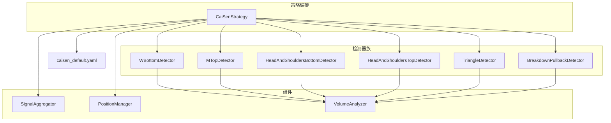
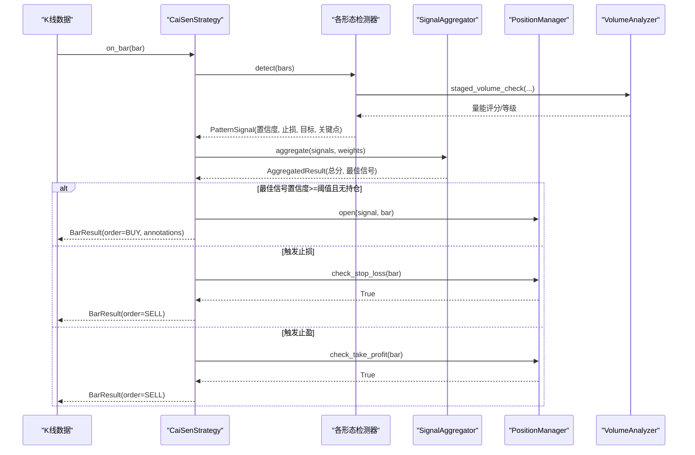
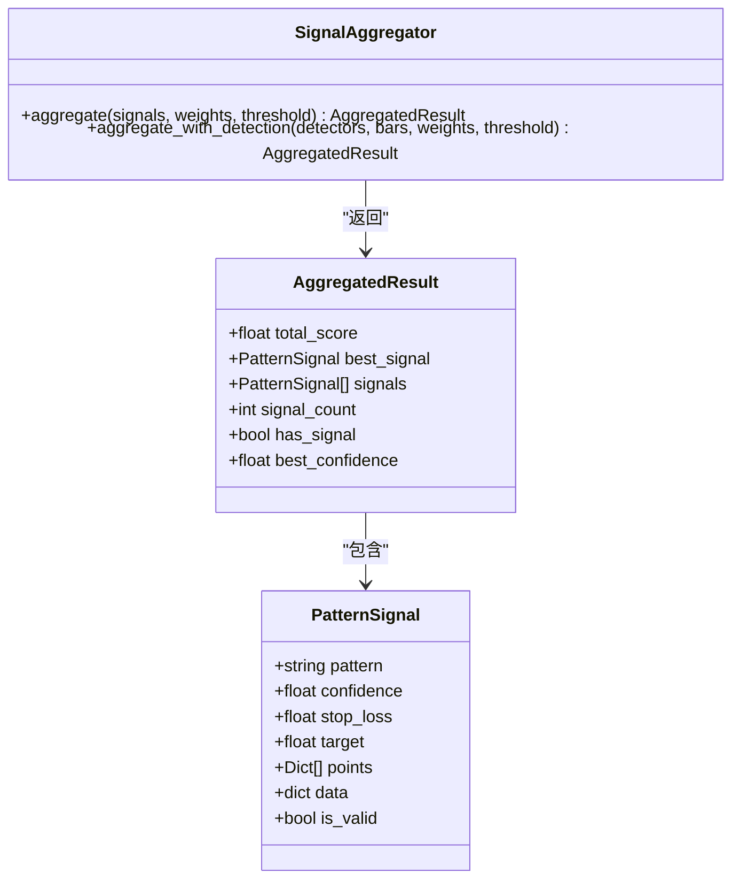
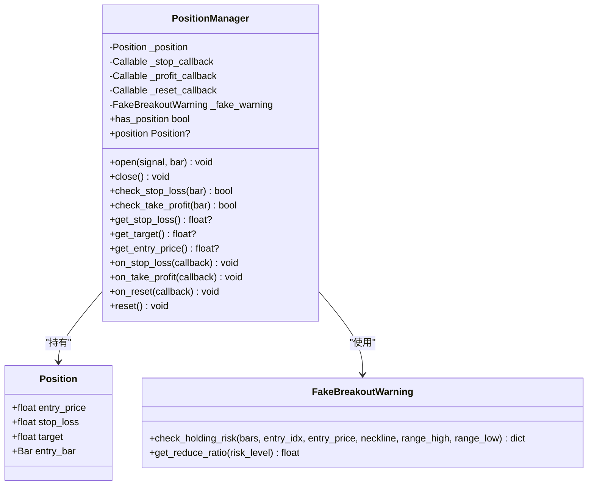
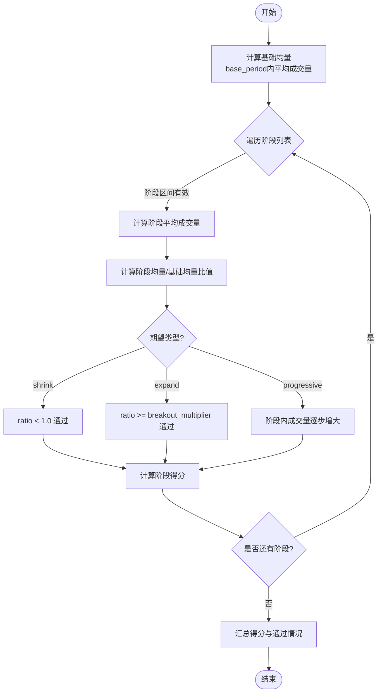
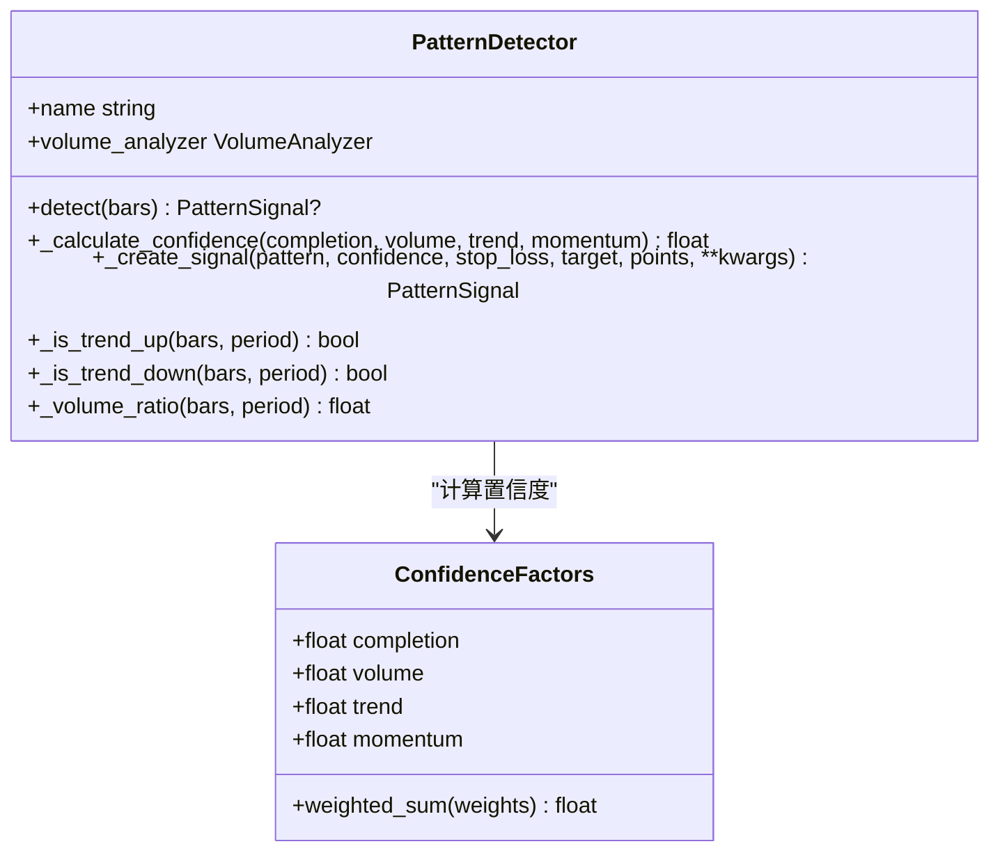
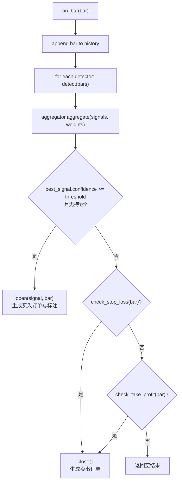
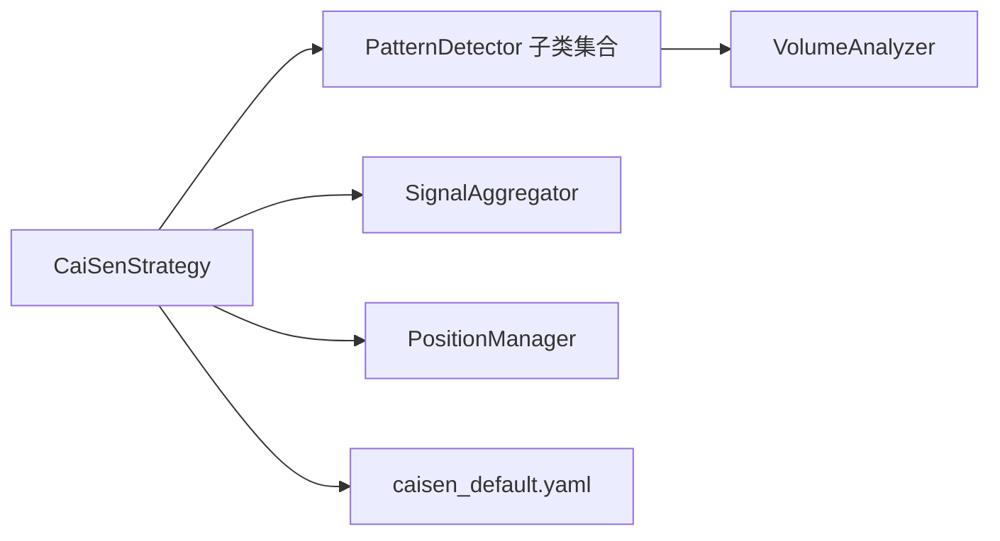

# 蔡森策略

<cite>
**本文引用的文件**   
- [src/caisen/strategy/algorithm/cai_sen.py](file://src/caisen/strategy/algorithm/cai_sen.py)
- [src/caisen/strategy/algorithm/detector.py](file://src/caisen/strategy/algorithm/detector.py)
- [src/caisen/strategy/algorithm/caisen_components/aggregator.py](file://src/caisen/strategy/algorithm/caisen_components/aggregator.py)
- [src/caisen/strategy/algorithm/caisen_components/position_manager.py](file://src/caisen/strategy/algorithm/caisen_components/position_manager.py)
- [src/caisen/strategy/algorithm/caisen_components/volume_analyzer.py](file://src/caisen/strategy/algorithm/caisen_components/volume_analyzer.py)
- [src/caisen/strategy/algorithm/patterns/w_bottom.py](file://src/caisen/strategy/algorithm/patterns/w_bottom.py)
- [src/caisen/strategy/algorithm/patterns/m_top.py](file://src/caisen/strategy/algorithm/patterns/m_top.py)
- [src/caisen/strategy/algorithm/patterns/head_shoulders.py](file://src/caisen/strategy/algorithm/patterns/head_shoulders.py)
- [src/caisen/strategy/algorithm/patterns/triangle.py](file://src/caisen/strategy/algorithm/patterns/triangle.py)
- [src/caisen/strategy/algorithm/patterns/breakdown_pullback.py](file://src/caisen/strategy/algorithm/patterns/breakdown_pullback.py)
- [configs/strategies/caisen_default.yaml](file://configs/strategies/caisen_default.yaml)
- [README.md](file://README.md)
</cite>

## 目录
1. [引言](#引言)
2. [项目结构](#项目结构)
3. [核心组件](#核心组件)
4. [架构总览](#架构总览)
5. [详细组件分析](#详细组件分析)
6. [依赖关系分析](#依赖关系分析)
7. [性能与适用环境](#性能与适用环境)
8. [故障排查指南](#故障排查指南)
9. [结论](#结论)
10. [附录：参数调优与可视化示例](#附录参数调优与可视化示例)

## 引言
本技术文档围绕“蔡森十二形态”的识别策略，系统性阐述其理论基础、数学原理与工程实现。重点覆盖以下方面：
- 经典技术分析形态（头肩顶/底、W底/M头、三角整理、旗形整理等）在系统中的识别规则与量化表达
- CaiSenStrategy 的组件化架构：检测器、信号聚合、仓位管理与量能分析
- 置信度计算模型与多因子加权机制
- 参数体系与优化流程，含阈值、过滤条件与风控参数
- 误报处理与可视化标注方案
- 性能特征与适用市场环境建议

## 项目结构
策略代码位于 strategy/algorithm 目录下，采用“策略编排 + 纯函数检测器 + 可复用组件”的分层设计：
- 策略编排：CaiSenStrategy 负责每根K线的流程控制、决策与订单生成
- 检测器族：各形态检测器继承统一接口，返回标准化信号
- 组件库：信号聚合、仓位管理、量能分析等通用能力解耦为独立模块
- 配置与优化：YAML 配置与网格搜索工具支持快速迭代

图表来源
- [src/caisen/strategy/algorithm/cai_sen.py:178-221](file://src/caisen/strategy/algorithm/cai_sen.py#L178-L221)
- [src/caisen/strategy/algorithm/caisen_components/aggregator.py:59-110](file://src/caisen/strategy/algorithm/caisen_components/aggregator.py#L59-L110)
- [src/caisen/strategy/algorithm/caisen_components/position_manager.py:89-147](file://src/caisen/strategy/algorithm/caisen_components/position_manager.py#L89-L147)
- [src/caisen/strategy/algorithm/patterns/w_bottom.py:49-80](file://src/caisen/strategy/algorithm/patterns/w_bottom.py#L49-L80)
- [src/caisen/strategy/algorithm/patterns/m_top.py:49-78](file://src/caisen/strategy/algorithm/patterns/m_top.py#L49-L78)
- [src/caisen/strategy/algorithm/patterns/head_shoulders.py:43-91](file://src/caisen/strategy/algorithm/patterns/head_shoulders.py#L43-L91)
- [src/caisen/strategy/algorithm/patterns/triangle.py:39-72](file://src/caisen/strategy/algorithm/patterns/triangle.py#L39-L72)
- [src/caisen/strategy/algorithm/patterns/breakdown_pullback.py:47-128](file://src/caisen/strategy/algorithm/patterns/breakdown_pullback.py#L47-L128)
- [configs/strategies/caisen_default.yaml:1-50](file://configs/strategies/caisen_default.yaml#L1-L50)

章节来源
- [README.md:1-120](file://README.md#L1-L120)

## 核心组件
- 信号聚合器 SignalAggregator：对多个检测器输出进行权重加权与最佳信号选择，提供无状态聚合接口
- 仓位管理器 PositionManager：维护持仓状态、止损/止盈判断、回调通知与假突破预警
- 量能分析器 VolumeAnalyzer：按阶段评估成交量变化（形成期缩量、突破期放量、确认期），并给出等级评分
- 检测器基类 PatternDetector：定义纯函数 detect(bars) 接口，内置置信度计算与量比、趋势辅助方法
- 策略编排 CaiSenStrategy：每根K线执行“检测→聚合→决策→下单”，并生成可视化标注

章节来源
- [src/caisen/strategy/algorithm/caisen_components/aggregator.py:42-110](file://src/caisen/strategy/algorithm/caisen_components/aggregator.py#L42-L110)
- [src/caisen/strategy/algorithm/caisen_components/position_manager.py:24-170](file://src/caisen/strategy/algorithm/caisen_components/position_manager.py#L24-L170)
- [src/caisen/strategy/algorithm/caisen_components/volume_analyzer.py:15-126](file://src/caisen/strategy/algorithm/caisen_components/volume_analyzer.py#L15-L126)
- [src/caisen/strategy/algorithm/detector.py:80-150](file://src/caisen/strategy/algorithm/detector.py#L80-L150)
- [src/caisen/strategy/algorithm/cai_sen.py:178-221](file://src/caisen/strategy/algorithm/cai_sen.py#L178-L221)

## 架构总览
下图展示从K线输入到交易输出的完整时序，包括检测、聚合、风控与订单生成。

图表来源
- [src/caisen/strategy/algorithm/cai_sen.py:178-221](file://src/caisen/strategy/algorithm/cai_sen.py#L178-L221)
- [src/caisen/strategy/algorithm/caisen_components/aggregator.py:59-110](file://src/caisen/strategy/algorithm/caisen_components/aggregator.py#L59-L110)
- [src/caisen/strategy/algorithm/caisen_components/position_manager.py:109-147](file://src/caisen/strategy/algorithm/caisen_components/position_manager.py#L109-L147)
- [src/caisen/strategy/algorithm/caisen_components/volume_analyzer.py:55-126](file://src/caisen/strategy/algorithm/caisen_components/volume_analyzer.py#L55-L126)

## 详细组件分析

### 信号聚合器 SignalAggregator
- 职责：收集检测器信号，应用权重，计算综合评分，选择最佳信号
- 关键特性：
  - 无状态纯函数接口，便于并行测试与回测
  - 支持最小置信度阈值过滤低质量信号
  - 提供便捷方法一步完成检测+聚合

图表来源
- [src/caisen/strategy/algorithm/caisen_components/aggregator.py:42-110](file://src/caisen/strategy/algorithm/caisen_components/aggregator.py#L42-L110)
- [src/caisen/strategy/algorithm/detector.py:18-43](file://src/caisen/strategy/algorithm/detector.py#L18-L43)

章节来源
- [src/caisen/strategy/algorithm/caisen_components/aggregator.py:42-110](file://src/caisen/strategy/algorithm/caisen_components/aggregator.py#L42-L110)

### 仓位管理器 PositionManager
- 职责：管理持仓生命周期、止损/止盈判断、回调通知与假突破预警
- 关键特性：
  - 有状态，记录入场价、止损、目标与入场K线
  - 回调机制：止损、止盈、重置事件可注册回调
  - 假突破预警：基于 FakeBreakoutFeatures 评估风险等级与建议减仓比例

图表来源
- [src/caisen/strategy/algorithm/caisen_components/position_manager.py:24-170](file://src/caisen/strategy/algorithm/caisen_components/position_manager.py#L24-L170)
- [src/caisen/strategy/algorithm/caisen_components/position_manager.py:172-285](file://src/caisen/strategy/algorithm/caisen_components/position_manager.py#L172-L285)

章节来源
- [src/caisen/strategy/algorithm/caisen_components/position_manager.py:89-170](file://src/caisen/strategy/algorithm/caisen_components/position_manager.py#L89-L170)

### 量能分析器 VolumeAnalyzer
- 职责：分阶段评估成交量变化，提供等级评分与背离检测
- 关键特性：
  - 基础均量计算与阶段比值
  - 阶段期望：缩量(shrink)、放量(expand)、递增(progressive)
  - 突破等级：weak/normal/strong
  - 量价背离检测与多点递增检查

图表来源
- [src/caisen/strategy/algorithm/caisen_components/volume_analyzer.py:34-126](file://src/caisen/strategy/algorithm/caisen_components/volume_analyzer.py#L34-L126)
- [src/caisen/strategy/algorithm/caisen_components/volume_analyzer.py:225-287](file://src/caisen/strategy/algorithm/caisen_components/volume_analyzer.py#L225-L287)

章节来源
- [src/caisen/strategy/algorithm/caisen_components/volume_analyzer.py:15-126](file://src/caisen/strategy/algorithm/caisen_components/volume_analyzer.py#L15-L126)

### 检测器基类与置信度模型
- 纯函数接口：detect(bars) 接收完整K线列表，返回 PatternSignal 或 None
- 置信度四因子：完成度(completion)、成交量(volume)、趋势共振(trend)、动量(momentum)，默认权重分别为 0.4/0.3/0.2/0.1
- 辅助方法：趋势方向判断、量比计算、最近K线切片

图表来源
- [src/caisen/strategy/algorithm/detector.py:80-150](file://src/caisen/strategy/algorithm/detector.py#L80-L150)
- [src/caisen/strategy/algorithm/detector.py:45-78](file://src/caisen/strategy/algorithm/detector.py#L45-L78)

章节来源
- [src/caisen/strategy/algorithm/detector.py:80-150](file://src/caisen/strategy/algorithm/detector.py#L80-L150)

### 形态识别规则与数学原理（精选）
以下为部分典型形态的识别要点与量化表达（仅列出关键规则，不展示源码内容）：

- W底（双底）
  - 价格形态：两个低点位置接近（容差±5%），两低点间存在颈线高点
  - 确认条件：收盘价突破颈线
  - 置信度：低点对称性、三阶段量能（形成期缩量、突破期放量≥1.5倍、确认期持续或回踩缩量）、上升趋势共振、突破力度
  - 止损/目标：止损=最低点×系数；目标=颈线+振幅或最小盈利目标取大值

- M头（双顶）
  - 价格形态：两个高点相近（容差±5%），中间存在颈线低点
  - 确认条件：收盘价跌破颈线
  - 置信度：高点对称性、跌破放量、下降趋势共振、跌破力度
  - 止损/目标：止损=最高点×系数；目标=颈线-振幅

- 头肩顶/底
  - 价格形态：左肩、头部（最高/最低）、右肩，左右肩高度相近（容差±5%）
  - 确认条件：头肩底向上突破颈线；头肩顶向下跌破颈线
  - 置信度：肩部对称性、突破放量、趋势共振、突破力度
  - 止损/目标：以头部极值与颈线振幅计算

- 三角整理
  - 价格形态：至少3个高点递减、3个低点递增，上下趋势线收敛
  - 确认条件：向上突破上轨或向下跌破下轨
  - 置信度：收敛紧密程度、突破放量、趋势共振、突破力度
  - 止损/目标：以上下轨振幅作为目标参考

- 破底翻（平台破位后拉回）
  - 价格形态：识别整理平台，随后出现浅幅破底（跌幅≤容忍度），并在限定K线数内站回平台下沿之上
  - 买点：第一买点（站回下沿）、第二买点（突破平台上沿）
  - 置信度：破底深度越浅越好、拉回越快越好、分阶段量能（拉回缩量、突破放量）、前期下跌趋势共振、翻回力度
  - 止损/目标：止损=破底低点×系数；目标=平台振幅或平台上沿

章节来源
- [src/caisen/strategy/algorithm/patterns/w_bottom.py:49-80](file://src/caisen/strategy/algorithm/patterns/w_bottom.py#L49-L80)
- [src/caisen/strategy/algorithm/patterns/w_bottom.py:191-285](file://src/caisen/strategy/algorithm/patterns/w_bottom.py#L191-L285)
- [src/caisen/strategy/algorithm/patterns/m_top.py:49-78](file://src/caisen/strategy/algorithm/patterns/m_top.py#L49-L78)
- [src/caisen/strategy/algorithm/patterns/m_top.py:179-227](file://src/caisen/strategy/algorithm/patterns/m_top.py#L179-L227)
- [src/caisen/strategy/algorithm/patterns/head_shoulders.py:43-91](file://src/caisen/strategy/algorithm/patterns/head_shoulders.py#L43-L91)
- [src/caisen/strategy/algorithm/patterns/head_shoulders.py:137-170](file://src/caisen/strategy/algorithm/patterns/head_shoulders.py#L137-L170)
- [src/caisen/strategy/algorithm/patterns/triangle.py:39-72](file://src/caisen/strategy/algorithm/patterns/triangle.py#L39-L72)
- [src/caisen/strategy/algorithm/patterns/triangle.py:195-239](file://src/caisen/strategy/algorithm/patterns/triangle.py#L195-L239)
- [src/caisen/strategy/algorithm/patterns/breakdown_pullback.py:47-128](file://src/caisen/strategy/algorithm/patterns/breakdown_pullback.py#L47-L128)
- [src/caisen/strategy/algorithm/patterns/breakdown_pullback.py:177-216](file://src/caisen/strategy/algorithm/patterns/breakdown_pullback.py#L177-L216)

### 策略编排与决策流程
- 每根K线流程：
  1) 更新K线历史
  2) 调用各检测器 detect(bars) 获取信号
  3) 聚合器计算加权总分与最佳信号
  4) 若最佳信号置信度≥阈值且无持仓 → 开仓并生成买入订单
  5) 否则检查止损/止盈，触发则平仓并生成卖出订单
- 可视化标注：将形态关键点、置信度、止损/目标写入 Annotation，供前端渲染

图表来源
- [src/caisen/strategy/algorithm/cai_sen.py:178-221](file://src/caisen/strategy/algorithm/cai_sen.py#L178-L221)
- [src/caisen/strategy/algorithm/caisen_components/aggregator.py:59-110](file://src/caisen/strategy/algorithm/caisen_components/aggregator.py#L59-L110)
- [src/caisen/strategy/algorithm/caisen_components/position_manager.py:109-147](file://src/caisen/strategy/algorithm/caisen_components/position_manager.py#L109-L147)

章节来源
- [src/caisen/strategy/algorithm/cai_sen.py:178-221](file://src/caisen/strategy/algorithm/cai_sen.py#L178-L221)

## 依赖关系分析
- 耦合与内聚：
  - 策略编排与检测器松耦合，通过统一接口交互
  - 量能分析器被所有检测器复用，提升内聚性与一致性
  - 信号聚合与仓位管理职责清晰，分别承担评分与风控
- 外部依赖：
  - YAML 配置文件用于开关与权重设置
  - 回测引擎与结果持久化由框架提供（不在本文件范围内）

图表来源
- [src/caisen/strategy/algorithm/cai_sen.py:178-221](file://src/caisen/strategy/algorithm/cai_sen.py#L178-L221)
- [src/caisen/strategy/algorithm/detector.py:80-150](file://src/caisen/strategy/algorithm/detector.py#L80-L150)
- [src/caisen/strategy/algorithm/caisen_components/volume_analyzer.py:15-126](file://src/caisen/strategy/algorithm/caisen_components/volume_analyzer.py#L15-L126)
- [configs/strategies/caisen_default.yaml:1-50](file://configs/strategies/caisen_default.yaml#L1-L50)

章节来源
- [src/caisen/strategy/algorithm/cai_sen.py:178-221](file://src/caisen/strategy/algorithm/cai_sen.py#L178-L221)
- [configs/strategies/caisen_default.yaml:1-50](file://configs/strategies/caisen_default.yaml#L1-L50)

## 性能与适用环境
- 时间复杂度：
  - 每根K线需遍历 N 个检测器，每个检测器内部主要操作为滑动窗口统计与简单几何判断，整体近似 O(N·K)，其中 K 为检测器数量
  - 量能分析器的阶段检查为线性扫描，常数级开销
- 空间复杂度：
  - 策略维护 bars 历史列表，内存占用与数据长度线性相关
- 适用环境：
  - 震荡转趋势初期（如W底、头肩底、三角突破）表现较好
  - 需要一定流动性与量能配合的市场（量能因子参与置信度）
  - 不适合极端跳空或流动性枯竭时段

[本节为一般性指导，无需具体文件引用]

## 故障排查指南
- 常见问题定位：
  - 未检测到信号：检查 bars 长度是否满足各检测器最小要求；确认阈值过高导致过滤
  - 频繁止损：调整止损系数与最小盈利目标；观察量能与趋势共振因子
  - 假突破频发：启用假突破预警，依据风险等级减仓或退出
- 调试建议：
  - 打印 AggregatedResult 的总分与最佳信号置信度，定位是检测器问题还是聚合阈值问题
  - 查看 VolumeAnalyzer 的阶段评分细节，确认量能是否符合预期
  - 使用可视化标注核对形态关键点与颈线/趋势线位置

章节来源
- [src/caisen/strategy/algorithm/caisen_components/aggregator.py:59-110](file://src/caisen/strategy/algorithm/caisen_components/aggregator.py#L59-L110)
- [src/caisen/strategy/algorithm/caisen_components/volume_analyzer.py:55-126](file://src/caisen/strategy/algorithm/caisen_components/volume_analyzer.py#L55-L126)
- [src/caisen/strategy/algorithm/caisen_components/position_manager.py:172-285](file://src/caisen/strategy/algorithm/caisen_components/position_manager.py#L172-L285)

## 结论
蔡森策略通过组件化架构将形态识别、信号聚合与仓位管理解耦，结合多因子置信度与分阶段量能评估，提升了信号质量与鲁棒性。该策略适用于具备明确形态结构与量能配合的市场环境，并通过可视化标注与假突破预警增强实战可操作性。

[本节为总结性内容，无需具体文件引用]

## 附录：参数调优与可视化示例

### 参数调优指南
- 阈值与权重：
  - 策略阈值：控制入场门槛，建议从 0.6 起步，根据胜率与回撤动态调整
  - 形态权重：依据历史表现赋予不同形态权重，强形态（如W底、头肩底）可更高
- 量能阈值：
  - 基础周期 base_period 与突破倍数 breakout_multiplier 影响量能评分，建议 20 与 1.5 作为基准
- 风险控制：
  - 止损系数 stop_loss_factor：多头常用 0.93，空头 1.02
  - 最小盈利目标 min_profit_pct：建议 0.03 起，结合形态振幅调整
- 形态开关：
  - 根据市场风格选择性开启形态，避免过多噪声信号

章节来源
- [configs/strategies/caisen_default.yaml:1-50](file://configs/strategies/caisen_default.yaml#L1-L50)
- [src/caisen/strategy/algorithm/detector.py:45-78](file://src/caisen/strategy/algorithm/detector.py#L45-L78)
- [src/caisen/strategy/algorithm/caisen_components/volume_analyzer.py:24-33](file://src/caisen/strategy/algorithm/caisen_components/volume_analyzer.py#L24-L33)

### 可视化示例与误报处理
- 可视化标注：
  - 形态关键点（左肩/头/右肩、双顶/双底、趋势线端点）以 points 列表传递
  - 标签包含形态名称、置信度、止损/目标，便于前端渲染
- 误报处理：
  - 提高置信度阈值与量能要求
  - 引入假突破预警，依据风险等级自动减仓或退出
  - 结合趋势共振因子，仅在趋势一致时放行信号

章节来源
- [src/caisen/strategy/algorithm/cai_sen.py:223-236](file://src/caisen/strategy/algorithm/cai_sen.py#L223-L236)
- [src/caisen/strategy/algorithm/caisen_components/position_manager.py:172-285](file://src/caisen/strategy/algorithm/caisen_components/position_manager.py#L172-L285)