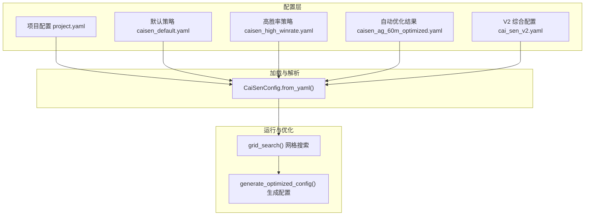
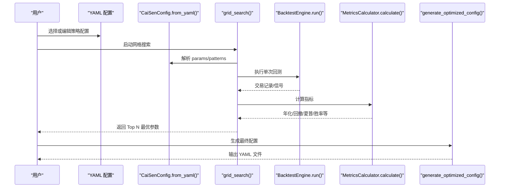
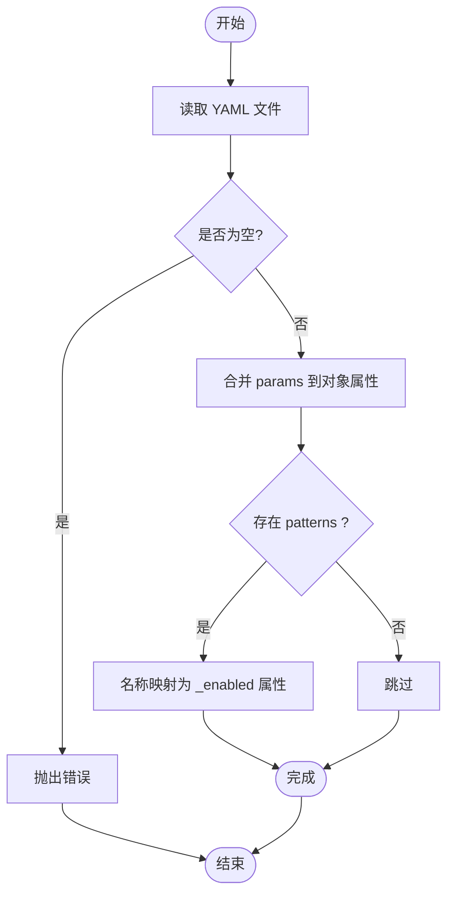
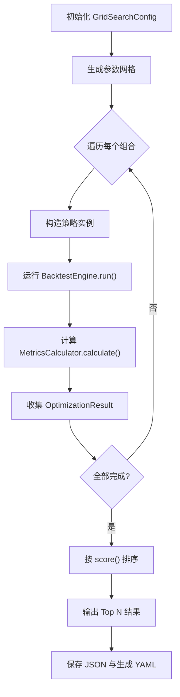
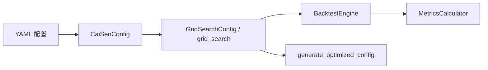

# 配置与参数调优

<cite>
**本文引用的文件**   
- [caisen_default.yaml](file://configs/strategies/caisen_default.yaml)
- [caisen_high_winrate.yaml](file://configs/strategies/caisen_high_winrate.yaml)
- [caisen_ag_60m_optimized.yaml](file://configs/strategies/caisen_ag_60m_optimized.yaml)
- [cai_sen_v2.yaml](file://configs/strategies/cai_sen_v2.yaml)
- [project.yaml](file://configs/project.yaml)
- [caisen_config.py](file://src/caisen/strategy/algorithm/caisen_config.py)
- [caisen_optimizer.py](file://src/caisen/strategy/algorithm/caisen_optimizer.py)
- [0019-adaptive-parameter-optimization.md](file://docs/adr/0019-adaptive-parameter-optimization.md)
- [optimization-plan.md](file://docs/optimization-plan.md)
- [caisen_strategy_template.yaml](file://examples/caisen_strategy_template.yaml)
</cite>

## 目录
1. [引言](#引言)
2. [项目结构](#项目结构)
3. [核心组件](#核心组件)
4. [架构总览](#架构总览)
5. [详细组件分析](#详细组件分析)
6. [依赖关系分析](#依赖关系分析)
7. [性能与计算复杂度](#性能与计算复杂度)
8. [故障排查指南](#故障排查指南)
9. [结论](#结论)
10. [附录：常用模板与最佳实践](#附录：常用模板与最佳实践)

## 引言
本指南面向蔡森策略的配置管理与参数调优，目标是帮助读者快速理解配置文件结构、掌握关键参数的作用与影响、在不同市场环境下进行稳健的参数选择，并建立系统化的优化方法论（网格搜索、贝叶斯优化、Walk-Forward 验证等）。文档同时覆盖版本管理与迁移策略、敏感性分析与鲁棒性测试方法，并提供可直接复用的配置模板与最佳实践。

## 项目结构
本项目将策略配置分为两类：
- 策略级配置：位于 configs/strategies 下的 YAML 文件，定义形态开关、权重、风控与检测器参数等。
- 项目级配置：位于 configs/project.yaml，定义数据目录、输出目录、Web 端口等全局设置。

图表来源
- [project.yaml:1-13](file://configs/project.yaml#L1-L13)
- [caisen_config.py:70-114](file://src/caisen/strategy/algorithm/caisen_config.py#L70-L114)
- [caisen_optimizer.py:190-305](file://src/caisen/strategy/algorithm/caisen_optimizer.py#L190-L305)
- [caisen_optimizer.py:308-360](file://src/caisen/strategy/algorithm/caisen_optimizer.py#L308-L360)

章节来源
- [project.yaml:1-13](file://configs/project.yaml#L1-L13)
- [caisen_config.py:70-114](file://src/caisen/strategy/algorithm/caisen_config.py#L70-L114)
- [caisen_optimizer.py:190-305](file://src/caisen/strategy/algorithm/caisen_optimizer.py#L190-L305)
- [caisen_optimizer.py:308-360](file://src/caisen/strategy/algorithm/caisen_optimizer.py#L308-L360)

## 核心组件
- 配置加载器 CaiSenConfig：负责从 YAML 读取 params 与 patterns，映射到内部属性；提供 to_dict 导出。
- 网格搜索优化器 grid_search：在预定义参数空间内并行回测，按综合评分排序，输出 Top N 最优结果。
- 配置生成器 generate_optimized_config：将最优结果写为可运行的 YAML 配置。
- 自适应优化 ADR-0019：提出以 Optuna TPE + Walk-Forward + 自适应触发为核心的下一代优化引擎。

章节来源
- [caisen_config.py:11-145](file://src/caisen/strategy/algorithm/caisen_config.py#L11-L145)
- [caisen_optimizer.py:17-108](file://src/caisen/strategy/algorithm/caisen_optimizer.py#L17-L108)
- [caisen_optimizer.py:190-305](file://src/caisen/strategy/algorithm/caisen_optimizer.py#L190-L305)
- [caisen_optimizer.py:308-360](file://src/caisen/strategy/algorithm/caisen_optimizer.py#L308-L360)
- [0019-adaptive-parameter-optimization.md:1-98](file://docs/adr/0019-adaptive-parameter-optimization.md#L1-L98)

## 架构总览
下图展示“配置→加载→回测→评估→生成”的端到端流程。

图表来源
- [caisen_config.py:70-114](file://src/caisen/strategy/algorithm/caisen_config.py#L70-L114)
- [caisen_optimizer.py:155-187](file://src/caisen/strategy/algorithm/caisen_optimizer.py#L155-L187)
- [caisen_optimizer.py:190-305](file://src/caisen/strategy/algorithm/caisen_optimizer.py#L190-L305)
- [caisen_optimizer.py:308-360](file://src/caisen/strategy/algorithm/caisen_optimizer.py#L308-L360)

## 详细组件分析

### 配置文件结构与字段说明
- 平台检测参数
  - platform_min_bars：平台最少 K 线数，过小易误判，过大可能错过机会。
  - platform_max_amplitude：平台最大振幅，控制“整理区间”的波动范围。
  - platform_volume_decline：是否要求量能退潮，有助于过滤假突破。
- 破底翻参数
  - breakdown_max_pct / breakdown_max_bars / pullback_max_bars：控制破底幅度、时间与拉回窗口。
  - volume_confirm：成交量确认开关，提升信号质量。
- 仓位管理
  - first_position_pct / second_position_pct：两加码点仓位比例，影响风险暴露与收益弹性。
- 风险控制
  - stop_loss_factor：止损系数（相对形态低点），越小越紧。
  - min_profit_pct：最小盈利目标，过滤低期望交易。
  - trailing_stop_pct / trailing_stop_enabled：移动止损参数，用于锁定利润。
  - long_only_mode / max_loss_pct：方向限制与最大亏损容忍度。
- 形态开关与权重
  - patterns：布尔开关，控制启用哪些形态。
  - pattern_weights：各形态对质量评分的贡献权重。
- V2 新增维度
  - weights：形态权重（影响最终评分）。
  - risk：集中式风控参数块。
  - enabled_patterns：形态启用开关集合。
  - detectors：各检测器专用参数（如容差、周期、振幅等）。
  - confidence_factors：置信度因子权重与阈值。

章节来源
- [caisen_default.yaml:1-50](file://configs/strategies/caisen_default.yaml#L1-L50)
- [caisen_high_winrate.yaml:1-23](file://configs/strategies/caisen_high_winrate.yaml#L1-L23)
- [caisen_ag_60m_optimized.yaml:1-35](file://configs/strategies/caisen_ag_60m_optimized.yaml#L1-L35)
- [cai_sen_v2.yaml:1-145](file://configs/strategies/cai_sen_v2.yaml#L1-L145)
- [caisen_config.py:11-68](file://src/caisen/strategy/algorithm/caisen_config.py#L11-L68)

### 配置加载与映射机制
- from_yaml 读取 YAML 的 params 与 patterns 两个顶层键。
- params 中的键直接覆盖 CaiSenConfig 对应属性。
- patterns 通过名称映射表转换为 _enabled 属性（如 W_BOTTOM → w_bottom_enabled）。
- to_dict 用于导出完整配置字典，便于保存或二次处理。

图表来源
- [caisen_config.py:70-114](file://src/caisen/strategy/algorithm/caisen_config.py#L70-L114)

章节来源
- [caisen_config.py:70-114](file://src/caisen/strategy/algorithm/caisen_config.py#L70-L114)

### 网格搜索优化流程
- GridSearchConfig 定义参数搜索空间与形态开关组合。
- _generate_param_grid 使用笛卡尔积生成所有参数组合。
- grid_search 并行执行回测，计算指标并按综合评分排序。
- generate_optimized_config 将最优结果写入 YAML。

图表来源
- [caisen_optimizer.py:58-152](file://src/caisen/strategy/algorithm/caisen_optimizer.py#L58-L152)
- [caisen_optimizer.py:155-187](file://src/caisen/strategy/algorithm/caisen_optimizer.py#L155-L187)
- [caisen_optimizer.py:190-305](file://src/caisen/strategy/algorithm/caisen_optimizer.py#L190-L305)
- [caisen_optimizer.py:308-360](file://src/caisen/strategy/algorithm/caisen_optimizer.py#L308-L360)

章节来源
- [caisen_optimizer.py:58-152](file://src/caisen/strategy/algorithm/caisen_optimizer.py#L58-L152)
- [caisen_optimizer.py:190-305](file://src/caisen/strategy/algorithm/caisen_optimizer.py#L190-L305)
- [caisen_optimizer.py:308-360](file://src/caisen/strategy/algorithm/caisen_optimizer.py#L308-L360)

### 不同市场环境下的参数调优建议
- 牛市（趋势延续性强）
  - 放宽平台振幅与平台最小 K 线，提高捕捉趋势效率。
  - 适度收紧止损系数，配合移动止损锁定利润。
  - 倾向启用更多趋势跟随型形态（如三角、旗形、过前高）。
- 熊市（下行压力大）
  - 严格止损与最小盈利目标，降低回撤。
  - 减少形态数量，聚焦高确定性反转形态（头肩顶、M 头等）。
  - 考虑开启只做多头模式以规避做空风险（若策略支持）。
- 震荡市（区间波动为主）
  - 缩小平台振幅，缩短平台最小 K 线，避免过度等待。
  - 提高成交量确认阈值，过滤假突破。
  - 采用更保守的形态权重，优先底部反转形态。

以上建议需结合历史回测与样本外验证进行微调，避免单一经验导致的过拟合。

[本节为通用指导，不直接分析具体文件]

### 参数优化方法论
- 网格搜索（当前实现）
  - 优点：简单直观、可并行、结果稳定可复现。
  - 缺点：维度灾难、无剪枝、易过拟合。
- 贝叶斯优化（Optuna TPE）+ Walk-Forward
  - 优点：高维空间高效、具备剪枝能力、样本外泛化更强。
  - 缺点：引入外部依赖、调试门槛提升、单次优化时间增加。
- 遗传算法/粒子群
  - 适用于复杂多目标与非凸空间，但实现成本高、收益不确定。

章节来源
- [0019-adaptive-parameter-optimization.md:1-98](file://docs/adr/0019-adaptive-parameter-optimization.md#L1-L98)
- [optimization-plan.md:1-68](file://docs/optimization-plan.md#L1-L68)

### 配置文件版本管理与迁移策略
- 版本化命名
  - 使用带时间戳或版本号的文件名（如 caisen_ag_60m_optimized.yaml），并在头部记录生成时间与评分。
- 基线与增量
  - 保留基线配置（如 caisen_default.yaml），每次优化产出独立文件，便于对比与回溯。
- 向后兼容
  - 新字段应提供默认值，旧配置缺失时自动回退到默认值。
- 迁移路径
  - 从 V1（params/patterns）向 V2（weights/risk/detectors/confidence_factors）迁移时，保持字段映射清晰，必要时提供转换脚本。

章节来源
- [caisen_ag_60m_optimized.yaml:1-35](file://configs/strategies/caisen_ag_60m_optimized.yaml#L1-L35)
- [caisen_config.py:70-114](file://src/caisen/strategy/algorithm/caisen_config.py#L70-L114)
- [cai_sen_v2.yaml:1-145](file://configs/strategies/cai_sen_v2.yaml#L1-L145)

### 参数敏感性分析与鲁棒性测试
- 单因素敏感性
  - 固定其他参数，逐一扫描关键参数（如 stop_loss_factor、min_profit_pct、platform_min_bars），观察指标变化曲线。
- 交叉敏感性
  - 针对强耦合参数对（如 stop_loss_factor × trailing_stop_pct）进行二维网格扫描，识别协同效应。
- 鲁棒性测试
  - 跨标的/跨周期验证：在多个品种与时间框架上重复优化，评估稳定性。
  - 样本外滚动验证：按时间切分训练/测试集，确保参数在未见数据上表现稳健。
  - 噪声注入：对价格/成交量加入小幅扰动，检验策略对数据质量的敏感度。

[本节为通用指导，不直接分析具体文件]

## 依赖关系分析
- 配置加载依赖 YAML 解析与 dataclass 属性映射。
- 优化器依赖回测引擎与指标计算器，形成“配置→策略→引擎→指标”的链路。
- 项目级配置与策略配置解耦，便于统一管理与环境切换。

图表来源
- [caisen_config.py:70-114](file://src/caisen/strategy/algorithm/caisen_config.py#L70-L114)
- [caisen_optimizer.py:155-187](file://src/caisen/strategy/algorithm/caisen_optimizer.py#L155-L187)
- [caisen_optimizer.py:190-305](file://src/caisen/strategy/algorithm/caisen_optimizer.py#L190-L305)
- [caisen_optimizer.py:308-360](file://src/caisen/strategy/algorithm/caisen_optimizer.py#L308-L360)

章节来源
- [caisen_config.py:70-114](file://src/caisen/strategy/algorithm/caisen_config.py#L70-L114)
- [caisen_optimizer.py:155-187](file://src/caisen/strategy/algorithm/caisen_optimizer.py#L155-L187)
- [caisen_optimizer.py:190-305](file://src/caisen/strategy/algorithm/caisen_optimizer.py#L190-L305)
- [caisen_optimizer.py:308-360](file://src/caisen/strategy/algorithm/caisen_optimizer.py#L308-L360)

## 性能与计算复杂度
- 网格搜索复杂度
  - 组合数 = ∏(各参数取值个数) × 形态开关组合数。
  - 典型规模约千级别组合，可通过并行线程加速。
- 内存与 IO
  - 单次回测结果较小，主要开销在 CPU 计算与磁盘 IO（JSON/YAML 读写）。
- 优化建议
  - 合理划分参数粒度，避免过细导致组合爆炸。
  - 使用多线程并行，注意线程安全与资源隔离。
  - 对失败组合进行异常捕获与日志记录，保证整体进度不受影响。

[本节为通用指导，不直接分析具体文件]

## 故障排查指南
- 配置文件为空或路径不存在
  - 现象：加载时报错。
  - 处理：检查 YAML 路径与内容完整性。
- 形态名称映射失败
  - 现象：patterns 未生效。
  - 原因：YAML 名称与属性名不一致。
  - 处理：遵循映射表（如 HEAD_AND_SHOULDERS_BOTTOM → head_and_shoulders_bottom_enabled）。
- 优化过程中出现异常
  - 现象：部分组合失败，进度中断。
  - 处理：查看错误日志，定位参数非法或数据问题；必要时缩小搜索空间。

章节来源
- [caisen_config.py:70-82](file://src/caisen/strategy/algorithm/caisen_config.py#L70-L82)
- [caisen_config.py:94-114](file://src/caisen/strategy/algorithm/caisen_config.py#L94-L114)
- [caisen_optimizer.py:155-187](file://src/caisen/strategy/algorithm/caisen_optimizer.py#L155-L187)

## 结论
通过分层配置与系统化优化流程，蔡森策略可在不同市场环境中实现稳健的参数选择与持续演进。建议以网格搜索作为基线，逐步引入贝叶斯优化与 Walk-Forward 验证，并结合敏感性分析与鲁棒性测试，确保参数在样本外依然有效。版本化管理与迁移策略则保障配置的可追溯性与可维护性。

[本节为总结性内容，不直接分析具体文件]

## 附录：常用模板与最佳实践
- 推荐模板
  - 基础模板：参考示例模板，包含策略、回测、数据源与指标清单。
  - 高胜率模板：侧重严格风控与高确定性形态。
  - 自动优化模板：由优化器生成的最新配置，附带评分与时间戳。
- 最佳实践
  - 先粗后细：先用宽范围网格筛选候选区域，再在局部细化。
  - 多目标平衡：兼顾年化、回撤、夏普与胜率，避免单一指标过拟合。
  - 样本外验证：务必进行滚动窗口或 Hold-out 验证。
  - 配置即代码：将配置纳入版本控制，记录变更原因与效果。

章节来源
- [caisen_strategy_template.yaml:1-59](file://examples/caisen_strategy_template.yaml#L1-L59)
- [caisen_high_winrate.yaml:1-23](file://configs/strategies/caisen_high_winrate.yaml#L1-L23)
- [caisen_ag_60m_optimized.yaml:1-35](file://configs/strategies/caisen_ag_60m_optimized.yaml#L1-L35)