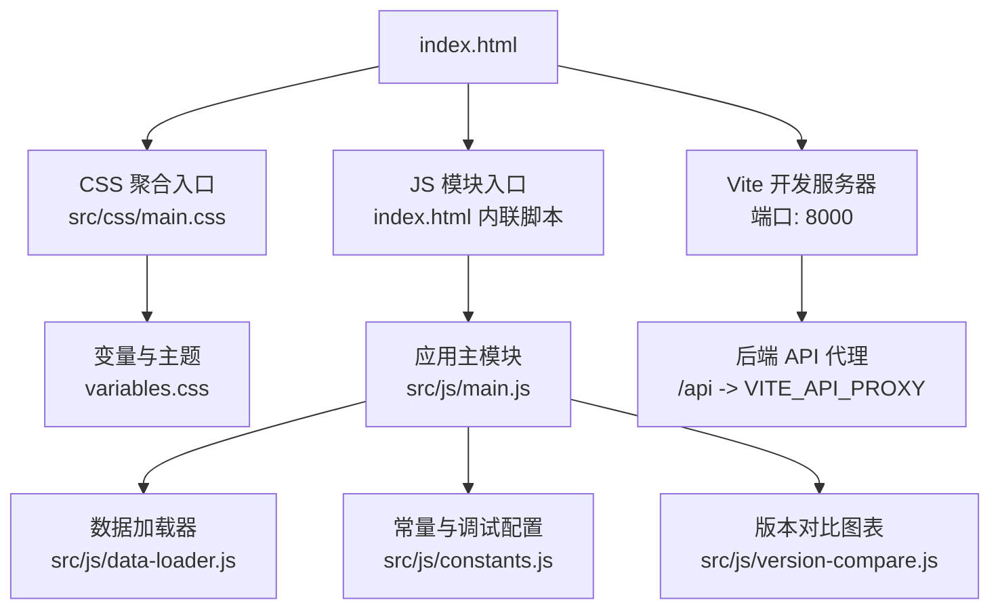
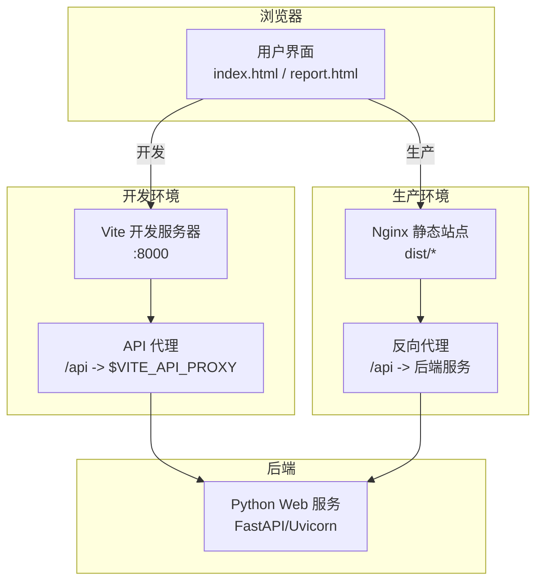
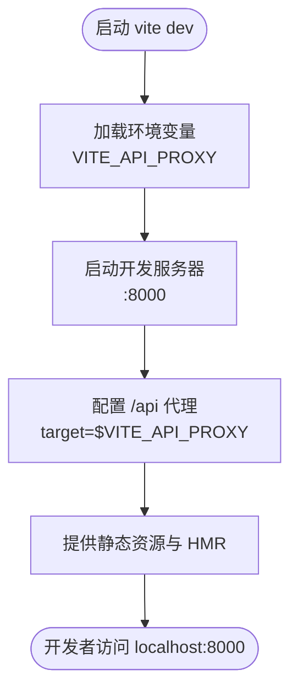
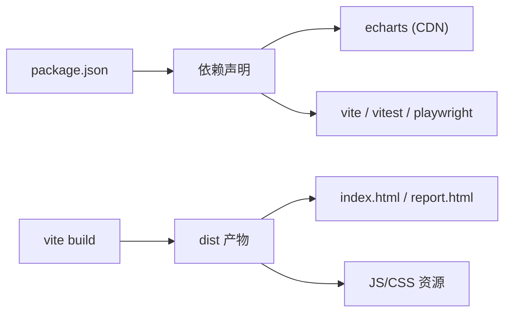

# 前端构建与部署

<cite>
**本文引用的文件**   
- [vite.config.js](file://src/caisen/frontend/vite.config.js)
- [package.json](file://src/caisen/frontend/package.json)
- [index.html](file://src/caisen/frontend/index.html)
- [report.html](file://src/caisen/frontend/report.html)
- [main.css](file://src/caisen/frontend/src/css/main.css)
- [variables.css](file://src/caisen/frontend/src/css/variables.css)
- [main.js](file://src/caisen/frontend/src/js/main.js)
- [constants.js](file://src/caisen/frontend/src/js/constants.js)
- [data-loader.js](file://src/caisen/frontend/src/js/data-loader.js)
- [version-compare.js](file://src/caisen/frontend/src/js/version-compare.js)
- [playwright.config.js](file://src/caisen/frontend/playwright.config.js)
- [cli/main.py](file://src/caisen/cli/main.py)
- [web/main.py](file://src/caisen/web/main.py)
</cite>

## 目录
1. [简介](#简介)
2. [项目结构](#项目结构)
3. [核心组件](#核心组件)
4. [架构总览](#架构总览)
5. [详细组件分析](#详细组件分析)
6. [依赖分析](#依赖分析)
7. [性能考虑](#性能考虑)
8. [故障排查指南](#故障排查指南)
9. [结论](#结论)
10. [附录](#附录)

## 简介
本文件面向 Caisen 量化回测系统的前端工程，聚焦于基于 Vite 的构建与部署实践。内容覆盖开发服务器、生产打包、静态资源策略、代码分割与懒加载、CDN 与缓存、Nginx 反向代理与 HTTPS、前端监控集成以及资源优化技巧。文档以仓库现有实现为依据，并给出可落地的扩展建议。

## 项目结构
前端位于 src/caisen/frontend 目录，采用 Vite 作为构建工具，入口为 index.html 与 report.html，样式通过 CSS 模块化导入聚合，JS 模块按功能拆分并在入口集中初始化。

图示来源
- [vite.config.js:1-43](file://src/caisen/frontend/vite.config.js#L1-L43)
- [index.html:1-135](file://src/caisen/frontend/index.html#L1-L135)
- [main.css:1-7](file://src/caisen/frontend/src/css/main.css#L1-L7)
- [variables.css:1-106](file://src/caisen/frontend/src/css/variables.css#L1-L106)
- [main.js:1-96](file://src/caisen/frontend/src/js/main.js#L1-L96)
- [constants.js:1-109](file://src/caisen/frontend/src/js/constants.js#L1-L109)
- [data-loader.js:145-182](file://src/caisen/frontend/src/js/data-loader.js#L145-L182)
- [version-compare.js:1-48](file://src/caisen/frontend/src/js/version-compare.js#L1-L48)

章节来源
- [vite.config.js:1-43](file://src/caisen/frontend/vite.config.js#L1-L43)
- [package.json:1-26](file://src/caisen/frontend/package.json#L1-L26)
- [index.html:1-135](file://src/caisen/frontend/index.html#L1-L135)
- [main.css:1-7](file://src/caisen/frontend/src/css/main.css#L1-L7)
- [variables.css:1-106](file://src/caisen/frontend/src/css/variables.css#L1-L106)
- [main.js:1-96](file://src/caisen/frontend/src/js/main.js#L1-L96)
- [constants.js:1-109](file://src/caisen/frontend/src/js/constants.js#L1-L109)
- [data-loader.js:145-182](file://src/caisen/frontend/src/js/data-loader.js#L145-L182)
- [version-compare.js:1-48](file://src/caisen/frontend/src/js/version-compare.js#L1-L48)

## 核心组件
- 构建与开发服务器
  - 使用 Vite 5，定义多入口（index.html、report.html），输出至 dist，开发服务监听 8000 端口，提供 /api 到后端的代理。
  - 环境变量读取：VITE_API_PROXY 用于指定后端地址，默认 http://localhost:8001。
- 资源与样式
  - CSS 通过 main.css 聚合导入 variables/reset/layout/components/pages 等模块，便于统一主题与布局。
- JS 模块组织
  - main.js 作为应用主模块，导出全局函数供 HTML 内联调用，注册错误捕获与报告页自动加载逻辑。
  - constants.js 提供策略展示名映射、图表配色、布局常量与调试开关。
  - data-loader.js 负责从 API 或本地文件加载数据，处理错误态 UI。
  - version-compare.js 基于 window.echarts 构建版本对比图，避免重复打包。
- 测试与端到端
  - Vitest 单元测试，Playwright 端到端测试，后者启动 Python Web 服务并访问健康检查路径。

章节来源
- [vite.config.js:1-43](file://src/caisen/frontend/vite.config.js#L1-L43)
- [package.json:1-26](file://src/caisen/frontend/package.json#L1-L26)
- [main.css:1-7](file://src/caisen/frontend/src/css/main.css#L1-L7)
- [main.js:1-96](file://src/caisen/frontend/src/js/main.js#L1-L96)
- [constants.js:1-109](file://src/caisen/frontend/src/js/constants.js#L1-L109)
- [data-loader.js:145-182](file://src/caisen/frontend/src/js/data-loader.js#L145-L182)
- [version-compare.js:1-48](file://src/caisen/frontend/src/js/version-compare.js#L1-L48)
- [playwright.config.js:1-30](file://src/caisen/frontend/playwright.config.js#L1-L30)

## 架构总览
下图展示了前端在开发与生产环境下的关键交互：开发时由 Vite 提供热更新与 API 代理；生产时由 Nginx 直接分发静态资源，并通过反向代理将 /api 转发至后端。

图示来源
- [vite.config.js:21-29](file://src/caisen/frontend/vite.config.js#L21-L29)
- [cli/main.py:272-284](file://src/caisen/cli/main.py#L272-L284)
- [web/main.py:216-245](file://src/caisen/web/main.py#L216-L245)

## 详细组件分析

### Vite 构建与开发服务器
- 多入口构建：同时构建 index.html 与 report.html，便于首页列表与详情报告双页面。
- 基础路径：base 设置为相对路径，利于非根路径部署。
- 输出目录：outDir=dist，emptyOutDir=true 保证每次构建清理旧产物。
- 开发服务器：port=8000，/api 代理到 VITE_API_PROXY，支持跨域改写。
- 别名解析：/js 与 /src 指向源码目录，简化引用。
- 测试集成：Vitest 启用 jsdom 环境与全局 API，包含 tests/js/**/*.test.js。

图示来源
- [vite.config.js:1-43](file://src/caisen/frontend/vite.config.js#L1-L43)

章节来源
- [vite.config.js:1-43](file://src/caisen/frontend/vite.config.js#L1-L43)

### 静态资源打包策略
- 当前实现中，ECharts 通过 CDN 引入，避免打包体积膨胀，且与版本对比模块保持一致的全局实例。
- CSS 通过 main.css 聚合导入，构建时会合并与压缩（由 Vite 默认行为完成）。
- 图片与字体：建议使用 import 或 URL 引用方式纳入构建，以便获得哈希与压缩；若需外部托管，可在 HTML 中以绝对 URL 引入。

章节来源
- [index.html:1-135](file://src/caisen/frontend/index.html#L1-L135)
- [main.css:1-7](file://src/caisen/frontend/src/css/main.css#L1-L7)
- [version-compare.js:1-48](file://src/caisen/frontend/src/js/version-compare.js#L1-L48)

### 代码分割与懒加载
- 现状：未显式配置动态 import 或 Rollup 分包策略，主要依赖单入口 HTML 与模块按需加载。
- 建议：
  - 对大体积模块（如图表渲染、复杂计算）使用动态 import() 进行路由级或事件级懒加载。
  - 利用 Vite 的预构建与分包能力，结合 rollupOptions.output.manualChunks 将第三方库独立拆分。
  - 对 report.html 与 index.html 共享模块提取公共 chunk，减少重复下载。

章节来源
- [vite.config.js:14-19](file://src/caisen/frontend/vite.config.js#L14-L19)
- [index.html:120-132](file://src/caisen/frontend/index.html#L120-L132)

### 资源压缩与优化
- 默认开启：Vite 在生产构建中对 JS/CSS 进行压缩与 Tree-shaking。
- 字体与图片：
  - 字体：优先使用 woff2，配合 font-display: swap 提升首屏体验。
  - 图片：使用现代格式（WebP/AVIF），按需加载与响应式尺寸。
- 缓存策略：
  - 静态资源文件名带内容哈希，浏览器可长期缓存。
  - HTML 不缓存或短缓存，确保新版本及时生效。

章节来源
- [vite.config.js:11-19](file://src/caisen/frontend/vite.config.js#L11-L19)

### CDN 部署方案
- 适用场景：将 dist 静态资源上传至对象存储或 CDN，HTML 中引用 CDN 域名。
- 要点：
  - base 保持相对路径或改为 CDN 根路径，确保资源路径正确。
  - 第三方库（如 ECharts）可通过 CDN 引入，降低包体与首次加载时间。
  - 版本管理：通过发布版本号或 Git SHA 注入环境变量，控制缓存失效。

章节来源
- [index.html:1-135](file://src/caisen/frontend/index.html#L1-L135)
- [vite.config.js:9-10](file://src/caisen/frontend/vite.config.js#L9-L10)

### Nginx 反向代理与 HTTPS
- 静态站点：将 Nginx 根目录指向 dist，启用 gzip/brotli 压缩与 HTTP/2。
- 反向代理：将 /api 请求转发至后端服务（如 FastAPI/Uvicorn）。
- HTTPS：配置证书与强制跳转 HTTPS，设置安全头（HSTS、CSP 等）。
- 缓存：
  - 静态资源长缓存（1 年），HTML 短缓存或不缓存。
  - 针对 ETag/Last-Modified 合理配置，避免无效校验。

章节来源
- [web/main.py:216-245](file://src/caisen/web/main.py#L216-L245)

### 前端监控集成
- 错误追踪：
  - 已在 main.js 中注册 window.onerror 与 unhandledrejection，统一上报。
  - 建议接入 Sentry/Rum SDK，将错误信息、堆栈与上下文上报至服务端。
- 性能监控：
  - 使用 Performance Observer 采集 LCP/FID/CLS 等指标。
  - 对关键图表渲染耗时埋点，评估大数据量下的交互性能。
- 用户行为分析：
  - 对“开始回测”、“刷新列表”、“查看示例”等关键操作埋点。
  - 结合用户会话 ID 与运行 ID（run_id）关联分析。

章节来源
- [main.js:37-47](file://src/caisen/frontend/src/js/main.js#L37-L47)
- [index.html:110-117](file://src/caisen/frontend/index.html#L110-L117)

### 前端资源优化技巧
- 图片优化：
  - 使用 WebP/AVIF，按需加载，懒加载可视区域图片。
  - 大图分块或切片渲染，避免阻塞主线程。
- 字体优化：
  - 仅加载必要字重，子集化字体，使用 preload 与 preconnect。
- 首屏加速：
  - 关键 CSS 内联，非关键 CSS 异步加载。
  - 延迟加载非关键 JS 模块，优先渲染骨架屏。
  - 对 ECharts 等大型库采用 CDN 与按需引入。

章节来源
- [index.html:7-11](file://src/caisen/frontend/index.html#L7-L11)
- [main.css:1-7](file://src/caisen/frontend/src/css/main.css#L1-L7)
- [version-compare.js:1-48](file://src/caisen/frontend/src/js/version-compare.js#L1-L48)

## 依赖分析
- 运行时依赖：echarts（通过 CDN 引入，避免打包）。
- 开发依赖：vite、vitest、@vitest/ui、jsdom、@playwright/test。
- 构建产物：dist 下包含 index.html、report.html 及其对应 JS/CSS 资源。

图示来源
- [package.json:1-26](file://src/caisen/frontend/package.json#L1-L26)
- [vite.config.js:11-19](file://src/caisen/frontend/vite.config.js#L11-L19)

章节来源
- [package.json:1-26](file://src/caisen/frontend/package.json#L1-L26)
- [vite.config.js:11-19](file://src/caisen/frontend/vite.config.js#L11-L19)

## 性能考虑
- 首屏加载：
  - 关键资源预连接与预加载，减少 DNS/TLS 握手开销。
  - 将 ECharts 等大库置于 CDN，利用浏览器缓存。
- 网络传输：
  - 启用 gzip/brotli，HTTP/2 多路复用。
  - 合理设置 Cache-Control 与 ETag，减少重复传输。
- 渲染性能：
  - 大数据量图表采用增量渲染与虚拟滚动。
  - 避免在主线程执行重型计算，必要时使用 Web Worker。

[本节为通用指导，无需特定文件来源]

## 故障排查指南
- 开发环境无法访问后端 API
  - 检查 VITE_API_PROXY 是否设置，确认代理规则 /api 是否正确转发。
  - 验证后端服务是否启动并可被代理访问。
- 报告页数据不可用
  - 检查 run_id 参数是否存在，确认后端返回的数据结构与字段。
  - 查看 data-loader.js 的错误处理分支，定位具体失败原因。
- 图表不显示或报错
  - 确认 window.echarts 已加载（CDN 或全局注入）。
  - 检查版本对比模块是否正确使用全局实例。
- 端到端测试失败
  - 检查 Playwright 配置的 webServer 命令与健康检查路径。
  - 确认后端服务端口与前端端口无冲突。

章节来源
- [vite.config.js:21-29](file://src/caisen/frontend/vite.config.js#L21-L29)
- [data-loader.js:145-182](file://src/caisen/frontend/src/js/data-loader.js#L145-L182)
- [version-compare.js:1-48](file://src/caisen/frontend/src/js/version-compare.js#L1-L48)
- [playwright.config.js:24-28](file://src/caisen/frontend/playwright.config.js#L24-L28)

## 结论
本项目前端基于 Vite 实现了简洁高效的构建与开发体验，采用多入口与模块化组织，结合 CDN 与相对路径部署，具备良好的可扩展性。建议在后续迭代中完善代码分割、监控埋点与资源优化策略，进一步提升首屏性能与可观测性。

[本节为总结，无需特定文件来源]

## 附录

### 常用命令
- 安装依赖：npm install
- 开发模式：npm run dev
- 生产构建：npm run build
- 预览构建产物：npm run preview
- 单元测试：npm test
- 端到端测试：npm run test:e2e

章节来源
- [package.json:6-14](file://src/caisen/frontend/package.json#L6-L14)

### 开发流程与集成
- CLI 集成：CLI 会先启动后端服务，再启动 Vite 开发服务器，并将 VITE_API_PROXY 注入为后端地址。
- 健康检查：Playwright 通过 /health 判断后端就绪。

章节来源
- [cli/main.py:272-284](file://src/caisen/cli/main.py#L272-L284)
- [playwright.config.js:24-28](file://src/caisen/frontend/playwright.config.js#L24-L28)