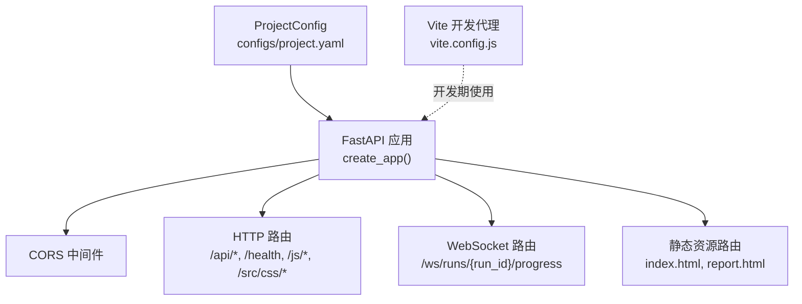
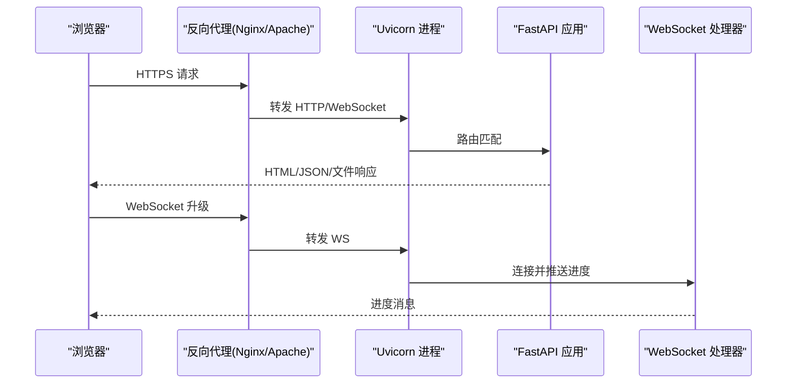
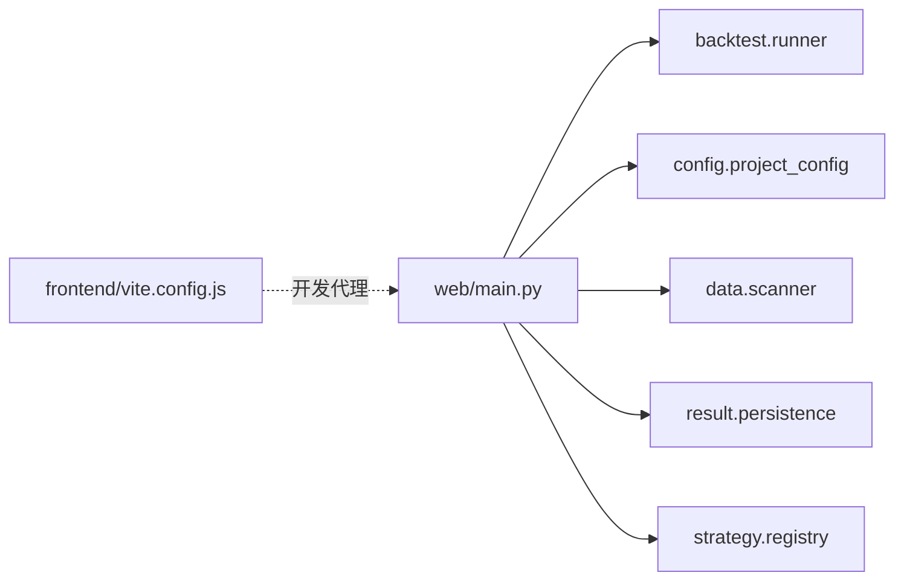

# Web 服务器部署

<cite>
**本文引用的文件**   
- [src/caisen/web/main.py](file://src/caisen/web/main.py)
- [src/caisen/config/project_config.py](file://src/caisen/config/project_config.py)
- [configs/project.yaml](file://configs/project.yaml)
- [README.md](file://README.md)
- [src/caisen/frontend/vite.config.js](file://src/caisen/frontend/vite.config.js)
- [tests/test_web_api.py](file://tests/test_web_api.py)
- [tests/test_path_traversal.py](file://tests/test_path_traversal.py)
</cite>

## 目录
1. [简介](#简介)
2. [项目结构](#项目结构)
3. [核心组件](#核心组件)
4. [架构总览](#架构总览)
5. [详细组件分析](#详细组件分析)
6. [依赖关系分析](#依赖关系分析)
7. [性能与生产调优](#性能与生产调优)
8. [安全与 CORS 配置](#安全与-cors-配置)
9. [静态资源与 CDN 集成](#静态资源与-cdn-集成)
10. [HTTPS 与反向代理](#https-与反向代理)
11. [日志与监控](#日志与监控)
12. [故障排查指南](#故障排查指南)
13. [结论](#结论)

## 简介
本文件面向生产环境，提供 Caisen 量化回测系统的 Web 服务部署指南。内容覆盖 FastAPI 应用的生产配置、Uvicorn 启动参数与多进程管理、CORS 与安全策略、静态资源缓存与 CDN 方案、HTTPS 证书与反向代理（Nginx/Apache）示例、结构化日志与健康检查端点等。文档严格基于仓库现有实现进行说明，并在需要处给出可操作的部署建议。

## 项目结构
Web 服务入口位于 src/caisen/web/main.py，通过 create_app 构建 FastAPI 实例，内置健康检查、数据源/策略列表、回测触发与结果查询、WebSocket 进度推送以及前端静态资源路由。全局配置由 configs/project.yaml 驱动，默认值在 src/caisen/config/project_config.py 中定义。

图表来源
- [src/caisen/web/main.py:68-83](file://src/caisen/web/main.py#L68-L83)
- [src/caisen/web/main.py:86-245](file://src/caisen/web/main.py#L86-L245)
- [src/caisen/config/project_config.py:17-55](file://src/caisen/config/project_config.py#L17-L55)
- [src/caisen/frontend/vite.config.js:21-29](file://src/caisen/frontend/vite.config.js#L21-L29)

章节来源
- [src/caisen/web/main.py:68-319](file://src/caisen/web/main.py#L68-L319)
- [src/caisen/config/project_config.py:17-55](file://src/caisen/config/project_config.py#L17-L55)
- [configs/project.yaml:1-13](file://configs/project.yaml#L1-L13)
- [src/caisen/frontend/vite.config.js:1-43](file://src/caisen/frontend/vite.config.js#L1-L43)

## 核心组件
- FastAPI 应用创建：title/description/version 设置，CORS 中间件挂载，路由注册，返回 app 实例。
- 配置加载：从 configs/project.yaml 读取 data_dir、output_dir、api_port；缺失时回退到内嵌默认值。
- 健康检查：/health 返回 {"status": "ok"}。
- 静态资源：/ 返回 index.html，/report.html 返回报告页，/js/{filename} 和 /src/css/{filename} 提供 JS/CSS。
- API 路由：数据源列表、策略列表、创建回测任务、列出/获取回测结果、可视化数据直出。
- WebSocket：/ws/runs/{run_id}/progress 实时推送回测进度。
- Uvicorn 启动：serve 函数调用 uvicorn.run，支持 host/port/log_level 参数。

章节来源
- [src/caisen/web/main.py:68-106](file://src/caisen/web/main.py#L68-L106)
- [src/caisen/web/main.py:107-227](file://src/caisen/web/main.py#L107-L227)
- [src/caisen/web/main.py:228-319](file://src/caisen/web/main.py#L228-L319)
- [src/caisen/config/project_config.py:17-55](file://src/caisen/config/project_config.py#L17-L55)
- [configs/project.yaml:1-13](file://configs/project.yaml#L1-L13)

## 架构总览
下图展示生产环境下典型访问路径：浏览器请求经由反向代理（Nginx/Apache）转发至 Uvicorn，再由 FastAPI 分发到对应路由或 WebSocket 处理器。

图表来源
- [src/caisen/web/main.py:224-227](file://src/caisen/web/main.py#L224-L227)
- [src/caisen/web/main.py:247-303](file://src/caisen/web/main.py#L247-L303)

## 详细组件分析

### FastAPI 应用与中间件
- 应用元信息：标题、描述、版本在 create_app 中设置。
- CORS 中间件：当前允许所有来源、方法和头，并允许携带凭据。生产环境应收紧为具体域名白名单与最小必要头集合。
- 路由组织：根路由返回前端入口，/api/* 提供业务接口，/health 用于健康检查，/js/* 与 /src/css/* 提供前端资源。

章节来源
- [src/caisen/web/main.py:68-83](file://src/caisen/web/main.py#L68-L83)
- [src/caisen/web/main.py:86-106](file://src/caisen/web/main.py#L86-L106)
- [src/caisen/web/main.py:224-245](file://src/caisen/web/main.py#L224-L245)

### 配置系统
- ProjectConfig 从 configs/project.yaml 加载 data_dir、output_dir、api_port，不存在则使用默认值。
- Web 服务启动端口默认来自 api_port，可通过 CLI 或环境变量覆盖（见 README）。

章节来源
- [src/caisen/config/project_config.py:17-55](file://src/caisen/config/project_config.py#L17-L55)
- [configs/project.yaml:1-13](file://configs/project.yaml#L1-L13)
- [README.md:173-185](file://README.md#L173-L185)

### 健康检查端点
- GET /health 返回 {"status": "ok"}，可用于负载均衡器或编排平台的健康探测。

章节来源
- [src/caisen/web/main.py:224-227](file://src/caisen/web/main.py#L224-L227)
- [tests/test_web_api.py:19-25](file://tests/test_web_api.py#L19-L25)

### 静态资源与前端路由
- / 返回 index.html，/report.html 返回报告页面。
- /js/{filename} 与 /src/css/{filename} 提供 JS/CSS 模块，内部使用 _safe_resolve 防止路径遍历。
- 开发期 Vite 通过代理将 /api 请求转发到后端，便于本地联调。

章节来源
- [src/caisen/web/main.py:86-94](file://src/caisen/web/main.py#L86-L94)
- [src/caisen/web/main.py:216-245](file://src/caisen/web/main.py#L216-L245)
- [src/caisen/frontend/vite.config.js:21-29](file://src/caisen/frontend/vite.config.js#L21-L29)

### WebSocket 进度推送
- /ws/runs/{run_id}/progress 建立连接后在后台线程执行回测，通过队列桥接 on_progress 回调，向客户端推送运行状态与完成信号，超时或异常会关闭连接。

章节来源
- [src/caisen/web/main.py:247-303](file://src/caisen/web/main.py#L247-L303)

### 安全：路径遍历防护
- _safe_resolve 拒绝包含 ..、/、\ 的输入，并校验解析后的路径是否仍在允许的 base_dir 下，避免越权访问。

章节来源
- [src/caisen/web/main.py:28-39](file://src/caisen/web/main.py#L28-L39)
- [tests/test_path_traversal.py:15-52](file://tests/test_path_traversal.py#L15-L52)

## 依赖关系分析
- web/main.py 依赖：
  - backtest.runner.BacktestRunner：执行回测
  - config.project_config.ProjectConfig：加载项目配置
  - data.scanner.DataSourceScanner：扫描本地数据源
  - result.persistence.ResultPersister：读写回测结果
  - strategy.registry.StrategyRegistry：策略注册表
- 前端 vite.config.js 在开发期通过代理访问后端 /api。

图表来源
- [src/caisen/web/main.py:17-21](file://src/caisen/web/main.py#L17-L21)
- [src/caisen/frontend/vite.config.js:21-29](file://src/caisen/frontend/vite.config.js#L21-L29)

章节来源
- [src/caisen/web/main.py:17-21](file://src/caisen/web/main.py#L17-L21)
- [src/caisen/frontend/vite.config.js:1-43](file://src/caisen/frontend/vite.config.js#L1-L43)

## 性能与生产调优
- 进程模型
  - 当前 serve 函数仅以单进程模式启动 Uvicorn。生产环境建议使用多 worker 提升并发能力。
  - 推荐方式：通过命令行参数 --workers 指定 worker 数量，或使用 systemd/supervisor 拉起多个进程。
- 绑定地址与端口
  - 默认监听 0.0.0.0，端口可从 configs/project.yaml 的 api_port 读取或通过 CLI 覆盖。
- 日志级别
  - 默认 log_level="info"，生产可根据需求调整为 warning 以减少 I/O。
- 前端静态资源
  - 生产建议将前端构建产物（dist）交由 Nginx/Apache 直接托管，减少 Python 层负担。
- 数据库/磁盘 I/O
  - 回测结果持久化涉及 Parquet 读写，确保输出目录所在磁盘具备足够吞吐与空间。

章节来源
- [src/caisen/web/main.py:311-319](file://src/caisen/web/main.py#L311-L319)
- [src/caisen/config/project_config.py:17-55](file://src/caisen/config/project_config.py#L17-L55)
- [configs/project.yaml:1-13](file://configs/project.yaml#L1-L13)
- [README.md:173-185](file://README.md#L173-L185)

## 安全与 CORS 配置
- 现状
  - CORS 允许所有来源、方法与头，且允许携带凭据，适合开发环境，不适合生产。
- 生产建议
  - allow_origins：限定为可信域名白名单（如 https://yourdomain.com）。
  - allow_credentials：仅在确实需要跨域携带 Cookie/授权头时开启。
  - allow_methods/allow_headers：最小化暴露的方法与头部集合。
- 路径安全
  - 所有涉及用户输入拼接路径的端点均使用 _safe_resolve 校验，防止路径遍历。

章节来源
- [src/caisen/web/main.py:76-83](file://src/caisen/web/main.py#L76-L83)
- [src/caisen/web/main.py:28-39](file://src/caisen/web/main.py#L28-L39)

## 静态资源与 CDN 集成
- 现状
  - 后端提供 /js/* 与 /src/css/* 路由，同时返回 index.html 与 report.html。
  - 开发期 Vite 通过代理将 /api 转发到后端。
- 生产优化
  - 使用 vite build 生成 dist 目录，将 dist 下的静态资源交由 Nginx/Apache 托管，并启用强缓存与压缩。
  - 如需 CDN，将 dist 资源上传至对象存储或 CDN 节点，并在 HTML 中替换资源引用为 CDN 域名。
  - 若仍由后端提供静态资源，可在反向代理层添加 Cache-Control 与 ETag 策略。

章节来源
- [src/caisen/web/main.py:86-94](file://src/caisen/web/main.py#L86-L94)
- [src/caisen/web/main.py:229-245](file://src/caisen/web/main.py#L229-L245)
- [src/caisen/frontend/vite.config.js:11-19](file://src/caisen/frontend/vite.config.js#L11-L19)
- [src/caisen/frontend/vite.config.js:21-29](file://src/caisen/frontend/vite.config.js#L21-L29)

## HTTPS 与反向代理
- 证书与 TLS
  - 建议在反向代理层终止 TLS，使用 Let’s Encrypt 或其他 CA 颁发的证书。
- Nginx 示例要点
  - 监听 443，启用 SSL 证书与密钥。
  - location / 指向静态资源目录（dist），location /api 与 /ws 反向代理到 Uvicorn 绑定的上游地址与端口。
  - 对静态资源设置长期缓存与压缩，对 API 禁用缓存。
- Apache 示例要点
  - 启用 mod_ssl 与 mod_proxy_wstunnel。
  - 配置 VirtualHost 443，SSL 证书路径，ProxyPass/ProxyPassReverse 映射 /api 与 /ws 到后端。
  - 静态资源使用 Alias 指向 dist，并设置缓存头。

[本节为通用部署实践说明，不直接分析具体源码文件]

## 日志与监控
- 日志
  - 当前使用 Python logging 模块，logger 名称为 __name__。Uvicorn 默认 info 级别。
  - 生产建议：
    - 将日志输出到标准输出，由容器或进程管理器收集。
    - 使用结构化日志格式（如 JSON），便于集中采集与分析。
- 监控
  - 健康检查：GET /health 返回 {"status": "ok"}，可用于探针。
  - 指标采集：可在应用层增加 Prometheus 指标导出（例如请求计数、错误率、耗时），并通过反向代理暴露 /metrics。
  - 告警：结合健康检查与关键指标设置阈值告警。

章节来源
- [src/caisen/web/main.py:224-227](file://src/caisen/web/main.py#L224-L227)
- [src/caisen/web/main.py:311-319](file://src/caisen/web/main.py#L311-L319)

## 故障排查指南
- 无法访问前端页面
  - 确认 / 与 /report.html 路由存在，且前端文件路径正确。
  - 生产环境建议由 Nginx/Apache 直接托管 dist 目录。
- 静态资源 404
  - 检查 /js/* 与 /src/css/* 路由是否被反向代理正确转发。
  - 若使用 CDN，确认资源 URL 已替换为 CDN 地址。
- 跨域报错
  - 检查 CORS 配置是否包含前端域名，且方法/头限制合理。
- 路径遍历攻击拦截
  - 出现 400 错误可能是触发了 _safe_resolve 的路径安全检查，请修正请求中的 run_id 或文件名。
- WebSocket 连接失败
  - 确认反向代理启用了 WebSocket 升级支持，并将 /ws 转发到后端。
- 健康检查失败
  - 检查 /health 是否可达，确认进程存活与端口绑定正确。

章节来源
- [src/caisen/web/main.py:86-94](file://src/caisen/web/main.py#L86-L94)
- [src/caisen/web/main.py:229-245](file://src/caisen/web/main.py#L229-L245)
- [src/caisen/web/main.py:28-39](file://src/caisen/web/main.py#L28-L39)
- [src/caisen/web/main.py:247-303](file://src/caisen/web/main.py#L247-L303)
- [src/caisen/web/main.py:224-227](file://src/caisen/web/main.py#L224-L227)

## 结论
- 当前 Web 服务采用 FastAPI + Uvicorn，提供 REST 与 WebSocket 能力，满足可视化报告与回测触发场景。
- 生产部署建议：
  - 使用多 worker 的 Uvicorn 或进程管理器提升并发。
  - 在反向代理层终止 TLS、托管静态资源、配置缓存与压缩。
  - 收紧 CORS 策略，最小化暴露面。
  - 完善日志与监控，接入健康检查与指标采集。
- 前端构建产物与静态资源在生产环境应由高性能 Web 服务器托管，以降低 Python 层压力并提升整体吞吐。