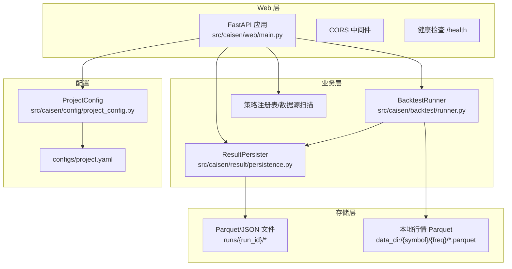
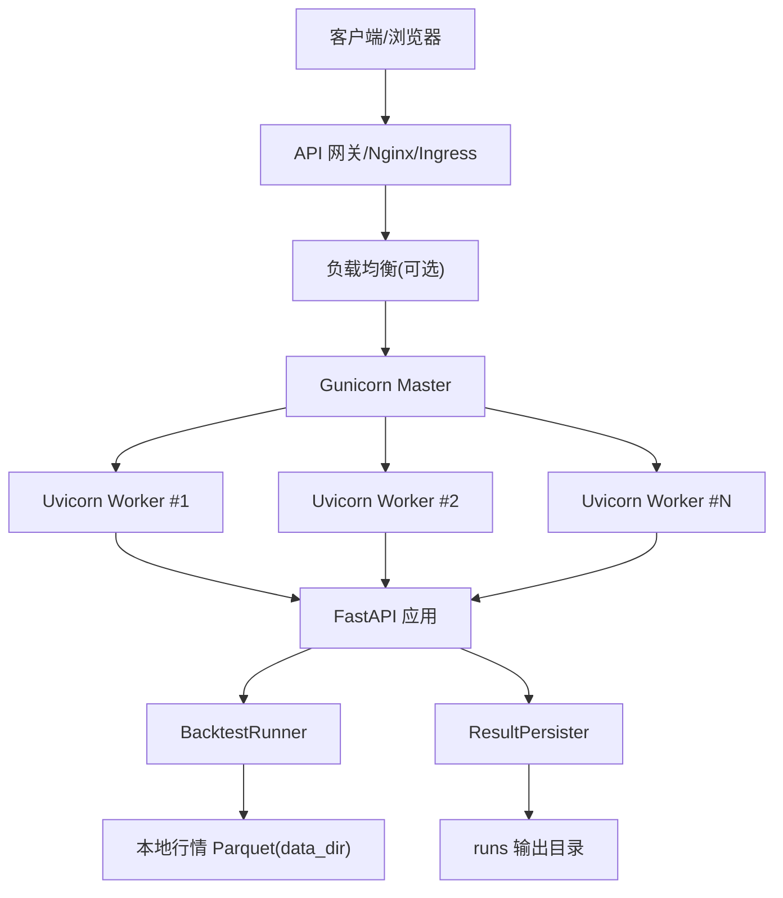
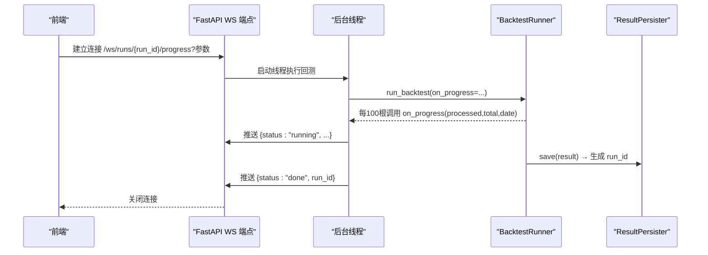
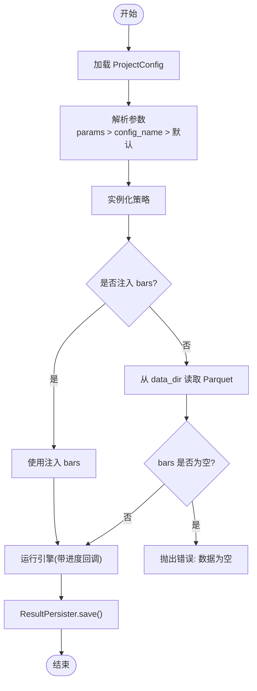
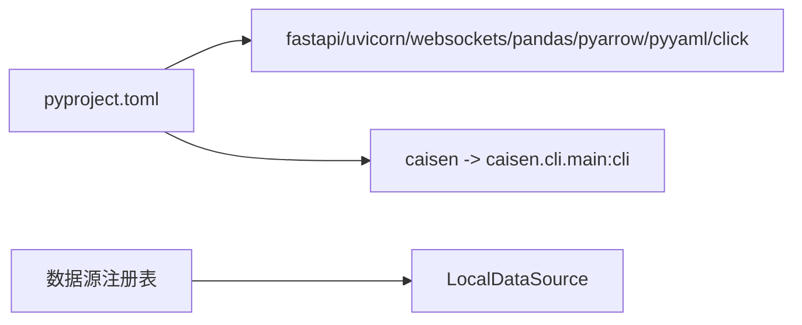

# 后端服务部署

<cite>
**本文引用的文件**   
- [src/caisen/web/main.py](file://src/caisen/web/main.py)
- [src/caisen/backtest/runner.py](file://src/caisen/backtest/runner.py)
- [src/caisen/result/persistence.py](file://src/caisen/result/persistence.py)
- [src/caisen/config/project_config.py](file://src/caisen/config/project_config.py)
- [configs/project.yaml](file://configs/project.yaml)
- [pyproject.toml](file://pyproject.toml)
- [docs/adr/0002-parquet-data-storage.md](file://docs/adr/0002-parquet-data-storage.md)
- [src/caisen/data/config.py](file://src/caisen/data/config.py)
- [src/caisen/data/registry.py](file://src/caisen/data/registry.py)
- [tests/test_web_api.py](file://tests/test_web_api.py)
- [tests/test_path_traversal.py](file://tests/test_path_traversal.py)
</cite>

## 目录
1. [简介](#简介)
2. [项目结构](#项目结构)
3. [核心组件](#核心组件)
4. [架构总览](#架构总览)
5. [详细组件分析](#详细组件分析)
6. [依赖分析](#依赖分析)
7. [性能考虑](#性能考虑)
8. [故障排查指南](#故障排查指南)
9. [结论](#结论)
10. [附录](#附录)

## 简介
本文件面向生产环境，提供 Caisen 量化回测系统后端服务的完整部署指南。内容覆盖 FastAPI 应用的生产部署、Uvicorn 与 Gunicorn 进程模型配置、WebSocket 实时进度推送的部署要点、Parquet 数据持久化与容量规划、环境变量与配置中心集成、以及 API 网关（限流、鉴权、路由转发）建议方案。文档同时给出基于源码的架构图与关键流程时序图，帮助运维与平台团队快速落地并稳定运行。

## 项目结构
后端以 FastAPI 为 Web 框架，内置 Uvicorn 启动器；通过 BacktestRunner 驱动回测引擎，结果由 ResultPersister 落盘为 Parquet/JSON；全局配置由 ProjectConfig 从 configs/project.yaml 加载。

图示来源
- [src/caisen/web/main.py:68-106](file://src/caisen/web/main.py#L68-L106)
- [src/caisen/backtest/runner.py:26-94](file://src/caisen/backtest/runner.py#L26-L94)
- [src/caisen/result/persistence.py:59-133](file://src/caisen/result/persistence.py#L59-L133)
- [src/caisen/config/project_config.py:24-55](file://src/caisen/config/project_config.py#L24-L55)
- [configs/project.yaml:1-13](file://configs/project.yaml#L1-L13)

章节来源
- [src/caisen/web/main.py:68-106](file://src/caisen/web/main.py#L68-L106)
- [src/caisen/backtest/runner.py:26-94](file://src/caisen/backtest/runner.py#L26-L94)
- [src/caisen/result/persistence.py:59-133](file://src/caisen/result/persistence.py#L59-L133)
- [src/caisen/config/project_config.py:24-55](file://src/caisen/config/project_config.py#L24-L55)
- [configs/project.yaml:1-13](file://configs/project.yaml#L1-L13)

## 核心组件
- Web 服务与路由：提供 REST 与 WebSocket 端点，负责请求校验、后台任务调度与静态资源返回。
- 回测执行器：封装“加载数据→实例化策略→运行引擎→持久化结果”的完整流程，支持进度回调。
- 结果持久化：将净值曲线、交易记录、K线等写入 Parquet，并生成前端可视化 data.json。
- 全局配置：从 configs/project.yaml 读取 data_dir、output_dir、api_port，缺失字段使用内嵌默认值。

章节来源
- [src/caisen/web/main.py:68-106](file://src/caisen/web/main.py#L68-L106)
- [src/caisen/backtest/runner.py:26-94](file://src/caisen/backtest/runner.py#L26-L94)
- [src/caisen/result/persistence.py:59-133](file://src/caisen/result/persistence.py#L59-L133)
- [src/caisen/config/project_config.py:24-55](file://src/caisen/config/project_config.py#L24-L55)

## 架构总览
下图展示生产部署的关键组件与交互：外部流量经 API 网关进入 Nginx/Ingress，再转发到 Gunicorn 管理的多个 Uvicorn Worker；Worker 内部承载 FastAPI 应用，处理 HTTP 与 WebSocket；回测任务在独立线程中执行，读写本地 Parquet 数据与 runs 输出目录。

图示来源
- [src/caisen/web/main.py:68-106](file://src/caisen/web/main.py#L68-L106)
- [src/caisen/backtest/runner.py:26-94](file://src/caisen/backtest/runner.py#L26-L94)
- [src/caisen/result/persistence.py:59-133](file://src/caisen/result/persistence.py#L59-L133)

## 详细组件分析

### FastAPI 应用与路由
- 应用创建与中间件：启用 CORS，便于前后端分离部署。
- 主要 REST 端点：
  - GET /：返回前端入口页面
  - GET /api/data-sources：列出本地可用数据源
  - GET /api/strategies：列出已注册策略
  - POST /api/runs：异步触发回测，立即返回 run_id
  - GET /api/runs：列出有效回测结果
  - GET /api/runs/{run_id}：获取详情
  - GET /api/runs/{run_id}/visualization：获取可视化 data.json
  - GET /api/runs/{run_id}/data.json：直接下载 data.json
  - GET /report.html：报告页
  - GET /health：健康检查
- 安全校验：路径遍历防护 _safe_resolve，拒绝包含 ..、/、\ 或逃逸 base_dir 的路径。

章节来源
- [src/caisen/web/main.py:68-106](file://src/caisen/web/main.py#L68-L106)
- [src/caisen/web/main.py:107-132](file://src/caisen/web/main.py#L107-L132)
- [src/caisen/web/main.py:134-201](file://src/caisen/web/main.py#L134-L201)
- [src/caisen/web/main.py:224-227](file://src/caisen/web/main.py#L224-L227)
- [src/caisen/web/main.py:28-39](file://src/caisen/web/main.py#L28-L39)
- [tests/test_path_traversal.py:12-52](file://tests/test_path_traversal.py#L12-L52)

### WebSocket 进度端点
- 端点：WS /ws/runs/{run_id}/progress
- 协议：
  - running：{status, processed, total, current_date}
  - done：{status, run_id}
  - error：{status, message}
- 实现要点：连接后在独立线程执行回测，每 100 根 K 线推送一次进度；终态消息后关闭连接。

图示来源
- [src/caisen/web/main.py:247-303](file://src/caisen/web/main.py#L247-L303)
- [src/caisen/backtest/runner.py:26-94](file://src/caisen/backtest/runner.py#L26-L94)
- [src/caisen/result/persistence.py:59-133](file://src/caisen/result/persistence.py#L59-L133)

章节来源
- [src/caisen/web/main.py:247-303](file://src/caisen/web/main.py#L247-L303)
- [src/caisen/backtest/runner.py:26-94](file://src/caisen/backtest/runner.py#L26-L94)

### 回测执行器与结果持久化
- BacktestRunner.run_backtest：
  - 解析参数优先级：params > config_name > 默认值
  - 加载数据：按 DataConfig 从 data_dir 读取 Parquet
  - 运行引擎：带进度回调，每 100 根触发一次
  - 持久化：ResultPersister.save 生成 meta/equity/trades/bars/annotations/metrics/data.json
- ResultPersister：
  - 保存：生成唯一 run_id，落盘多类文件
  - 列表/加载：过滤无效 run，按需加载 parquet/json

图示来源
- [src/caisen/backtest/runner.py:26-94](file://src/caisen/backtest/runner.py#L26-L94)
- [src/caisen/result/persistence.py:59-133](file://src/caisen/result/persistence.py#L59-L133)
- [src/caisen/data/config.py:11-51](file://src/caisen/data/config.py#L11-L51)

章节来源
- [src/caisen/backtest/runner.py:26-94](file://src/caisen/backtest/runner.py#L26-L94)
- [src/caisen/result/persistence.py:59-133](file://src/caisen/result/persistence.py#L59-L133)
- [src/caisen/data/config.py:11-51](file://src/caisen/data/config.py#L11-L51)

### 配置与环境变量
- 配置加载：ProjectConfig 从 configs/project.yaml 读取 data_dir、output_dir、api_port；缺失时回退到内嵌默认值。
- 运行时覆盖：web/main.py 暴露 set_output_dir 供测试或 CLI 覆盖。
- 端口：默认 8001，可通过 project.yaml 调整。

章节来源
- [src/caisen/config/project_config.py:24-55](file://src/caisen/config/project_config.py#L24-L55)
- [configs/project.yaml:1-13](file://configs/project.yaml#L1-L13)
- [src/caisen/web/main.py:57-66](file://src/caisen/web/main.py#L57-L66)

## 依赖分析
- 构建与脚本：
  - 包名 caisen，Python>=3.10
  - 依赖包括 fastapi、uvicorn、websockets、pandas、pyarrow、pyyaml、click
  - 命令行入口 caisen.cli.main:cli
- 插件机制：
  - 数据源注册表支持动态扩展，当前内置 local 数据源
  - 存在 entry_points 未配置的架构问题待修复

图示来源
- [pyproject.toml:1-23](file://pyproject.toml#L1-L23)
- [src/caisen/data/registry.py:1-56](file://src/caisen/data/registry.py#L1-L56)

章节来源
- [pyproject.toml:1-23](file://pyproject.toml#L1-L23)
- [src/caisen/data/registry.py:1-56](file://src/caisen/data/registry.py#L1-L56)

## 性能考虑
- 进程模型
  - 推荐以 Gunicorn Master + 多个 Uvicorn Worker 模式部署，提升并发处理能力。
  - Worker 数量建议：CPU 核数 × 2 + 1（IO 密集可略增），结合压测调优。
- 线程与队列
  - WebSocket 进度推送使用独立线程与队列，避免阻塞事件循环。
  - 注意队列超时与异常分支，防止连接泄漏。
- 磁盘 IO
  - 大量 Parquet 读写对磁盘 IO 敏感，建议使用 SSD/NVMe，合理分区与挂载。
- 缓存与预热
  - 策略与数据源扫描可在启动阶段完成，减少首请求延迟。
- 日志与监控
  - 开启结构化日志，采集 QPS、P99、错误率、磁盘使用率、GC 指标。

[本节为通用指导，不直接分析具体文件]

## 故障排查指南
- 健康检查
  - GET /health 应返回 {"status":"ok"}，用于探针与告警。
- 常见错误
  - 策略未注册：POST /api/runs 返回 422，需确认策略已正确注册。
  - 日期格式错误：YYYY-MM-DD 校验失败返回 422。
  - 路径遍历攻击：_safe_resolve 拦截非法路径，返回 400。
- 日志定位
  - 查看 Web 服务日志中的回测后台执行异常堆栈。
  - 关注 ResultPersister 落盘异常与 Parquet 读写错误。

章节来源
- [src/caisen/web/main.py:224-227](file://src/caisen/web/main.py#L224-L227)
- [tests/test_web_api.py:19-47](file://tests/test_web_api.py#L19-L47)
- [tests/test_web_api.py:112-149](file://tests/test_web_api.py#L112-L149)
- [src/caisen/web/main.py:28-39](file://src/caisen/web/main.py#L28-L39)
- [tests/test_path_traversal.py:12-52](file://tests/test_path_traversal.py#L12-L52)

## 结论
本部署文档围绕 FastAPI 应用、Uvicorn/Gunicorn 进程模型、WebSocket 实时推送、Parquet 存储与容量规划、配置管理以及网关集成等方面提供了生产级实践建议。结合源码结构与测试用例，可快速搭建高可用、可扩展的回测后端服务。

[本节为总结性内容，不直接分析具体文件]

## 附录

### 生产部署清单与最佳实践
- 进程管理
  - 使用 systemd/supervisor 管理 Gunicorn 主进程，设置自动重启与资源限制。
  - 配置优雅重启：先平滑重载 Worker，再替换二进制，确保无中断。
- 负载均衡
  - 前置 Nginx/Ingress 做四层/七层转发，开启 gzip、HTTP/2、Keep-Alive。
  - 针对 WebSocket 路径 /ws/* 启用长连接透传。
- 限流与认证
  - 在网关层实施 IP/用户维度的速率限制与令牌校验。
  - 对 /api/runs 等写接口增加幂等键与重试保护。
- 会话保持
  - WebSocket 建议粘性会话或采用共享状态（如 Redis）进行跨节点广播。
- 数据与备份
  - Parquet 数据目录与 runs 目录分别独立卷，定期快照与异地备份。
  - 容量规划：根据 K 线频率、时间跨度与品种数量估算存储增长。
- 配置中心
  - 将 configs/project.yaml 纳入配置中心（如 Consul/Vault），支持热更新与灰度发布。
  - 敏感信息（如 LLM API Key）通过密钥管理服务注入，避免明文落盘。

[本节为通用指导，不直接分析具体文件]

### 数据与存储架构
- 历史数据存储
  - 采用 Parquet 列式存储，按 symbol/freq/date 分区，适合 OLAP 查询。
- 结果输出
  - runs/{run_id} 下包含 meta.json、equity.parquet、trades.parquet、bars.parquet、annotations.json、metrics.json、data.json。
- 容量规划
  - 依据 bar_count、交易次数与标注规模评估单 run 大小，结合日增量预估总容量。

章节来源
- [docs/adr/0002-parquet-data-storage.md:1-11](file://docs/adr/0002-parquet-data-storage.md#L1-L11)
- [src/caisen/result/persistence.py:59-133](file://src/caisen/result/persistence.py#L59-L133)

### API 参考（节选）
- GET /health
  - 响应：{"status":"ok"}
- GET /api/data-sources
  - 响应：{"data_sources": [...]}
- GET /api/strategies
  - 响应：{"strategies": [...]}
- POST /api/runs
  - 请求体：strategy_name, symbol, freq, start, end, config_name(可选)
  - 响应：{"run_id": "..."}
- GET /api/runs
  - 响应：{"count": n, "runs": [...]}
- GET /api/runs/{run_id}
  - 响应：回测结果详情
- GET /api/runs/{run_id}/visualization
  - 响应：data.json 对象
- GET /api/runs/{run_id}/data.json
  - 响应：data.json 文件流

章节来源
- [src/caisen/web/main.py:85-106](file://src/caisen/web/main.py#L85-L106)
- [src/caisen/web/main.py:107-132](file://src/caisen/web/main.py#L107-L132)
- [src/caisen/web/main.py:134-201](file://src/caisen/web/main.py#L134-L201)
- [src/caisen/web/main.py:224-227](file://src/caisen/web/main.py#L224-L227)