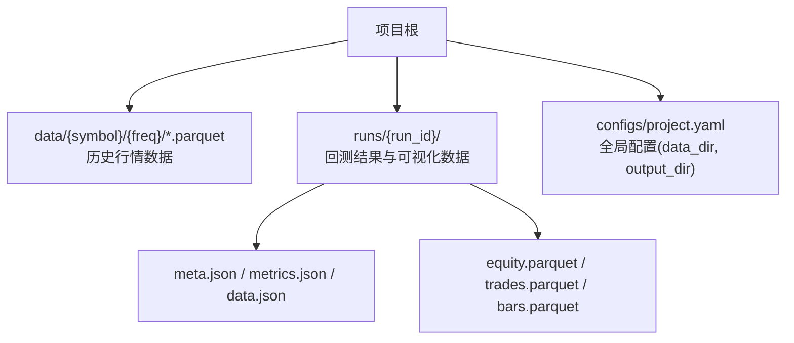
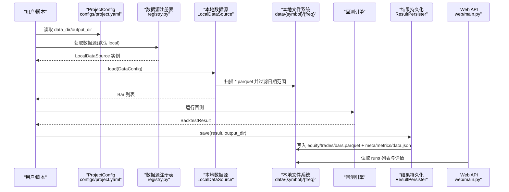
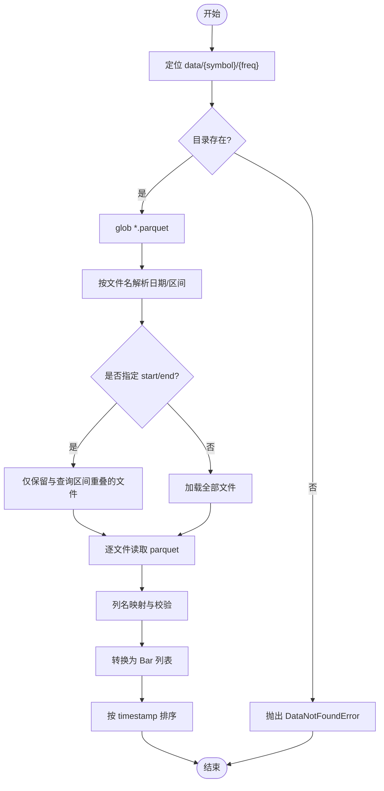
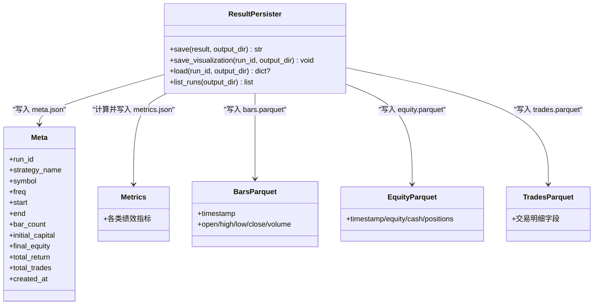
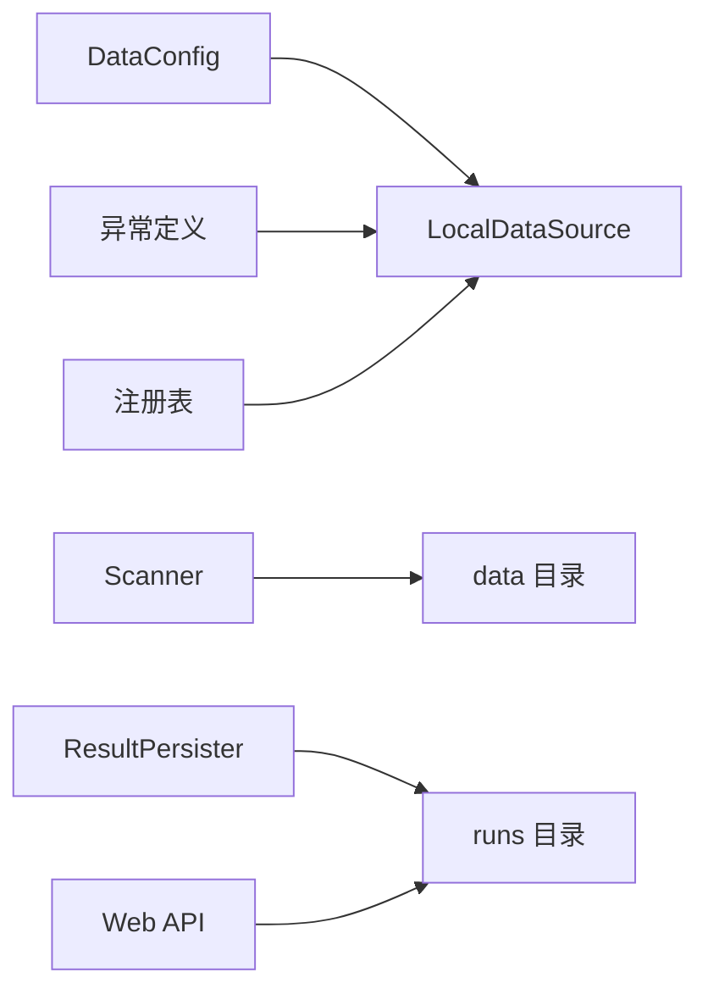

# 数据存储部署

<cite>
**本文引用的文件**   
- [0002-parquet-data-storage.md](file://docs/adr/0002-parquet-data-storage.md)
- [0009-directory-structure.md](file://docs/adr/0009-directory-structure.md)
- [local_source.py](file://src/caisen/data/local_source.py)
- [config.py](file://src/caisen/data/config.py)
- [registry.py](file://src/caisen/data/registry.py)
- [exceptions.py](file://src/caisen/data/exceptions.py)
- [scanner.py](file://src/caisen/data/scanner.py)
- [persistence.py](file://src/caisen/result/persistence.py)
- [project.yaml](file://configs/project.yaml)
- [main.py](file://src/caisen/web/main.py)
</cite>

## 目录
1. [引言](#引言)
2. [项目结构](#项目结构)
3. [核心组件](#核心组件)
4. [架构总览](#架构总览)
5. [详细组件分析](#详细组件分析)
6. [依赖关系分析](#依赖关系分析)
7. [性能与容量规划](#性能与容量规划)
8. [备份与恢复策略](#备份与恢复策略)
9. [安全与权限控制](#安全与权限控制)
10. [故障排查指南](#故障排查指南)
11. [结论](#结论)

## 引言
本文件面向 Caisen 量化回测系统的“数据存储部署”，聚焦以下目标：
- 明确 Parquet 历史数据与回测结果的存储架构、分区与索引优化策略
- 规范本地文件系统的数据目录结构与 runs 目录组织、元数据管理
- 给出大数据量下的存储优化、压缩配置与磁盘空间管理建议
- 制定数据备份与恢复方案（含增量备份与灾难恢复）
- 提供存储容量规划、增长预测与扩容策略
- 说明访问权限控制与安全配置（文件权限、网络存储挂载）

## 项目结构
Caisen 将历史行情与回测结果分别落盘为 Parquet 与 JSON，采用按品种与频率分区的目录约定，并通过统一的配置项集中管理路径。

图示来源
- [0002-parquet-data-storage.md:1-11](file://docs/adr/0002-parquet-data-storage.md#L1-L11)
- [persistence.py:62-133](file://src/caisen/result/persistence.py#L62-L133)
- [project.yaml:1-10](file://configs/project.yaml#L1-L10)

章节来源
- [0002-parquet-data-storage.md:1-11](file://docs/adr/0002-parquet-data-storage.md#L1-L11)
- [0009-directory-structure.md:1-89](file://docs/adr/0009-directory-structure.md#L1-L89)
- [project.yaml:1-10](file://configs/project.yaml#L1-L10)

## 核心组件
- 历史数据读取器：LocalDataSource，负责从本地 Parquet 文件加载 K 线数据，支持单日期与区间命名模式，并按时间范围过滤。
- 数据源注册表：registry，线程安全地维护数据源注册与激活状态，默认启用 local。
- 数据扫描器：scanner，快速推断 data_dir 下可用 symbol/freq 组合及日期范围（不读文件内容）。
- 结果持久化：ResultPersister，将净值曲线、交易记录、K 线等以 Parquet 保存，并生成前端 data.json。
- 配置中心：DataConfig 与 configs/project.yaml，统一声明 data_dir、output_dir 等关键路径。

章节来源
- [local_source.py:15-80](file://src/caisen/data/local_source.py#L15-L80)
- [registry.py:1-108](file://src/caisen/data/registry.py#L1-L108)
- [scanner.py:1-52](file://src/caisen/data/scanner.py#L1-L52)
- [persistence.py:59-133](file://src/caisen/result/persistence.py#L59-L133)
- [config.py:1-51](file://src/caisen/data/config.py#L1-L51)
- [project.yaml:1-10](file://configs/project.yaml#L1-L10)

## 架构总览
下图展示从配置到数据读取、再到结果落盘的端到端流程，以及 Web 服务对 runs 的读取方式。

图示来源
- [project.yaml:1-10](file://configs/project.yaml#L1-L10)
- [registry.py:67-88](file://src/caisen/data/registry.py#L67-L88)
- [local_source.py:39-80](file://src/caisen/data/local_source.py#L39-L80)
- [persistence.py:62-133](file://src/caisen/result/persistence.py#L62-L133)
- [main.py:151-183](file://src/caisen/web/main.py#L151-L183)

## 详细组件分析

### 历史数据目录与分区策略
- 目录约定：data/{symbol}/{freq}/*.parquet
- 文件名约定：
  - 单日期：YYYYMMDD.parquet
  - 区间：YYYYMMDD_YYYYMMDD.parquet
- 分区优势：列式存储+按日分区，符合时序查询模式，减少 I/O。

章节来源
- [0002-parquet-data-storage.md:1-11](file://docs/adr/0002-parquet-data-storage.md#L1-L11)
- [local_source.py:82-137](file://src/caisen/data/local_source.py#L82-L137)
- [scanner.py:1-52](file://src/caisen/data/scanner.py#L1-L52)

### 本地数据读取与过滤逻辑
- 读取流程：定位 {data_dir}/{symbol}/{freq}，glob 匹配 *.parquet，按文件名解析日期或区间，再按 start/end 过滤。
- 列名兼容：支持中英文列名映射，缺失必填列时抛出校验异常。
- 返回结果：按 timestamp 排序的 Bar 列表。

图示来源
- [local_source.py:39-80](file://src/caisen/data/local_source.py#L39-L80)
- [local_source.py:82-137](file://src/caisen/data/local_source.py#L82-L137)
- [local_source.py:139-199](file://src/caisen/data/local_source.py#L139-L199)
- [exceptions.py:9-22](file://src/caisen/data/exceptions.py#L9-L22)

### 数据源注册与线程安全
- 默认注册 local 数据源，可通过 set_active_datasource 切换。
- 所有注册表读写均使用互斥锁保护，避免并发冲突。

章节来源
- [registry.py:1-108](file://src/caisen/data/registry.py#L1-L108)

### 数据扫描器（快速发现可用数据）
- 扫描 data_dir 下 symbol/freq 三级目录，仅通过文件名推断 date_range，不读取文件内容，保证扫描性能。
- 输出供 Web API 渲染下拉菜单。

章节来源
- [scanner.py:1-52](file://src/caisen/data/scanner.py#L1-L52)

### 回测结果持久化与 runs 目录组织
- run_id 生成规则：{策略名}_{YYYYMMDD}_{序号}，同一天同名策略递增序号。
- 每个 run 目录包含：
  - 元数据与指标：meta.json、metrics.json
  - 可视化聚合：data.json（由 ResultPersister.save_visualization 生成）
  - 数值型数据：equity.parquet、trades.parquet、bars.parquet
- Web 服务在列出 runs 时会跳过 bar_count==0 的无效条目。

图示来源
- [persistence.py:17-40](file://src/caisen/result/persistence.py#L17-L40)
- [persistence.py:62-133](file://src/caisen/result/persistence.py#L62-L133)
- [persistence.py:135-202](file://src/caisen/result/persistence.py#L135-L202)
- [main.py:151-183](file://src/caisen/web/main.py#L151-L183)

章节来源
- [persistence.py:59-274](file://src/caisen/result/persistence.py#L59-L274)
- [main.py:151-183](file://src/caisen/web/main.py#L151-L183)

### 配置与路径管理
- ProjectConfig 从 configs/project.yaml 读取 data_dir、output_dir、api_port 等全局配置，消除硬编码。
- DataConfig 用于单次数据加载的参数（symbol、freq、start、end、data_dir），并提供 data_path 便捷属性。

章节来源
- [project.yaml:1-10](file://configs/project.yaml#L1-L10)
- [config.py:1-51](file://src/caisen/data/config.py#L1-L51)

## 依赖关系分析
- 模块耦合：
  - LocalDataSource 依赖 DataConfig 与异常定义；通过 pandas 读写 Parquet。
  - registry 依赖 BaseDataSource/LocalDataSource，提供线程安全的注册与选择。
  - scanner 仅依赖 pathlib，轻量扫描。
  - persistence 依赖 DataFrame 与 JSON，产出 runs 目录产物。
  - web/main.py 读取 runs 目录中的 meta.json 与 metrics.json 进行展示。

图示来源
- [local_source.py:15-80](file://src/caisen/data/local_source.py#L15-L80)
- [registry.py:1-108](file://src/caisen/data/registry.py#L1-L108)
- [scanner.py:1-52](file://src/caisen/data/scanner.py#L1-L52)
- [persistence.py:62-133](file://src/caisen/result/persistence.py#L62-L133)
- [main.py:151-183](file://src/caisen/web/main.py#L151-L183)

章节来源
- [local_source.py:15-80](file://src/caisen/data/local_source.py#L15-L80)
- [registry.py:1-108](file://src/caisen/data/registry.py#L1-L108)
- [scanner.py:1-52](file://src/caisen/data/scanner.py#L1-L52)
- [persistence.py:62-133](file://src/caisen/result/persistence.py#L62-L133)
- [main.py:151-183](file://src/caisen/web/main.py#L151-L183)

## 性能与容量规划
- 存储格式与分区
  - 历史数据与结果均采用 Parquet 列式存储，配合按日/区间分区，提升 OLAP 场景查询效率。
  - 文件名同时支持单日期与区间两种模式，便于批量归档与按需裁剪。
- 压缩与列类型
  - 建议使用高压缩比的 Parquet 编解码器（如 zstd/lz4/snappy），在 CPU 与 I/O 间权衡。
  - 合理设置列类型（如 timestamp 使用 datetime64、数值使用 float32/float64 视精度需求），降低体积。
- 索引与扫描优化
  - 当前实现基于文件名过滤与内存中时间过滤，适合中小规模；超大规模可考虑引入分区索引或外部目录索引缓存。
  - 扫描器仅解析文件名，避免 IO 放大，适合前端数据源下拉的快速响应。
- 磁盘空间管理
  - 定期清理无效 runs（bar_count==0 或过期策略版本），归档冷数据至低成本存储。
  - 监控 data_dir 与 runs 目录大小，设定阈值告警。
- 容量规划与增长预测
  - 估算公式：总容量 ≈ Σ(各 symbol×freq 的日均条数 × 平均行大小 × 天数) + runs 增长
  - 建议预留 30%~50% 冗余空间，结合月度增长趋势滚动调整配额。
- 扩容策略
  - 横向扩展：多节点共享同一数据目录（NFS/S3 兼容对象存储），注意并发读写一致性与锁。
  - 纵向扩展：升级磁盘容量与 IOPS，优先选择高吞吐 SSD/NVMe。

[本节为通用指导，无需特定文件引用]

## 备份与恢复策略
- 全量备份
  - 对 data_dir 与 runs 目录执行快照或一致性拷贝（确保无活跃写入或使用 fsfreeze）。
- 增量备份
  - 基于文件修改时间戳或版本系统（如 Git LFS/对象存储版本化）进行增量同步。
  - 针对 runs 目录，可按天归档增量快照，保留最近 N 份。
- 恢复流程
  - 停止写入服务（CLI/Web），恢复 data_dir 与 runs 目录，重启服务后验证 meta.json 与 data.json 完整性。
- 灾难恢复
  - 异地容灾：跨机房/云区复制 data_dir 与 runs 快照。
  - RTO/RPO 目标：根据业务容忍度确定备份频率与恢复时限。

[本节为通用指导，无需特定文件引用]

## 安全与权限控制
- 文件权限
  - 最小权限原则：只授予运行账户对 data_dir 与 runs 目录的读写权限，其他用户只读或无访问。
  - 敏感环境建议启用 ACL 或 SELinux/AppArmor 策略。
- 网络存储挂载
  - 若使用 NFS/CIFS/S3 兼容存储，需配置只读挂载点用于浏览，写入走专用账户。
  - 启用传输加密（TLS）与身份认证（IAM/Kerberos），限制访问 IP 白名单。
- 审计与合规
  - 开启文件系统审计日志，记录关键目录的增删改操作。
  - 定期审查权限与访问日志，发现异常及时处置。

[本节为通用指导，无需特定文件引用]

## 故障排查指南
- 常见错误与定位
  - 找不到数据：检查 data_dir 是否正确、symbol/freq 目录是否存在、文件名是否符合 YYYYMMDD 或 YYYYMMDD_YYYYMMDD 约定。
  - 列缺失或类型异常：确认 Parquet 包含必要列（timestamp/open/high/low/close/volume），且列名兼容中英文。
  - runs 列表为空：确认 output_dir 指向正确，且 run 目录包含 meta.json；Web 会跳过 bar_count==0 的无效条目。
- 诊断步骤
  - 使用 scanner 快速查看可用数据源与日期范围。
  - 直接读取对应 parquet 文件，验证 schema 与行数。
  - 检查 registry 的 active datasource 是否为 local。
- 相关异常类型
  - DataNotFoundError、DataValidationError、InvalidDateRangeError、DataSourceNotAvailableError

章节来源
- [local_source.py:39-80](file://src/caisen/data/local_source.py#L39-L80)
- [local_source.py:139-199](file://src/caisen/data/local_source.py#L139-L199)
- [exceptions.py:1-47](file://src/caisen/data/exceptions.py#L1-L47)
- [scanner.py:1-52](file://src/caisen/data/scanner.py#L1-L52)
- [main.py:151-183](file://src/caisen/web/main.py#L151-L183)

## 结论
Caisen 采用 Parquet 列式存储与按日/区间分区，结合 runs 目录的标准化组织与元数据管理，实现了高效、可扩展的回测数据体系。通过统一的配置与线程安全的数据源注册机制，系统在易用性、可维护性与性能之间取得良好平衡。在生产环境中，建议配套实施容量规划、备份恢复与安全加固策略，以确保数据资产的安全与稳定。