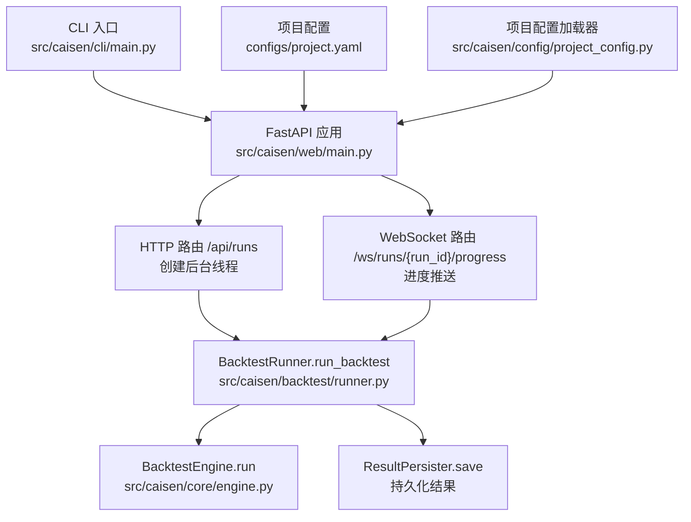
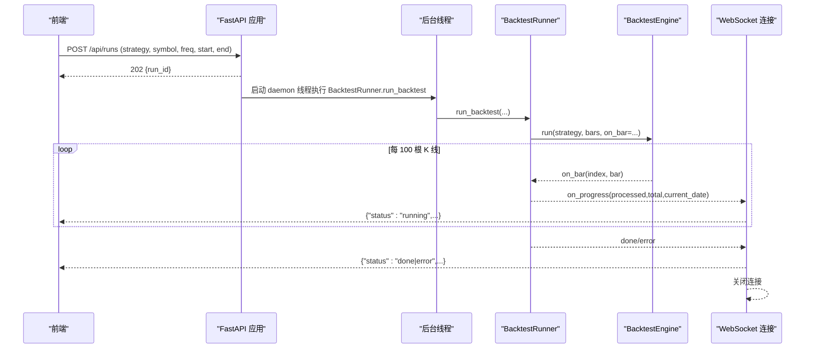
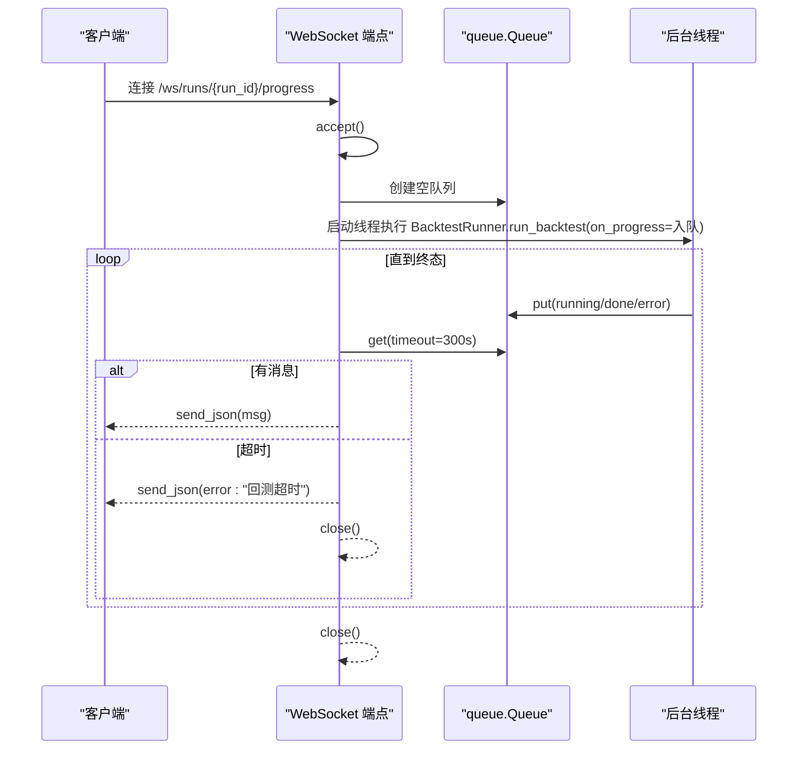
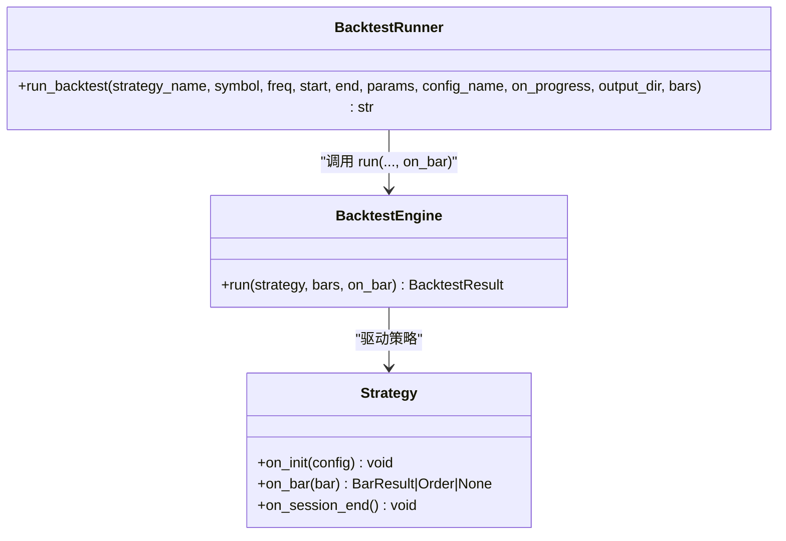
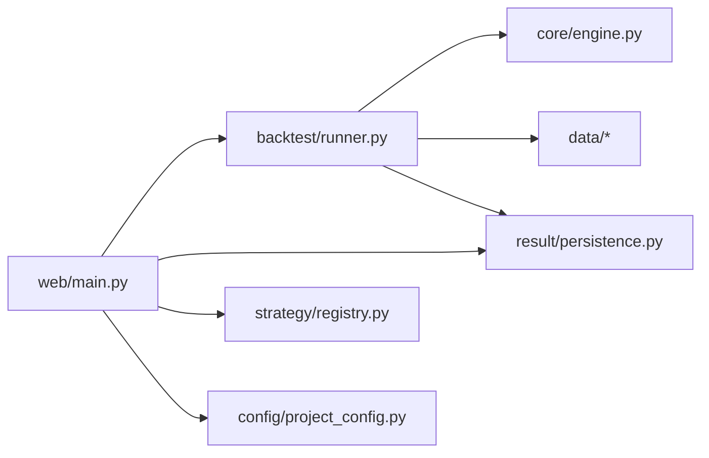

# 进程管理

<cite>
**本文引用的文件**   
- [src/caisen/web/main.py](file://src/caisen/web/main.py)
- [src/caisen/backtest/runner.py](file://src/caisen/backtest/runner.py)
- [src/caisen/core/engine.py](file://src/caisen/core/engine.py)
- [src/caisen/cli/main.py](file://src/caisen/cli/main.py)
- [configs/project.yaml](file://configs/project.yaml)
- [src/caisen/config/project_config.py](file://src/caisen/config/project_config.py)
- [pyproject.toml](file://pyproject.toml)
- [tests/test_websocket_progress.py](file://tests/test_websocket_progress.py)
- [tests/test_post_runs_endpoint.py](file://tests/test_post_runs_endpoint.py)
- [docs/agents/issues/010-websocket-progress.md](file://docs/agents/issues/010-websocket-progress.md)
</cite>

## 目录
1. [简介](#简介)
2. [项目结构](#项目结构)
3. [核心组件](#核心组件)
4. [架构总览](#架构总览)
5. [详细组件分析](#详细组件分析)
6. [依赖关系分析](#依赖关系分析)
7. [性能与并发特性](#性能与并发特性)
8. [监控、健康检查与告警](#监控健康检查与告警)
9. [故障排查指南](#故障排查指南)
10. [结论](#结论)
11. [附录：部署与容器化建议](#附录部署与容器化建议)

## 简介
本文件面向 Caisen 量化回测系统的进程管理与部署，聚焦以下主题：
- 后台线程管理机制与异步任务执行
- WebSocket 连接生命周期、消息队列与进度推送
- 进程间通信与任务调度（当前实现为单进程多线程）
- 健康检查端点与基础监控能力
- 优雅关闭与重启策略、信号处理与资源清理
- 进程隔离与资源限制、容器化部署中的进程管理配置

说明：当前仓库未内置独立的消息队列或进程管理器，采用 FastAPI + Uvicorn 单进程模型，结合 Python 标准库 threading 与 queue.Queue 完成“请求-后台任务-WebSocket 推送”的闭环。

## 项目结构
与进程管理直接相关的代码主要分布在 Web 服务、回测执行器、引擎与 CLI 启动入口中：
- Web 服务：提供 HTTP 与 WebSocket 接口，负责创建后台线程、桥接进度回调到 WS 消息
- 回测执行器：封装数据加载、策略实例化、引擎运行与结果持久化的完整流程
- 回测引擎：逐根 K 线驱动策略并支持 on_bar 钩子用于进度上报
- CLI：提供本地开发时一键启动前后端的便捷入口
- 配置：项目级全局配置（端口、输出目录等）



图示来源
- [src/caisen/web/main.py:107-132](file://src/caisen/web/main.py#L107-L132)
- [src/caisen/web/main.py:247-303](file://src/caisen/web/main.py#L247-L303)
- [src/caisen/backtest/runner.py:26-94](file://src/caisen/backtest/runner.py#L26-L94)
- [src/caisen/core/engine.py:33-91](file://src/caisen/core/engine.py#L33-L91)
- [src/caisen/cli/main.py:235-294](file://src/caisen/cli/main.py#L235-L294)
- [configs/project.yaml:1-13](file://configs/project.yaml#L1-L13)
- [src/caisen/config/project_config.py:17-55](file://src/caisen/config/project_config.py#L17-L55)

章节来源
- [src/caisen/web/main.py:107-132](file://src/caisen/web/main.py#L107-L132)
- [src/caisen/web/main.py:247-303](file://src/caisen/web/main.py#L247-L303)
- [src/caisen/backtest/runner.py:26-94](file://src/caisen/backtest/runner.py#L26-L94)
- [src/caisen/core/engine.py:33-91](file://src/caisen/core/engine.py#L33-L91)
- [src/caisen/cli/main.py:235-294](file://src/caisen/cli/main.py#L235-L294)
- [configs/project.yaml:1-13](file://configs/project.yaml#L1-L13)
- [src/caisen/config/project_config.py:17-55](file://src/caisen/config/project_config.py#L17-L55)

## 核心组件
- Web 服务（FastAPI）
  - 提供 /api/runs 触发回测，立即返回占位 run_id，并在 daemon 线程中执行 BacktestRunner
  - 提供 /ws/runs/{run_id}/progress 实时推送进度，内部使用 queue.Queue 在后台线程与 WS 发送循环之间传递消息
  - 提供 /health 健康检查端点
- 回测执行器（BacktestRunner）
  - 统一参数解析、策略实例化、数据加载、引擎运行、结果持久化
  - 通过 on_progress 回调每 100 根 K 线上报一次进度
- 回测引擎（BacktestEngine）
  - 逐根 K 线驱动策略，暴露 on_bar 钩子供上层统计进度
- CLI（caisen.cli.main）
  - 提供 web 命令，同时拉起后端 API 与前端 Vite 开发服务器（仅开发体验）

章节来源
- [src/caisen/web/main.py:107-132](file://src/caisen/web/main.py#L107-L132)
- [src/caisen/web/main.py:247-303](file://src/caisen/web/main.py#L247-L303)
- [src/caisen/backtest/runner.py:26-94](file://src/caisen/backtest/runner.py#L26-L94)
- [src/caisen/core/engine.py:33-91](file://src/caisen/core/engine.py#L33-L91)
- [src/caisen/cli/main.py:235-294](file://src/caisen/cli/main.py#L235-L294)

## 架构总览
下图展示了从前端发起回测到后端执行、再到 WebSocket 推送进度的端到端流程。



图示来源
- [src/caisen/web/main.py:107-132](file://src/caisen/web/main.py#L107-L132)
- [src/caisen/web/main.py:247-303](file://src/caisen/web/main.py#L247-L303)
- [src/caisen/backtest/runner.py:26-94](file://src/caisen/backtest/runner.py#L26-L94)
- [src/caisen/core/engine.py:33-91](file://src/caisen/core/engine.py#L33-L91)

## 详细组件分析

### 后台线程与异步执行
- 触发方式
  - HTTP 触发：POST /api/runs 校验策略名后，立即返回 202 与占位 run_id，随后在 daemon 线程中调用 BacktestRunner.run_backtest
  - WebSocket 触发：客户端连接 /ws/runs/{run_id}/progress 后，服务端在独立线程中执行回测并通过队列推送进度
- 线程模型
  - 使用 Python 标准库 threading.Thread(target=_bg, daemon=True).start() 启动后台任务
  - 无显式线程池；每个请求对应一个后台线程
- 错误处理
  - HTTP 后台线程捕获异常并记录日志
  - WebSocket 后台线程将异常包装为 error 消息推送后关闭连接

```mermaid
flowchart TD
Start(["收到请求"]) --> Mode{"请求类型"}
Mode --> |HTTP POST /api/runs| CreateThread["创建 daemon 线程执行 BacktestRunner"]
Mode --> |WS /ws/runs/{run_id}/progress| AcceptWS["accept 连接"]
AcceptWS --> CreateThread
CreateThread --> Run["BacktestRunner.run_backtest(...)"]
Run --> Progress["on_progress 每 100 根 K 线触发"]
Progress --> SendMsg["写入 queue.Queue"]
SendMsg --> Loop{"终态?"}
Loop --> |否| Loop
Loop --> |是| Close["关闭连接/结束线程"]
```

图示来源
- [src/caisen/web/main.py:107-132](file://src/caisen/web/main.py#L107-L132)
- [src/caisen/web/main.py:247-303](file://src/caisen/web/main.py#L247-L303)
- [src/caisen/backtest/runner.py:26-94](file://src/caisen/backtest/runner.py#L26-L94)

章节来源
- [src/caisen/web/main.py:107-132](file://src/caisen/web/main.py#L107-L132)
- [src/caisen/web/main.py:247-303](file://src/caisen/web/main.py#L247-L303)
- [tests/test_post_runs_endpoint.py:72-83](file://tests/test_post_runs_endpoint.py#L72-L83)

### WebSocket 连接生命周期与消息协议
- 连接建立
  - 客户端 GET /ws/runs/{run_id}/progress?strategy_name&symbol&freq&start&end[&config_name]
  - 服务端 accept 后创建 queue.Queue，注册 on_progress 回调
- 消息协议
  - running: {"status":"running","processed":N,"total":T,"current_date":"YYYY-MM-DD"}
  - done: {"status":"done","run_id":"实际 run_id"}
  - error: {"status":"error","message":"错误描述"}
- 超时与关闭
  - 服务端从队列取消息设置超时（示例为 300 秒），超时则推送 error 并关闭连接
  - 收到终态消息（done/error）后立即关闭连接
- 测试覆盖
  - 验证收到 running/done/error 消息
  - 验证终态后连接自动关闭



图示来源
- [src/caisen/web/main.py:247-303](file://src/caisen/web/main.py#L247-L303)
- [docs/agents/issues/010-websocket-progress.md:1-45](file://docs/agents/issues/010-websocket-progress.md#L1-L45)
- [tests/test_websocket_progress.py:48-129](file://tests/test_websocket_progress.py#L48-L129)

章节来源
- [src/caisen/web/main.py:247-303](file://src/caisen/web/main.py#L247-L303)
- [docs/agents/issues/010-websocket-progress.md:1-45](file://docs/agents/issues/010-websocket-progress.md#L1-L45)
- [tests/test_websocket_progress.py:48-129](file://tests/test_websocket_progress.py#L48-L129)

### 回测执行器与引擎协作
- BacktestRunner
  - 参数优先级：params > config_name > 默认值
  - 数据不足时抛出明确异常
  - 通过 on_bar 钩子累计计数，每 100 根或最后一根触发 on_progress
- BacktestEngine
  - 主循环遍历 bars[:-1]，调用策略 on_bar，执行订单，更新净值，最后再更新一次最终净值
  - 支持 on_bar 回调，便于外部统计进度



图示来源
- [src/caisen/backtest/runner.py:26-94](file://src/caisen/backtest/runner.py#L26-L94)
- [src/caisen/core/engine.py:33-91](file://src/caisen/core/engine.py#L33-L91)

章节来源
- [src/caisen/backtest/runner.py:26-94](file://src/caisen/backtest/runner.py#L26-L94)
- [src/caisen/core/engine.py:33-91](file://src/caisen/core/engine.py#L33-L91)

### CLI 启动与多进程编排（开发模式）
- caisen report 命令会：
  - 设置 output_dir
  - 在 daemon 线程中启动后端 API（Uvicorn）
  - 等待后端就绪后，以子进程方式启动前端 Vite dev server
  - 监听 Ctrl+C，终止前端子进程并退出
- 注意：该编排仅用于开发体验，生产环境建议使用进程管理器（如 systemd/supervisor/docker-compose）分别管理前后端进程

章节来源
- [src/caisen/cli/main.py:235-294](file://src/caisen/cli/main.py#L235-L294)

## 依赖关系分析
- 运行时依赖
  - fastapi、uvicorn、websockets 由 pyproject.toml 声明
- 模块耦合
  - Web 层依赖 BacktestRunner、ResultPersister、StrategyRegistry、ProjectConfig
  - BacktestRunner 依赖 Engine、StrategyRegistry、Data 加载、ResultPersister
  - Engine 依赖 Portfolio、Position、Order、Trade 等核心数据结构



图示来源
- [src/caisen/web/main.py:17-21](file://src/caisen/web/main.py#L17-L21)
- [src/caisen/backtest/runner.py:13-19](file://src/caisen/backtest/runner.py#L13-L19)
- [src/caisen/core/engine.py:1-16](file://src/caisen/core/engine.py#L1-L16)
- [pyproject.toml:11-19](file://pyproject.toml#L11-L19)

章节来源
- [pyproject.toml:11-19](file://pyproject.toml#L11-L19)
- [src/caisen/web/main.py:17-21](file://src/caisen/web/main.py#L17-L21)
- [src/caisen/backtest/runner.py:13-19](file://src/caisen/backtest/runner.py#L13-L19)
- [src/caisen/core/engine.py:1-16](file://src/caisen/core/engine.py#L1-L16)

## 性能与并发特性
- 并发模型
  - 单进程多线程：每个请求一个 daemon 线程执行回测
  - 无线程池/任务队列：高并发下可能受限于 GIL 与系统线程开销
- 进度上报频率
  - 每 100 根 K 线触发一次 on_progress，避免频繁 IO 造成的阻塞
- 网络与序列化
  - WebSocket 使用 JSON 文本传输，适合轻量进度消息
- 扩展建议
  - 引入线程池或进程池（如 concurrent.futures.ProcessPoolExecutor）提升吞吐
  - 引入消息队列（如 Redis/RabbitMQ）解耦请求与执行，支持横向扩展
  - 对大结果集采用流式/分块下载，减少内存峰值

[本节为通用指导，不直接分析具体文件]

## 监控、健康检查与告警
- 健康检查
  - GET /health 返回 {"status":"ok"}，可用于探针与健康检查
- 指标收集
  - 当前未内置 Prometheus 等指标导出端点
  - 可在 Web 中间件层增加计数器（请求数、错误率、耗时直方图）
- 日志与告警
  - 后台线程异常通过 logger.exception 记录
  - 建议接入集中式日志（ELK/Loki）与告警规则（错误率、长时间无进度等）

章节来源
- [src/caisen/web/main.py:224-227](file://src/caisen/web/main.py#L224-L227)
- [src/caisen/web/main.py:118-130](file://src/caisen/web/main.py#L118-L130)

## 故障排查指南
- 常见问题
  - 未收到 running 消息：确认总 K 线数大于 100，且 on_progress 被正确触发
  - 连接未关闭：检查是否收到 done/error 终态消息；若超时，服务端会主动关闭
  - 策略未注册：POST /api/runs 会返回 422，需先确保策略已注册
  - 数据为空：BacktestRunner 抛出明确异常，WebSocket 将推送 error 消息
- 定位方法
  - 查看后端日志（Uvicorn 输出）
  - 使用 /api/runs 列表与 /api/runs/{run_id} 详情接口核对结果文件是否存在
  - 通过单元测试复现问题路径

章节来源
- [tests/test_websocket_progress.py:48-129](file://tests/test_websocket_progress.py#L48-L129)
- [tests/test_post_runs_endpoint.py:72-83](file://tests/test_post_runs_endpoint.py#L72-L83)
- [src/caisen/backtest/runner.py:77-78](file://src/caisen/backtest/runner.py#L77-L78)

## 结论
当前系统采用“FastAPI + 标准库线程 + queue.Queue”的轻量方案，满足单进程场景下的异步回测与实时进度推送。对于更高并发与可观测性需求，建议在现有基础上引入线程/进程池、消息队列与指标采集，并结合容器编排与进程管理器实现弹性伸缩与稳健运维。

[本节为总结性内容，不直接分析具体文件]

## 附录：部署与容器化建议
- 进程模型
  - 生产推荐：多进程（Uvicorn workers）+ 反向代理（Nginx/Traefik）
  - 如需 CPU 密集型并行，考虑多进程或分布式任务队列
- 信号处理与优雅关闭
  - 当前未显式注册 SIGTERM/SIGINT 处理器；可通过 Uvicorn 的 graceful shutdown 机制配合进程管理器
  - 建议在应用层增加信号处理，确保正在进行的回测能安全收尾（例如标记状态、停止新任务）
- 资源限制
  - 容器内通过 cgroups 限制 CPU/内存；合理设置 Uvicorn workers 数量
- 配置与环境
  - 通过 configs/project.yaml 与 src/caisen/config/project_config.py 管理 data_dir、output_dir、api_port 等
- 参考配置键
  - data_dir：本地行情数据根目录
  - output_dir：回测结果输出目录
  - api_port：Web API 端口

章节来源
- [configs/project.yaml:1-13](file://configs/project.yaml#L1-L13)
- [src/caisen/config/project_config.py:17-55](file://src/caisen/config/project_config.py#L17-L55)
- [src/caisen/web/main.py:311-319](file://src/caisen/web/main.py#L311-L319)