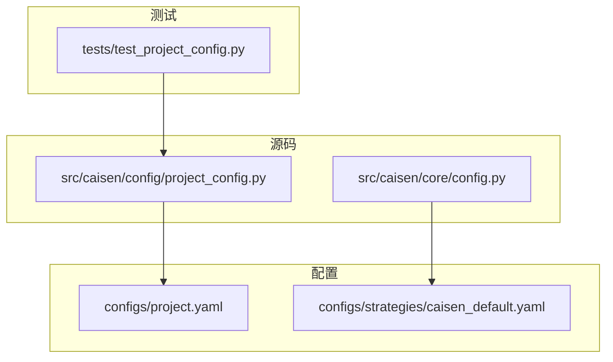
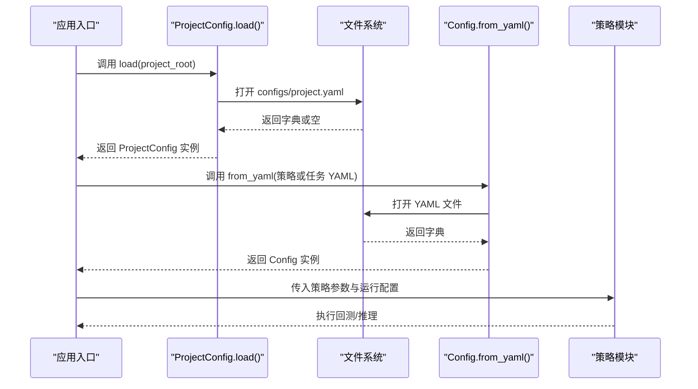
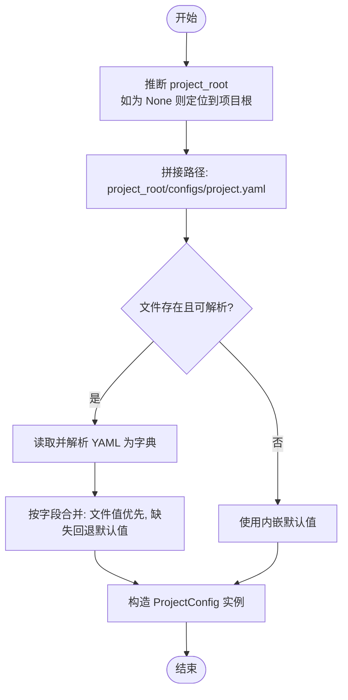
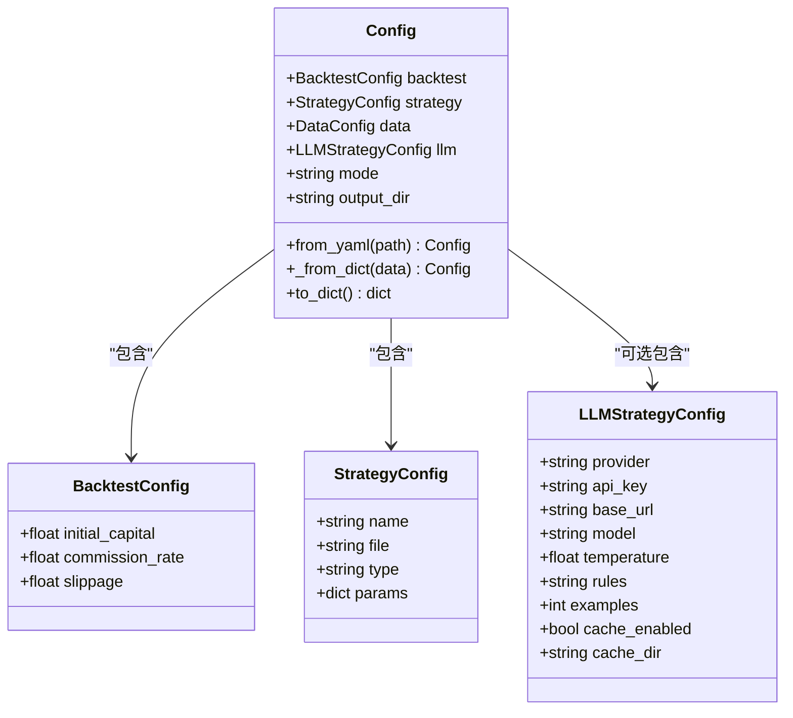
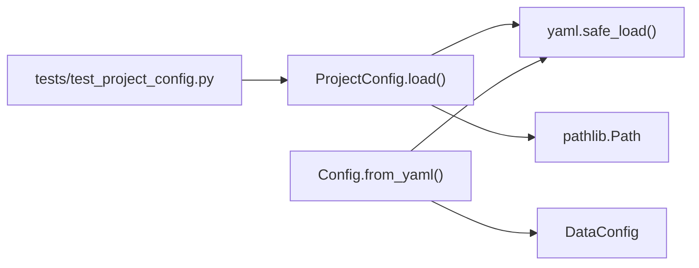

# 配置管理

<cite>
**本文引用的文件**   
- [src/caisen/config/project_config.py](file://src/caisen/config/project_config.py)
- [configs/project.yaml](file://configs/project.yaml)
- [tests/test_project_config.py](file://tests/test_project_config.py)
- [src/caisen/core/config.py](file://src/caisen/core/config.py)
- [configs/strategies/caisen_default.yaml](file://configs/strategies/caisen_default.yaml)
</cite>

## 目录
1. [简介](#简介)
2. [项目结构](#项目结构)
3. [核心组件](#核心组件)
4. [架构总览](#架构总览)
5. [详细组件分析](#详细组件分析)
6. [依赖分析](#依赖分析)
7. [性能考虑](#性能考虑)
8. [故障排查指南](#故障排查指南)
9. [结论](#结论)
10. [附录](#附录)

## 简介
本文件面向 Caisen 量化回测系统的“配置管理”主题，聚焦于 ProjectConfig 类的配置加载机制、YAML 配置文件结构与默认值覆盖规则，并给出生产环境下的最佳实践建议（敏感信息加密存储、配置中心集成、热更新与重启策略、多环境差异化配置、校验与错误处理、版本控制与变更管理等）。文档同时梳理运行时配置对象模型及其与 YAML 的映射关系，帮助读者在开发与生产环境中安全、稳定地管理配置。

## 项目结构
Caisen 的配置相关代码与示例文件分布如下：
- 项目级全局配置加载器位于 src/caisen/config/project_config.py，负责从 configs/project.yaml 读取并合并默认值。
- 项目级全局配置示例位于 configs/project.yaml。
- 运行期配置数据模型位于 src/caisen/core/config.py，提供 BacktestConfig、StrategyConfig、LLMStrategyConfig、Config 等数据结构及 YAML 解析方法。
- 策略参数示例位于 configs/strategies/caisen_default.yaml，展示策略层级的参数组织方式。
- 针对 ProjectConfig 的单元测试位于 tests/test_project_config.py，验证无文件、完整文件、部分字段缺失三种场景的行为。

图表来源
- [src/caisen/config/project_config.py:1-56](file://src/caisen/config/project_config.py#L1-L56)
- [configs/project.yaml:1-13](file://configs/project.yaml#L1-L13)
- [src/caisen/core/config.py:1-94](file://src/caisen/core/config.py#L1-L94)
- [configs/strategies/caisen_default.yaml:1-50](file://configs/strategies/caisen_default.yaml#L1-L50)
- [tests/test_project_config.py:1-45](file://tests/test_project_config.py#L1-L45)

章节来源
- [src/caisen/config/project_config.py:1-56](file://src/caisen/config/project_config.py#L1-L56)
- [configs/project.yaml:1-13](file://configs/project.yaml#L1-L13)
- [src/caisen/core/config.py:1-94](file://src/caisen/core/config.py#L1-L94)
- [configs/strategies/caisen_default.yaml:1-50](file://configs/strategies/caisen_default.yaml#L1-L50)
- [tests/test_project_config.py:1-45](file://tests/test_project_config.py#L1-L45)

## 核心组件
- ProjectConfig：项目级全局配置的数据类，包含 data_dir、output_dir、api_port 三个字段；通过类方法 load 从 configs/project.yaml 加载配置，若文件不存在则静默降级到内嵌默认值。
- Config 系列数据类：BacktestConfig、StrategyConfig、LLMStrategyConfig、Config，用于描述回测、策略、LLM 以及整体运行时的配置结构，并提供 from_yaml/_from_dict/to_dict 等方法进行序列化与反序列化。

章节来源
- [src/caisen/config/project_config.py:17-56](file://src/caisen/config/project_config.py#L17-L56)
- [src/caisen/core/config.py:9-94](file://src/caisen/core/config.py#L9-L94)

## 架构总览
下图展示了配置加载与使用的高层流程：ProjectConfig 负责读取项目级全局配置；Config 系列数据类负责将 YAML 映射为强类型对象；策略参数由独立的 YAML 文件定义，供策略模块消费。

图表来源
- [src/caisen/config/project_config.py:30-56](file://src/caisen/config/project_config.py#L30-L56)
- [src/caisen/core/config.py:59-83](file://src/caisen/core/config.py#L59-L83)

## 详细组件分析

### ProjectConfig 配置加载机制
- 默认值来源：内嵌 _DEFAULTS 字典，包含 data_dir、output_dir、api_port 的默认值。
- 配置文件路径：project_root/configs/project.yaml；当 project_root 为 None 时自动推断为包上级目录。
- 加载优先级：内嵌默认值 < project.yaml 中显式提供的值；缺失字段自动回退到默认值。
- 容错行为：当配置文件不存在或非字典内容时，静默降级到默认值，不抛出异常。
- 类型转换：构造时确保 data_dir/output_dir 为字符串，api_port 为整数。

图表来源
- [src/caisen/config/project_config.py:17-56](file://src/caisen/config/project_config.py#L17-L56)

章节来源
- [src/caisen/config/project_config.py:17-56](file://src/caisen/config/project_config.py#L17-L56)
- [tests/test_project_config.py:8-45](file://tests/test_project_config.py#L8-L45)

### YAML 配置文件结构
- 项目级全局配置（configs/project.yaml）
  - data_dir：本地行情数据根目录（存放 Parquet 文件），结构约定为 {data_dir}/{symbol}/{freq}/*.parquet。
  - output_dir：回测结果输出目录。
  - api_port：Web 服务端口。
- 策略参数示例（configs/strategies/caisen_default.yaml）
  - params：平台检测、形态识别、仓位管理与风险控制等参数。
  - patterns：各形态开关。
  - pattern_weights：形态权重（用于质量评分）。

章节来源
- [configs/project.yaml:1-13](file://configs/project.yaml#L1-L13)
- [configs/strategies/caisen_default.yaml:1-50](file://configs/strategies/caisen_default.yaml#L1-L50)

### 环境变量覆盖规则
- 当前实现未提供对 ProjectConfig 的环境变量覆盖能力。
- 在 LLM 策略配置中，API Key 支持以 ${VAR} 形式引用环境变量，但此能力属于 LLM 配置层面，并非 ProjectConfig 的全局覆盖机制。

章节来源
- [src/caisen/core/config.py:34-36](file://src/caisen/core/config.py#L34-L36)

### 生产环境配置管理最佳实践
- 敏感信息加密存储
  - 建议将 API Key、数据库凭证等敏感信息放入受控的密钥管理系统（如 KMS、Vault、云厂商 Secret Manager），并在启动阶段解密注入到进程环境变量或内存中，避免明文落盘。
- 配置中心集成
  - 建议引入配置中心（如 Nacos、Apollo、Consul KV），在启动时拉取最新配置，结合版本号与签名校验保证一致性。
- 热更新机制
  - 对于非关键配置项（如日志级别、采样率），可通过配置中心推送 + 进程内监听事件的方式实现热更新；对于影响状态的关键配置（如端口、数据目录），建议采用滚动重启或蓝绿发布。
- 运行时配置修改与服务重启策略
  - 关键配置变更应触发优雅重启：先停止接收新请求，等待在途任务完成，再切换至新版本实例。
- 多环境差异化配置
  - 开发/测试/生产环境通过不同配置源组合：本地默认值 < 环境专属 YAML < 配置中心 < 环境变量（优先级递增）。
- 配置校验与错误处理
  - 建议在加载后执行结构化校验（类型、范围、必填项），失败时快速失败并记录上下文，便于定位问题。
- 配置版本控制与变更管理
  - 所有配置纳入版本控制，变更需走评审与自动化校验；重大变更提供迁移脚本与向后兼容策略。

[本节为通用指导，不涉及具体文件分析]

### 配置热更新机制与重启策略
- 热更新适用面
  - 仅适用于不影响持久化路径、网络端口、数据源连接等关键属性的配置项。
- 实现思路
  - 基于配置中心的事件订阅，收到变更后在内存中替换对应配置对象，并通知相关子系统刷新缓存或重连。
- 重启策略
  - 关键配置变更采用滚动重启；非关键配置变更采用原地热更。

[本节为通用指导，不涉及具体文件分析]

### 多环境配置管理
- 推荐分层
  - 基础默认值（代码内嵌）
  - 环境专属 YAML（dev/test/prod）
  - 配置中心（集中化管理）
  - 环境变量（最高优先级，适合敏感信息与部署差异）
- 合并顺序
  - 低优先级到高优先级依次覆盖，最终形成运行时唯一配置视图。

[本节为通用指导，不涉及具体文件分析]

### 配置验证与错误处理
- 校验维度
  - 类型校验（如端口为整数、路径为字符串）
  - 范围校验（如端口范围、最小资金、滑点上限）
  - 业务约束（如必填字段、互斥字段）
- 错误处理
  - 加载失败快速失败，附带上下文（文件路径、字段名、期望类型）
  - 提供诊断信息（当前值、默认值、来源）

[本节为通用指导，不涉及具体文件分析]

### 配置版本控制与变更管理
- 版本控制
  - 所有配置纳入 Git 管理，提交信息明确变更意图与影响范围。
- 变更管理
  - 变更需经过自动化校验（schema 校验、回归用例）、人工评审与灰度发布。
- 迁移与兼容性
  - 新增字段需提供默认值与迁移脚本；废弃字段保留一段时间并给出告警提示。

[本节为通用指导，不涉及具体文件分析]

### 运行时配置对象模型（Config 系列）
- 数据类关系
  - BacktestConfig：回测参数（初始资金、手续费、滑点）
  - StrategyConfig：策略元信息与参数
  - LLMStrategyConfig：LLM 提供商、模型、温度、Prompt、缓存等
  - Config：聚合上述配置，并提供 from_yaml/_from_dict/to_dict 方法
- 与 YAML 的映射
  - from_yaml 直接解析 YAML 为字典，再由 _from_dict 填充到各数据类实例。

图表来源
- [src/caisen/core/config.py:9-94](file://src/caisen/core/config.py#L9-L94)

章节来源
- [src/caisen/core/config.py:9-94](file://src/caisen/core/config.py#L9-L94)

## 依赖分析
- ProjectConfig 依赖 yaml.safe_load 进行解析，依赖 Path 进行路径操作。
- Config 系列数据类依赖 DataConfig（来自 data.config），并通过 from_yaml/_from_dict 与 YAML 交互。
- 测试用例验证了 ProjectConfig 在无文件、完整文件、部分字段缺失三种场景下的行为。

图表来源
- [src/caisen/config/project_config.py:1-56](file://src/caisen/config/project_config.py#L1-L56)
- [src/caisen/core/config.py:59-83](file://src/caisen/core/config.py#L59-L83)
- [tests/test_project_config.py:1-45](file://tests/test_project_config.py#L1-L45)

章节来源
- [src/caisen/config/project_config.py:1-56](file://src/caisen/config/project_config.py#L1-L56)
- [src/caisen/core/config.py:59-83](file://src/caisen/core/config.py#L59-L83)
- [tests/test_project_config.py:1-45](file://tests/test_project_config.py#L1-L45)

## 性能考虑
- 配置加载频率低，通常仅在启动时执行一次，性能开销可忽略。
- 若引入配置中心与热更新，应避免频繁全量拉取，采用增量更新与本地缓存。
- 大体积配置（如大量策略参数）建议按需加载与懒初始化。

[本节为通用指导，不涉及具体文件分析]

## 故障排查指南
- 常见问题
  - 配置文件路径错误或权限不足导致无法读取。
  - YAML 格式错误导致解析失败。
  - 字段类型不匹配（如端口非整数）。
- 定位步骤
  - 确认 project_root 推断是否正确。
  - 检查 configs/project.yaml 是否存在且可读。
  - 查看日志中的错误上下文（文件路径、字段名、期望类型）。
- 恢复措施
  - 修正 YAML 语法与字段类型。
  - 补充缺失字段或使用默认值。
  - 在容器或 CI 中加入配置校验步骤，提前发现问题。

章节来源
- [tests/test_project_config.py:8-45](file://tests/test_project_config.py#L8-L45)
- [src/caisen/config/project_config.py:30-56](file://src/caisen/config/project_config.py#L30-L56)

## 结论
Caisen 的配置体系以 ProjectConfig 为核心，提供简洁稳健的项目级全局配置加载机制，并通过 Config 系列数据类将 YAML 映射为强类型对象，便于在策略与回测模块中使用。生产环境建议引入配置中心、密钥管理与严格的校验流程，结合热更新与滚动重启策略，保障配置变更的安全性与稳定性。

[本节为总结性内容，不涉及具体文件分析]

## 附录
- 术语
  - 配置中心：集中化管理配置的分布式系统。
  - 热更新：在不重启服务的情况下动态更新配置。
  - 滚动重启：逐步替换旧实例为新实例，保持服务可用。
- 参考文件
  - 项目级全局配置加载器：[src/caisen/config/project_config.py](file://src/caisen/config/project_config.py)
  - 项目级全局配置示例：[configs/project.yaml](file://configs/project.yaml)
  - 运行时配置数据模型：[src/caisen/core/config.py](file://src/caisen/core/config.py)
  - 策略参数示例：[configs/strategies/caisen_default.yaml](file://configs/strategies/caisen_default.yaml)
  - 单元测试：[tests/test_project_config.py](file://tests/test_project_config.py)