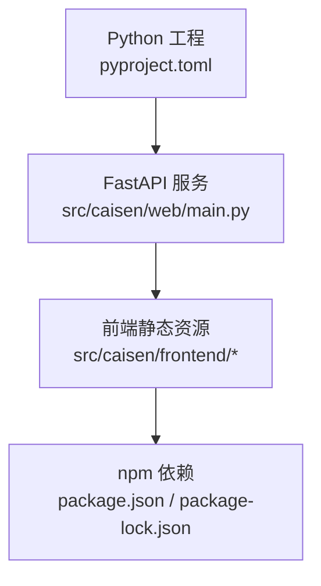
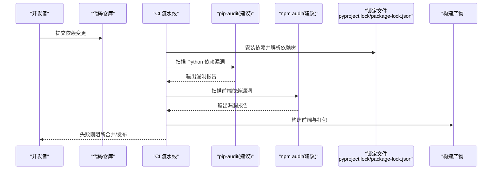
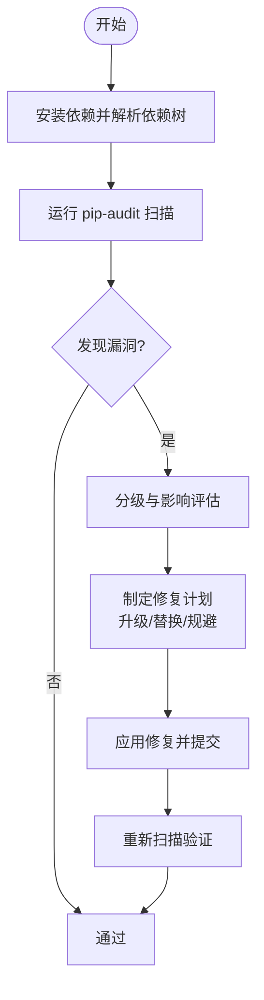
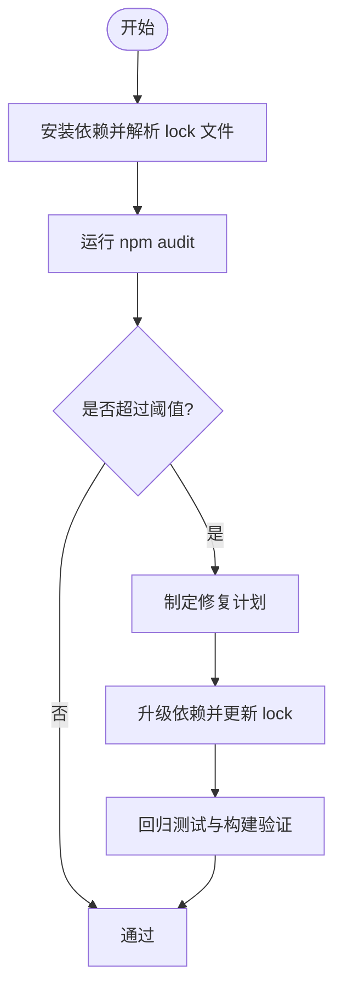
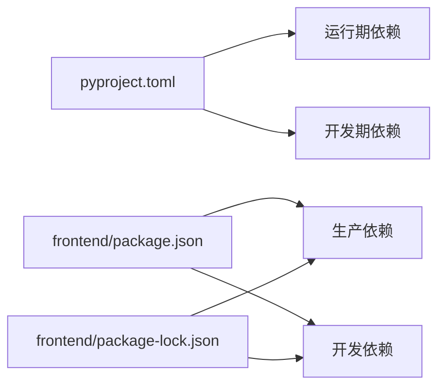

# 依赖包安全

<cite>
**本文引用的文件**   
- [pyproject.toml](file://pyproject.toml)
- [package.json](file://src/caisen/frontend/package.json)
- [package-lock.json](file://src/caisen/frontend/package-lock.json)
- [web/main.py](file://src/caisen/web/main.py)
- [lint_structure.py](file://src/caisen/lint_structure.py)
- [test_path_traversal.py](file://tests/test_path_traversal.py)
- [002-strategy-validation.md](file://docs/issues/strategies/002-strategy-validation.md)
</cite>

## 目录
1. [简介](#简介)
2. [项目结构](#项目结构)
3. [核心组件](#核心组件)
4. [架构总览](#架构总览)
5. [详细组件分析](#详细组件分析)
6. [依赖关系分析](#依赖关系分析)
7. [性能考虑](#性能考虑)
8. [故障排查指南](#故障排查指南)
9. [结论](#结论)
10. [附录](#附录)

## 简介
本指南面向 Caisen 量化回测系统，聚焦“依赖包安全管理”，覆盖 Python 与前端（npm）两类依赖的安全扫描、漏洞检测与修复策略；第三方库评估与许可证合规；依赖更新流程与自动化；容器镜像安全；以及开发环境隔离与沙箱执行。文档结合仓库现有配置与代码现状，给出可落地的实践建议与流程图示。

## 项目结构
Caisen 采用 Python 后端 + 轻量前端（Vite + ECharts）的混合技术栈：
- Python 侧使用 pyproject.toml 声明运行时与可选依赖，构建由 hatchling 驱动。
- 前端位于 src/caisen/frontend，使用 package.json 管理依赖，并生成 package-lock.json 锁定版本。
- Web 服务基于 FastAPI，提供静态资源与 API。

图表来源
- [pyproject.toml:1-59](file://pyproject.toml#L1-L59)
- [web/main.py:1-319](file://src/caisen/web/main.py#L1-L319)
- [package.json:1-26](file://src/caisen/frontend/package.json#L1-L26)
- [package-lock.json:1-800](file://src/caisen/frontend/package-lock.json#L1-L800)

章节来源
- [pyproject.toml:1-59](file://pyproject.toml#L1-L59)
- [package.json:1-26](file://src/caisen/frontend/package.json#L1-L26)
- [package-lock.json:1-800](file://src/caisen/frontend/package-lock.json#L1-L800)
- [web/main.py:1-319](file://src/caisen/web/main.py#L1-L319)

## 核心组件
- Python 依赖声明与可选依赖：通过 pyproject.toml 集中管理运行期与开发期依赖，便于统一审计与锁定。
- 前端依赖声明与锁定：通过 package.json 与 package-lock.json 明确依赖树与精确版本，降低供应链风险。
- Web 路径访问校验：在静态资源与结果读取路径上实施严格校验，防止路径遍历攻击。
- 目录结构与命名规范检查：lint_structure.py 提供基础质量门禁，可作为安全流水线的前置环节。

章节来源
- [pyproject.toml:1-59](file://pyproject.toml#L1-L59)
- [package.json:1-26](file://src/caisen/frontend/package.json#L1-L26)
- [package-lock.json:1-800](file://src/caisen/frontend/package-lock.json#L1-L800)
- [web/main.py:28-39](file://src/caisen/web/main.py#L28-L39)
- [lint_structure.py:76-120](file://src/caisen/lint_structure.py#L76-L120)

## 架构总览
下图展示依赖安全相关的关键交互点：依赖声明、锁定、扫描、修复与发布前验证。

说明
- 当前仓库未内置 pip-audit 或 npm audit 的脚本与 CI 配置，建议在流水线中集成上述工具以形成闭环。
- 前端已存在 package-lock.json，有利于复现与锁定依赖树。

[本节为概念性说明，不直接分析具体文件]

## 详细组件分析

### Python 依赖安全扫描与修复策略
- 现状
  - 依赖集中在 pyproject.toml，包含运行期与可选开发依赖。
  - 未发现 pip-audit 集成脚本或 CI 任务。
- 建议实践
  - 引入 pip-audit 进行依赖漏洞扫描，作为本地与 CI 的固定步骤。
  - 对关键依赖设置最小版本约束，避免已知漏洞版本进入依赖树。
  - 定期自动修复：优先升级至上游修复版本；若不可行，记录风险并制定缓解措施。
  - 将扫描结果纳入 PR 检查，阻断高危漏洞合并。

[本节为通用流程说明，不直接分析具体文件]

### 前端依赖管理与 npm audit 集成
- 现状
  - 前端依赖定义于 package.json，且已生成 package-lock.json，具备版本锁定能力。
  - 未发现 npm audit 集成脚本或 CI 任务。
- 建议实践
  - 在本地与 CI 中集成 npm audit，按严重级别阻断合并。
  - 使用 --audit-level 控制阈值，结合 --json 输出结构化报告。
  - 对生产依赖（dependencies）与开发依赖（devDependencies）分别治理。
  - 定期更新依赖，优先选择语义化版本内的安全补丁。

[本节为通用流程说明，不直接分析具体文件]

### 第三方库安全评估与许可证合规
- 供应商风险评估
  - 评估活跃度、维护频率、历史漏洞响应速度、社区信任度。
  - 对关键库建立白名单与准入标准。
- 许可证合规检查
  - 识别 GPL/LGPL/AGPL 等强传染性许可证，评估业务影响。
  - 建立许可证清单与审批流程，禁止高风险许可证进入生产。
- 供应链安全
  - 启用私有源与镜像加速，限制公共源随机拉取。
  - 对依赖签名与完整性校验（如 npm integrity、Python 包签名）进行必要验证。

[本节为通用流程说明，不直接分析具体文件]

### 依赖更新流程与回归测试
- 定期扫描自动化
  - 每周定时触发 Python 与前端依赖扫描，生成报告并通知责任人。
- 安全补丁应用
  - 优先修补高危漏洞；无法立即修复时，记录风险并制定临时缓解方案。
- 回归测试
  - 每次依赖变更后，执行单元测试与端到端测试，确保功能稳定。
- 版本策略
  - 遵循语义化版本，尽量小步快跑，减少大版本跳跃带来的破坏性变更。

[本节为通用流程说明，不直接分析具体文件]

### 容器镜像安全
- 基础镜像选择
  - 选用官方精简镜像（如 python:slim、node:alpine），减少攻击面。
- 镜像扫描
  - 在镜像构建后执行镜像层扫描（例如 trivy、grype），阻断高危漏洞镜像入库。
- 最小化镜像构建
  - 多阶段构建，仅拷贝运行所需文件；清理缓存与无关文件。
- 运行时加固
  - 非 root 用户运行，只读文件系统，限制网络与权限。

[本节为通用流程说明，不直接分析具体文件]

### 开发环境安全与沙箱执行
- 虚拟环境隔离
  - 每个项目使用独立虚拟环境，避免全局污染。
- 依赖污染防护
  - 禁止从全局环境导入依赖，强制使用 venv/uv/pip-tools 等工具链。
- 沙箱执行
  - 对不受信代码（如 LLM 生成的策略）进行 AST 校验、危险 import 黑名单、超时与内存限制，并在受限环境中执行。
  - 参考仓库中的策略安全问题与建议修复方向。

章节来源
- [002-strategy-validation.md:1-50](file://docs/issues/strategies/002-strategy-validation.md#L1-L50)

## 依赖关系分析
- Python 依赖
  - 运行期依赖包括数据处理、Web 框架与 CLI 工具等。
  - 可选依赖用于开发与测试，应区分环境与用途，避免在生产镜像中引入。
- 前端依赖
  - 生产依赖主要为可视化库，开发依赖包含构建与测试工具。
  - package-lock.json 锁定了精确版本，有助于复现与安全审计。

图表来源
- [pyproject.toml:11-30](file://pyproject.toml#L11-L30)
- [package.json:15-24](file://src/caisen/frontend/package.json#L15-L24)
- [package-lock.json:1-800](file://src/caisen/frontend/package-lock.json#L1-L800)

章节来源
- [pyproject.toml:11-30](file://pyproject.toml#L11-L30)
- [package.json:15-24](file://src/caisen/frontend/package.json#L15-L24)
- [package-lock.json:1-800](file://src/caisen/frontend/package-lock.json#L1-L800)

## 性能考虑
- 依赖扫描应在并行环境中执行，缩短流水线时间。
- 对大型前端依赖树，优先增量扫描与缓存依赖元数据。
- 在 CI 中分离构建与扫描阶段，避免重复安装。

[本节为通用指导，不直接分析具体文件]

## 故障排查指南
- 路径遍历防护
  - Web 服务对静态资源与结果文件的路径访问进行了严格校验，拒绝包含 ..、/、\ 及逃逸出允许范围的路径。
  - 相关测试覆盖了常见绕过场景，确保接口安全性。
- 常见问题定位
  - 若出现 400 错误，检查请求参数是否包含非法字符或尝试逃逸基目录。
  - 若返回 404，确认目标文件是否存在于预期目录。

章节来源
- [web/main.py:28-39](file://src/caisen/web/main.py#L28-L39)
- [test_path_traversal.py:1-72](file://tests/test_path_traversal.py#L1-L72)

## 结论
通过对 Python 与前端依赖的统一声明与锁定，并结合 pip-audit 与 npm audit 的自动化扫描与修复流程，可有效降低供应链安全风险。配合严格的许可证合规审查、容器镜像加固与开发环境隔离，能够显著提升 Caisen 系统的整体安全性与可维护性。

[本节为总结性内容，不直接分析具体文件]

## 附录
- 建议的流水线任务清单
  - 安装依赖并解析依赖树
  - 运行 pip-audit 与 npm audit
  - 构建前端与打包产物
  - 执行单元测试与端到端测试
  - 生成安全报告并归档
- 建议的本地命令示例（供参考）
  - Python：pip-audit -r requirements.txt 或针对 pyproject 的等价方式
  - 前端：npm audit --audit-level=high --json > audit-report.json

[本节为通用建议，不直接分析具体文件]