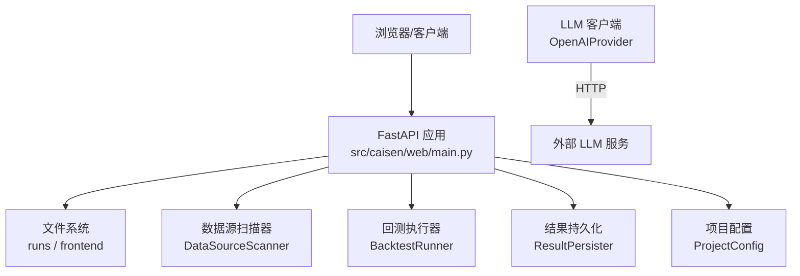
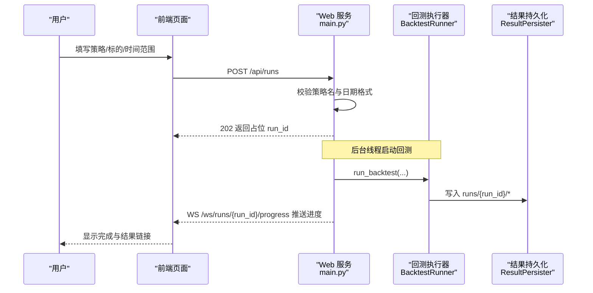
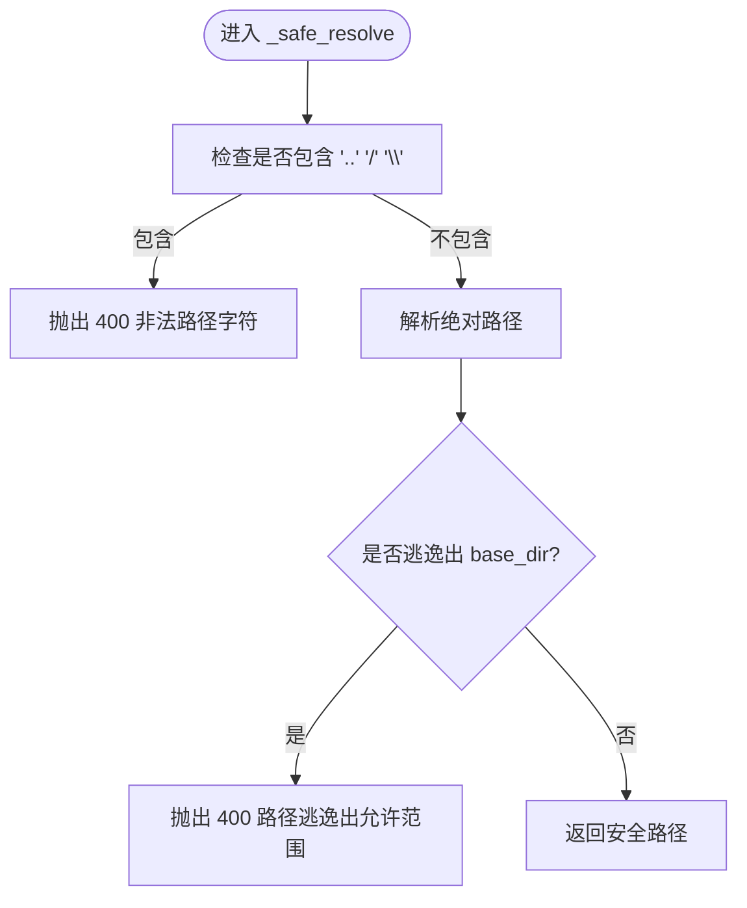
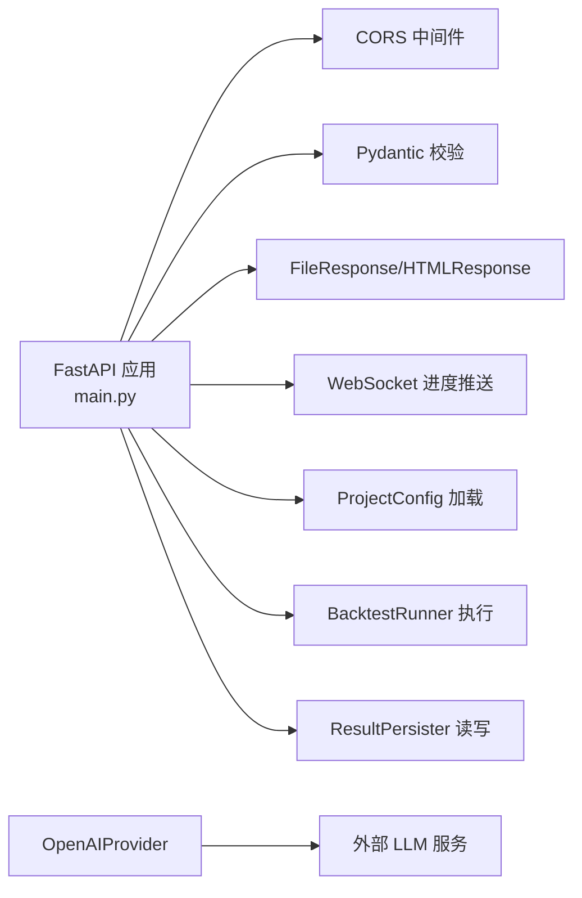

# 安全加固

<cite>
**本文引用的文件**   
- [src/caisen/web/main.py](file://src/caisen/web/main.py)
- [src/caisen/config/project_config.py](file://src/caisen/config/project_config.py)
- [configs/project.yaml](file://configs/project.yaml)
- [pyproject.toml](file://pyproject.toml)
- [tests/test_path_traversal.py](file://tests/test_path_traversal.py)
- [tests/test_web_api.py](file://tests/test_web_api.py)
- [src/caisen/strategy/llm/provider.py](file://src/caisen/strategy/llm/provider.py)
- [configs/strategies/config_llm_local.yaml](file://configs/strategies/config_llm_local.yaml)
- [src/caisen/data/config.py](file://src/caisen/data/config.py)
- [src/caisen/frontend/src/js/components.js](file://src/caisen/frontend/src/js/components.js)
- [src/caisen/frontend/src/js/backtest-panel.js](file://src/caisen/frontend/src/js/backtest-panel.js)
- [tests/js/utils.test.js](file://tests/js/utils.test.js)
</cite>

## 目录
1. [简介](#简介)
2. [项目结构](#项目结构)
3. [核心组件](#核心组件)
4. [架构总览](#架构总览)
5. [详细组件分析](#详细组件分析)
6. [依赖分析](#依赖分析)
7. [性能考虑](#性能考虑)
8. [故障排查指南](#故障排查指南)
9. [结论](#结论)
10. [附录](#附录)

## 简介
本指南面向 Caisen 量化回测系统的安全加固，覆盖访问控制、认证与鉴权、API 密钥保护、网络安全（HTTPS、CORS、安全头）、数据安全（传输与存储）、输入验证与输出编码、依赖包安全管理、安全审计与合规检查、以及安全事件响应等关键领域。文档基于仓库现有实现进行现状评估，并给出可落地的加固建议与实施路径。

## 项目结构
当前 Web 服务由 FastAPI 提供，包含 REST 与 WebSocket 端点；前端静态资源通过内置路由提供；配置通过 ProjectConfig 从 YAML 加载；LLM 客户端支持自定义 base_url 与 api_key；数据扫描器用于枚举本地行情数据。

图表来源
- [src/caisen/web/main.py:68-304](file://src/caisen/web/main.py#L68-L304)
- [src/caisen/config/project_config.py:24-55](file://src/caisen/config/project_config.py#L24-L55)
- [src/caisen/strategy/llm/provider.py:14-55](file://src/caisen/strategy/llm/provider.py#L14-L55)

章节来源
- [src/caisen/web/main.py:1-319](file://src/caisen/web/main.py#L1-L319)
- [src/caisen/config/project_config.py:1-56](file://src/caisen/config/project_config.py#L1-L56)
- [pyproject.toml:1-59](file://pyproject.toml#L1-L59)

## 核心组件
- Web 服务与路由：提供健康检查、策略/数据源列表、回测触发与进度推送、可视化数据获取等接口。
- 路径安全校验：对 run_id 与静态资源文件名进行白名单式解析，防止路径遍历。
- 项目配置：从 configs/project.yaml 读取 data_dir、output_dir、api_port，缺失时回退默认值。
- LLM 客户端：支持自定义 base_url 与 api_key，便于本地或兼容服务接入。
- 前端渲染：HTML/JS/CSS 由后端直接返回，存在潜在 XSS 风险点需关注。

章节来源
- [src/caisen/web/main.py:68-304](file://src/caisen/web/main.py#L68-L304)
- [src/caisen/web/main.py:28-39](file://src/caisen/web/main.py#L28-L39)
- [src/caisen/config/project_config.py:24-55](file://src/caisen/config/project_config.py#L24-L55)
- [src/caisen/strategy/llm/provider.py:14-55](file://src/caisen/strategy/llm/provider.py#L14-L55)

## 架构总览
下图展示一次“创建回测任务”的端到端流程，包括参数校验、后台执行与进度推送。

图表来源
- [src/caisen/web/main.py:107-132](file://src/caisen/web/main.py#L107-L132)
- [src/caisen/web/main.py:247-302](file://src/caisen/web/main.py#L247-L302)

章节来源
- [src/caisen/web/main.py:107-132](file://src/caisen/web/main.py#L107-L132)
- [src/caisen/web/main.py:247-302](file://src/caisen/web/main.py#L247-L302)

## 详细组件分析

### 访问控制与认证鉴权
现状
- 未实现用户认证与会话管理，所有公开端点均可匿名访问。
- 无角色/权限模型，无法区分管理员与普通用户。
- 健康检查与健康探针未做鉴权。

建议
- 引入统一鉴权中间件（如基于 JWT 或会话），为敏感端点添加认证要求。
- 将 /health 保留为公开，其余 /api/* 与 /report.html 默认需要认证。
- 增加最小权限原则：仅允许受信任 IP 段访问管理端点（可通过反向代理层实现）。

章节来源
- [src/caisen/web/main.py:86-94](file://src/caisen/web/main.py#L86-L94)
- [src/caisen/web/main.py:224-227](file://src/caisen/web/main.py#L224-L227)

### API 密钥保护（LLM）
现状
- OpenAIProvider 接受 api_key 与 base_url，可从配置文件注入。
- 示例配置中 api_key 使用占位值，实际部署应通过环境变量或密钥管理服务注入。

建议
- 禁止在代码与配置文件中硬编码真实密钥；优先使用环境变量或运行时注入。
- 对 LLM 调用增加超时、重试与熔断策略，避免被滥用或异常上游拖垮服务。
- 记录最小必要日志（脱敏），避免泄露密钥片段。

章节来源
- [src/caisen/strategy/llm/provider.py:14-55](file://src/caisen/strategy/llm/provider.py#L14-L55)
- [configs/strategies/config_llm_local.yaml:22-30](file://configs/strategies/config_llm_local.yaml#L22-L30)

### 网络安全配置（HTTPS、CORS、安全头）
现状
- CORS 中间件允许所有来源、方法与头部，且允许携带凭据，过于宽松。
- 未显式设置安全相关响应头（如 HSTS、X-Frame-Options、Content-Security-Policy 等）。
- 服务默认监听 0.0.0.0，生产环境应置于反向代理之后并启用 HTTPS。

建议
- 收紧 CORS：限定允许的 origin、方法与头部，谨慎开启 allow_credentials。
- 在反向代理层强制 HTTPS，并启用 HSTS、严格 CSP、X-Frame-Options、Referrer-Policy 等。
- 限制 host 绑定范围，生产环境建议使用 127.0.0.1 并由反向代理暴露。

章节来源
- [src/caisen/web/main.py:76-83](file://src/caisen/web/main.py#L76-L83)
- [src/caisen/web/main.py:311-315](file://src/caisen/web/main.py#L311-L315)

### 数据安全（传输与存储）
现状
- 传输：默认 HTTP，未强制 TLS。
- 存储：运行结果以 JSON/Parquet 落盘，敏感字段（如策略参数、账户信息）若存在需加密存储。

建议
- 传输：通过反向代理启用 HTTPS，禁用弱密码套件与旧协议版本。
- 存储：对敏感数据进行加密（如磁盘加密或应用层加密），并对备份进行加密与访问控制。
- 对 runs 目录设置严格的文件系统权限，限制进程外访问。

章节来源
- [src/caisen/web/main.py:311-315](file://src/caisen/web/main.py#L311-L315)
- [src/caisen/result/persistence.py](file://src/caisen/result/persistence.py)

### 输入验证与输出编码（防注入与 XSS）
现状
- 路径遍历防护：_safe_resolve 拒绝包含 ..、/、\ 的路径，并校验最终路径是否逃逸出基目录。
- 日期格式校验：使用正则校验 YYYY-MM-DD。
- 前端渲染：部分模板拼接 HTML，存在潜在 XSS 风险。

建议
- 继续强化路径白名单与最小暴露面，避免动态拼接任意路径。
- 前端输出采用安全的文本插入方式，避免 innerHTML 直接拼接不可信数据。
- 对所有用户可控输入进行服务端二次校验与长度限制。

图表来源
- [src/caisen/web/main.py:28-39](file://src/caisen/web/main.py#L28-L39)

章节来源
- [src/caisen/web/main.py:28-39](file://src/caisen/web/main.py#L28-L39)
- [src/caisen/web/main.py:50-55](file://src/caisen/web/main.py#L50-L55)
- [src/caisen/frontend/src/js/components.js:663-703](file://src/caisen/frontend/src/js/components.js#L663-L703)

### 依赖包安全管理
现状
- Python 依赖集中在 pyproject.toml，包含 fastapi、uvicorn、websockets 等。
- 前端依赖位于 src/caisen/frontend/package-lock.json。

建议
- 建立定期漏洞扫描流程（如 pip-audit、npm audit），并在 CI 中阻断高危漏洞。
- 锁定依赖版本，及时更新安全补丁；对第三方库进行 SBOM 生成与跟踪。
- 对构建产物进行签名与完整性校验，防止供应链污染。

章节来源
- [pyproject.toml:11-19](file://pyproject.toml#L11-L19)
- [src/caisen/frontend/package-lock.json:2411-2450](file://src/caisen/frontend/package-lock.json#L2411-L2450)

### 安全审计与合规检查
现状
- 已有路径遍历与基本 API 行为测试。
- 未见专门的安全扫描与渗透测试流程。

建议
- 集成 SAST/DAST 工具（如 Bandit、Semgrep、OWASP ZAP）到 CI。
- 定期进行渗透测试与红蓝对抗演练，覆盖认证绕过、越权、注入、XSS 等场景。
- 建立安全基线与变更审批流程，确保高风险变更经过安全评审。

章节来源
- [tests/test_path_traversal.py:1-87](file://tests/test_path_traversal.py#L1-L87)
- [tests/test_web_api.py:1-47](file://tests/test_web_api.py#L1-L47)

### 安全事件响应
现状
- 错误处理较为简单，未集中记录安全事件。

建议
- 建立统一安全日志规范，记录认证失败、越权尝试、异常输入、速率限制触发等。
- 定义告警阈值与自动化处置（如临时封禁、限流、降级）。
- 制定应急响应预案，明确事件分级、上报流程与复盘机制。

章节来源
- [src/caisen/web/main.py:118-131](file://src/caisen/web/main.py#L118-L131)
- [src/caisen/web/main.py:285-302](file://src/caisen/web/main.py#L285-L302)

## 依赖分析

图表来源
- [src/caisen/web/main.py:68-304](file://src/caisen/web/main.py#L68-L304)
- [src/caisen/config/project_config.py:24-55](file://src/caisen/config/project_config.py#L24-L55)
- [src/caisen/strategy/llm/provider.py:14-55](file://src/caisen/strategy/llm/provider.py#L14-L55)

章节来源
- [src/caisen/web/main.py:68-304](file://src/caisen/web/main.py#L68-L304)
- [src/caisen/config/project_config.py:24-55](file://src/caisen/config/project_config.py#L24-L55)
- [src/caisen/strategy/llm/provider.py:14-55](file://src/caisen/strategy/llm/provider.py#L14-L55)

## 性能考虑
- 回测任务在后台线程执行，注意并发上限与资源隔离，避免单任务耗尽 CPU/内存。
- WebSocket 推送队列设置超时，避免连接长期占用。
- 大文件（data.json、parquet）下载应启用分块与缓存控制，减少带宽压力。

[本节为通用指导，不直接分析具体文件]

## 故障排查指南
- 健康检查：确认 /health 返回正常状态码与内容。
- 路径遍历：若出现 400 错误，检查请求路径是否包含受限字符或试图逃逸基目录。
- 数据源扫描：确认 data_dir 结构与命名符合预期，扫描器能正确解析 symbol/freq/date_range。
- 前端渲染：若出现空白或报错，检查 JS/CSS 资源路径与跨域策略。

章节来源
- [src/caisen/web/main.py:224-227](file://src/caisen/web/main.py#L224-L227)
- [src/caisen/web/main.py:28-39](file://src/caisen/web/main.py#L28-L39)
- [tests/test_data_source_scanner.py:41-64](file://tests/test_data_source_scanner.py#L41-L64)
- [src/caisen/frontend/src/js/backtest-panel.js:303-327](file://src/caisen/frontend/src/js/backtest-panel.js#L303-L327)

## 结论
当前系统在路径安全与基础输入校验方面有一定保障，但整体安全能力仍需加强：缺少认证鉴权、CORS 过于宽松、未强制 HTTPS、敏感密钥管理不足、前端存在潜在 XSS 风险、缺乏系统化安全审计与事件响应机制。建议按优先级逐步落地上述加固措施，并结合反向代理与容器化部署形成纵深防御体系。

[本节为总结性内容，不直接分析具体文件]

## 附录

### 配置项说明（与安全相关）
- api_port：Web 服务端口，生产环境建议通过反向代理暴露并启用 HTTPS。
- output_dir：回测结果输出目录，应设置最小权限并限制访问。
- data_dir：本地行情数据根目录，应避免对外暴露并可读性最小化。

章节来源
- [src/caisen/config/project_config.py:24-55](file://src/caisen/config/project_config.py#L24-L55)
- [configs/project.yaml:1-12](file://configs/project.yaml#L1-L12)

### 前端安全要点
- 避免使用 innerHTML 拼接不可信数据，改用文本节点或框架提供的安全渲染方法。
- 对错误消息进行脱敏与长度限制，避免泄露内部细节。
- 对数值与时间戳格式化函数进行健壮性校验，防止异常值导致 UI 崩溃。

章节来源
- [src/caisen/frontend/src/js/components.js:663-703](file://src/caisen/frontend/src/js/components.js#L663-L703)
- [src/caisen/frontend/src/js/backtest-panel.js:303-327](file://src/caisen/frontend/src/js/backtest-panel.js#L303-L327)
- [tests/js/utils.test.js:45-76](file://tests/js/utils.test.js#L45-L76)