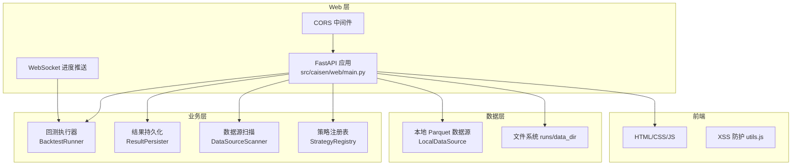
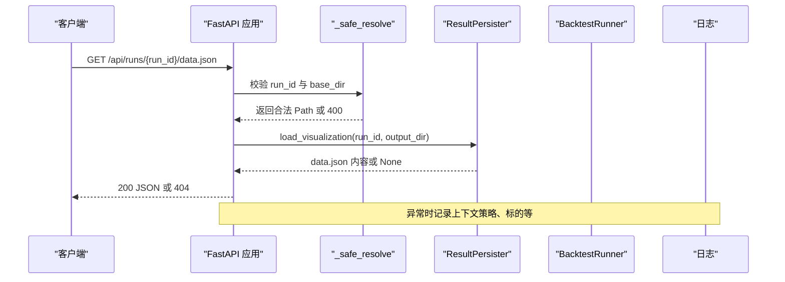
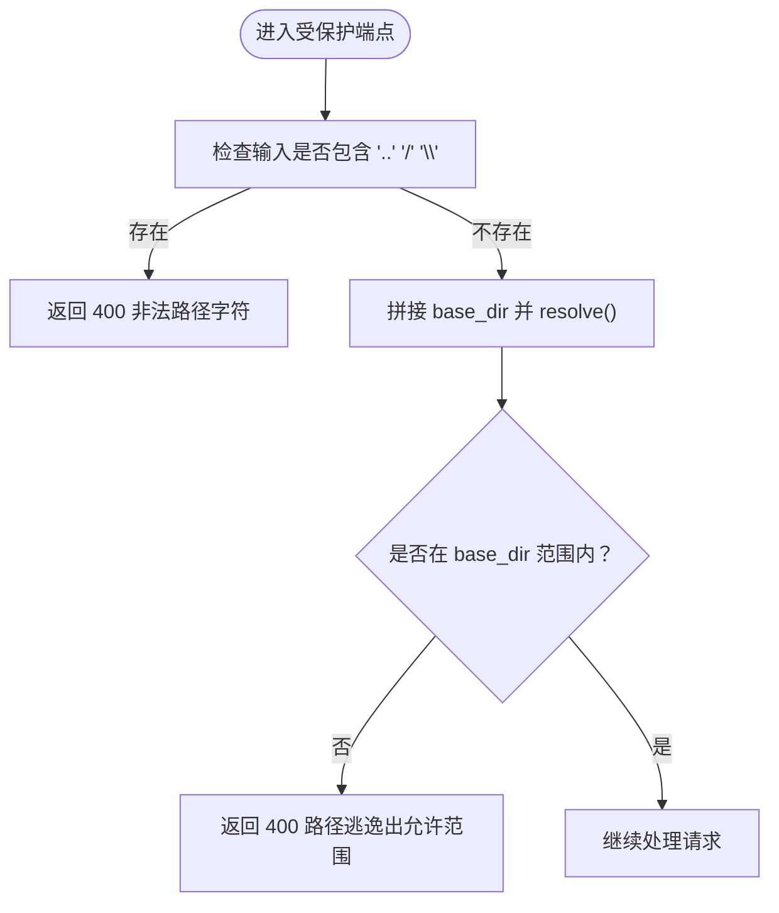
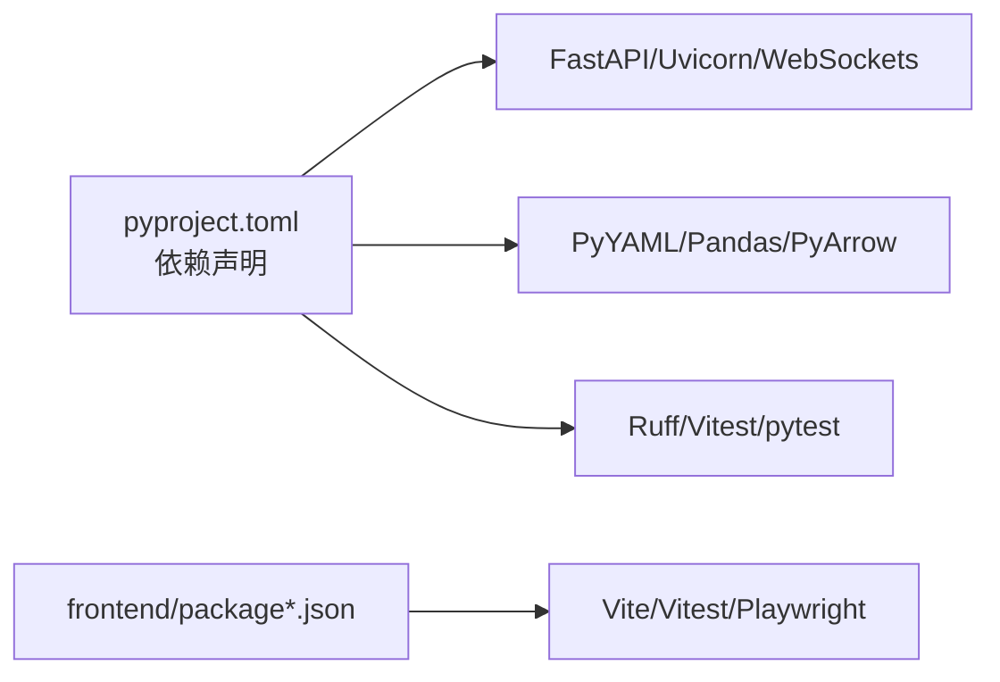

# 安全审计

<cite>
**本文引用的文件**   
- [src/caisen/web/main.py](file://src/caisen/web/main.py)
- [tests/test_path_traversal.py](file://tests/test_path_traversal.py)
- [pyproject.toml](file://pyproject.toml)
- [configs/project.yaml](file://configs/project.yaml)
- [src/caisen/config/project_config.py](file://src/caisen/config/project_config.py)
- [src/caisen/result/persistence.py](file://src/caisen/result/persistence.py)
- [src/caisen/data/local_source.py](file://src/caisen/data/local_source.py)
- [src/caisen/frontend/src/js/utils.js](file://src/caisen/frontend/src/js/utils.js)
- [src/caisen/frontend/src/js/backtest-panel.js](file://src/caisen/frontend/src/js/backtest-panel.js)
- [src/caisen/frontend/src/js/runs-list.js](file://src/caisen/frontend/src/js/runs-list.js)
- [docs/issues/strategies/002-strategy-validation.md](file://docs/issues/strategies/002-strategy-validation.md)
</cite>

## 目录
1. [引言](#引言)
2. [项目结构](#项目结构)
3. [核心组件](#核心组件)
4. [架构总览](#架构总览)
5. [详细组件分析](#详细组件分析)
6. [依赖关系分析](#依赖关系分析)
7. [性能与安全权衡](#性能与安全权衡)
8. [故障排查指南](#故障排查指南)
9. [结论](#结论)
10. [附录](#附录)

## 引言
本指南面向 Caisen 量化回测系统的安全审计与合规检查，覆盖代码安全扫描、静态分析工具集成、漏洞检测与质量检查；渗透测试方法（自动化脚本与手动流程）；安全合规（GDPR、金融监管与行业标准）；安全事件检测与告警；安全基线配置与持续监控；以及审计报告生成与整改跟踪。文档以仓库现有实现为依据，结合风险识别与改进建议，帮助团队建立可落地的安全工程体系。

## 项目结构
从安全视角看，关键边界包括：
- Web 服务入口与路径访问控制（FastAPI + 前端资源提供）
- 结果持久化与数据读取（Parquet/JSON）
- 本地数据源加载（Parquet 解析）
- 前端 XSS 防护与错误展示
- 策略执行与验证（当前缺失）
- 构建与依赖管理（Python/JS）

图表来源
- [src/caisen/web/main.py:68-304](file://src/caisen/web/main.py#L68-L304)
- [src/caisen/result/persistence.py:59-274](file://src/caisen/result/persistence.py#L59-L274)
- [src/caisen/data/local_source.py:15-199](file://src/caisen/data/local_source.py#L15-L199)
- [src/caisen/frontend/src/js/utils.js:11-16](file://src/caisen/frontend/src/js/utils.js#L11-L16)

章节来源
- [src/caisen/web/main.py:1-319](file://src/caisen/web/main.py#L1-L319)
- [src/caisen/result/persistence.py:1-274](file://src/caisen/result/persistence.py#L1-L274)
- [src/caisen/data/local_source.py:1-199](file://src/caisen/data/local_source.py#L1-L199)
- [src/caisen/frontend/src/js/utils.js:1-35](file://src/caisen/frontend/src/js/utils.js#L1-L35)

## 核心组件
- Web 服务与路径校验
  - 统一使用 _safe_resolve 对 run_id 与静态资源文件名进行白名单式校验，拒绝包含 ..、/、\ 的输入，并二次校验最终路径是否仍在允许目录内。
  - 所有涉及用户可控路径的端点均调用该函数，避免路径遍历。
- 结果持久化
  - 将元数据、指标、K线、交易记录等写入 runs 目录，并提供 data.json 供前端可视化。
- 本地数据源
  - 基于 data_dir/{symbol}/{freq}/*.parquet 模式加载 K 线，严格校验列名与时间范围。
- 前端安全
  - 提供 escapeHtml 用于防止 XSS；错误信息渲染采用文本节点而非 innerHTML，降低注入风险。

章节来源
- [src/caisen/web/main.py:28-39](file://src/caisen/web/main.py#L28-L39)
- [src/caisen/result/persistence.py:59-202](file://src/caisen/result/persistence.py#L59-L202)
- [src/caisen/data/local_source.py:15-199](file://src/caisen/data/local_source.py#L15-L199)
- [src/caisen/frontend/src/js/utils.js:11-16](file://src/caisen/frontend/src/js/utils.js#L11-L16)

## 架构总览
下图展示了请求到响应的主要安全控制点：输入校验、路径限制、CORS 策略、后台任务隔离与日志记录。

图表来源
- [src/caisen/web/main.py:203-214](file://src/caisen/web/main.py#L203-L214)
- [src/caisen/result/persistence.py:248-257](file://src/caisen/result/persistence.py#L248-L257)
- [src/caisen/web/main.py:118-132](file://src/caisen/web/main.py#L118-L132)

## 详细组件分析

### Web 服务与路径遍历防护
- 关键实现
  - _safe_resolve：拒绝包含 ..、/、\ 的输入；resolve 后再次校验是否在 base_dir 下。
  - 受保护端点：/api/runs/{run_id}、/api/runs/{run_id}/visualization、/api/runs/{run_id}/data.json、/js/{filename}、/src/css/{filename}。
- 风险与现状
  - 已具备基础路径遍历防护，但 CORS 配置为 allow_origins=["*"]，在生产环境需收紧。
  - WebSocket 端点未对用户输入做显式校验，仅通过 Query 参数传递，建议在进入执行前增加白名单或长度/格式限制。
- 建议
  - 引入最小权限原则：仅暴露必要端点，关闭调试接口。
  - 对 WebSocket 参数实施与 REST 相同的校验策略。
  - 为所有外部输入添加结构化日志（脱敏），便于审计与取证。

图表来源
- [src/caisen/web/main.py:28-39](file://src/caisen/web/main.py#L28-L39)
- [src/caisen/web/main.py:185-214](file://src/caisen/web/main.py#L185-L214)

章节来源
- [src/caisen/web/main.py:28-39](file://src/caisen/web/main.py#L28-L39)
- [src/caisen/web/main.py:68-304](file://src/caisen/web/main.py#L68-L304)

### 结果持久化与数据读取
- 关键实现
  - ResultPersister.save/save_visualization/load/list_runs：按 run_id 组织目录，保存 meta/metrics/bars/trades/equity/annotations 及 data.json。
  - list_runs 会过滤无效运行（缺少 meta.json、bar_count=0）。
- 风险与现状
  - 直接读写 runs 目录，若输出目录权限过宽，可能导致越权读取/写入。
  - Parquet 读取未做 schema 强校验，异常数据可能引发解析错误。
- 建议
  - 限制 runs 目录权限（仅服务账户可写，只读给其他进程）。
  - 在读取 Parquet 前后增加大小上限与字段类型校验。
  - 对 data.json 生成过程增加完整性校验（如校验条数与 meta 一致）。

章节来源
- [src/caisen/result/persistence.py:59-274](file://src/caisen/result/persistence.py#L59-L274)

### 本地数据源加载
- 关键实现
  - LocalDataSource.load：根据 symbol/freq 定位目录，支持单日期与区间命名模式，筛选时间范围并转换为 Bar 对象。
- 风险与现状
  - 依赖 data_dir 结构正确性；若 data_dir 指向不可信位置，可能被滥用。
  - 列名映射较宽松，存在误匹配风险。
- 建议
  - 对 data_dir 进行白名单校验，禁止相对路径与符号链接逃逸。
  - 对 DataFrame 列进行严格类型与范围校验，失败即快速失败。

章节来源
- [src/caisen/data/local_source.py:15-199](file://src/caisen/data/local_source.py#L15-L199)

### 前端安全与错误展示
- 关键实现
  - escapeHtml：转义 HTML 特殊字符，防止 XSS。
  - backtest-panel.js 的错误显示使用 textContent，避免 innerHTML 注入。
  - runs-list.js 导航使用 query 参数拼接，未对用户输入做额外编码。
- 风险与现状
  - 整体遵循了基本的前端安全实践，但仍需确保所有动态插入点都经过转义。
- 建议
  - 对所有 URL 参数进行编码后再拼接。
  - 对服务端返回的可信度较低字段一律转义后再渲染。

章节来源
- [src/caisen/frontend/src/js/utils.js:11-16](file://src/caisen/frontend/src/js/utils.js#L11-L16)
- [src/caisen/frontend/src/js/backtest-panel.js:344-362](file://src/caisen/frontend/src/js/backtest-panel.js#L344-L362)
- [src/caisen/frontend/src/js/runs-list.js:569-571](file://src/caisen/frontend/src/js/runs-list.js#L569-L571)

### 策略执行与验证（重要缺口）
- 现状
  - 文档指出 LLM 生成的策略代码执行前缺少安全验证（无 AST 检查、危险 imports 黑名单、执行超时、沙箱隔离）。
- 风险
  - 恶意或错误策略可能破坏系统、造成无限循环或执行任意命令。
- 建议
  - 引入策略验证层：AST 解析、导入白名单、危险函数检测、执行超时与沙箱隔离。
  - 在 Web 层对策略名进行白名单校验，拒绝未知策略。

章节来源
- [docs/issues/strategies/002-strategy-validation.md:1-50](file://docs/issues/strategies/002-strategy-validation.md#L1-L50)
- [src/caisen/web/main.py:107-132](file://src/caisen/web/main.py#L107-L132)

## 依赖关系分析
- Python 依赖与工具链
  - FastAPI/Uvicorn/WebSockets 作为 Web 运行时。
  - PyYAML/Pandas/PyArrow 用于配置与数据处理。
  - Ruff/Vitest/pytest 用于静态分析与测试。
- 前端依赖
  - Vite 构建，Vitest 测试，Playwright E2E。
- 安全风险关注点
  - 第三方库漏洞（SCA 扫描）、许可证合规。
  - 构建产物中不应包含敏感配置或密钥。

图表来源
- [pyproject.toml:1-59](file://pyproject.toml#L1-L59)

章节来源
- [pyproject.toml:1-59](file://pyproject.toml#L1-L59)

## 性能与安全权衡
- 大文件读取
  - Parquet 读取应设置最大文件大小与超时，避免内存耗尽。
- 并发与线程
  - 后台线程执行回测，需限制并发度与资源配额，防止 DoS。
- 缓存与一致性
  - data.json 生成应避免频繁全量重算，可采用增量更新与校验和。

[本节为通用指导，不直接分析具体文件]

## 故障排查指南
- 常见安全问题
  - 路径遍历：确认所有涉及用户路径的端点均调用 _safe_resolve。
  - CORS 过宽：生产环境需限定 allow_origins。
  - 策略执行风险：尽快落地策略验证与沙箱机制。
- 日志与观测
  - 为关键路径（创建运行、文件访问、异常）添加结构化日志，包含时间戳、IP、策略名、标的、频率等（注意脱敏）。
- 测试回归
  - 保留并扩展路径遍历测试用例，覆盖 URL 编码与跨平台分隔符。
  - 新增对 WebSocket 参数的安全校验用例。

章节来源
- [tests/test_path_traversal.py:1-88](file://tests/test_path_traversal.py#L1-L88)
- [src/caisen/web/main.py:76-83](file://src/caisen/web/main.py#L76-L83)

## 结论
当前系统在路径遍历防护、前端 XSS 防护方面已有良好基础，但在以下方面仍需加强：
- 策略执行前的安全验证与隔离
- CORS 与 WebSocket 输入的严格校验
- 数据读取的健壮性与容量限制
- 安全基线与持续监控（依赖漏洞、配置漂移、异常行为）
建议将上述改进纳入 CI/CD 流水线，形成常态化安全治理闭环。

[本节为总结，不直接分析具体文件]

## 附录

### 一、代码安全扫描与静态分析集成
- Python 侧
  - 启用 ruff（lint、bugbear、isort、pyupgrade），在 CI 中阻断低质量代码。
  - 引入安全扫描工具（如 bandit）检测常见漏洞模式。
  - 依赖漏洞扫描（pip-audit/safety）定期报告 CVE。
- JavaScript 侧
  - 使用 ESLint + security 插件，配合 npm audit 扫描依赖漏洞。
  - Vitest 单元测试与 Playwright E2E 覆盖关键交互。
- 建议
  - 在 pyproject.toml 中集中配置规则集与忽略项，保持团队一致。
  - 将安全扫描作为合并门禁，失败则阻止合入。

章节来源
- [pyproject.toml:24-59](file://pyproject.toml#L24-L59)

### 二、渗透测试方法与流程
- 自动化测试
  - 路径遍历：覆盖 ..、URL 编码、跨平台分隔符、符号链接逃逸场景。
  - 输入校验：对日期、策略名、symbol/freq 进行格式与范围校验。
  - 资源访问：对 /js、/src/css 等静态资源路径进行越界尝试。
- 手动测试
  - 使用浏览器开发者工具与 curl 构造畸形请求，验证 4xx/5xx 行为。
  - 模拟高并发与长连接，观察资源占用与错误恢复。
- 参考用例
  - 路径遍历与 API 综合测试已在 tests 中覆盖，可作为渗透基线。

章节来源
- [tests/test_path_traversal.py:1-88](file://tests/test_path_traversal.py#L1-L88)
- [tests/test_web_api.py:1-80](file://tests/test_web_api.py#L1-L80)

### 三、安全合规检查清单
- GDPR 与隐私
  - 最小化数据采集；对日志中的个人标识信息进行脱敏。
  - 提供数据删除与导出能力（针对用户相关数据）。
- 金融监管与行业标准
  - 策略与交易记录的不可篡改存储（哈希校验、审计日志）。
  - 操作留痕与可追溯性（谁在何时触发了何种回测）。
- 供应链安全
  - 锁定依赖版本，定期升级与漏洞修复。
  - 构建产物签名与完整性校验。

[本节为通用合规要求，不直接分析具体文件]

### 四、安全事件检测与告警
- 异常行为监控
  - 高频失败的认证/授权请求（未来接入鉴权后）。
  - 大量路径遍历尝试、超大请求体、长时间阻塞的 WebSocket。
- 告警机制
  - 将关键错误与异常事件上报至日志聚合平台（如 ELK/Loki）。
  - 设定阈值与告警规则，触发邮件/IM 通知。
- 取证与回溯
  - 保留请求头、IP、时间戳、策略名、标的、频率等上下文（脱敏）。

[本节为通用方案，不直接分析具体文件]

### 五、安全基线配置与持续监控
- 配置模板
  - 生产环境禁用 debug 模式，收紧 CORS，绑定监听地址与端口。
  - 限制 runs 与 data_dir 的目录权限，仅服务账户可写。
- 合规性检查
  - 在 CI 中运行 lint、安全扫描、依赖漏洞扫描与单元测试。
  - 定期复现实验室渗透测试用例，确保回归。
- 持续监控
  - 监控 CPU/内存/磁盘 I/O 与网络流量，识别异常峰值。
  - 对关键文件变更（配置、策略）进行变更审计。

章节来源
- [configs/project.yaml:1-13](file://configs/project.yaml#L1-L13)
- [src/caisen/config/project_config.py:17-43](file://src/caisen/config/project_config.py#L17-L43)

### 六、审计报告生成与整改跟踪
- 漏洞报告模板
  - 标题、严重等级、影响范围、复现步骤、修复建议、责任人、截止日期。
- 整改跟踪
  - 使用 Issue 或工单系统追踪修复进度，关联 PR 与测试用例。
- 合规证明
  - 归档扫描报告、测试结果、变更记录，满足内外部审计需求。

[本节为通用流程，不直接分析具体文件]