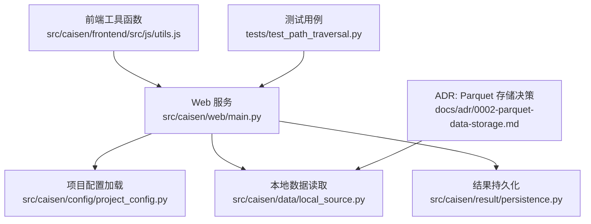
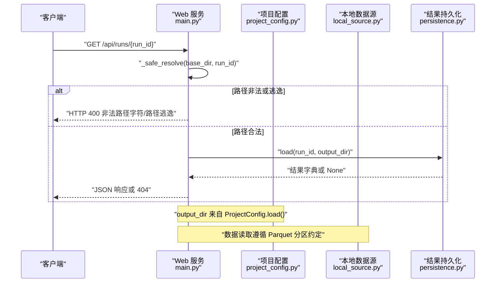
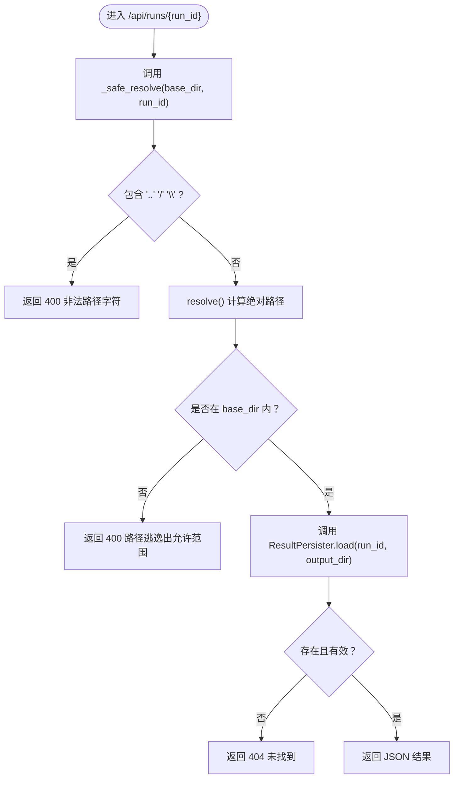
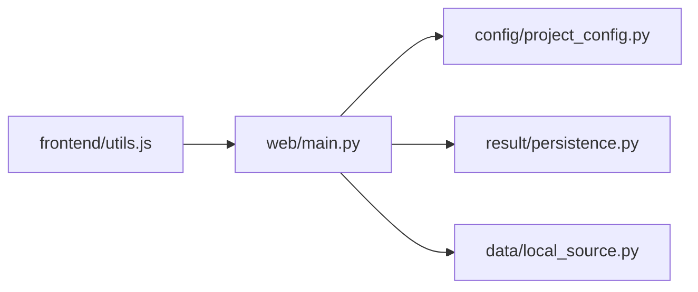

# 数据安全

<cite>
**本文引用的文件**   
- [src/caisen/web/main.py](file://src/caisen/web/main.py)
- [src/caisen/config/project_config.py](file://src/caisen/config/project_config.py)
- [configs/project.yaml](file://configs/project.yaml)
- [src/caisen/data/local_source.py](file://src/caisen/data/local_source.py)
- [src/caisen/result/persistence.py](file://src/caisen/result/persistence.py)
- [src/caisen/frontend/src/js/utils.js](file://src/caisen/frontend/src/js/utils.js)
- [tests/test_path_traversal.py](file://tests/test_path_traversal.py)
- [docs/adr/0002-parquet-data-storage.md](file://docs/adr/0002-parquet-data-storage.md)
</cite>

## 目录
1. [引言](#引言)
2. [项目结构](#项目结构)
3. [核心组件](#核心组件)
4. [架构总览](#架构总览)
5. [详细组件分析](#详细组件分析)
6. [依赖关系分析](#依赖关系分析)
7. [性能与安全权衡](#性能与安全权衡)
8. [故障排查指南](#故障排查指南)
9. [结论](#结论)
10. [附录](#附录)

## 引言
本指南面向 Caisen 量化回测系统的数据安全，聚焦以下方面：敏感数据加密机制、配置文件与数据库字段加密、传输层加密；数据存储安全（文件权限控制、目录隔离、备份加密）；数据传输安全（请求签名、完整性校验、防篡改）；输入验证与输出编码（参数校验、SQL 注入防护、XSS 防护）；日志安全处理（脱敏、访问控制、审计追踪）；数据生命周期管理（清理策略、归档安全、合规删除）。文档将结合仓库现有实现进行现状评估，并给出可落地的增强建议。

## 项目结构
Caisen 的安全相关能力主要分布在 Web 服务入口、配置加载、本地数据读取、结果持久化以及前端渲染等模块中。当前已具备路径遍历防护、日期格式校验、HTML 转义等基础安全措施，但尚未发现针对配置文件或数据库字段的加密、传输层加密、请求签名与完整性校验、日志脱敏与审计等实现。

图表来源
- [src/caisen/web/main.py:1-319](file://src/caisen/web/main.py#L1-L319)
- [src/caisen/config/project_config.py:1-56](file://src/caisen/config/project_config.py#L1-L56)
- [src/caisen/data/local_source.py:1-199](file://src/caisen/data/local_source.py#L1-L199)
- [src/caisen/result/persistence.py:1-274](file://src/caisen/result/persistence.py#L1-L274)
- [src/caisen/frontend/src/js/utils.js:1-35](file://src/caisen/frontend/src/js/utils.js#L1-L35)
- [tests/test_path_traversal.py:1-87](file://tests/test_path_traversal.py#L1-L87)
- [docs/adr/0002-parquet-data-storage.md:1-11](file://docs/adr/0002-parquet-data-storage.md#L1-L11)

章节来源
- [src/caisen/web/main.py:1-319](file://src/caisen/web/main.py#L1-L319)
- [src/caisen/config/project_config.py:1-56](file://src/caisen/config/project_config.py#L1-L56)
- [src/caisen/data/local_source.py:1-199](file://src/caisen/data/local_source.py#L1-L199)
- [src/caisen/result/persistence.py:1-274](file://src/caisen/result/persistence.py#L1-L274)
- [src/caisen/frontend/src/js/utils.js:1-35](file://src/caisen/frontend/src/js/utils.js#L1-L35)
- [tests/test_path_traversal.py:1-87](file://tests/test_path_traversal.py#L1-L87)
- [docs/adr/0002-parquet-data-storage.md:1-11](file://docs/adr/0002-parquet-data-storage.md#L1-L11)

## 核心组件
- Web 服务与路由：提供 HTTP 与 WebSocket 接口，包含路径解析与校验、CORS 配置、健康检查、静态资源服务等。
- 项目配置加载：从 configs/project.yaml 读取 data_dir、output_dir、api_port，缺失时回退到内嵌默认值。
- 本地数据源：按 {data_dir}/{symbol}/{freq}/*.parquet 组织，支持单日期与范围命名模式，并进行列名映射与类型转换。
- 结果持久化：生成 run_id、保存 meta/metrics/bars/trades/equity/annotations 及 data.json。
- 前端工具：提供 HTML 转义与数值格式化，用于防止 XSS 注入。

章节来源
- [src/caisen/web/main.py:1-319](file://src/caisen/web/main.py#L1-L319)
- [src/caisen/config/project_config.py:1-56](file://src/caisen/config/project_config.py#L1-L56)
- [src/caisen/data/local_source.py:1-199](file://src/caisen/data/local_source.py#L1-L199)
- [src/caisen/result/persistence.py:1-274](file://src/caisen/result/persistence.py#L1-L274)
- [src/caisen/frontend/src/js/utils.js:1-35](file://src/caisen/frontend/src/js/utils.js#L1-L35)

## 架构总览
下图展示 Web 服务在接收请求后对路径与参数的安全校验流程，以及与配置、数据源和结果持久化的交互。

图表来源
- [src/caisen/web/main.py:28-39](file://src/caisen/web/main.py#L28-L39)
- [src/caisen/web/main.py:185-201](file://src/caisen/web/main.py#L185-L201)
- [src/caisen/config/project_config.py:30-55](file://src/caisen/config/project_config.py#L30-L55)
- [src/caisen/data/local_source.py:82-137](file://src/caisen/data/local_source.py#L82-L137)
- [src/caisen/result/persistence.py:204-245](file://src/caisen/result/persistence.py#L204-L245)

## 详细组件分析

### Web 服务与路径遍历防护
- 路径解析与校验：_safe_resolve 拒绝包含 ..、/、\ 的输入，并在 resolve 后校验最终路径是否仍在 base_dir 范围内，防止路径遍历攻击。
- CORS 配置：当前允许所有来源与头，便于开发调试，但在生产环境应收紧为受信任域名与最小必要方法/头集合。
- 健康检查与健康端点：/health 返回简单状态，可用于探针与监控。
- 静态资源服务：/js/{filename} 与 /src/css/{filename} 同样使用 _safe_resolve 限制访问范围。

图表来源
- [src/caisen/web/main.py:28-39](file://src/caisen/web/main.py#L28-L39)
- [src/caisen/web/main.py:185-201](file://src/caisen/web/main.py#L185-L201)
- [tests/test_path_traversal.py:1-87](file://tests/test_path_traversal.py#L1-L87)

章节来源
- [src/caisen/web/main.py:76-83](file://src/caisen/web/main.py#L76-L83)
- [src/caisen/web/main.py:229-245](file://src/caisen/web/main.py#L229-L245)
- [tests/test_path_traversal.py:1-87](file://tests/test_path_traversal.py#L1-L87)

### 项目配置加载与敏感信息保护
- 配置来源：ProjectConfig 从 configs/project.yaml 加载 data_dir、output_dir、api_port，不存在则使用内嵌默认值。
- 安全性现状：yaml.safe_load 避免执行任意代码，但未对配置中的敏感字段（如密钥、令牌）进行加密或外部化（例如环境变量或密钥管理服务）。
- 建议：对敏感配置项采用运行时注入（环境变量）、KMS/Secrets Manager 集成，或在磁盘上以加密形式存储并在启动时解密。

章节来源
- [src/caisen/config/project_config.py:17-55](file://src/caisen/config/project_config.py#L17-L55)
- [configs/project.yaml:1-12](file://configs/project.yaml#L1-L12)

### 本地数据源与 Parquet 存储
- 存储约定：历史数据以 Parquet 格式存储，按 {data_dir}/{symbol}/{freq}/{date}.parquet 或范围命名模式组织。
- 安全性现状：Parquet 文件为明文二进制，无内置加密；读取时对列名进行中英文映射与类型转换，确保数据一致性。
- 建议：对静态数据目录启用文件系统级加密（如 LUKS、eCryptfs），或对 Parquet 文件进行应用层加密（先加密再写入，读取时解密）。

章节来源
- [docs/adr/0002-parquet-data-storage.md:1-11](file://docs/adr/0002-parquet-data-storage.md#L1-L11)
- [src/caisen/data/local_source.py:15-80](file://src/caisen/data/local_source.py#L15-L80)
- [src/caisen/data/local_source.py:139-199](file://src/caisen/data/local_source.py#L139-L199)

### 结果持久化与数据完整性
- 结果结构：meta.json、metrics.json、bars.parquet、trades.parquet、equity.parquet、annotations.json、data.json。
- 安全性现状：文件以明文写入，未做数字签名或哈希校验；data.json 由后端聚合生成，供前端可视化使用。
- 建议：为关键结果文件生成校验和（如 SHA-256）并附带签名元数据；在读取时验证完整性与来源可信性。

章节来源
- [src/caisen/result/persistence.py:59-133](file://src/caisen/result/persistence.py#L59-L133)
- [src/caisen/result/persistence.py:135-202](file://src/caisen/result/persistence.py#L135-L202)
- [src/caisen/result/persistence.py:204-274](file://src/caisen/result/persistence.py#L204-L274)

### 前端输出编码与 XSS 防护
- 工具函数：escapeHtml 对特殊字符进行转义，formatValue 提供数值格式化，用于安全地插入 DOM。
- 安全性现状：通过转义降低 XSS 风险，但仍需确保所有用户可控数据均经过统一转义与白名单过滤。
- 建议：建立统一的视图渲染管线，禁止直接 innerHTML 插入未经转义的数据；对富文本内容引入沙箱化渲染。

章节来源
- [src/caisen/frontend/src/js/utils.js:1-35](file://src/caisen/frontend/src/js/utils.js#L1-L35)

## 依赖关系分析
- Web 服务依赖项目配置与结果持久化模块，并通过 FastAPI 中间件与路由组织请求处理。
- 本地数据源与 Parquet 存储约定共同决定数据读取路径与性能特征。
- 前端工具函数被 UI 组件引用，保障输出安全。

图表来源
- [src/caisen/web/main.py:1-319](file://src/caisen/web/main.py#L1-L319)
- [src/caisen/config/project_config.py:1-56](file://src/caisen/config/project_config.py#L1-L56)
- [src/caisen/result/persistence.py:1-274](file://src/caisen/result/persistence.py#L1-L274)
- [src/caisen/data/local_source.py:1-199](file://src/caisen/data/local_source.py#L1-L199)
- [src/caisen/frontend/src/js/utils.js:1-35](file://src/caisen/frontend/src/js/utils.js#L1-L35)

章节来源
- [src/caisen/web/main.py:1-319](file://src/caisen/web/main.py#L1-L319)
- [src/caisen/config/project_config.py:1-56](file://src/caisen/config/project_config.py#L1-L56)
- [src/caisen/result/persistence.py:1-274](file://src/caisen/result/persistence.py#L1-L274)
- [src/caisen/data/local_source.py:1-199](file://src/caisen/data/local_source.py#L1-L199)
- [src/caisen/frontend/src/js/utils.js:1-35](file://src/caisen/frontend/src/js/utils.js#L1-L35)

## 性能与安全权衡
- 路径校验开销：_safe_resolve 每次请求进行字符串检查与路径解析，开销较小，但对高并发场景可考虑缓存合法 run_id 映射。
- Parquet 读取性能：列式存储适合 OLAP 查询，但大文件 I/O 可能成为瓶颈；可通过分区裁剪与并行读取优化。
- 加密与完整性：应用层加密与签名会增加 CPU 与 I/O 开销，建议仅在敏感数据与关键结果文件启用，并结合异步任务与增量校验。

[本节为通用指导，不直接分析具体文件]

## 故障排查指南
- 路径遍历错误：若出现 400 非法路径字符或路径逃逸，检查传入的 run_id 是否包含 ..、/、\ 或符号链接逃逸。
- 配置加载失败：确认 configs/project.yaml 是否存在且字段完整；缺失字段会回退到默认值，不影响运行。
- 数据未找到：检查 data_dir 下是否存在对应 symbol/freq 的 Parquet 文件，文件名是否符合单日期或范围命名约定。
- 结果未生成：查看 runs 目录下是否有 meta.json 与 bars.parquet 或 data.json；若无，检查持久化逻辑与异常日志。

章节来源
- [tests/test_path_traversal.py:1-87](file://tests/test_path_traversal.py#L1-L87)
- [src/caisen/config/project_config.py:30-55](file://src/caisen/config/project_config.py#L30-L55)
- [src/caisen/data/local_source.py:82-137](file://src/caisen/data/local_source.py#L82-L137)
- [src/caisen/result/persistence.py:204-274](file://src/caisen/result/persistence.py#L204-L274)

## 结论
当前系统在路径遍历防护、日期格式校验与前端 XSS 转义方面具备基础安全能力，但在敏感数据加密（配置文件、数据库字段）、传输层加密（HTTPS/TLS）、请求签名与完整性校验、日志脱敏与审计追踪、以及数据生命周期管理等方面尚未实现。建议优先在生产环境启用 HTTPS、收紧 CORS、引入密钥管理与加密存储、为关键结果文件添加完整性校验与签名，并完善日志脱敏与审计机制，以满足企业级数据安全要求。

[本节为总结性内容，不直接分析具体文件]

## 附录
- 安全增强清单（建议）
  - 配置文件加密：对 project.yaml 中的敏感字段采用 KMS/Secrets Manager 或环境变量注入，启动时解密。
  - 数据库字段加密：若后续引入数据库，对敏感字段使用透明加密或应用层加密（AES-GCM）。
  - 传输层加密：强制 HTTPS，禁用弱密码套件，启用 HSTS。
  - 请求签名与完整性：对 API 请求增加签名（HMAC-SHA256），对关键响应附加校验和。
  - 输入验证与输出编码：统一参数校验（Pydantic），严格白名单过滤，统一转义输出。
  - 日志安全：脱敏敏感信息，限制日志访问权限，集中审计与告警。
  - 数据生命周期：定期清理过期 runs，归档至冷存储并加密，实施合规删除策略。

[本节为通用建议，不直接分析具体文件]