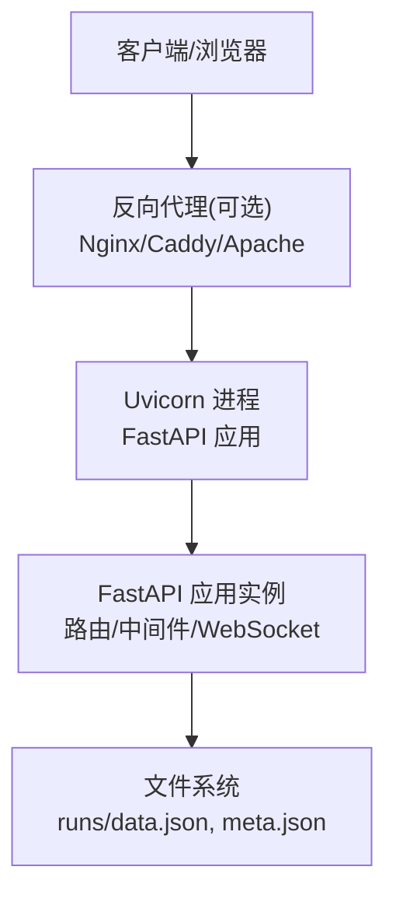
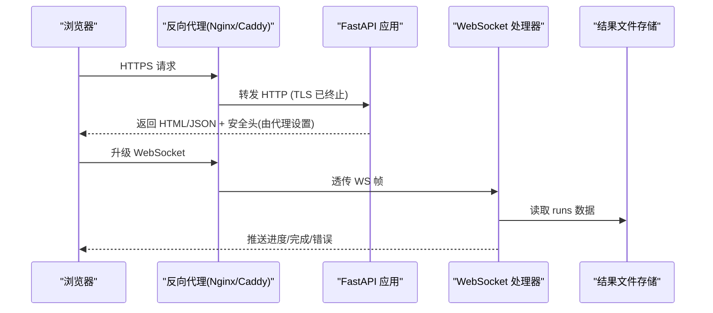
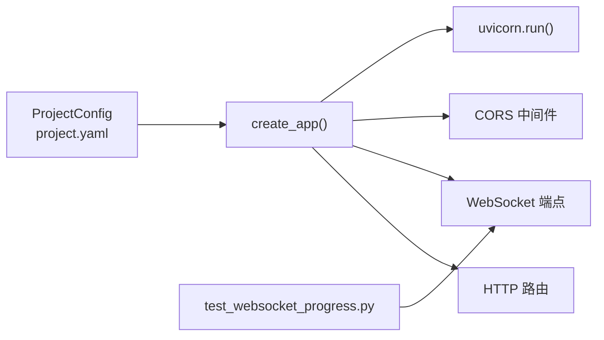

# 网络安全

<cite>
**本文引用的文件**
- [src/caisen/web/main.py](file://src/caisen/web/main.py)
- [configs/project.yaml](file://configs/project.yaml)
- [src/caisen/config/project_config.py](file://src/caisen/config/project_config.py)
- [tests/test_websocket_progress.py](file://tests/test_websocket_progress.py)
</cite>

## 目录
1. [简介](#简介)
2. [项目结构](#项目结构)
3. [核心组件](#核心组件)
4. [架构总览](#架构总览)
5. [详细组件分析](#详细组件分析)
6. [依赖关系分析](#依赖关系分析)
7. [性能考虑](#性能考虑)
8. [故障排查指南](#故障排查指南)
9. [结论](#结论)
10. [附录](#附录)

## 简介
本指南面向 Caisen 量化回测系统的部署与运维人员，聚焦于网络层与应用层的网络安全加固。内容覆盖：
- HTTPS 强制启用、SSL/TLS 证书管理与加密协议选择
- CORS 策略收紧与敏感头保护
- 关键安全响应头（CSP、X-Frame-Options、HSTS 等）配置建议
- DDoS 防护思路（速率限制、连接数控制、流量整形）
- 网络层防护（防火墙规则、端口最小化暴露、监控）
- WebSocket 安全加固（连接验证、消息加密、重放攻击防护）

说明：当前代码库未内置 HTTPS、安全头、DDoS 防护与高级认证机制，需通过反向代理或中间件扩展实现。本文在给出落地方案的同时，严格基于仓库现有实现进行映射与约束。

## 项目结构
与网络安全直接相关的后端服务入口位于 web 模块，提供 HTTP API 与 WebSocket 进度推送；项目全局配置包含 Web 服务端口设置。

图示来源
- [src/caisen/web/main.py:68-304](file://src/caisen/web/main.py#L68-L304)
- [src/caisen/web/main.py:311-315](file://src/caisen/web/main.py#L311-L315)
- [configs/project.yaml:11-12](file://configs/project.yaml#L11-L12)

章节来源
- [src/caisen/web/main.py:68-304](file://src/caisen/web/main.py#L68-L304)
- [configs/project.yaml:11-12](file://configs/project.yaml#L11-L12)

## 核心组件
- Web 应用创建与启动
  - 应用工厂 create_app 注册路由、中间件与 WebSocket 端点
  - serve 使用 uvicorn.run 启动服务，监听 host/port
- 项目配置加载
  - ProjectConfig 从 configs/project.yaml 读取 api_port 等参数
- 静态资源与安全路径校验
  - 对 JS/CSS 与 runs 目录访问采用 _safe_resolve 防止路径遍历

章节来源
- [src/caisen/web/main.py:68-304](file://src/caisen/web/main.py#L68-L304)
- [src/caisen/web/main.py:311-315](file://src/caisen/web/main.py#L311-L315)
- [src/caisen/config/project_config.py:17-55](file://src/caisen/config/project_config.py#L17-L55)
- [src/caisen/web/main.py:28-39](file://src/caisen/web/main.py#L28-L39)

## 架构总览
下图展示典型生产部署的安全边界：外部流量经反向代理完成 TLS 终止、安全头注入与基础限流，再转发到内网 Uvicorn/FastAPI。

图示来源
- [src/caisen/web/main.py:68-304](file://src/caisen/web/main.py#L68-L304)
- [src/caisen/web/main.py:311-315](file://src/caisen/web/main.py#L311-L315)

## 详细组件分析

### 1) HTTPS 强制启用与 SSL/TLS 证书管理
现状
- 应用默认以 HTTP 运行，端口来自配置文件 api_port
- 未内置 SSLContext 或证书加载逻辑

推荐实践
- 在反向代理层统一终止 TLS，将证书与协议版本集中管理
- 强制 HTTPS：在代理层拒绝明文 HTTP 或 301 重定向至 https://
- 协议与套件：仅启用 TLSv1.2+，禁用已知不安全套件；优先 ECDHE 密钥交换与 AEAD 套件
- 证书轮换：使用自动化签发工具（如 ACME），配合代理热重载

参考位置
- [src/caisen/web/main.py:311-315](file://src/caisen/web/main.py#L311-L315)
- [configs/project.yaml:11-12](file://configs/project.yaml#L11-L12)

章节来源
- [src/caisen/web/main.py:311-315](file://src/caisen/web/main.py#L311-L315)
- [configs/project.yaml:11-12](file://configs/project.yaml#L11-L12)

### 2) CORS 策略配置与敏感头保护
现状
- 已启用 CORSMiddleware，但 allow_origins=["*"]、allow_headers=["*"]、allow_methods=["*"] 且允许凭据，属于开发期宽松策略

风险
- 任意站点可跨域调用并携带凭据，存在 CSRF 与凭据泄露风险
- 允许所有自定义头可能引入非预期头部被前端读取

加固步骤
- 明确白名单域名列表，禁止通配符
- 仅放行必要方法与头，移除敏感头（如 Authorization、Cookie）的跨域读取
- 若必须允许凭据，确保源白名单精确且使用固定域名

参考位置
- [src/caisen/web/main.py:75-83](file://src/caisen/web/main.py#L75-L83)

章节来源
- [src/caisen/web/main.py:75-83](file://src/caisen/web/main.py#L75-L83)

### 3) 安全响应头设置（CSP、X-Frame-Options、HSTS 等）
现状
- 应用未显式设置 CSP、X-Frame-Options、Referrer-Policy、Permissions-Policy 等
- HSTS 通常由反向代理设置

建议
- 在反向代理层统一添加以下响应头：
  - Content-Security-Policy：限制脚本、样式、图片、字体、表单提交目标等
  - X-Frame-Options: DENY 或 SAMEORIGIN
  - Strict-Transport-Security：启用 HSTS，含 includeSubDomains 与 preload（视需求）
  - Referrer-Policy：strict-origin-when-cross-origin 或 no-referrer
  - Permissions-Policy：禁用不必要权限（如 camera、microphone）
  - X-Content-Type-Options: nosniff
  - X-XSS-Protection: 0（现代浏览器依赖 CSP）
- 如需在应用层补充，可在 FastAPI 中增加自定义中间件统一写入

参考位置
- [src/caisen/web/main.py:68-304](file://src/caisen/web/main.py#L68-L304)

章节来源
- [src/caisen/web/main.py:68-304](file://src/caisen/web/main.py#L68-L304)

### 4) DDoS 防护（速率限制、连接数控制、流量整形）
现状
- 应用层未实现请求级速率限制或并发连接上限控制
- 单进程 uvicorn 默认受限于 GIL 与线程模型

建议
- 在反向代理层实施：
  - 每 IP/每 URL 的请求速率限制与突发控制
  - 连接数上限与空闲超时
  - 针对 /ws/* 与 /api/runs 等热点路径差异化限速
- 在应用层可考虑：
  - 为长耗时任务（回测）引入队列与令牌桶，避免瞬时洪泛
  - 对 /health 等健康检查接口做独立限流
- 结合 WAF/云厂商防护能力，屏蔽恶意扫描与异常 UA

参考位置
- [src/caisen/web/main.py:311-315](file://src/caisen/web/main.py#L311-L315)

章节来源
- [src/caisen/web/main.py:311-315](file://src/caisen/web/main.py#L311-L315)

### 5) 网络层安全防护（防火墙、端口暴露、监控）
建议
- 仅开放反向代理对外端口（如 443/80），对内仅暴露 Uvicorn 监听地址（如 127.0.0.1:8001）
- 使用主机防火墙或容器网络策略限制来源 IP 段
- 对 runs 目录与日志目录设置最小权限，避免越权访问
- 开启系统审计与网络监控（连接数、QPS、错误率、延迟分位）

参考位置
- [configs/project.yaml:11-12](file://configs/project.yaml#L11-L12)

章节来源
- [configs/project.yaml:11-12](file://configs/project.yaml#L11-L12)

### 6) WebSocket 安全加固（连接验证、消息加密、重放防护）
现状
- 提供 /ws/runs/{run_id}/progress 端点，接受 Query 参数后后台执行回测并推送进度
- 无鉴权、无签名校验、无频率限制
- 连接在终态（done/error）后关闭

风险
- 未经验证的 run_id 与查询参数可能被滥用
- 缺少身份认证与授权，任何客户端均可触发回测
- 无消息完整性校验，易受篡改与重放

加固步骤
- 连接建立前鉴权：在代理层或应用层对 WS 握手进行 Token 校验（如 Cookie/Authorization）
- 参数校验与白名单：对 strategy_name、symbol、freq、start/end 进行严格校验与范围限制
- 速率限制与配额：按用户/IP 限制 WS 并发与新建连接频率
- 消息完整性：对关键指令进行签名校验，服务端记录序列号防重放
- 超时与心跳：保持活跃检测，及时释放僵尸连接
- 输出隔离：确保 run_id 与 runs 目录访问遵循最小权限与路径校验（已有 _safe_resolve）

参考位置
- [src/caisen/web/main.py:247-303](file://src/caisen/web/main.py#L247-L303)
- [src/caisen/web/main.py:28-39](file://src/caisen/web/main.py#L28-L39)
- [tests/test_websocket_progress.py:105-129](file://tests/test_websocket_progress.py#L105-L129)

章节来源
- [src/caisen/web/main.py:247-303](file://src/caisen/web/main.py#L247-L303)
- [src/caisen/web/main.py:28-39](file://src/caisen/web/main.py#L28-L39)
- [tests/test_websocket_progress.py:105-129](file://tests/test_websocket_progress.py#L105-L129)

### 7) 静态资源与路径遍历防护
现状
- 对 JS/CSS 与 runs 目录访问均通过 _safe_resolve 校验，拒绝包含 .. 及逃逸 base_dir 的路径

建议
- 继续维持该策略，并对文件名进行白名单或正则校验
- 对大文件下载设置大小上限与超时

参考位置
- [src/caisen/web/main.py:28-39](file://src/caisen/web/main.py#L28-L39)
- [src/caisen/web/main.py:229-245](file://src/caisen/web/main.py#L229-L245)

章节来源
- [src/caisen/web/main.py:28-39](file://src/caisen/web/main.py#L28-L39)
- [src/caisen/web/main.py:229-245](file://src/caisen/web/main.py#L229-L245)

## 依赖关系分析
- 应用入口与启动
  - create_app 构建 FastAPI 实例，注册路由与中间件
  - serve 调用 uvicorn.run 启动服务
- 配置来源
  - ProjectConfig 从 configs/project.yaml 加载 api_port 等
- 测试用例
  - WebSocket 行为测试覆盖“完成后自动断开”的场景

图示来源
- [src/caisen/web/main.py:68-304](file://src/caisen/web/main.py#L68-L304)
- [src/caisen/web/main.py:311-315](file://src/caisen/web/main.py#L311-L315)
- [src/caisen/config/project_config.py:17-55](file://src/caisen/config/project_config.py#L17-L55)
- [tests/test_websocket_progress.py:105-129](file://tests/test_websocket_progress.py#L105-L129)

章节来源
- [src/caisen/web/main.py:68-304](file://src/caisen/web/main.py#L68-L304)
- [src/caisen/config/project_config.py:17-55](file://src/caisen/config/project_config.py#L17-L55)
- [tests/test_websocket_progress.py:105-129](file://tests/test_websocket_progress.py#L105-L129)

## 性能考虑
- 反向代理缓存静态资源与压缩传输，减少后端压力
- 对 /api/runs 列表接口增加分页与过滤，避免一次性返回大量元数据
- WebSocket 推送间隔与批量合并，降低频繁序列化开销
- 合理设置 Uvicorn workers 数量与线程池，结合 CPU 核数与 I/O 特征调优
- 对 runs 目录读写采用异步或缓冲落盘，避免阻塞请求处理

[本节为通用指导，不直接分析具体文件]

## 故障排查指南
- 无法跨域访问
  - 检查 CORS 白名单与方法/头是否匹配
  - 确认代理层是否转发了必要的 Origin 头
- WebSocket 连接立即断开
  - 核对终端状态是否为 done/error，测试用例覆盖了此行为
  - 检查代理层是否支持 WS 升级与超时配置
- 静态资源 404
  - 确认路径未被 _safe_resolve 拦截
  - 检查文件是否存在与权限
- 健康检查失败
  - 确认 /health 可达，代理层未误拦截

章节来源
- [src/caisen/web/main.py:224-227](file://src/caisen/web/main.py#L224-L227)
- [src/caisen/web/main.py:229-245](file://src/caisen/web/main.py#L229-L245)
- [tests/test_websocket_progress.py:105-129](file://tests/test_websocket_progress.py#L105-L129)

## 结论
当前系统在应用层提供了基础的 HTTP/WS 能力与路径安全校验，但未内置 HTTPS、安全头与访问控制。建议在反向代理层统一实现 TLS 终止、安全头注入与基础限流，并在应用层收紧 CORS、完善鉴权与参数校验，从而形成纵深防御体系。

[本节为总结性内容，不直接分析具体文件]

## 附录

### A. 关键配置项速查
- Web 服务端口
  - 来源：configs/project.yaml 中的 api_port
  - 用途：决定 Uvicorn 监听端口
- 数据与输出目录
  - data_dir/output_dir：影响数据扫描与结果持久化路径

章节来源
- [configs/project.yaml:4-12](file://configs/project.yaml#L4-L12)
- [src/caisen/config/project_config.py:17-55](file://src/caisen/config/project_config.py#L17-L55)

### B. 安全清单（部署前核对）
- 已在反向代理启用 HTTPS 并强制跳转
- 已设置 HSTS、CSP、X-Frame-Options、Referrer-Policy 等响应头
- CORS 白名单精确到业务域名，禁止 * 与敏感头
- 对 /ws 与 /api 路径实施速率限制与连接数上限
- 仅暴露必要端口，内部服务绑定 127.0.0.1
- 对 runs 目录与日志目录设置最小权限
- 对 WS 连接实施鉴权与参数校验，必要时加入签名与序列号

[本节为通用清单，不直接分析具体文件]