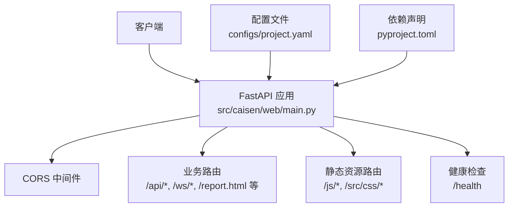
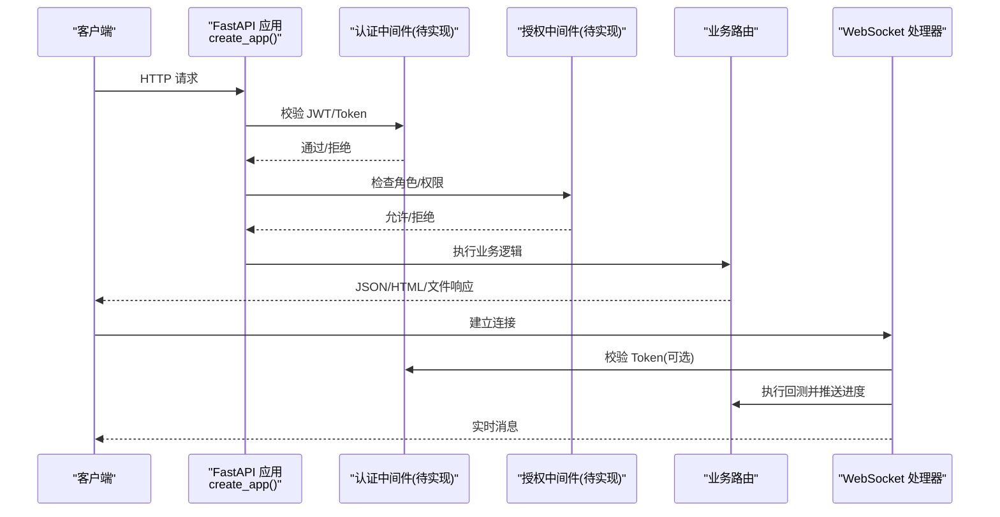
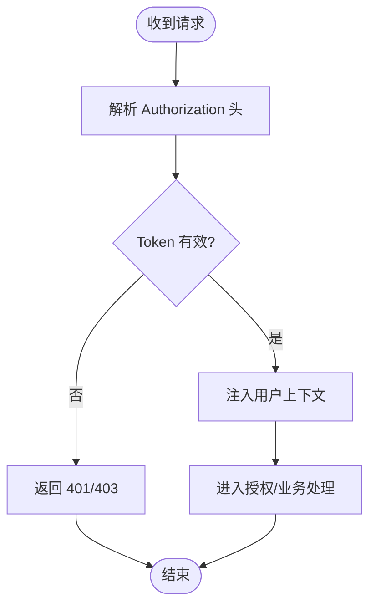
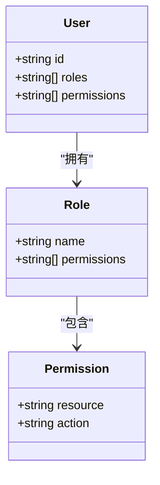
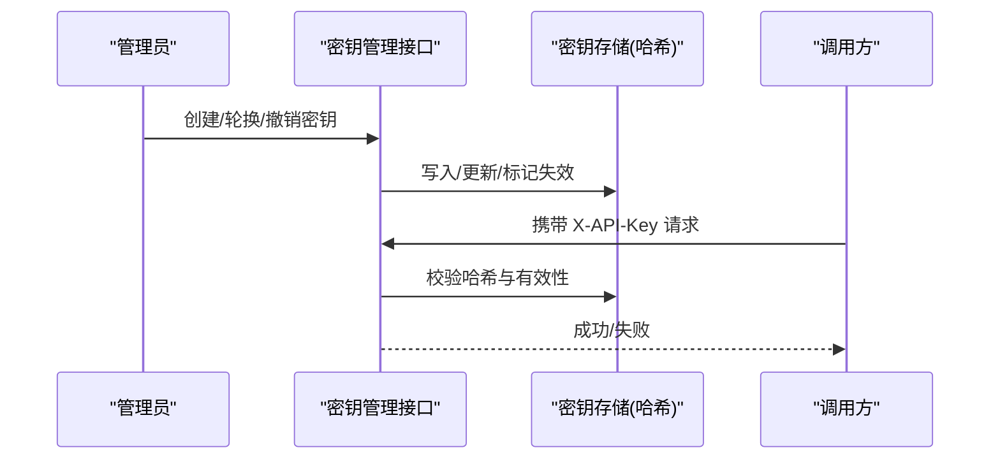
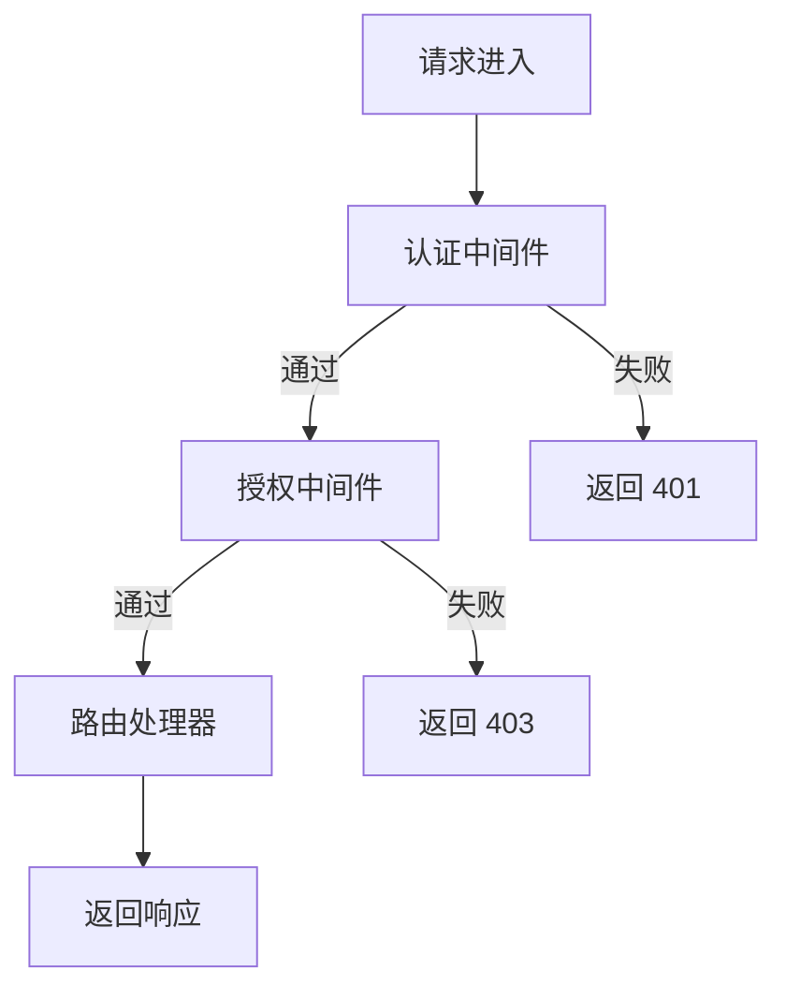
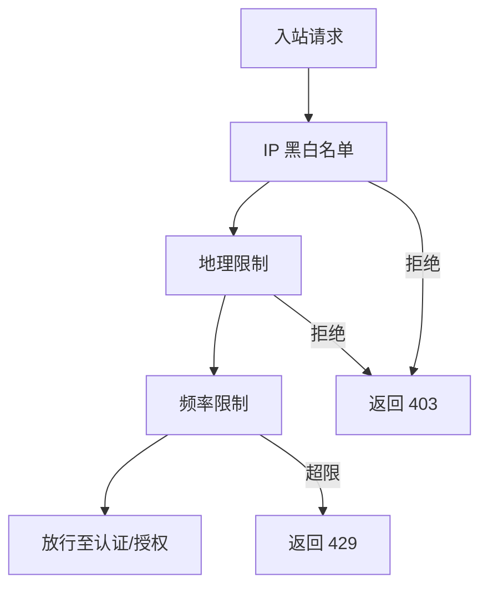
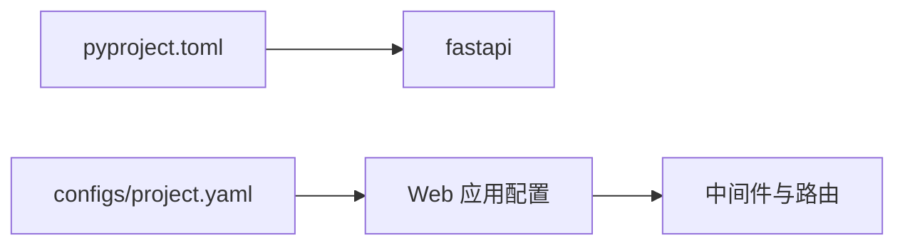

# 访问控制

<cite>
**本文引用的文件**
- [src/caisen/web/main.py](file://src/caisen/web/main.py)
- [configs/project.yaml](file://configs/project.yaml)
- [pyproject.toml](file://pyproject.toml)
</cite>

## 目录
1. [简介](#简介)
2. [项目结构](#项目结构)
3. [核心组件](#核心组件)
4. [架构总览](#架构总览)
5. [详细组件分析](#详细组件分析)
6. [依赖分析](#依赖分析)
7. [性能考虑](#性能考虑)
8. [故障排查指南](#故障排查指南)
9. [结论](#结论)
10. [附录](#附录)

## 简介
本指南面向 Caisen 量化回测系统的访问控制与安全加固，聚焦以下目标：
- 用户认证机制：JWT Token 验证、会话管理与身份验证流程
- 权限管理：基于角色的访问控制（RBAC）、API 端点权限与资源访问限制
- API 密钥保护：生成、存储、轮换与撤销策略
- 中间件开发：自定义认证中间件、授权检查与安全过滤器
- 会话安全：超时配置、并发登录控制与劫持防护
- 网络边界：IP 白名单/黑名单、地理限制与访问频率控制

当前仓库中的 Web 服务使用 FastAPI 提供可视化报告与回测结果查询能力，尚未内置认证与鉴权实现。本文在“现状说明”的基础上，给出可落地的设计与实现建议，并明确需要新增的代码位置与扩展点。

## 项目结构
与访问控制直接相关的代码位于 Web 层与全局配置中：
- Web 应用入口与路由定义：src/caisen/web/main.py
- 全局配置（含端口等）：configs/project.yaml
- 依赖声明（FastAPI 等）：pyproject.toml

图示来源
- [src/caisen/web/main.py:68-304](file://src/caisen/web/main.py#L68-L304)
- [configs/project.yaml:1-13](file://configs/project.yaml#L1-L13)
- [pyproject.toml:15-15](file://pyproject.toml#L15-L15)

章节来源
- [src/caisen/web/main.py:68-304](file://src/caisen/web/main.py#L68-L304)
- [configs/project.yaml:1-13](file://configs/project.yaml#L1-L13)
- [pyproject.toml:15-15](file://pyproject.toml#L15-L15)

## 核心组件
- 应用创建与中间件注册：create_app() 负责初始化 FastAPI 实例并注册 CORS 中间件
- 路由集合：
  - 数据源与策略列表：/api/data-sources、/api/strategies
  - 回测任务：POST /api/runs、GET /api/runs、GET /api/runs/{run_id}
  - 可视化与文件下载：/api/runs/{run_id}/visualization、/api/runs/{run_id}/data.json
  - 前端页面与静态资源：/、/report.html、/js/{filename}、/src/css/{filename}
  - WebSocket 进度推送：/ws/runs/{run_id}/progress
  - 健康检查：/health
- 路径校验：_safe_resolve 用于防止路径遍历攻击

章节来源
- [src/caisen/web/main.py:28-39](file://src/caisen/web/main.py#L28-L39)
- [src/caisen/web/main.py:68-304](file://src/caisen/web/main.py#L68-L304)

## 架构总览
下图展示当前 Web 层的请求处理链路，以及未来接入认证与鉴权的扩展点。

图示来源
- [src/caisen/web/main.py:68-304](file://src/caisen/web/main.py#L68-L304)

## 详细组件分析

### 认证与鉴权现状与建议
- 现状
  - 未实现任何认证或鉴权逻辑
  - CORS 允许所有来源与头，便于本地开发但生产环境需收紧
  - 部分路由存在路径参数，已通过 _safe_resolve 做基础防护
- 建议
  - 引入认证中间件：统一解析 Authorization 头部，校验 JWT 签名与有效期
  - 引入授权中间件：基于 RBAC 对路由进行细粒度控制
  - 将敏感接口（如 /api/runs、/api/runs/{run_id}、/ws/*）默认设为受保护
  - 收紧 CORS 配置，仅允许可信域名与必要头与方法

章节来源
- [src/caisen/web/main.py:76-83](file://src/caisen/web/main.py#L76-L83)
- [src/caisen/web/main.py:28-39](file://src/caisen/web/main.py#L28-L39)

### JWT Token 验证与会话管理
- 建议流程
  - 登录接口返回 JWT（包含用户标识、角色、过期时间）
  - 后续请求携带 Authorization: Bearer <token>
  - 认证中间件解析并校验签名、过期时间、签发者等
  - 将用户上下文注入到请求状态，供授权中间件与业务路由使用
- 会话管理要点
  - 无状态优先：以 JWT 为主，避免服务端会话存储
  - 如需强制失效，结合令牌黑名单或短 TTL + 刷新令牌
  - 跨域场景下谨慎设置 Cookie；若使用 Cookie，务必启用 HttpOnly、Secure、SameSite

### 基于角色的访问控制（RBAC）
- 模型建议
  - 角色：管理员、分析师、只读访客
  - 权限：按资源与动作划分，如 runs:list、runs:create、runs:view、ws:connect
- 实现方式
  - 在授权中间件中读取用户角色与所需权限，匹配后放行
  - 路由装饰器或声明式注解指定最小权限要求
  - 默认拒绝原则：未显式允许的接口一律拒绝

### API 密钥保护机制
- 适用场景
  - 内部系统调用、脚本自动化、第三方集成
- 建议方案
  - 生成高熵密钥（如 32 字节随机 Base64），哈希存储（加盐）
  - 支持多版本密钥并存，平滑轮换
  - 提供撤销接口，立即失效旧密钥
  - 在认证中间件中同时支持 JWT 与 API Key（Header 区分）

### 中间件开发指导
- 认证中间件
  - 职责：解析 Token/Key、校验签名/有效期、注入用户上下文
  - 错误处理：统一返回 401/403，附带最小化错误信息
- 授权中间件
  - 职责：根据路由需求与用户角色判定是否允许访问
  - 白名单：公开接口（如 /health、/、/report.html）跳过鉴权
- 安全过滤器
  - 输入校验：日期格式、文件名、路径参数
  - 输出过滤：脱敏日志、隐藏堆栈
  - 速率限制：按 IP/用户维度限流

### 会话安全管理
- 超时配置
  - JWT TTL 建议短（如 15 分钟），配合刷新令牌延长体验
  - 服务端侧可维护最近活跃时间，超过阈值强制下线
- 并发登录控制
  - 限制同一用户最大并发会话数
  - 新登录时可选择踢出旧会话
- 会话劫持防护
  - 绑定设备指纹或 IP 段（谨慎使用，避免误伤）
  - 严格 SameSite、HttpOnly、Secure 的 Cookie 策略（若使用 Cookie）

### IP 白名单与黑名单、地理限制与频率控制
- IP 白名单/黑名单
  - 在网关或反向代理层实现更优（Nginx、云 WAF）
  - 应用层可作为兜底：从 Request 获取客户端 IP，匹配规则
- 地理限制
  - 基于 IP 地理位置库判断国家/地区，拒绝或放行
- 访问频率控制
  - 按 IP/用户维度计数，超限返回 429
  - 滑动窗口或令牌桶算法

## 依赖分析
- 框架依赖
  - FastAPI 作为 Web 框架，提供路由、中间件、WebSocket 支持
- 配置依赖
  - configs/project.yaml 提供 api_port 等运行期配置
- 测试与工具
  - 测试中使用 fastapi.testclient.TestClient 进行接口测试

图示来源
- [pyproject.toml:15-15](file://pyproject.toml#L15-L15)
- [configs/project.yaml:11-13](file://configs/project.yaml#L11-L13)
- [src/caisen/web/main.py:68-83](file://src/caisen/web/main.py#L68-L83)

章节来源
- [pyproject.toml:15-15](file://pyproject.toml#L15-L15)
- [configs/project.yaml:11-13](file://configs/project.yaml#L11-L13)
- [src/caisen/web/main.py:68-83](file://src/caisen/web/main.py#L68-L83)

## 性能考虑
- 认证开销
  - JWT 验签为 CPU 密集型，建议缓存公钥/密钥元数据，减少重复计算
- 鉴权缓存
  - 对高频路由的用户权限结果进行短时缓存（注意一致性）
- 限流与降级
  - 对 /api/runs 与 /ws/* 实施更严格的限流，避免资源耗尽
- 静态资源
  - 静态文件由后端直出时注意磁盘 I/O，建议使用 CDN 或前置缓存

## 故障排查指南
- 常见问题
  - 401 未认证：检查 Authorization 头格式与 Token 有效性
  - 403 无权限：确认用户角色与路由所需权限匹配
  - 404 资源不存在：检查 run_id 与路径解析是否正确
  - 429 频率超限：降低请求频率或申请提升配额
- 诊断步骤
  - 查看健康检查 /health 是否可用
  - 核对 CORS 配置与实际前端域名
  - 检查日志中认证/授权中间件的断言与异常

章节来源
- [src/caisen/web/main.py:224-227](file://src/caisen/web/main.py#L224-L227)
- [src/caisen/web/main.py:76-83](file://src/caisen/web/main.py#L76-L83)

## 结论
当前 Caisen Web 服务具备清晰的 FastAPI 路由结构与基础路径防护，但尚未实现认证与鉴权。建议优先落地 JWT 认证与 RBAC 授权中间件，并对关键接口与 WebSocket 通道实施强保护。同时完善 API 密钥生命周期管理、会话安全策略与网络边界控制（IP/地理/限流），以满足生产环境的安全基线。

## 附录
- 建议新增中间件位置
  - 在 create_app() 中注册认证与授权中间件，置于 CORS 之后、路由之前
- 建议新增配置项
  - jwt_secret、jwt_algorithm、jwt_ttl、rbac_policy_file、rate_limit_window、geo_db_path 等
- 建议新增接口
  - POST /api/auth/login（返回 JWT）
  - GET /api/auth/me（返回当前用户与权限）
  - POST /api/keys（创建/轮换/撤销 API 密钥）