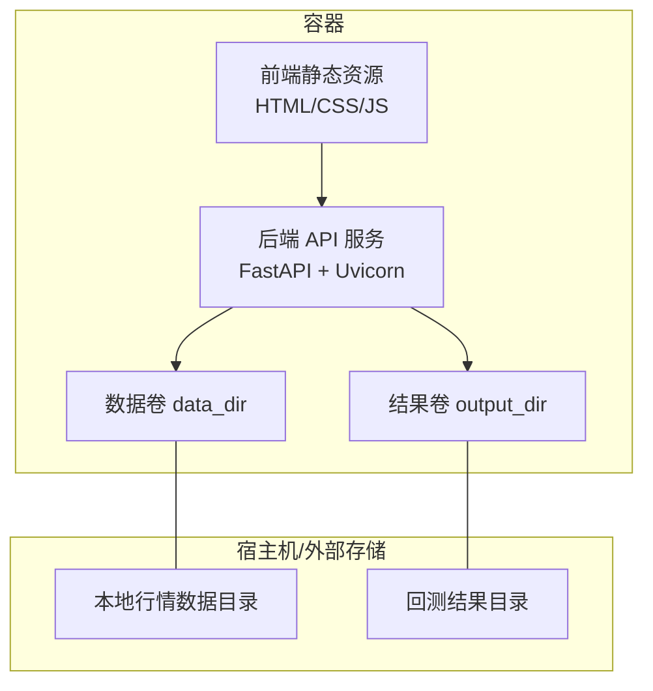
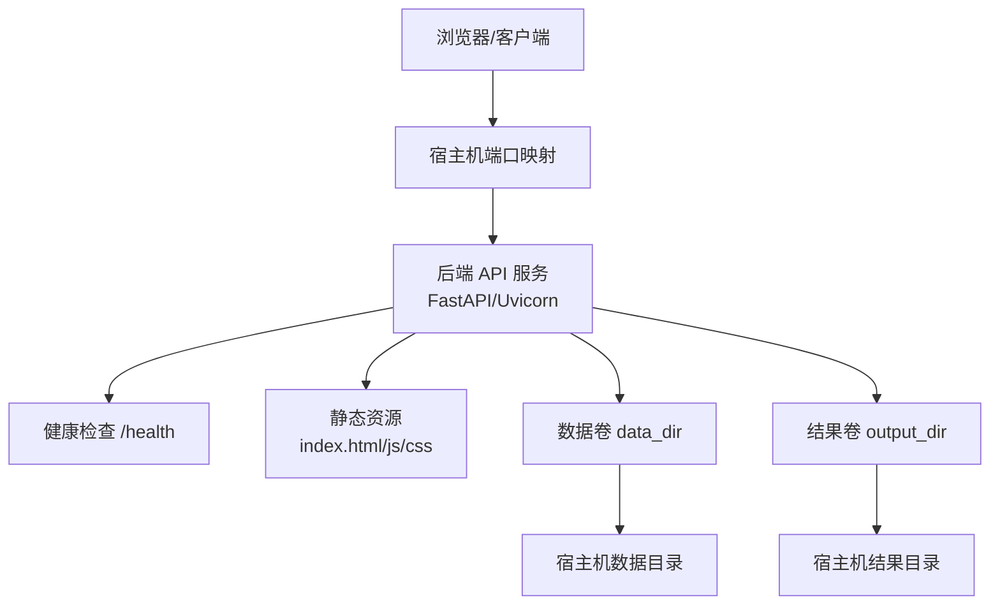
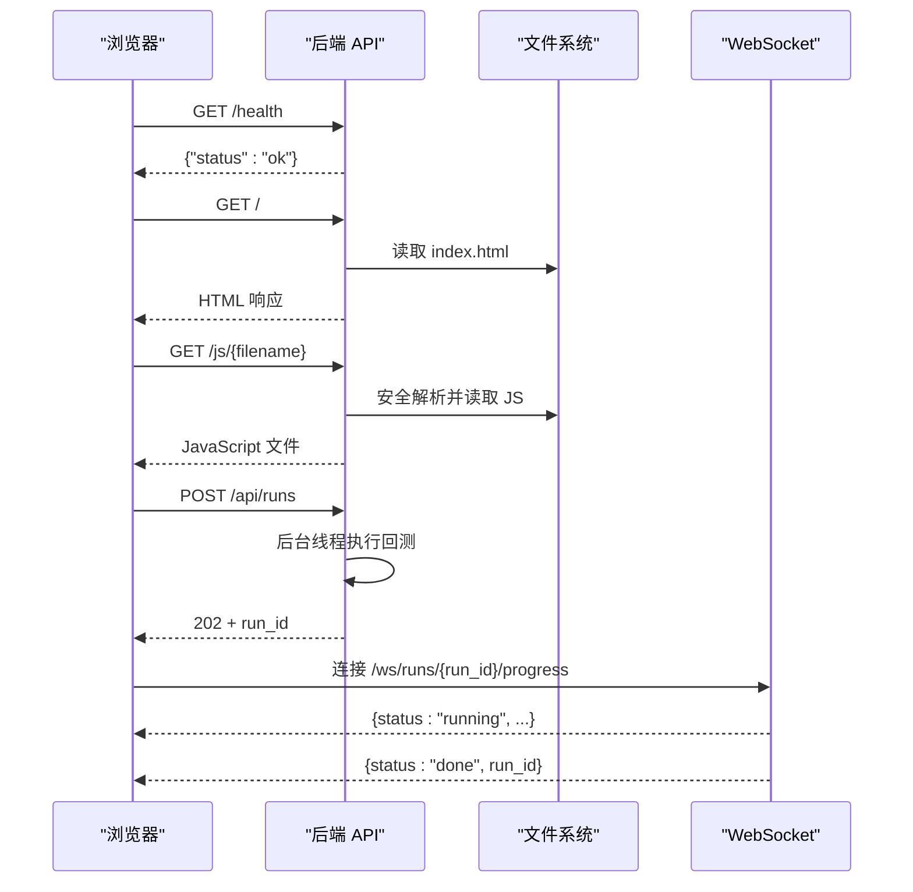
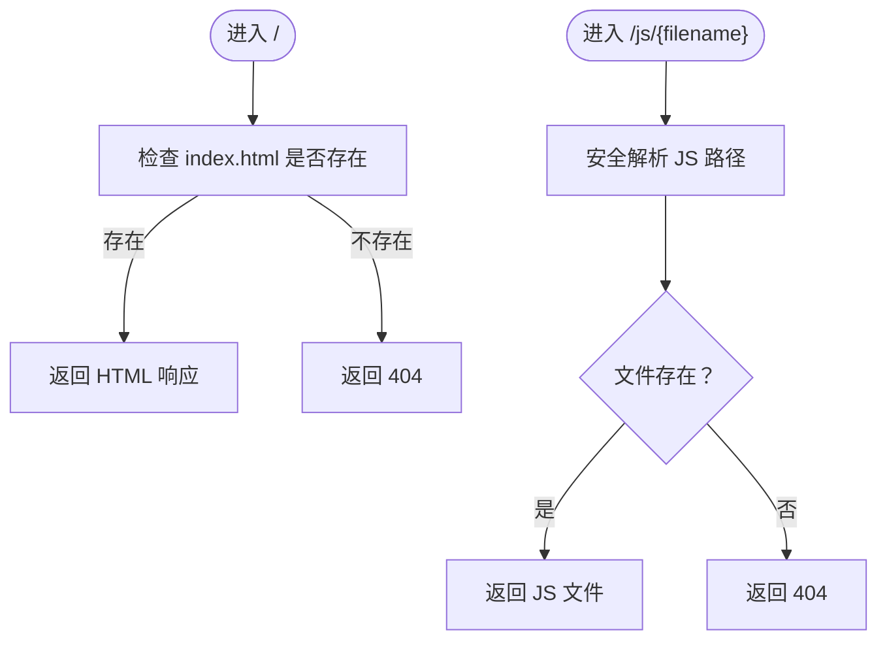
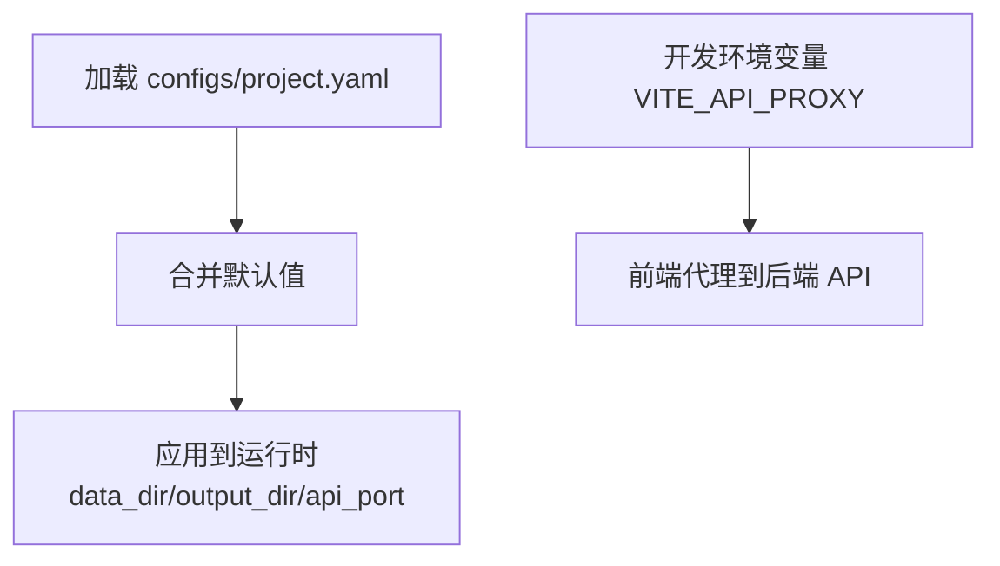
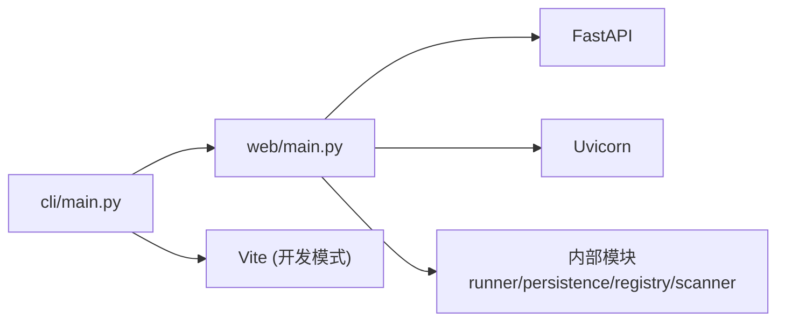

# Docker Compose 编排

<cite>
**本文引用的文件**   
- [README.md](file://README.md)
- [src/caisen/web/main.py](file://src/caisen/web/main.py)
- [src/caisen/cli/main.py](file://src/caisen/cli/main.py)
- [src/caisen/config/project_config.py](file://src/caisen/config/project_config.py)
- [configs/project.yaml](file://configs/project.yaml)
</cite>

## 目录
1. [简介](#简介)
2. [项目结构](#项目结构)
3. [核心组件](#核心组件)
4. [架构总览](#架构总览)
5. [详细组件分析](#详细组件分析)
6. [依赖关系分析](#依赖关系分析)
7. [性能与扩展性](#性能与扩展性)
8. [故障排查指南](#故障排查指南)
9. [结论](#结论)
10. [附录：Docker Compose 示例与最佳实践](#附录docker-compose-示例与最佳实践)

## 简介
本文件为 Caisen 量化回测系统的 Docker Compose 编排文档，面向开发与生产环境。内容涵盖服务定义、环境变量管理、配置文件挂载、数据目录映射、网络与服务间通信、端口映射与健康检查、日志收集、监控指标暴露以及容器重启策略等。文档同时提供可直接复用的 docker-compose.yml 示例（开发/生产），并给出关键路径与配置项的源码依据。

## 项目结构
Caisen 系统包含以下与编排相关的关键部分：
- 后端 API 服务：基于 FastAPI + Uvicorn，提供可视化报告、回测任务触发、结果查询、WebSocket 进度推送等能力。
- 前端静态资源：由后端直接提供 HTML/CSS/JS 静态资源；开发时可通过 Vite 热更新。
- 数据持久化卷：本地行情数据目录与回测结果输出目录需要持久化到宿主机或外部存储。
- 全局配置：通过 configs/project.yaml 覆盖默认值，包括数据目录、输出目录、API 端口等。



[无图示来源：该图为概念性结构示意]

**章节来源**
- [README.md:86-96](file://README.md#L86-L96)
- [src/caisen/web/main.py:68-94](file://src/caisen/web/main.py#L68-L94)
- [src/caisen/web/main.py:229-245](file://src/caisen/web/main.py#L229-L245)
- [src/caisen/config/project_config.py:17-28](file://src/caisen/config/project_config.py#L17-L28)
- [configs/project.yaml:1-13](file://configs/project.yaml#L1-L13)

## 核心组件
- 后端 API 服务
  - 入口：FastAPI 应用创建与路由定义，提供健康检查、静态资源、运行列表、详情、可视化数据、WebSocket 进度等接口。
  - 启动方式：Uvicorn 运行，支持 host/port 参数。
- 前端静态资源
  - 由后端直接返回 index.html 及 JS/CSS 模块，无需独立 Nginx 服务。
  - 开发模式可通过 CLI 命令并行启动 Vite 前端与后端。
- 配置与数据
  - 项目级配置从 configs/project.yaml 加载，缺失字段使用内嵌默认值。
  - 数据目录与输出目录通过配置控制，便于卷映射。

**章节来源**
- [src/caisen/web/main.py:68-94](file://src/caisen/web/main.py#L68-L94)
- [src/caisen/web/main.py:224-227](file://src/caisen/web/main.py#L224-L227)
- [src/caisen/web/main.py:311-315](file://src/caisen/web/main.py#L311-L315)
- [src/caisen/cli/main.py:235-294](file://src/caisen/cli/main.py#L235-L294)
- [src/caisen/config/project_config.py:30-55](file://src/caisen/config/project_config.py#L30-L55)
- [configs/project.yaml:1-13](file://configs/project.yaml#L1-L13)

## 架构总览
下图展示了容器内的前后端交互、对外端口映射、健康检查点以及数据卷映射关系。



**图示来源**
- [src/caisen/web/main.py:224-227](file://src/caisen/web/main.py#L224-L227)
- [src/caisen/web/main.py:86-94](file://src/caisen/web/main.py#L86-L94)
- [src/caisen/web/main.py:229-245](file://src/caisen/web/main.py#L229-L245)
- [src/caisen/config/project_config.py:17-28](file://src/caisen/config/project_config.py#L17-L28)
- [configs/project.yaml:1-13](file://configs/project.yaml#L1-L13)

## 详细组件分析

### 后端 API 服务
- 功能要点
  - 提供根页面与报告页面，返回前端 HTML。
  - 提供静态资源路由，按文件名安全解析后返回。
  - 提供数据源扫描、策略列表、回测任务触发、结果列表与详情、可视化数据获取等 API。
  - 提供 WebSocket 进度推送，用于长耗时任务的实时反馈。
  - 提供健康检查端点，供编排层探测服务可用性。
- 关键实现位置
  - 应用创建与中间件：[src/caisen/web/main.py:68-83](file://src/caisen/web/main.py#L68-L83)
  - 根页面与静态资源：[src/caisen/web/main.py:86-94](file://src/caisen/web/main.py#L86-L94)、[src/caisen/web/main.py:229-245](file://src/caisen/web/main.py#L229-L245)
  - 健康检查：[src/caisen/web/main.py:224-227](file://src/caisen/web/main.py#L224-L227)
  - 启动函数：[src/caisen/web/main.py:311-315](file://src/caisen/web/main.py#L311-L315)



**图示来源**
- [src/caisen/web/main.py:224-227](file://src/caisen/web/main.py#L224-L227)
- [src/caisen/web/main.py:86-94](file://src/caisen/web/main.py#L86-L94)
- [src/caisen/web/main.py:229-245](file://src/caisen/web/main.py#L229-L245)
- [src/caisen/web/main.py:107-132](file://src/caisen/web/main.py#L107-L132)
- [src/caisen/web/main.py:247-302](file://src/caisen/web/main.py#L247-L302)

**章节来源**
- [src/caisen/web/main.py:68-94](file://src/caisen/web/main.py#L68-L94)
- [src/caisen/web/main.py:224-227](file://src/caisen/web/main.py#L224-L227)
- [src/caisen/web/main.py:229-245](file://src/caisen/web/main.py#L229-L245)
- [src/caisen/web/main.py:311-315](file://src/caisen/web/main.py#L311-L315)

### 前端静态资源服务
- 功能要点
  - 由后端直接提供 index.html 与 JS/CSS 模块，避免额外反向代理。
  - 开发模式下可通过 CLI 命令并行启动 Vite 前端与后端，Vite 通过环境变量代理到后端 API。
- 关键实现位置
  - 根页面返回：[src/caisen/web/main.py:86-94](file://src/caisen/web/main.py#L86-L94)
  - JS/CSS 路由：[src/caisen/web/main.py:229-245](file://src/caisen/web/main.py#L229-L245)
  - 开发模式启动（CLI）：[src/caisen/cli/main.py:235-294](file://src/caisen/cli/main.py#L235-L294)



**图示来源**
- [src/caisen/web/main.py:86-94](file://src/caisen/web/main.py#L86-L94)
- [src/caisen/web/main.py:229-245](file://src/caisen/web/main.py#L229-L245)

**章节来源**
- [src/caisen/web/main.py:86-94](file://src/caisen/web/main.py#L86-L94)
- [src/caisen/web/main.py:229-245](file://src/caisen/web/main.py#L229-L245)
- [src/caisen/cli/main.py:235-294](file://src/caisen/cli/main.py#L235-L294)

### 配置与环境变量
- 项目级配置
  - 从 configs/project.yaml 加载，缺失字段自动回退到内嵌默认值。
  - 关键字段：data_dir（本地行情数据根目录）、output_dir（回测结果输出目录）、api_port（Web 服务端口）。
- 环境变量
  - 开发模式下，Vite 前端通过环境变量 VITE_API_PROXY 指定后端地址。
- 关键实现位置
  - 配置加载与默认值：[src/caisen/config/project_config.py:17-28](file://src/caisen/config/project_config.py#L17-L28)、[src/caisen/config/project_config.py:30-55](file://src/caisen/config/project_config.py#L30-L55)
  - 项目配置示例：[configs/project.yaml:1-13](file://configs/project.yaml#L1-L13)
  - 开发模式环境变量设置：[src/caisen/cli/main.py:274-277](file://src/caisen/cli/main.py#L274-L277)



**图示来源**
- [src/caisen/config/project_config.py:17-28](file://src/caisen/config/project_config.py#L17-L28)
- [src/caisen/config/project_config.py:30-55](file://src/caisen/config/project_config.py#L30-L55)
- [configs/project.yaml:1-13](file://configs/project.yaml#L1-L13)
- [src/caisen/cli/main.py:274-277](file://src/caisen/cli/main.py#L274-L277)

**章节来源**
- [src/caisen/config/project_config.py:17-28](file://src/caisen/config/project_config.py#L17-L28)
- [src/caisen/config/project_config.py:30-55](file://src/caisen/config/project_config.py#L30-L55)
- [configs/project.yaml:1-13](file://configs/project.yaml#L1-L13)
- [src/caisen/cli/main.py:274-277](file://src/caisen/cli/main.py#L274-L277)

## 依赖关系分析
- 后端依赖
  - FastAPI、Uvicorn：用于构建 HTTP/WebSocket 服务。
  - Pydantic、YAML：请求校验与配置加载。
  - 内部模块：BacktestRunner、ResultPersister、StrategyRegistry、DataSourceScanner 等。
- 前端依赖
  - 开发模式使用 Vite 进行热更新与代理；生产模式由后端直接提供静态资源。
- 关键实现位置
  - 后端依赖导入与启动：[src/caisen/web/main.py:11-18](file://src/caisen/web/main.py#L11-18)、[src/caisen/web/main.py:311-315](file://src/caisen/web/main.py#L311-L315)
  - 开发模式前端启动：[src/caisen/cli/main.py:273-284](file://src/caisen/cli/main.py#L273-L284)



**图示来源**
- [src/caisen/web/main.py:11-18](file://src/caisen/web/main.py#L11-18)
- [src/caisen/web/main.py:311-315](file://src/caisen/web/main.py#L311-L315)
- [src/caisen/cli/main.py:273-284](file://src/caisen/cli/main.py#L273-L284)

**章节来源**
- [src/caisen/web/main.py:11-18](file://src/caisen/web/main.py#L11-18)
- [src/caisen/web/main.py:311-315](file://src/caisen/web/main.py#L311-L315)
- [src/caisen/cli/main.py:273-284](file://src/caisen/cli/main.py#L273-L284)

## 性能与扩展性
- 并发与异步
  - 后端使用 FastAPI 异步模型，适合高并发 I/O 场景。
  - 回测任务在后台线程执行，避免阻塞请求处理。
- 资源隔离
  - 建议将数据目录与结果目录分别映射到不同卷，便于扩容与备份。
- 可扩展点
  - 可引入外部缓存或消息队列以增强任务调度与进度推送可靠性。
  - 可接入 Prometheus 等监控系统暴露指标（当前未内置，可在后续扩展）。

[本节为通用指导，不直接分析具体文件]

## 故障排查指南
- 健康检查失败
  - 确认 /health 端点是否可达，检查端口映射与防火墙规则。
  - 参考实现：[src/caisen/web/main.py:224-227](file://src/caisen/web/main.py#L224-L227)
- 静态资源 404
  - 检查 index.html 与 JS/CSS 路径是否正确，确认后端静态资源路由是否启用。
  - 参考实现：[src/caisen/web/main.py:86-94](file://src/caisen/web/main.py#L86-L94)、[src/caisen/web/main.py:229-245](file://src/caisen/web/main.py#L229-L245)
- 数据目录不可访问
  - 确认 data_dir 卷映射正确且权限充足。
  - 参考配置：[configs/project.yaml:1-13](file://configs/project.yaml#L1-L13)、[src/caisen/config/project_config.py:17-28](file://src/caisen/config/project_config.py#L17-L28)
- 结果目录写入失败
  - 确认 output_dir 卷映射与权限，检查磁盘空间。
  - 参考配置：[configs/project.yaml:1-13](file://configs/project.yaml#L1-L13)
- WebSocket 超时
  - 检查 /ws/runs/{run_id}/progress 连接与心跳，确认后端线程正常执行。
  - 参考实现：[src/caisen/web/main.py:247-302](file://src/caisen/web/main.py#L247-L302)

**章节来源**
- [src/caisen/web/main.py:224-227](file://src/caisen/web/main.py#L224-L227)
- [src/caisen/web/main.py:86-94](file://src/caisen/web/main.py#L86-L94)
- [src/caisen/web/main.py:229-245](file://src/caisen/web/main.py#L229-L245)
- [src/caisen/web/main.py:247-302](file://src/caisen/web/main.py#L247-L302)
- [configs/project.yaml:1-13](file://configs/project.yaml#L1-L13)
- [src/caisen/config/project_config.py:17-28](file://src/caisen/config/project_config.py#L17-L28)

## 结论
Caisen 系统的 Docker Compose 编排应围绕“后端 API + 静态资源 + 数据卷”的核心结构展开。通过合理的端口映射、健康检查、环境变量与配置挂载，可实现开发/生产环境的统一与稳定。建议在生产环境中强化日志收集、指标暴露与容错策略，以提升可观测性与可靠性。

[本节为总结性内容，不直接分析具体文件]

## 附录：Docker Compose 示例与最佳实践

### 服务定义结构
- 后端 API 服务
  - 镜像：建议使用 Python 基础镜像，安装项目依赖并复制代码。
  - 端口：映射 api_port（默认 8001）到宿主机。
  - 健康检查：GET /health。
  - 卷：挂载 data_dir 与 output_dir。
  - 环境变量：可选覆盖 api_port、data_dir、output_dir。
- 前端静态资源服务
  - 生产模式：由后端直接提供静态资源，无需独立前端服务。
  - 开发模式：可单独启动 Vite 前端服务，并通过环境变量 VITE_API_PROXY 代理到后端。

**章节来源**
- [src/caisen/web/main.py:311-315](file://src/caisen/web/main.py#L311-L315)
- [src/caisen/web/main.py:224-227](file://src/caisen/web/main.py#L224-L227)
- [src/caisen/cli/main.py:274-277](file://src/caisen/cli/main.py#L274-L277)
- [configs/project.yaml:1-13](file://configs/project.yaml#L1-L13)

### 环境变量管理与配置挂载
- 环境变量
  - 推荐：API_PORT、DATA_DIR、OUTPUT_DIR、VITE_API_PROXY（仅开发）。
  - 优先级：环境变量 > project.yaml > 内嵌默认值。
- 配置挂载
  - 将 configs/project.yaml 挂载到容器内对应路径，以便动态调整 data_dir、output_dir、api_port。
- 数据目录映射策略
  - data_dir：映射到宿主机数据目录，确保 Parquet 文件可读。
  - output_dir：映射到宿主机结果目录，确保回测结果可持久化。

**章节来源**
- [src/caisen/config/project_config.py:17-28](file://src/caisen/config/project_config.py#L17-L28)
- [src/caisen/config/project_config.py:30-55](file://src/caisen/config/project_config.py#L30-L55)
- [configs/project.yaml:1-13](file://configs/project.yaml#L1-L13)

### 网络配置与服务间通信
- 端口映射
  - 后端 API：宿主机端口 -> 容器 api_port。
  - 前端（开发）：宿主机端口 -> Vite 前端端口。
- 服务间通信
  - 生产模式：浏览器直接访问后端提供的静态资源与 API。
  - 开发模式：前端通过 VITE_API_PROXY 代理到后端 API。

**章节来源**
- [src/caisen/web/main.py:311-315](file://src/caisen/web/main.py#L311-L315)
- [src/caisen/cli/main.py:274-277](file://src/caisen/cli/main.py#L274-L277)

### 健康检查设置
- 健康检查端点：/health
- 建议：在 Compose 中配置 healthcheck，定期探测后端可用性。

**章节来源**
- [src/caisen/web/main.py:224-227](file://src/caisen/web/main.py#L224-L227)

### 日志收集与监控指标
- 日志收集
  - 建议：使用 Docker 日志驱动（如 json-file、fluentd、gelf）集中收集后端与前端日志。
- 监控指标
  - 当前未内置指标暴露，可在后续扩展 Prometheus 指标端点。

[本节为通用指导，不直接分析具体文件]

### 容器重启策略
- 建议：在生产环境配置 restart=unless-stopped 或 on-failure，确保服务自恢复。
- 注意：结合健康检查与重试策略，避免频繁重启导致雪崩。

[本节为通用指导，不直接分析具体文件]

### 完整 docker-compose.yml 示例（开发环境）
说明：
- 后端 API 服务：映射 api_port（默认 8001），挂载 data_dir 与 output_dir，挂载 configs/project.yaml。
- 前端服务（开发）：启动 Vite 前端，设置 VITE_API_PROXY 指向后端。
- 健康检查：对后端 API 配置 /health。

```yaml
version: "3.8"

services:
  backend:
    build:
      context: .
      dockerfile: Dockerfile.backend
    ports:
      - "8001:8001"
    volumes:
      - ./configs:/app/configs
      - data_dir:/app/data
      - runs_dir:/app/runs
    environment:
      - API_PORT=8001
      - DATA_DIR=/app/data
      - OUTPUT_DIR=/app/runs
    healthcheck:
      test: ["CMD", "curl", "-f", "http://localhost:8001/health"]
      interval: 10s
      timeout: 5s
      retries: 3
    restart: unless-stopped

  frontend-dev:
    image: node:18-alpine
    working_dir: /app/frontend
    command: npm run dev -- --port 3000
    ports:
      - "3000:3000"
    volumes:
      - ./src/caisen/frontend:/app/frontend
    environment:
      - VITE_API_PROXY=http://backend:8001
    depends_on:
      - backend

volumes:
  data_dir:
  runs_dir:
```

[此为示例配置，需根据实际镜像与目录结构调整]

### 完整 docker-compose.yml 示例（生产环境）
说明：
- 仅后端 API 服务，静态资源由后端直接提供。
- 映射 api_port，挂载 data_dir 与 output_dir，挂载 configs/project.yaml。
- 健康检查与重启策略同上。

```yaml
version: "3.8"

services:
  backend:
    build:
      context: .
      dockerfile: Dockerfile.backend
    ports:
      - "8001:8001"
    volumes:
      - ./configs:/app/configs
      - data_dir:/app/data
      - runs_dir:/app/runs
    environment:
      - API_PORT=8001
      - DATA_DIR=/app/data
      - OUTPUT_DIR=/app/runs
    healthcheck:
      test: ["CMD", "curl", "-f", "http://localhost:8001/health"]
      interval: 10s
      timeout: 5s
      retries: 3
    restart: unless-stopped

volumes:
  data_dir:
  runs_dir:
```

[此为示例配置，需根据实际镜像与目录结构调整]

### 最佳实践清单
- 使用独立的卷管理数据与结果，便于备份与迁移。
- 通过环境变量与配置文件双重控制，提升灵活性。
- 配置健康检查与重启策略，提高稳定性。
- 开发模式使用 Vite 热更新，生产模式由后端提供静态资源，简化部署。
- 逐步引入日志与指标采集，提升可观测性。

[本节为通用指导，不直接分析具体文件]