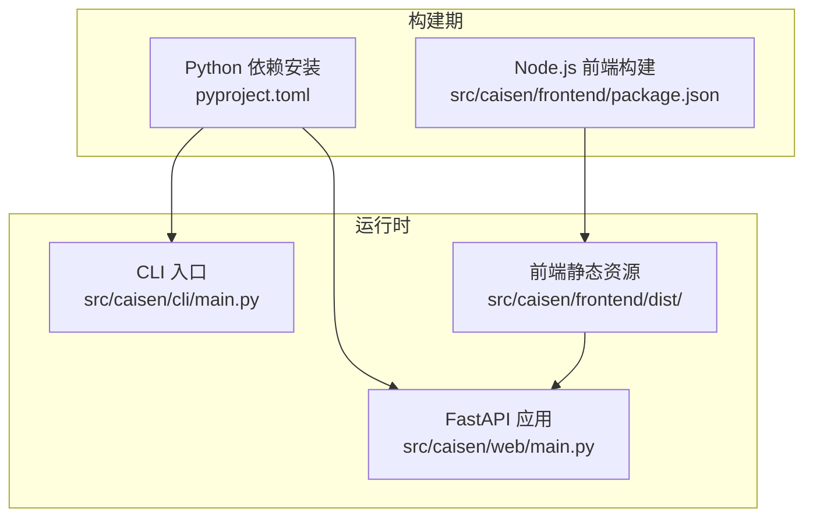
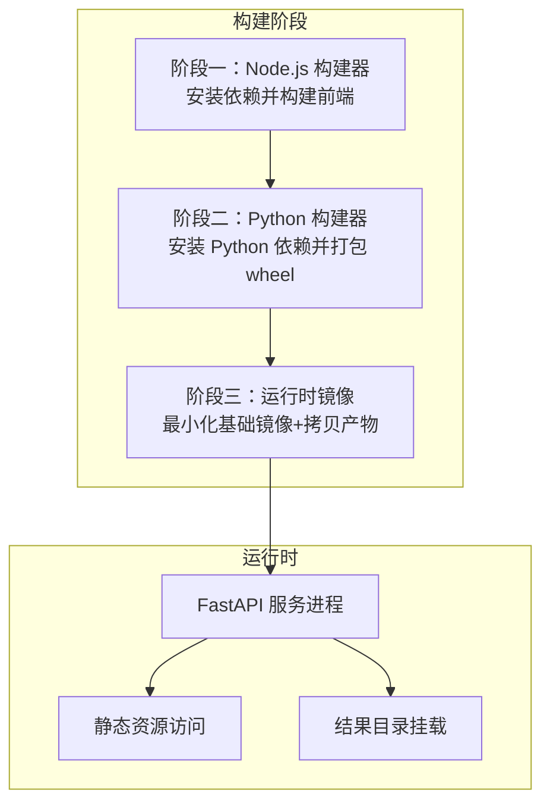
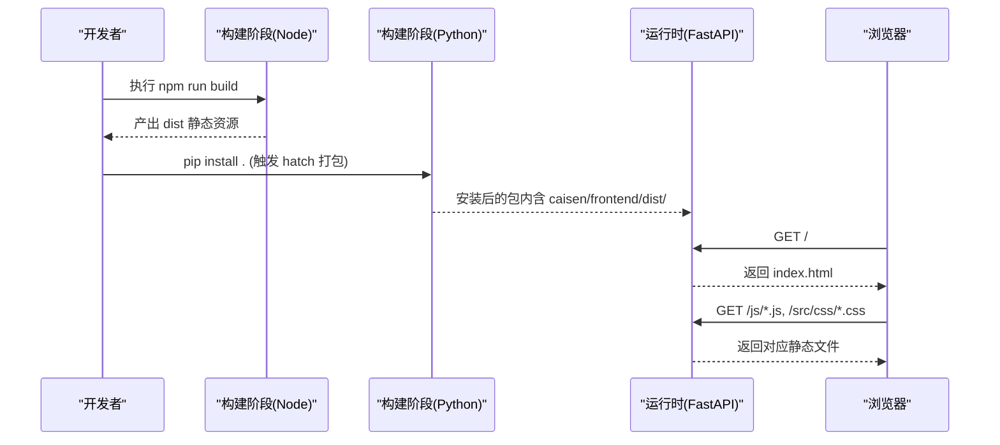
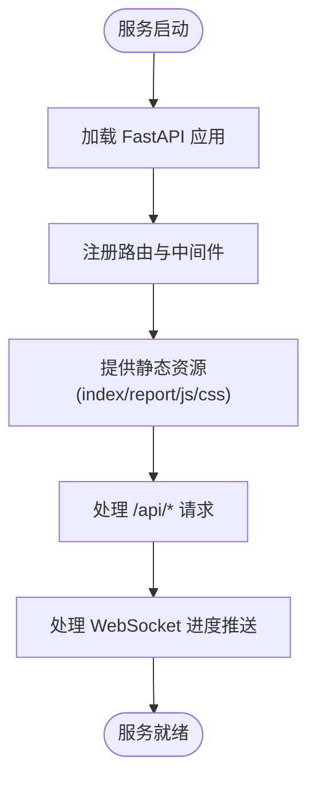
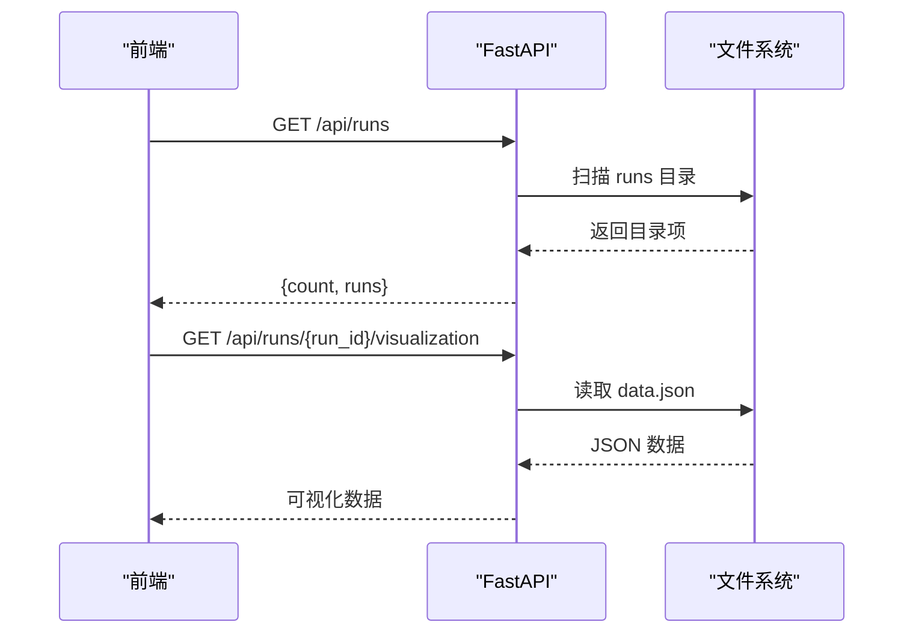
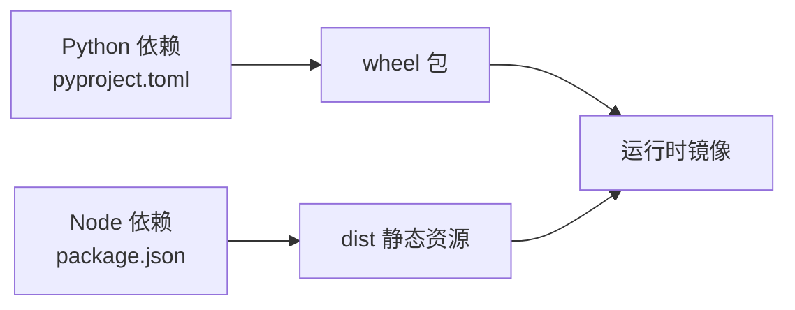

# Docker 镜像构建

<cite>
**本文引用的文件**   
- [README.md](file://README.md)
- [pyproject.toml](file://pyproject.toml)
- [src/caisen/web/main.py](file://src/caisen/web/main.py)
- [src/caisen/cli/main.py](file://src/caisen/cli/main.py)
- [src/caisen/frontend/package.json](file://src/caisen/frontend/package.json)
</cite>

## 目录
1. [简介](#简介)
2. [项目结构](#项目结构)
3. [核心组件](#核心组件)
4. [架构总览](#架构总览)
5. [详细组件分析](#详细组件分析)
6. [依赖关系分析](#依赖关系分析)
7. [性能与体积优化](#性能与体积优化)
8. [故障排查指南](#故障排查指南)
9. [结论](#结论)
10. [附录：Dockerfile 编写规范与示例](#附录dockerfile-编写规范与示例)

## 简介
本文件面向 Caisen 量化回测系统的容器化交付，提供一套完整的 Docker 镜像构建文档。内容涵盖多阶段构建策略（Python 依赖安装、Node.js 前端构建、最终镜像瘦身）、Dockerfile 编写规范（基础镜像选择、依赖层缓存优化、镜像大小控制技巧）、Python 虚拟环境管理、静态资源打包与优化、开发/生产差异化配置、镜像标签与版本管理、以及安全扫描集成建议。

## 项目结构
Caisen 系统由 Python 后端（FastAPI + Uvicorn）和 Node.js 前端（Vite + ECharts）组成，CLI 入口通过 pyproject 的脚本定义暴露。前端静态资源在构建后由 Python 包以 wheel force-include 的方式打包进镜像。

图示来源
- [src/caisen/web/main.py:1-120](file://src/caisen/web/main.py#L1-L120)
- [src/caisen/cli/main.py:1-120](file://src/caisen/cli/main.py#L1-L120)
- [pyproject.toml:1-59](file://pyproject.toml#L1-L59)
- [src/caisen/frontend/package.json:1-26](file://src/caisen/frontend/package.json#L1-L26)

章节来源
- [README.md:1-120](file://README.md#L1-L120)
- [pyproject.toml:1-59](file://pyproject.toml#L1-L59)
- [src/caisen/web/main.py:1-120](file://src/caisen/web/main.py#L1-L120)
- [src/caisen/cli/main.py:1-120](file://src/caisen/cli/main.py#L1-L120)
- [src/caisen/frontend/package.json:1-26](file://src/caisen/frontend/package.json#L1-L26)

## 核心组件
- Python 后端服务：基于 FastAPI 与 Uvicorn，提供 REST API、WebSocket 进度推送、静态 HTML 页面返回等能力。
- CLI 工具：提供 run、list-runs、show-result、web 等命令，封装回测执行与可视化服务启动流程。
- 前端资源：使用 Vite 构建，产物为静态 HTML/CSS/JS，被打包进 Python 包并在运行时由后端直接提供。

关键实现要点
- Web 服务入口与路由定义位于 web/main.py，包含 /、/api/*、/report.html、/js/*、/src/css/*、/health 等端点。
- CLI 入口在 cli/main.py，其中 web 子命令会同时启动后端 API 与前端开发服务器（仅开发模式）。
- 包元数据与依赖声明在 pyproject.toml，scripts 定义了 caisen 可执行入口；hatch 的 force-include 将前端 dist 目录打包进 wheel。
- 前端依赖与构建脚本在 frontend/package.json，build 命令用于生成静态资源。

章节来源
- [src/caisen/web/main.py:1-120](file://src/caisen/web/main.py#L1-L120)
- [src/caisen/cli/main.py:235-295](file://src/caisen/cli/main.py#L235-L295)
- [pyproject.toml:21-23](file://pyproject.toml#L21-L23)
- [pyproject.toml:54-59](file://pyproject.toml#L54-L59)
- [src/caisen/frontend/package.json:6-14](file://src/caisen/frontend/package.json#L6-L14)

## 架构总览
下图展示从源码到运行时的整体构建与运行路径，包括多阶段构建的关键步骤与产物流转。

图示来源
- [pyproject.toml:54-59](file://pyproject.toml#L54-L59)
- [src/caisen/web/main.py:86-94](file://src/caisen/web/main.py#L86-L94)
- [src/caisen/web/main.py:216-222](file://src/caisen/web/main.py#L216-L222)
- [src/caisen/web/main.py:229-245](file://src/caisen/web/main.py#L229-L245)

## 详细组件分析

### 前端构建与静态资源打包
- 构建脚本：frontend/package.json 中定义 build 命令，使用 Vite 输出静态资源至 dist 目录。
- 打包策略：pyproject.toml 的 hatch force-include 将 dist 目录映射到包内 caisen/frontend/dist/，以便在运行时由后端直接读取。
- 运行时访问：web/main.py 的根路由与报告路由直接读取 index.html 与 report.html；/js/* 与 /src/css/* 路由按文件名提供静态资源。

图示来源
- [src/caisen/frontend/package.json:6-14](file://src/caisen/frontend/package.json#L6-L14)
- [pyproject.toml:54-59](file://pyproject.toml#L54-L59)
- [src/caisen/web/main.py:86-94](file://src/caisen/web/main.py#L86-L94)
- [src/caisen/web/main.py:216-222](file://src/caisen/web/main.py#L216-L222)
- [src/caisen/web/main.py:229-245](file://src/caisen/web/main.py#L229-L245)

章节来源
- [src/caisen/frontend/package.json:1-26](file://src/caisen/frontend/package.json#L1-L26)
- [pyproject.toml:54-59](file://pyproject.toml#L54-L59)
- [src/caisen/web/main.py:86-94](file://src/caisen/web/main.py#L86-L94)
- [src/caisen/web/main.py:216-222](file://src/caisen/web/main.py#L216-L222)
- [src/caisen/web/main.py:229-245](file://src/caisen/web/main.py#L229-L245)

### Python 依赖与后端服务
- 依赖声明：pyproject.toml 的 dependencies 列出运行所需库（如 fastapi、uvicorn、websockets、pandas、pyarrow、click、pyyaml）。
- 服务入口：web/main.py 创建 FastAPI 应用，注册 REST 与 WebSocket 路由，并通过 uvicorn 启动。
- CLI 集成：cli/main.py 提供 web 子命令，在开发模式下同时启动后端 API 与前端 dev server（生产镜像无需此逻辑）。

图示来源
- [src/caisen/web/main.py:68-84](file://src/caisen/web/main.py#L68-L84)
- [src/caisen/web/main.py:86-94](file://src/caisen/web/main.py#L86-L94)
- [src/caisen/web/main.py:96-106](file://src/caisen/web/main.py#L96-L106)
- [src/caisen/web/main.py:224-227](file://src/caisen/web/main.py#L224-L227)
- [src/caisen/web/main.py:247-303](file://src/caisen/web/main.py#L247-L303)

章节来源
- [pyproject.toml:11-19](file://pyproject.toml#L11-L19)
- [src/caisen/web/main.py:68-84](file://src/caisen/web/main.py#L68-L84)
- [src/caisen/web/main.py:247-303](file://src/caisen/web/main.py#L247-L303)
- [src/caisen/cli/main.py:235-295](file://src/caisen/cli/main.py#L235-L295)

### 结果持久化与数据流
- 结果目录：默认 ./runs，可通过 CLI 或 Web 参数覆盖。
- 数据结构：每个 run_id 目录下包含 meta.json、data.json、bars.parquet、trades.parquet、equity.parquet、annotations.json、metrics.json 等。
- 列表与详情：/api/runs 与 /api/runs/{run_id} 提供过滤后的有效结果列表与详情。

图示来源
- [src/caisen/web/main.py:134-183](file://src/caisen/web/main.py#L134-L183)
- [src/caisen/web/main.py:194-201](file://src/caisen/web/main.py#L194-L201)
- [README.md:187-209](file://README.md#L187-L209)

章节来源
- [src/caisen/web/main.py:134-183](file://src/caisen/web/main.py#L134-L183)
- [src/caisen/web/main.py:194-201](file://src/caisen/web/main.py#L194-L201)
- [README.md:187-209](file://README.md#L187-L209)

## 依赖关系分析
- 外部依赖：fastapi、uvicorn、websockets、pandas、pyarrow、click、pyyaml。
- 前端依赖：echarts（运行时），vite、vitest、playwright（构建与测试）。
- 构建工具链：hatchling（Python 包构建）、Vite（前端构建）。

图示来源
- [pyproject.toml:11-19](file://pyproject.toml#L11-L19)
- [pyproject.toml:54-59](file://pyproject.toml#L54-L59)
- [src/caisen/frontend/package.json:15-24](file://src/caisen/frontend/package.json#L15-L24)

章节来源
- [pyproject.toml:11-19](file://pyproject.toml#L11-L19)
- [src/caisen/frontend/package.json:15-24](file://src/caisen/frontend/package.json#L15-L24)

## 性能与体积优化
- 基础镜像选择：生产镜像建议使用精简型 Python 官方镜像（如 slim 变体），避免携带不必要的系统工具。
- 依赖层缓存：先复制依赖清单（pyproject.toml、lock 文件等）再安装依赖，最大化利用 Docker 层缓存。
- 前端构建隔离：在独立阶段完成 Node.js 构建，仅将 dist 产物复制到最终镜像，避免携带 node_modules。
- 单进程模型：生产环境使用 uvicorn 单进程或配合反向代理，减少内存占用。
- 静态资源直出：通过 FastAPI 直接提供静态文件，避免额外静态服务器开销。
- 结果目录外置：通过卷挂载 runs 目录，避免将大量结果数据写入镜像层。

[本节为通用指导，不直接分析具体文件]

## 故障排查指南
- 前端资源未找到：检查 web/main.py 的路径解析与 dist 是否已正确打包进镜像。
- 端口冲突：确保后端 API 与前端端口不冲突（开发模式需分别指定）。
- 权限问题：确认容器用户对 runs 目录有读写权限。
- 健康检查失败：调用 /health 端点验证服务可用性。

章节来源
- [src/caisen/web/main.py:86-94](file://src/caisen/web/main.py#L86-L94)
- [src/caisen/web/main.py:216-222](file://src/caisen/web/main.py#L216-L222)
- [src/caisen/web/main.py:229-245](file://src/caisen/web/main.py#L229-L245)
- [src/caisen/web/main.py:224-227](file://src/caisen/web/main.py#L224-L227)

## 结论
通过多阶段构建与分层优化，Caisen 的 Docker 镜像可在保证功能完整性的前提下显著减小体积并提升构建效率。生产镜像聚焦于运行期最小依赖集，结合静态资源直出与结果目录外置，形成稳定高效的交付方案。

[本节为总结性内容，不直接分析具体文件]

## 附录：Dockerfile 编写规范与示例

### 编写规范
- 基础镜像
  - 生产：使用精简 Python 镜像（slim 变体），固定 Python 小版本。
  - 开发：可使用带构建工具的镜像，便于本地调试。
- 依赖层缓存
  - 先复制依赖清单（pyproject.toml、前端 package.json 等），再安装依赖。
  - 将 Python 依赖安装与源代码复制分步进行，提高缓存命中率。
- 前端构建
  - 在独立阶段安装 Node.js 依赖并执行构建，仅拷贝 dist 产物到最终镜像。
- 镜像瘦身
  - 清理构建缓存、临时文件；移除非必要工具链。
  - 使用多阶段构建，避免将构建期依赖带入运行期镜像。
- 运行配置
  - 设置工作目录、环境变量（如日志级别、端口）。
  - 使用非 root 用户运行，增强安全性。
  - 暴露必要端口（如 8000）。
- 健康检查
  - 添加 HEALTHCHECK 指向 /health 端点。
- 卷挂载
  - 为 runs 目录创建挂载点，避免将结果数据写入镜像层。

### 示例：生产镜像（多阶段构建）
说明
- 阶段一：Node.js 构建器，安装前端依赖并构建 dist。
- 阶段二：Python 构建器，安装 Python 依赖并打包 wheel。
- 阶段三：运行时镜像，仅包含运行所需的最小依赖与静态资源。

参考要点（对应仓库中的实际位置）
- 前端构建脚本：frontend/package.json 的 build 命令。
- Python 依赖与打包：pyproject.toml 的 dependencies 与 hatch force-include。
- 静态资源访问：web/main.py 的根路由与 /js/*、/src/css/* 路由。
- 服务启动：uvicorn 作为 ASGI 服务器。

章节来源
- [src/caisen/frontend/package.json:6-14](file://src/caisen/frontend/package.json#L6-L14)
- [pyproject.toml:11-19](file://pyproject.toml#L11-L19)
- [pyproject.toml:54-59](file://pyproject.toml#L54-L59)
- [src/caisen/web/main.py:86-94](file://src/caisen/web/main.py#L86-L94)
- [src/caisen/web/main.py:229-245](file://src/caisen/web/main.py#L229-L245)

### 示例：开发镜像（含构建工具）
说明
- 包含 Node.js 与 Python 构建工具，支持热重载与本地调试。
- 通过 CLI 的 web 子命令同时启动前后端（仅开发用途）。

参考要点
- CLI web 子命令：cli/main.py 的 web 命令，启动后端 API 与前端 dev server。
- 环境变量：VITE_API_PROXY 指向后端地址。

章节来源
- [src/caisen/cli/main.py:235-295](file://src/caisen/cli/main.py#L235-L295)

### 镜像标签策略与版本管理
- 语义化标签：使用主版本.次版本.修订号（如 v0.1.0）。
- 分支与提交哈希：为每次发布打 tag，并附带 git commit hash 便于追溯。
- 构建时间戳：在镜像元数据中记录构建时间与构建者信息。
- 多架构支持：如需跨平台，使用多架构构建流水线。

[本节为通用指导，不直接分析具体文件]

### 安全扫描集成
- 在 CI 中集成镜像安全扫描（如 Trivy、Snyk），对基础镜像与应用依赖进行漏洞检测。
- 定期更新基础镜像与依赖，修复已知安全问题。
- 最小权限原则：使用非 root 用户运行容器，限制文件系统访问范围。

[本节为通用指导，不直接分析具体文件]