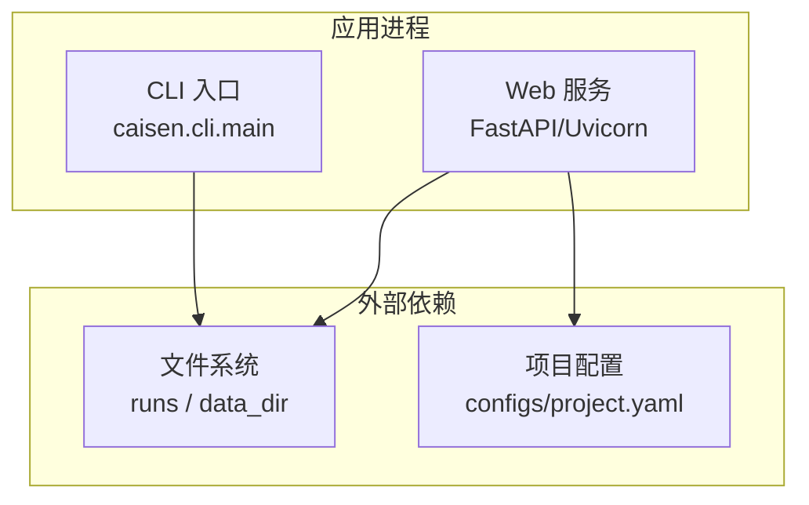
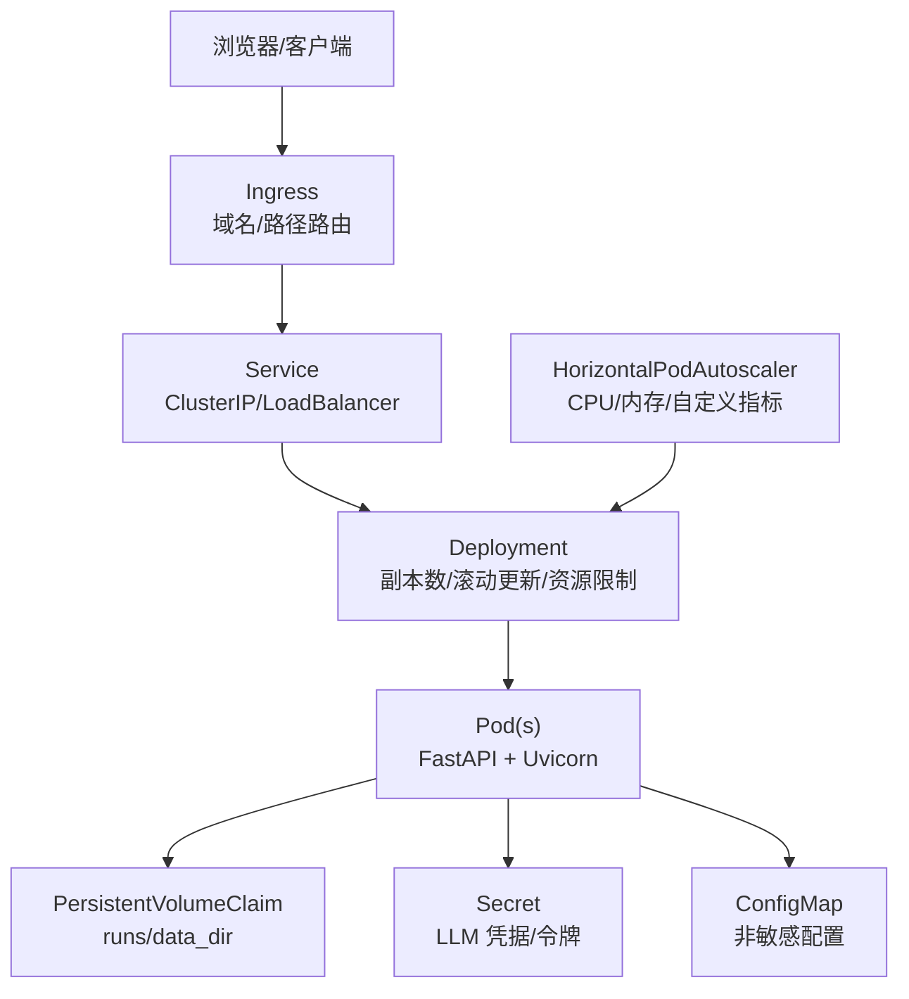
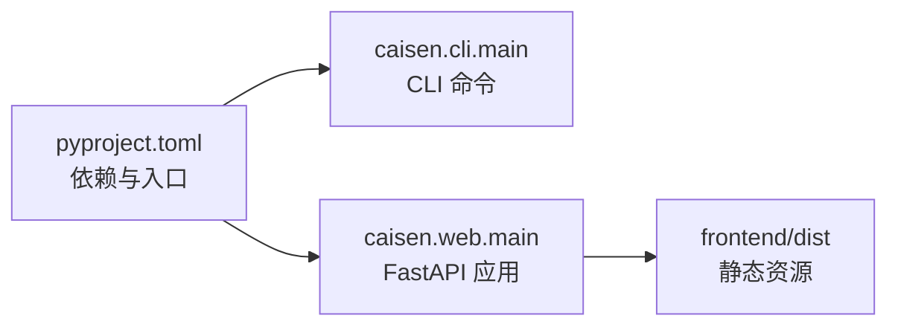

# Kubernetes 部署

<cite>
**本文引用的文件**   
- [README.md](file://README.md)
- [pyproject.toml](file://pyproject.toml)
- [src/caisen/web/main.py](file://src/caisen/web/main.py)
- [src/caisen/cli/main.py](file://src/caisen/cli/main.py)
- [configs/project.yaml](file://configs/project.yaml)
</cite>

## 目录
1. [简介](#简介)
2. [项目结构](#项目结构)
3. [核心组件](#核心组件)
4. [架构总览](#架构总览)
5. [详细组件分析](#详细组件分析)
6. [依赖分析](#依赖分析)
7. [性能考虑](#性能考虑)
8. [故障排查指南](#故障排查指南)
9. [结论](#结论)
10. [附录：Kubernetes 清单与配置示例](#附录kubernetes-清单与配置示例)

## 简介
本文件面向在 Kubernetes 上部署 Caisen 量化回测系统的运维与平台工程师，提供从应用入口、服务暴露、配置与密钥管理、滚动更新、水平扩缩容到持久化与监控告警的完整实践方案。文档同时给出可直接落地的 K8s 资源清单模板（命名空间隔离、Pod 反亲和性、节点选择器、HPA、PVC、Ingress 等），并结合代码实际行为进行说明。

## 项目结构
Caisen 系统由以下关键部分构成：
- CLI 工具：提供 run、list-runs、show-result、web 等命令，用于本地运行与开发调试
- Web 服务：基于 FastAPI + Uvicorn 的可视化报告服务，提供 REST 与 WebSocket 接口
- 前端静态资源：HTML/CSS/JS 由后端直接提供（生产环境建议通过 Ingress 或 CDN 分发）
- 配置与数据：项目全局配置位于 configs/project.yaml；回测结果输出至 runs 目录；行情数据为 Parquet 格式

图表来源
- [src/caisen/cli/main.py:1-371](file://src/caisen/cli/main.py#L1-L371)
- [src/caisen/web/main.py:1-319](file://src/caisen/web/main.py#L1-L319)
- [configs/project.yaml:1-13](file://configs/project.yaml#L1-L13)

章节来源
- [README.md:1-396](file://README.md#L1-L396)
- [pyproject.toml:1-59](file://pyproject.toml#L1-L59)
- [src/caisen/cli/main.py:1-371](file://src/caisen/cli/main.py#L1-L371)
- [src/caisen/web/main.py:1-319](file://src/caisen/web/main.py#L1-L319)
- [configs/project.yaml:1-13](file://configs/project.yaml#L1-L13)

## 核心组件
- CLI 主入口
  - 提供 run、optimize、web 等子命令，支持策略加载、数据读取、回测执行与结果持久化
  - web 子命令会同时启动后端 API 与前端 Vite 开发服务器（仅开发模式）
- Web 服务
  - 使用 FastAPI 构建，提供 REST 与 WebSocket 端点，返回 HTML 页面与 JSON 数据
  - 健康检查端点 /health 可用于就绪/存活探针
  - 通过 ProjectConfig 读取 output_dir、data_dir、api_port 等运行时参数
- 配置与数据
  - 项目配置位于 configs/project.yaml，包含 data_dir、output_dir、api_port 等
  - 回测结果写入 output_dir（默认 ./runs），以 run_id 为目录名组织
  - 行情数据按 {symbol}/{freq}/*.parquet 存放于 data_dir

章节来源
- [src/caisen/cli/main.py:1-371](file://src/caisen/cli/main.py#L1-L371)
- [src/caisen/web/main.py:1-319](file://src/caisen/web/main.py#L1-L319)
- [configs/project.yaml:1-13](file://configs/project.yaml#L1-L13)

## 架构总览
下图展示在 Kubernetes 中的典型部署形态：Ingress 暴露 HTTP/WS，Service 将流量转发至 Pod，Deployment 管理副本与滚动更新，HPA 根据 CPU/内存或自定义指标自动扩缩容，PVC 持久化 runs 与 data_dir，Secret 注入敏感信息（如 LLM 凭据）。

图表来源
- [src/caisen/web/main.py:1-319](file://src/caisen/web/main.py#L1-L319)
- [src/caisen/cli/main.py:1-371](file://src/caisen/cli/main.py#L1-L371)
- [configs/project.yaml:1-13](file://configs/project.yaml#L1-L13)

## 详细组件分析

### Deployment 资源配置
- 副本数设置
  - 单实例：适合开发与低负载场景
  - 多副本：结合 Service 负载均衡提升吞吐与可用性
- 滚动更新策略
  - 推荐 maxSurge=1、maxUnavailable=0，保证零停机发布
  - 配合 readinessProbe 与 livenessProbe 确保新 Pod 就绪后再替换旧 Pod
- 资源限制与请求
  - requests 决定调度与配额，limits 防止资源争用
  - 针对 Python/FastAPI 工作负载，建议合理设置 CPU/Memory 并启用 HPA
- 安全上下文与镜像拉取策略
  - 以非 root 用户运行，只读根文件系统，按需挂载卷
  - imagePullPolicy 建议使用 IfNotPresent 或 Always（视 CI/CD 而定）
- 环境变量与配置注入
  - 通过 ConfigMap 注入非敏感配置（如 output_dir、data_dir、api_port）
  - 通过 Secret 注入敏感信息（如 LLM 提供商密钥、数据库密码）

章节来源
- [src/caisen/web/main.py:1-319](file://src/caisen/web/main.py#L1-L319)
- [configs/project.yaml:1-13](file://configs/project.yaml#L1-L13)

### Service 暴露方式
- ClusterIP
  - 集群内部访问，适合 Ingress 或 Sidecar 代理访问后端 API
- LoadBalancer
  - 云厂商提供公网 IP，适合快速对外暴露，但成本较高
- Ingress
  - 统一入口、TLS 终止、路径/主机路由，推荐在生产使用
  - 可结合 Nginx/Contour/Istio 等控制器实现高级特性

适用场景建议
- 开发/测试：ClusterIP + Port Forward 或 Ingress
- 生产：Ingress + TLS + 限流/鉴权

章节来源
- [src/caisen/web/main.py:1-319](file://src/caisen/web/main.py#L1-L319)

### ConfigMap 与 Secret 管理
- ConfigMap
  - 注入非敏感配置项（例如 output_dir、data_dir、api_port）
  - 可通过 Volume 或环境变量注入，便于动态更新（需应用支持热重载或重启生效）
- Secret
  - 存储敏感信息（如 LLM 密钥、第三方 API Token）
  - 通过环境变量或 Volume 挂载，避免硬编码
- 动态配置更新
  - 若应用不支持热重载，可在更新 ConfigMap/Secret 后触发滚动更新（rollingUpdate）

章节来源
- [src/caisen/web/main.py:1-319](file://src/caisen/web/main.py#L1-L319)
- [configs/project.yaml:1-13](file://configs/project.yaml#L1-L13)

### 水平自动扩缩容（HPA）
- 基于 CPU/内存
  - 目标平均 CPU 利用率（如 60%~75%）
  - 目标平均内存利用率（如 70%~80%）
- 基于自定义指标（可选）
  - 如 QPS、WebSocket 连接数、队列长度等
- 最小/最大副本数
  - minReplicas 保障基础容量，maxReplicas 控制上限

章节来源
- [src/caisen/web/main.py:1-319](file://src/caisen/web/main.py#L1-L319)

### 持久化存储类（PVC）
- runs 目录
  - 保存回测结果（meta.json、data.json、metrics.json、Parquet 等）
  - 建议独立 PVC，便于备份与迁移
- data_dir 目录
  - 存放行情数据（Parquet），大体积且读多写少
  - 可使用高性能存储类（如 SSD/NVMe）或对象存储网关
- 存储类（StorageClass）
  - 根据 IOPS/吞吐/延迟需求选择合适的 StorageClass
  - 对只读数据可考虑快照与跨区复制

章节来源
- [README.md:187-236](file://README.md#L187-L236)
- [src/caisen/web/main.py:1-319](file://src/caisen/web/main.py#L1-L319)
- [configs/project.yaml:1-13](file://configs/project.yaml#L1-L13)

### 监控与告警集成
- 健康检查
  - 使用 /health 作为 readiness/liveness 探针
- 指标采集
  - 暴露 Prometheus 指标（如 uvicorn 内置指标或自定义 exporter）
  - 采集容器 CPU/内存、磁盘 IO、网络 I/O
- 日志收集
  - 标准输出/错误日志，集中收集（ELK/Loki）
- 告警规则
  - 服务不可用、高错误率、长尾延迟、磁盘不足、OOM 等

章节来源
- [src/caisen/web/main.py:224-227](file://src/caisen/web/main.py#L224-L227)

## 依赖分析
- 运行时依赖
  - FastAPI、Uvicorn、PyYAML、Pandas、PyArrow、Click、WebSockets
- 入口脚本
  - CLI 入口 caisen.cli.main:cli
- 前端打包产物
  - 构建时将 dist 目录包含进包中，供后端直接提供静态资源

图表来源
- [pyproject.toml:1-59](file://pyproject.toml#L1-L59)
- [src/caisen/cli/main.py:1-371](file://src/caisen/cli/main.py#L1-L371)
- [src/caisen/web/main.py:1-319](file://src/caisen/web/main.py#L1-L319)

章节来源
- [pyproject.toml:1-59](file://pyproject.toml#L1-L59)
- [src/caisen/cli/main.py:1-371](file://src/caisen/cli/main.py#L1-L371)
- [src/caisen/web/main.py:1-319](file://src/caisen/web/main.py#L1-L319)

## 性能考虑
- 计算密集型任务
  - 回测与优化可能占用较多 CPU，建议为相关 Pod 分配更高 CPU requests/limits
- I/O 密集
  - Parquet 读写对磁盘 I/O 敏感，建议使用高性能存储类与合适的副本策略
- 并发与线程
  - Web 服务使用异步框架，注意并发量与线程池大小
- 缓存与预热
  - 对热点数据（如常用策略/配置）可考虑内存缓存
- 弹性伸缩
  - 结合 HPA 与合理的资源基线，避免频繁抖动

[本节为通用指导，不直接分析具体文件]

## 故障排查指南
- 服务不可用
  - 检查 /health 探针是否返回正常
  - 查看 Pod 事件与日志，确认依赖卷挂载与权限
- 回测结果缺失
  - 确认 output_dir 已正确挂载且可写
  - 校验 runs 目录下 meta.json 与 data.json/bars.parquet 是否存在
- 数据未找到
  - 确认 data_dir 路径与权限，Parquet 文件结构是否符合要求
- 端口冲突
  - 检查 api_port 是否与 Service/Ingress 映射一致

章节来源
- [src/caisen/web/main.py:224-227](file://src/caisen/web/main.py#L224-L227)
- [README.md:187-236](file://README.md#L187-L236)
- [configs/project.yaml:1-13](file://configs/project.yaml#L1-L13)

## 结论
通过在 Kubernetes 中采用 Deployment + Service + Ingress + HPA + PVC + Secret/ConfigMap 的组合，可实现 Caisen 的高可用、可扩展与易维护部署。结合健康检查、指标采集与日志收集，可获得完善的可观测性与稳定性保障。

[本节为总结性内容，不直接分析具体文件]

## 附录：Kubernetes 清单与配置示例
以下为可直接使用的资源清单模板（请根据实际环境调整值）：

- 命名空间
  - 名称：caisen
  - 用途：隔离不同环境或团队资源

- ConfigMap（非敏感配置）
  - 键：output_dir、data_dir、api_port
  - 作用：覆盖 configs/project.yaml 中的默认值

- Secret（敏感信息）
  - 键：llm_api_key、db_password 等
  - 作用：注入 LLM 提供商密钥或其他敏感配置

- PersistentVolumeClaim
  - runs-pvc：挂载到 /app/runs
  - data-pvc：挂载到 /app/data_dir

- Deployment
  - 副本数：初始 1，HPA 控制范围
  - 滚动更新：maxSurge=1、maxUnavailable=0
  - 资源限制：requests/limits 依据压测设定
  - 探针：readiness=/health、liveness=/health
  - 卷挂载：runs-pvc、data-pvc
  - 环境变量：从 ConfigMap/Secret 注入

- Service
  - 类型：ClusterIP（推荐由 Ingress 暴露）
  - 端口：8001（对应 api_port）

- Ingress
  - 主机与路径：/ 指向 Service 8001
  - TLS：启用证书与自动续期

- HorizontalPodAutoscaler
  - 目标：CPU 60%~75%，内存 70%~80%
  - 副本范围：min=1，max=5（可按业务峰值调整）

- 节点选择器与反亲和性
  - 节点选择器：按 GPU/CPU/IO 能力选择合适节点
  - Pod 反亲和性：同命名空间内尽量分散在不同节点

- 监控与告警
  - 指标：Prometheus 抓取 /metrics（如 uvicorn 指标）
  - 日志：stdout/stderr 集中收集
  - 告警：服务不可用、错误率、延迟、资源不足

[本节为模板说明，不直接分析具体文件]