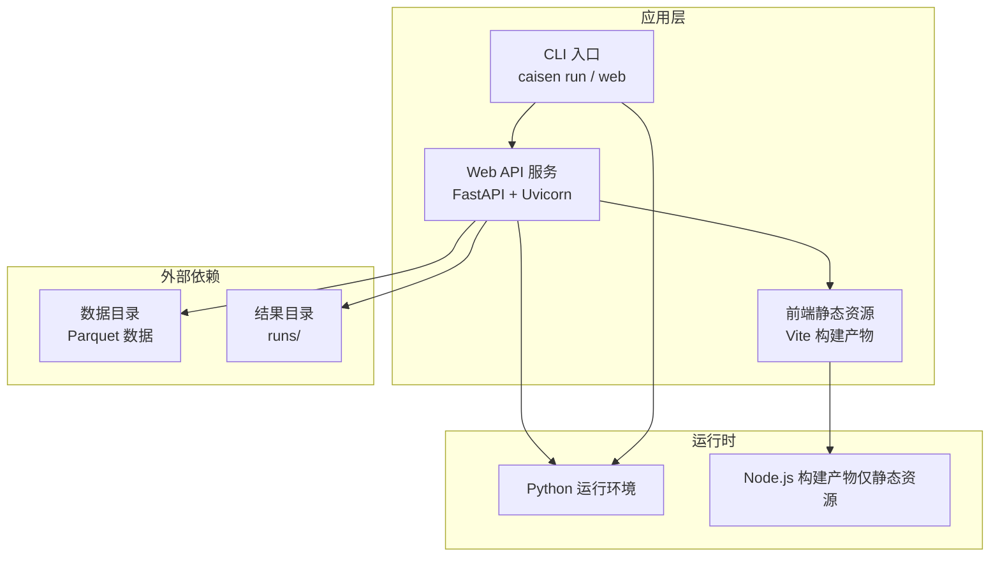
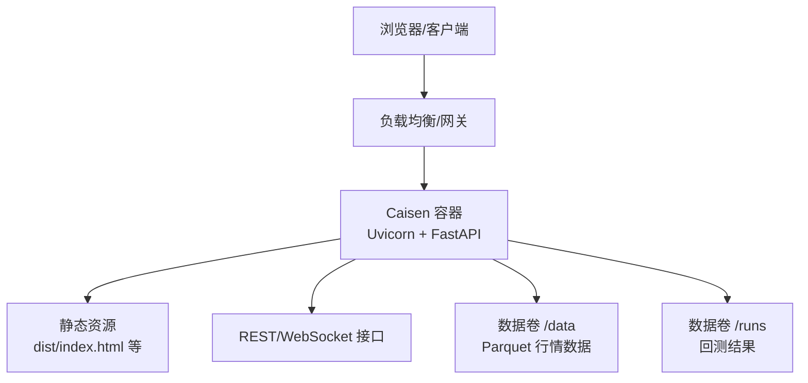
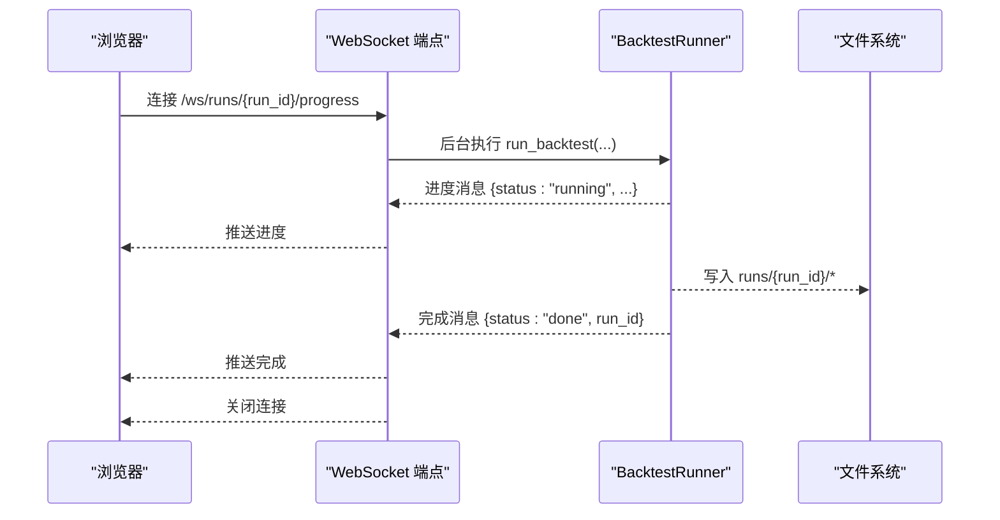
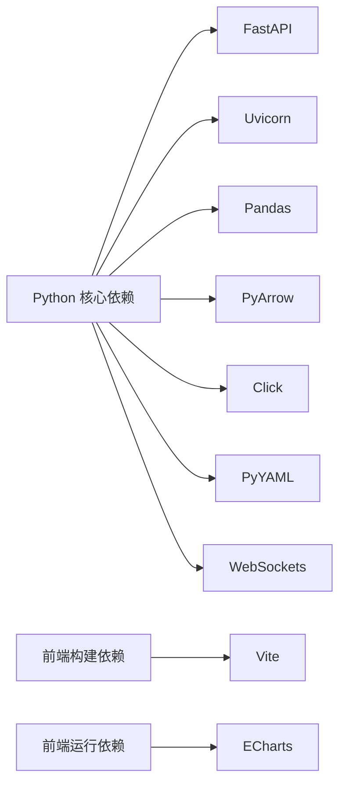

# 容器化部署

<cite>
**本文引用的文件**
- [README.md](file://README.md)
- [pyproject.toml](file://pyproject.toml)
- [src/caisen/web/main.py](file://src/caisen/web/main.py)
- [src/caisen/cli/main.py](file://src/caisen/cli/main.py)
- [src/caisen/config/project_config.py](file://src/caisen/config/project_config.py)
- [src/caisen/frontend/package.json](file://src/caisen/frontend/package.json)
</cite>

## 目录
1. [简介](#简介)
2. [项目结构](#项目结构)
3. [核心组件](#核心组件)
4. [架构总览](#架构总览)
5. [详细组件分析](#详细组件分析)
6. [依赖关系分析](#依赖关系分析)
7. [性能与镜像优化](#性能与镜像优化)
8. [编排与部署](#编排与部署)
9. [监控与日志](#监控与日志)
10. [安全加固](#安全加固)
11. [故障排查](#故障排查)
12. [结论](#结论)

## 简介
本文件面向 Caisen 量化回测系统的容器化部署，覆盖 Docker 镜像构建、Docker Compose 编排、Kubernetes 清单、监控与日志、以及安全加固等主题。文档基于仓库现有代码与配置进行说明，确保可落地执行。

## 项目结构
Caisen 包含 Python 后端（FastAPI + Uvicorn）、CLI 工具（Click）、前端静态资源（Vite 构建产物）以及策略与数据模块。容器化需同时考虑 Python 运行环境与前端静态资源的打包与分发。

图表来源
- [src/caisen/web/main.py:68-106](file://src/caisen/web/main.py#L68-L106)
- [src/caisen/cli/main.py:235-295](file://src/caisen/cli/main.py#L235-L295)
- [src/caisen/frontend/package.json:1-26](file://src/caisen/frontend/package.json#L1-L26)

章节来源
- [README.md:1-120](file://README.md#L1-L120)
- [pyproject.toml:1-59](file://pyproject.toml#L1-L59)
- [src/caisen/web/main.py:68-106](file://src/caisen/web/main.py#L68-L106)
- [src/caisen/cli/main.py:235-295](file://src/caisen/cli/main.py#L235-L295)
- [src/caisen/frontend/package.json:1-26](file://src/caisen/frontend/package.json#L1-L26)

## 核心组件
- CLI 入口：提供 run、web、optimize 等命令，负责参数解析、策略加载、回测执行与结果持久化。
- Web 服务：基于 FastAPI 提供 REST 与 WebSocket 接口，返回前端页面与可视化数据，支持后台异步回测任务。
- 前端资源：由 Vite 构建的静态 HTML/CSS/JS，通过 Web 服务直接提供或反向代理访问。
- 配置系统：从 configs/project.yaml 读取全局配置（数据目录、输出目录、API 端口），不存在时回退到内嵌默认值。

章节来源
- [src/caisen/cli/main.py:63-191](file://src/caisen/cli/main.py#L63-L191)
- [src/caisen/web/main.py:68-106](file://src/caisen/web/main.py#L68-L106)
- [src/caisen/config/project_config.py:17-43](file://src/caisen/config/project_config.py#L17-L43)

## 架构总览
下图展示容器化后的典型部署形态：一个多阶段构建的镜像包含 Python 运行环境与前端静态资源；容器启动后运行 Uvicorn 服务，暴露 HTTP 与 WebSocket 端口；数据与结果通过数据卷挂载到宿主机。

图表来源
- [src/caisen/web/main.py:86-94](file://src/caisen/web/main.py#L86-L94)
- [src/caisen/web/main.py:224-227](file://src/caisen/web/main.py#L224-L227)
- [src/caisen/config/project_config.py:17-28](file://src/caisen/config/project_config.py#L17-L28)

## 详细组件分析

### 镜像构建流程（多阶段构建）
建议采用两阶段构建：
- 构建阶段：安装 Node.js 与前端依赖，执行 Vite 构建，产出 dist 静态资源。
- 运行阶段：使用精简 Python 基础镜像，安装 Python 依赖，复制前端 dist 与源码，启动 Uvicorn。

要点
- 构建阶段仅用于生成静态资源，不进入最终镜像。
- 运行阶段只包含运行所需的最小依赖集，避免引入开发工具链。
- 将前端静态资源复制到 Python 镜像中，由 Web 服务直接提供，减少网络请求与反向代理复杂度。

章节来源
- [src/caisen/frontend/package.json:6-14](file://src/caisen/frontend/package.json#L6-L14)
- [src/caisen/web/main.py:86-94](file://src/caisen/web/main.py#L86-L94)

### Dockerfile 编写规范与最佳实践
- 基础镜像选择
  - 构建阶段：使用官方 Node.js 镜像以执行 Vite 构建。
  - 运行阶段：使用官方 Python 镜像（指定具体小版本，如 3.10-slim），满足 requires-python >= 3.10。
- 依赖层缓存优化
  - 先复制 pyproject.toml 与前端 package.json，再执行 pip install 与 npm ci，最后复制源码与前端源码，最大化利用镜像层缓存。
- 镜像大小控制
  - 使用 slim 或 alpine 变体（注意 glibc 兼容）。
  - 清理包管理器缓存与临时文件。
  - 仅复制必要文件，排除测试与文档。
- 非 root 用户运行
  - 创建专用用户并切换 UID/GID，降低权限风险。
- 健康检查
  - 在镜像中集成健康检查端点（/health），便于编排平台探测。

章节来源
- [pyproject.toml:10-19](file://pyproject.toml#L10-L19)
- [src/caisen/web/main.py:224-227](file://src/caisen/web/main.py#L224-L227)

### Docker Compose 编排
- 服务定义
  - caisen-app：运行 FastAPI 服务，映射 HTTP 端口，挂载数据与结果目录。
  - （可选）nginx：作为反向代理，统一入口与静态资源缓存。
- 数据卷
  - data：挂载 Parquet 数据目录，供回测读取。
  - runs：挂载回测结果目录，持久化历史报告。
- 环境变量
  - 通过 .env 或 compose 环境变量注入 api_port、output_dir、data_dir 等。
- 网络
  - 默认 bridge 网络即可；如需隔离，可自定义网络并限制端口暴露。

章节来源
- [src/caisen/config/project_config.py:17-28](file://src/caisen/config/project_config.py#L17-L28)
- [src/caisen/web/main.py:86-94](file://src/caisen/web/main.py#L86-L94)

### Kubernetes 部署清单
- Deployment
  - 副本数、资源限制、探针（liveness/readiness）指向 /health。
  - 环境变量注入配置项。
- Service
  - ClusterIP 或 LoadBalancer，暴露 HTTP 端口。
- ConfigMap
  - 存放 project.yaml 或其他配置文件，以卷挂载方式注入。
- Secret
  - 存储敏感信息（如 LLM 密钥、数据库凭据），以环境变量或卷形式注入。
- 持久化
  - 使用 PersistentVolumeClaim 挂载 /data 与 /runs。

章节来源
- [src/caisen/web/main.py:224-227](file://src/caisen/web/main.py#L224-L227)
- [src/caisen/config/project_config.py:17-28](file://src/caisen/config/project_config.py#L17-L28)

### 服务间通信与路径安全
- 前后端通信
  - 前端静态资源由 Web 服务直接提供，或通过反向代理转发至 /api/* 与 /ws/*。
- 路径校验
  - 服务端对 run_id 与文件路径进行严格校验，防止路径遍历攻击。
- 进度推送
  - WebSocket 实时推送回测进度，连接建立后在后台线程执行任务，完成后关闭连接。

章节来源
- [src/caisen/web/main.py:28-39](file://src/caisen/web/main.py#L28-L39)
- [src/caisen/web/main.py:247-303](file://src/caisen/web/main.py#L247-L303)

### 关键流程图（WebSocket 回测进度）

图表来源
- [src/caisen/web/main.py:247-303](file://src/caisen/web/main.py#L247-L303)

## 依赖关系分析
- Python 依赖
  - 核心依赖包括 pandas、pyarrow、click、fastapi、uvicorn、websockets、pyyaml。
  - 可选开发依赖 pytest、ruff、vitest 等，不应进入生产镜像。
- 前端依赖
  - 构建期依赖 vite、vitest、playwright；运行期仅需 echarts 等运行时库（若为静态资源则无需 Node 运行时）。

图表来源
- [pyproject.toml:11-19](file://pyproject.toml#L11-L19)
- [src/caisen/frontend/package.json:15-24](file://src/caisen/frontend/package.json#L15-L24)

章节来源
- [pyproject.toml:11-19](file://pyproject.toml#L11-L19)
- [src/caisen/frontend/package.json:15-24](file://src/caisen/frontend/package.json#L15-L24)

## 性能与镜像优化
- 分层缓存
  - 将依赖安装与源码复制分离，优先复制依赖描述文件，提升缓存命中率。
- 最小镜像
  - 使用 slim 基础镜像，移除不必要的工具与文档。
- 并行构建
  - 在 CI 中使用多阶段构建与缓存层复用，缩短构建时间。
- 静态资源预编译
  - 前端在构建阶段完成打包，运行阶段仅服务静态文件，降低运行时开销。

[本节为通用指导，不直接分析具体文件]

## 编排与部署

### Docker Compose 示例
- 服务
  - caisen-app：映射 8000（HTTP）与 8001（API），挂载 /data 与 /runs。
- 环境变量
  - 设置 output_dir、data_dir、api_port 等。
- 健康检查
  - 使用 GET /health 判定服务就绪。

章节来源
- [src/caisen/web/main.py:224-227](file://src/caisen/web/main.py#L224-L227)
- [src/caisen/config/project_config.py:17-28](file://src/caisen/config/project_config.py#L17-L28)

### Kubernetes 清单要点
- Deployment
  - 设置 liveness/readiness 探针，挂载 ConfigMap 与 Secret。
- Service
  - 暴露 HTTP 端口，必要时启用 Ingress。
- ConfigMap
  - 注入 project.yaml 或环境变量。
- Secret
  - 注入敏感配置，避免明文。
- PVC
  - 持久化 /data 与 /runs。

章节来源
- [src/caisen/web/main.py:224-227](file://src/caisen/web/main.py#L224-L227)
- [src/caisen/config/project_config.py:17-28](file://src/caisen/config/project_config.py#L17-L28)

## 监控与日志

### Prometheus 指标暴露
- 当前未内置指标收集逻辑，建议在 Web 服务中增加 /metrics 端点，导出进程与业务指标（如请求计数、错误率、回测耗时）。
- 使用标准 exporter 或轻量 SDK 暴露指标，配合 Prometheus 抓取。

[本节为通用指导，不直接分析具体文件]

### 结构化日志输出
- 建议使用 JSON 格式输出日志，便于集中采集与分析。
- 结合容器日志驱动（stdout/stderr）与日志收集器（如 Fluent Bit、Filebeat）实现统一治理。

[本节为通用指导，不直接分析具体文件]

## 安全加固
- 非 root 用户运行
  - 在镜像中创建专用用户，并以该用户启动进程，遵循最小权限原则。
- 镜像扫描
  - 在 CI 中加入镜像漏洞扫描（如 Trivy、Clair），阻断高危镜像发布。
- 最小权限
  - 仅开放必要端口，限制文件系统读写范围，避免挂载敏感目录。
- 输入校验
  - 已实现路径安全校验，防止路径遍历攻击。

章节来源
- [src/caisen/web/main.py:28-39](file://src/caisen/web/main.py#L28-L39)

## 故障排查
- 常见问题
  - 前端资源缺失：确认构建阶段是否成功产出 dist 并复制到运行镜像。
  - 数据目录不可读：检查数据卷挂载路径与权限。
  - 回测超时：WebSocket 端点存在超时保护，需检查数据量与策略复杂度。
- 定位方法
  - 查看容器日志与 /health 状态。
  - 检查 runs 目录是否生成 meta.json 与 data.json/bars.parquet。

章节来源
- [src/caisen/web/main.py:224-227](file://src/caisen/web/main.py#L224-L227)
- [src/caisen/web/main.py:247-303](file://src/caisen/web/main.py#L247-L303)

## 结论
通过多阶段构建与最小镜像策略，可将 Caisen 高效地容器化部署于 Docker 与 Kubernetes 环境。结合健康检查、结构化日志与镜像扫描，可在保证性能的同时提升安全性与可观测性。后续可在 Web 服务中补充指标暴露与更完善的监控告警能力。