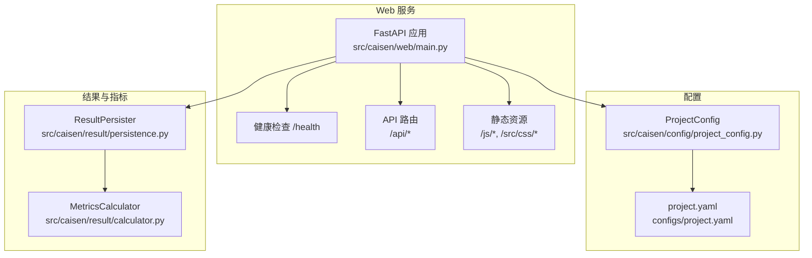
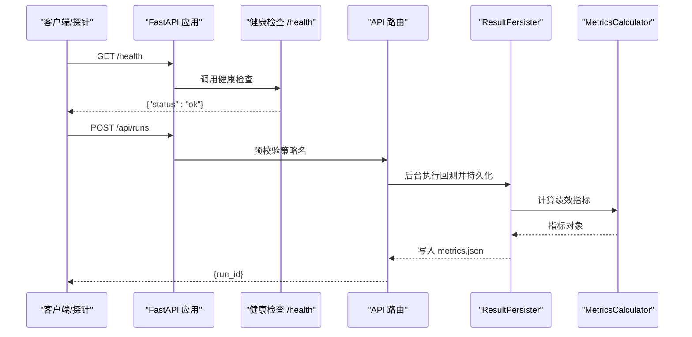
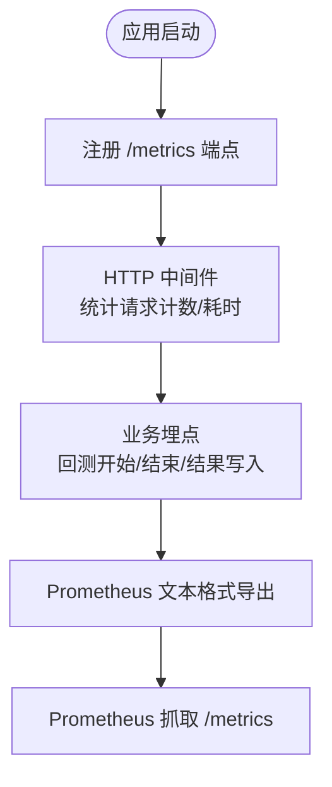
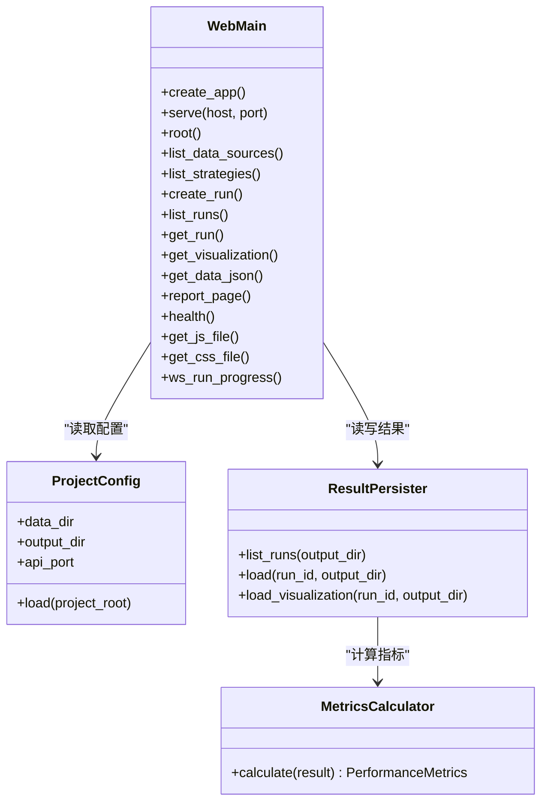

# 容器监控与日志

<cite>
**本文引用的文件**
- [src/caisen/web/main.py](file://src/caisen/web/main.py)
- [configs/project.yaml](file://configs/project.yaml)
- [src/caisen/config/project_config.py](file://src/caisen/config/project_config.py)
- [src/caisen/result/calculator.py](file://src/caisen/result/calculator.py)
- [src/caisen/result/persistence.py](file://src/caisen/result/persistence.py)
- [tests/test_web_api.py](file://tests/test_web_api.py)
- [tests/test_path_traversal.py](file://tests/test_path_traversal.py)
</cite>

## 目录
1. [简介](#简介)
2. [项目结构](#项目结构)
3. [核心组件](#核心组件)
4. [架构总览](#架构总览)
5. [详细组件分析](#详细组件分析)
6. [依赖关系分析](#依赖关系分析)
7. [性能考量](#性能考量)
8. [故障排查指南](#故障排查指南)
9. [结论](#结论)
10. [附录](#附录)

## 简介
本文件面向 Caisen 量化回测系统的容器化部署，提供“监控与日志”的完整方案说明。当前代码库已具备基础 HTTP 服务与健康检查、结构化日志记录点以及回测绩效指标计算与持久化能力。本文在此基础上：
- 明确 Prometheus 指标暴露的实现路径（含自定义业务指标采集、性能指标导出与 HTTP 端点配置）
- 定义结构化日志输出格式、级别控制与轮转策略
- 给出 ELK Stack 或 Loki 日志收集与查询建议
- 提供 Grafana 仪表板与告警规则示例
- 总结容器健康检查、性能监控与故障诊断最佳实践

## 项目结构
围绕监控与日志相关的关键位置如下：
- Web 服务与端点：FastAPI 应用、CORS、健康检查、静态资源与 API 路由
- 项目配置：从 configs/project.yaml 加载全局配置（端口、数据/输出目录等）
- 指标计算与持久化：绩效指标计算与 metrics.json 写入
- 测试用例：覆盖健康检查与路径遍历防护

图表来源
- [src/caisen/web/main.py:68-304](file://src/caisen/web/main.py#L68-L304)
- [src/caisen/config/project_config.py:24-43](file://src/caisen/config/project_config.py#L24-L43)
- [configs/project.yaml:1-13](file://configs/project.yaml#L1-L13)
- [src/caisen/result/calculator.py:34-79](file://src/caisen/result/calculator.py#L34-L79)
- [src/caisen/result/persistence.py:119-121](file://src/caisen/result/persistence.py#L119-L121)

章节来源
- [src/caisen/web/main.py:68-304](file://src/caisen/web/main.py#L68-L304)
- [configs/project.yaml:1-13](file://configs/project.yaml#L1-L13)
- [src/caisen/config/project_config.py:24-43](file://src/caisen/config/project_config.py#L24-L43)
- [src/caisen/result/calculator.py:34-79](file://src/caisen/result/calculator.py#L34-L79)
- [src/caisen/result/persistence.py:119-121](file://src/caisen/result/persistence.py#L119-L121)

## 核心组件
- Web 服务与端点
  - FastAPI 应用创建、CORS 中间件、根页面与报告页面返回
  - 健康检查端点 /health
  - 数据源与策略列表、回测触发与结果读取、可视化数据获取
  - 静态资源访问（JS/CSS），并包含路径安全校验
- 项目配置
  - ProjectConfig 从 configs/project.yaml 加载 data_dir、output_dir、api_port
  - 缺失字段时静默降级到内嵌默认值
- 指标计算与持久化
  - MetricsCalculator 计算年化收益、最大回撤、夏普比率、胜率、盈亏比等
  - ResultPersister 将指标写入 runs/{run_id}/metrics.json，并在列表接口中附带

章节来源
- [src/caisen/web/main.py:68-304](file://src/caisen/web/main.py#L68-L304)
- [src/caisen/config/project_config.py:24-43](file://src/caisen/config/project_config.py#L24-L43)
- [configs/project.yaml:1-13](file://configs/project.yaml#L1-L13)
- [src/caisen/result/calculator.py:34-79](file://src/caisen/result/calculator.py#L34-L79)
- [src/caisen/result/persistence.py:119-121](file://src/caisen/result/persistence.py#L119-L121)

## 架构总览
下图展示 Web 服务在容器中的关键交互：外部请求进入 FastAPI，经过 CORS 与安全校验后路由到具体处理逻辑；健康检查用于探针；指标计算与持久化由结果模块完成。

图表来源
- [src/caisen/web/main.py:86-132](file://src/caisen/web/main.py#L86-L132)
- [src/caisen/result/persistence.py:119-121](file://src/caisen/result/persistence.py#L119-L121)
- [src/caisen/result/calculator.py:34-79](file://src/caisen/result/calculator.py#L34-L79)

## 详细组件分析

### Prometheus 指标暴露实现
目标：在不侵入现有业务逻辑的前提下，为容器提供可被 Prometheus 抓取的标准指标。

- 指标分类与采集点
  - 系统级指标：进程 CPU/内存、GC、线程数、FD 使用量（由运行时/平台自动采集）
  - HTTP 指标：请求速率、延迟分布、错误率（可通过中间件或框架扩展）
  - 业务指标：
    - 回测任务计数与状态（成功/失败/运行中）
    - 策略维度指标：按 strategy_name/symbol/freq 分桶的交易次数、胜率、最大回撤、夏普比率
    - 数据源可用性：扫描到的数据源数量、时间范围跨度
- 暴露方式
  - 新增 /metrics 端点，输出 Prometheus text/plain 格式
  - 使用标准计数器（Counter）、直方图（Histogram）、摘要（Summary）与标签（Labels）
- 与现有代码集成建议
  - 在 FastAPI 启动阶段注册中间件或事件钩子，统计请求耗时与错误
  - 在回测入口与结果持久化处埋点，更新业务指标
  - 健康检查端点 /health 保持不变，供 Liveness/Readiness 探针使用

[本节为概念性设计，不直接分析具体文件]

### 性能指标导出与 HTTP 端点配置
- 现有端点
  - /health：健康检查，返回固定状态
  - /api/data-sources、/api/strategies、/api/runs、/api/runs/{id}、/api/runs/{id}/visualization、/api/runs/{id}/data.json
  - /report.html、/js/*、/src/css/*
- 配置项
  - api_port：通过 configs/project.yaml 注入，默认值来自 ProjectConfig
- 建议
  - 在 /metrics 端点中复用 ProjectConfig 的配置上下文（如输出目录、数据目录）以生成一致的标签
  - 对大体积响应（如 data.json）增加超时与限流保护

章节来源
- [src/caisen/web/main.py:86-245](file://src/caisen/web/main.py#L86-L245)
- [configs/project.yaml:11-12](file://configs/project.yaml#L11-L12)
- [src/caisen/config/project_config.py:24-43](file://src/caisen/config/project_config.py#L24-L43)

### 结构化日志输出格式
- 现状
  - 使用 Python logging 模块，在 Web 服务中定义 logger
  - 在异常场景下记录异常堆栈与上下文信息
- 推荐格式（JSON 行式）
  - 字段建议：timestamp、level、service、version、trace_id、method、path、status_code、latency_ms、strategy_name、symbol、freq、message
  - 统一序列化器，避免敏感信息泄露
- 级别控制
  - 开发环境：DEBUG
  - 生产环境：INFO/WARN/ERROR
  - 通过环境变量或配置文件动态调整
- 日志轮转
  - 基于大小与时间的双轮转策略
  - 保留窗口与压缩归档，避免磁盘爆满

章节来源
- [src/caisen/web/main.py:3-8](file://src/caisen/web/main.py#L3-L8)
- [src/caisen/web/main.py:24-25](file://src/caisen/web/main.py#L24-L25)
- [src/caisen/web/main.py:128-130](file://src/caisen/web/main.py#L128-L130)

### 日志收集与分析（ELK/Loki）
- ELK Stack
  - Filebeat/Fluent Bit 采集容器 stdout/stderr 或本地日志文件
  - Logstash 解析 JSON 字段，Elasticsearch 存储，Kibana 查询与可视化
- Loki
  - Promtail 采集日志，Loki 索引与存储，Grafana 统一查询
  - 利用 label 进行高基数过滤（strategy_name、symbol、freq、status_code）
- 查询语法要点
  - ELK：DSL 查询、聚合、时序分析
  - Loki：LogQL，支持正则、匹配、聚合与仪表盘联动

[本节为通用方案说明，不直接分析具体文件]

### Grafana 仪表板与告警
- 仪表板建议
  - 概览：QPS、P95/P99 延迟、错误率、健康状态
  - 业务：回测任务成功率、各策略胜率/最大回撤/夏普比率趋势
  - 资源：CPU/内存/FD/GC（若启用）
- 告警规则示例
  - 健康检查连续失败 N 次
  - 错误率超过阈值
  - P99 延迟超过阈值
  - 回测失败率上升、某策略胜率显著下降

[本节为通用配置建议，不直接分析具体文件]

### 容器健康检查、性能监控与故障诊断
- 健康检查
  - Liveness：/health 返回 ok
  - Readiness：可扩展为检查依赖（文件系统、数据目录可读）
- 性能监控
  - 结合 Prometheus 指标与容器运行时指标
  - 关注长尾延迟与吞吐瓶颈
- 故障诊断
  - 通过 trace_id 关联请求链路
  - 结合日志与指标定位问题（例如路径遍历拦截、策略未注册、数据缺失）

章节来源
- [src/caisen/web/main.py:224-227](file://src/caisen/web/main.py#L224-L227)
- [tests/test_web_api.py:19-25](file://tests/test_web_api.py#L19-L25)

## 依赖关系分析
- Web 服务依赖
  - FastAPI、CORS、Uvicorn（启动）
  - ProjectConfig（读取 project.yaml）
  - ResultPersister（读写 runs 目录与 metrics.json）
  - MetricsCalculator（计算绩效指标）
- 安全与健壮性
  - 路径遍历防护：_safe_resolve 拒绝非法字符与逃逸路径
  - 健康检查端点用于探针

图表来源
- [src/caisen/web/main.py:68-304](file://src/caisen/web/main.py#L68-L304)
- [src/caisen/config/project_config.py:24-43](file://src/caisen/config/project_config.py#L24-L43)
- [src/caisen/result/persistence.py:119-121](file://src/caisen/result/persistence.py#L119-L121)
- [src/caisen/result/calculator.py:34-79](file://src/caisen/result/calculator.py#L34-L79)

章节来源
- [src/caisen/web/main.py:68-304](file://src/caisen/web/main.py#L68-L304)
- [src/caisen/config/project_config.py:24-43](file://src/caisen/config/project_config.py#L24-L43)
- [src/caisen/result/persistence.py:119-121](file://src/caisen/result/persistence.py#L119-L121)
- [src/caisen/result/calculator.py:34-79](file://src/caisen/result/calculator.py#L34-L79)

## 性能考量
- 指标采集开销
  - 使用低开销的 Counter/Histogram，避免在高 QPS 路径上频繁分配对象
  - 合理设置 Histogram 分位桶，减少内存占用
- 日志写入
  - 异步落盘或批量写入，避免阻塞主流程
  - 控制日志级别与采样率，降低 I/O 压力
- 大响应体
  - 对 data.json 等大响应启用压缩与分页
  - 限制单次拉取的数据规模，防止内存峰值

[本节为通用指导，不直接分析具体文件]

## 故障排查指南
- 健康检查失败
  - 确认 /health 端点可达且返回正常
  - 检查容器存活探针与就绪探针配置
- 路径遍历拦截
  - _safe_resolve 会拒绝包含 ..、/、\ 的路径，并检测符号链接逃逸
  - 相关测试覆盖了常见攻击路径
- 策略未注册
  - 创建回测前需确保策略已在注册表中
- 数据缺失
  - 列出 runs 时会过滤缺少 meta.json 或 data.json/bars.parquet 的记录

章节来源
- [src/caisen/web/main.py:28-39](file://src/caisen/web/main.py#L28-L39)
- [tests/test_path_traversal.py:39-72](file://tests/test_path_traversal.py#L39-L72)
- [src/caisen/web/main.py:107-132](file://src/caisen/web/main.py#L107-L132)
- [src/caisen/web/main.py:134-183](file://src/caisen/web/main.py#L134-L183)

## 结论
当前系统已具备健康检查、结构化日志记录点与绩效指标计算/持久化的基础能力。建议在容器化部署中补充 Prometheus 指标暴露与统一的日志采集方案，并通过 Grafana 构建可视化与告警体系，以提升可观测性与运维效率。

## 附录
- 关键端点清单
  - /health：健康检查
  - /api/data-sources：数据源列表
  - /api/strategies：策略列表
  - /api/runs：创建回测任务
  - /api/runs/{id}：获取回测详情
  - /api/runs/{id}/visualization：获取可视化数据
  - /api/runs/{id}/data.json：下载 data.json
  - /report.html：报告页面
  - /js/*、/src/css/*：静态资源
- 配置项
  - data_dir：本地行情数据根目录
  - output_dir：回测结果输出目录
  - api_port：Web 服务端口

章节来源
- [src/caisen/web/main.py:86-245](file://src/caisen/web/main.py#L86-L245)
- [configs/project.yaml:1-13](file://configs/project.yaml#L1-L13)