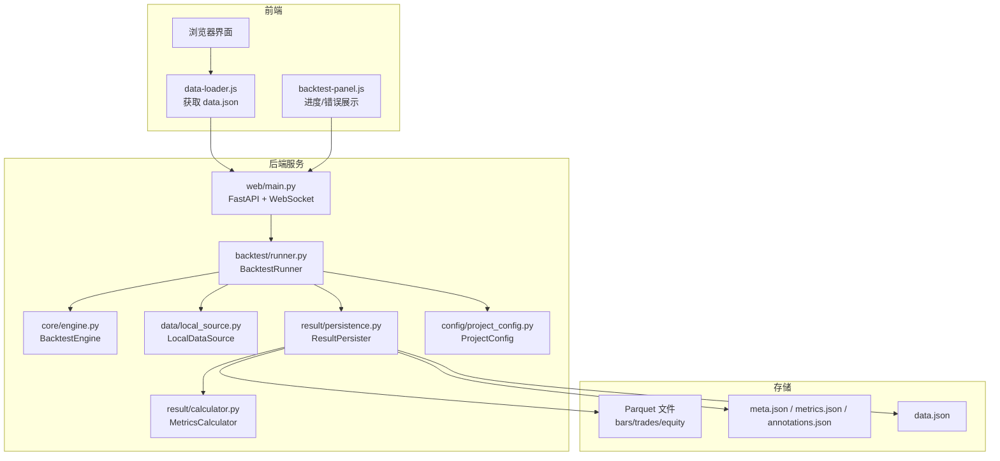
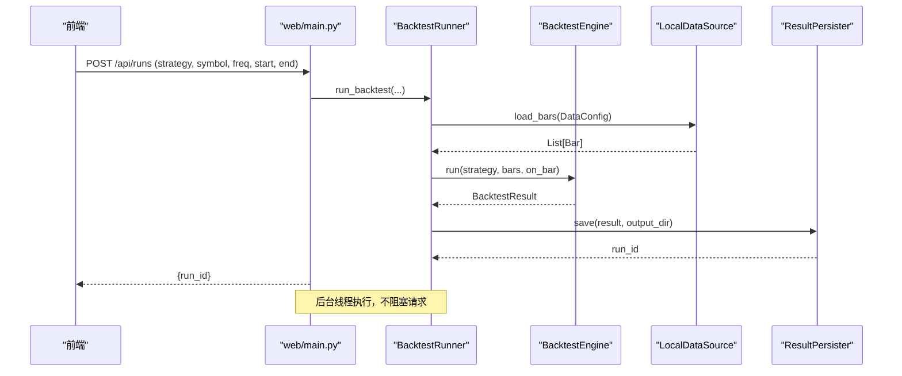
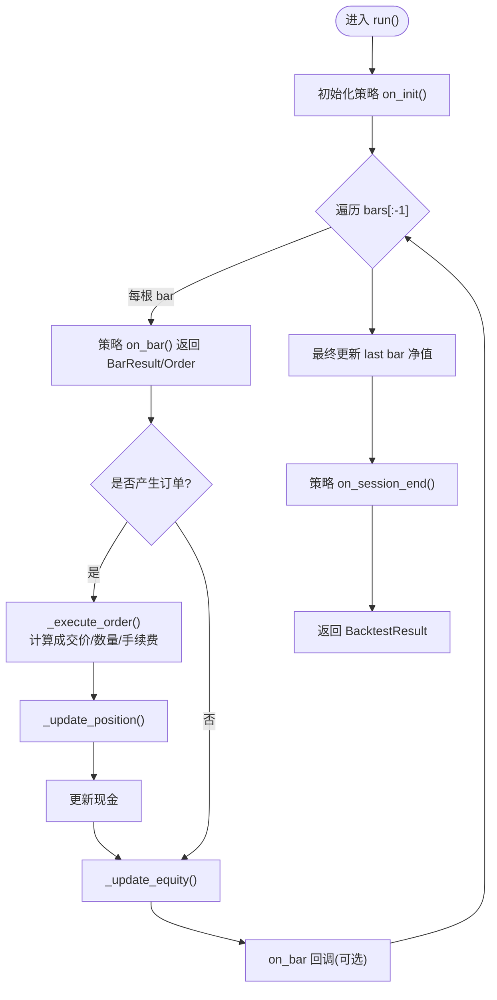
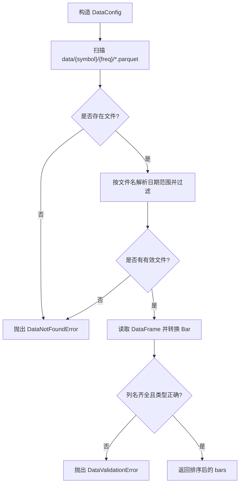
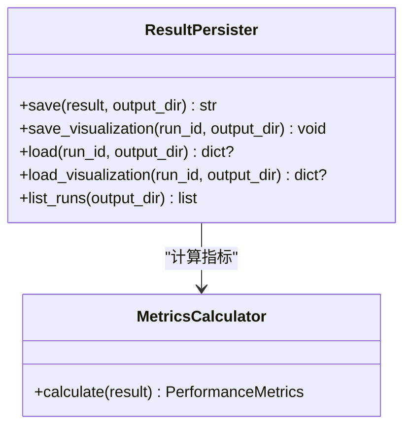
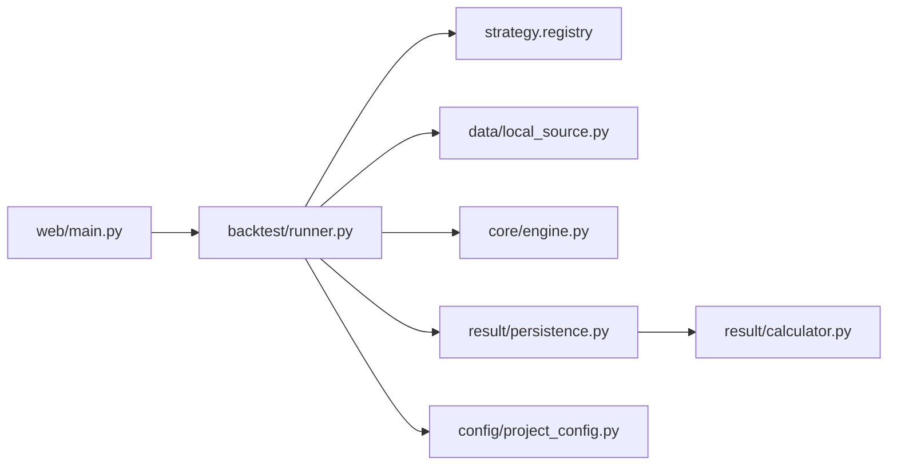

# 故障排查

<cite>
**本文引用的文件**
- [README.md](file://README.md)
- [engine.py](file://src/caisen/core/engine.py)
- [runner.py](file://src/caisen/backtest/runner.py)
- [local_source.py](file://src/caisen/data/local_source.py)
- [config.py](file://src/caisen/data/config.py)
- [exceptions.py](file://src/caisen/data/exceptions.py)
- [persistence.py](file://src/caisen/result/persistence.py)
- [calculator.py](file://src/caisen/result/calculator.py)
- [project_config.py](file://src/caisen/config/project_config.py)
- [main.py（Web）](file://src/caisen/web/main.py)
- [data-loader.js](file://src/caisen/frontend/src/js/data-loader.js)
- [backtest-panel.js](file://src/caisen/frontend/src/js/backtest-panel.js)
- [0002-parquet-data-storage.md](file://docs/adr/0002-parquet-data-storage.md)
</cite>

## 目录
1. [简介](#简介)
2. [项目结构](#项目结构)
3. [核心组件](#核心组件)
4. [架构总览](#架构总览)
5. [详细组件分析](#详细组件分析)
6. [依赖关系分析](#依赖关系分析)
7. [性能注意事项](#性能注意事项)
8. [故障排查指南](#故障排查指南)
9. [结论](#结论)
10. [附录](#附录)

## 简介
本手册面向 Caisen 量化回测系统的运维与开发者，聚焦常见问题的诊断与修复，覆盖以下主题：
- 回测引擎异常、数据加载失败、性能问题定位
- 日志分析方法、关键日志位置、错误模式识别与调试技巧
- 性能问题排查：内存泄漏检测、CPU 热点分析、数据库查询优化
- 网络问题诊断：API 调用失败、WebSocket 连接问题、负载均衡故障
- 数据完整性检查：Parquet 文件验证、数据一致性校验、损坏修复
- 系统资源监控：磁盘空间管理、内存使用优化、进程状态检查
- 恢复流程：数据备份恢复、服务重启、灾难恢复预案

## 项目结构
Caisen 采用分层模块化设计：CLI/Web 入口 → 回测编排器 → 回测引擎 → 数据源 → 结果持久化与指标计算。前端通过 HTTP/WS 与后端交互，读取 runs 目录中的 data.json 进行可视化渲染。



图表来源
- [main.py（Web）:68-304](file://src/caisen/web/main.py#L68-L304)
- [runner.py:26-94](file://src/caisen/backtest/runner.py#L26-L94)
- [engine.py:19-91](file://src/caisen/core/engine.py#L19-L91)
- [local_source.py:15-80](file://src/caisen/data/local_source.py#L15-L80)
- [persistence.py:59-133](file://src/caisen/result/persistence.py#L59-L133)
- [calculator.py:60-99](file://src/caisen/result/calculator.py#L60-L99)
- [project_config.py:24-55](file://src/caisen/config/project_config.py#L24-L55)

章节来源
- [README.md:190-235](file://README.md#L190-L235)
- [0002-parquet-data-storage.md:1-11](file://docs/adr/0002-parquet-data-storage.md#L1-L11)

## 核心组件
- 回测编排器 BacktestRunner：封装“参数解析→策略实例化→数据加载→引擎运行→结果持久化”的完整流程，并支持进度回调。
- 回测引擎 BacktestEngine：驱动策略逐根 K 线执行，处理订单成交、持仓更新、净值曲线生成与标注收集。
- 本地数据源 LocalDataSource：从 Parquet 按日期或区间加载 OHLCV 数据，支持中英文列名映射与范围过滤。
- 结果持久化 ResultPersister：保存 meta/metrics/bars/trades/equity/annotations，并生成前端 data.json。
- 指标计算 MetricsCalculator：统一计算年化收益、最大回撤、夏普比率、胜率等指标。
- 项目配置 ProjectConfig：从 configs/project.yaml 加载全局路径与端口，缺失时静默降级到默认值。

章节来源
- [runner.py:26-94](file://src/caisen/backtest/runner.py#L26-L94)
- [engine.py:19-91](file://src/caisen/core/engine.py#L19-L91)
- [local_source.py:15-80](file://src/caisen/data/local_source.py#L15-L80)
- [persistence.py:59-133](file://src/caisen/result/persistence.py#L59-L133)
- [calculator.py:60-99](file://src/caisen/result/calculator.py#L60-L99)
- [project_config.py:24-55](file://src/caisen/config/project_config.py#L24-L55)

## 架构总览
下图展示了 Web 触发回测的端到端时序，包括后台线程执行、进度推送与结果落盘。



图表来源
- [main.py（Web）:107-132](file://src/caisen/web/main.py#L107-L132)
- [runner.py:26-94](file://src/caisen/backtest/runner.py#L26-L94)
- [local_source.py:39-80](file://src/caisen/data/local_source.py#L39-L80)
- [engine.py:33-91](file://src/caisen/core/engine.py#L33-L91)
- [persistence.py:62-133](file://src/caisen/result/persistence.py#L62-L133)

## 详细组件分析

### 回测引擎异常排查
常见问题
- 策略未注册或模块导入失败：导致无法实例化策略。
- 数据为空：指定品种/频率/时间范围内无可用 K 线。
- 订单执行异常：滑点/手续费/数量计算导致 quantity<=0 被丢弃。
- 净值曲线不一致：final_equity 应与 equity_curve 最后一点一致。

定位步骤
- 确认策略已注册并可导入；查看编排器抛出的明确错误信息。
- 检查 DataConfig 与数据目录结构是否匹配，确认 parquet 文件存在且列名正确。
- 在引擎中观察 _execute_order 与 _calculate_quantity 分支逻辑，核对滑点、手续费与仓位比例设置。
- 对比 final_equity 与 equity_curve[-1]["equity"] 的一致性。



图表来源
- [engine.py:33-91](file://src/caisen/core/engine.py#L33-L91)
- [engine.py:93-210](file://src/caisen/core/engine.py#L93-L210)

章节来源
- [runner.py:70-94](file://src/caisen/backtest/runner.py#L70-L94)
- [engine.py:93-210](file://src/caisen/core/engine.py#L93-L210)
- [test_backtest_engine.py:104-165](file://tests/test_backtest_engine.py#L104-L165)
- [test_equity_final.py:41-70](file://tests/test_equity_final.py#L41-L70)

### 数据加载失败排查
常见问题
- 找不到数据目录或 parquet 文件：DataNotFoundError。
- 日期范围无效或不重叠：InvalidDateRangeError。
- 列名缺失或类型不正确：DataValidationError。
- 频率不支持：ValueError。

定位步骤
- 检查 DataConfig.symbol/freq/start/end/data_dir 是否正确。
- 确认数据目录结构为 data/{symbol}/{freq}/{date}.parquet 或 {start}_{end}.parquet。
- 校验 parquet 列名映射（支持中英文），确保 timestamp/open/high/low/close/volume 存在。
- 若频率不在 SUPPORTED_FREQS，将抛出 ValueError。



图表来源
- [local_source.py:39-80](file://src/caisen/data/local_source.py#L39-L80)
- [local_source.py:82-137](file://src/caisen/data/local_source.py#L82-L137)
- [local_source.py:139-199](file://src/caisen/data/local_source.py#L139-L199)
- [config.py:11-35](file://src/caisen/data/config.py#L11-L35)
- [exceptions.py:9-47](file://src/caisen/data/exceptions.py#L9-L47)

章节来源
- [local_source.py:15-80](file://src/caisen/data/local_source.py#L15-L80)
- [config.py:11-35](file://src/caisen/data/config.py#L11-L35)
- [exceptions.py:9-47](file://src/caisen/data/exceptions.py#L9-L47)

### 结果持久化与可视化数据问题
常见问题
- runs 目录下缺少 meta.json 或 data.json/bars.parquet，导致列表接口过滤掉该 run。
- data.json 生成失败或字段缺失，前端无法渲染。
- metrics.json 与 meta.json 不一致。

定位步骤
- 检查 ResultPersister.save 是否成功写入 meta/metrics/bars/trades/equity/annotations/data.json。
- 使用 list_runs 与 get_run 接口验证元数据与可视化数据可用性。
- 若 data.json 缺失，可调用 save_visualization 重新生成。



图表来源
- [persistence.py:59-133](file://src/caisen/result/persistence.py#L59-L133)
- [calculator.py:60-99](file://src/caisen/result/calculator.py#L60-L99)

章节来源
- [persistence.py:59-133](file://src/caisen/result/persistence.py#L59-L133)
- [calculator.py:60-99](file://src/caisen/result/calculator.py#L60-L99)

### 项目配置与路径问题
常见问题
- project.yaml 不存在或部分字段缺失，导致使用默认值。
- output_dir 或 data_dir 配置错误，导致读写失败。
- api_port 与启动命令不一致，导致访问端口错误。

定位步骤
- 确认 configs/project.yaml 存在且包含 data_dir/output_dir/api_port。
- 当文件缺失时，系统会静默降级到默认值，需检查默认路径是否符合预期。
- 通过 CLI 或 Web 启动参数覆盖输出目录与端口。

章节来源
- [project_config.py:24-55](file://src/caisen/config/project_config.py#L24-L55)
- [test_project_config.py:8-44](file://tests/test_project_config.py#L8-L44)

### Web 服务与 WebSocket 问题
常见问题
- 健康检查 /health 不可用。
- /api/runs 创建任务后无进度推送。
- /ws/runs/{run_id}/progress 超时或连接断开。
- 跨域或静态资源加载失败。

定位步骤
- 先访问 /health 确认服务存活。
- 检查 /api/runs 响应是否返回 run_id，并在 runs 列表中可见。
- 对 WebSocket 端点，关注队列超时与错误消息推送。
- 确认 CORS 允许来源与静态资源路径。

```mermaid
sequenceDiagram
participant FE as "前端"
participant WS as "web/main.py /ws/runs/{run_id}/progress"
participant BR as "BacktestRunner"
participant Q as "queue.Queue"
FE->>WS : 建立连接并 accept()
WS->>BR : run_backtest(..., on_progress)
BR-->>WS : on_progress(processed,total,current_date)
WS->>Q : put({"status" : "running",...})
loop 直到终态
WS->>Q : get(timeout=300)
alt 超时
WS-->>FE : {"status" : "error","message" : "回测超时"}
break
else 收到消息
WS-->>FE : send_json(msg)
end
alt msg.status in ("done","error")
break
end
end
WS-->>FE : close()
```

图表来源
- [main.py（Web）:247-304](file://src/caisen/web/main.py#L247-L304)
- [runner.py:80-94](file://src/caisen/backtest/runner.py#L80-L94)

章节来源
- [main.py（Web）:68-304](file://src/caisen/web/main.py#L68-L304)
- [data-loader.js:179-210](file://src/caisen/frontend/src/js/data-loader.js#L179-L210)
- [backtest-panel.js:303-327](file://src/caisen/frontend/src/js/backtest-panel.js#L303-L327)

## 依赖关系分析
- Web 层依赖 BacktestRunner 与 ResultPersister，并通过 ProjectConfig 注入全局路径与端口。
- BacktestRunner 依赖策略注册表、数据加载器与引擎，负责参数解析与进度回调。
- 数据加载器依赖 DataConfig 与 exceptions，严格校验频率与列名。
- 结果持久化依赖指标计算器，保证指标计算唯一性。



图表来源
- [main.py（Web）:68-304](file://src/caisen/web/main.py#L68-L304)
- [runner.py:26-94](file://src/caisen/backtest/runner.py#L26-L94)
- [local_source.py:15-80](file://src/caisen/data/local_source.py#L15-L80)
- [engine.py:19-91](file://src/caisen/core/engine.py#L19-L91)
- [persistence.py:59-133](file://src/caisen/result/persistence.py#L59-L133)
- [calculator.py:60-99](file://src/caisen/result/calculator.py#L60-L99)
- [project_config.py:24-55](file://src/caisen/config/project_config.py#L24-L55)

章节来源
- [runner.py:26-94](file://src/caisen/backtest/runner.py#L26-L94)
- [persistence.py:59-133](file://src/caisen/result/persistence.py#L59-L133)

## 性能注意事项
- 数据加载：优先使用分区 Parquet 文件，避免全量扫描；合理选择 freq 与时间窗口。
- 引擎循环：减少 on_bar 回调开销，避免在策略中进行重型 IO 或外部网络调用。
- 指标计算：统一由 MetricsCalculator 计算，避免重复计算造成 CPU 浪费。
- 前端渲染：data.json 体积较大时可考虑分页或按需加载。

## 故障排查指南

### 日志分析方法
- 关键日志位置
  - Web 服务：logger.exception 记录后台回测失败的堆栈与上下文。
  - 前端：data-loader.js 与 backtest-panel.js 打印缓存命中、HTTP 错误与进度百分比。
- 错误模式识别
  - 404/422/500：分别对应资源未找到、参数校验失败、服务器内部错误。
  - WebSocket 超时：队列等待超过 300 秒，提示“回测超时”。
- 调试技巧
  - 使用 /health 快速判断服务存活。
  - 通过 /api/runs 与 /api/runs/{run_id} 验证结果是否落盘。
  - 在前端控制台查看 fetch 响应与缓存命中情况。

章节来源
- [main.py（Web）:24-25](file://src/caisen/web/main.py#L24-L25)
- [main.py（Web）:128-129](file://src/caisen/web/main.py#L128-L129)
- [data-loader.js:179-210](file://src/caisen/frontend/src/js/data-loader.js#L179-L210)
- [backtest-panel.js:303-327](file://src/caisen/frontend/src/js/backtest-panel.js#L303-L327)

### 回测引擎异常定位
- 策略未注册：检查注册表与模块路径，确认类名与 __init__ 签名匹配。
- 数据为空：确认 DataConfig 与 parquet 文件命名规则，必要时扩大时间范围。
- 订单未成交：检查滑点、手续费与仓位比例，确保 quantity>0。
- 净值不一致：对比 final_equity 与 equity_curve 最后一点，定位计算差异。

章节来源
- [runner.py:124-143](file://src/caisen/backtest/runner.py#L124-L143)
- [runner.py:77-78](file://src/caisen/backtest/runner.py#L77-L78)
- [engine.py:93-156](file://src/caisen/core/engine.py#L93-L156)
- [test_backtest_engine.py:104-165](file://tests/test_backtest_engine.py#L104-L165)
- [test_equity_final.py:41-70](file://tests/test_equity_final.py#L41-L70)

### 数据加载失败定位
- 目录与文件：确认 data/{symbol}/{freq} 下存在符合命名规则的 parquet 文件。
- 列名映射：确保 timestamp/open/high/low/close/volume 任一别名存在。
- 频率校验：freq 必须在 SUPPORTED_FREQS 内。
- 日期过滤：单文件或区间文件的起止日期需与查询范围重叠。

章节来源
- [local_source.py:82-137](file://src/caisen/data/local_source.py#L82-L137)
- [local_source.py:139-199](file://src/caisen/data/local_source.py#L139-L199)
- [config.py:11-35](file://src/caisen/data/config.py#L11-L35)
- [exceptions.py:9-47](file://src/caisen/data/exceptions.py#L9-L47)

### 性能问题排查
- 内存泄漏检测
  - 关注策略 on_bar 中累积的列表/字典是否及时清理。
  - 避免在回测期间持有大对象引用。
- CPU 热点分析
  - 使用 cProfile 或类似工具定位热点函数（如 _execute_order、_update_position）。
  - 减少不必要的浮点运算与字符串拼接。
- 数据查询优化
  - 使用分区 Parquet 并按日期过滤，避免全表扫描。
  - 控制 bars 规模，必要时分批次回测。

章节来源
- [engine.py:93-210](file://src/caisen/core/engine.py#L93-L210)
- [local_source.py:82-137](file://src/caisen/data/local_source.py#L82-L137)

### 网络问题诊断
- API 调用失败
  - 检查 /api/runs 与 /api/runs/{run_id} 的状态码与响应体。
  - 确认 CORS 配置允许前端域名。
- WebSocket 连接问题
  - 检查 /ws/runs/{run_id}/progress 的连接建立与消息推送。
  - 注意队列超时与错误消息。
- 负载均衡故障
  - 多实例部署时需共享 runs 目录与数据目录，确保所有节点可读写相同路径。
  - 会话保持与心跳检测需配合网关配置。

章节来源
- [main.py（Web）:76-83](file://src/caisen/web/main.py#L76-L83)
- [main.py（Web）:247-304](file://src/caisen/web/main.py#L247-L304)
- [data-loader.js:179-210](file://src/caisen/frontend/src/js/data-loader.js#L179-L210)

### 数据完整性检查
- Parquet 文件验证
  - 使用 pandas.read_parquet 读取 bars/trades/equity，检查列名与数据类型。
  - 校验 timestamp 是否为 datetime 或可转换为 datetime。
- 数据一致性校验
  - 对比 meta.json 中的 bar_count 与实际 bars.parquet 行数。
  - 对比 final_equity 与 equity_curve 最后一点。
- 损坏修复
  - 若 parquet 损坏，重新生成对应日期的数据文件。
  - 若 data.json 缺失，调用 save_visualization 重建。

章节来源
- [persistence.py:135-202](file://src/caisen/result/persistence.py#L135-L202)
- [persistence.py:203-245](file://src/caisen/result/persistence.py#L203-L245)
- [0002-parquet-data-storage.md:1-11](file://docs/adr/0002-parquet-data-storage.md#L1-L11)

### 系统资源监控
- 磁盘空间管理
  - 监控 runs 与 data 目录大小，定期清理旧 run 或归档历史数据。
- 内存使用优化
  - 限制单次回测 bars 规模，避免一次性加载过多数据。
  - 策略中及时释放中间变量。
- 进程状态检查
  - 使用 /health 与健康探针监控服务存活。
  - 检查后台线程是否因异常退出。

章节来源
- [main.py（Web）:224-227](file://src/caisen/web/main.py#L224-L227)

### 恢复流程
- 数据备份恢复
  - 备份 runs 与 data 目录；恢复时确保目录结构与权限一致。
- 服务重启
  - 重启 uvicorn 进程，确认端口未被占用，检查日志无异常。
- 灾难恢复预案
  - 多副本部署 runs 与 data 目录（共享存储），确保任意节点可访问。
  - 制定回滚策略与版本化管理，保留最近 N 次稳定快照。

章节来源
- [persistence.py:59-133](file://src/caisen/result/persistence.py#L59-L133)
- [main.py（Web）:311-319](file://src/caisen/web/main.py#L311-L319)

## 结论
通过系统化地梳理回测引擎、数据加载、结果持久化与 Web 服务的异常模式与定位方法，结合日志分析与性能调优手段，可有效提升 Caisen 系统的稳定性与可维护性。建议在生产环境完善监控告警、数据校验与服务自愈机制，确保回测与可视化体验持续可靠。

## 附录
- 常用命令与路径
  - 列出回测：caisen list-runs
  - 查看结果：caisen show-result <RUN_ID>
  - 启动服务：caisen serve [--port 8000]
  - runs 目录：./runs/{run_id}/
- 参考文档
  - Parquet 数据存储决策：ADR-0002

章节来源
- [README.md:119-185](file://README.md#L119-L185)
- [README.md:187-235](file://README.md#L187-L235)
- [0002-parquet-data-storage.md:1-11](file://docs/adr/0002-parquet-data-storage.md#L1-L11)