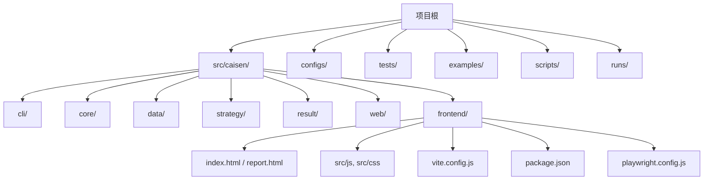
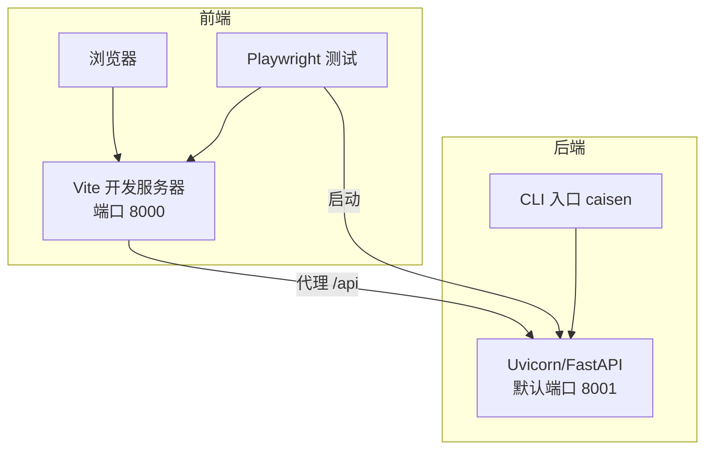
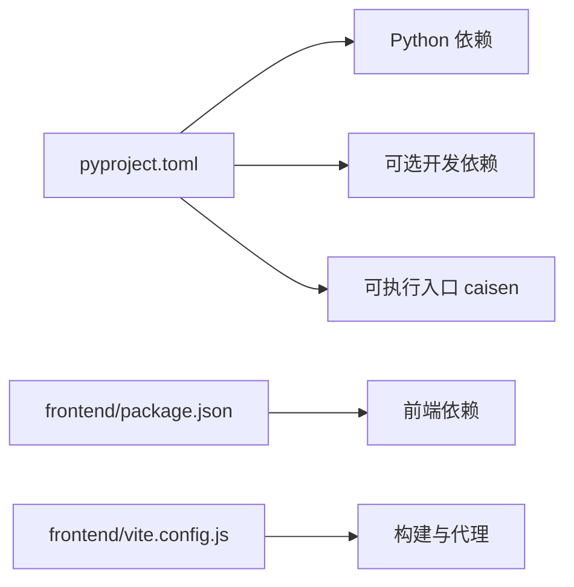

# 环境搭建

<cite>
**本文引用的文件**   
- [README.md](file://README.md)
- [pyproject.toml](file://pyproject.toml)
- [package.json](file://src/caisen/frontend/package.json)
- [vite.config.js](file://src/caisen/frontend/vite.config.js)
- [playwright.config.js](file://src/caisen/frontend/playwright.config.js)
- [project_config.py](file://src/caisen/config/project_config.py)
</cite>

## 目录
1. [简介](#简介)
2. [项目结构](#项目结构)
3. [核心组件](#核心组件)
4. [架构总览](#架构总览)
5. [详细组件分析](#详细组件分析)
6. [依赖分析](#依赖分析)
7. [性能考虑](#性能考虑)
8. [故障排查指南](#故障排查指南)
9. [结论](#结论)
10. [附录](#附录)

## 简介
本指南面向首次接触 Caisen 量化回测系统的开发者，提供从零开始的环境搭建说明。内容覆盖：
- Python 3.10+ 安装与虚拟环境管理（venv、conda）
- 后端依赖安装与可执行命令注册
- 前端开发环境设置（Node.js、npm/yarn、Vite）
- 开发与质量工具集成（pytest、Ruff、Black、mypy）
- 跨平台注意事项（Windows、macOS、Linux）
- 常见问题定位与解决思路

## 项目结构
Caisen 采用“Python 后端 + 前端静态资源”的混合结构：
- 后端通过 pyproject 声明依赖与入口脚本，提供 CLI 与 Web 服务
- 前端位于 src/caisen/frontend，使用 Vite 构建并内嵌到包中，便于分发与预览

图表来源
- [pyproject.toml:1-59](file://pyproject.toml#L1-L59)
- [vite.config.js:1-43](file://src/caisen/frontend/vite.config.js#L1-L43)
- [package.json:1-26](file://src/caisen/frontend/package.json#L1-L26)

章节来源
- [README.md:1-120](file://README.md#L1-L120)
- [pyproject.toml:1-59](file://pyproject.toml#L1-L59)

## 核心组件
- Python 运行时与包管理
  - 要求 Python >= 3.10
  - 通过 pip 安装可编辑模式以启用命令行入口
- 前端构建与预览
  - Node.js 运行环境（版本见下节）
  - Vite 作为开发服务器与打包器
  - Vitest 用于 JS 单元测试，Playwright 用于端到端测试
- 配置加载
  - ProjectConfig 从 configs/project.yaml 读取全局配置（数据目录、输出目录、API 端口），不存在时静默降级为默认值

章节来源
- [README.md:13-40](file://README.md#L13-L40)
- [pyproject.toml:10-22](file://pyproject.toml#L10-L22)
- [package.json:1-26](file://src/caisen/frontend/package.json#L1-L26)
- [vite.config.js:1-43](file://src/caisen/frontend/vite.config.js#L1-L43)
- [project_config.py:1-55](file://src/caisen/config/project_config.py#L1-L55)

## 架构总览
下图展示了本地开发时的主要交互关系：浏览器访问 Vite 开发服务器，代理 API 请求到后端 FastAPI/Uvicorn；E2E 测试启动后端服务并访问前端页面。

图表来源
- [vite.config.js:21-29](file://src/caisen/frontend/vite.config.js#L21-L29)
- [playwright.config.js:24-28](file://src/caisen/frontend/playwright.config.js#L24-L28)
- [pyproject.toml:21-22](file://pyproject.toml#L21-L22)

## 详细组件分析

### Python 环境与依赖安装
- 环境要求
  - Python 3.10+
- 推荐方式
  - 使用 venv 或 conda 创建隔离环境
  - 进入项目根目录后，以可编辑模式安装，以便使用命令行入口
- 验证安装
  - 安装完成后，在终端执行帮助命令进行验证
- PATH 提示
  - Linux/macOS 若找不到命令，需确保 ~/.local/bin 在 PATH 中

章节来源
- [README.md:13-40](file://README.md#L13-L40)
- [pyproject.toml:10-22](file://pyproject.toml#L10-L22)

### 前端开发环境设置
- Node.js 版本
  - 项目未显式锁定 Node.js 版本，建议使用当前长期支持版本（LTS）
- 包管理器
  - npm 或 yarn 均可，推荐使用 npm（随 Node.js 安装）
- 初始化与依赖
  - 进入前端目录 src/caisen/frontend
  - 安装依赖：npm install 或 yarn install
- 常用脚本
  - 开发：npm run dev
  - 构建：npm run build
  - 预览：npm run preview
  - 单测：npm run test
  - UI 单测：npm run test:ui
  - E2E：npm run test:e2e

章节来源
- [package.json:1-26](file://src/caisen/frontend/package.json#L1-L26)

### Vite 构建与代理配置
- 构建产物
  - 输出目录 dist，包含 index.html 与 report.html 两个入口
- 开发服务器
  - 默认监听 8000 端口
  - 将 /api 请求代理至环境变量 VITE_API_PROXY 指定的地址，默认 http://localhost:8001
- 别名与测试
  - 配置了 /js 与 /src 的路径别名
  - 单元测试使用 jsdom 环境，测试文件匹配 tests/js/**/*.test.js

章节来源
- [vite.config.js:1-43](file://src/caisen/frontend/vite.config.js#L1-L43)

### 端到端测试（Playwright）
- 测试目录
  - e2e 目录下的用例
- 并行与重试
  - CI 环境下开启重试与限制并发
- 浏览器项目
  - Chromium 与 Firefox 桌面设备
- 启动后端
  - 自动执行命令启动后端服务，等待健康检查返回后再运行用例

章节来源
- [playwright.config.js:1-30](file://src/caisen/frontend/playwright.config.js#L1-L30)

### 开发与代码质量工具
- pytest
  - 运行所有测试：python -m pytest tests/
  - 指定测试：python -m pytest tests/test_xxx.py -v
  - 覆盖率：python -m pytest tests/ --cov=src/caisen --cov-report=html
- Ruff
  - 作为 lint 工具已纳入可选依赖与配置
  - 规则集包含 pyflakes、pycodestyle、isort、pyupgrade、flake8-bugbear 等
  - 忽略项包括行过长与默认参数函数调用等
- Black 与 mypy
  - README 提供了格式化与类型检查的命令示例

章节来源
- [README.md:368-392](file://README.md#L368-L392)
- [pyproject.toml:24-49](file://pyproject.toml#L24-L49)

### 项目级配置（ProjectConfig）
- 配置文件位置
  - configs/project.yaml
- 字段说明
  - data_dir：数据目录
  - output_dir：回测结果输出目录
  - api_port：后端 API 端口
- 行为约定
  - 当 project.yaml 不存在或部分字段缺失时，静默降级为默认值，不报错

章节来源
- [project_config.py:1-55](file://src/caisen/config/project_config.py#L1-L55)

## 依赖分析
- Python 依赖
  - 核心：pyyaml、pandas、pyarrow、click、fastapi、uvicorn、websockets
  - 可选开发依赖：pytest、pytest-cov、vitest、ruff
- 前端依赖
  - 运行时：echarts
  - 开发时：vite、vitest、@vitest/ui、jsdom、@playwright/test
- 构建与打包
  - hatchling 构建系统，wheel 目标包含前端 dist 目录

图表来源
- [pyproject.toml:11-30](file://pyproject.toml#L11-L30)
- [package.json:15-24](file://src/caisen/frontend/package.json#L15-L24)
- [vite.config.js:11-29](file://src/caisen/frontend/vite.config.js#L11-L29)

章节来源
- [pyproject.toml:1-59](file://pyproject.toml#L1-L59)
- [package.json:1-26](file://src/caisen/frontend/package.json#L1-L26)

## 性能考虑
- 前端构建
  - 生产构建会清空输出目录并生成优化后的静态资源
- 代理与网络
  - 开发时通过 Vite 代理减少跨域问题，避免额外反向代理开销
- 测试
  - E2E 测试在 CI 下限制并发与增加重试，有助于稳定复现问题

[本节为通用建议，无需源码引用]

## 故障排查指南
- 无法找到 caisen 命令
  - 确认已使用可编辑模式安装
  - Linux/macOS 检查 PATH 是否包含 ~/.local/bin
- 前端代理失败
  - 检查 VITE_API_PROXY 环境变量是否正确指向后端地址
  - 确认后端服务已在预期端口启动
- 端口冲突
  - 修改 vite.config.js 中的 server.port 或后端端口配置
- 测试失败
  - 先单独运行 pytest 与 vitest 定位问题
  - E2E 失败时查看 Playwright 生成的 HTML 报告与追踪信息
- 配置未生效
  - 确认 configs/project.yaml 存在且路径正确
  - 部分字段缺失时会使用默认值，注意默认值是否符合预期

章节来源
- [README.md:30-40](file://README.md#L30-L40)
- [vite.config.js:21-29](file://src/caisen/frontend/vite.config.js#L21-L29)
- [playwright.config.js:24-28](file://src/caisen/frontend/playwright.config.js#L24-L28)
- [project_config.py:30-55](file://src/caisen/config/project_config.py#L30-L55)

## 结论
按照本指南完成 Python 与前端环境的准备后，即可快速启动 Caisen 的回测与可视化能力。建议在团队中统一使用 venv 或 conda 管理环境，并通过 pyproject 与 package.json 锁定关键依赖版本，以保证多人协作的一致性。

[本节为总结性内容，无需源码引用]

## 附录

### 跨平台注意事项
- Windows
  - 使用 venv 或 conda 创建环境
  - 可编辑安装后，若 caisen 命令不可用，尝试直接调用安装目录下的脚本或使用完整路径
  - 路径分隔符与大小写敏感差异可能影响相对路径解析，尽量保持小写与一致风格
- macOS
  - 确保 ~/.local/bin 在 PATH 中，以便直接使用 caisen 命令
  - 如需使用 Homebrew 安装 Node.js，请遵循官方文档选择 LTS 版本
- Linux
  - 常见发行版可通过包管理器安装 Python 与 Node.js
  - 若遇到权限问题，优先使用虚拟环境而非 sudo 安装依赖

[本节为通用指导，无需源码引用]