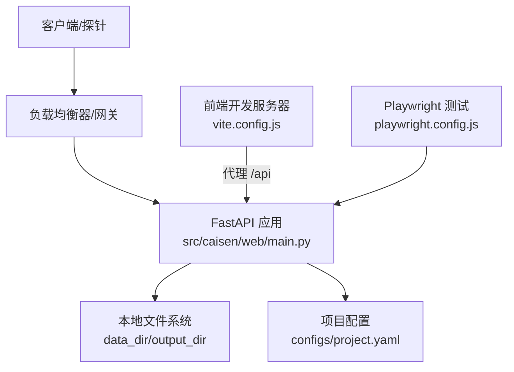
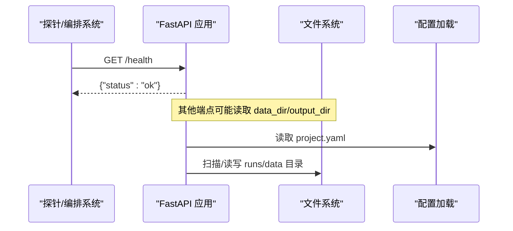
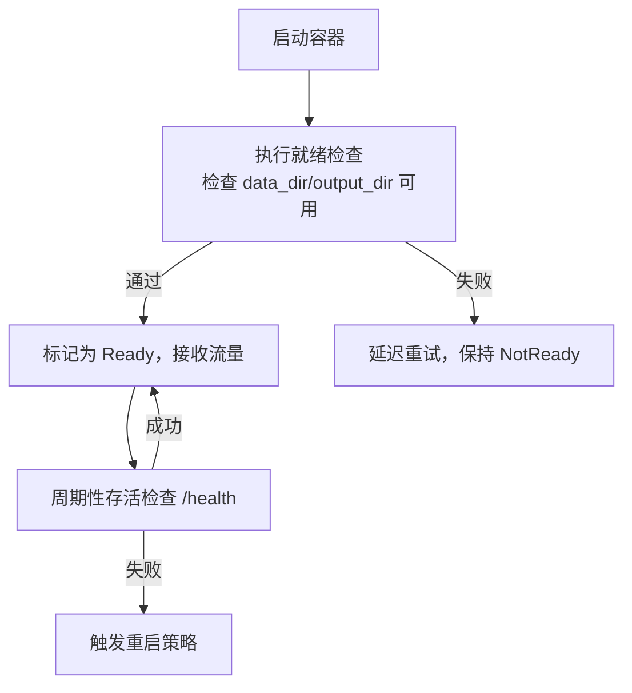
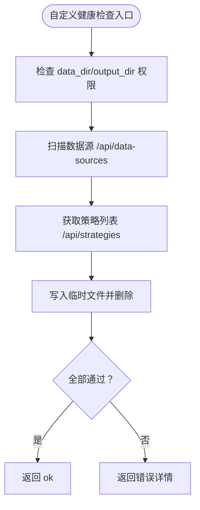
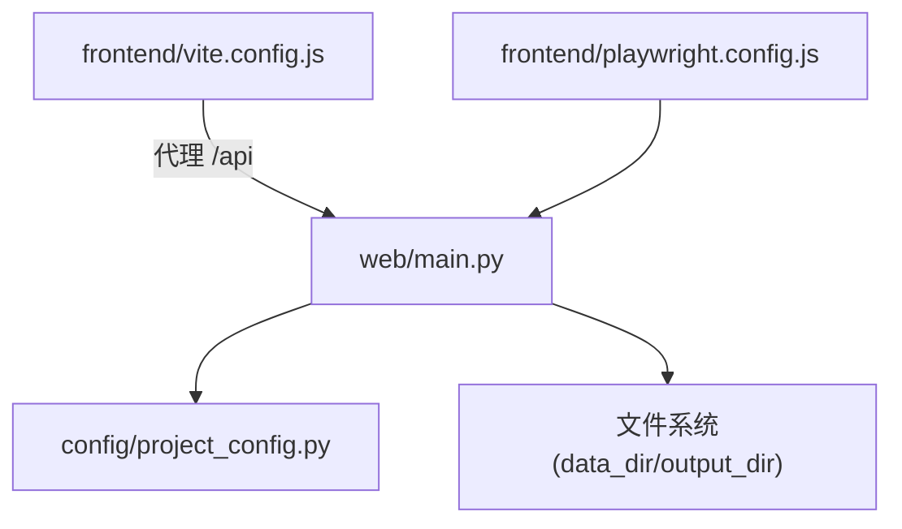

# 健康检查

<cite>
**本文引用的文件**
- [src/caisen/web/main.py](file://src/caisen/web/main.py)
- [tests/test_web_api.py](file://tests/test_web_api.py)
- [src/caisen/config/project_config.py](file://src/caisen/config/project_config.py)
- [configs/project.yaml](file://configs/project.yaml)
- [src/caisen/frontend/vite.config.js](file://src/caisen/frontend/vite.config.js)
- [src/caisen/frontend/playwright.config.js](file://src/caisen/frontend/playwright.config.js)
</cite>

## 目录
1. [简介](#简介)
2. [项目结构](#项目结构)
3. [核心组件](#核心组件)
4. [架构总览](#架构总览)
5. [详细组件分析](#详细组件分析)
6. [依赖分析](#依赖分析)
7. [性能考虑](#性能考虑)
8. [故障排查指南](#故障排查指南)
9. [结论](#结论)
10. [附录](#附录)

## 简介
本文件面向 Caisen 量化回测系统的“健康检查”能力，聚焦以下目标：
- 说明 /health 端点的设计与响应格式
- 阐述服务状态监控（文件系统可用性、依赖服务状态）
- 提供自动恢复机制、故障检测与重启策略建议
- 给出就绪探针与存活探针配置示例（容器化部署）
- 说明如何扩展自定义健康检查规则（业务逻辑相关）
- 解释集群环境下的协调、负载均衡与服务发现集成要点
- 设计告警机制，实现异常状态的实时监控与通知

## 项目结构
Caisen 的 Web 服务基于 FastAPI 构建，健康检查端点位于 Web 应用路由中。前端开发服务器通过代理访问后端 API，Playwright 端到端测试也包含对 /health 的访问。



图表来源
- [src/caisen/web/main.py:68-304](file://src/caisen/web/main.py#L68-L304)
- [src/caisen/frontend/vite.config.js:1-42](file://src/caisen/frontend/vite.config.js#L1-L42)
- [src/caisen/frontend/playwright.config.js:25](file://src/caisen/frontend/playwright.config.js#L25)

章节来源
- [src/caisen/web/main.py:68-304](file://src/caisen/web/main.py#L68-L304)
- [src/caisen/frontend/vite.config.js:1-42](file://src/caisen/frontend/vite.config.js#L1-L42)
- [src/caisen/frontend/playwright.config.js:25](file://src/caisen/frontend/playwright.config.js#L25)

## 核心组件
- 健康检查端点：GET /health，返回统一的状态对象，用于存活探测与简单可用性校验。
- 配置加载：从 configs/project.yaml 读取 data_dir、output_dir、api_port 等全局配置，供服务运行与健康检查使用。
- 前端代理：Vite 开发服务器将 /api 请求转发到后端，便于本地联调。
- 端到端测试：Playwright 配置中包含对 /health 的访问，作为基础连通性验证。

章节来源
- [src/caisen/web/main.py:223-227](file://src/caisen/web/main.py#L223-L227)
- [src/caisen/config/project_config.py:17-56](file://src/caisen/config/project_config.py#L17-L56)
- [configs/project.yaml:1-13](file://configs/project.yaml#L1-L13)
- [src/caisen/frontend/vite.config.js:21-28](file://src/caisen/frontend/vite.config.js#L21-L28)
- [src/caisen/frontend/playwright.config.js:25](file://src/caisen/frontend/playwright.config.js#L25)

## 架构总览
下图展示健康检查在系统内的位置与交互关系：外部探针或编排系统调用 /health，Web 服务快速返回状态；同时，其他业务端点会依赖文件系统与配置模块。



图表来源
- [src/caisen/web/main.py:223-227](file://src/caisen/web/main.py#L223-L227)
- [src/caisen/config/project_config.py:30-56](file://src/caisen/config/project_config.py#L30-L56)

## 详细组件分析

### /health 端点设计与响应格式
- 路径与方法：GET /health
- 响应体：JSON 对象，包含 status 字段，值为 "ok"
- 用途：存活探针（liveness）、简易可用性检查、前端或工具快速判断服务是否可响应

```mermaid
flowchart TD
Start(["收到 GET /health"]) --> ReturnOK["返回 {\"status\": \"ok\"}"]
ReturnOK --> End(["结束"])
```

图表来源
- [src/caisen/web/main.py:223-227](file://src/caisen/web/main.py#L223-L227)

章节来源
- [tests/test_web_api.py:22-25](file://tests/test_web_api.py#L22-L25)
- [src/caisen/web/main.py:223-227](file://src/caisen/web/main.py#L223-L227)

### 服务状态监控（文件系统与依赖）
- 文件系统可用性：数据目录 data_dir 与输出目录 output_dir 由配置加载，其他端点会进行目录扫描与文件读写。健康检查可扩展为对这些目录的可达性与权限校验。
- 依赖服务状态：当前 /health 未直接检查外部依赖（如数据库）。若后续引入数据库或缓存，可在健康检查中增加连接探测与超时控制。

章节来源
- [src/caisen/config/project_config.py:17-56](file://src/caisen/config/project_config.py#L17-L56)
- [configs/project.yaml:1-13](file://configs/project.yaml#L1-L13)
- [src/caisen/web/main.py:96-105](file://src/caisen/web/main.py#L96-L105)

### 自动恢复机制、故障检测与重启策略
- 进程级重启：在容器环境中，可通过容器的重启策略（如 Always）配合存活探针实现自动恢复。当 /health 持续失败时，编排系统判定实例不健康并触发重启。
- 优雅退出：建议在应用层捕获信号，完成正在进行的任务后退出，避免数据不一致。
- 指数退避重试：对外部依赖（数据库、网络服务）的探测应加入退避与熔断，避免雪崩。

[本节为通用指导，不涉及具体代码文件]

### 就绪探针与存活探针配置（容器化）
- 存活探针（liveness）：周期调用 /health，失败则重启容器，保证进程自恢复。
- 就绪探针（readiness）：除 /health 外，可增加资源准备度检查（如数据目录存在、必要文件可读），确保流量仅在服务完全就绪后进入。



[本节为概念性流程，不直接映射到具体源码文件]

### 自定义健康检查规则（业务逻辑相关）
- 文件系统检查：确认 data_dir 与 output_dir 存在且具备读写权限。
- 数据源扫描：调用数据源扫描接口，确保至少一个有效数据源可用。
- 结果持久化：尝试写入临时文件并清理，验证输出目录可写。
- 策略注册表：调用策略列表接口，确保策略扫描正常。



图表来源
- [src/caisen/web/main.py:96-105](file://src/caisen/web/main.py#L96-L105)
- [src/caisen/web/main.py:102-105](file://src/caisen/web/main.py#L102-L105)

章节来源
- [src/caisen/web/main.py:96-105](file://src/caisen/web/main.py#L96-L105)
- [src/caisen/web/main.py:102-105](file://src/caisen/web/main.py#L102-L105)

### 集群环境下的健康检查协调、负载均衡与服务发现
- 负载均衡：在网关或负载均衡层聚合多个实例的 /health 结果，仅将流量分发到健康的实例。
- 服务发现：结合服务注册中心，实例启动成功后注册自身，健康检查失败时注销，避免被拉取到流量。
- 分片与幂等：对于需要读写的健康检查操作（如写入临时文件），需确保幂等与隔离，避免跨实例冲突。

[本节为概念性内容，不直接映射到具体源码文件]

### 健康检查告警机制（实时监控与通知）
- 指标采集：记录 /health 的成功率、响应时间、失败次数等指标。
- 阈值与窗口：设置连续失败次数与时间窗口，降低误报。
- 通知渠道：对接邮件、IM、短信或工单系统，及时通知运维与研发。
- 根因定位：结合日志与链路追踪，快速定位文件系统、依赖服务或策略扫描问题。

[本节为通用指导，不涉及具体代码文件]

## 依赖分析
- Web 服务依赖：
  - 配置模块：ProjectConfig 负责加载 configs/project.yaml，提供 data_dir、output_dir、api_port。
  - 文件系统：数据目录与输出目录的读写与扫描。
  - 前端代理：Vite 开发服务器将 /api 请求转发到后端，便于本地联调。
  - 端到端测试：Playwright 配置中包含对 /health 的访问。



图表来源
- [src/caisen/web/main.py:68-304](file://src/caisen/web/main.py#L68-L304)
- [src/caisen/config/project_config.py:17-56](file://src/caisen/config/project_config.py#L17-L56)
- [src/caisen/frontend/vite.config.js:21-28](file://src/caisen/frontend/vite.config.js#L21-L28)
- [src/caisen/frontend/playwright.config.js:25](file://src/caisen/frontend/playwright.config.js#L25)

章节来源
- [src/caisen/web/main.py:68-304](file://src/caisen/web/main.py#L68-L304)
- [src/caisen/config/project_config.py:17-56](file://src/caisen/config/project_config.py#L17-L56)
- [src/caisen/frontend/vite.config.js:21-28](file://src/caisen/frontend/vite.config.js#L21-L28)
- [src/caisen/frontend/playwright.config.js:25](file://src/caisen/frontend/playwright.config.js#L25)

## 性能考虑
- /health 应保持轻量，避免阻塞 I/O 与复杂计算。
- 自定义健康检查中的 I/O 操作应加超时与限流，防止拖慢探针轮询。
- 在高频探针场景下，合并多项检查为一次批处理，减少上下文切换与锁竞争。

[本节为通用指导，不涉及具体代码文件]

## 故障排查指南
- 常见症状：
  - /health 返回非 200 或响应体不符合预期
  - 数据目录不可达或无权限
  - 策略扫描失败导致 /api/strategies 异常
- 排查步骤：
  - 确认 configs/project.yaml 中 data_dir、output_dir、api_port 配置正确
  - 检查文件系统权限与磁盘空间
  - 查看 Web 服务日志，定位异常堆栈
  - 使用 /api/data-sources 与 /api/strategies 验证依赖功能

章节来源
- [src/caisen/config/project_config.py:17-56](file://src/caisen/config/project_config.py#L17-L56)
- [configs/project.yaml:1-13](file://configs/project.yaml#L1-L13)
- [src/caisen/web/main.py:96-105](file://src/caisen/web/main.py#L96-L105)
- [src/caisen/web/main.py:102-105](file://src/caisen/web/main.py#L102-L105)

## 结论
Caisen 的健康检查以 /health 为核心，提供轻量、稳定的存活探测能力。结合配置文件与文件系统，可进一步扩展为覆盖数据源、策略注册表与输出目录就绪性的综合健康检查。在容器化与集群环境中，配合就绪/存活探针、负载均衡与服务发现，可实现高可用的服务治理与自动化恢复。

[本节为总结性内容，不涉及具体代码文件]

## 附录
- 健康检查最佳实践清单：
  - 明确存活与就绪探针的职责边界
  - 为所有外部依赖检查设置超时与重试
  - 记录健康检查指标并接入告警
  - 定期演练故障注入与恢复流程

[本节为通用指导，不涉及具体代码文件]