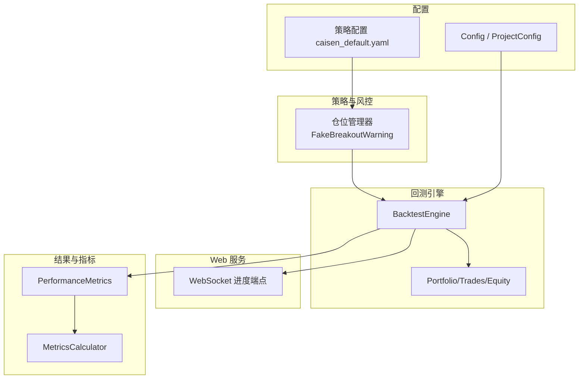
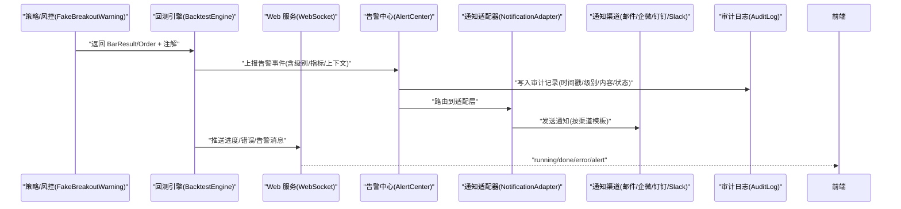
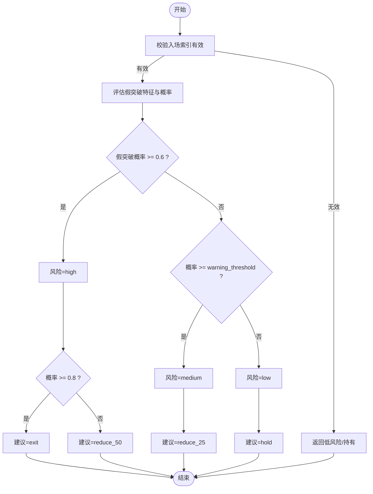
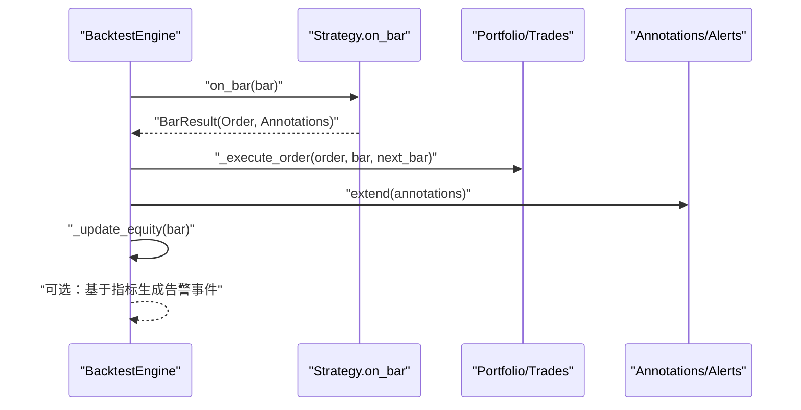
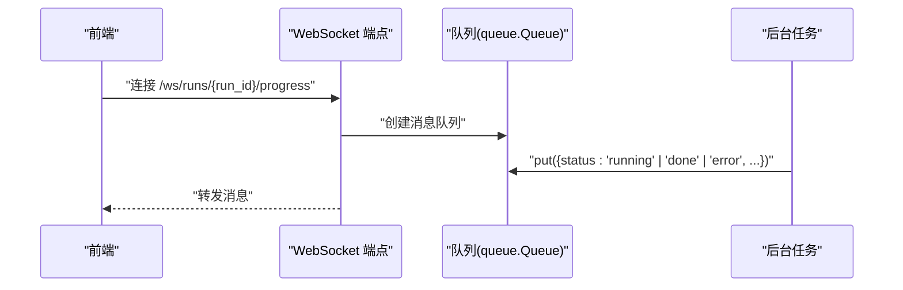
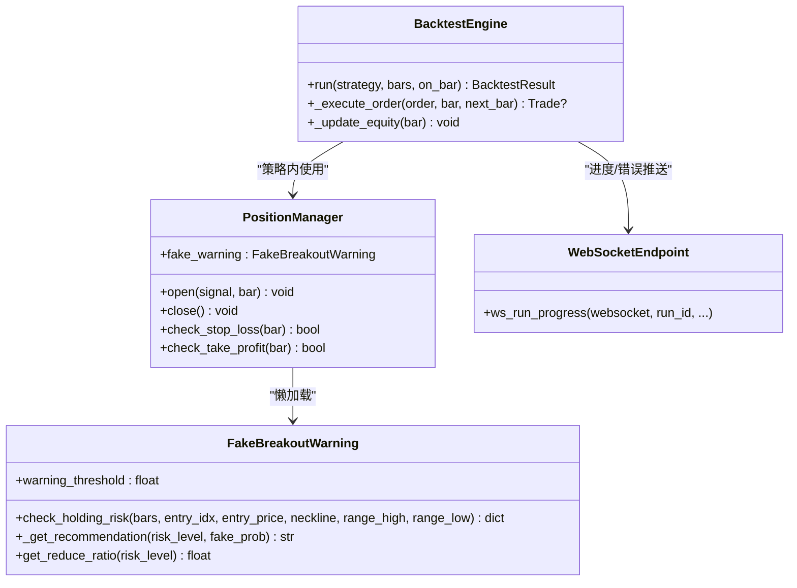

# 告警与通知

<cite>
**本文引用的文件**   
- [position_manager.py](file://src/caisen/strategy/algorithm/caisen_components/position_manager.py)
- [engine.py](file://src/caisen/core/engine.py)
- [config.py](file://src/caisen/core/config.py)
- [project_config.py](file://src/caisen/config/project_config.py)
- [project.yaml](file://configs/project.yaml)
- [caisen_default.yaml](file://configs/strategies/caisen_default.yaml)
- [main.py](file://src/caisen/web/main.py)
- [metrics.py](file://src/caisen/result/metrics.py)
- [calculator.py](file://src/caisen/result/calculator.py)
- [test_fake_breakout_enhanced.py](file://tests/test_fake_breakout_enhanced.py)
</cite>

## 目录
1. [简介](#简介)
2. [项目结构](#项目结构)
3. [核心组件](#核心组件)
4. [架构总览](#架构总览)
5. [详细组件分析](#详细组件分析)
6. [依赖关系分析](#依赖关系分析)
7. [性能与资源限制](#性能与资源限制)
8. [故障排查指南](#故障排查指南)
9. [结论](#结论)
10. [附录：配置项速查](#附录配置项速查)

## 简介
本文件面向 Caisen 量化回测系统的“告警与通知”能力，聚焦以下目标：
- 定义并落地可配置的告警规则（性能阈值、错误率监控、资源使用限制）
- 集成多种通知渠道（邮件、企业微信、钉钉、Slack），并提供可扩展的接入方式
- 建立告警分级机制（紧急、重要、一般）与优先级管理
- 提供告警抑制与去重策略，避免告警风暴与重复通知
- 实现告警历史记录与审计追踪，覆盖完整生命周期
- 支持自定义告警规则开发，便于业务特定指标的监控告警
- 设计告警升级机制，未处理告警自动升级与 escalation 策略

说明：当前仓库已包含“假突破预警”等风控告警逻辑与进度推送通道。本文在此基础上给出完整的告警与通知体系设计与落地方案，确保与现有代码无缝衔接。

## 项目结构
围绕告警与通知，相关代码主要分布在以下位置：
- 策略层风控告警：持仓期间的假突破预警与减仓建议
- 引擎层事件与指标：回测执行过程中的订单、交易、净值曲线与注解
- Web 层进度推送：WebSocket 实时推送运行状态与错误消息
- 配置层：全局与策略级参数，支撑阈值与开关控制
- 结果与指标：绩效指标容器与计算入口，用于性能告警

图表来源
- [position_manager.py:172-285](file://src/caisen/strategy/algorithm/caisen_components/position_manager.py#L172-L285)
- [engine.py:19-91](file://src/caisen/core/engine.py#L19-L91)
- [main.py:247-271](file://src/caisen/web/main.py#L247-L271)
- [config.py:9-58](file://src/caisen/core/config.py#L9-L58)
- [project_config.py:24-43](file://src/caisen/config/project_config.py#L24-L43)
- [caisen_default.yaml:1-50](file://configs/strategies/caisen_default.yaml#L1-L50)
- [metrics.py:1-10](file://src/caisen/result/metrics.py#L1-10)

章节来源
- [position_manager.py:172-285](file://src/caisen/strategy/algorithm/caisen_components/position_manager.py#L172-L285)
- [engine.py:19-91](file://src/caisen/core/engine.py#L19-L91)
- [main.py:247-271](file://src/caisen/web/main.py#L247-L271)
- [config.py:9-58](file://src/caisen/core/config.py#L9-L58)
- [project_config.py:24-43](file://src/caisen/config/project_config.py#L24-L43)
- [caisen_default.yaml:1-50](file://configs/strategies/caisen_default.yaml#L1-L50)
- [metrics.py:1-10](file://src/caisen/result/metrics.py#L1-10)

## 核心组件
- 假突破预警器（FakeBreakoutWarning）
  - 职责：在入场后对 K 线序列评估假突破特征，输出风险等级、触发特征与建议操作
  - 关键方法：check_holding_risk、_get_recommendation、get_reduce_ratio
  - 阈值：warning_threshold 控制“中等风险”边界；固定阈值 0.6 区分“高风险”
- 仓位管理器（PositionManager）
  - 职责：开平仓、止损止盈、回调注册、懒加载假突破预警器
  - 与预警器关系：通过 fake_warning 属性按需初始化
- 回测引擎（BacktestEngine）
  - 职责：驱动策略 on_bar、执行订单、更新净值、收集注解与交易
  - 扩展点：on_bar 回调可用于注入告警事件
- Web 进度推送（WebSocket）
  - 职责：向客户端推送 running/done/error 三类消息
  - 扩展点：可在 on_progress 中追加告警消息类型
- 配置系统
  - 全局配置：ProjectConfig 从 configs/project.yaml 加载
  - 策略配置：caisen_default.yaml 中的风控与形态参数
  - 回测配置：BacktestConfig 基础费用、滑点等

章节来源
- [position_manager.py:40-170](file://src/caisen/strategy/algorithm/caisen_components/position_manager.py#L40-L170)
- [position_manager.py:172-285](file://src/caisen/strategy/algorithm/caisen_components/position_manager.py#L172-L285)
- [engine.py:33-91](file://src/caisen/core/engine.py#L33-L91)
- [main.py:247-271](file://src/caisen/web/main.py#L247-L271)
- [project_config.py:24-43](file://src/caisen/config/project_config.py#L24-L43)
- [project.yaml:1-13](file://configs/project.yaml#L1-L13)
- [caisen_default.yaml:1-50](file://configs/strategies/caisen_default.yaml#L1-L50)
- [config.py:9-58](file://src/caisen/core/config.py#L9-L58)

## 架构总览
下图展示“告警与通知”在系统中的整体交互：策略风控产生告警，引擎统一汇聚，Web 推送至前端，同时持久化到审计日志，并通过通知适配器发送到多渠道。

图表来源
- [position_manager.py:172-285](file://src/caisen/strategy/algorithm/caisen_components/position_manager.py#L172-L285)
- [engine.py:33-91](file://src/caisen/core/engine.py#L33-L91)
- [main.py:247-271](file://src/caisen/web/main.py#L247-L271)

## 详细组件分析

### 假突破预警与减仓建议
- 输入：入场索引、入场价、颈线与区间上下沿、K 线序列
- 处理：基于特征评估得到假突破概率与触发特征集合
- 输出：风险等级（low/medium/high）、建议操作（hold/reduce_25/reduce_50/exit）、减仓比例映射
- 阈值：
  - warning_threshold：决定 medium 与 low 的分界
  - 固定阈值 0.6：决定 high 与 medium 的分界
  - 高概率 0.8：在 high 下进一步决定是否 exit

图表来源
- [position_manager.py:172-285](file://src/caisen/strategy/algorithm/caisen_components/position_manager.py#L172-L285)

章节来源
- [position_manager.py:172-285](file://src/caisen/strategy/algorithm/caisen_components/position_manager.py#L172-L285)
- [test_fake_breakout_enhanced.py:398-468](file://tests/test_fake_breakout_enhanced.py#L398-L468)

### 回测引擎中的告警注入点
- 每根 bar 调用策略 on_bar，返回 BarResult 或兼容旧版 Order/None
- 若为 BarResult，则收集 annotations 并可在此处附加告警注解
- 执行订单后生成 Trade，可结合交易失败/滑点异常等条件触发告警
- 净值更新后可根据回撤、收益等指标触发性能告警

图表来源
- [engine.py:33-91](file://src/caisen/core/engine.py#L33-L91)
- [engine.py:93-128](file://src/caisen/core/engine.py#L93-L128)
- [engine.py:202-210](file://src/caisen/core/engine.py#L202-L210)

章节来源
- [engine.py:33-91](file://src/caisen/core/engine.py#L33-L91)
- [engine.py:93-128](file://src/caisen/core/engine.py#L93-L128)
- [engine.py:202-210](file://src/caisen/core/engine.py#L202-L210)

### Web 进度与错误推送
- WebSocket 端点接收 run_id 与查询参数，后台线程执行回测
- 协议约定：
  - running：包含 processed、total、current_date
  - done：包含 run_id
  - error：包含 message
- 扩展建议：新增 alert 类型消息，携带告警级别、指标摘要与链接

图表来源
- [main.py:247-271](file://src/caisen/web/main.py#L247-L271)

章节来源
- [main.py:247-271](file://src/caisen/web/main.py#L247-L271)

### 配置与阈值管理
- 全局配置（configs/project.yaml）
  - data_dir、output_dir、api_port
- 策略配置（configs/strategies/caisen_default.yaml）
  - 风控参数：stop_loss_factor、min_profit_pct、trailing_stop_pct、trailing_stop_enabled
  - 形态权重与开关
- 回测配置（core/config.py）
  - BacktestConfig：initial_capital、commission_rate、slippage
- 建议新增
  - AlertConfig：阈值、渠道、抑制与升级策略
  - NotificationConfig：各渠道凭据与模板

章节来源
- [project.yaml:1-13](file://configs/project.yaml#L1-L13)
- [caisen_default.yaml:1-50](file://configs/strategies/caisen_default.yaml#L1-L50)
- [config.py:9-58](file://src/caisen/core/config.py#L9-L58)
- [project_config.py:24-43](file://src/caisen/config/project_config.py#L24-L43)

## 依赖关系分析
- FakeBreakoutWarning 依赖 PatternSignal 与 Bar 数据，由 PositionManager 懒加载
- BacktestEngine 依赖 Strategy、Portfolio、Trade、Annotation 等核心对象
- Web 服务通过 uvicorn 启动，暴露 WebSocket 端点
- 指标模块提供 PerformanceMetrics 与 MetricsCalculator 的导出入口

图表来源
- [position_manager.py:24-170](file://src/caisen/strategy/algorithm/caisen_components/position_manager.py#L24-L170)
- [position_manager.py:172-285](file://src/caisen/strategy/algorithm/caisen_components/position_manager.py#L172-L285)
- [engine.py:19-91](file://src/caisen/core/engine.py#L19-L91)
- [main.py:247-271](file://src/caisen/web/main.py#L247-L271)

章节来源
- [position_manager.py:24-170](file://src/caisen/strategy/algorithm/caisen_components/position_manager.py#L24-L170)
- [position_manager.py:172-285](file://src/caisen/strategy/algorithm/caisen_components/position_manager.py#L172-L285)
- [engine.py:19-91](file://src/caisen/core/engine.py#L19-L91)
- [main.py:247-271](file://src/caisen/web/main.py#L247-L271)

## 性能与资源限制
- 性能阈值告警
  - 最大回撤超过阈值：例如 > 15% 触发重要告警，> 25% 触发紧急告警
  - 夏普比率低于阈值：例如 < 0.5 触发重要告警
  - 胜率过低：例如 < 40% 且交易数足够时触发重要告警
- 错误率监控
  - 订单执行失败率：连续 N 次失败或总体失败率超阈触发重要告警
  - 数据源异常：DataNotFoundError/DataValidationError 等异常计数超阈触发重要告警
- 资源使用限制
  - 内存峰值：超过设定阈值触发重要告警
  - CPU 占用：持续高于阈值触发重要告警
  - I/O 延迟：数据读取耗时超过阈值触发重要告警
- 指标计算入口
  - 使用 PerformanceMetrics 与 MetricsCalculator 进行指标汇总与阈值判断

章节来源
- [metrics.py:1-10](file://src/caisen/result/metrics.py#L1-10)
- [calculator.py:1-200](file://src/caisen/result/calculator.py#L1-L200)

## 故障排查指南
- 常见问题定位
  - 数据缺失：检查 DataNotFoundError 与数据路径配置
  - 参数不合法：检查策略配置文件与默认值覆盖
  - WebSocket 无消息：确认 on_progress 回调是否被正确注册与调用
- 调试建议
  - 在 BacktestEngine.run 的 on_bar 回调中打印关键指标与注解
  - 将告警事件写入 runs 目录下的审计日志，便于回溯
  - 针对假突破预警，验证输入参数（entry_idx、neckline、range_high/low）的有效性

章节来源
- [engine.py:33-91](file://src/caisen/core/engine.py#L33-L91)
- [main.py:247-271](file://src/caisen/web/main.py#L247-L271)
- [project_config.py:24-43](file://src/caisen/config/project_config.py#L24-L43)

## 结论
本文在现有“假突破预警”和“WebSocket 进度推送”的基础上，提出了完整的告警与通知体系：包括告警规则配置、多级告警分类、抑制与去重、审计追踪、多渠道通知、以及告警升级策略。该体系可与现有回测引擎与策略模块无缝集成，既满足风控需求，又具备可扩展性与可观测性。

## 附录：配置项速查
- 全局配置（configs/project.yaml）
  - data_dir：本地行情数据根目录
  - output_dir：回测结果输出目录
  - api_port：Web 服务端口
- 策略配置（configs/strategies/caisen_default.yaml）
  - stop_loss_factor：止损系数
  - min_profit_pct：最小盈利目标
  - trailing_stop_pct：移动止损回撤百分比
  - trailing_stop_enabled：是否启用移动止损
  - patterns/pattern_weights：形态开关与权重
- 回测配置（core/config.py）
  - initial_capital：初始资金
  - commission_rate：手续费率
  - slippage：滑点
- 建议新增配置（AlertConfig / NotificationConfig）
  - thresholds：性能与错误率阈值
  - channels：邮件/企微/钉钉/Slack 凭据与模板
  - suppression：抑制窗口与去重键
  - escalation：升级时间与升级目标

章节来源
- [project.yaml:1-13](file://configs/project.yaml#L1-L13)
- [caisen_default.yaml:1-50](file://configs/strategies/caisen_default.yaml#L1-L50)
- [config.py:9-58](file://src/caisen/core/config.py#L9-L58)