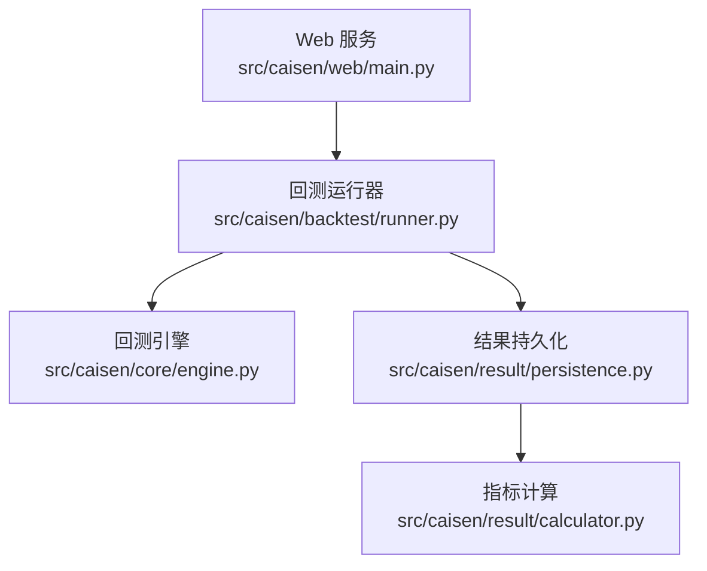
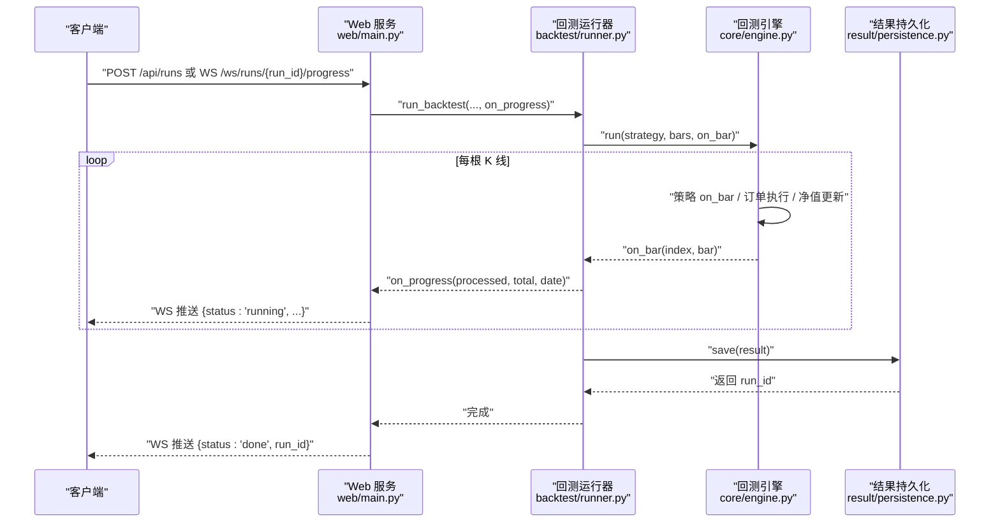
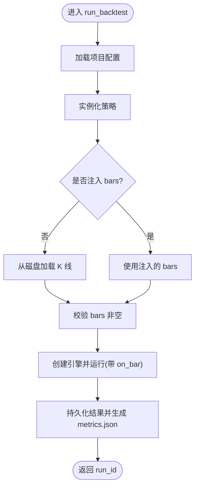
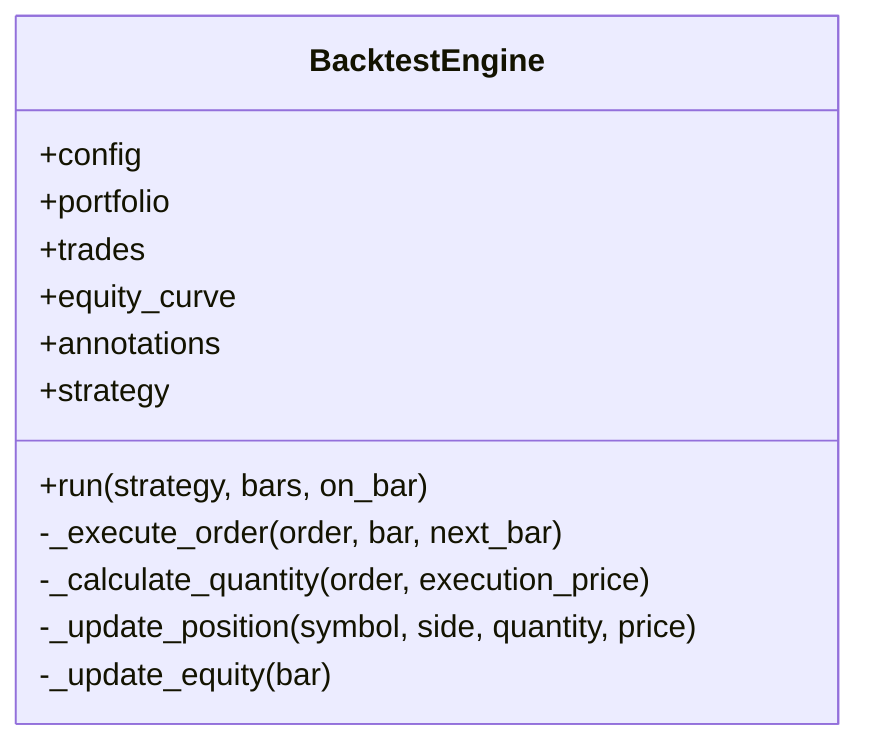
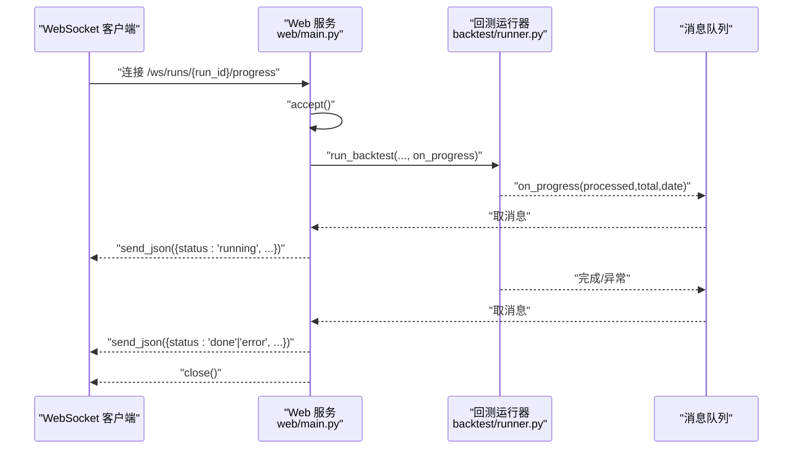
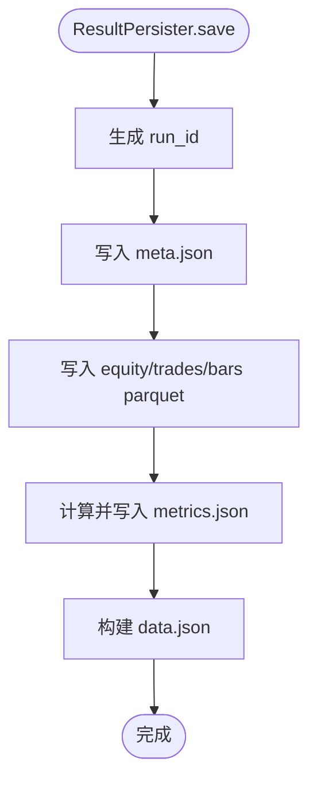
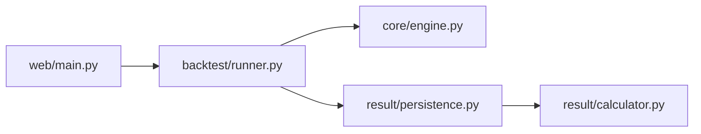

# 性能监控

<cite>
**本文引用的文件**   
- [src/caisen/backtest/runner.py](file://src/caisen/backtest/runner.py)
- [src/caisen/core/engine.py](file://src/caisen/core/engine.py)
- [src/caisen/web/main.py](file://src/caisen/web/main.py)
- [src/caisen/result/persistence.py](file://src/caisen/result/persistence.py)
- [src/caisen/result/calculator.py](file://src/caisen/result/calculator.py)
- [tests/test_backtest_runner.py](file://tests/test_backtest_runner.py)
</cite>

## 目录
1. [简介](#简介)
2. [项目结构](#项目结构)
3. [核心组件](#核心组件)
4. [架构总览](#架构总览)
5. [详细组件分析](#详细组件分析)
6. [依赖关系分析](#依赖关系分析)
7. [性能考量与优化](#性能考量与优化)
8. [故障排查指南](#故障排查指南)
9. [结论](#结论)
10. [附录](#附录)

## 简介
本文件面向 Caisen 量化回测系统的性能监控，围绕以下目标展开：
- 关键性能指标收集：回测执行时间、内存使用量、CPU 利用率、磁盘 I/O 等
- WebSocket 进度推送机制的实现原理与优化策略
- 回测引擎的性能监控点：数据处理速度、策略执行效率、订单处理延迟
- 性能基准测试方法：不同数据规模下的表现与瓶颈定位
- 内存泄漏检测与监控方案：长时间运行的稳定性保障
- 并发处理能力监控与多线程回测调优建议

## 项目结构
与性能监控直接相关的代码主要分布在以下模块：
- 回测运行器：封装完整回测流程，提供进度回调入口
- 回测引擎：逐根 K 线驱动策略执行、订单执行与净值更新
- Web 服务：提供 HTTP 接口与 WebSocket 实时进度推送
- 结果持久化：保存元数据、指标、K 线与可视化数据
- 指标计算：绩效指标的计算逻辑（为后续扩展系统级指标预留位置）

图表来源
- [src/caisen/web/main.py:107-132](file://src/caisen/web/main.py#L107-L132)
- [src/caisen/backtest/runner.py:26-94](file://src/caisen/backtest/runner.py#L26-L94)
- [src/caisen/core/engine.py:33-91](file://src/caisen/core/engine.py#L33-L91)
- [src/caisen/result/persistence.py:62-133](file://src/caisen/result/persistence.py#L62-L133)
- [src/caisen/result/calculator.py:34-79](file://src/caisen/result/calculator.py#L34-L79)

章节来源
- [src/caisen/backtest/runner.py:26-94](file://src/caisen/backtest/runner.py#L26-L94)
- [src/caisen/core/engine.py:33-91](file://src/caisen/core/engine.py#L33-L91)
- [src/caisen/web/main.py:107-132](file://src/caisen/web/main.py#L107-L132)
- [src/caisen/result/persistence.py:62-133](file://src/caisen/result/persistence.py#L62-L133)
- [src/caisen/result/calculator.py:34-79](file://src/caisen/result/calculator.py#L34-L79)

## 核心组件
- 回测运行器：负责参数解析、策略实例化、数据加载、引擎运行、进度回调聚合与结果持久化。其内部对进度回调进行节流（每 100 根 K 线触发一次），以降低前端压力。
- 回测引擎：主循环驱动策略 on_bar 决策、订单执行、持仓与现金更新、净值曲线记录，并在每根 K 线处理后调用进度回调。
- Web 服务：提供 REST API 与 WebSocket 端点；WebSocket 在后台线程执行回测并通过队列将进度消息推送到客户端。
- 结果持久化：保存 meta、equity、trades、annotations、bars、metrics 等文件，并生成 data.json 供前端可视化。
- 指标计算：当前聚焦于交易绩效指标；可作为扩展系统级指标的挂载点。

章节来源
- [src/caisen/backtest/runner.py:26-94](file://src/caisen/backtest/runner.py#L26-L94)
- [src/caisen/core/engine.py:33-91](file://src/caisen/core/engine.py#L33-L91)
- [src/caisen/web/main.py:247-302](file://src/caisen/web/main.py#L247-L302)
- [src/caisen/result/persistence.py:62-133](file://src/caisen/result/persistence.py#L62-L133)
- [src/caisen/result/calculator.py:34-79](file://src/caisen/result/calculator.py#L34-L79)

## 架构总览
下图展示了从 Web 请求到回测执行、进度推送与结果落盘的端到端流程。

图表来源
- [src/caisen/web/main.py:107-132](file://src/caisen/web/main.py#L107-L132)
- [src/caisen/web/main.py:247-302](file://src/caisen/web/main.py#L247-L302)
- [src/caisen/backtest/runner.py:26-94](file://src/caisen/backtest/runner.py#L26-L94)
- [src/caisen/core/engine.py:33-91](file://src/caisen/core/engine.py#L33-L91)
- [src/caisen/result/persistence.py:62-133](file://src/caisen/result/persistence.py#L62-L133)

## 详细组件分析

### 回测运行器（BacktestRunner）
- 职责：统一编排“策略实例化 → 数据加载 → 引擎运行 → 结果持久化”，并提供 on_progress 回调聚合。
- 进度节流：内部计数器每 100 根 K 线触发一次 on_progress，减少网络与 UI 刷新开销。
- 错误边界：当数据为空或策略未注册时抛出明确异常，便于上层捕获与上报。

图表来源
- [src/caisen/backtest/runner.py:26-94](file://src/caisen/backtest/runner.py#L26-L94)
- [src/caisen/backtest/runner.py:146-163](file://src/caisen/backtest/runner.py#L146-L163)

章节来源
- [src/caisen/backtest/runner.py:26-94](file://src/caisen/backtest/runner.py#L26-L94)
- [src/caisen/backtest/runner.py:146-163](file://src/caisen/backtest/runner.py#L146-L163)
- [tests/test_backtest_runner.py:51-76](file://tests/test_backtest_runner.py#L51-L76)

### 回测引擎（BacktestEngine）
- 主循环：遍历 bars[:-1]，依次执行策略 on_bar、订单执行、净值更新，并在每根 K 线后调用 on_bar 回调。
- 订单执行：根据滑点与手续费计算成交价与数量，更新持仓与现金，产出 Trade。
- 净值更新：按收盘价计算组合权益，追加 equity_curve 记录。

图表来源
- [src/caisen/core/engine.py:19-91](file://src/caisen/core/engine.py#L19-L91)
- [src/caisen/core/engine.py:93-210](file://src/caisen/core/engine.py#L93-L210)

章节来源
- [src/caisen/core/engine.py:33-91](file://src/caisen/core/engine.py#L33-L91)
- [src/caisen/core/engine.py:93-210](file://src/caisen/core/engine.py#L93-L210)

### Web 服务与 WebSocket 进度推送
- REST 接口：/api/runs 异步启动回测，立即返回占位 run_id；/api/runs 列表过滤有效结果并附带 metrics。
- WebSocket 端点：/ws/runs/{run_id}/progress 连接后在后台线程执行回测，通过队列将进度消息推送给客户端，支持超时保护。
- 协议约定：{status:"running", processed, total, current_date} 每 100 根推送一次；{status:"done", run_id} 或 {status:"error", message} 结束。

图表来源
- [src/caisen/web/main.py:247-302](file://src/caisen/web/main.py#L247-L302)
- [src/caisen/backtest/runner.py:85-90](file://src/caisen/backtest/runner.py#L85-L90)

章节来源
- [src/caisen/web/main.py:107-132](file://src/caisen/web/main.py#L107-L132)
- [src/caisen/web/main.py:247-302](file://src/caisen/web/main.py#L247-L302)

### 结果持久化与指标计算
- 持久化：保存 meta.json、equity.parquet、trades.parquet、annotations.json、bars.parquet、metrics.json，并生成 data.json 用于前端可视化。
- 指标计算：当前实现交易绩效指标（年化收益、最大回撤、夏普比率、胜率、盈亏比等）。可在该层扩展系统级指标（如执行耗时、I/O 统计）。

图表来源
- [src/caisen/result/persistence.py:62-133](file://src/caisen/result/persistence.py#L62-L133)
- [src/caisen/result/calculator.py:34-79](file://src/caisen/result/calculator.py#L34-L79)

章节来源
- [src/caisen/result/persistence.py:62-133](file://src/caisen/result/persistence.py#L62-L133)
- [src/caisen/result/calculator.py:34-79](file://src/caisen/result/calculator.py#L34-L79)

## 依赖关系分析
- 低耦合：Web 服务仅依赖运行器与持久化接口；运行器依赖引擎与持久化；引擎不感知 Web 与持久化细节。
- 可扩展性：指标计算位于独立模块，便于扩展系统级指标；进度回调位于运行器层，易于接入监控埋点。

图表来源
- [src/caisen/web/main.py:107-132](file://src/caisen/web/main.py#L107-L132)
- [src/caisen/backtest/runner.py:26-94](file://src/caisen/backtest/runner.py#L26-L94)
- [src/caisen/core/engine.py:33-91](file://src/caisen/core/engine.py#L33-L91)
- [src/caisen/result/persistence.py:62-133](file://src/caisen/result/persistence.py#L62-L133)
- [src/caisen/result/calculator.py:34-79](file://src/caisen/result/calculator.py#L34-L79)

## 性能考量与优化

### 关键性能指标收集
- 回测执行时间
  - 建议在运行器入口处记录开始时间，在持久化完成后记录结束时间，差值即为总耗时。
  - 可进一步拆分：数据加载耗时、引擎主循环耗时、持久化耗时。
- 内存使用量
  - 建议在进程级别采集 RSS/VMS 或使用第三方库（如 psutil）定期采样，结合 runs 元数据关联。
- CPU 利用率
  - 建议使用系统工具或进程内采样，区分单核/多核利用率，识别热点路径（如策略 on_bar、净值更新）。
- 磁盘 I/O
  - 关注 parquet 写入与 data.json 生成的 I/O 吞吐与时延，必要时评估批量写入与压缩策略。

说明：上述指标可通过在运行器与持久化层增加计时与采样点实现，无需改动引擎核心逻辑。

### WebSocket 进度推送机制与优化
- 现有实现
  - 运行器每 100 根 K 线触发一次 on_progress，降低推送频率。
  - Web 服务使用队列缓冲消息，避免阻塞回测主线程。
- 优化建议
  - 动态节流：根据 bars 总量与剩余时间估算推送间隔，大数据集下自动增大间隔。
  - 批量化推送：合并多条 running 消息为批次，减少 JSON 序列化与网络开销。
  - 背压控制：若客户端发送慢，限制队列长度并丢弃旧消息，保证最新进度优先。
  - 心跳保活：在长耗时任务中周期性发送心跳，防止代理或浏览器断开连接。

章节来源
- [src/caisen/backtest/runner.py:85-90](file://src/caisen/backtest/runner.py#L85-L90)
- [src/caisen/web/main.py:247-302](file://src/caisen/web/main.py#L247-L302)

### 回测引擎性能监控点
- 数据处理速度
  - 以每秒处理的 K 线条数衡量，可在运行器 on_bar 计数与时间戳差值计算。
- 策略执行效率
  - 在引擎主循环中对策略 on_bar 前后打点，统计平均耗时与 P95/P99。
- 订单处理延迟
  - 在 _execute_order 前后打点，统计成交计算与持仓更新的耗时分布。
- 净值更新成本
  - 在 _update_equity 前后打点，观察高频更新带来的开销。

章节来源
- [src/caisen/core/engine.py:33-91](file://src/caisen/core/engine.py#L33-L91)
- [src/caisen/core/engine.py:93-210](file://src/caisen/core/engine.py#L93-L210)

### 性能基准测试方法
- 数据规模梯度
  - 构造不同长度的 bars 序列（例如 1k、10k、100k、1M），固定策略与硬件环境，记录总耗时、吞吐、峰值内存与 I/O 指标。
- 指标采集
  - 在运行器入口/出口记录时间戳；在持久化阶段记录各文件写入耗时；在引擎主循环累计 on_bar 次数与耗时。
- 瓶颈定位
  - 若吞吐随数据线性增长但增速放缓，优先检查 I/O（parquet 写入）与序列化（data.json）。
  - 若 CPU 占用高且策略复杂，考虑向量化或缓存中间结果。
- 回归测试
  - 将基准结果纳入自动化测试，确保版本升级不引入退化。

说明：以上方法可与现有测试框架结合，复用 runner 的 on_progress 与持久化输出进行对比分析。

### 内存泄漏检测与监控方案
- 检测手段
  - 使用对象引用追踪工具（如 objgraph、tracemalloc）在长任务中定期快照，比较差异定位持续增长的对象。
  - 结合进程级内存采样（RSS/VMS）观察趋势。
- 监控要点
  - 关注 bars、equity_curve、trades、annotations 等集合的生命周期与清理时机。
  - 在持久化完成后释放大对象引用，避免常驻内存。
- 稳定性保障
  - 设置内存阈值告警，超过阈值主动降级（如降低推送频率、跳过部分中间结果）。
  - 长时间运行任务采用分片处理与断点续跑，避免单次任务过大导致 OOM。

### 并发处理能力监控与多线程回测调优
- 现状
  - Web 服务在后台线程执行回测，WebSocket 使用队列解耦推送。
- 监控建议
  - 统计并发任务数、队列长度与消费者消费速率，识别拥塞点。
  - 记录每个任务的资源占用（CPU/内存/IO），绘制热力图辅助扩容。
- 调优建议
  - 限制并发度：基于 CPU 核心数与 I/O 特性设定最大并行回测数。
  - 隔离资源：将 I/O 密集与 CPU 密集任务分离，避免相互干扰。
  - 优雅关闭：在退出前等待队列清空与线程终止，避免状态不一致。

章节来源
- [src/caisen/web/main.py:107-132](file://src/caisen/web/main.py#L107-L132)
- [src/caisen/web/main.py:247-302](file://src/caisen/web/main.py#L247-L302)

## 故障排查指南
- 常见问题
  - 进度无推送：检查 on_progress 节流条件与队列消费逻辑，确认客户端连接状态。
  - 回测超时：WebSocket 存在超时保护，需检查后端线程是否异常退出或队列阻塞。
  - 结果缺失：确认持久化目录权限与 parquet/json 写入是否成功。
- 定位步骤
  - 查看 Web 日志与异常堆栈；核对 runs 目录下 meta.json 与 metrics.json 是否存在。
  - 使用最小数据集复现问题，逐步放大数据规模定位瓶颈。
  - 在运行器与引擎关键路径添加临时日志，比对耗时分布。

章节来源
- [src/caisen/web/main.py:247-302](file://src/caisen/web/main.py#L247-L302)
- [src/caisen/result/persistence.py:62-133](file://src/caisen/result/persistence.py#L62-L133)

## 结论
通过在运行器与引擎层增加计时与采样点，并结合现有的进度回调与持久化机制，可以低成本地实现全面的性能监控。WebSocket 的节流与队列设计已具备良好基础，进一步优化方向包括动态节流、批量化推送与背压控制。针对大数据集场景，应重点关注 I/O 与序列化开销，并通过基准测试与回归测试保障性能稳定。

## 附录
- 相关测试用例参考：
  - 进度回调频率验证：[tests/test_backtest_runner.py:51-76](file://tests/test_backtest_runner.py#L51-L76)