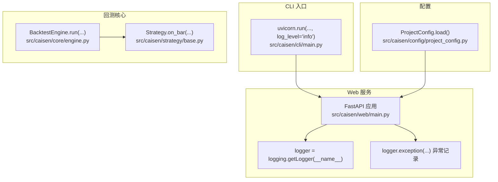
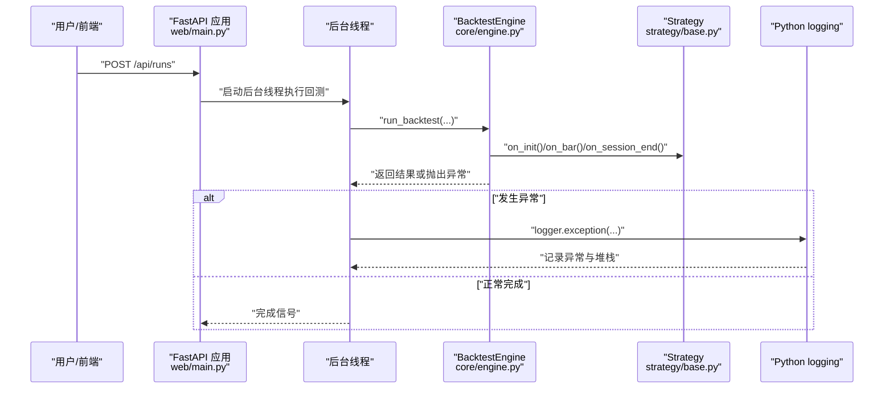
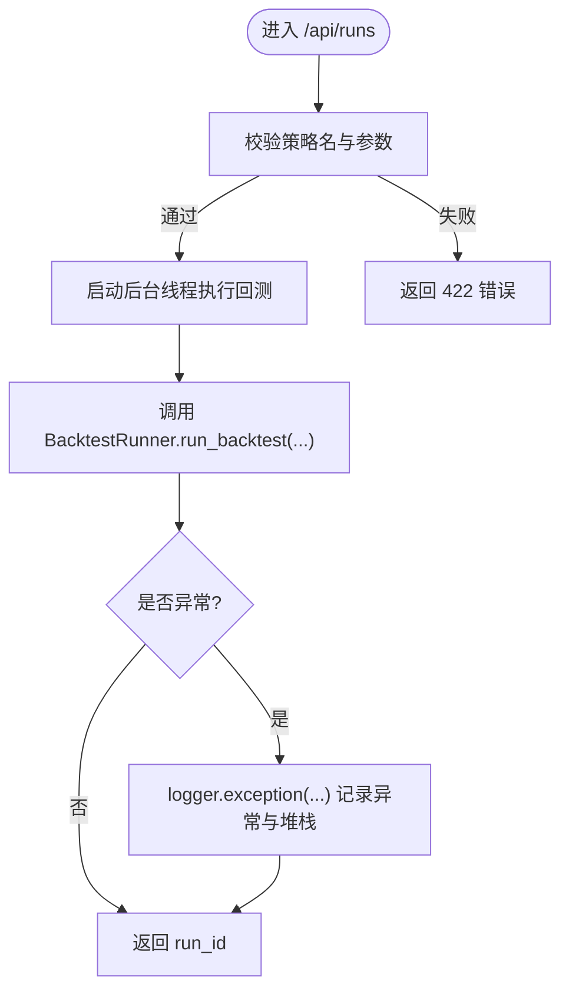
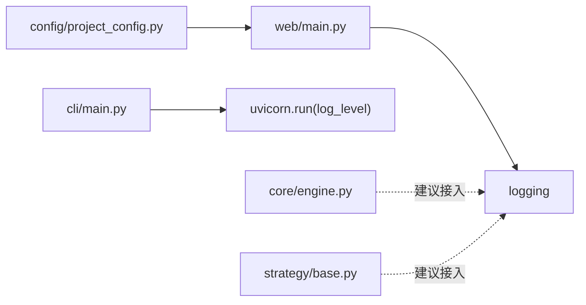

# 日志系统

<cite>
**本文引用的文件**   
- [src/caisen/web/main.py](file://src/caisen/web/main.py)
- [src/caisen/cli/main.py](file://src/caisen/cli/main.py)
- [src/caisen/config/project_config.py](file://src/caisen/config/project_config.py)
- [src/caisen/core/engine.py](file://src/caisen/core/engine.py)
- [src/caisen/strategy/base.py](file://src/caisen/strategy/base.py)
</cite>

## 目录
1. [引言](#引言)
2. [项目结构](#项目结构)
3. [核心组件](#核心组件)
4. [架构总览](#架构总览)
5. [详细组件分析](#详细组件分析)
6. [依赖分析](#依赖分析)
7. [性能考虑](#性能考虑)
8. [故障排查指南](#故障排查指南)
9. [结论](#结论)
10. [附录](#附录)

## 引言
本文件为 Caisen 量化回测系统的“日志系统”专项文档。当前仓库中日志能力以 Python 标准库 logging 为基础，主要出现在 Web 服务与 CLI 入口等关键路径上。本文在现有实现基础上，给出结构化日志设计、级别与字段规范、轮转策略建议、分布式追踪集成方案、聚合与分析方案（ELK/Loki）、错误捕获与堆栈记录、查询检索能力以及生产环境安全与访问控制的最佳实践，帮助团队将现有基础日志升级为可观测性完备的生产级体系。

## 项目结构
从代码可见，日志相关现状如下：
- Web 服务使用 logging.getLogger(__name__) 获取模块级 logger，并在异常路径使用 logger.exception(...) 记录异常堆栈。
- CLI 通过 uvicorn.run(..., log_level="info") 启动后端时设置日志级别。
- 项目配置模块提供全局配置加载，可作为未来扩展日志配置（如输出目录、轮转策略）的承载点。
- 回测引擎与策略基类目前未直接写入日志，但它们是产生业务事件的核心位置，适合接入结构化日志与追踪上下文。

图示来源
- [src/caisen/web/main.py:24-129](file://src/caisen/web/main.py#L24-L129)
- [src/caisen/cli/main.py:262-267](file://src/caisen/cli/main.py#L262-L267)
- [src/caisen/config/project_config.py:30-55](file://src/caisen/config/project_config.py#L30-L55)
- [src/caisen/core/engine.py:33-91](file://src/caisen/core/engine.py#L33-L91)
- [src/caisen/strategy/base.py:19-33](file://src/caisen/strategy/base.py#L19-L33)

章节来源
- [src/caisen/web/main.py:24-129](file://src/caisen/web/main.py#L24-L129)
- [src/caisen/cli/main.py:262-267](file://src/caisen/cli/main.py#L262-L267)
- [src/caisen/config/project_config.py:30-55](file://src/caisen/config/project_config.py#L30-L55)
- [src/caisen/core/engine.py:33-91](file://src/caisen/core/engine.py#L33-L91)
- [src/caisen/strategy/base.py:19-33](file://src/caisen/strategy/base.py#L19-L33)

## 核心组件
- 日志器实例化
  - Web 服务在模块顶部创建 logger，便于在各路由与后台任务中使用。
- 异常日志
  - 在后台线程执行回测失败时，使用 logger.exception(...) 记录异常及完整堆栈。
- 日志级别控制
  - CLI 启动后端时通过 uvicorn.run 指定 log_level="info"，影响 FastAPI 与底层框架日志级别。
- 配置承载
  - ProjectConfig 负责加载 project.yaml，后续可扩展出日志相关字段（如输出目录、轮转策略、采样率等）。

章节来源
- [src/caisen/web/main.py:24-129](file://src/caisen/web/main.py#L24-L129)
- [src/caisen/cli/main.py:262-267](file://src/caisen/cli/main.py#L262-L267)
- [src/caisen/config/project_config.py:30-55](file://src/caisen/config/project_config.py#L30-L55)

## 架构总览
下图展示当前日志在系统中的落点与调用关系，并标注了未来可扩展的关键接入点。

图示来源
- [src/caisen/web/main.py:107-132](file://src/caisen/web/main.py#L107-L132)
- [src/caisen/core/engine.py:33-91](file://src/caisen/core/engine.py#L33-L91)
- [src/caisen/strategy/base.py:19-33](file://src/caisen/strategy/base.py#L19-L33)

## 详细组件分析

### Web 服务日志
- 模块级 logger 初始化
  - 使用 logging.getLogger(__name__) 获取命名空间 logger，便于按模块过滤与分级。
- 异常处理与堆栈记录
  - 在后台线程执行回测失败时，使用 logger.exception(...) 记录异常信息与完整堆栈，有助于定位问题根因。
- 健康检查与静态资源
  - 健康检查与健康端点不涉及日志；静态资源请求可通过中间件统一采集访问日志（见后文“日志聚合与分析方案”）。

图示来源
- [src/caisen/web/main.py:107-132](file://src/caisen/web/main.py#L107-L132)
- [src/caisen/web/main.py:128-129](file://src/caisen/web/main.py#L128-L129)

章节来源
- [src/caisen/web/main.py:24-129](file://src/caisen/web/main.py#L24-L129)

### CLI 入口日志
- 日志级别控制
  - 通过 uvicorn.run(..., log_level="info") 设置后端日志级别，影响 FastAPI 与第三方库日志输出。
- 开发体验
  - 该方式便于本地调试快速开启信息级日志；生产环境建议改为集中式配置管理。

章节来源
- [src/caisen/cli/main.py:262-267](file://src/caisen/cli/main.py#L262-L267)

### 配置中心（可扩展日志配置）
- 当前职责
  - 从 configs/project.yaml 加载 data_dir、output_dir、api_port 等全局配置。
- 日志扩展建议
  - 新增日志相关字段，例如：log_dir、log_level、rotation_size、rotation_keep、sampling_rate、trace_enabled 等，供 Web/CLI 统一读取并初始化日志器。

章节来源
- [src/caisen/config/project_config.py:30-55](file://src/caisen/config/project_config.py#L30-L55)

### 回测引擎与策略（建议接入点）
- 回测引擎
  - BacktestEngine.run(...) 是每根 K 线处理的主循环，适合注入结构化日志（如 bar_index、symbol、order_id、slippage、commission 等），并携带追踪上下文。
- 策略基类
  - Strategy.on_bar(...) 是策略决策点，适合记录信号、风控触发、订单生成等关键事件。

章节来源
- [src/caisen/core/engine.py:33-91](file://src/caisen/core/engine.py#L33-L91)
- [src/caisen/strategy/base.py:19-33](file://src/caisen/strategy/base.py#L19-L33)

## 依赖分析
- 运行时依赖
  - Python 标准库 logging：用于日志输出与级别控制。
  - FastAPI/Uvicorn：作为 Web 服务容器，受 log_level 影响。
- 耦合关系
  - Web 服务对 logging 的直接依赖较弱，仅在本模块内使用；异常路径有明确记录点。
  - CLI 通过 uvicorn.run 间接影响日志级别。
  - 配置模块与日志无直接耦合，但可作为日志配置的承载点。

图示来源
- [src/caisen/web/main.py:24-129](file://src/caisen/web/main.py#L24-L129)
- [src/caisen/cli/main.py:262-267](file://src/caisen/cli/main.py#L262-L267)
- [src/caisen/config/project_config.py:30-55](file://src/caisen/config/project_config.py#L30-L55)
- [src/caisen/core/engine.py:33-91](file://src/caisen/core/engine.py#L33-L91)
- [src/caisen/strategy/base.py:19-33](file://src/caisen/strategy/base.py#L19-L33)

章节来源
- [src/caisen/web/main.py:24-129](file://src/caisen/web/main.py#L24-L129)
- [src/caisen/cli/main.py:262-267](file://src/caisen/cli/main.py#L262-L267)
- [src/caisen/config/project_config.py:30-55](file://src/caisen/config/project_config.py#L30-L55)
- [src/caisen/core/engine.py:33-91](file://src/caisen/core/engine.py#L33-L91)
- [src/caisen/strategy/base.py:19-33](file://src/caisen/strategy/base.py#L19-L33)

## 性能考虑
- 异步与线程
  - Web 服务在后台线程执行回测，避免阻塞请求；建议在日志写入时使用非阻塞队列或异步处理器，降低 I/O 对主流程的影响。
- 日志级别与采样
  - 生产环境默认 INFO/WARNING/ERROR，DEBUG 仅在需要时开启；对高频事件（如 on_bar）采用采样策略，避免磁盘压力。
- 批量写入
  - 结合缓冲与批量落盘，减少频繁 fsync 带来的开销。
- 结构化 JSON
  - 使用 JSON 格式输出，便于下游解析与索引，同时避免字符串拼接的性能损耗。

[本节为通用指导，不直接分析具体文件]

## 故障排查指南
- 常见异常场景
  - 回测后台执行失败：Web 服务已使用 logger.exception(...) 记录异常与堆栈，便于快速定位。
  - 数据缺失或路径非法：可在数据加载与路径校验处增加结构化日志与错误码，辅助前端提示。
- 定位步骤
  - 查看 Web 服务日志中的异常堆栈，确认失败位置与入参。
  - 核对 runs 输出目录是否存在 meta.json、data.json/bars.parquet 等必要文件。
  - 若涉及外部依赖（数据库、对象存储），在对应客户端处补充错误日志与重试次数。

章节来源
- [src/caisen/web/main.py:128-129](file://src/caisen/web/main.py#L128-L129)

## 结论
当前系统在 Web 服务层具备基础的异常日志记录能力，CLI 通过 uvicorn 控制日志级别。为实现生产级可观测性，建议：
- 建立统一的日志初始化与配置中心（基于 ProjectConfig 扩展）。
- 在回测引擎与策略关键路径接入结构化日志与分布式追踪。
- 引入日志轮转与保留策略，结合 ELK/Loki 进行聚合分析与告警。
- 完善敏感信息脱敏与访问控制，保障生产安全。

[本节为总结性内容，不直接分析具体文件]

## 附录

### 结构化日志设计规范（建议）
- 日志级别定义
  - DEBUG：详细调试信息，生产默认关闭。
  - INFO：关键业务流程节点（如开始/结束、状态变更）。
  - WARNING：潜在风险或降级行为。
  - ERROR：错误事件，需关注与告警。
- 字段标准（JSON 键名示例）
  - 时间戳：ts（ISO8601）
  - 级别：level
  - 模块：module
  - 函数：func
  - 行号：line
  - 进程/线程：pid/tid
  - 请求标识：request_id/correlation_id
  - 业务标识：strategy_name/symbol/freq/bar_index/order_id/trade_id
  - 指标：slippage/commission/equity
  - 消息：msg
- 格式规范
  - 单行 JSON，避免换行；数值类型保持数字；布尔值保持布尔；长文本截断。
- 示例字段清单（不含具体代码）
  - 参考路径：[src/caisen/core/engine.py:33-91](file://src/caisen/core/engine.py#L33-L91)、[src/caisen/strategy/base.py:19-33](file://src/caisen/strategy/base.py#L19-L33)

### 日志轮转策略（建议）
- 文件分割
  - 按大小（如 100MB）或按天分割，文件名包含日期与序列号。
- 保留周期
  - 默认保留 30 天，热数据 7 天，冷数据归档至对象存储。
- 存储空间管理
  - 监控磁盘使用率，超过阈值触发清理或扩容；定期统计各模块日志量。

### 分布式追踪集成（建议）
- 链路标识
  - 每个请求分配 request_id/correlation_id，贯穿 Web→后台→回测→策略全链路。
- 跨服务跟踪
  - 在 HTTP/WebSocket 头中传递 trace_id/span_id，后端解析并注入到日志上下文中。
- 工具选型
  - OpenTelemetry + Jaeger/Zipkin，或轻量方案自定义中间件。

### 日志聚合与分析方案（建议）
- ELK Stack
  - Filebeat/Fluent Bit → Kafka → Logstash → Elasticsearch → Kibana
  - 索引策略：按天分片，模板映射 JSON 字段，设置 TTL。
- Grafana Loki
  - Promtail/Fluent Bit → Loki → Grafana
  - 标签：service、env、module、level、strategy_name、symbol
- 告警规则
  - ERROR 数量突增、特定错误码、耗时 P95/P99 超阈。

### 错误日志捕获与堆栈记录（建议）
- 统一异常处理中间件
  - 捕获未处理异常，记录结构化错误与堆栈，附带请求上下文。
- 关键路径 try-except
  - 数据加载、策略执行、持久化等关键路径均包裹异常处理。
- 堆栈信息
  - 使用 logger.exception(...) 或等价机制，确保完整堆栈输出。

### 日志查询与检索（建议）
- 时间范围
  - 支持起止时间筛选，默认最近 24 小时。
- 关键词搜索
  - 全文检索 msg 字段，支持正则与通配符。
- 级别过滤
  - 按 level 过滤，支持多级别组合。
- 业务维度
  - 按 strategy_name、symbol、freq、order_id 等维度筛选。

### 生产环境安全与访问控制（建议）
- 敏感信息脱敏
  - 自动替换手机号、邮箱、IP、密钥等模式；对 JSON 值进行白名单过滤。
- 访问控制
  - 日志接口鉴权（Token/签名），最小权限原则；审计日志记录访问者与被访问资源。
- 传输与存储加密
  - 日志传输 TLS；静态存储加密；限制访问 IP 段。