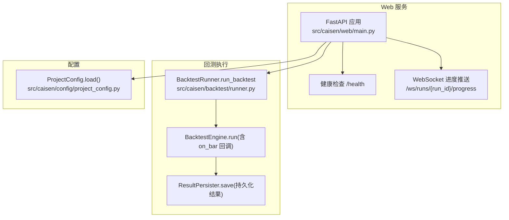
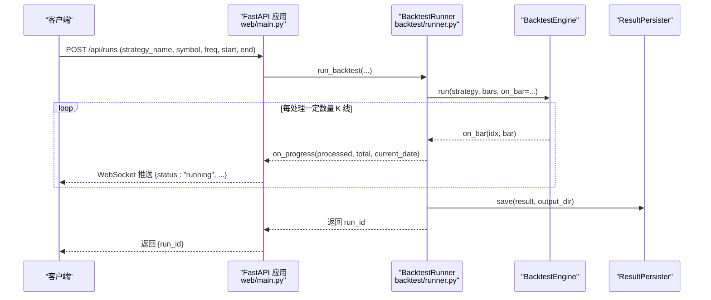

# 监控与日志

<cite>
**本文引用的文件**   
- [src/caisen/web/main.py](file://src/caisen/web/main.py)
- [src/caisen/backtest/runner.py](file://src/caisen/backtest/runner.py)
- [src/caisen/config/project_config.py](file://src/caisen/config/project_config.py)
- [tests/test_web_api.py](file://tests/test_web_api.py)
- [tests/test_data_source_scanner.py](file://tests/test_data_source_scanner.py)
- [tests/test_path_traversal.py](file://tests/test_path_traversal.py)
- [src/caisen/result/metrics.py](file://src/caisen/result/metrics.py)
</cite>

## 目录
1. [简介](#简介)
2. [项目结构](#项目结构)
3. [核心组件](#核心组件)
4. [架构总览](#架构总览)
5. [详细组件分析](#详细组件分析)
6. [依赖关系分析](#依赖关系分析)
7. [性能考虑](#性能考虑)
8. [故障诊断指南](#故障诊断指南)
9. [结论](#结论)
10. [附录](#附录)

## 简介
本文件面向 Caisen 量化回测系统的“监控与日志”能力，结合现有代码实现，给出：
- 应用性能监控：关键指标收集（回测性能、内存使用、CPU 利用率）与告警规则建议
- 结构化日志系统：日志级别定义、格式规范与轮转策略
- 分布式追踪集成：请求链路追踪与性能瓶颈定位方案
- 健康检查与服务状态监控：端点设计与自动恢复机制
- 日志聚合与分析：ELK Stack 或同类工具的集成配置
- 监控仪表板：Grafana 图表配置与关键指标可视化
- 故障诊断方法：日志分析方法与问题定位技巧

说明：当前仓库已包含 Web 服务与健康检查端点、回测执行器与进度推送等基础能力。本文在尊重现有实现的基础上，补充可落地的监控与日志体系设计，并给出与现有代码的映射关系。

## 项目结构
围绕监控与日志相关的关键位置如下：
- Web 服务与 HTTP/WebSocket 端点：src/caisen/web/main.py
- 回测执行流程与进度回调：src/caisen/backtest/runner.py
- 项目级全局配置加载：src/caisen/config/project_config.py
- 绩效指标数据容器：src/caisen/result/metrics.py
- 健康检查与 API 行为测试：tests/test_web_api.py、tests/test_data_source_scanner.py、tests/test_path_traversal.py



图示来源
- [src/caisen/web/main.py:68-304](file://src/caisen/web/main.py#L68-L304)
- [src/caisen/backtest/runner.py:26-94](file://src/caisen/backtest/runner.py#L26-L94)
- [src/caisen/config/project_config.py:24-43](file://src/caisen/config/project_config.py#L24-L43)

章节来源
- [src/caisen/web/main.py:68-304](file://src/caisen/web/main.py#L68-L304)
- [src/caisen/backtest/runner.py:26-94](file://src/caisen/backtest/runner.py#L26-L94)
- [src/caisen/config/project_config.py:24-43](file://src/caisen/config/project_config.py#L24-L43)

## 核心组件
- Web 服务与端点
  - 健康检查：GET /health，返回 {"status": "ok"}，用于探针与负载均衡健康判断
  - 列表与详情：/api/data-sources、/api/strategies、/api/runs、/api/runs/{run_id}、/api/runs/{run_id}/visualization
  - WebSocket 进度：/ws/runs/{run_id}/progress，实时推送 {status, processed, total, current_date} 等消息
- 回测执行器
  - BacktestRunner.run_backtest：参数解析 → 实例化策略 → 加载数据 → 引擎运行（on_bar 进度回调）→ 持久化结果 → 返回 run_id
- 项目配置
  - ProjectConfig.load：从 configs/project.yaml 读取 data_dir、output_dir、api_port；缺失时静默降级到默认值

章节来源
- [src/caisen/web/main.py:224-227](file://src/caisen/web/main.py#L224-L227)
- [src/caisen/web/main.py:247-302](file://src/caisen/web/main.py#L247-L302)
- [src/caisen/backtest/runner.py:26-94](file://src/caisen/backtest/runner.py#L26-L94)
- [src/caisen/config/project_config.py:24-43](file://src/caisen/config/project_config.py#L24-L43)

## 架构总览
下图展示一次通过 Web 触发回测的端到端流程，包括进度推送与结果持久化。



图示来源
- [src/caisen/web/main.py:107-132](file://src/caisen/web/main.py#L107-L132)
- [src/caisen/web/main.py:247-302](file://src/caisen/web/main.py#L247-L302)
- [src/caisen/backtest/runner.py:26-94](file://src/caisen/backtest/runner.py#L26-L94)

## 详细组件分析

### 健康检查与可用性监控
- 端点：GET /health
- 响应：{"status": "ok"}
- 用途：Kubernetes Liveness/Readiness、负载均衡健康探测、外部监控系统定时探测
- 扩展建议：
  - 增加依赖健康检查（如磁盘空间、数据目录可读性）
  - 暴露进程信息（启动时间、运行时长、线程数）

章节来源
- [src/caisen/web/main.py:224-227](file://src/caisen/web/main.py#L224-L227)
- [tests/test_web_api.py:19-26](file://tests/test_web_api.py#L19-L26)

### 回测进度与性能指标采集
- 进度推送：WebSocket /ws/runs/{run_id}/progress
  - 协议示例：{status:"running", processed, total, current_date}；完成时 {status:"done", run_id}；异常时 {status:"error", message}
- 性能指标建议采集项：
  - 回测性能：每根 K 线处理耗时、累计处理耗时、吞吐（bars/s）、队列积压（若引入异步任务队列）
  - 资源使用：进程 CPU 使用率、内存占用（RSS/VMS）、GC 次数与耗时、文件 I/O 速率
  - 业务指标：交易次数、信号密度、最大回撤、夏普比率等（来自 metrics.json）
- 采集方式建议：
  - Python 标准库 logging + prometheus_client 导出指标
  - 或使用第三方库（如 psutil、tracemalloc）采集资源指标
  - 将进度事件与指标上报解耦，避免阻塞主流程

章节来源
- [src/caisen/web/main.py:247-302](file://src/caisen/web/main.py#L247-L302)
- [src/caisen/backtest/runner.py:80-94](file://src/caisen/backtest/runner.py#L80-L94)
- [src/caisen/result/metrics.py:1-10](file://src/caisen/result/metrics.py#L1-10)

### 结构化日志系统设计
- 日志级别定义（建议）
  - DEBUG：详细调试信息（仅开发环境）
  - INFO：一般业务流程（如启动、结束、成功）
  - WARNING：潜在风险（如配置缺失、降级路径）
  - ERROR：错误但服务可继续（如单条数据处理失败）
  - CRITICAL：致命错误（服务不可用）
- 格式规范（JSON 结构化）
  - 字段建议：timestamp、level、service、version、trace_id、span_id、event、message、extra（键值对）
  - 统一时间戳与时区（UTC），数值型字段保持数字类型
- 轮转策略
  - 按大小与时间双维度轮转（如 50MB/天）
  - 保留最近 N 天或 M 个文件
  - 压缩归档，便于长期存储
- 与现有代码的衔接
  - web/main.py 中已有 logger = logging.getLogger(__name__)，可在关键路径追加结构化日志
  - 建议在 WebSocket 进度推送前后记录事件，便于回放与统计

章节来源
- [src/caisen/web/main.py:25](file://src/caisen/web/main.py#L25)

### 分布式追踪集成
- 目标：为每个请求生成 trace_id，串联 HTTP 请求、后台回测、I/O 操作
- 推荐方案
  - OpenTelemetry：SDK 注入到 FastAPI、HTTP 客户端、数据库/文件系统访问
  - 传播上下文：HTTP Header（traceparent/tracestate）与 WebSocket 自定义头
- 关键埋点
  - HTTP 入口/出口：/api/runs、/api/runs/{run_id}、/health
  - 回测阶段：策略加载、数据加载、引擎运行、结果持久化
  - 外部依赖：数据源扫描、文件读写
- 可视化：Jaeger、Zipkin、SkyWalking 等

[本节为概念性设计，不直接分析具体文件]

### 告警规则配置（建议）
- 可用性告警
  - /health 连续失败（如 3 次 × 1 分钟）
  - 服务进程退出或重启频繁
- 性能告警
  - 单根 K 线处理耗时超过阈值（如 > 5ms）
  - 吞吐低于阈值（如 < 1000 bars/s）
  - 内存持续增长且无回落（可能泄漏）
- 业务告警
  - 回测失败率上升（如 > 5%）
  - 数据为空或数据范围异常
- 告警渠道
  - 邮件、企业微信/钉钉机器人、PagerDuty 等

[本节为通用建议，不直接分析具体文件]

### 健康检查与自动恢复
- 健康检查端点：/health
- 自动恢复机制建议
  - 进程守护：systemd/supervisor/docker restart policy
  - 健康探针：Kubernetes liveness/readiness
  - 优雅关闭：捕获 SIGTERM，等待进行中回测完成或超时强制终止
  - 幂等与断点续跑：基于 run_id 的结果去重与增量推进

章节来源
- [src/caisen/web/main.py:224-227](file://src/caisen/web/main.py#L224-L227)

### 日志聚合与分析（ELK Stack 或同类）
- 采集
  - Filebeat/Fluent Bit 收集本地 JSON 日志
  - 或直接由应用输出到 stdout，交由容器编排平台收集
- 传输
  - Logstash 解析 JSON，提取字段，写入 Elasticsearch
- 存储与索引
  - Elasticsearch 索引按日期分片（如 caisen-logs-YYYY.MM.DD）
- 查询与可视化
  - Kibana 构建仪表盘：错误率、请求量、P95/P99 延迟、回测成功率
- 安全与合规
  - 敏感字段脱敏（如用户输入、路径）
  - 访问控制与审计

[本节为通用建议，不直接分析具体文件]

### 监控仪表板（Grafana）
- 指标来源
  - Prometheus 抓取应用暴露的指标（/metrics）
  - 系统指标：node_exporter、cAdvisor
- 关键面板
  - 服务可用性：/health 成功率与延迟
  - 回测性能：bars/s、单根耗时分布、累计耗时
  - 资源使用：CPU、内存、GC、I/O
  - 业务指标：胜率、最大回撤、夏普比率（从 metrics.json 导入）
- 告警联动
  - Grafana Alerting 与通知渠道对接

[本节为通用建议，不直接分析具体文件]

## 依赖关系分析
- Web 层依赖
  - FastAPI、CORS、FileResponse、WebSocket
  - 内部模块：BacktestRunner、StrategyRegistry、DataSourceScanner、ResultPersister、ProjectConfig
- 回测层依赖
  - BacktestEngine、DataConfig、load_bars、ResultPersister
- 配置层
  - ProjectConfig 提供 data_dir、output_dir、api_port

```mermaid
classDiagram
class WebApp {
+"/health"
+"/api/runs"
+"/ws/runs/{run_id}/progress"
}
class BacktestRunner {
+run_backtest(...)
}
class BacktestEngine {
+run(strategy, bars, on_bar)
}
class ResultPersister {
+save(result, output_dir)
+list_runs(output_dir)
+load(run_id, output_dir)
}
class ProjectConfig {
+load()
+data_dir
+output_dir
+api_port
}
WebApp --> BacktestRunner : "调用"
BacktestRunner --> BacktestEngine : "驱动"
BacktestRunner --> ResultPersister : "持久化"
WebApp --> ProjectConfig : "读取配置"
```

图示来源
- [src/caisen/web/main.py:68-304](file://src/caisen/web/main.py#L68-L304)
- [src/caisen/backtest/runner.py:26-94](file://src/caisen/backtest/runner.py#L26-L94)
- [src/caisen/config/project_config.py:24-43](file://src/caisen/config/project_config.py#L24-L43)

章节来源
- [src/caisen/web/main.py:68-304](file://src/caisen/web/main.py#L68-L304)
- [src/caisen/backtest/runner.py:26-94](file://src/caisen/backtest/runner.py#L26-L94)
- [src/caisen/config/project_config.py:24-43](file://src/caisen/config/project_config.py#L24-L43)

## 性能考虑
- 回测性能
  - 减少 on_bar 回调中的计算开销，批量上报进度
  - 合理设置 on_progress 频率（当前每 100 根）
- 资源使用
  - 监控内存峰值，避免大对象常驻
  - 限制并发回测数量，防止资源争用
- I/O 优化
  - Parquet 文件顺序读取，避免随机 IO
  - 结果持久化采用原子写入与临时文件切换
- 可扩展性
  - 引入任务队列（如 Celery/RQ）分离长任务
  - 水平扩展 Web 节点，共享结果存储（NFS/S3）

[本节为通用建议，不直接分析具体文件]

## 故障诊断指南
- 常见问题定位
  - 健康检查失败：检查 /health 响应、进程存活、端口占用
  - 回测失败：查看 WebSocket 推送的 error 消息与后端日志
  - 数据为空：确认 data_dir 下存在对应 symbol/freq 的 parquet 文件
  - 路径遍历防护：非法路径字符或逃逸 base_dir 会返回 400
- 日志分析方法
  - 以 trace_id 关联一次请求的全链路日志
  - 过滤 ERROR/CRITICAL 级别，结合堆栈快速定位
  - 关注 on_progress 事件的时间序列，识别卡顿区间
- 工具建议
  - 使用 Kibana 进行日志检索与聚合
  - 使用 Prometheus/Grafana 观察指标趋势与异常峰值

章节来源
- [src/caisen/web/main.py:28-39](file://src/caisen/web/main.py#L28-L39)
- [src/caisen/web/main.py:247-302](file://src/caisen/web/main.py#L247-L302)
- [tests/test_path_traversal.py:39-72](file://tests/test_path_traversal.py#L39-L72)
- [tests/test_web_api.py:19-26](file://tests/test_web_api.py#L19-L26)
- [tests/test_data_source_scanner.py:41-64](file://tests/test_data_source_scanner.py#L41-L64)

## 结论
本文在现有 Web 服务、回测执行器与配置模块基础上，给出了完整的监控与日志体系设计方案，涵盖指标采集、结构化日志、分布式追踪、健康检查、日志聚合与可视化、以及故障诊断方法。建议优先落地健康检查与结构化日志，随后逐步引入指标采集与分布式追踪，最终形成闭环的可观测性体系。

## 附录
- 关键端点清单
  - GET /health
  - GET /api/data-sources
  - GET /api/strategies
  - POST /api/runs
  - GET /api/runs
  - GET /api/runs/{run_id}
  - GET /api/runs/{run_id}/visualization
  - WebSocket /ws/runs/{run_id}/progress

章节来源
- [src/caisen/web/main.py:96-227](file://src/caisen/web/main.py#L96-L227)
- [src/caisen/web/main.py:247-302](file://src/caisen/web/main.py#L247-L302)