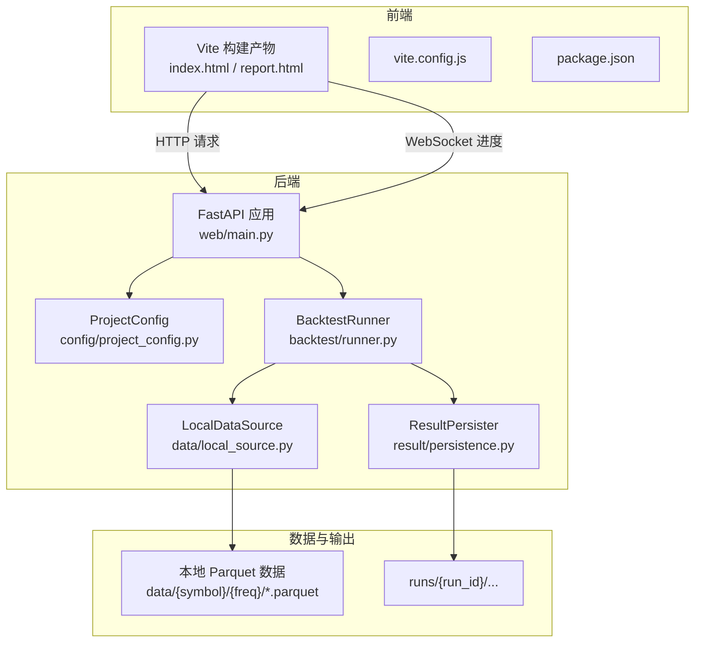
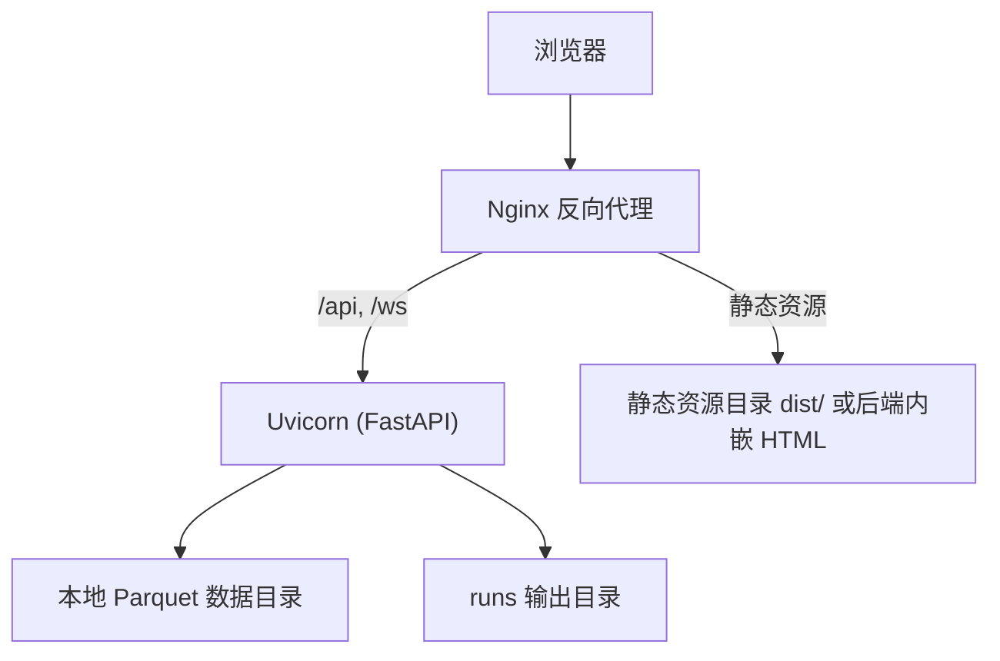
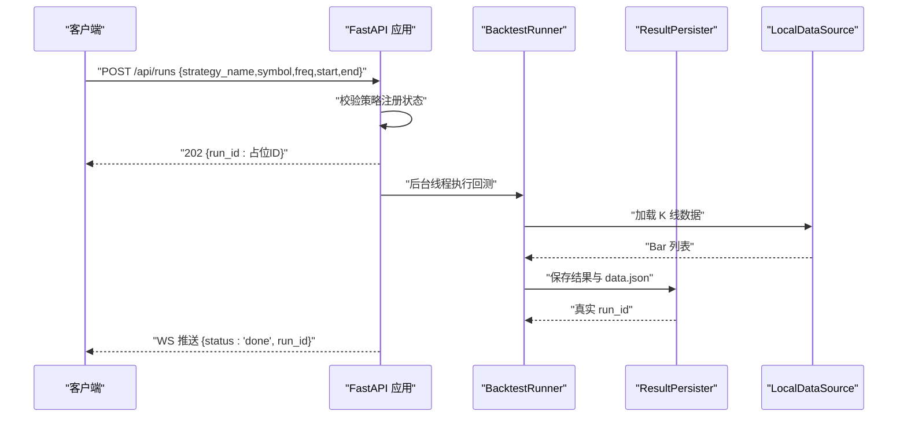
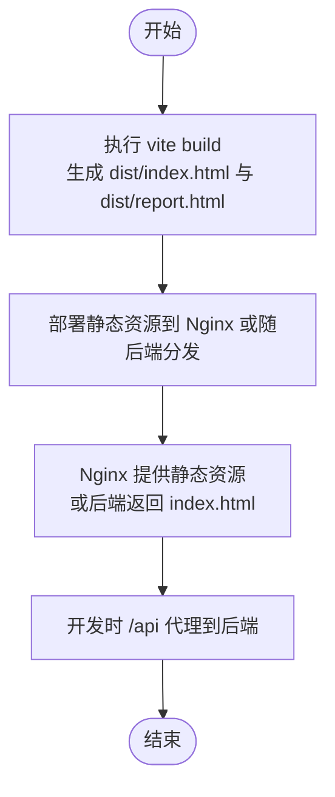
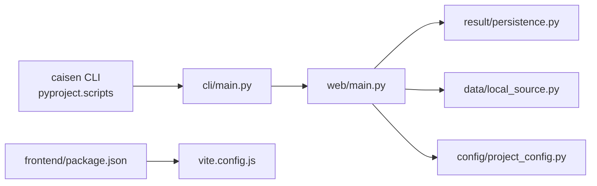

# 部署运维

<cite>
**本文引用的文件**   
- [README.md](file://README.md)
- [pyproject.toml](file://pyproject.toml)
- [project.yaml](file://configs/project.yaml)
- [main.py（Web）](file://src/caisen/web/main.py)
- [vite.config.js](file://src/caisen/frontend/vite.config.js)
- [package.json（前端）](file://src/caisen/frontend/package.json)
- [main.py（CLI）](file://src/caisen/cli/main.py)
- [project_config.py](file://src/caisen/config/project_config.py)
- [persistence.py](file://src/caisen/result/persistence.py)
- [local_source.py](file://src/caisen/data/local_source.py)
</cite>

## 目录
1. [简介](#简介)
2. [项目结构](#项目结构)
3. [核心组件](#核心组件)
4. [架构总览](#架构总览)
5. [详细组件分析](#详细组件分析)
6. [依赖关系分析](#依赖关系分析)
7. [性能与容量规划](#性能与容量规划)
8. [监控与日志](#监控与日志)
9. [安全加固指南](#安全加固指南)
10. [故障排查手册](#故障排查手册)
11. [自动化部署流水线](#自动化部署流水线)
12. [结论](#结论)

## 简介
本运维文档面向生产环境，覆盖容器化、云服务与本地服务器三种部署形态；阐述前端构建与静态资源管理、后端 FastAPI 服务部署与进程管理、数据与存储（Parquet）组织与备份策略、监控与日志、安全加固、故障排查以及 CI/CD 流水线与发布流程。读者无需深入源码即可按步骤完成部署与日常运维。

## 项目结构
系统由以下关键部分组成：
- 后端：FastAPI Web 服务，提供可视化报告、回测任务触发、结果查询等 API，并内置 WebSocket 进度推送。
- 前端：基于 Vite 的静态站点，开发模式通过代理访问后端 API，生产模式可独立部署或随后端一并分发。
- CLI：命令行工具，支持运行回测、查看结果、启动“前端+后端”一体化服务。
- 配置：项目级全局配置（data_dir、output_dir、api_port），默认值与覆盖机制清晰。
- 数据：本地 Parquet 行情数据加载器，支持日期范围筛选与多命名规范。
- 结果持久化：统一生成 meta/metrics/bars/trades/equity/annotations/data.json 等产物。

图表来源
- [main.py（Web）:68-304](file://src/caisen/web/main.py#L68-L304)
- [vite.config.js:1-43](file://src/caisen/frontend/vite.config.js#L1-L43)
- [package.json（前端）:1-26](file://src/caisen/frontend/package.json#L1-L26)
- [project_config.py:17-56](file://src/caisen/config/project_config.py#L17-L56)
- [persistence.py:59-274](file://src/caisen/result/persistence.py#L59-L274)
- [local_source.py:15-199](file://src/caisen/data/local_source.py#L15-L199)

章节来源
- [README.md:1-396](file://README.md#L1-L396)
- [pyproject.toml:1-59](file://pyproject.toml#L1-L59)

## 核心组件
- Web 服务（FastAPI）
  - 提供根页面、策略列表、数据源扫描、回测创建与结果查询、可视化数据直出、健康检查、静态资源路由、WebSocket 进度端点。
  - 使用线程后台执行回测，避免阻塞请求。
- 前端（Vite）
  - 开发模式通过代理转发 /api 到后端；生产模式可独立静态托管或通过后端直接返回 index.html。
- CLI
  - 提供 run/list-runs/show-result/serve 等命令；serve 可同时拉起后端与前端开发服务器。
- 配置
  - ProjectConfig 从 configs/project.yaml 读取覆盖默认值，包含 data_dir、output_dir、api_port。
- 数据与结果
  - LocalDataSource 读取本地 Parquet 文件并按时间范围过滤。
  - ResultPersister 生成统一的 runs 目录结构与 data.json 供前端渲染。

章节来源
- [main.py（Web）:68-304](file://src/caisen/web/main.py#L68-L304)
- [main.py（CLI）:235-295](file://src/caisen/cli/main.py#L235-L295)
- [project_config.py:17-56](file://src/caisen/config/project_config.py#L17-L56)
- [local_source.py:15-199](file://src/caisen/data/local_source.py#L15-L199)
- [persistence.py:59-274](file://src/caisen/result/persistence.py#L59-L274)

## 架构总览
下图展示生产环境下典型部署拓扑：Nginx 作为反向代理与静态资源入口，将 /api 与 /ws 转发至后端 FastAPI 进程，静态资源可直接由 Nginx 提供或由后端内嵌返回。

图表来源
- [main.py（Web）:68-304](file://src/caisen/web/main.py#L68-L304)
- [vite.config.js:1-43](file://src/caisen/frontend/vite.config.js#L1-L43)

## 详细组件分析

### Web 服务（FastAPI）
- 路由与中间件
  - 启用 CORS 中间件，便于跨域访问。
  - 根路径返回前端 index.html；/report.html 返回详情页。
  - /api/* 提供数据源、策略、回测任务、结果查询等接口。
  - /health 健康检查。
  - /js/* 与 /src/css/* 用于开发期动态提供静态资源。
- 回测任务
  - POST /api/runs 预校验策略名后，立即返回占位 run_id，并在后台线程执行实际回测。
  - WebSocket /ws/runs/{run_id}/progress 实时推送进度消息，完成后返回最终 run_id。
- 结果读取
  - GET /api/runs 列出有效 run（需存在 meta.json 且 bars 数量非零）。
  - GET /api/runs/{run_id} 与 /visualization 分别返回聚合结果与 data.json。
  - GET /api/runs/{run_id}/data.json 直接下载 data.json。
- 安全
  - 对用户输入的路径进行白名单校验，防止路径遍历。

图表来源
- [main.py（Web）:107-132](file://src/caisen/web/main.py#L107-L132)
- [main.py（Web）:247-303](file://src/caisen/web/main.py#L247-L303)
- [persistence.py:62-133](file://src/caisen/result/persistence.py#L62-L133)
- [local_source.py:39-80](file://src/caisen/data/local_source.py#L39-L80)

章节来源
- [main.py（Web）:68-304](file://src/caisen/web/main.py#L68-L304)

### 前端构建与静态资源
- 构建目标
  - 双入口：index.html 与 report.html，输出至 dist/。
- 开发模式
  - 本地端口 8000，/api 代理到后端（默认 http://localhost:8001）。
- 生产模式
  - 可通过 Nginx 直接提供 dist/ 静态资源；或让后端在根路径返回 index.html，并由后端提供 /js/* 与 /src/css/* 资源。
- 环境变量
  - VITE_API_PROXY 控制代理目标地址。

图表来源
- [vite.config.js:1-43](file://src/caisen/frontend/vite.config.js#L1-L43)
- [package.json（前端）:1-26](file://src/caisen/frontend/package.json#L1-L26)

章节来源
- [vite.config.js:1-43](file://src/caisen/frontend/vite.config.js#L1-L43)
- [package.json（前端）:1-26](file://src/caisen/frontend/package.json#L1-L26)

### CLI 与一体化服务
- serve 命令
  - 设置 output_dir，先启动后端（uvicorn），再启动前端（Vite dev server），并通过环境变量注入 VITE_API_PROXY。
  - 支持指定 --port、--host、--backend-port、--run-id。
- 其他命令
  - run：运行回测并持久化结果。
  - list-runs / show-result：管理与查看结果。

章节来源
- [main.py（CLI）:235-295](file://src/caisen/cli/main.py#L235-L295)
- [main.py（CLI）:69-191](file://src/caisen/cli/main.py#L69-L191)

### 配置管理
- 优先级
  - 内嵌默认值 < configs/project.yaml。
- 关键字段
  - data_dir：本地行情数据根目录。
  - output_dir：回测结果输出目录。
  - api_port：后端 API 端口。

章节来源
- [project_config.py:17-56](file://src/caisen/config/project_config.py#L17-L56)
- [project.yaml:1-13](file://configs/project.yaml#L1-L13)

### 数据与存储（Parquet）
- 目录结构
  - {data_dir}/{symbol}/{freq}/*.parquet，支持单日期文件或区间文件名。
- 列名兼容
  - 同时支持中英文列名映射。
- 时间范围
  - 根据 start/end 过滤 parquet 文件与 Bar 记录。

章节来源
- [local_source.py:15-199](file://src/caisen/data/local_source.py#L15-L199)

### 结果持久化与可视化
- 产物清单
  - meta.json、metrics.json、bars.parquet、trades.parquet、equity.parquet、annotations.json、data.json。
- data.json
  - 前端可视化综合数据，聚合元信息、指标与序列数据。
- 有效性判断
  - 仅当 meta.json 存在且 bar_count > 0 时视为有效 run。

章节来源
- [persistence.py:59-274](file://src/caisen/result/persistence.py#L59-L274)
- [main.py（Web）:134-183](file://src/caisen/web/main.py#L134-L183)

## 依赖关系分析
- Python 包与脚本
  - 入口脚本 caisen 指向 CLI 主函数。
  - 运行时依赖包括 fastapi、uvicorn、websockets、pyarrow、pandas、click、pyyaml。
- 前端依赖
  - Vite、ECharts、Playwright、Vitest 等。

图表来源
- [pyproject.toml:21-22](file://pyproject.toml#L21-L22)
- [main.py（CLI）:63-66](file://src/caisen/cli/main.py#L63-L66)
- [main.py（Web）:68-304](file://src/caisen/web/main.py#L68-L304)
- [persistence.py:59-274](file://src/caisen/result/persistence.py#L59-L274)
- [local_source.py:15-199](file://src/caisen/data/local_source.py#L15-L199)
- [project_config.py:17-56](file://src/caisen/config/project_config.py#L17-L56)
- [package.json（前端）:1-26](file://src/caisen/frontend/package.json#L1-L26)
- [vite.config.js:1-43](file://src/caisen/frontend/vite.config.js#L1-L43)

章节来源
- [pyproject.toml:1-59](file://pyproject.toml#L1-L59)
- [package.json（前端）:1-26](file://src/caisen/frontend/package.json#L1-L26)

## 性能与容量规划
- 计算与并发
  - 回测在后台线程执行，适合单机多用户场景；高并发建议前置负载均衡与多进程 Worker。
- I/O 与存储
  - Parquet 列式存储利于快速读取 OHLCV 序列；合理分区（按日或区间）可减少扫描开销。
- 前端资源
  - 生产环境建议开启 Gzip/Brotli 压缩与缓存头；大体积 ECharts 按需引入。
- 容量规划
  - 依据历史数据规模估算 runs 目录增长；定期归档与清理无效 run。

[本节为通用指导，不直接分析具体文件]

## 监控与日志
- 健康检查
  - /health 返回 ok，可用于探针与健康检查。
- 日志
  - 后端使用标准 logging；建议结合 uvicorn 日志级别与外部日志收集系统。
- 指标
  - 可在业务层扩展 Prometheus 指标采集（如请求耗时、错误率、队列长度等）。

章节来源
- [main.py（Web）:224-227](file://src/caisen/web/main.py#L224-L227)

## 安全加固指南
- 路径安全
  - 对用户输入的 run_id 与静态资源文件名进行白名单校验，拒绝包含 .. 及绝对路径字符，确保解析后的路径位于允许基目录下。
- 网络与访问控制
  - 生产环境建议关闭通配 CORS，限定允许的 origin；通过网关/防火墙限制来源 IP。
- 认证与鉴权
  - 当前未实现认证；建议在网关层增加基础认证或 JWT 校验。
- 数据加密
  - 传输层使用 HTTPS；敏感配置（如 LLM 密钥）通过环境变量注入，避免落盘。

章节来源
- [main.py（Web）:28-39](file://src/caisen/web/main.py#L28-L39)
- [main.py（Web）:76-83](file://src/caisen/web/main.py#L76-L83)

## 故障排查手册
- 常见问题
  - 前端无法连接后端：检查 VITE_API_PROXY 与后端端口是否一致；确认 /api 代理规则生效。
  - 无可用数据：确认 data_dir 下存在 {symbol}/{freq}/*.parquet，且列名符合规范。
  - 回测结果为空：检查 meta.json 是否存在且 bar_count > 0；确认 runs 目录权限。
  - 策略未注册：确认策略已正确导入并注册，或传入正确的策略名称。
- 恢复流程
  - 重建 data.json：调用 ResultPersister.save_visualization(run_id, output_dir)。
  - 重新运行回测：使用 CLI 或 /api/runs 触发，观察 WS 进度与最终 run_id。
  - 清理无效 run：删除不含 meta.json 或 bar_count=0 的目录。

章节来源
- [vite.config.js:21-29](file://src/caisen/frontend/vite.config.js#L21-L29)
- [local_source.py:139-199](file://src/caisen/data/local_source.py#L139-L199)
- [persistence.py:135-202](file://src/caisen/result/persistence.py#L135-L202)
- [main.py（Web）:134-183](file://src/caisen/web/main.py#L134-L183)

## 自动化部署流水线
- 构建阶段
  - 安装 Python 依赖（含可选 dev 依赖）；安装 Node 依赖；执行前端构建。
- 测试阶段
  - 运行 Python 单元测试与前端 Vitest/Playwright 测试。
- 打包与镜像
  - 将后端代码、dist 静态资源与必要数据目录打包进镜像；暴露 8000/8001 端口。
- 部署阶段
  - 容器编排：Kubernetes Deployment + Service + Ingress；或使用 Docker Compose 组合 Nginx 与 Uvicorn。
  - 环境变量：DATA_DIR、OUTPUT_DIR、API_PORT、VITE_API_PROXY 等。
- 发布流程
  - 版本标签（Git tag）触发流水线；灰度发布与回滚策略；制品仓库管理镜像与前端包。

[本节为通用指导，不直接分析具体文件]

## 结论
本方案以 FastAPI + Vite 为核心，配合 Parquet 数据与统一的结果持久化，形成轻量、可扩展的回测与可视化平台。生产部署建议采用 Nginx 反代与容器化编排，完善监控、日志与安全策略，并通过 CI/CD 实现自动化构建与发布。