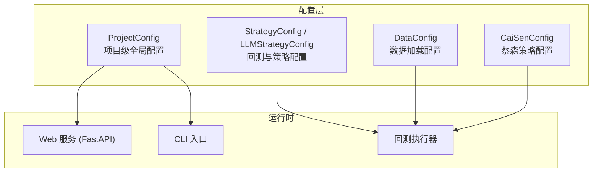
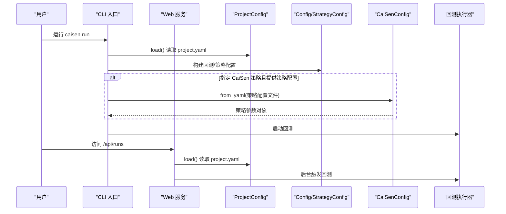
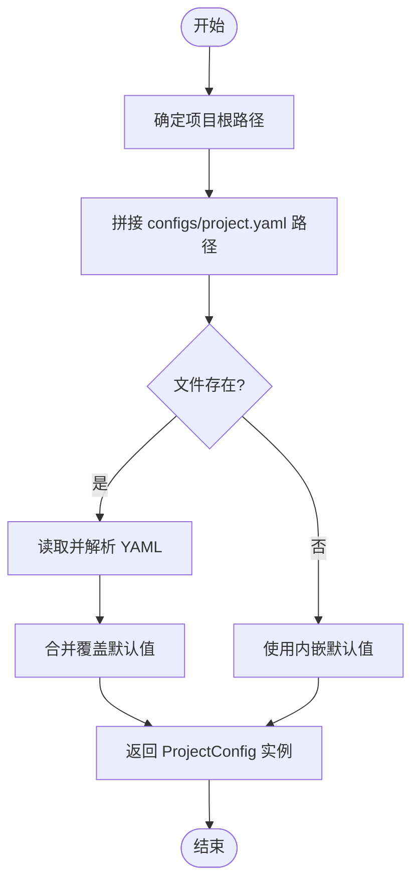
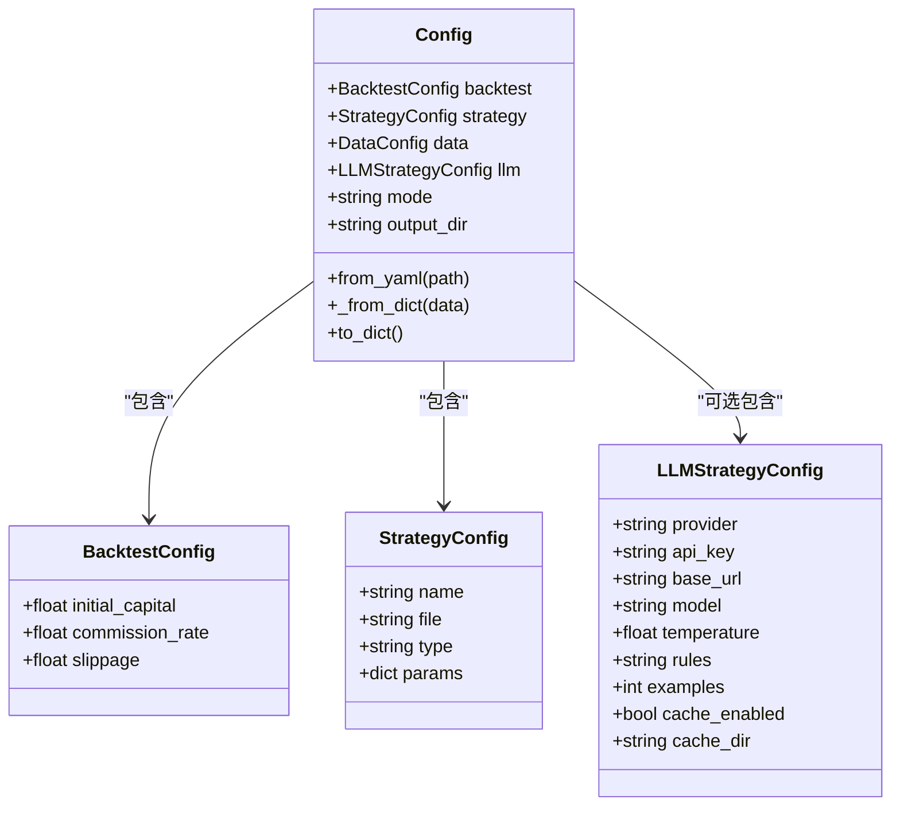
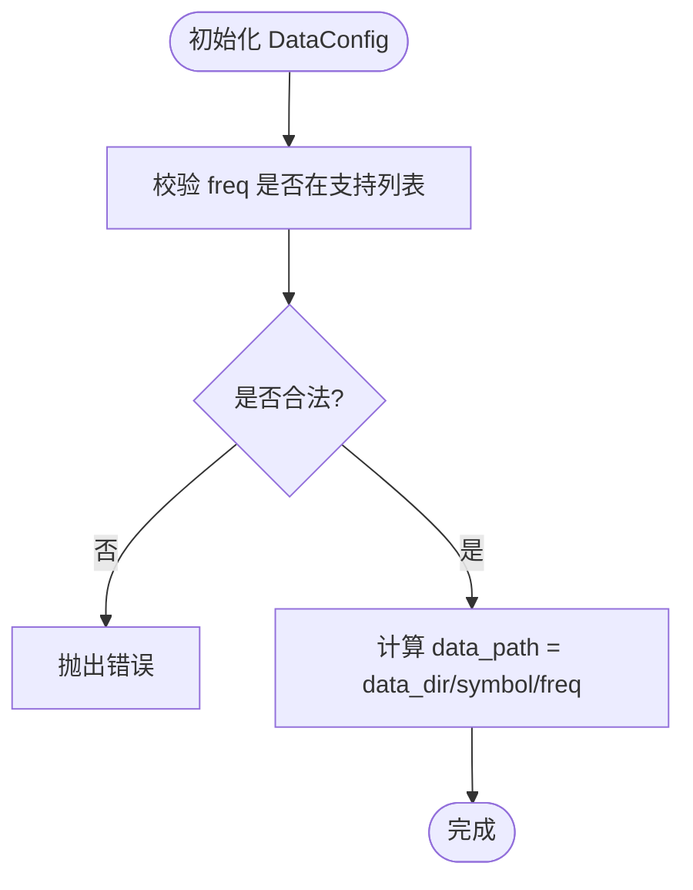
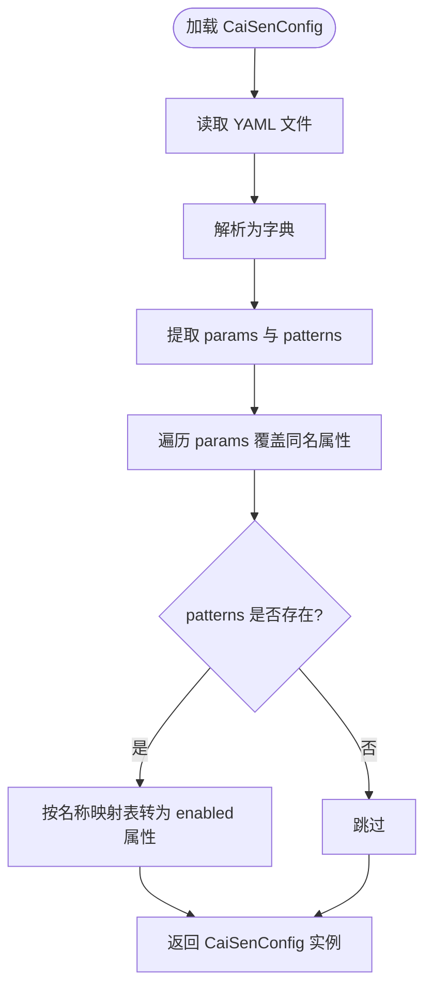
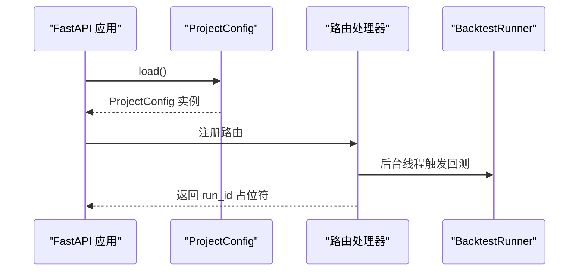
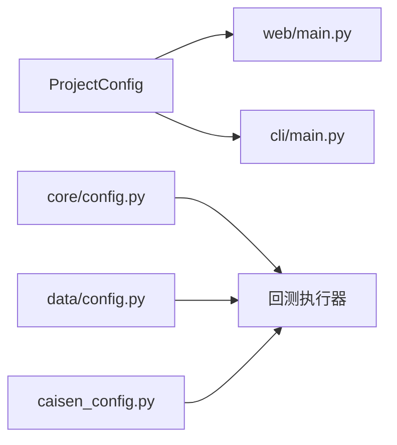

# 配置管理

<cite>
**本文引用的文件**   
- [src/caisen/config/project_config.py](file://src/caisen/config/project_config.py)
- [configs/project.yaml](file://configs/project.yaml)
- [src/caisen/core/config.py](file://src/caisen/core/config.py)
- [src/caisen/data/config.py](file://src/caisen/data/config.py)
- [src/caisen/strategy/algorithm/caisen_config.py](file://src/caisen/strategy/algorithm/caisen_config.py)
- [configs/strategies/caisen_default.yaml](file://configs/strategies/caisen_default.yaml)
- [configs/strategies/cai_sen_v2.yaml](file://configs/strategies/cai_sen_v2.yaml)
- [src/caisen/web/main.py](file://src/caisen/web/main.py)
- [src/caisen/cli/main.py](file://src/caisen/cli/main.py)
- [tests/test_project_config.py](file://tests/test_project_config.py)
</cite>

## 目录
1. [简介](#简介)
2. [项目结构](#项目结构)
3. [核心组件](#核心组件)
4. [架构总览](#架构总览)
5. [详细组件分析](#详细组件分析)
6. [依赖关系分析](#依赖关系分析)
7. [性能与可扩展性](#性能与可扩展性)
8. [故障排查指南](#故障排查指南)
9. [结论](#结论)
10. [附录](#附录)

## 简介
本技术文档围绕 Caisen 配置管理系统，系统性阐述项目级配置、策略配置文件格式与解析、配置验证、环境变量集成、热重载机制、模板与最佳实践以及迁移与兼容性保障。目标是帮助开发者快速理解并安全扩展配置体系，确保在不同环境下的一致性与可维护性。

## 项目结构
Caisen 的配置体系由“项目级全局配置”和“策略级配置”两部分组成：
- 项目级全局配置：位于 configs/project.yaml，通过 ProjectConfig 加载，提供数据目录、输出目录、Web 端口等全局设置。
- 策略级配置：位于 configs/strategies/*.yaml，用于控制策略参数、形态开关、权重与风控等。

图表来源
- [src/caisen/config/project_config.py:1-56](file://src/caisen/config/project_config.py#L1-L56)
- [src/caisen/core/config.py:1-94](file://src/caisen/core/config.py#L1-L94)
- [src/caisen/data/config.py:1-51](file://src/caisen/data/config.py#L1-L51)
- [src/caisen/strategy/algorithm/caisen_config.py:1-145](file://src/caisen/strategy/algorithm/caisen_config.py#L1-L145)
- [src/caisen/web/main.py:1-319](file://src/caisen/web/main.py#L1-L319)
- [src/caisen/cli/main.py:109-135](file://src/caisen/cli/main.py#L109-L135)

章节来源
- [src/caisen/config/project_config.py:1-56](file://src/caisen/config/project_config.py#L1-L56)
- [configs/project.yaml:1-13](file://configs/project.yaml#L1-L13)
- [src/caisen/core/config.py:1-94](file://src/caisen/core/config.py#L1-L94)
- [src/caisen/data/config.py:1-51](file://src/caisen/data/config.py#L1-L51)
- [src/caisen/strategy/algorithm/caisen_config.py:1-145](file://src/caisen/strategy/algorithm/caisen_config.py#L1-L145)
- [src/caisen/web/main.py:1-319](file://src/caisen/web/main.py#L1-L319)
- [src/caisen/cli/main.py:109-135](file://src/caisen/cli/main.py#L109-L135)

## 核心组件
- 项目级全局配置（ProjectConfig）
  - 从 configs/project.yaml 读取 data_dir、output_dir、api_port；缺失时静默降级到内嵌默认值。
  - 支持传入 project_root 指定项目根路径，便于测试与多项目场景。
- 回测与策略配置（BacktestConfig、StrategyConfig、LLMStrategyConfig、Config）
  - 统一的数据类描述回测资金、手续费、滑点、策略元信息、LLM 提供者与缓存等。
  - 提供 from_yaml/_from_dict/to_dict 方法完成 YAML 与对象互转。
- 数据加载配置（DataConfig）
  - 定义 symbol、freq、start/end、data_dir 及频率校验、路径计算等。
- 蔡森策略配置（CaiSenConfig）
  - 以 dataclass 承载平台检测、破底翻、仓位管理、风控、形态开关与权重等参数。
  - 提供 from_yaml 将 YAML 的 params/patterns 映射到属性，to_dict 序列化。

章节来源
- [src/caisen/config/project_config.py:1-56](file://src/caisen/config/project_config.py#L1-L56)
- [src/caisen/core/config.py:1-94](file://src/caisen/core/config.py#L1-L94)
- [src/caisen/data/config.py:1-51](file://src/caisen/data/config.py#L1-L51)
- [src/caisen/strategy/algorithm/caisen_config.py:1-145](file://src/caisen/strategy/algorithm/caisen_config.py#L1-L145)

## 架构总览
下图展示配置在 Web 与 CLI 中的加载与使用流程，以及策略配置的注入方式。

图表来源
- [src/caisen/config/project_config.py:1-56](file://src/caisen/config/project_config.py#L1-L56)
- [src/caisen/core/config.py:1-94](file://src/caisen/core/config.py#L1-L94)
- [src/caisen/strategy/algorithm/caisen_config.py:1-145](file://src/caisen/strategy/algorithm/caisen_config.py#L1-L145)
- [src/caisen/cli/main.py:109-135](file://src/caisen/cli/main.py#L109-L135)
- [src/caisen/web/main.py:1-319](file://src/caisen/web/main.py#L1-L319)

## 详细组件分析

### 项目级全局配置（ProjectConfig）
- 功能要点
  - 自动定位项目根目录，读取 configs/project.yaml。
  - 字段覆盖优先级：内嵌默认值 < project.yaml。
  - 缺失文件或字段时静默降级，不抛异常。
- 关键行为
  - load(project_root=None) 自动推断项目根。
  - 返回强类型 dataclass 实例，便于后续注入。
- 典型用法
  - Web 服务启动时读取 output_dir、api_port。
  - CLI 与数据扫描器读取 data_dir。

图表来源
- [src/caisen/config/project_config.py:1-56](file://src/caisen/config/project_config.py#L1-L56)
- [configs/project.yaml:1-13](file://configs/project.yaml#L1-L13)

章节来源
- [src/caisen/config/project_config.py:1-56](file://src/caisen/config/project_config.py#L1-L56)
- [configs/project.yaml:1-13](file://configs/project.yaml#L1-L13)
- [tests/test_project_config.py:1-44](file://tests/test_project_config.py#L1-L44)

### 回测与策略配置（Config、BacktestConfig、StrategyConfig、LLMStrategyConfig）
- 功能要点
  - 统一描述回测初始资金、佣金、滑点、策略名称/类型/参数、LLM 提供者与缓存等。
  - 提供 from_yaml/_from_dict/to_dict 实现配置对象与字典/YAML 的转换。
- 设计说明
  - 采用 dataclass 组合模式，各子配置独立演进，降低耦合。
  - mode 字段区分 code/llm 两种策略模式。

图表来源
- [src/caisen/core/config.py:1-94](file://src/caisen/core/config.py#L1-L94)

章节来源
- [src/caisen/core/config.py:1-94](file://src/caisen/core/config.py#L1-L94)

### 数据加载配置（DataConfig）
- 功能要点
  - 定义交易标的、周期、起止时间、数据目录。
  - __post_init__ 对 freq 进行范围校验，仅允许预定义频率集合。
  - data_path 属性按 data_dir/symbol/freq 生成路径。
- 验证规则
  - 若 symbol 非空且 freq 不在 SUPPORTED_FREQS，抛出 ValueError。

图表来源
- [src/caisen/data/config.py:1-51](file://src/caisen/data/config.py#L1-L51)

章节来源
- [src/caisen/data/config.py:1-51](file://src/caisen/data/config.py#L1-L51)

### 蔡森策略配置（CaiSenConfig）
- 功能要点
  - 集中管理平台检测、破底翻、仓位管理、风控、形态开关与权重等参数。
  - from_yaml 支持从 YAML 的 params 与 patterns 节点覆盖默认值。
  - to_dict 用于导出当前配置状态。
- 参数继承与覆盖
  - 先加载 dataclass 默认值，再按 YAML 键名覆盖同名属性。
  - patterns 节点通过名称映射表转换为 enabled 属性。

图表来源
- [src/caisen/strategy/algorithm/caisen_config.py:1-145](file://src/caisen/strategy/algorithm/caisen_config.py#L1-L145)

章节来源
- [src/caisen/strategy/algorithm/caisen_config.py:1-145](file://src/caisen/strategy/algorithm/caisen_config.py#L1-L145)
- [configs/strategies/caisen_default.yaml:1-50](file://configs/strategies/caisen_default.yaml#L1-L50)
- [configs/strategies/cai_sen_v2.yaml:1-145](file://configs/strategies/cai_sen_v2.yaml#L1-L145)

### Web 服务与 CLI 中的配置集成
- Web 服务
  - 启动时调用 ProjectConfig.load() 获取 output_dir、api_port。
  - 提供 set_output_dir 供测试或外部覆盖。
  - 路由中通过 _safe_resolve 防止路径遍历攻击。
- CLI
  - 当指定 CaiSen 策略且提供策略配置文件时，通过 CaiSenStrategy.from_config 加载策略参数。
  - 内置策略通过模块动态导入与反射查找。

图表来源
- [src/caisen/web/main.py:1-319](file://src/caisen/web/main.py#L1-L319)
- [src/caisen/cli/main.py:109-135](file://src/caisen/cli/main.py#L109-L135)

章节来源
- [src/caisen/web/main.py:1-319](file://src/caisen/web/main.py#L1-L319)
- [src/caisen/cli/main.py:109-135](file://src/caisen/cli/main.py#L109-L135)

## 依赖关系分析
- 组件耦合
  - Web 与 CLI 均依赖 ProjectConfig 获取全局路径与端口。
  - 回测执行器依赖 Config/DataConfig/CaiSenConfig 的组合配置。
- 外部依赖
  - PyYAML 用于解析 YAML。
  - FastAPI/uvicorn 用于 Web 服务。
  - pydantic 用于请求体校验（Web）。

图表来源
- [src/caisen/config/project_config.py:1-56](file://src/caisen/config/project_config.py#L1-L56)
- [src/caisen/core/config.py:1-94](file://src/caisen/core/config.py#L1-L94)
- [src/caisen/data/config.py:1-51](file://src/caisen/data/config.py#L1-L51)
- [src/caisen/strategy/algorithm/caisen_config.py:1-145](file://src/caisen/strategy/algorithm/caisen_config.py#L1-L145)
- [src/caisen/web/main.py:1-319](file://src/caisen/web/main.py#L1-L319)
- [src/caisen/cli/main.py:109-135](file://src/caisen/cli/main.py#L109-L135)

章节来源
- [src/caisen/config/project_config.py:1-56](file://src/caisen/config/project_config.py#L1-L56)
- [src/caisen/core/config.py:1-94](file://src/caisen/core/config.py#L1-L94)
- [src/caisen/data/config.py:1-51](file://src/caisen/data/config.py#L1-L51)
- [src/caisen/strategy/algorithm/caisen_config.py:1-145](file://src/caisen/strategy/algorithm/caisen_config.py#L1-L145)
- [src/caisen/web/main.py:1-319](file://src/caisen/web/main.py#L1-L319)
- [src/caisen/cli/main.py:109-135](file://src/caisen/cli/main.py#L109-L135)

## 性能与可扩展性
- 配置加载开销
  - ProjectConfig 仅在进程启动时加载一次，开销极低。
  - 策略配置按需加载，避免不必要的 I/O。
- 可扩展建议
  - 引入配置版本化与 schema 校验，提升大型项目的稳定性。
  - 对敏感字段（如 API Key）采用环境变量注入与加密存储。
  - 对高频读路径增加内存缓存（例如按策略名缓存已解析的配置对象）。

[本节为通用指导，无需源码引用]

## 故障排查指南
- 常见问题
  - project.yaml 不存在：系统会静默使用默认值，检查日志确认实际生效的路径与端口。
  - 部分字段缺失：未提供的字段将回退到默认值，可通过单元测试断言确认。
  - 非法路径字符：Web 服务对路径进行白名单校验，出现 400 错误需检查输入。
  - 日期格式错误：RunRequest 使用正则校验 YYYY-MM-DD，不符合将返回 422。
- 定位步骤
  - 打印 ProjectConfig 实例字段，确认覆盖是否生效。
  - 查看 Web 日志中回测后台线程异常堆栈。
  - 检查策略配置文件路径与命名是否与 CLI 传递一致。

章节来源
- [tests/test_project_config.py:1-44](file://tests/test_project_config.py#L1-L44)
- [src/caisen/web/main.py:1-319](file://src/caisen/web/main.py#L1-L319)

## 结论
Caisen 的配置体系以 ProjectConfig 为核心，结合策略级 YAML 配置与数据类模型，实现了清晰的分层与良好的默认值覆盖机制。通过严格的输入校验与安全路径处理，系统在易用性与安全性之间取得平衡。建议在后续迭代中引入更完善的 schema 校验、环境变量注入与配置热重载能力，进一步提升运维效率与可靠性。

[本节为总结性内容，无需源码引用]

## 附录

### 配置项清单与说明
- 项目级全局配置（project.yaml）
  - data_dir：本地行情数据根目录（Parquet 存放位置）
  - output_dir：回测结果输出目录
  - api_port：Web 服务监听端口
- 回测与策略配置（core/config.py）
  - backtest.initial_capital/commission_rate/slippage：资金、手续费、滑点
  - strategy.name/file/type/params：策略标识与参数
  - llm.provider/api_key/base_url/model/temperature/rules/examples/cache_enabled/cache_dir：LLM 相关
  - mode/output_dir：运行模式与输出目录
- 数据加载配置（data/config.py）
  - symbol/freq/start/end/data_dir：数据源与时间窗口
- 蔡森策略配置（caisen_config.py）
  - platform_*、breakdown_*、仓位与风控参数、形态开关与权重等

章节来源
- [configs/project.yaml:1-13](file://configs/project.yaml#L1-L13)
- [src/caisen/core/config.py:1-94](file://src/caisen/core/config.py#L1-L94)
- [src/caisen/data/config.py:1-51](file://src/caisen/data/config.py#L1-L51)
- [src/caisen/strategy/algorithm/caisen_config.py:1-145](file://src/caisen/strategy/algorithm/caisen_config.py#L1-L145)

### 环境变量集成与敏感信息保护
- 支持点
  - LLMStrategyConfig.api_key 注释表明支持环境变量注入。
  - CLI 启动时将 os.environ 传递给子进程环境，便于下游读取。
  - 测试用例展示了从 OPENAI_API_KEY 读取密钥的方式。
- 建议
  - 在部署环境中通过环境变量注入 API Key，避免写入配置文件。
  - 对敏感字段增加加密存储或密钥管理服务集成。

章节来源
- [src/caisen/core/config.py:1-94](file://src/caisen/core/config.py#L1-L94)
- [src/caisen/cli/main.py:274-274](file://src/caisen/cli/main.py#L274-L274)
- [tests/test_openai_provider.py:63-65](file://tests/test_openai_provider.py#L63-L65)

### 配置验证系统现状与建议
- 现状
  - DataConfig.__post_init__ 对 freq 进行范围校验。
  - Web 层 RunRequest 使用 field_validator 校验日期格式。
- 建议
  - 引入统一的配置 Schema（如基于 pydantic），对所有配置项进行类型与范围校验。
  - 对业务规则（如止损系数范围、最小盈利目标）增加约束与提示。

章节来源
- [src/caisen/data/config.py:1-51](file://src/caisen/data/config.py#L1-L51)
- [src/caisen/web/main.py:1-319](file://src/caisen/web/main.py#L1-L319)

### 配置热重载机制
- 现状
  - 当前未在代码中发现显式的配置热重载实现。
- 建议
  - 在 Web 服务中增加配置变更监听（文件系统事件或定时轮询），更新内存中的 ProjectConfig 与策略配置缓存。
  - 提供 /api/reload-config 端点，支持手动触发重载并记录审计日志。

[本节为概念性建议，无需源码引用]

### 配置模板与最佳实践
- 模板
  - configs/strategies/caisen_default.yaml：蔡森策略基础参数示例。
  - configs/strategies/cai_sen_v2.yaml：V2 综合评分、权重与检测器参数示例。
- 最佳实践
  - 不同环境分离：开发/测试/生产分别维护 project.yaml 与策略配置。
  - 版本管理：对策略配置进行 Git 版本控制，配合回测结果 meta.json 追溯。
  - 参数收敛：优先使用 weights/enabled_patterns 控制策略行为，减少硬编码。

章节来源
- [configs/strategies/caisen_default.yaml:1-50](file://configs/strategies/caisen_default.yaml#L1-L50)
- [configs/strategies/cai_sen_v2.yaml:1-145](file://configs/strategies/cai_sen_v2.yaml#L1-L145)

### 配置迁移与向后兼容
- 现状
  - ProjectConfig 对缺失字段静默降级，保证旧配置与新默认值兼容。
  - CaiSenConfig.from_yaml 仅覆盖同名属性，新增字段不影响旧配置。
- 建议
  - 引入配置版本号与迁移脚本，逐步废弃旧字段并提供替代方案。
  - 在 CI 中加入配置 lint 与 schema 校验，提前发现不兼容变更。

章节来源
- [src/caisen/config/project_config.py:1-56](file://src/caisen/config/project_config.py#L1-L56)
- [src/caisen/strategy/algorithm/caisen_config.py:1-145](file://src/caisen/strategy/algorithm/caisen_config.py#L1-L145)