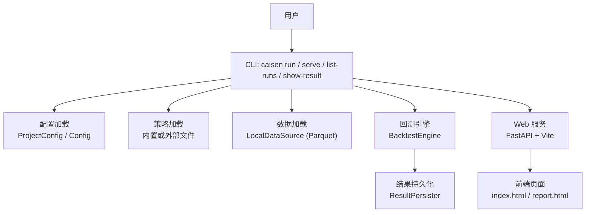
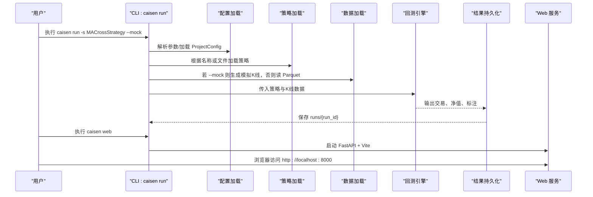
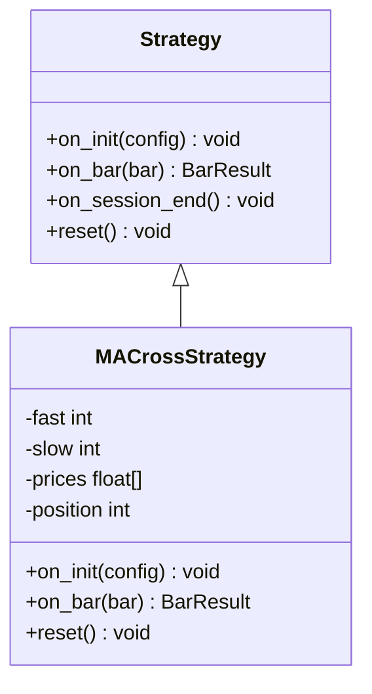
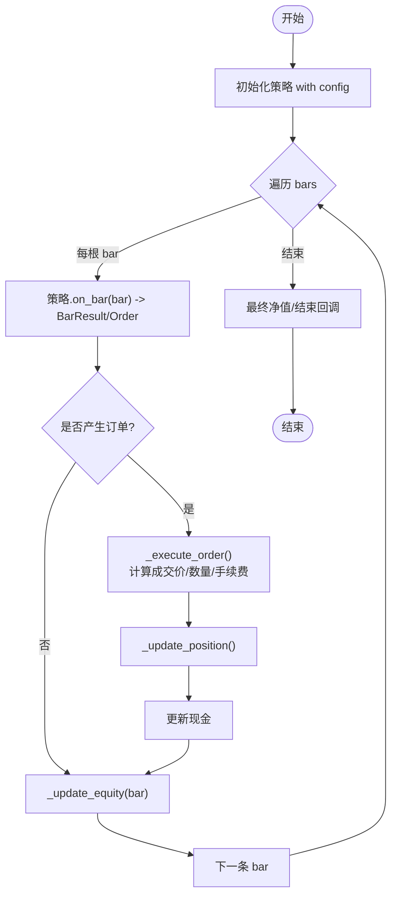
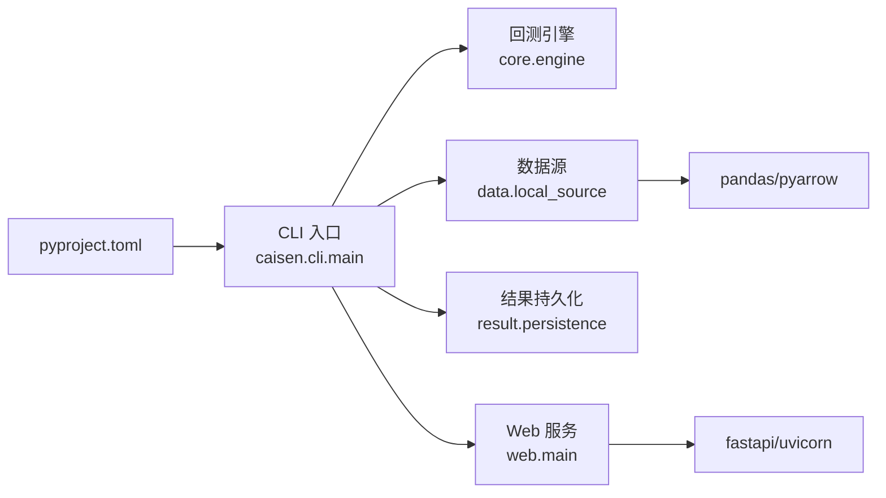

# 快速开始

<cite>
**本文引用的文件**   
- [README.md](file://README.md)
- [pyproject.toml](file://pyproject.toml)
- [configs/project.yaml](file://configs/project.yaml)
- [src/caisen/cli/main.py](file://src/caisen/cli/main.py)
- [src/caisen/core/engine.py](file://src/caisen/core/engine.py)
- [src/caisen/strategy/base.py](file://src/caisen/strategy/base.py)
- [src/caisen/strategy/algorithm/ma_cross.py](file://src/caisen/strategy/algorithm/ma_cross.py)
- [examples/ma_cross.py](file://examples/ma_cross.py)
- [src/caisen/data/local_source.py](file://src/caisen/data/local_source.py)
- [src/caisen/web/main.py](file://src/caisen/web/main.py)
- [examples/cai_sen_real_data.py](file://examples/cai_sen_real_data.py)
- [docs/adr/0002-parquet-data-storage.md](file://docs/adr/0002-parquet-data-storage.md)
</cite>

## 目录
1. [简介](#简介)
2. [项目结构](#项目结构)
3. [核心组件](#核心组件)
4. [架构总览](#架构总览)
5. [详细组件分析](#详细组件分析)
6. [依赖关系分析](#依赖关系分析)
7. [性能与注意事项](#性能与注意事项)
8. [故障排查指南](#故障排查指南)
9. [结论](#结论)
10. [附录：30分钟上手路径](#附录30分钟上手路径)

## 简介
本指南面向首次接触 Caisen 量化回测系统的用户，目标是帮助你在 30 分钟内完成环境安装、模拟数据回测、真实数据准备与运行、结果查看与服务启动。你将学会使用 CLI 命令执行回测、浏览可视化报告，并了解系统的数据格式与策略接口，为后续自定义策略打下基础。

## 项目结构
Caisen 采用“核心引擎 + 策略插件 + 数据源 + 可视化服务”的分层设计。CLI 作为统一入口，负责参数解析、策略加载、数据读取、回测执行与结果持久化；Web 服务提供可视化报告与 API。

图表来源
- [src/caisen/cli/main.py:63-191](file://src/caisen/cli/main.py#L63-L191)
- [src/caisen/core/engine.py:19-91](file://src/caisen/core/engine.py#L19-L91)
- [src/caisen/data/local_source.py:15-80](file://src/caisen/data/local_source.py#L15-L80)
- [src/caisen/web/main.py:68-106](file://src/caisen/web/main.py#L68-L106)

章节来源
- [README.md:1-120](file://README.md#L1-L120)
- [pyproject.toml:1-23](file://pyproject.toml#L1-L23)
- [configs/project.yaml:1-13](file://configs/project.yaml#L1-L13)

## 核心组件
- CLI 主入口：提供 run、list-runs、show-result、web（serve）等命令，支持 --mock 模拟数据与策略配置文件。
- 回测引擎：驱动策略逐根 K 线运行，计算成交、持仓、净值曲线与标注。
- 策略基类：定义 on_init/on_bar/on_session_end/reset 生命周期钩子，返回 BarResult 兼容旧版 Order。
- 数据源：本地 Parquet 数据加载器，支持按日期或日期范围文件命名模式。
- Web 服务：FastAPI 后端 + Vite 前端，提供回测列表、详情、可视化数据与进度推送。

章节来源
- [src/caisen/cli/main.py:63-191](file://src/caisen/cli/main.py#L63-L191)
- [src/caisen/core/engine.py:19-91](file://src/caisen/core/engine.py#L19-L91)
- [src/caisen/strategy/base.py:19-37](file://src/caisen/strategy/base.py#L19-L37)
- [src/caisen/data/local_source.py:15-80](file://src/caisen/data/local_source.py#L15-L80)
- [src/caisen/web/main.py:68-106](file://src/caisen/web/main.py#L68-L106)

## 架构总览
下图展示从 CLI 到回测执行与结果可视化的端到端流程。

图表来源
- [src/caisen/cli/main.py:69-191](file://src/caisen/cli/main.py#L69-L191)
- [src/caisen/core/engine.py:33-91](file://src/caisen/core/engine.py#L33-L91)
- [src/caisen/web/main.py:235-294](file://src/caisen/web/main.py#L235-L294)

## 详细组件分析

### 1) 环境安装与 PATH 配置
- Python 版本要求：>= 3.10
- 安装方式：以可编辑模式安装，自动注册命令行入口
- PATH 设置：确保 ~/.local/bin 在 PATH 中，以便直接调用 caisen 命令

参考步骤
- 克隆仓库后进入项目目录
- 安装依赖：pip install -e .
- 将 ~/.local/bin 加入 PATH（Linux/Mac），Windows 请自行添加用户环境变量
- 验证：caisen --help

章节来源
- [README.md:13-41](file://README.md#L13-L41)
- [pyproject.toml:1-23](file://pyproject.toml#L1-L23)

### 2) 模拟数据快速测试（均线交叉策略）
无需准备数据，直接使用 --mock 运行内置的 MACrossStrategy。

常用命令
- 基本运行：caisen run -s MACrossStrategy --mock
- 指定标的与时间：caisen run -s MACrossStrategy --mock --symbol ag --start 2024-01-01 --end 2024-12-31

说明
- 当使用 --mock 时，CLI 会生成对应天数的模拟 K 线
- 回测完成后会在 runs 目录下生成 run_id 文件夹，包含 meta.json、data.json、metrics.json 等

章节来源
- [README.md:50-96](file://README.md#L50-L96)
- [src/caisen/cli/main.py:149-191](file://src/caisen/cli/main.py#L149-L191)

### 3) 真实数据使用方法与数据准备
- 数据格式：Parquet 列式存储，按 {data_dir}/{symbol}/{freq}/{date}.parquet 组织
- 列名支持中英文混写：timestamp/open/high/low/close/volume 及其常见中文别名
- 日期文件命名支持两种模式：单日期（YYYYMMDD.parquet）或区间（YYYYMMDD_YYYYMMDD.parquet）

数据准备建议
- 通过数据获取工具将历史行情导出为 Parquet，并按上述目录结构存放
- 在 configs/project.yaml 中配置 data_dir 指向你的数据根目录

章节来源
- [docs/adr/0002-parquet-data-storage.md:1-11](file://docs/adr/0002-parquet-data-storage.md#L1-L11)
- [src/caisen/data/local_source.py:15-80](file://src/caisen/data/local_source.py#L15-L80)
- [configs/project.yaml:1-13](file://configs/project.yaml#L1-L13)

### 4) CLI 命令速查
- 运行回测：caisen run -s <策略名或文件> [--mock] [--symbol/--start/--end/--config/--output-dir]
- 列出记录：caisen list-runs [--output-dir]
- 查看详情：caisen show-result <RUN_ID> [--output-dir]
- 启动服务：caisen web [--port/--host/--output-dir/--run-id]

注意
- 服务默认端口：前端 8000，后端 API 8001（可通过参数覆盖）
- 可直接打开某个回测：caisen web --run-id <RUN_ID>

章节来源
- [README.md:119-186](file://README.md#L119-L186)
- [src/caisen/cli/main.py:193-294](file://src/caisen/cli/main.py#L193-L294)
- [src/caisen/web/main.py:235-294](file://src/caisen/web/main.py#L235-L294)

### 5) 策略接口与示例（面向对象视角）
MACrossStrategy 展示了如何继承 Strategy 基类并在 on_bar 中产生订单与标注。

图表来源
- [src/caisen/strategy/base.py:19-37](file://src/caisen/strategy/base.py#L19-L37)
- [src/caisen/strategy/algorithm/ma_cross.py:10-62](file://src/caisen/strategy/algorithm/ma_cross.py#L10-L62)

章节来源
- [src/caisen/strategy/base.py:19-37](file://src/caisen/strategy/base.py#L19-L37)
- [src/caisen/strategy/algorithm/ma_cross.py:10-62](file://src/caisen/strategy/algorithm/ma_cross.py#L10-L62)
- [examples/ma_cross.py:10-45](file://examples/ma_cross.py#L10-L45)

### 6) 回测执行流程（算法视角）
回测引擎每根 K 线调用策略 on_bar，处理订单、更新持仓与净值，最终汇总结果。

图表来源
- [src/caisen/core/engine.py:33-91](file://src/caisen/core/engine.py#L33-L91)
- [src/caisen/core/engine.py:93-210](file://src/caisen/core/engine.py#L93-L210)

章节来源
- [src/caisen/core/engine.py:33-91](file://src/caisen/core/engine.py#L33-L91)

### 7) Web 可视化服务
- 启动后提供前端页面与 REST API，支持列出数据源、策略、回测结果，以及获取可视化数据
- 支持 WebSocket 实时推送回测进度（由前端触发）

章节来源
- [src/caisen/web/main.py:68-106](file://src/caisen/web/main.py#L68-L106)
- [src/caisen/web/main.py:107-204](file://src/caisen/web/main.py#L107-L204)
- [src/caisen/web/main.py:247-303](file://src/caisen/web/main.py#L247-L303)

## 依赖关系分析
- 包元数据与入口：pyproject.toml 定义了项目名、Python 版本约束、依赖与脚本入口 caisen = "caisen.cli.main:cli"
- CLI 依赖：click、配置模块、数据加载、回测引擎、结果持久化
- 数据加载：pandas、pyarrow（Parquet）、本地文件系统
- Web 服务：fastapi、uvicorn、websockets（用于进度推送）

图表来源
- [pyproject.toml:1-23](file://pyproject.toml#L1-L23)
- [src/caisen/cli/main.py:63-191](file://src/caisen/cli/main.py#L63-L191)
- [src/caisen/data/local_source.py:15-80](file://src/caisen/data/local_source.py#L15-L80)
- [src/caisen/web/main.py:68-106](file://src/caisen/web/main.py#L68-L106)

章节来源
- [pyproject.toml:1-23](file://pyproject.toml#L1-L23)

## 性能与注意事项
- 数据格式选择：Parquet 具备高压缩率与高效查询能力，适合时序数据按日期分区访问
- 大周期与长区间：回测时间越长，内存与磁盘 IO 压力越大，建议分批回测或使用更细粒度筛选
- 滑点与手续费：合理设置 slippage 与 commission_rate，避免过于乐观的回测结果
- 并发优化：批量优化场景可使用并行工作线程（如 optimize 命令），但需评估 CPU 与 IO 瓶颈

章节来源
- [docs/adr/0002-parquet-data-storage.md:1-11](file://docs/adr/0002-parquet-data-storage.md#L1-L11)
- [src/caisen/core/engine.py:93-128](file://src/caisen/core/engine.py#L93-L128)

## 故障排查指南
常见问题与定位思路
- 找不到 caisen 命令
  - 检查 ~/.local/bin 是否在 PATH 中，或直接用完整路径执行
  - 确认已使用 pip install -e . 安装
- 未找到数据（DataNotFoundError）
  - 确认 data_dir 下存在 {symbol}/{freq}/ 目录且包含 .parquet 文件
  - 检查文件名是否符合 YYYYMMDD.parquet 或 YYYYMMDD_YYYYMMDD.parquet 模式
  - 校验列名是否包含 timestamp/open/high/low/close/volume（支持中英文别名）
- 回测结果为空或指标异常
  - 检查策略逻辑是否正确产生订单
  - 核对初始资金、手续费、滑点设置是否合理
- Web 服务无法访问
  - 确认端口未被占用（默认前端 8000、后端 8001）
  - 检查防火墙与浏览器跨域设置（服务已开启 CORS）

章节来源
- [README.md:30-41](file://README.md#L30-L41)
- [src/caisen/data/local_source.py:53-80](file://src/caisen/data/local_source.py#L53-L80)
- [src/caisen/web/main.py:76-84](file://src/caisen/web/main.py#L76-L84)

## 结论
通过本指南，你已完成 Caisen 的环境搭建、模拟数据回测、真实数据准备与可视化服务启动。建议下一步：
- 阅读策略基类与示例，尝试修改均线参数或编写自己的策略
- 使用真实数据验证策略稳健性，结合 Web 可视化进行信号与形态标注分析
- 探索 LLM 策略与参数优化流程，形成系统化研究闭环

## 附录：30分钟上手路径
- 第 1-5 分钟：安装与 PATH 配置
  - pip install -e .
  - 将 ~/.local/bin 加入 PATH
  - 执行 caisen --help 验证
- 第 6-15 分钟：模拟数据回测
  - 运行 caisen run -s MACrossStrategy --mock
  - 查看 runs 目录下的结果文件
- 第 16-25 分钟：真实数据回测
  - 准备 Parquet 数据至 data_dir/{symbol}/{freq}/
  - 在 configs/project.yaml 中设置 data_dir
  - 运行 caisen run -s MACrossStrategy --symbol ag --start 2024-01-01 --end 2024-12-31
- 第 26-30 分钟：可视化服务
  - 执行 caisen web
  - 浏览器访问 http://localhost:8000 查看报告

章节来源
- [README.md:13-96](file://README.md#L13-L96)
- [configs/project.yaml:1-13](file://configs/project.yaml#L1-L13)
- [src/caisen/cli/main.py:69-191](file://src/caisen/cli/main.py#L69-L191)
- [src/caisen/web/main.py:235-294](file://src/caisen/web/main.py#L235-L294)