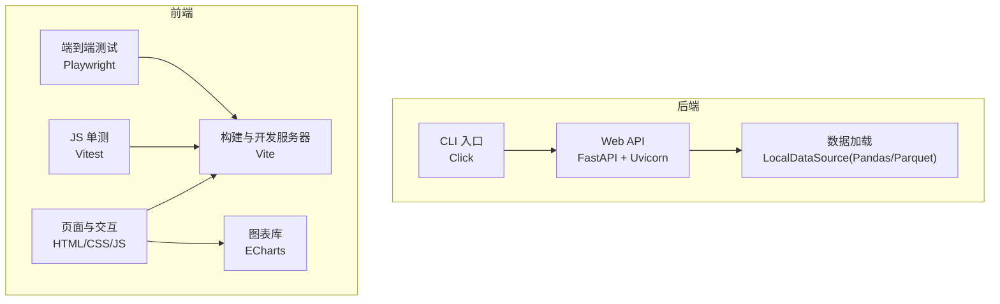
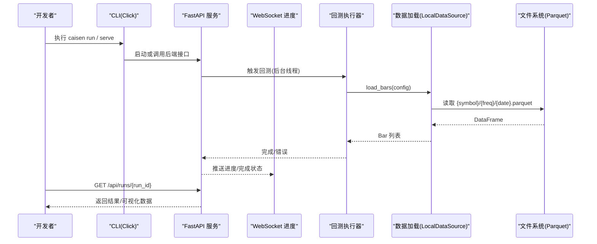
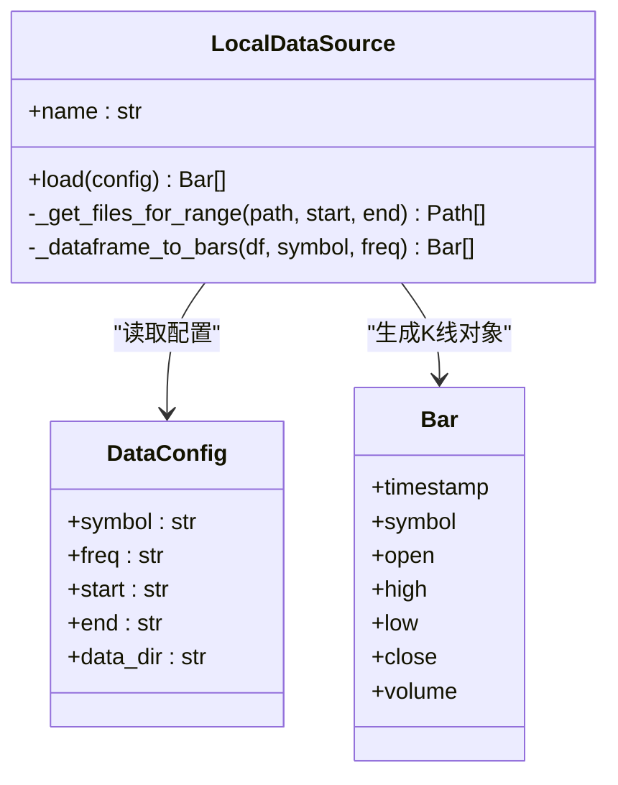
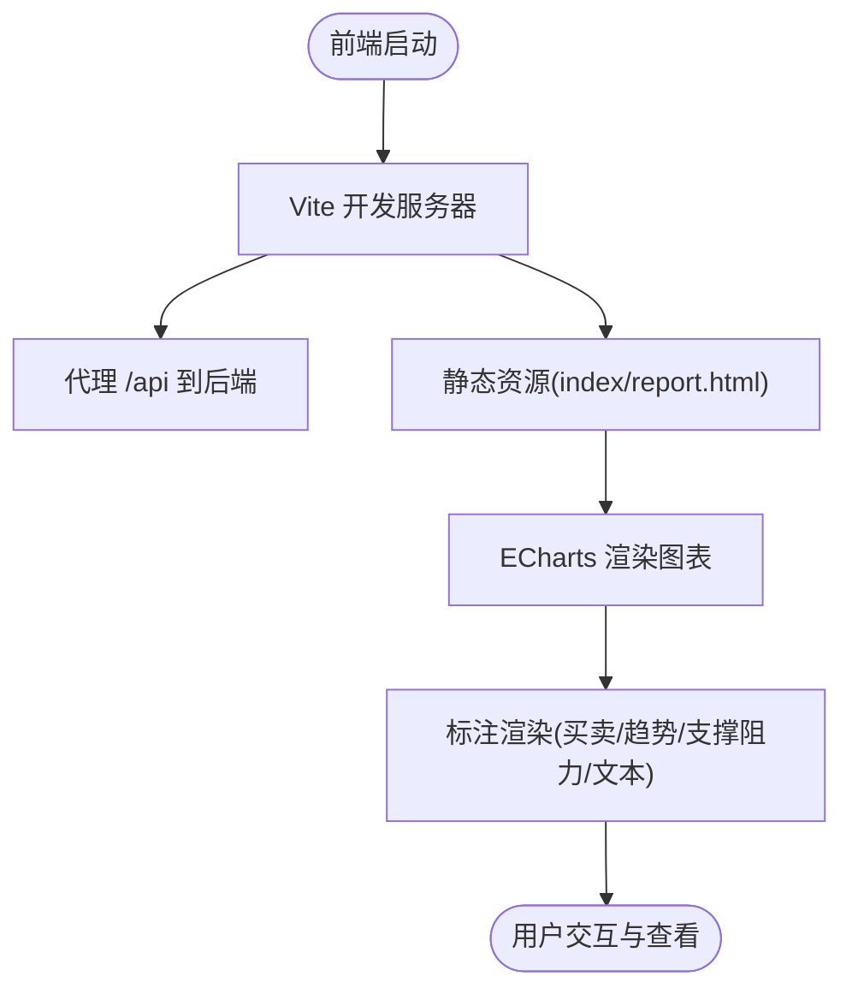
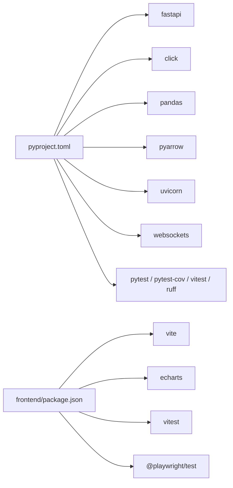

# 技术栈

<cite>
**本文引用的文件**   
- [pyproject.toml](file://pyproject.toml)
- [README.md](file://README.md)
- [src/caisen/cli/main.py](file://src/caisen/cli/main.py)
- [src/caisen/web/main.py](file://src/caisen/web/main.py)
- [src/caisen/data/local_source.py](file://src/caisen/data/local_source.py)
- [src/caisen/data/__init__.py](file://src/caisen/data/__init__.py)
- [src/caisen/frontend/package.json](file://src/caisen/frontend/package.json)
- [src/caisen/frontend/vite.config.js](file://src/caisen/frontend/vite.config.js)
- [src/caisen/frontend/src/js/annotation-schema.js](file://src/caisen/frontend/src/js/annotation-schema.js)
- [src/caisen/frontend/src/js/annotation-renderer.js](file://src/caisen/frontend/src/js/annotation-renderer.js)
- [docs/adr/0002-parquet-data-storage.md](file://docs/adr/0002-parquet-data-storage.md)
- [tests/test_web_api.py](file://tests/test_web_api.py)
- [tests/test_path_traversal.py](file://tests/test_path_traversal.py)
</cite>

## 目录
1. [简介](#简介)
2. [项目结构](#项目结构)
3. [核心组件](#核心组件)
4. [架构总览](#架构总览)
5. [详细组件分析](#详细组件分析)
6. [依赖关系分析](#依赖关系分析)
7. [性能考量](#性能考量)
8. [故障排查指南](#故障排查指南)
9. [结论](#结论)
10. [附录](#附录)

## 简介
本技术栈文档面向 Caisen 量化回测系统，聚焦后端与前端技术选型、职责边界与协作方式，并给出版本兼容性与依赖管理最佳实践。系统以 Python 3.10+ 为运行基线，采用 FastAPI 提供 Web API，Click 构建 CLI 工具；数据处理层基于 Pandas 与 PyArrow Parquet 实现高性能列式存储与读取；前端使用 Vite 构建、ECharts 渲染图表、Vitest 进行单元测试，并通过 Playwright 完成端到端测试。

## 项目结构
- 后端入口：CLI 命令通过 Click 组织，Web 服务由 FastAPI 提供，Uvicorn 作为 ASGI 服务器。
- 数据层：本地 Parquet 数据源按品种/频率/日期分区，Pandas 负责 DataFrame 读写与类型转换。
- 前端工程：Vite 开发/构建，ECharts 用于 K 线图与净值曲线等可视化，Vitest 执行 JS 单测，Playwright 执行 E2E。
- 配置与打包：pyproject.toml 统一声明运行时与开发依赖，Hatchling 构建 wheel，并将前端 dist 产物纳入包内分发。

图示来源
- [pyproject.toml:1-59](file://pyproject.toml#L1-L59)
- [src/caisen/cli/main.py:1-120](file://src/caisen/cli/main.py#L1-L120)
- [src/caisen/web/main.py:68-120](file://src/caisen/web/main.py#L68-L120)
- [src/caisen/data/local_source.py:1-80](file://src/caisen/data/local_source.py#L1-L80)
- [src/caisen/frontend/package.json:1-26](file://src/caisen/frontend/package.json#L1-L26)
- [src/caisen/frontend/vite.config.js:1-43](file://src/caisen/frontend/vite.config.js#L1-L43)

章节来源
- [pyproject.toml:1-59](file://pyproject.toml#L1-L59)
- [README.md:1-120](file://README.md#L1-L120)

## 核心组件
- 后端运行时
  - Python 3.10+：语言基线，确保现代语法与类型提示能力。
  - FastAPI：异步 Web 框架，提供 REST 与 WebSocket 接口，便于前后端解耦与实时进度推送。
  - Uvicorn：ASGI 服务器，承载 FastAPI 应用。
  - Click：命令行工具集，封装 run/list-runs/show-result/serve 等常用操作。
- 数据处理
  - Pandas：DataFrame 计算与列名映射（支持中英文），将 Parquet 转换为内部 Bar 对象。
  - PyArrow/Parquet：列式存储，高压缩比与高效查询，适合时序行情数据。
- 前端工程
  - Vite：快速开发与生产构建，支持模块热替换与多入口打包。
  - ECharts：金融图表渲染，支撑 K 线、净值曲线、标注体系。
  - Vitest：JS 单测框架，配合 jsdom 环境执行 DOM 相关逻辑。
  - Playwright：浏览器级端到端测试，覆盖关键用户流程。
- 质量与效率
  - pytest：Python 侧测试框架，结合 pytest-cov 生成覆盖率报告。
  - Ruff：代码检查与规则选择（pyflakes/pycodestyle/isort/pyupgrade/flake8-bugbear）。
  - Black：代码格式化（在 README 中提供示例命令，便于团队统一风格）。

章节来源
- [pyproject.toml:10-30](file://pyproject.toml#L10-L30)
- [src/caisen/cli/main.py:63-120](file://src/caisen/cli/main.py#L63-L120)
- [src/caisen/web/main.py:68-120](file://src/caisen/web/main.py#L68-L120)
- [src/caisen/data/local_source.py:1-80](file://src/caisen/data/local_source.py#L1-L80)
- [src/caisen/frontend/package.json:1-26](file://src/caisen/frontend/package.json#L1-L26)
- [src/caisen/frontend/vite.config.js:1-43](file://src/caisen/frontend/vite.config.js#L1-L43)
- [README.md:368-396](file://README.md#L368-L396)

## 架构总览
后端通过 FastAPI 暴露策略列表、数据源扫描、回测任务创建与结果查询等接口；WebSocket 提供回测进度推送。前端通过 Vite 启动开发服务器，静态资源与 API 代理到后端。数据层从本地 Parquet 读取并按日期范围过滤，返回给引擎与持久化模块。

图示来源
- [src/caisen/web/main.py:107-132](file://src/caisen/web/main.py#L107-L132)
- [src/caisen/web/main.py:247-302](file://src/caisen/web/main.py#L247-L302)
- [src/caisen/data/__init__.py:34-49](file://src/caisen/data/__init__.py#L34-L49)
- [src/caisen/data/local_source.py:39-80](file://src/caisen/data/local_source.py#L39-L80)

## 详细组件分析

### 后端技术栈与职责
- FastAPI + Uvicorn
  - 职责：定义路由、中间件（CORS）、请求校验（Pydantic）、文件响应、WebSocket 长连接。
  - 关键点：路径安全校验（防路径遍历）、健康检查、静态资源转发。
- Click CLI
  - 职责：封装 run、list-runs、show-result、web(report)、optimize 等命令，协调配置加载、策略解析、数据获取与结果输出。
  - 关键点：支持模拟数据、内置策略动态导入、参数优化网格搜索。
- 数据加载（Pandas + PyArrow）
  - 职责：按 symbol/freq/date 定位 Parquet 文件，读取为 DataFrame，映射列名（中英混写），构造 Bar 对象，按时间排序。
  - 关键点：日期范围过滤、文件名模式匹配（单日/区间）、异常分类抛出。

图示来源
- [src/caisen/data/local_source.py:15-80](file://src/caisen/data/local_source.py#L15-L80)
- [src/caisen/data/local_source.py:139-199](file://src/caisen/data/local_source.py#L139-L199)

章节来源
- [src/caisen/web/main.py:68-120](file://src/caisen/web/main.py#L68-L120)
- [src/caisen/cli/main.py:63-120](file://src/caisen/cli/main.py#L63-L120)
- [src/caisen/data/local_source.py:1-80](file://src/caisen/data/local_source.py#L1-L80)
- [src/caisen/data/__init__.py:34-49](file://src/caisen/data/__init__.py#L34-L49)

### 前端技术栈与职责
- Vite
  - 职责：开发服务器、代理后端 API、多入口构建（index.html/report.html）、别名与测试环境配置。
- ECharts
  - 职责：K 线图、净值曲线、标注渲染（买卖信号、趋势线、支撑/阻力区、文本标签等）。
- Vitest + jsdom
  - 职责：JS 单测，覆盖工具函数、常量、面板逻辑等。
- Playwright
  - 职责：端到端测试，验证页面加载、交互与数据展示。

图示来源
- [src/caisen/frontend/vite.config.js:1-43](file://src/caisen/frontend/vite.config.js#L1-L43)
- [src/caisen/frontend/src/js/annotation-schema.js:33-102](file://src/caisen/frontend/src/js/annotation-schema.js#L33-L102)
- [src/caisen/frontend/src/js/annotation-renderer.js:287-375](file://src/caisen/frontend/src/js/annotation-renderer.js#L287-L375)

章节来源
- [src/caisen/frontend/package.json:1-26](file://src/caisen/frontend/package.json#L1-L26)
- [src/caisen/frontend/vite.config.js:1-43](file://src/caisen/frontend/vite.config.js#L1-L43)
- [src/caisen/frontend/src/js/annotation-schema.js:33-102](file://src/caisen/frontend/src/js/annotation-schema.js#L33-L102)
- [src/caisen/frontend/src/js/annotation-renderer.js:287-375](file://src/caisen/frontend/src/js/annotation-renderer.js#L287-L375)

### 开发工具链与质量保障
- pytest + pytest-cov：Python 侧测试与覆盖率统计。
- Ruff：统一的 lint 规则集合（F/E/W/I/UP/B），忽略行过长与默认参数调用等特定规则。
- Black：代码格式化（README 提供示例命令）。
- Vitest：前端 JS 单测，jsdom 环境支持 DOM 操作。
- Playwright：E2E 测试，保证关键流程稳定。

章节来源
- [pyproject.toml:24-49](file://pyproject.toml#L24-L49)
- [README.md:368-396](file://README.md#L368-L396)
- [src/caisen/frontend/package.json:1-26](file://src/caisen/frontend/package.json#L1-L26)

## 依赖关系分析
- 运行时依赖
  - pyyaml：YAML 配置解析。
  - pandas：DataFrame 处理与列名映射。
  - pyarrow：Parquet 读写后端。
  - click：CLI 命令组织。
  - fastapi：Web API 框架。
  - uvicorn：ASGI 服务器。
  - websockets：WebSocket 支持。
- 开发依赖
  - pytest、pytest-cov：测试与覆盖率。
  - vitest：前端单测。
  - ruff：代码检查。
- 构建与打包
  - hatchling：Python 包构建。
  - vite：前端构建与开发。

图示来源
- [pyproject.toml:10-30](file://pyproject.toml#L10-L30)
- [src/caisen/frontend/package.json:1-26](file://src/caisen/frontend/package.json#L1-L26)

章节来源
- [pyproject.toml:10-30](file://pyproject.toml#L10-L30)
- [src/caisen/frontend/package.json:1-26](file://src/caisen/frontend/package.json#L1-L26)

## 性能考量
- 数据存储：Parquet 列式存储具备高压缩率与高效查询特性，适合时序数据按日期分区访问模式。
- 数据加载：Pandas 读取 Parquet 后批量转换为 Bar 对象，减少频繁 IO 与类型转换开销。
- 并发与异步：FastAPI 与 Uvicorn 提供异步处理能力；WebSocket 推送避免轮询开销。
- 前端渲染：ECharts 对大数据量有良好表现，建议按需分页或采样以提升交互流畅度。

章节来源
- [docs/adr/0002-parquet-data-storage.md:1-11](file://docs/adr/0002-parquet-data-storage.md#L1-L11)
- [src/caisen/data/local_source.py:67-80](file://src/caisen/data/local_source.py#L67-L80)

## 故障排查指南
- 路径遍历防护
  - 现象：访问 /api/runs/{run_id} 或静态资源时出现非法路径字符或逃逸 base_dir。
  - 原因：未通过 _safe_resolve 校验或输入包含 ..、/、\。
  - 解决：仅允许纯文件名，确保解析后仍在允许目录范围内。
- 健康检查
  - 现象：/health 返回非 200。
  - 排查：确认 Uvicorn 进程正常、端口未被占用。
- 数据缺失
  - 现象：无数据或 DataNotFoundError。
  - 排查：确认 data_dir 下存在 {symbol}/{freq}/{date}.parquet，且列名满足要求（timestamp/open/high/low/close/volume）。
- 前端代理
  - 现象：前端无法调用 /api。
  - 排查：检查 VITE_API_PROXY 环境变量与 vite.config.js 的 proxy 配置是否指向后端端口。

章节来源
- [src/caisen/web/main.py:28-39](file://src/caisen/web/main.py#L28-L39)
- [tests/test_path_traversal.py:15-52](file://tests/test_path_traversal.py#L15-L52)
- [tests/test_web_api.py:19-26](file://tests/test_web_api.py#L19-L26)
- [src/caisen/data/local_source.py:53-65](file://src/caisen/data/local_source.py#L53-L65)
- [src/caisen/frontend/vite.config.js:21-29](file://src/caisen/frontend/vite.config.js#L21-L29)

## 结论
Caisen 的技术栈围绕“高性能数据存取 + 现代化 Web 服务 + 可维护的前端工程”展开：后端以 FastAPI/Uvicorn 提供稳定接口与实时推送，Click 简化日常操作；数据层依托 Pandas/Parquet 提升吞吐与可读性；前端以 Vite/ECharts/Vitest/Playwright 形成完整开发与测试闭环。通过 pyproject.toml 与 package.json 统一管理依赖，结合 Ruff/pytest/black 等工具保障代码质量与一致性。

## 附录
- 版本兼容性
  - Python：>=3.10（pyproject.toml 声明）。
  - 前端：Vite ^5.0.0、Vitest ^1.0.0、ECharts ^5.4.3、Playwright ^1.40.0。
- 依赖管理最佳实践
  - 使用 pyproject.toml 集中声明运行时与可选开发依赖，安装时使用 pip install -e ".[dev]"。
  - 前端依赖通过 package.json 管理，开发时 npm run dev，构建时 npm run build。
  - 保持前后端端口分离（默认前端 8000、后端 8001），通过 Vite 代理 /api。
  - 定期更新依赖并关注安全公告，优先锁定小版本以避免破坏性变更。

章节来源
- [pyproject.toml:10-30](file://pyproject.toml#L10-L30)
- [src/caisen/frontend/package.json:1-26](file://src/caisen/frontend/package.json#L1-L26)
- [README.md:20-40](file://README.md#L20-L40)