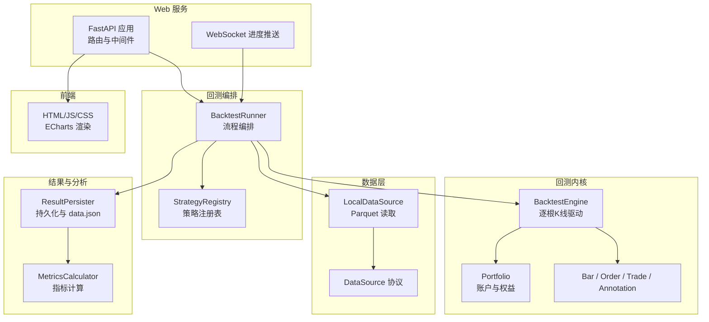
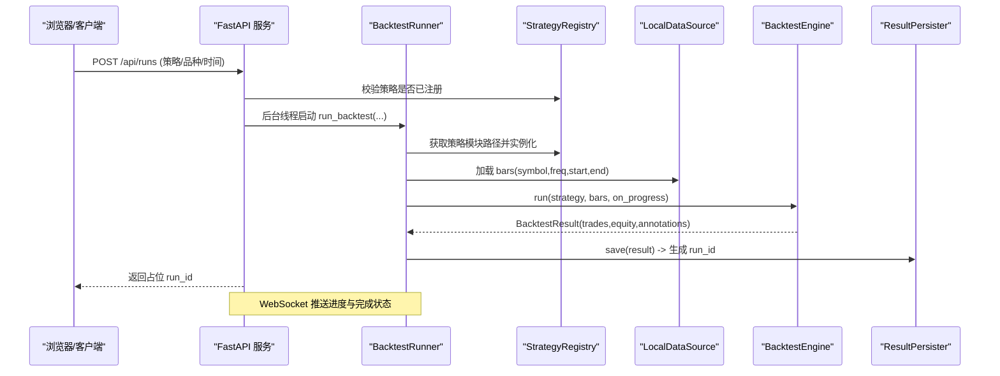
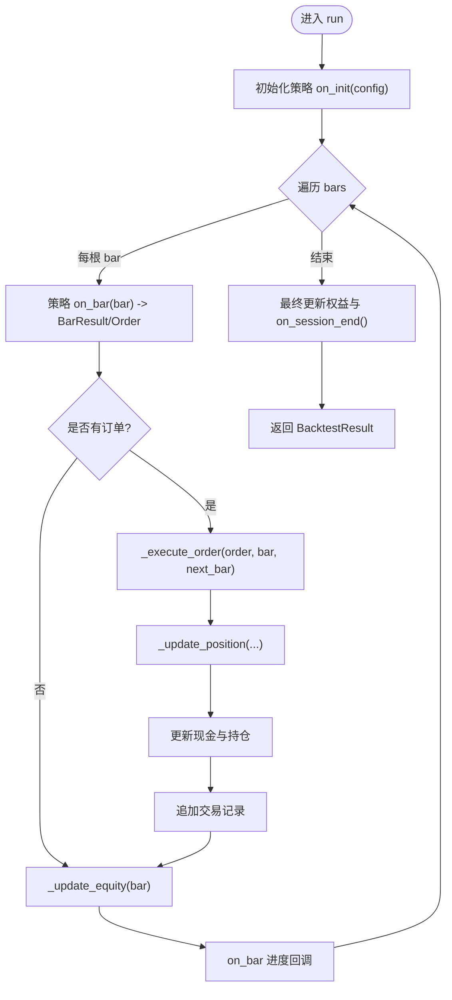
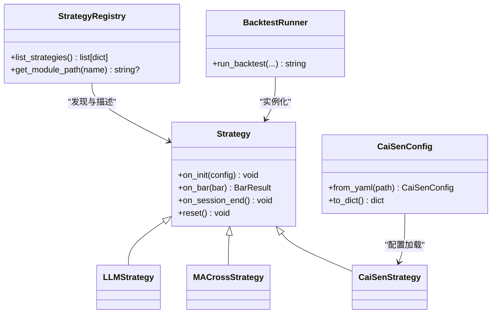
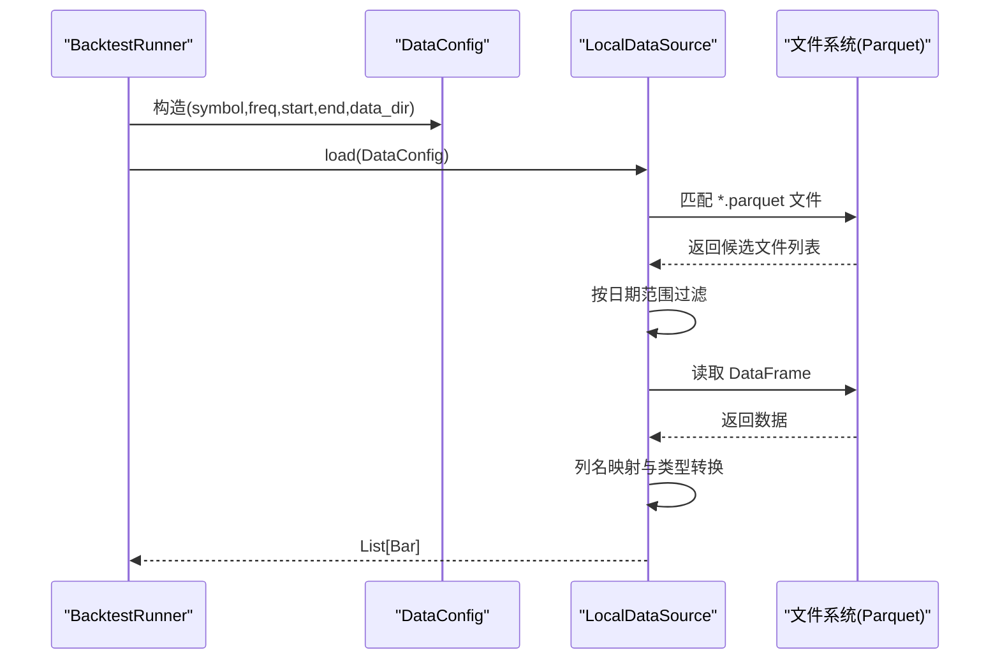
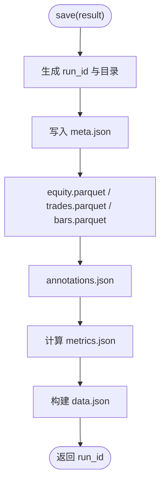
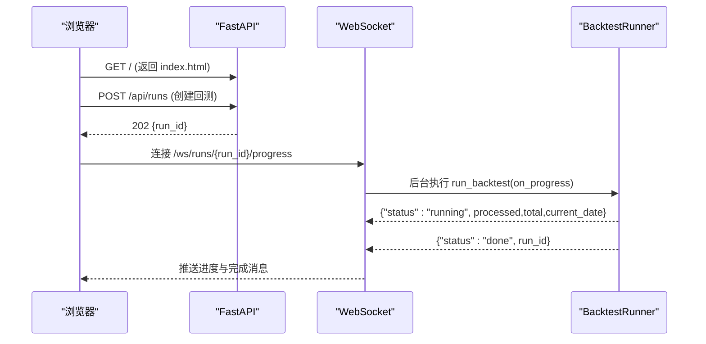
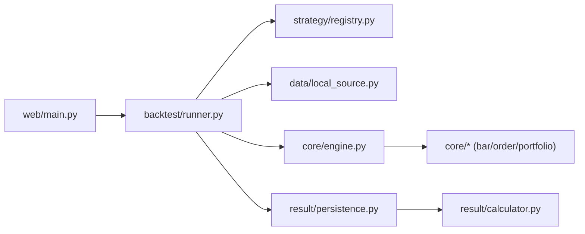

# 架构总览

<cite>
**本文引用的文件**   
- [README.md](file://README.md)
- [engine.py](file://src/caisen/core/engine.py)
- [runner.py](file://src/caisen/backtest/runner.py)
- [base.py](file://src/caisen/strategy/base.py)
- [registry.py](file://src/caisen/strategy/registry.py)
- [source.py](file://src/caisen/data/source.py)
- [local_source.py](file://src/caisen/data/local_source.py)
- [persistence.py](file://src/caisen/result/persistence.py)
- [main.py](file://src/caisen/web/main.py)
- [project.yaml](file://configs/project.yaml)
- [caisen_config.py](file://src/caisen/strategy/algorithm/caisen_config.py)
- [bar.py](file://src/caisen/core/bar.py)
- [order.py](file://src/caisen/core/order.py)
- [portfolio.py](file://src/caisen/core/portfolio.py)
</cite>

## 目录
1. [引言](#引言)
2. [项目结构](#项目结构)
3. [核心组件](#核心组件)
4. [架构总览](#架构总览)
5. [详细组件分析](#详细组件分析)
6. [依赖关系分析](#依赖关系分析)
7. [性能与可扩展性](#性能与可扩展性)
8. [故障排查指南](#故障排查指南)
9. [结论](#结论)
10. [附录](#附录)

## 引言
本架构总览面向不同层次的读者，系统性地阐述 Caisen 量化回测系统的整体设计、分层架构与模块化组织原则。文档覆盖回测引擎、策略框架、数据管理、结果分析与可视化等关键模块的职责分工与交互关系；解释插件化扩展机制；并说明技术栈（Python + JavaScript + FastAPI + ECharts）的选择原因与优势。文末提供架构图与组件关系图，帮助开发者快速理解整体思路与落地路径。

## 项目结构
Caisen 采用“按领域分层 + 模块化”的组织方式：
- 核心层（core）：定义回测内核的数据模型与执行引擎，包括 K 线、订单、持仓、组合、注解与回测配置等。
- 策略层（strategy）：提供策略基类、内置策略（代码策略与 LLM 策略）、策略注册表与参数配置加载器。
- 数据层（data）：抽象数据源协议与本地 Parquet 数据源实现，支持日期范围筛选与列名兼容。
- 结果层（result）：负责指标计算、结果持久化与前端可视化数据生成。
- Web 服务（web）：基于 FastAPI 的 HTTP/WebSocket 接口，提供运行回测、查询结果、进度推送与静态资源服务。
- 前端（frontend）：HTML + JS + CSS + ECharts 渲染报告页面，消费后端 API 展示图表与标注。
- 配置（configs）：全局项目配置与策略预设参数。

**图示来源** 
- [main.py:68-304](file://src/caisen/web/main.py#L68-L304)
- [runner.py:26-94](file://src/caisen/backtest/runner.py#L26-L94)
- [engine.py:19-91](file://src/caisen/core/engine.py#L19-L91)
- [source.py:10-62](file://src/caisen/data/source.py#L10-L62)
- [local_source.py:15-80](file://src/caisen/data/local_source.py#L15-L80)
- [persistence.py:59-133](file://src/caisen/result/persistence.py#L59-L133)

**章节来源**
- [README.md:1-120](file://README.md#L1-L120)
- [project.yaml:1-13](file://configs/project.yaml#L1-L13)

## 核心组件
- 回测引擎（BacktestEngine）：逐根驱动 K 线，调用策略 on_bar，执行订单、更新持仓与净值曲线，收集交易与标注，最终产出 BacktestResult。
- 策略框架（Strategy 基类）：定义 on_init/on_bar/on_session_end 生命周期钩子，统一返回 BarResult（含订单与标注），兼容旧版 Order 返回。
- 数据源（DataSource 协议 + LocalDataSource）：抽象数据加载接口，本地实现从 Parquet 读取并按日期范围过滤，支持中英文列名映射。
- 结果持久化（ResultPersister）：生成 run_id、保存 meta/equity/trades/annotations/bars/data.json/metrics.json，并提供列表与加载能力。
- Web 服务（FastAPI）：提供 REST 与 WebSocket 接口，后台线程触发回测，实时推送进度，安全校验路径，提供静态资源访问。
- 策略注册表（StrategyRegistry）：扫描内置策略、提取参数 schema、列出可用策略与配置预设，供前端选择与运行时实例化。

**章节来源**
- [engine.py:19-91](file://src/caisen/core/engine.py#L19-L91)
- [base.py:19-37](file://src/caisen/strategy/base.py#L19-L37)
- [source.py:10-62](file://src/caisen/data/source.py#L10-L62)
- [local_source.py:15-80](file://src/caisen/data/local_source.py#L15-L80)
- [persistence.py:59-133](file://src/caisen/result/persistence.py#L59-L133)
- [main.py:68-304](file://src/caisen/web/main.py#L68-L304)
- [registry.py:108-143](file://src/caisen/strategy/registry.py#L108-L143)

## 架构总览
系统采用清晰的分层与解耦设计：
- 表现层（Web + 前端）：通过 FastAPI 暴露 API，前端使用 ECharts 渲染图表与标注。
- 编排层（Runner）：封装完整回测流程，协调策略实例化、数据加载、引擎运行与结果持久化。
- 内核层（Engine + Core Types）：专注逐根 K 线驱动、订单执行、持仓与权益计算。
- 数据层（Data Source）：以协议隔离数据来源，当前实现为本地 Parquet。
- 结果层（Persistence + Metrics）：标准化输出与指标计算，便于前后端复用。

**图示来源** 
- [main.py:107-132](file://src/caisen/web/main.py#L107-L132)
- [runner.py:26-94](file://src/caisen/backtest/runner.py#L26-L94)
- [registry.py:108-143](file://src/caisen/strategy/registry.py#L108-L143)
- [local_source.py:39-80](file://src/caisen/data/local_source.py#L39-L80)
- [engine.py:33-91](file://src/caisen/core/engine.py#L33-L91)
- [persistence.py:62-133](file://src/caisen/result/persistence.py#L62-L133)

## 详细组件分析

### 回测引擎与数据流
- 引擎职责：初始化策略、遍历 K 线、处理策略决策、执行订单、更新持仓与权益、记录交易与标注、回调进度。
- 订单执行：考虑滑点与手续费，根据 quantity 或 position_pct 计算实际成交数量，维护多空头仓位与均价。
- 净值曲线：每根 K 线后按最新价格估算权益，形成时序序列。

**图示来源** 
- [engine.py:33-91](file://src/caisen/core/engine.py#L33-L91)
- [engine.py:93-210](file://src/caisen/core/engine.py#L93-L210)

**章节来源**
- [engine.py:19-210](file://src/caisen/core/engine.py#L19-L210)
- [order.py:10-44](file://src/caisen/core/order.py#L10-L44)
- [portfolio.py:7-46](file://src/caisen/core/portfolio.py#L7-L46)
- [bar.py:8-38](file://src/caisen/core/bar.py#L8-L38)

### 策略框架与插件化
- 策略基类：定义 on_init/on_bar/on_session_end 生命周期，统一返回 BarResult（包含订单与标注），兼容旧版直接返回 Order/None。
- 策略注册表：集中声明内置策略（代码策略与 LLM 策略），动态导入并提取参数 schema，同时扫描 configs/strategies 下的预设 YAML。
- 参数注入：Runner 支持从 YAML 预设或 params 字典注入参数，优先顺序为 params > config_name > 默认值，并通过反射过滤 __init__ 签名。

**图示来源** 
- [base.py:19-37](file://src/caisen/strategy/base.py#L19-L37)
- [registry.py:108-143](file://src/caisen/strategy/registry.py#L108-L143)
- [caisen_config.py:11-145](file://src/caisen/strategy/algorithm/caisen_config.py#L11-L145)
- [runner.py:124-143](file://src/caisen/backtest/runner.py#L124-L143)

**章节来源**
- [base.py:1-37](file://src/caisen/strategy/base.py#L1-L37)
- [registry.py:1-143](file://src/caisen/strategy/registry.py#L1-L143)
- [caisen_config.py:1-145](file://src/caisen/strategy/algorithm/caisen_config.py#L1-L145)
- [runner.py:97-143](file://src/caisen/backtest/runner.py#L97-L143)

### 数据管理与加载
- 数据源协议：定义 load(DataConfig) -> List[Bar] 与 name 属性，便于扩展新的数据源。
- 本地数据源：从 {data_dir}/{symbol}/{freq}/*.parquet 读取，支持单日与区间命名模式，按日期范围过滤，兼容中英文列名映射。
- 加载流程：Runner 构造 DataConfig，调用 load_bars 聚合多文件，若为空则抛出明确错误。

**图示来源** 
- [runner.py:146-163](file://src/caisen/backtest/runner.py#L146-L163)
- [source.py:10-62](file://src/caisen/data/source.py#L10-L62)
- [local_source.py:39-80](file://src/caisen/data/local_source.py#L39-L80)
- [local_source.py:139-199](file://src/caisen/data/local_source.py#L139-L199)

**章节来源**
- [source.py:1-62](file://src/caisen/data/source.py#L1-L62)
- [local_source.py:1-199](file://src/caisen/data/local_source.py#L1-L199)
- [runner.py:146-163](file://src/caisen/backtest/runner.py#L146-L163)

### 结果分析与可视化
- 持久化：生成 run_id，保存 meta/equity/trades/annotations/bars/data.json/metrics.json，data.json 专为前端可视化准备。
- 指标计算：基于交易与净值曲线计算年化收益、最大回撤、夏普比率、胜率、盈亏比等。
- Web 接口：提供 /api/runs、/api/runs/{run_id}、/api/runs/{run_id}/visualization 等，支持健康检查与静态资源访问。

**图示来源** 
- [persistence.py:62-133](file://src/caisen/result/persistence.py#L62-L133)
- [persistence.py:135-202](file://src/caisen/result/persistence.py#L135-L202)
- [main.py:185-214](file://src/caisen/web/main.py#L185-L214)

**章节来源**
- [persistence.py:1-274](file://src/caisen/result/persistence.py#L1-L274)
- [main.py:185-214](file://src/caisen/web/main.py#L185-L214)

### Web 服务与前端集成
- FastAPI 应用：定义路由、CORS、静态资源与安全路径解析，提供健康检查。
- 异步运行：POST /api/runs 立即返回占位 run_id，后台线程执行回测；WebSocket /ws/runs/{run_id}/progress 实时推送进度与终态。
- 前端：index.html 与 report.html 由后端直接返回，JS/CSS 通过专用路由提供，ECharts 渲染 K 线、净值曲线与标注。

**图示来源** 
- [main.py:86-94](file://src/caisen/web/main.py#L86-L94)
- [main.py:107-132](file://src/caisen/web/main.py#L107-L132)
- [main.py:247-302](file://src/caisen/web/main.py#L247-L302)
- [runner.py:80-94](file://src/caisen/backtest/runner.py#L80-L94)

**章节来源**
- [main.py:1-319](file://src/caisen/web/main.py#L1-L319)

## 依赖关系分析
- 耦合与内聚：
  - Runner 作为编排中心，低耦合地组合 Registry、Data Source、Engine 与 Persister。
  - Engine 仅依赖 core 类型与 Portfolio，保持高内聚的回测逻辑。
  - Data Source 通过 Protocol 抽象，降低对具体实现的依赖。
- 外部依赖：
  - FastAPI 与 Uvicorn 提供高性能异步服务。
  - Pandas/PyArrow 用于 Parquet 读写与数据处理。
  - PyYAML 用于策略参数预设加载。
- 潜在循环依赖：
  - engine.py 延迟导入 result.types.BacktestResult，避免与 result 模块的循环引用。

**图示来源** 
- [main.py:68-304](file://src/caisen/web/main.py#L68-L304)
- [runner.py:26-94](file://src/caisen/backtest/runner.py#L26-L94)
- [engine.py:19-91](file://src/caisen/core/engine.py#L19-L91)
- [persistence.py:59-133](file://src/caisen/result/persistence.py#L59-L133)

**章节来源**
- [engine.py:1-20](file://src/caisen/core/engine.py#L1-L20)
- [runner.py:1-25](file://src/caisen/backtest/runner.py#L1-L25)

## 性能与可扩展性
- 性能特性：
  - 逐根 K 线驱动，内存友好；净值曲线与交易记录增量写入。
  - Parquet 高效存储与读取，适合大规模历史数据。
  - WebSocket 推送减少轮询开销，提升用户体验。
- 可扩展性：
  - 新增数据源：实现 DataSource 协议并在入口注册（或通过现有加载机制）。
  - 新增策略：继承 Strategy 基类，注册到 StrategyRegistry 或在内置清单添加。
  - 参数优化：通过 configs/strategies/*.yaml 预设与 Runner 的参数注入机制灵活调整。
- 建议优化：
  - 大数据量下可引入分块读取与并行预处理。
  - 指标计算可缓存中间结果，避免重复计算。
  - 前端大图表可采用分页或按需加载。

[本节为通用指导，不直接分析具体文件]

## 故障排查指南
- 数据为空：当指定 symbol/freq/start/end 无匹配文件时，Runner 会抛出明确错误；检查 data_dir 结构与文件名模式。
- 策略未注册：POST /api/runs 会校验策略是否在注册表中；确认策略类名与 registry 清单一致。
- 路径安全问题：Web 层对 run_id 与静态资源路径进行安全校验，防止路径穿越攻击。
- 进度超时：WebSocket 最长等待 5 分钟，若无消息将返回超时错误；检查后台线程与磁盘 IO。
- 结果缺失：若 meta.json 存在但 data.json 缺失，可通过 ResultPersister.save_visualization 重新生成。

**章节来源**
- [runner.py:77-79](file://src/caisen/backtest/runner.py#L77-L79)
- [main.py:107-132](file://src/caisen/web/main.py#L107-L132)
- [main.py:28-39](file://src/caisen/web/main.py#L28-L39)
- [main.py:247-302](file://src/caisen/web/main.py#L247-L302)
- [persistence.py:135-202](file://src/caisen/result/persistence.py#L135-L202)

## 结论
Caisen 通过清晰的层次划分与插件化设计，实现了高内聚、低耦合的回测系统。策略框架与数据源协议为扩展提供了良好基础；FastAPI + WebSocket 提升了交互体验；Parquet 与 ECharts 的组合兼顾了性能与可视化效果。建议在后续迭代中持续完善指标体系、增强前端交互与优化大数据场景下的性能。

[本节为总结性内容，不直接分析具体文件]

## 附录
- 技术栈选择与优势：
  - Python：丰富的金融数据处理生态（Pandas/PyArrow），易于实现复杂策略与指标。
  - JavaScript + ECharts：成熟的图表库，支持丰富的交互式可视化。
  - FastAPI：高性能异步框架，天然支持 WebSocket，便于实时进度推送。
  - Parquet：列式存储，压缩率高，读写速度快，适合海量行情数据。
- 配置要点：
  - 全局配置位于 configs/project.yaml，涵盖 data_dir、output_dir、api_port 等。
  - 策略预设参数位于 configs/strategies/*.yaml，Runner 自动合并与注入。

**章节来源**
- [project.yaml:1-13](file://configs/project.yaml#L1-L13)
- [README.md:1-120](file://README.md#L1-L120)