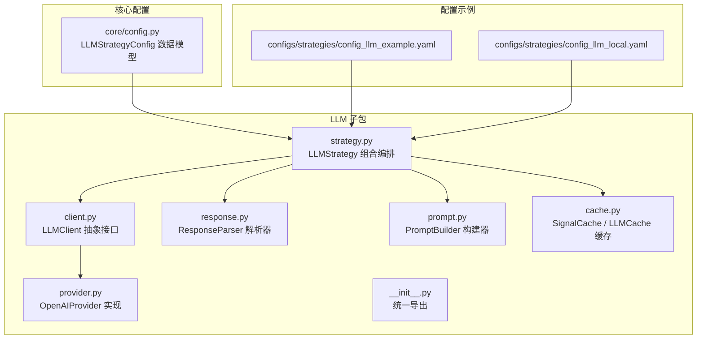
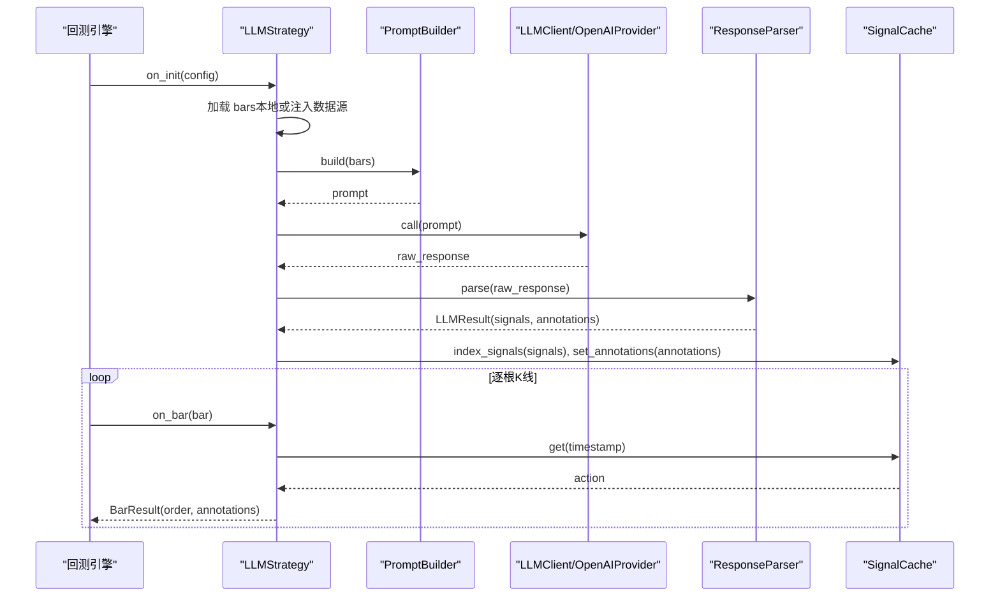
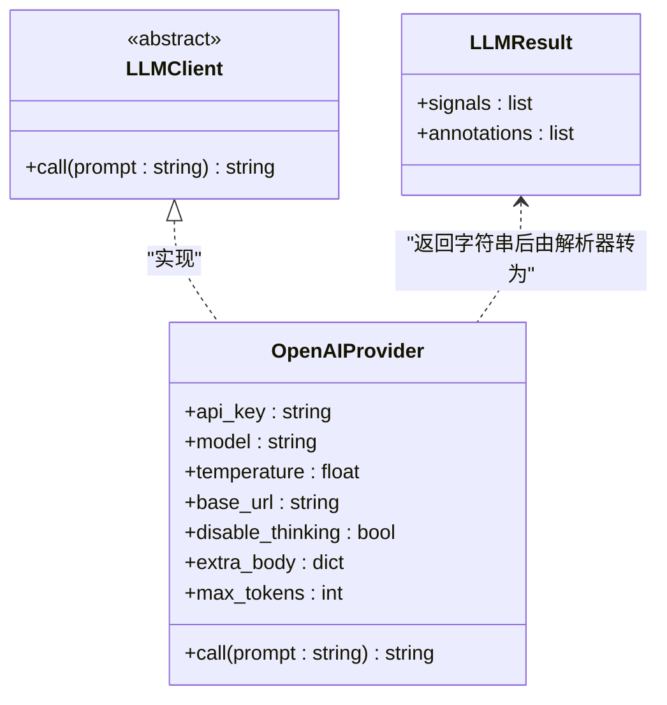
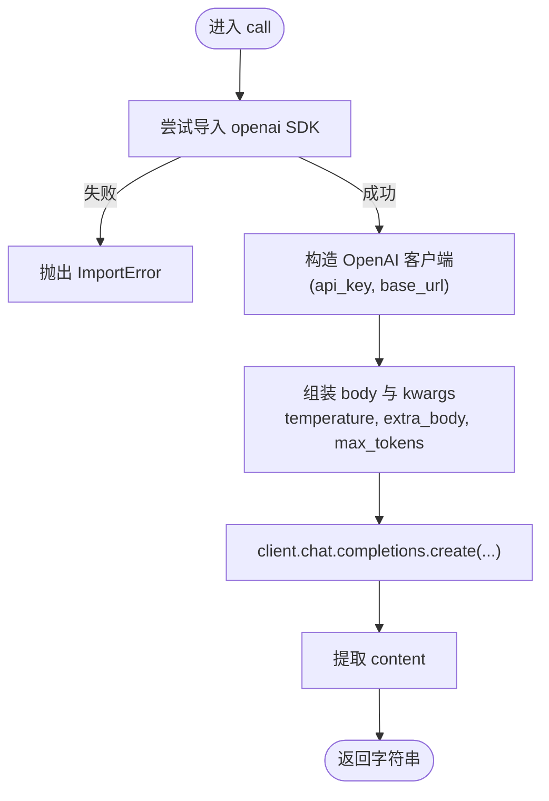
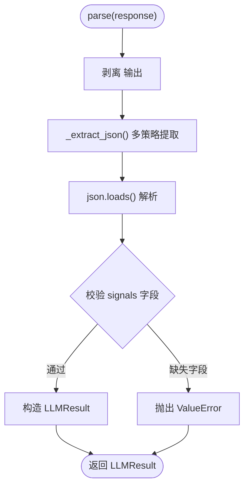
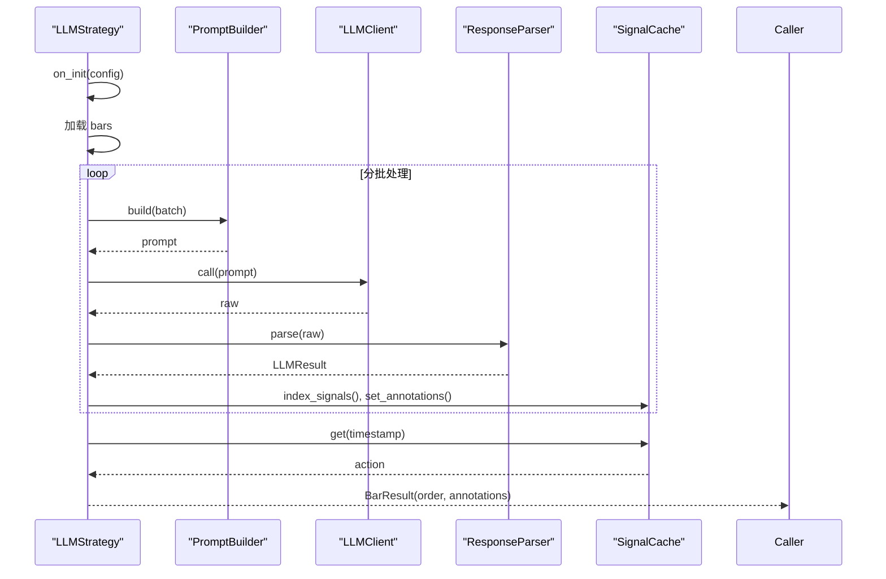
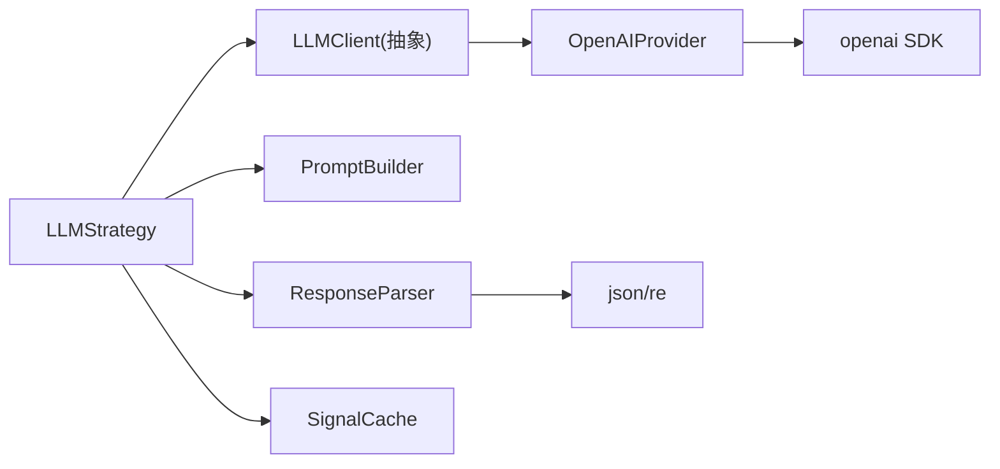

# LLM 客户端管理

<cite>
**本文引用的文件**   
- [client.py](file://src/caisen/strategy/llm/client.py)
- [provider.py](file://src/caisen/strategy/llm/provider.py)
- [response.py](file://src/caisen/strategy/llm/response.py)
- [cache.py](file://src/caisen/strategy/llm/cache.py)
- [prompt.py](file://src/caisen/strategy/llm/prompt.py)
- [strategy.py](file://src/caisen/strategy/llm/strategy.py)
- [__init__.py](file://src/caisen/strategy/llm/__init__.py)
- [config.py](file://src/caisen/core/config.py)
- [config_llm_example.yaml](file://configs/strategies/config_llm_example.yaml)
- [config_llm_local.yaml](file://configs/strategies/config_llm_local.yaml)
- [test_llm_client.py](file://tests/test_llm_client.py)
- [test_openai_provider.py](file://tests/test_openai_provider.py)
</cite>

## 目录
1. [简介](#简介)
2. [项目结构](#项目结构)
3. [核心组件](#核心组件)
4. [架构总览](#架构总览)
5. [详细组件分析](#详细组件分析)
6. [依赖关系分析](#依赖关系分析)
7. [性能与高级特性](#性能与高级特性)
8. [故障排查指南](#故障排查指南)
9. [结论](#结论)
10. [附录：配置示例与使用模式](#附录配置示例与使用模式)

## 简介
本文件面向 Caisen 量化回测系统的 LLM 客户端管理模块，聚焦以下目标：
- 解释 LLMClient 抽象基类的设计模式与接口规范
- 说明 OpenAIProvider 等具体提供商的实现细节
- 详述客户端初始化配置（API 密钥、模型选择、温度参数、base_url 等）
- 阐述批量请求处理机制与错误重试策略现状
- 提供多提供商切换的配置示例与使用模式
- 讨论连接池、超时、限流等高级特性的现状与建议
- 给出故障排查指南与性能优化建议

## 项目结构
LLM 客户端管理相关代码位于 strategy.llm 子包中，采用“职责分离 + 组合”的架构：
- client.py：定义 LLMClient 抽象接口与结果数据结构
- provider.py：OpenAIProvider 实现
- response.py：ResponseParser 负责响应解析与校验
- prompt.py：PromptBuilder 负责构建 Prompt
- strategy.py：LLMStrategy 组合上述组件，并实现离线预计算与逐帧回放
- cache.py：SignalCache 与 LLMCache 提供信号索引与持久化缓存
- __init__.py：统一导出对外 API
- core/config.py：LLMStrategyConfig 数据模型
- configs/strategies/*.yaml：YAML 配置示例

图示来源
- [client.py:21-38](file://src/caisen/strategy/llm/client.py#L21-L38)
- [provider.py:8-75](file://src/caisen/strategy/llm/provider.py#L8-L75)
- [response.py:79-128](file://src/caisen/strategy/llm/response.py#L79-L128)
- [prompt.py:15-153](file://src/caisen/strategy/llm/prompt.py#L15-L153)
- [strategy.py:15-235](file://src/caisen/strategy/llm/strategy.py#L15-L235)
- [cache.py:8-174](file://src/caisen/strategy/llm/cache.py#L8-L174)
- [__init__.py:1-19](file://src/caisen/strategy/llm/__init__.py#L1-L19)
- [config.py:27-56](file://src/caisen/core/config.py#L27-L56)
- [config_llm_example.yaml:1-40](file://configs/strategies/config_llm_example.yaml#L1-L40)
- [config_llm_local.yaml:1-36](file://configs/strategies/config_llm_local.yaml#L1-L36)

章节来源
- [client.py:21-38](file://src/caisen/strategy/llm/client.py#L21-L38)
- [provider.py:8-75](file://src/caisen/strategy/llm/provider.py#L8-L75)
- [response.py:79-128](file://src/caisen/strategy/llm/response.py#L79-L128)
- [prompt.py:15-153](file://src/caisen/strategy/llm/prompt.py#L15-L153)
- [strategy.py:15-235](file://src/caisen/strategy/llm/strategy.py#L15-L235)
- [cache.py:8-174](file://src/caisen/strategy/llm/cache.py#L8-L174)
- [__init__.py:1-19](file://src/caisen/strategy/llm/__init__.py#L1-L19)
- [config.py:27-56](file://src/caisen/core/config.py#L27-L56)
- [config_llm_example.yaml:1-40](file://configs/strategies/config_llm_example.yaml#L1-L40)
- [config_llm_local.yaml:1-36](file://configs/strategies/config_llm_local.yaml#L1-L36)

## 核心组件
- LLMClient 抽象接口
  - 单一职责：仅暴露 call(prompt: str) -> str，屏蔽底层差异
  - 便于替换不同提供商或 Mock 测试
- OpenAIProvider 实现
  - 基于 openai SDK，支持自定义 base_url（兼容 vLLM、Ollama 等）
  - 支持 temperature、max_tokens、disable_thinking、extra_body 等参数
- ResponseParser 解析器
  - 剥离推理模型的 <think> 输出
  - 从纯 JSON、Markdown 代码块、截断降级等多策略提取合法 JSON
  - 校验 signals 必需字段（timestamp、action），返回 LLMResult
- PromptBuilder 构建器
  - 组装系统提示、规则框架、Few-shot 示例、输出格式与 K 线数据
  - 默认使用蔡森专用模板，支持运行时注入示例
- LLMStrategy 编排者
  - 组合 PromptBuilder、LLMClient、ResponseParser
  - 支持 analyze(bars, batch_size) 分批调用，避免长序列导致截断
  - on_init 一次性加载数据并分析，on_bar 逐帧回放缓存结果
- 缓存层
  - SignalCache：按时间戳索引信号，快速查询 action
  - LLMCache：按 symbol/freq/start/end 生成 key，持久化完整结果

章节来源
- [client.py:21-38](file://src/caisen/strategy/llm/client.py#L21-L38)
- [provider.py:14-75](file://src/caisen/strategy/llm/provider.py#L14-L75)
- [response.py:10-128](file://src/caisen/strategy/llm/response.py#L10-L128)
- [prompt.py:15-153](file://src/caisen/strategy/llm/prompt.py#L15-L153)
- [strategy.py:98-179](file://src/caisen/strategy/llm/strategy.py#L98-L179)
- [cache.py:8-174](file://src/caisen/strategy/llm/cache.py#L8-L174)

## 架构总览
下图展示 LLMStrategy 在回测生命周期中的调用链与数据流向。

图示来源
- [strategy.py:131-225](file://src/caisen/strategy/llm/strategy.py#L131-L225)
- [prompt.py:54-116](file://src/caisen/strategy/llm/prompt.py#L54-L116)
- [provider.py:45-75](file://src/caisen/strategy/llm/provider.py#L45-L75)
- [response.py:88-113](file://src/caisen/strategy/llm/response.py#L88-L113)
- [cache.py:15-44](file://src/caisen/strategy/llm/cache.py#L15-L44)

## 详细组件分析

### LLMClient 抽象接口与 LLMResult
- 设计要点
  - 最小接口：call(prompt: str) -> str，解耦业务逻辑与网络调用
  - 结果类型：LLMResult 包含 signals 与 annotations，空值时默认空列表
- 复杂度
  - 构造与访问均为 O(1)，适合高频 on_bar 场景
- 扩展性
  - 新增 Provider 仅需实现 call 方法，无需改动上层编排

图示来源
- [client.py:21-38](file://src/caisen/strategy/llm/client.py#L21-L38)
- [provider.py:8-75](file://src/caisen/strategy/llm/provider.py#L8-L75)

章节来源
- [client.py:8-38](file://src/caisen/strategy/llm/client.py#L8-L38)
- [provider.py:8-75](file://src/caisen/strategy/llm/provider.py#L8-L75)

### OpenAIProvider 实现细节
- 初始化参数
  - api_key：支持本地部署 dummy key
  - model：默认 gpt-4o
  - temperature：控制随机性
  - base_url：默认 OpenAI，可指向本地 vLLM/Ollama 等
  - disable_thinking：为推理模型禁用 <think> 输出
  - extra_body：透传额外参数（优先级高于 disable_thinking）
  - max_tokens：避免 JSON 被截断
- 调用流程
  - 动态导入 openai SDK
  - 构造 OpenAI 客户端（含 base_url）
  - 组装消息体与参数，发起 chat.completions.create
  - 返回 choices[0].message.content
- 错误处理
  - 未安装 openai 包抛出 ImportError
  - 其他异常由上层捕获（当前未内置重试）

图示来源
- [provider.py:45-75](file://src/caisen/strategy/llm/provider.py#L45-L75)

章节来源
- [provider.py:14-75](file://src/caisen/strategy/llm/provider.py#L14-L75)

### ResponseParser 解析与校验
- 功能要点
  - _strip_thinking：剥离 <think>... 推理过程；若被截断则抛错
  - _extract_json：多策略提取 JSON（直接、markdown 代码块、最外层 {}、补全尾部）
  - parse：校验 signals 必需字段（timestamp、action），返回 LLMResult
  - parse_raw：仅做 JSON 提取与反序列化，不做业务校验
- 复杂度
  - 正则与字符串查找为主，整体近似 O(n)
- 健壮性
  - 对截断响应具备一定容错能力，但仍需结合 max_tokens 与批大小控制

图示来源
- [response.py:10-128](file://src/caisen/strategy/llm/response.py#L10-L128)

章节来源
- [response.py:10-128](file://src/caisen/strategy/llm/response.py#L10-L128)

### PromptBuilder 构建器
- 功能要点
  - 系统提示、规则框架、Few-shot 示例、输出格式、K 线数据拼接
  - 支持 from_template 工厂方法与 add_example/clear_examples 动态管理示例
- 注意事项
  - 推理模型开启 include_examples 会显著增加 thinking token 消耗，建议谨慎开启

章节来源
- [prompt.py:15-153](file://src/caisen/strategy/llm/prompt.py#L15-L153)

### LLMStrategy 编排与批量处理
- 关键流程
  - on_init：加载 bars（优先注入数据源，否则本地数据源），调用 analyze
  - analyze：按 batch_size 分批构建 prompt、调用 LLM、解析并合并结果
  - on_bar：根据缓存 action 生成 Order，并在首次调用时发出所有标注
- 批量处理
  - 默认 batch_size=20，避免长序列导致的截断与高 token 消耗
- 状态管理
  - position 记录持仓状态；_annotations_emitted 确保标注只发一次

图示来源
- [strategy.py:98-225](file://src/caisen/strategy/llm/strategy.py#L98-L225)
- [prompt.py:54-116](file://src/caisen/strategy/llm/prompt.py#L54-L116)
- [response.py:88-113](file://src/caisen/strategy/llm/response.py#L88-L113)
- [cache.py:15-44](file://src/caisen/strategy/llm/cache.py#L15-L44)

章节来源
- [strategy.py:98-225](file://src/caisen/strategy/llm/strategy.py#L98-L225)

### 缓存层：SignalCache 与 LLMCache
- SignalCache
  - 以 timestamp 为键索引 action，get 缺省时返回 hold
  - 支持 save/load 到 JSON 文件
- LLMCache
  - 按 symbol/freq/start/end 生成 key，保存/加载完整 LLMResult
  - clear 清空目录下 llm_*.json 文件

章节来源
- [cache.py:8-174](file://src/caisen/strategy/llm/cache.py#L8-L174)

## 依赖关系分析
- 内部依赖
  - LLMStrategy 依赖 PromptBuilder、LLMClient、ResponseParser、SignalCache
  - OpenAIProvider 依赖 openai SDK（可选安装）
  - ResponseParser 依赖标准库 json/re
- 外部依赖
  - openai（可选）
  - pyyaml（用于 Config.from_yaml）
- 耦合度
  - 通过抽象接口降低耦合，新增 Provider 不影响上层
- 循环依赖
  - 无直接循环依赖；LLMCache 在 load_result 中延迟导入 LLMResult，避免启动期循环

图示来源
- [strategy.py:15-235](file://src/caisen/strategy/llm/strategy.py#L15-L235)
- [provider.py:8-75](file://src/caisen/strategy/llm/provider.py#L8-L75)
- [response.py:79-128](file://src/caisen/strategy/llm/response.py#L79-L128)
- [cache.py:8-174](file://src/caisen/strategy/llm/cache.py#L8-L174)

章节来源
- [strategy.py:15-235](file://src/caisen/strategy/llm/strategy.py#L15-L235)
- [provider.py:8-75](file://src/caisen/strategy/llm/provider.py#L8-L75)
- [response.py:79-128](file://src/caisen/strategy/llm/response.py#L79-L128)
- [cache.py:8-174](file://src/caisen/strategy/llm/cache.py#L8-L174)

## 性能与高级特性
- 批量请求处理
  - analyze 支持按 batch_size 分批，减少单次 token 消耗与截断风险
  - 建议根据模型上下文长度与思考开销调优 batch_size
- 错误重试策略
  - 当前未内置重试；可在上层封装或使用装饰器实现指数退避
- 连接池管理
  - openai SDK 内部维护 HTTP 连接；如需更细粒度控制，可复用 OpenAI 实例
- 超时设置
  - 当前未显式设置超时；建议在调用处包装超时控制
- 限流控制
  - 当前未内置限流；可通过令牌桶/漏桶在上层实现
- 缓存命中
  - SignalCache 与 LLMCache 可显著降低重复计算成本，建议启用

章节来源
- [strategy.py:98-179](file://src/caisen/strategy/llm/strategy.py#L98-L179)
- [cache.py:88-174](file://src/caisen/strategy/llm/cache.py#L88-L174)

## 故障排查指南
- 无法解析 JSON
  - 现象：ValueError 提示无法提取合法 JSON
  - 排查：检查模型是否输出 <think> 且被截断；增大 max_tokens 或减小 batch_size
- 缺少必需字段
  - 现象：signal 缺少 timestamp 或 action
  - 排查：调整 Prompt 输出格式与规则，确保严格 JSON 输出
- 本地模型返回为空或被截断
  - 现象：响应在 <think> 阶段结束
  - 排查：设置 disable_thinking=true 或提高 max_tokens；确认 base_url 正确
- 未安装 openai 包
  - 现象：ImportError
  - 排查：pip install openai
- 环境变量未生效
  - 现象：api_key 为空
  - 排查：确认 YAML 中使用 ${VAR} 语法，并确保环境变量已设置

章节来源
- [response.py:10-128](file://src/caisen/strategy/llm/response.py#L10-L128)
- [provider.py:45-75](file://src/caisen/strategy/llm/provider.py#L45-L75)
- [strategy.py:70-96](file://src/caisen/strategy/llm/strategy.py#L70-L96)

## 结论
本模块通过清晰的抽象与组合，实现了 LLM 客户端的可插拔与可扩展。OpenAIProvider 提供了对 OpenAI 及兼容接口的良好支持，ResponseParser 增强了鲁棒性，LLMStrategy 将离线预计算与逐帧回放有机结合。针对生产环境，建议在上层补充重试、超时与限流等工程化能力，并结合缓存与批处理策略提升稳定性与吞吐。

## 附录：配置示例与使用模式
- 多提供商切换
  - 通过 LLMStrategyConfig.provider 指定提供商（当前实现支持 openai）
  - 通过 base_url 指向本地或第三方兼容端点
- 关键配置项
  - api_key：支持环境变量 ${OPENAI_API_KEY}
  - model：如 gpt-4o、gpt-4o-mini、本地模型名
  - temperature：0-1，控制随机性
  - base_url：默认 OpenAI，可改为 http://localhost:8080/v1
  - disable_thinking：禁用推理模型的 <think> 输出
  - max_tokens：避免 JSON 被截断
- 配置文件示例
  - 在线 OpenAI：参考 config_llm_example.yaml
  - 本地 vLLM/Ollama：参考 config_llm_local.yaml

章节来源
- [config.py:27-56](file://src/caisen/core/config.py#L27-L56)
- [config_llm_example.yaml:1-40](file://configs/strategies/config_llm_example.yaml#L1-L40)
- [config_llm_local.yaml:1-36](file://configs/strategies/config_llm_local.yaml#L1-L36)