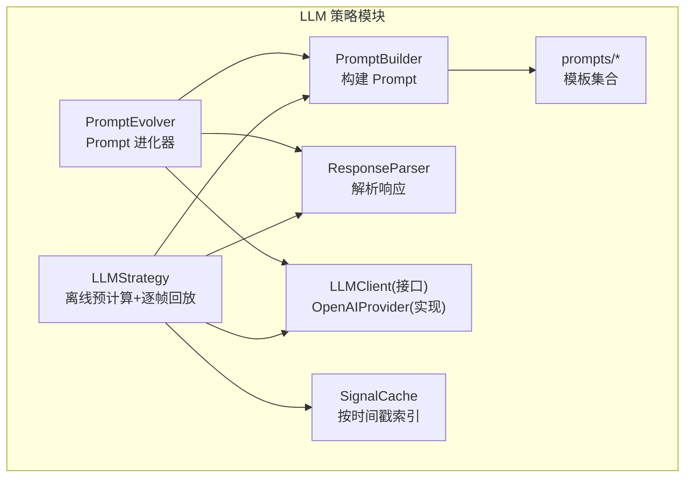
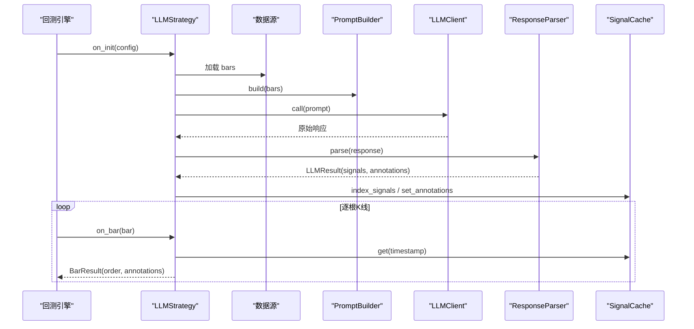
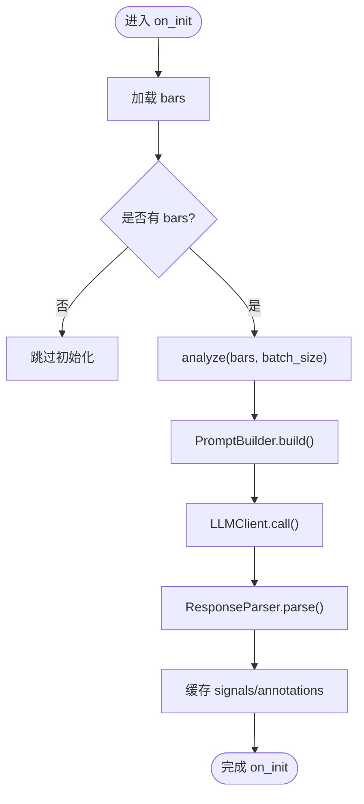
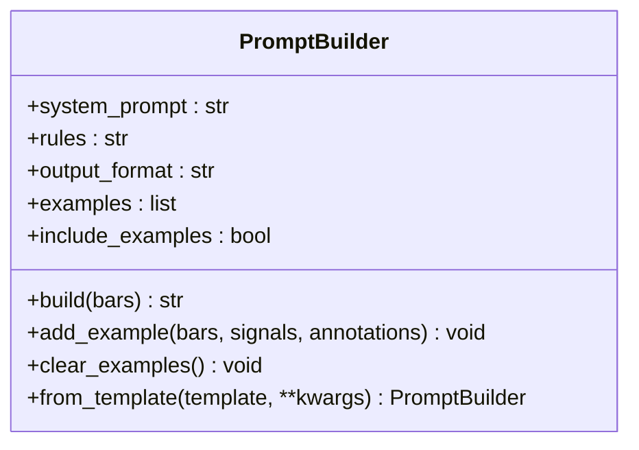
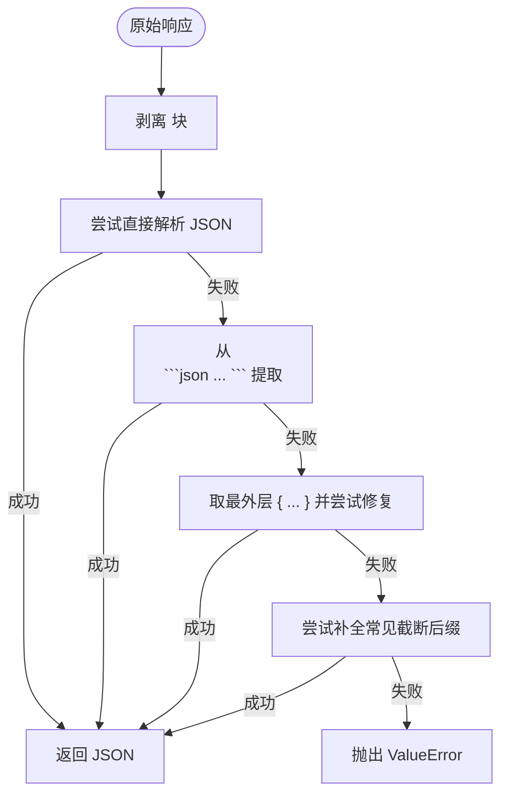
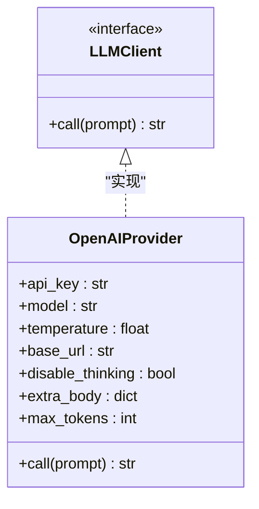
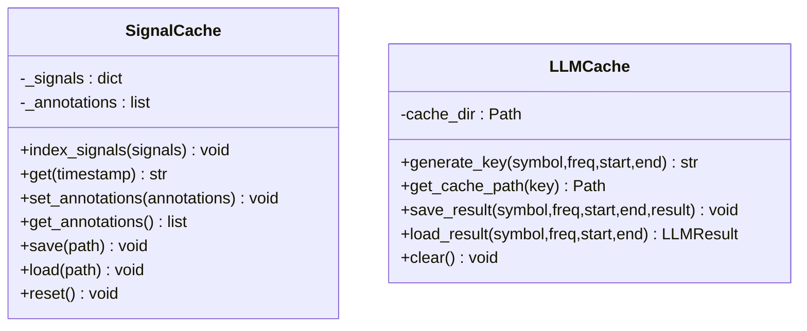
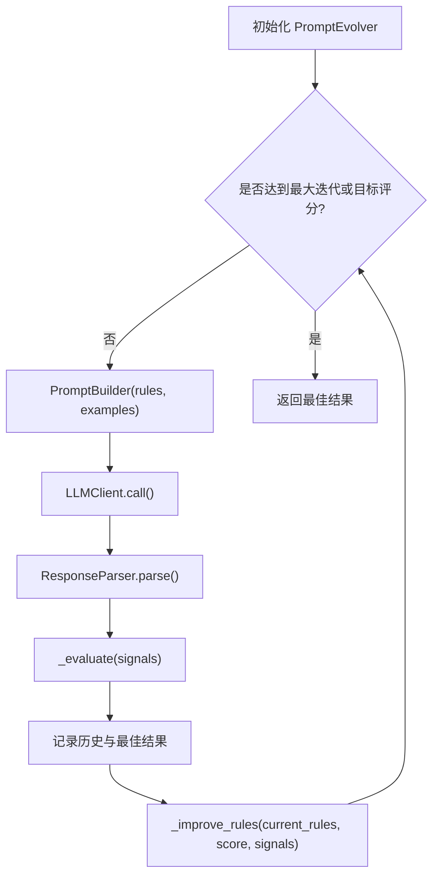
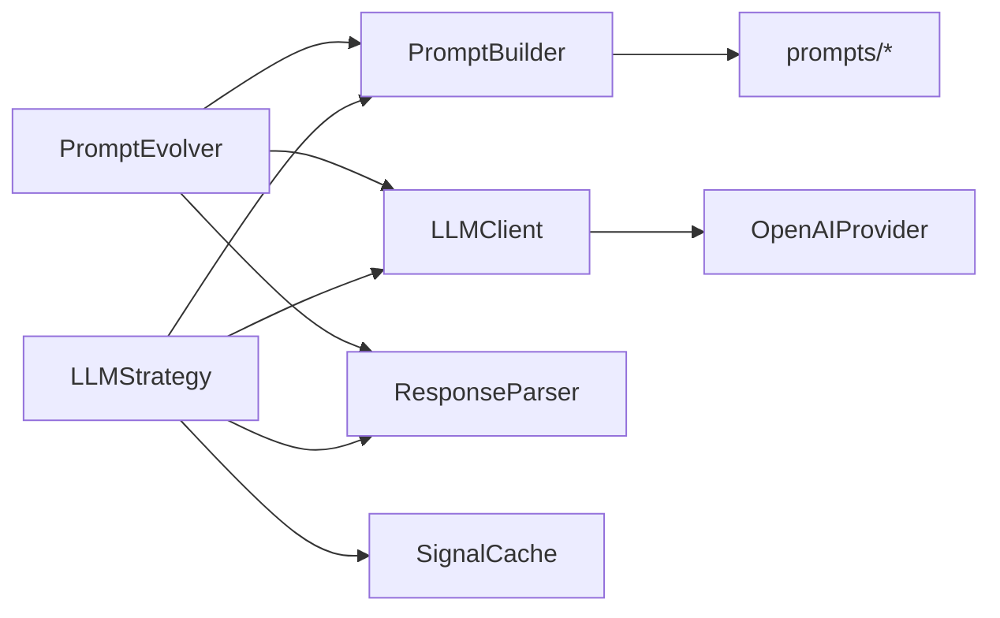

# LLM 策略

<cite>
**本文引用的文件**
- [src/caisen/strategy/llm/__init__.py](file://src/caisen/strategy/llm/__init__.py)
- [src/caisen/strategy/llm/strategy.py](file://src/caisen/strategy/llm/strategy.py)
- [src/caisen/strategy/llm/client.py](file://src/caisen/strategy/llm/client.py)
- [src/caisen/strategy/llm/provider.py](file://src/caisen/strategy/llm/provider.py)
- [src/caisen/strategy/llm/prompt.py](file://src/caisen/strategy/llm/prompt.py)
- [src/caisen/strategy/llm/response.py](file://src/caisen/strategy/llm/response.py)
- [src/caisen/strategy/llm/cache.py](file://src/caisen/strategy/llm/cache.py)
- [src/caisen/strategy/llm/evolver.py](file://src/caisen/strategy/llm/evolver.py)
- [src/caisen/strategy/llm/prompts/default.py](file://src/caisen/strategy/llm/prompts/default.py)
- [src/caisen/strategy/llm/prompts/caisen_pattern.py](file://src/caisen/strategy/llm/prompts/caisen_pattern.py)
- [configs/strategies/config_llm_example.yaml](file://configs/strategies/config_llm_example.yaml)
- [configs/strategies/config_llm_local.yaml](file://configs/strategies/config_llm_local.yaml)
- [tests/test_llm_strategy.py](file://tests/test_llm_strategy.py)
</cite>

## 目录
1. [简介](#简介)
2. [项目结构](#项目结构)
3. [核心组件](#核心组件)
4. [架构总览](#架构总览)
5. [详细组件分析](#详细组件分析)
6. [依赖关系分析](#依赖关系分析)
7. [性能与成本控制](#性能与成本控制)
8. [故障排查指南](#故障排查指南)
9. [结论](#结论)
10. [附录：配置与使用示例](#附录配置与使用示例)

## 简介
本文件面向 Caisen 量化回测系统的 LLM 策略功能，系统性阐述大语言模型驱动的交易决策机制、Prompt 工程与上下文构建策略、LLM 客户端抽象与多提供商支持、策略演化系统（历史表现分析、Prompt 自动优化、参数自适应调整）、缓存与成本控制、以及与代码策略的对比与混合使用模式。文档同时提供完整的配置示例、故障排查与性能优化建议，帮助读者快速上手并深入理解实现细节。

## 项目结构
LLM 策略位于 strategy/llm 子模块中，采用“离线预计算 + 逐帧回放”的架构：在 on_init 阶段一次性加载数据并调用 LLM 生成信号与标注，随后在 on_bar 阶段仅做查表与订单生成，从而显著降低在线推理成本并提升回测稳定性。

图示来源
- [src/caisen/strategy/llm/strategy.py:1-235](file://src/caisen/strategy/llm/strategy.py#L1-L235)
- [src/caisen/strategy/llm/prompt.py:1-153](file://src/caisen/strategy/llm/prompt.py#L1-L153)
- [src/caisen/strategy/llm/response.py:1-128](file://src/caisen/strategy/llm/response.py#L1-L128)
- [src/caisen/strategy/llm/client.py:1-38](file://src/caisen/strategy/llm/client.py#L1-L38)
- [src/caisen/strategy/llm/provider.py:1-75](file://src/caisen/strategy/llm/provider.py#L1-L75)
- [src/caisen/strategy/llm/cache.py:1-174](file://src/caisen/strategy/llm/cache.py#L1-L174)
- [src/caisen/strategy/llm/evolver.py:1-282](file://src/caisen/strategy/llm/evolver.py#L1-L282)
- [src/caisen/strategy/llm/prompts/default.py:1-154](file://src/caisen/strategy/llm/prompts/default.py#L1-L154)
- [src/caisen/strategy/llm/prompts/caisen_pattern.py:1-184](file://src/caisen/strategy/llm/prompts/caisen_pattern.py#L1-L184)

章节来源
- [src/caisen/strategy/llm/__init__.py:1-19](file://src/caisen/strategy/llm/__init__.py#L1-L19)
- [src/caisen/strategy/llm/strategy.py:1-235](file://src/caisen/strategy/llm/strategy.py#L1-L235)

## 核心组件
- LLMStrategy：策略入口，负责数据加载、批量分析、缓存与逐帧回放。
- PromptBuilder：组合系统提示、规则框架、Few-shot 示例与输出格式说明，拼装最终 Prompt。
- ResponseParser：从 LLM 原始响应中提取 JSON，支持思考块剥离、Markdown 代码块提取与截断降级。
- LLMClient/OpenAIProvider：统一调用接口与 OpenAI 兼容实现，支持自定义 base_url、温度、最大 token 等。
- SignalCache/LLMCache：信号按时间戳索引与持久化缓存，避免重复推理。
- PromptEvolver：基于评分反馈迭代优化 Prompt 规则与示例，产出最佳 Prompt。

章节来源
- [src/caisen/strategy/llm/strategy.py:1-235](file://src/caisen/strategy/llm/strategy.py#L1-L235)
- [src/caisen/strategy/llm/prompt.py:1-153](file://src/caisen/strategy/llm/prompt.py#L1-L153)
- [src/caisen/strategy/llm/response.py:1-128](file://src/caisen/strategy/llm/response.py#L1-L128)
- [src/caisen/strategy/llm/client.py:1-38](file://src/caisen/strategy/llm/client.py#L1-L38)
- [src/caisen/strategy/llm/provider.py:1-75](file://src/caisen/strategy/llm/provider.py#L1-L75)
- [src/caisen/strategy/llm/cache.py:1-174](file://src/caisen/strategy/llm/cache.py#L1-L174)
- [src/caisen/strategy/llm/evolver.py:1-282](file://src/caisen/strategy/llm/evolver.py#L1-L282)

## 架构总览
LLM 策略采用“离线预计算 + 逐帧回放”的两阶段流程：
- 离线阶段（on_init）：加载 K 线数据 → 分批构建 Prompt → 调用 LLM → 解析响应 → 缓存 signals 与 annotations。
- 回放阶段（on_bar）：根据当前 bar 的时间戳查询缓存，结合持仓状态生成买入/卖出订单或空操作。

图示来源
- [src/caisen/strategy/llm/strategy.py:131-225](file://src/caisen/strategy/llm/strategy.py#L131-L225)
- [src/caisen/strategy/llm/prompt.py:54-116](file://src/caisen/strategy/llm/prompt.py#L54-L116)
- [src/caisen/strategy/llm/response.py:88-113](file://src/caisen/strategy/llm/response.py#L88-L113)
- [src/caisen/strategy/llm/cache.py:15-44](file://src/caisen/strategy/llm/cache.py#L15-L44)

## 详细组件分析

### LLMStrategy（离线预计算 + 逐帧回放）
- 职责
  - 初始化时根据配置创建 LLM 客户端与 Prompt 构建器。
  - 一次性加载数据并调用 analyze 进行批量分析，结果写入缓存。
  - on_bar 阶段依据缓存与持仓状态生成订单。
- 关键流程
  - analyze：按 batch_size 分批构建 Prompt 并调用 LLM，合并结果。
  - on_init：优先使用注入的数据源，否则使用本地数据源；将 signals 与 annotations 入缓存。
  - on_bar：首次调用时一次性发出所有标注；根据 action 与持仓切换生成 BUY/SELL 或 None。
- 错误处理
  - 缺失 prompt_builder 或 llm_client 时抛出异常。
  - 未知 annotation type 时降级为文本标注并告警。

图示来源
- [src/caisen/strategy/llm/strategy.py:98-179](file://src/caisen/strategy/llm/strategy.py#L98-L179)
- [src/caisen/strategy/llm/strategy.py:180-225](file://src/caisen/strategy/llm/strategy.py#L180-L225)

章节来源
- [src/caisen/strategy/llm/strategy.py:1-235](file://src/caisen/strategy/llm/strategy.py#L1-L235)
- [tests/test_llm_strategy.py:1-200](file://tests/test_llm_strategy.py#L1-L200)

### PromptBuilder（Prompt 工程与上下文构建）
- 设计要点
  - 默认使用蔡森专用模板（caisen_pattern），也可替换为通用模板（default）。
  - 支持 Few-shot 示例注入与内置精简示例开关，避免推理模型因示例过多导致 thinking token 消耗过大。
  - 输出纯 JSON 数据，避免 markdown 代码块诱导 LLM 以代码块形式返回。
- 构建顺序
  - 系统提示 → 规则框架 → 示例（可选）→ 输出格式说明 → 实际 K 线数据。
- 扩展性
  - 支持 from_template 工厂方法，便于从外部配置加载模板。

图示来源
- [src/caisen/strategy/llm/prompt.py:15-153](file://src/caisen/strategy/llm/prompt.py#L15-L153)
- [src/caisen/strategy/llm/prompts/default.py:100-154](file://src/caisen/strategy/llm/prompts/default.py#L100-L154)
- [src/caisen/strategy/llm/prompts/caisen_pattern.py:1-184](file://src/caisen/strategy/llm/prompts/caisen_pattern.py#L1-L184)

章节来源
- [src/caisen/strategy/llm/prompt.py:1-153](file://src/caisen/strategy/llm/prompt.py#L1-L153)
- [src/caisen/strategy/llm/prompts/default.py:1-154](file://src/caisen/strategy/llm/prompts/default.py#L1-L154)
- [src/caisen/strategy/llm/prompts/caisen_pattern.py:1-184](file://src/caisen/strategy/llm/prompts/caisen_pattern.py#L1-L184)

### ResponseParser（响应解析与健壮性）
- 能力
  - 剥离推理模型的 <think>...</think> 思考块。
  - 从 Markdown 代码块或直接文本中提取 JSON。
  - 对截断响应进行降级修复（补全尾部括号/方括号）。
  - 校验 signals 必需字段（timestamp、action）。
- 失败路径
  - 无法提取合法 JSON 时抛出 ValueError，便于上层捕获与重试。

图示来源
- [src/caisen/strategy/llm/response.py:10-128](file://src/caisen/strategy/llm/response.py#L10-L128)

章节来源
- [src/caisen/strategy/llm/response.py:1-128](file://src/caisen/strategy/llm/response.py#L1-L128)

### LLMClient 与 OpenAIProvider（多提供商抽象）
- 抽象层
  - LLMClient 定义单一职责接口 call(prompt) -> str。
- 实现层
  - OpenAIProvider 支持自定义 base_url（vLLM、Ollama 等）、temperature、max_tokens、disable_thinking 与 extra_body 透传。
  - 当 disable_thinking=True 且未显式传入 extra_body 时，自动附加 {"thinking":{"type":"disabled"}}。
- 兼容性
  - 通过 base_url 可对接任意 OpenAI 兼容 API，无需修改上层逻辑。

图示来源
- [src/caisen/strategy/llm/client.py:21-38](file://src/caisen/strategy/llm/client.py#L21-L38)
- [src/caisen/strategy/llm/provider.py:8-75](file://src/caisen/strategy/llm/provider.py#L8-L75)

章节来源
- [src/caisen/strategy/llm/client.py:1-38](file://src/caisen/strategy/llm/client.py#L1-L38)
- [src/caisen/strategy/llm/provider.py:1-75](file://src/caisen/strategy/llm/provider.py#L1-L75)

### 缓存机制（SignalCache 与 LLMCache）
- SignalCache
  - 按 timestamp 索引 action，默认无信号返回 hold。
  - 支持保存/加载到 JSON 文件，便于跨进程复用。
- LLMCache
  - 管理完整回测的缓存键（symbol/freq/start/end），提供 save/load/clear 能力。
  - 用于避免重复推理，显著降低成本与耗时。

图示来源
- [src/caisen/strategy/llm/cache.py:8-86](file://src/caisen/strategy/llm/cache.py#L8-L86)
- [src/caisen/strategy/llm/cache.py:88-174](file://src/caisen/strategy/llm/cache.py#L88-L174)

章节来源
- [src/caisen/strategy/llm/cache.py:1-174](file://src/caisen/strategy/llm/cache.py#L1-L174)

### 策略演化系统（PromptEvolver）
- 目标
  - 基于历史表现评估 Prompt 质量，自动改进规则与示例，直至达到目标评分或收敛。
- 流程
  - 初始化基础 Prompt → 运行测试 → 评估信号质量（含交易频率惩罚）→ 记录历史 → 改进规则 → 迭代。
- 评估指标
  - 平均单笔盈亏、交易频率惩罚（避免过度交易）。
- 输出
  - EvolutionResult 包含迭代次数、评分、Prompt、信号、模拟交易与改进幅度。

图示来源
- [src/caisen/strategy/llm/evolver.py:24-119](file://src/caisen/strategy/llm/evolver.py#L24-L119)
- [src/caisen/strategy/llm/evolver.py:121-219](file://src/caisen/strategy/llm/evolver.py#L121-L219)

章节来源
- [src/caisen/strategy/llm/evolver.py:1-282](file://src/caisen/strategy/llm/evolver.py#L1-L282)

## 依赖关系分析
- 模块内耦合
  - LLMStrategy 依赖 PromptBuilder、LLMClient、ResponseParser、SignalCache。
  - PromptBuilder 依赖 prompts 模板集合。
  - OpenAIProvider 实现 LLMClient 接口。
  - PromptEvolver 依赖 PromptBuilder、LLMClient、ResponseParser。
- 外部依赖
  - OpenAIProvider 依赖 openai SDK（可通过 base_url 指向任意兼容服务）。
  - 数据加载依赖 DataConfig 与 LocalDataSource（在 LLMStrategy 内部按需导入）。

图示来源
- [src/caisen/strategy/llm/strategy.py:1-235](file://src/caisen/strategy/llm/strategy.py#L1-L235)
- [src/caisen/strategy/llm/prompt.py:1-153](file://src/caisen/strategy/llm/prompt.py#L1-L153)
- [src/caisen/strategy/llm/response.py:1-128](file://src/caisen/strategy/llm/response.py#L1-L128)
- [src/caisen/strategy/llm/client.py:1-38](file://src/caisen/strategy/llm/client.py#L1-L38)
- [src/caisen/strategy/llm/provider.py:1-75](file://src/caisen/strategy/llm/provider.py#L1-L75)
- [src/caisen/strategy/llm/evolver.py:1-282](file://src/caisen/strategy/llm/evolver.py#L1-L282)

章节来源
- [src/caisen/strategy/llm/__init__.py:1-19](file://src/caisen/strategy/llm/__init__.py#L1-L19)

## 性能与成本控制
- 分批推理
  - analyze 支持按 batch_size 分批调用 LLM，避免长序列导致的 thinking token 过高与响应截断。
- 缓存复用
  - SignalCache 与 LLMCache 避免重复推理，显著降低 API 调用成本与延迟。
- 温度与最大 token
  - temperature 控制随机性；max_tokens 需针对推理模型适当提高，防止 JSON 被截断。
- 禁用思考输出
  - disable_thinking=True 可减少不必要的思考输出，降低 token 消耗。
- Few-shot 示例控制
  - include_examples=False 默认关闭内置示例，避免额外 token 开销；仅在非推理模型或明确需要时开启。

[本节为通用指导，不直接分析具体文件]

## 故障排查指南
- 无法提取合法 JSON
  - 现象：ResponseParser 抛出 ValueError。
  - 排查：检查模型 max_tokens 设置、减少 K 线数量、确认 Prompt 强制要求纯 JSON 输出。
- 响应在思考阶段被截断
  - 现象：检测到 <think> 开头但未闭合。
  - 排查：增大 max_tokens 或启用 disable_thinking。
- 未知 annotation type
  - 现象：警告并降级为文本标注。
  - 排查：确保 LLM 返回的 type 属于预期枚举，必要时在 Prompt 中强化约束。
- 本地部署模型连接失败
  - 现象：OpenAIProvider 调用报错。
  - 排查：确认 base_url、api_key（本地可为 dummy）、端口可达性与模型名称正确。

章节来源
- [src/caisen/strategy/llm/response.py:10-76](file://src/caisen/strategy/llm/response.py#L10-L76)
- [src/caisen/strategy/llm/provider.py:45-75](file://src/caisen/strategy/llm/provider.py#L45-L75)
- [src/caisen/strategy/llm/strategy.py:180-225](file://src/caisen/strategy/llm/strategy.py#L180-L225)

## 结论
LLM 策略通过“离线预计算 + 逐帧回放”的架构，在保证决策质量的同时显著降低了在线推理成本。Prompt 工程与响应解析具备较强的鲁棒性，配合缓存与策略演化系统，可实现持续优化与低成本迭代。OpenAI 兼容抽象使得接入多种提供商成为可能，便于在不同环境（云端/本地）灵活部署。

[本节为总结性内容，不直接分析具体文件]

## 附录：配置与使用示例
- 云端 OpenAI 配置示例
  - provider=openai，api_key 支持环境变量占位符，model 与 temperature 可调。
  - rules 与 examples 可在 YAML 中指定，cache_enabled 与 cache_dir 控制缓存行为。
- 本地部署模型配置示例
  - 使用 OpenAI 兼容接口，base_url 指向本地服务，api_key 设为 dummy。
  - 建议设置 disable_thinking=true 与较大的 max_tokens，避免 JSON 截断。
- 典型工作流
  - 准备数据与配置文件 → 启动回测 → 观察缓存命中与信号回放 → 如需优化，使用 PromptEvolver 进行自动化迭代。

章节来源
- [configs/strategies/config_llm_example.yaml:1-40](file://configs/strategies/config_llm_example.yaml#L1-L40)
- [configs/strategies/config_llm_local.yaml:1-36](file://configs/strategies/config_llm_local.yaml#L1-L36)